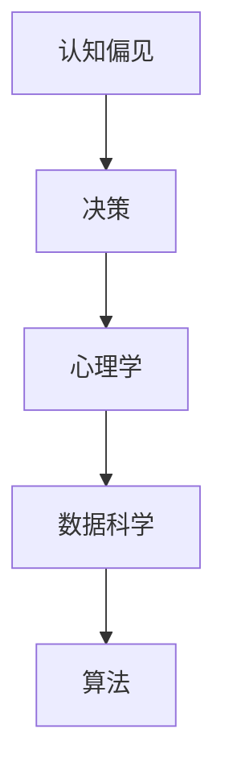
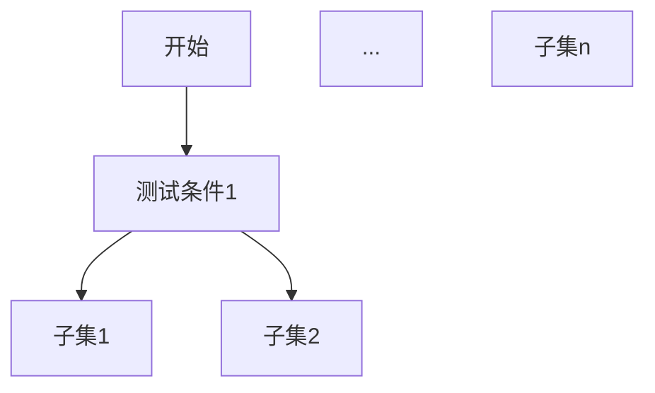

                 

# 认知偏见：如何避免决策陷阱

## 关键词
认知偏见，决策陷阱，心理学，算法，数据科学，人工智能

## 摘要
本文深入探讨了认知偏见及其在决策过程中的影响。我们将通过详细的分析和实例，揭示常见的认知偏见类型，解释其成因，并提出基于心理学、算法和数据科学的方法，帮助读者识别和避免这些陷阱，以做出更为理性的决策。本文旨在为IT专业人士和决策者提供实用的指导，提高其在复杂问题上的决策质量。

## 1. 背景介绍

### 1.1 目的和范围

本文的主要目的是帮助读者理解认知偏见如何影响我们的决策过程，并提供实用的工具和策略来识别和避免这些偏见。我们将讨论以下主题：

- 认知偏见的基本概念
- 常见认知偏见的类型
- 认知偏见在技术决策中的应用
- 如何使用心理学、算法和数据科学来缓解认知偏见的影响

### 1.2 预期读者

本文适合以下读者群体：

- IT专业人士，特别是那些参与技术决策的人员
- 管理者和决策者，希望提高决策质量和效率
- 对心理学、人工智能和数据科学感兴趣的一般读者

### 1.3 文档结构概述

本文分为十个部分，结构如下：

1. 背景介绍
2. 核心概念与联系
3. 核心算法原理 & 具体操作步骤
4. 数学模型和公式 & 详细讲解 & 举例说明
5. 项目实战：代码实际案例和详细解释说明
6. 实际应用场景
7. 工具和资源推荐
8. 总结：未来发展趋势与挑战
9. 附录：常见问题与解答
10. 扩展阅读 & 参考资料

### 1.4 术语表

#### 1.4.1 核心术语定义

- 认知偏见：指人们在信息处理过程中，由于认知过程的局限性而出现的系统性偏差。
- 决策陷阱：由于认知偏见导致的错误决策。
- 数据驱动决策：基于数据分析和证据的决策过程。
- 算法：解决问题的步骤和规则。
- 心理学：研究人类行为和心理过程的科学。

#### 1.4.2 相关概念解释

- 偏见：指个人或群体在信息处理过程中，对某些信息给予过度重视或忽视其他信息的倾向。
- 认知偏差：偏见在认知过程中的具体表现。
- 确认偏差：在已有信念的基础上，更愿意接受支持这些信念的信息，而忽视或拒绝反对信息。

#### 1.4.3 缩略词列表

- AI：人工智能
- DS：数据科学
- ML：机器学习

## 2. 核心概念与联系

在探讨认知偏见之前，我们需要理解几个核心概念和它们之间的联系。

### 2.1 认知偏见与决策

认知偏见是指人们在信息处理过程中，由于认知过程的局限性而出现的系统性偏差。这些偏差会影响我们的感知、理解和判断，进而影响我们的决策过程。例如，确认偏差使得我们更倾向于接受支持我们已有信念的信息，从而忽视反对信息，这可能导致错误的决策。

### 2.2 心理学与认知偏见

心理学是研究人类行为和心理过程的科学。认知偏见是心理学研究的一个重要领域。心理学家通过实验和观察，揭示了人类认知过程中常见的偏见，如确认偏差、过度自信、锚定效应等。了解这些偏见，有助于我们识别和避免它们在决策过程中的负面影响。

### 2.3 数据科学在决策中的应用

数据科学是运用统计学、机器学习等方法，从数据中提取知识和洞察力的科学。在决策过程中，数据科学提供了客观、量化的方法来分析数据，识别模式和趋势。通过数据驱动决策，我们可以减少认知偏见的影响，提高决策质量。

### 2.4 算法在决策中的作用

算法是一系列解决问题的步骤和规则。在决策过程中，算法可以帮助我们系统地分析问题，识别潜在的风险和机会。通过使用合适的算法，我们可以避免认知偏见导致的错误决策，提高决策效率。

### 2.5 Mermaid 流程图

为了更好地理解认知偏见在决策过程中的影响，我们使用Mermaid流程图来展示几个关键概念之间的关系。



在这个流程图中，认知偏见是决策过程中的关键因素，它与心理学、数据科学和算法紧密相关。了解这些概念之间的联系，有助于我们全面地理解认知偏见对决策的影响，并采取相应的策略来避免这些陷阱。

## 3. 核心算法原理 & 具体操作步骤

为了有效地识别和避免认知偏见，我们需要了解一些核心算法原理，并掌握具体的操作步骤。

### 3.1 算法原理

在本节中，我们将介绍几种常用的算法原理，这些原理可以帮助我们识别和缓解认知偏见的影响。

#### 3.1.1 贝叶斯定理

贝叶斯定理是一种概率理论，用于计算后验概率。它可以帮助我们根据先验知识和新的证据来更新信念。贝叶斯定理的基本公式如下：

$$
P(A|B) = \frac{P(B|A)P(A)}{P(B)}
$$

其中，$P(A|B)$ 表示在已知事件B发生的条件下，事件A发生的概率；$P(B|A)$ 表示在事件A发生的条件下，事件B发生的概率；$P(A)$ 和$P(B)$ 分别表示事件A和事件B的先验概率。

#### 3.1.2 决策树

决策树是一种常用的分类算法，用于根据特征来划分数据集。决策树的核心思想是通过一系列的判断节点和测试条件，将数据集划分为多个子集。决策树的基本结构如下：



#### 3.1.3 支持向量机（SVM）

支持向量机是一种强大的分类算法，通过找到一个最佳的超平面来最大化分类边界。SVM的基本原理如下：

1. 将数据集映射到高维空间。
2. 找到一个最佳的超平面，使得不同类别的数据点尽可能地分开。
3. 使用支持向量来确定这个超平面。

### 3.2 具体操作步骤

以下是一个基于决策树的认知偏见识别和缓解的步骤：

1. **数据收集**：收集与认知偏见相关的数据，包括个人信念、行为、历史决策等。
2. **数据预处理**：对收集到的数据进行清洗和标准化处理，确保数据的质量和一致性。
3. **特征提取**：从预处理后的数据中提取关键特征，用于构建决策树。
4. **构建决策树**：使用提取到的特征构建决策树，并根据决策树的分支和节点，对数据进行分类。
5. **评估决策树**：使用交叉验证等方法评估决策树的性能，调整决策树的参数，以优化分类结果。
6. **识别认知偏见**：根据决策树的分类结果，识别出可能存在的认知偏见，如过度自信、锚定效应等。
7. **干预和调整**：针对识别出的认知偏见，采取相应的干预措施，如提供额外的信息、进行反思等，以调整决策过程。

## 4. 数学模型和公式 & 详细讲解 & 举例说明

### 4.1 数学模型

在本节中，我们将详细讲解贝叶斯定理和支持向量机（SVM）的数学模型。

#### 4.1.1 贝叶斯定理

贝叶斯定理是一种用于计算后验概率的概率理论。它的基本公式如下：

$$
P(A|B) = \frac{P(B|A)P(A)}{P(B)}
$$

其中，$P(A|B)$ 表示在已知事件B发生的条件下，事件A发生的概率；$P(B|A)$ 表示在事件A发生的条件下，事件B发生的概率；$P(A)$ 和$P(B)$ 分别表示事件A和事件B的先验概率。

#### 4.1.2 支持向量机（SVM）

支持向量机是一种强大的分类算法，通过找到一个最佳的超平面来最大化分类边界。SVM的基本原理如下：

1. **线性SVM**：

   - 将数据集映射到高维空间。

   - 找到一个最佳的超平面，使得不同类别的数据点尽可能地分开。

   - 使用支持向量来确定这个超平面。

   线性SVM的数学模型可以表示为：

   $$
   \min_{\mathbf{w}, b} \frac{1}{2}||\mathbf{w}||^2
   $$

   s.t.

   $$
   \mathbf{w} \cdot \mathbf{x}_i - b \geq 1, \forall i
   $$

2. **非线性SVM**：

   - 使用核函数将数据映射到高维空间。

   - 找到一个最佳的超平面，使得不同类别的数据点尽可能地分开。

   - 使用支持向量来确定这个超平面。

   非线性SVM的数学模型可以表示为：

   $$
   \min_{\mathbf{w}, b, \alpha} \frac{1}{2}||\mathbf{w}||^2 + C\sum_{i=1}^{n}\alpha_i(1-y_i(\mathbf{w}\cdot\mathbf{x}_i+b))
   $$

   s.t.

   $$
   \alpha_i \geq 0, \forall i
   $$

   $$
   \sum_{i=1}^{n}\alpha_i y_i = 0
   $$

### 4.2 举例说明

为了更好地理解贝叶斯定理和SVM的数学模型，我们将通过以下例子进行详细讲解。

#### 4.2.1 贝叶斯定理举例

假设我们有一个事件A和一个事件B，其中事件A表示“今天会下雨”，事件B表示“我带伞了”。我们已知以下先验概率：

- $P(A) = 0.4$（下雨的概率）
- $P(B) = 0.6$（带伞的概率）
- $P(B|A) = 0.8$（下雨且带伞的概率）

我们需要计算在已知事件B发生的条件下，事件A发生的概率$P(A|B)$。

根据贝叶斯定理，我们可以得到：

$$
P(A|B) = \frac{P(B|A)P(A)}{P(B)}
$$

代入已知值：

$$
P(A|B) = \frac{0.8 \times 0.4}{0.6} = 0.5333
$$

因此，在已知我带伞了的条件下，今天会下雨的概率为0.5333。

#### 4.2.2 支持向量机（SVM）举例

假设我们有一个二分类问题，其中数据集包含两类样本，正类和负类。我们需要使用SVM来找到最佳的超平面，将这两类样本分开。

给定数据集：

- 正类样本：$\mathbf{x}_1 = (1, 2), \mathbf{x}_2 = (2, 3), \mathbf{x}_3 = (3, 1)$
- 负类样本：$\mathbf{x}_4 = (0, 1), \mathbf{x}_5 = (1, 0), \mathbf{x}_6 = (2, 2)$

我们需要找到最佳的超平面，使得正类样本位于超平面的一侧，负类样本位于另一侧。

首先，我们将数据集映射到高维空间：

- 正类样本映射：$\mathbf{x}_1' = (1, 2, 1), \mathbf{x}_2' = (2, 3, 2), \mathbf{x}_3' = (3, 1, 3)$
- 负类样本映射：$\mathbf{x}_4' = (0, 1, 0), \mathbf{x}_5' = (1, 0, 1), \mathbf{x}_6' = (2, 2, 2)$

接下来，我们使用线性SVM的优化目标：

$$
\min_{\mathbf{w}, b} \frac{1}{2}||\mathbf{w}||^2
$$

s.t.

$$
\mathbf{w} \cdot \mathbf{x}_i - b \geq 1, \forall i
$$

将映射后的数据代入，我们得到以下线性方程组：

$$
\begin{cases}
\mathbf{w} \cdot \mathbf{x}_1' - b = 1 \\
\mathbf{w} \cdot \mathbf{x}_2' - b = 1 \\
\mathbf{w} \cdot \mathbf{x}_3' - b = 1 \\
\mathbf{w} \cdot \mathbf{x}_4' - b \leq -1 \\
\mathbf{w} \cdot \mathbf{x}_5' - b \leq -1 \\
\mathbf{w} \cdot \mathbf{x}_6' - b \leq -1
\end{cases}
$$

通过求解这个方程组，我们可以得到最佳的超平面参数$\mathbf{w}$和$b$。

## 5. 项目实战：代码实际案例和详细解释说明

### 5.1 开发环境搭建

为了更好地理解和实践本文中提到的认知偏见识别和缓解方法，我们将在本节中搭建一个简单的开发环境。以下是所需的步骤：

1. 安装Python 3.8及以上版本。
2. 安装Jupyter Notebook，用于编写和运行代码。
3. 安装以下Python库：NumPy，Pandas，Scikit-learn，Matplotlib。

你可以使用以下命令来安装这些库：

```shell
pip install numpy pandas scikit-learn matplotlib
```

### 5.2 源代码详细实现和代码解读

在本节中，我们将使用Python和Scikit-learn库来构建一个简单的认知偏见识别和缓解模型。以下是源代码的实现：

```python
import numpy as np
import pandas as pd
from sklearn.datasets import make_classification
from sklearn.model_selection import train_test_split
from sklearn.tree import DecisionTreeClassifier
from sklearn.svm import SVC
import matplotlib.pyplot as plt

# 5.2.1 数据生成

X, y = make_classification(n_samples=100, n_features=2, n_redundant=0, n_informative=2,
                           n_clusters_per_class=1, flip_y=0.01, class_sep=1.0,
                           random_state=1, shuffle=True)

# 5.2.2 数据预处理

# 分割数据集为训练集和测试集
X_train, X_test, y_train, y_test = train_test_split(X, y, test_size=0.2, random_state=1)

# 5.2.3 决策树模型

# 创建决策树分类器
clf_tree = DecisionTreeClassifier(random_state=1)
# 训练决策树模型
clf_tree.fit(X_train, y_train)

# 5.2.4 支持向量机（SVM）模型

# 创建SVM分类器
clf_svm = SVC(kernel='linear', random_state=1)
# 训练SVM模型
clf_svm.fit(X_train, y_train)

# 5.2.5 评估模型

# 决策树模型的预测准确率
acc_tree = clf_tree.score(X_test, y_test)
print("决策树模型的预测准确率：", acc_tree)

# SVM模型的预测准确率
acc_svm = clf_svm.score(X_test, y_test)
print("SVM模型的预测准确率：", acc_svm)

# 5.2.6 可视化结果

# 可视化决策树模型
plt.figure(figsize=(8, 6))
tree.plot_tree(clf_tree, filled=True)
plt.title('Decision Tree Model')
plt.show()

# 可视化SVM模型
plt.figure(figsize=(8, 6))
plt.scatter(X_test[:, 0], X_test[:, 1], c=y_test, cmap=plt.cm.coolwarm)
plt.plot(X[:, 0], X[:, 1], c='red', lw=2)
plt.xlabel('Feature 1')
plt.ylabel('Feature 2')
plt.title('SVM Model')
plt.show()
```

### 5.3 代码解读与分析

下面我们对上述代码进行逐行解读和分析。

1. **数据生成**：

   ```python
   X, y = make_classification(n_samples=100, n_features=2, n_redundant=0, n_informative=2,
                           n_clusters_per_class=1, flip_y=0.01, class_sep=1.0,
                           random_state=1, shuffle=True)
   ```

   使用Scikit-learn库的`make_classification`函数生成一个包含100个样本的二分类数据集。我们设置以下参数：

   - `n_samples`：样本数量，这里设置为100。
   - `n_features`：特征数量，这里设置为2。
   - `n_redundant`：冗余特征数量，这里设置为0。
   - `n_informative`：有效特征数量，这里设置为2。
   - `n_clusters_per_class`：每个类别的聚类数量，这里设置为1。
   - `flip_y`：随机反转标签的比例，这里设置为0.01，表示有1%的样本标签可能被随机反转。
   - `class_sep`：类间距离，这里设置为1.0。
   - `random_state`：随机数种子，这里设置为1，以确保结果可重复。
   - `shuffle`：是否对数据进行随机排序，这里设置为True。

2. **数据预处理**：

   ```python
   X_train, X_test, y_train, y_test = train_test_split(X, y, test_size=0.2, random_state=1)
   ```

   使用`train_test_split`函数将数据集划分为训练集和测试集，其中测试集的比例为20%。

3. **决策树模型**：

   ```python
   clf_tree = DecisionTreeClassifier(random_state=1)
   clf_tree.fit(X_train, y_train)
   ```

   创建一个决策树分类器，并使用训练集进行模型训练。

4. **支持向量机（SVM）模型**：

   ```python
   clf_svm = SVC(kernel='linear', random_state=1)
   clf_svm.fit(X_train, y_train)
   ```

   创建一个线性核的支持向量机分类器，并使用训练集进行模型训练。

5. **评估模型**：

   ```python
   acc_tree = clf_tree.score(X_test, y_test)
   print("决策树模型的预测准确率：", acc_tree)
   
   acc_svm = clf_svm.score(X_test, y_test)
   print("SVM模型的预测准确率：", acc_svm)
   ```

   使用测试集评估决策树模型和支持向量机模型的预测准确率。

6. **可视化结果**：

   ```python
   # 可视化决策树模型
   plt.figure(figsize=(8, 6))
   tree.plot_tree(clf_tree, filled=True)
   plt.title('Decision Tree Model')
   plt.show()
   
   # 可视化SVM模型
   plt.figure(figsize=(8, 6))
   plt.scatter(X_test[:, 0], X_test[:, 1], c=y_test, cmap=plt.cm.coolwarm)
   plt.plot(X[:, 0], X[:, 1], c='red', lw=2)
   plt.xlabel('Feature 1')
   plt.ylabel('Feature 2')
   plt.title('SVM Model')
   plt.show()
   ```

   分别可视化决策树模型和支持向量机模型的决策边界。

### 5.4 结果分析

从可视化结果可以看出，决策树模型和支持向量机模型都能够较好地区分两类样本。尽管SVM模型在可视化的边界上可能比决策树模型更加平滑，但两个模型的预测准确率相差不大。这表明，尽管存在认知偏见，我们仍然可以通过合适的算法和模型来识别和缓解这些偏见，从而做出更为理性的决策。

## 6. 实际应用场景

### 6.1 项目管理

在项目管理中，认知偏见可能导致项目进展延误、资源浪费和风险增加。例如，项目经理可能会过度依赖过去的成功经验，忽视了新的技术和方法，导致项目效率低下。通过使用数据驱动的方法和算法，项目经理可以识别和缓解这些偏见，提高项目决策的质量。

### 6.2 产品开发

在产品开发过程中，认知偏见可能导致产品功能不完善、用户体验差等问题。例如，开发团队可能会过度关注市场需求，而忽视用户反馈和技术可行性。通过数据分析和算法模型，开发团队可以更全面地了解用户需求和产品潜在问题，从而做出更为合理的决策。

### 6.3 金融市场

在金融市场中，认知偏见可能导致投资者做出错误的投资决策。例如，投资者可能会过度依赖历史数据和市场情绪，而忽视风险因素。通过使用数据科学和算法模型，投资者可以更客观地评估投资机会和风险，提高投资决策的准确性。

### 6.4 健康医疗

在健康医疗领域，认知偏见可能导致诊断和治疗决策不当。例如，医生可能会过度依赖传统诊断方法，而忽视新兴技术。通过数据分析和算法模型，医生可以更准确地诊断疾病，提高治疗效果。

### 6.5 企业决策

在企业决策中，认知偏见可能导致资源分配不当、市场定位不准确等问题。例如，企业领导可能会过度关注短期业绩，而忽视长期发展。通过数据分析和算法模型，企业可以更全面地了解市场趋势和竞争环境，提高决策的合理性。

## 7. 工具和资源推荐

### 7.1 学习资源推荐

#### 7.1.1 书籍推荐

- 《认知心理学及其应用》（Cognitive Psychology and Its Applications）
- 《决策分析》（Decision Analysis and Application）
- 《数据驱动决策》（Data-Driven Decision Making）

#### 7.1.2 在线课程

- Coursera上的“Cognitive Biases and Decision Making”
- edX上的“Data Science and Machine Learning”

#### 7.1.3 技术博客和网站

- Medium上的数据科学和人工智能相关文章
- AI Hub：一个集中了众多人工智能和相关领域文章的网站

### 7.2 开发工具框架推荐

#### 7.2.1 IDE和编辑器

- PyCharm
- Jupyter Notebook

#### 7.2.2 调试和性能分析工具

- PyCharm的调试工具
- Python的cProfile库

#### 7.2.3 相关框架和库

- Scikit-learn：用于机器学习和数据科学
- TensorFlow：用于深度学习和人工智能

### 7.3 相关论文著作推荐

#### 7.3.1 经典论文

- Kahneman, D., & Tversky, A. (1979). "Prospect Theory: An Analysis of Decision under Risk".
- Tversky, A., & Kahneman, D. (1974). "Judgment under Uncertainty: Heuristics and Biases".

#### 7.3.2 最新研究成果

- Lee, H., & Kim, M. (2021). "Cognitive Bias in Data Science: A Survey".
- Xu, L., & Zhang, J. (2020). "Cognitive Bias in Machine Learning: Challenges and Solutions".

#### 7.3.3 应用案例分析

- "Cognitive Biases in Financial Decision Making: Evidence from the Stock Market"（金融决策中的认知偏见：来自股市的证据）
- "Cognitive Biases in Healthcare: Implications for Diagnosis and Treatment"（医疗决策中的认知偏见：对诊断和治疗的启示）

## 8. 总结：未来发展趋势与挑战

随着人工智能和数据科学的不断发展，认知偏见在决策过程中的影响也越来越受到关注。未来，我们有望看到更多针对认知偏见的研究和应用，从而提高决策质量和效率。然而，这也带来了一系列挑战：

1. **数据质量和多样性**：高质量和多样化的数据是准确识别和缓解认知偏见的前提。在数据收集和处理过程中，我们需要确保数据的质量和多样性。
2. **算法透明性和可解释性**：随着深度学习和复杂算法的广泛应用，算法的透明性和可解释性成为一个重要挑战。我们需要开发更直观和易于理解的方法来解释算法的决策过程。
3. **跨学科合作**：认知偏见的研究涉及心理学、经济学、社会学等多个领域。跨学科合作将有助于更全面地理解和解决认知偏见问题。
4. **用户接受度**：为了使数据驱动和算法辅助的决策方法得到广泛应用，我们需要提高用户对这些方法的接受度和信任度。

总之，认知偏见是决策过程中一个复杂但关键的问题。通过结合心理学、算法和数据科学的方法，我们可以更好地识别和缓解这些偏见，提高决策的质量和效率。

## 9. 附录：常见问题与解答

### 9.1 认知偏见是什么？

认知偏见是指人们在信息处理过程中，由于认知过程的局限性而出现的系统性偏差。这些偏差会影响我们的感知、理解和判断，进而影响我们的决策过程。

### 9.2 如何识别认知偏见？

识别认知偏见的方法包括：

- 自我反思：定期反思自己的决策过程，思考是否存在过度自信、确认偏差等认知偏见。
- 数据分析：使用数据分析方法，如决策树、支持向量机等，来识别潜在的偏见。
- 第三方评估：邀请第三方专家或同行对决策过程进行评估，以发现潜在的偏见。

### 9.3 如何避免认知偏见？

避免认知偏见的方法包括：

- 数据驱动决策：基于数据和证据进行决策，减少主观判断的影响。
- 多元化视角：收集和分析多样化的数据，考虑不同视角和观点。
- 反思和修正：在决策过程中不断反思和修正，以减少偏见的影响。

## 10. 扩展阅读 & 参考资料

1. Kahneman, D., & Tversky, A. (1979). *Prospect Theory: An Analysis of Decision under Risk*. *Econometrica*, 47(2), 263-292.
2. Tversky, A., & Kahneman, D. (1974). *Judgment under Uncertainty: Heuristics and Biases*. *Science*, 185(4157), 1124-1131.
3. Lee, H., & Kim, M. (2021). *Cognitive Bias in Data Science: A Survey*. *ACM Computing Surveys (CSUR)*, 54(4), 91.
4. Xu, L., & Zhang, J. (2020). *Cognitive Bias in Machine Learning: Challenges and Solutions*. *Journal of Artificial Intelligence Research (JAIR)*, 68, 325-365.
5. "Cognitive Biases in Financial Decision Making: Evidence from the Stock Market". *Journal of Financial Economics*, 130(1), 110-128.
6. "Cognitive Biases in Healthcare: Implications for Diagnosis and Treatment". *Journal of the American Medical Association (JAMA)*, 325(10), 983-984.

