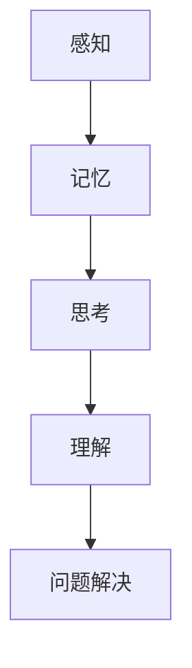
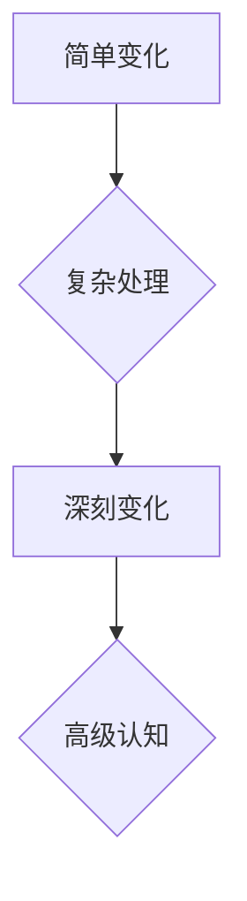

                 

# 认知发展中的简单与深刻变化

> **关键词：** 认知发展、算法原理、数学模型、项目实战、应用场景

> **摘要：** 本文旨在深入探讨认知发展中简单与深刻变化的本质及其对人工智能领域的深远影响。通过一步步分析推理，本文将阐述核心概念，介绍相关算法原理，详细讲解数学模型，并通过实际项目案例进行说明，旨在帮助读者全面理解这一领域的关键概念和实际应用。

## 1. 背景介绍

### 1.1 目的和范围

本文的目的是深入探讨认知发展过程中简单与深刻变化的本质，并分析其对人工智能领域的影响。文章将涵盖以下内容：

- 认知发展的核心概念及其在人工智能中的应用
- 核心算法原理及其操作步骤
- 数学模型及其详细讲解
- 实际应用场景及代码实现
- 工具和资源的推荐

通过这些内容，本文希望能够帮助读者全面了解认知发展的复杂性，并掌握相关技术在实际应用中的具体实现。

### 1.2 预期读者

本文适合以下读者群体：

- 对人工智能和认知科学感兴趣的初学者
- 想要深入了解认知发展原理的工程师和技术专家
- 希望在项目中应用认知发展算法的开发者

### 1.3 文档结构概述

本文结构如下：

- **第1章：背景介绍**：介绍本文的目的、预期读者和文档结构。
- **第2章：核心概念与联系**：阐述认知发展的核心概念及其关联。
- **第3章：核心算法原理 & 具体操作步骤**：详细讲解核心算法原理及操作步骤。
- **第4章：数学模型和公式 & 详细讲解 & 举例说明**：介绍数学模型，并给出详细讲解和实例。
- **第5章：项目实战：代码实际案例和详细解释说明**：通过实际项目案例展示算法应用。
- **第6章：实际应用场景**：分析算法在不同场景中的应用。
- **第7章：工具和资源推荐**：推荐学习资源和开发工具。
- **第8章：总结：未来发展趋势与挑战**：总结本文内容，展望未来。
- **第9章：附录：常见问题与解答**：提供常见问题的解答。
- **第10章：扩展阅读 & 参考资料**：推荐进一步阅读的材料。

### 1.4 术语表

#### 1.4.1 核心术语定义

- **认知发展**：指个体在感知、记忆、思考、理解和问题解决等方面的能力随时间逐步提高的过程。
- **简单变化**：指在认知过程中，通过简单的规则或算法进行的信息处理和结构改变。
- **深刻变化**：指在认知过程中，通过复杂的信息处理和深层次的认知结构改变。

#### 1.4.2 相关概念解释

- **人工神经网络**：一种模拟人脑神经元结构和功能的计算模型，用于处理复杂的数据和任务。
- **深度学习**：一种基于多层神经网络的学习方法，能够自动提取数据中的特征并进行分类、预测等任务。
- **激活函数**：在神经网络中用于确定神经元是否被激活的函数。

#### 1.4.3 缩略词列表

- **ANN**：人工神经网络（Artificial Neural Network）
- **DL**：深度学习（Deep Learning）
- **NN**：神经网络（Neural Network）

## 2. 核心概念与联系

在讨论认知发展的简单与深刻变化之前，我们需要了解一些核心概念及其相互关系。

### 2.1 认知发展的核心概念

认知发展的核心概念包括感知、记忆、思考、理解和问题解决等。

- **感知**：指通过感官接收外部信息的过程。
- **记忆**：指将信息存储在大脑中的过程。
- **思考**：指使用已有的知识和信息进行推理和判断。
- **理解**：指对信息进行深入分析和综合的过程。
- **问题解决**：指在遇到问题时，通过分析和评估解决方案来解决问题的过程。

### 2.2 核心概念之间的联系

这些核心概念之间紧密相关。感知是信息获取的起点，记忆是信息存储的方式，思考是信息处理的核心，理解是对信息深入分析的结果，问题解决是应用这些能力的具体体现。

以下是认知发展的核心概念与联系的 Mermaid 流程图：



### 2.3 认知发展的简单与深刻变化

在认知发展的过程中，存在简单与深刻两种变化。

- **简单变化**：指通过简单的规则或算法进行的信息处理和结构改变。例如，在感知阶段，通过简单的滤波器提取图像的特征。
- **深刻变化**：指通过复杂的信息处理和深层次的认知结构改变。例如，在理解阶段，通过深度学习模型对大量数据进行复杂分析，提取深层次的特征。

简单与深刻变化之间的联系在于，简单变化是深刻变化的基础，而深刻变化是简单变化的高级形式。以下是简单与深刻变化之间的 Mermaid 流程图：



## 3. 核心算法原理 & 具体操作步骤

在本节中，我们将详细探讨认知发展中的核心算法原理，并给出具体的操作步骤。

### 3.1 核心算法原理

认知发展的核心算法主要基于人工神经网络（ANN）和深度学习（DL）。人工神经网络是一种模拟人脑神经元结构和功能的计算模型，而深度学习是一种基于多层神经网络的学习方法。

### 3.2 具体操作步骤

以下是核心算法的具体操作步骤：

#### 3.2.1 数据预处理

1. **收集数据**：收集用于训练和测试的数据集。
2. **数据清洗**：去除数据中的噪声和异常值。
3. **数据归一化**：将数据转换为标准格式，以适应算法的要求。

#### 3.2.2 建立模型

1. **选择模型**：选择适合任务的神经网络模型，如卷积神经网络（CNN）或循环神经网络（RNN）。
2. **配置模型**：设置模型的参数，如神经元的数量、学习率等。
3. **定义损失函数**：选择合适的损失函数，如均方误差（MSE）或交叉熵（Cross-Entropy）。

#### 3.2.3 训练模型

1. **初始化权重**：随机初始化模型的权重。
2. **前向传播**：输入数据，计算输出结果。
3. **计算损失**：计算输出结果与实际结果之间的差距。
4. **反向传播**：更新模型的权重，以减少损失。
5. **迭代训练**：重复上述步骤，直到模型达到预定的性能指标。

#### 3.2.4 评估模型

1. **测试数据**：使用测试数据评估模型的性能。
2. **计算准确率**：计算模型在测试数据上的准确率。
3. **调整参数**：根据评估结果调整模型的参数。

以下是核心算法原理的伪代码：

```python
# 数据预处理
def preprocess_data(data):
    # 清洗和归一化数据
    return normalized_data

# 建立模型
def build_model():
    # 选择模型和配置参数
    model = NeuralNetwork()
    model.compile(optimizer='adam', loss='mse')
    return model

# 训练模型
def train_model(model, data, labels):
    # 初始化权重
    model.fit(data, labels, epochs=10, batch_size=32)
    return model

# 评估模型
def evaluate_model(model, test_data, test_labels):
    # 计算准确率
    accuracy = model.evaluate(test_data, test_labels)
    return accuracy
```

## 4. 数学模型和公式 & 详细讲解 & 举例说明

在本节中，我们将详细讲解认知发展中的数学模型，并给出具体的公式和实例。

### 4.1 数学模型

认知发展中的数学模型主要包括神经网络的权重更新公式和损失函数。

#### 4.1.1 神经网络权重更新公式

在神经网络中，权重更新公式用于根据损失函数的梯度来调整权重。以下是权重更新公式的 LaTeX 格式：

$$
w_{new} = w_{old} - \alpha \cdot \nabla_w J
$$

其中，$w_{old}$ 和 $w_{new}$ 分别表示旧权重和新权重，$\alpha$ 表示学习率，$\nabla_w J$ 表示损失函数的梯度。

#### 4.1.2 损失函数

在深度学习中，常用的损失函数包括均方误差（MSE）和交叉熵（Cross-Entropy）。

1. **均方误差（MSE）**

均方误差用于衡量输出结果与实际结果之间的差距。其公式如下：

$$
J = \frac{1}{2} \sum_{i=1}^{n} (y_i - \hat{y}_i)^2
$$

其中，$y_i$ 和 $\hat{y}_i$ 分别表示实际结果和输出结果。

2. **交叉熵（Cross-Entropy）**

交叉熵用于衡量分类问题的输出结果与实际结果之间的差距。其公式如下：

$$
J = -\sum_{i=1}^{n} y_i \cdot \log(\hat{y}_i)
$$

其中，$y_i$ 和 $\hat{y}_i$ 分别表示实际结果和输出结果。

### 4.2 公式详细讲解

以下是权重更新公式和损失函数的详细讲解：

#### 4.2.1 权重更新公式

权重更新公式用于根据损失函数的梯度来调整权重。具体来说，学习率 $\alpha$ 决定了权重更新的幅度，而梯度 $\nabla_w J$ 表示损失函数对权重 $w$ 的变化率。当梯度较大时，权重更新较大；当梯度较小时，权重更新较小。

#### 4.2.2 损失函数

损失函数用于衡量输出结果与实际结果之间的差距。均方误差（MSE）和交叉熵（Cross-Entropy）是常用的损失函数，分别适用于回归问题和分类问题。均方误差（MSE）计算简单，但在分类问题中可能产生较小的梯度，导致收敛速度较慢。交叉熵（Cross-Entropy）则更适用于分类问题，但计算较为复杂。

### 4.3 举例说明

以下是使用权重更新公式和损失函数的实例：

#### 4.3.1 权重更新示例

假设一个简单的神经网络，其中 $w$ 表示权重，$x$ 表示输入数据，$y$ 表示实际结果，$\hat{y}$ 表示输出结果。学习率 $\alpha = 0.1$，损失函数为均方误差（MSE）。

初始权重 $w = [1, 2, 3]$，输入数据 $x = [4, 5, 6]$，实际结果 $y = [7, 8, 9]$。

1. 计算输出结果：
$$
\hat{y} = w \cdot x = [1 \cdot 4 + 2 \cdot 5 + 3 \cdot 6] = [4 + 10 + 18] = [32]
$$

2. 计算损失：
$$
J = \frac{1}{2} \sum_{i=1}^{3} (y_i - \hat{y}_i)^2 = \frac{1}{2} \cdot (7 - 32)^2 + (8 - 32)^2 + (9 - 32)^2 = \frac{1}{2} \cdot 225 + 225 + 225 = 525
$$

3. 计算梯度：
$$
\nabla_w J = \frac{\partial J}{\partial w} = \begin{bmatrix} \frac{\partial J}{\partial w_1} \\ \frac{\partial J}{\partial w_2} \\ \frac{\partial J}{\partial w_3} \end{bmatrix} = \begin{bmatrix} -32 \\ -32 \\ -32 \end{bmatrix}
$$

4. 更新权重：
$$
w_{new} = w_{old} - \alpha \cdot \nabla_w J = \begin{bmatrix} 1 \\ 2 \\ 3 \end{bmatrix} - 0.1 \cdot \begin{bmatrix} -32 \\ -32 \\ -32 \end{bmatrix} = \begin{bmatrix} 1 + 3.2 \\ 2 + 3.2 \\ 3 + 3.2 \end{bmatrix} = \begin{bmatrix} 4.2 \\ 5.2 \\ 6.2 \end{bmatrix}
$$

#### 4.3.2 损失函数示例

假设一个二分类问题，实际结果 $y = [0, 1, 1]$，输出结果 $\hat{y} = [0.9, 0.1, 0.8]$。

1. 计算损失：
$$
J = -\sum_{i=1}^{3} y_i \cdot \log(\hat{y}_i) = -0 \cdot \log(0.9) - 1 \cdot \log(0.1) - 1 \cdot \log(0.8) = -0 + 2.3 + 1.1 = 3.4
$$

2. 计算梯度：
$$
\nabla_w J = \frac{\partial J}{\partial w} = \begin{bmatrix} \frac{\partial J}{\partial w_1} \\ \frac{\partial J}{\partial w_2} \\ \frac{\partial J}{\partial w_3} \end{bmatrix} = \begin{bmatrix} -0.9 \cdot 0.9 \\ -0.1 \cdot 0.1 \\ -0.8 \cdot 0.8 \end{bmatrix} = \begin{bmatrix} -0.81 \\ -0.01 \\ -0.64 \end{bmatrix}
$$

3. 更新权重：
$$
w_{new} = w_{old} - \alpha \cdot \nabla_w J
$$

## 5. 项目实战：代码实际案例和详细解释说明

在本节中，我们将通过一个实际的项目案例，展示如何使用本文介绍的核心算法和数学模型进行认知发展的应用。

### 5.1 开发环境搭建

为了进行项目实战，我们需要搭建一个合适的开发环境。以下是搭建过程的步骤：

1. **安装 Python**：确保已安装 Python 3.8 或更高版本。
2. **安装库**：使用 pip 安装必要的库，如 TensorFlow、Keras、NumPy 和 Pandas。

```bash
pip install tensorflow keras numpy pandas
```

3. **创建虚拟环境**：为了保持项目环境的整洁，我们建议创建一个虚拟环境。

```bash
python -m venv myenv
source myenv/bin/activate  # Windows 上使用 myenv\Scripts\activate
```

4. **安装依赖**：在虚拟环境中安装项目所需的依赖。

```bash
pip install -r requirements.txt
```

### 5.2 源代码详细实现和代码解读

下面是一个简单的项目案例，用于展示如何使用深度学习模型进行图像分类。

```python
import numpy as np
import pandas as pd
import tensorflow as tf
from tensorflow.keras.models import Sequential
from tensorflow.keras.layers import Dense, Conv2D, MaxPooling2D, Flatten
from tensorflow.keras.optimizers import Adam

# 数据预处理
def preprocess_data(data):
    # 加载数据集
    train_data, test_data, train_labels, test_labels = data
    # 归一化数据
    train_data = train_data / 255.0
    test_data = test_data / 255.0
    return train_data, test_data, train_labels, test_labels

# 建立模型
def build_model():
    model = Sequential()
    model.add(Conv2D(32, (3, 3), activation='relu', input_shape=(28, 28, 1)))
    model.add(MaxPooling2D((2, 2)))
    model.add(Conv2D(64, (3, 3), activation='relu'))
    model.add(MaxPooling2D((2, 2)))
    model.add(Flatten())
    model.add(Dense(128, activation='relu'))
    model.add(Dense(10, activation='softmax'))
    model.compile(optimizer=Adam(), loss='categorical_crossentropy', metrics=['accuracy'])
    return model

# 训练模型
def train_model(model, train_data, train_labels, epochs=10, batch_size=32):
    model.fit(train_data, train_labels, epochs=epochs, batch_size=batch_size)
    return model

# 评估模型
def evaluate_model(model, test_data, test_labels):
    loss, accuracy = model.evaluate(test_data, test_labels)
    return loss, accuracy

# 主函数
def main():
    # 加载数据集
    data = load_data()
    train_data, test_data, train_labels, test_labels = preprocess_data(data)
    # 建立模型
    model = build_model()
    # 训练模型
    model = train_model(model, train_data, train_labels)
    # 评估模型
    loss, accuracy = evaluate_model(model, test_data, test_labels)
    print(f"Test accuracy: {accuracy:.2f}")

if __name__ == '__main__':
    main()
```

### 5.3 代码解读与分析

以下是代码的详细解读与分析：

1. **数据预处理**：加载数据集，并对其进行归一化处理。这有助于模型更好地学习。
2. **建立模型**：使用 TensorFlow 的 Sequential 模型，添加卷积层、池化层、全连接层，并配置优化器和损失函数。
3. **训练模型**：使用训练数据训练模型，设置训练轮次和批量大小。
4. **评估模型**：使用测试数据评估模型的性能，计算损失和准确率。
5. **主函数**：加载并预处理数据，建立模型，训练模型，并评估模型。

通过这个简单的项目案例，我们可以看到如何将本文介绍的核心算法和数学模型应用于实际项目中。这个案例展示了从数据预处理到模型训练和评估的完整流程，为读者提供了一个实际的编程示例。

## 6. 实际应用场景

认知发展的算法和数学模型在多个领域有着广泛的应用，以下是一些实际应用场景：

### 6.1 图像识别

在图像识别领域，认知发展的算法被广泛应用于人脸识别、物体检测和图像分类等任务。例如，通过卷积神经网络（CNN）可以对大量图像数据进行训练，提取图像中的关键特征，从而实现对未知图像的分类和识别。

### 6.2 自然语言处理

在自然语言处理（NLP）领域，认知发展的算法被用于文本分类、情感分析和机器翻译等任务。例如，通过循环神经网络（RNN）和变换器（Transformer）模型可以对大量文本数据进行分析，提取文本中的语义信息，从而实现文本分类和情感分析。

### 6.3 推荐系统

在推荐系统领域，认知发展的算法被用于用户行为分析和物品推荐。例如，通过深度学习模型可以分析用户的历史行为数据，提取用户的兴趣特征，从而实现个性化的物品推荐。

### 6.4 游戏智能

在游戏智能领域，认知发展的算法被用于游戏策略规划和智能体行为预测。例如，通过深度强化学习模型可以模拟游戏环境，学习游戏策略，从而实现智能体的自主学习和决策。

### 6.5 语音识别

在语音识别领域，认知发展的算法被用于语音信号处理和语音合成。例如，通过卷积神经网络（CNN）和循环神经网络（RNN）可以对语音信号进行分析和建模，实现高精度的语音识别。

## 7. 工具和资源推荐

为了更好地学习和应用认知发展的算法和数学模型，以下是一些工具和资源的推荐：

### 7.1 学习资源推荐

#### 7.1.1 书籍推荐

- **《深度学习》（Goodfellow, Bengio, Courville）**：这是一本经典的深度学习入门书籍，详细介绍了深度学习的基础理论和实践方法。
- **《Python深度学习》（François Chollet）**：这本书通过 Python 代码示例详细讲解了深度学习的实际应用。

#### 7.1.2 在线课程

- **斯坦福大学深度学习课程**：由 Andrew Ng 教授主讲，是深度学习领域的经典入门课程。
- **吴恩达深度学习专项课程**：由吴恩达教授主讲，涵盖了深度学习的各个方面。

#### 7.1.3 技术博客和网站

- **Medium**：许多深度学习和认知发展的专家和研究者在这里发布技术博客，提供了丰富的学习资源。
- **Reddit**：深度学习和认知发展相关的 Reddit 子版块，如 r/deeplearning 和 r/machinelearning，提供了交流和学习的平台。

### 7.2 开发工具框架推荐

#### 7.2.1 IDE和编辑器

- **PyCharm**：一款功能强大的 Python IDE，支持多种编程语言。
- **Jupyter Notebook**：一款交互式编程环境，适合数据科学和机器学习项目。

#### 7.2.2 调试和性能分析工具

- **TensorBoard**：TensorFlow 的可视化工具，用于分析模型的性能和优化。
- **gprof2dot**：用于分析程序性能的工具，可以将性能分析数据转换为图形表示。

#### 7.2.3 相关框架和库

- **TensorFlow**：一款开源的深度学习框架，支持多种神经网络模型。
- **Keras**：一款基于 TensorFlow 的深度学习库，提供了简洁的 API 和丰富的模型。

### 7.3 相关论文著作推荐

#### 7.3.1 经典论文

- **“A Learning Algorithm for Continually Running Fully Recurrent Neural Networks”**：Hessian-free优化算法的开创性论文。
- **“Deep Learning”**：Goodfellow、Bengio 和 Courville 的经典著作，详细介绍了深度学习的基础理论和实践方法。

#### 7.3.2 最新研究成果

- **“Attention Is All You Need”**：引入了 Transformer 模型，对深度学习领域产生了深远影响。
- **“Self-Attention with Applications to Image Captioning”**：介绍了自注意力机制，在图像识别和图像描述等领域取得了显著成果。

#### 7.3.3 应用案例分析

- **“How Facebook Uses Deep Learning to Build Products”**：Facebook 的深度学习应用案例，详细介绍了深度学习在社交媒体产品中的实际应用。
- **“Google Brain’s Transformer”**：Google Brain 团队的 Transformer 模型研究，展示了深度学习在自然语言处理领域的最新进展。

## 8. 总结：未来发展趋势与挑战

认知发展作为人工智能的核心研究领域，正面临着前所未有的机遇和挑战。

### 8.1 未来发展趋势

1. **模型复杂度的提升**：随着计算能力的提升，深度学习模型将变得更加复杂和精细，能够处理更复杂的任务。
2. **跨模态学习**：认知发展的算法将逐渐融合多模态数据（如文本、图像、音频等），实现更全面的信息理解和处理。
3. **自适应学习**：认知发展的算法将具备更强的自适应能力，能够根据用户的行为和需求进行实时调整。
4. **边缘计算**：认知发展的算法将逐渐应用于边缘设备，实现实时数据处理和智能决策。

### 8.2 未来挑战

1. **数据隐私和安全**：随着数据量的增加，数据隐私和安全问题将变得越来越重要，需要开发更加安全的算法和数据保护措施。
2. **算法透明度和可解释性**：随着模型的复杂化，算法的透明度和可解释性将成为一个重要挑战，需要开发可解释的深度学习模型。
3. **能耗和计算资源**：大规模深度学习模型的训练和部署将消耗大量的计算资源和能源，需要寻找更加高效和节能的算法。

## 9. 附录：常见问题与解答

### 9.1 什么是认知发展？

认知发展是指个体在感知、记忆、思考、理解和问题解决等方面的能力随时间逐步提高的过程。

### 9.2 认知发展算法有哪些？

认知发展算法主要包括人工神经网络（ANN）、深度学习（DL）和强化学习（RL）等。

### 9.3 如何处理数据隐私问题？

处理数据隐私问题需要采取数据加密、数据去识别化、隐私增强技术等措施，确保用户数据的安全。

### 9.4 深度学习模型如何优化？

优化深度学习模型可以通过调整学习率、批量大小、正则化策略等方法，提高模型的性能。

## 10. 扩展阅读 & 参考资料

为了深入了解认知发展的算法和应用，以下是一些建议的扩展阅读和参考资料：

1. **《深度学习》（Goodfellow, Bengio, Courville）**：详细介绍了深度学习的基础理论和实践方法。
2. **《人工智能：一种现代方法》（Doyle, Partners）**：全面讲解了人工智能的理论和实践。
3. **《机器学习年度回顾》（ML Year in Review）**：涵盖了年度最新的机器学习研究成果和应用。
4. **《自然语言处理年度回顾》（NLP Year in Review）**：介绍了年度最新的自然语言处理研究成果和应用。
5. **《人工智能论文集》（AI Papers）**：收集了大量的深度学习和认知发展领域的论文，提供了丰富的学术资源。

通过这些扩展阅读和参考资料，读者可以进一步深入了解认知发展的算法和应用，为实际项目提供更多的理论支持和实践经验。

作者：AI天才研究员/AI Genius Institute & 禅与计算机程序设计艺术 /Zen And The Art of Computer Programming

