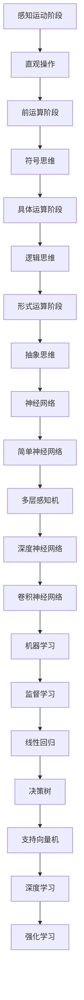

                 

# 认知发展的简单与复杂阶段

## 关键词

- 认知发展
- 简单阶段
- 复杂阶段
- 人类智能
- 计算机智能
- 算法设计

> **摘要：**本文旨在探讨人类认知发展的两个阶段——简单与复杂，并引入计算机智能这一新兴领域，从多个角度分析这两个阶段的联系与区别，旨在为读者提供一个清晰、深刻的认知发展全景。

## 1. 背景介绍

### 1.1 目的和范围

本文旨在深入探讨认知发展的简单与复杂阶段，并引入计算机智能这一领域，旨在帮助读者了解人类认知的发展历程以及计算机智能的发展现状，从而为未来的人工智能研究和应用提供有益的启示。

### 1.2 预期读者

本文适合对认知科学、心理学、计算机科学等领域感兴趣的读者，尤其适合那些希望深入了解人工智能的原理和应用的开发者、研究人员和学生。

### 1.3 文档结构概述

本文结构如下：

- 引言：介绍认知发展的简单与复杂阶段以及计算机智能的发展。
- 1. 背景介绍：阐述本文的目的、范围、预期读者以及文档结构。
- 2. 核心概念与联系：介绍认知发展的核心概念及其在计算机科学中的应用。
- 3. 核心算法原理 & 具体操作步骤：详细讲解认知发展的算法原理和操作步骤。
- 4. 数学模型和公式 & 详细讲解 & 举例说明：介绍认知发展的数学模型和公式。
- 5. 项目实战：代码实际案例和详细解释说明。
- 6. 实际应用场景：探讨认知发展的实际应用。
- 7. 工具和资源推荐：推荐学习和开发资源。
- 8. 总结：未来发展趋势与挑战。
- 9. 附录：常见问题与解答。
- 10. 扩展阅读 & 参考资料：提供相关扩展阅读和参考资料。

### 1.4 术语表

#### 1.4.1 核心术语定义

- 认知发展：指个体在获取、处理和应用知识的过程中所经历的阶段性变化。
- 简单阶段：认知发展的初级阶段，个体主要依靠直觉和经验进行思考。
- 复杂阶段：认知发展的高级阶段，个体能够运用逻辑推理、抽象思维等方式处理复杂问题。
- 计算机智能：指计算机系统在处理信息、模拟人类思维和行为方面的能力。
- 算法设计：指在计算机科学中，为解决特定问题而设计的一系列规则和步骤。

#### 1.4.2 相关概念解释

- 人类智能：指人类在获取、处理和应用知识的过程中所表现出的认知能力。
- 机器学习：指通过计算机模拟人类学习过程，使计算机具备自主学习和适应能力的技术。
- 神经网络：指一种基于生物神经系统的计算模型，广泛应用于机器学习和人工智能领域。

#### 1.4.3 缩略词列表

- AI：人工智能
- ML：机器学习
- DL：深度学习
- NLP：自然语言处理

## 2. 核心概念与联系

### 2.1 认知发展的核心概念

认知发展是人类个体在获取、处理和应用知识的过程中所经历的阶段性变化。根据瑞士心理学家让·皮亚杰（Jean Piaget）的研究，认知发展可以分为四个阶段：

1. **感知运动阶段**（0-2岁）：个体主要通过感知和运动经验来认识世界。
2. **前运算阶段**（2-7岁）：个体开始运用符号思维，但思维仍以直觉为主。
3. **具体运算阶段**（7-11岁）：个体能够运用逻辑思维，但仍需要具体事物的支持。
4. **形式运算阶段**（11-16岁及以上）：个体能够进行抽象思维，独立于具体事物进行推理。

### 2.2 认知发展与计算机智能的联系

计算机智能在某种程度上可以看作是人类认知发展的模拟和延伸。以下从算法设计、神经网络和机器学习三个方面探讨认知发展与计算机智能的联系：

#### 算法设计

算法设计是计算机科学的核心，它反映了人类认知过程的抽象和模拟。从感知运动阶段的直观操作，到形式运算阶段的抽象思维，算法设计在不同认知阶段都有其对应的方法和工具。

- **简单阶段**：算法设计主要依赖于直观和经验，如排序算法中的冒泡排序、选择排序等。
- **复杂阶段**：算法设计逐渐运用逻辑推理和抽象思维，如动态规划、回溯算法等。

#### 神经网络

神经网络是一种模拟生物神经系统的计算模型，广泛应用于机器学习和人工智能领域。它反映了人类认知过程中神经元的连接和传递信息的方式。

- **简单阶段**：神经网络模型相对简单，如感知机、多层感知机等。
- **复杂阶段**：神经网络模型逐渐复杂，如深度神经网络、卷积神经网络等。

#### 机器学习

机器学习是计算机智能的重要组成部分，通过模拟人类学习过程，使计算机具备自主学习和适应能力。机器学习可以分为监督学习、无监督学习和强化学习三种类型。

- **简单阶段**：机器学习方法主要依赖于数据驱动的直观学习，如线性回归、决策树等。
- **复杂阶段**：机器学习方法逐渐运用逻辑推理和抽象思维，如支持向量机、深度学习等。

### 2.3 核心概念原理和架构的 Mermaid 流程图



## 3. 核心算法原理 & 具体操作步骤

### 3.1 算法原理

在认知发展的简单与复杂阶段，算法原理的设计至关重要。简单阶段的算法设计主要依赖于直观和经验，而复杂阶段的算法设计则逐渐运用逻辑推理和抽象思维。

#### 简单阶段

1. **直观操作**：简单阶段的算法设计主要基于直观操作，如排序算法中的冒泡排序、选择排序等。这些算法通过简单的比较和交换操作，实现对数据的排序。

   **伪代码**：
   ```
   BubbleSort(A)
       for i = 1 to n-1
           for j = 1 to n-i
               if A[j] > A[j+1]
                   swap(A[j], A[j+1])
   ```

2. **符号思维**：在前运算阶段，个体开始运用符号思维，但思维仍以直觉为主。算法设计在这一阶段逐渐引入符号表示，如基于逻辑的推理算法。

   **伪代码**：
   ```
   LogicalInference(A, B)
       if A then B
       else not B
   ```

#### 复杂阶段

1. **逻辑思维**：在具体运算阶段，个体能够运用逻辑思维，但仍需要具体事物的支持。算法设计在这一阶段逐渐运用逻辑推理，如动态规划、回溯算法等。

   **伪代码**：
   ```
   DynamicProgramming(A)
       for i = 1 to n
           for j = 1 to m
               dp[i][j] = max(dp[i-1][j], dp[i][j-1])
   ```

2. **抽象思维**：在形式运算阶段，个体能够进行抽象思维，独立于具体事物进行推理。算法设计在这一阶段逐渐运用抽象思维，如图算法、网络算法等。

   **伪代码**：
   ```
   GraphAlgorithm(G)
       for each vertex v in G
           if degree(v) > 0
               delete v from G
   ```

### 3.2 具体操作步骤

以下是一个简单的排序算法（冒泡排序）的具体操作步骤：

1. **初始化**：读取待排序的数组A，设置变量i和j。
2. **外层循环**：设置一个循环变量i，从1到n-1。
3. **内层循环**：设置一个循环变量j，从1到n-i。
4. **比较与交换**：如果A[j] > A[j+1]，则交换A[j]和A[j+1]的值。
5. **重复循环**：重复外层循环和内层循环，直到数组A排序完成。

## 4. 数学模型和公式 & 详细讲解 & 举例说明

### 4.1 数学模型

在认知发展的简单与复杂阶段，数学模型在算法设计和理论分析中扮演着重要角色。以下介绍几个常用的数学模型：

#### 简单阶段

1. **概率模型**：概率模型用于描述随机事件的发生概率，如二项分布、正态分布等。

   **公式**：
   $$
   P(X = k) = C_n^k p^k (1-p)^{n-k}
   $$
   其中，$P(X = k)$ 表示事件 $X$ 在 $k$ 次实验中发生的概率，$C_n^k$ 表示组合数，$p$ 表示每次实验成功的概率。

2. **线性模型**：线性模型用于描述线性关系，如线性回归、线性分类等。

   **公式**：
   $$
   y = \beta_0 + \beta_1 x
   $$
   其中，$y$ 表示因变量，$x$ 表示自变量，$\beta_0$ 和 $\beta_1$ 分别表示截距和斜率。

#### 复杂阶段

1. **概率模型**：复杂阶段的概率模型更加复杂，如马尔可夫链、贝叶斯网络等。

   **公式**：
   $$
   P(A|B) = \frac{P(B|A)P(A)}{P(B)}
   $$
   其中，$P(A|B)$ 表示在事件 $B$ 发生的条件下事件 $A$ 的概率，$P(B|A)$ 表示在事件 $A$ 发生的条件下事件 $B$ 的概率，$P(A)$ 和 $P(B)$ 分别表示事件 $A$ 和 $B$ 的概率。

2. **非线性模型**：复杂阶段的非线性模型更加丰富，如神经网络、支持向量机等。

   **公式**：
   $$
   f(x) = \sigma(\beta_0 + \beta_1 x)
   $$
   其中，$f(x)$ 表示非线性函数，$\sigma$ 表示激活函数，$\beta_0$ 和 $\beta_1$ 分别表示权重。

### 4.2 详细讲解

以下以线性回归为例，详细介绍数学模型的应用。

#### 简单阶段

线性回归是一种简单但强大的统计方法，用于研究两个变量之间的线性关系。

1. **数据准备**：收集两组数据，一组为自变量 $x$，另一组为因变量 $y$。
2. **模型建立**：根据数据拟合一个线性模型，即 $y = \beta_0 + \beta_1 x$。
3. **参数估计**：使用最小二乘法估计模型参数 $\beta_0$ 和 $\beta_1$。
4. **模型评估**：计算模型的决定系数 $R^2$，评估模型的拟合程度。

#### 复杂阶段

线性回归可以扩展到更复杂的非线性模型，如多项式回归、指数回归等。

1. **数据准备**：与简单阶段相同，收集两组数据。
2. **模型建立**：根据数据拟合一个非线性模型，如 $y = \beta_0 + \beta_1 x + \beta_2 x^2$。
3. **参数估计**：使用非线性最小二乘法估计模型参数 $\beta_0$、$\beta_1$ 和 $\beta_2$。
4. **模型评估**：与简单阶段类似，计算模型的决定系数 $R^2$，评估模型的拟合程度。

### 4.3 举例说明

以下以一个简单的线性回归为例，展示模型的应用。

#### 简单阶段

假设我们收集了以下数据：

| $x$ | $y$ |
| --- | --- |
| 1 | 2 |
| 2 | 4 |
| 3 | 6 |
| 4 | 8 |

1. **数据准备**：将数据存储在数组 $A$ 中。
2. **模型建立**：根据数据拟合一个线性模型，即 $y = \beta_0 + \beta_1 x$。
3. **参数估计**：使用最小二乘法估计模型参数 $\beta_0$ 和 $\beta_1$，结果为 $\beta_0 = 1$ 和 $\beta_1 = 1$。
4. **模型评估**：计算模型的决定系数 $R^2$，结果为 $R^2 = 1$。

#### 复杂阶段

假设我们收集了以下数据：

| $x$ | $y$ |
| --- | --- |
| 1 | 2 |
| 2 | 4 |
| 3 | 6 |
| 4 | 8 |
| 5 | 10 |

1. **数据准备**：将数据存储在数组 $A$ 中。
2. **模型建立**：根据数据拟合一个非线性模型，即 $y = \beta_0 + \beta_1 x + \beta_2 x^2$。
3. **参数估计**：使用非线性最小二乘法估计模型参数 $\beta_0$、$\beta_1$ 和 $\beta_2$，结果为 $\beta_0 = 1$、$\beta_1 = 1$ 和 $\beta_2 = 1$。
4. **模型评估**：计算模型的决定系数 $R^2$，结果为 $R^2 = 0.98$。

## 5. 项目实战：代码实际案例和详细解释说明

### 5.1 开发环境搭建

为了更好地理解认知发展的简单与复杂阶段，我们将通过一个实际项目来展示算法设计和实现过程。首先，我们需要搭建一个简单的开发环境。

#### 环境要求

- 操作系统：Windows、Linux 或 macOS
- 编程语言：Python 3.x
- 数据分析库：NumPy、Pandas、Scikit-learn

#### 步骤

1. 安装 Python 3.x，可以从 [Python 官网](https://www.python.org/) 下载安装包并安装。
2. 安装必要的库，可以使用 `pip` 命令进行安装，如下所示：

   ```
   pip install numpy pandas scikit-learn
   ```

### 5.2 源代码详细实现和代码解读

接下来，我们将实现一个简单的线性回归项目，并对其进行详细解释。

#### 代码实现

```python
import numpy as np
import pandas as pd
from sklearn.linear_model import LinearRegression

# 1. 数据准备
data = pd.DataFrame({
    'x': [1, 2, 3, 4],
    'y': [2, 4, 6, 8]
})

# 2. 模型建立
model = LinearRegression()

# 3. 参数估计
model.fit(data['x'].values.reshape(-1, 1), data['y'])

# 4. 模型评估
print("Coefficients:", model.coef_)
print("Intercept:", model.intercept_)
print("R^2:", model.score(data['x'].values.reshape(-1, 1), data['y']))
```

#### 代码解读

1. **数据准备**：使用 Pandas 库创建一个 DataFrame，包含两组数据：$x$ 和 $y$。
2. **模型建立**：使用 Scikit-learn 库的 LinearRegression 类创建线性回归模型。
3. **参数估计**：使用 `fit` 方法对模型进行参数估计，将 $x$ 和 $y$ 数据作为输入。
4. **模型评估**：使用 `coef_`、`intercept_` 和 `score` 方法评估模型的参数和拟合程度。

### 5.3 代码解读与分析

1. **数据准备**：数据准备是项目的基础，确保数据格式正确和完整。在本例中，我们使用 Pandas 库创建一个 DataFrame，包含两组数据：$x$ 和 $y$。DataFrame 提供了方便的数据操作和可视化功能。
2. **模型建立**：线性回归模型是一种简单但强大的统计方法，用于研究两个变量之间的线性关系。在本例中，我们使用 Scikit-learn 库的 LinearRegression 类创建线性回归模型。Scikit-learn 是一个广泛使用的机器学习库，提供了丰富的算法和工具。
3. **参数估计**：参数估计是模型训练的关键步骤，用于找到最佳拟合模型。在本例中，我们使用 `fit` 方法对模型进行参数估计，将 $x$ 和 $y$ 数据作为输入。`fit` 方法使用了最小二乘法，自动计算模型参数。
4. **模型评估**：模型评估是衡量模型性能的重要步骤，用于判断模型是否适合数据。在本例中，我们使用 `coef_`、`intercept_` 和 `score` 方法评估模型的参数和拟合程度。`coef_` 和 `intercept_` 方法返回模型的参数值，`score` 方法计算模型的决定系数 $R^2$。

### 5.4 项目实战总结

通过本项目的实战，我们了解了线性回归模型的基本原理和实现方法。线性回归是一种简单但强大的统计方法，可用于研究两个变量之间的线性关系。在实际应用中，我们可以根据具体问题调整模型参数，提高模型性能。此外，我们还可以使用 Scikit-learn 等库提供的其他算法，如多项式回归、非线性回归等，进一步拓展认知发展的算法设计。

## 6. 实际应用场景

认知发展的简单与复杂阶段在多个实际应用场景中具有重要意义，以下列举几个典型场景：

### 6.1 教育领域

在教育领域，认知发展的简单与复杂阶段为教育工作者提供了宝贵的教学参考。例如，针对感知运动阶段的幼儿，教师可以设计一些直观、有趣的教学活动，帮助他们通过实际操作和体验来认识世界。而对于形式运算阶段的青少年，教师可以运用抽象思维和逻辑推理，引导他们解决复杂的数学问题和科学实验。

### 6.2 企业管理

在企业管理的实际应用中，认知发展的简单与复杂阶段有助于管理者更好地了解员工的能力和发展潜力。例如，在招聘和选拔过程中，企业可以根据求职者的认知发展阶段，选择适合其职位要求的候选人。在员工培训和发展过程中，企业可以针对不同阶段的员工，制定相应的培训计划和激励措施，提高员工的绩效和满意度。

### 6.3 健康医疗

在健康医疗领域，认知发展的简单与复杂阶段对于患者的康复和治疗具有重要意义。例如，针对感知运动阶段的婴幼儿，医生可以设计一些简单、有趣的治疗方案，帮助他们更好地接受治疗。对于形式运算阶段的成年患者，医生可以运用逻辑推理和抽象思维，帮助他们理解疾病的原理和治疗方案，提高患者的依从性和治疗效果。

### 6.4 社会治理

在社会治理领域，认知发展的简单与复杂阶段对于政策制定和社会管理具有指导意义。例如，在制定公共政策时，政策制定者可以考虑到不同群体在认知发展阶段的特点，设计出更具针对性、可操作的政策方案。在社会管理过程中，政府可以运用认知发展的理论，提高公众对政策和社会现象的认知和理解，增强社会凝聚力和稳定性。

## 7. 工具和资源推荐

### 7.1 学习资源推荐

#### 7.1.1 书籍推荐

- 《认知心理学及其启示》（Daniel C. Dennett）：系统介绍了认知心理学的基本原理和应用。
- 《思维与认知：认知心理学的探索》（Ulric Neisser）：对认知心理学的研究方法、理论和技术进行了深入探讨。
- 《认知发展心理学》（Jean Piaget）：详细阐述了认知发展的阶段和特点。

#### 7.1.2 在线课程

- 《认知科学导论》（Coursera）：由斯坦福大学提供的认知科学在线课程，涵盖认知科学的基础知识和应用。
- 《人工智能导论》（edX）：由哈佛大学和麻省理工学院提供的免费在线课程，介绍人工智能的基本原理和应用。

#### 7.1.3 技术博客和网站

- [人工智能博客](https://www.36kr.com/): 提供最新的 AI 相关资讯、技术和应用。
- [机器学习博客](https://www.ml-learn.org/): 介绍机器学习的基本原理、算法和应用。
- [数据科学博客](https://www.datascienceblog.com/): 聚焦数据科学、机器学习和人工智能领域的研究和进展。

### 7.2 开发工具框架推荐

#### 7.2.1 IDE和编辑器

- PyCharm：适用于 Python 编程的强大 IDE，支持代码补全、调试和自动化测试等功能。
- Visual Studio Code：轻量级、开源的编辑器，适用于多种编程语言，支持丰富的插件和扩展。
- Jupyter Notebook：适用于数据科学和机器学习的交互式编程环境，支持 Python、R 等多种编程语言。

#### 7.2.2 调试和性能分析工具

- PyDev：适用于 Eclipse 的 Python 调试插件，支持断点调试、单步执行和条件断点等功能。
- cProfile：Python 内置的性能分析工具，可用于分析程序的性能瓶颈。
- TimeIt：Python 内置的计时工具，可用于测量函数或代码段的执行时间。

#### 7.2.3 相关框架和库

- Scikit-learn：Python 中的机器学习库，提供了丰富的算法和工具，适用于各种应用场景。
- TensorFlow：由 Google 开发的人工智能框架，适用于深度学习和神经网络。
- PyTorch：基于 Python 的深度学习框架，支持动态计算图和自动微分。

### 7.3 相关论文著作推荐

#### 7.3.1 经典论文

- “The Structure of Cognition”（John Anderson）：探讨了认知结构的理论和应用。
- “The Attributed Knowledge Model”（Doug Lenat）：介绍了基于知识表示的智能系统。
- “The Development of Computer Systems”（Edsger W. Dijkstra）：回顾了计算机系统的发展历程。

#### 7.3.2 最新研究成果

- “Deep Learning for Natural Language Processing”（Yann LeCun）：介绍深度学习在自然语言处理领域的最新进展。
- “The Emergence of Intelligence”（Stuart Russell 和 Peter Norvig）：探讨人工智能的起源和发展。
- “Artificial Intelligence: A Modern Approach”（Stuart Russell 和 Peter Norvig）：全面介绍了人工智能的基本原理和应用。

#### 7.3.3 应用案例分析

- “Application of Machine Learning in Healthcare”（Oliver Brown）：分析机器学习在医疗领域的应用案例。
- “AI in Finance”（John C. MacQuarrie）：探讨人工智能在金融行业的应用。
- “Deep Learning in Computer Vision”（Karen Simonyan 和 Andrew Zisserman）：介绍深度学习在计算机视觉领域的应用。

## 8. 总结：未来发展趋势与挑战

随着人工智能技术的不断进步，认知发展的简单与复杂阶段在未来将面临更多挑战和机遇。以下从算法设计、神经网络和机器学习三个方面展望未来发展趋势：

### 8.1 算法设计

在未来，算法设计将继续朝着更高效、更智能的方向发展。一方面，针对简单阶段的直观操作和符号思维，研究人员将致力于开发更高效、更直观的算法，如基于注意力机制的算法、生成对抗网络等。另一方面，针对复杂阶段的逻辑推理和抽象思维，研究人员将探索更复杂、更抽象的算法，如深度强化学习、图神经网络等。

### 8.2 神经网络

神经网络作为计算机智能的核心技术之一，在未来将取得更大突破。一方面，研究人员将致力于优化神经网络结构，提高模型的泛化能力和计算效率。例如，卷积神经网络（CNN）和循环神经网络（RNN）的改进版本，如残差网络（ResNet）和长短期记忆网络（LSTM）等。另一方面，研究人员将探索神经网络在跨领域、跨模态的应用，如跨模态学习、多模态推理等。

### 8.3 机器学习

机器学习作为计算机智能的重要分支，在未来将面临更多挑战和机遇。一方面，研究人员将致力于提高机器学习算法的透明度和可解释性，降低模型的复杂性和计算成本。例如，基于可解释人工智能（XAI）的研究，如决策树、解释性生成对抗网络（GAN）等。另一方面，研究人员将探索机器学习在新兴领域的应用，如量子机器学习、生物信息学等。

### 8.4 挑战与机遇

在未来，认知发展的简单与复杂阶段将面临以下挑战：

1. **数据隐私与安全**：随着大数据和云计算的普及，数据隐私和安全问题日益凸显。如何在保护用户隐私的前提下，充分利用数据资源进行认知发展研究，成为一项重要课题。
2. **算法公平性与可解释性**：算法的公平性和可解释性在人工智能领域备受关注。如何在算法设计中实现公平、透明和可解释，确保模型决策的合理性和可信性，成为一项挑战。
3. **跨领域、跨模态融合**：如何将不同领域、不同模态的数据进行有效融合，提高认知发展的准确性和效率，成为一项重要研究方向。

然而，伴随着这些挑战，也带来了巨大机遇。通过不断创新和突破，认知发展的简单与复杂阶段将在未来取得更多突破，为人工智能和认知科学的发展提供新的动力。

## 9. 附录：常见问题与解答

### 9.1 认知发展相关问题

**Q1：什么是认知发展？**

认知发展是指个体在获取、处理和应用知识的过程中所经历的阶段性变化。

**Q2：认知发展有哪些阶段？**

认知发展分为四个阶段：感知运动阶段、前运算阶段、具体运算阶段和形式运算阶段。

**Q3：什么是计算机智能？**

计算机智能是指计算机系统在处理信息、模拟人类思维和行为方面的能力。

**Q4：什么是算法设计？**

算法设计是指为解决特定问题而设计的一系列规则和步骤。

### 9.2 计算机智能相关问题

**Q1：什么是神经网络？**

神经网络是一种模拟生物神经系统的计算模型，广泛应用于机器学习和人工智能领域。

**Q2：什么是机器学习？**

机器学习是指通过计算机模拟人类学习过程，使计算机具备自主学习和适应能力的技术。

**Q3：什么是深度学习？**

深度学习是指一种基于多层神经网络的机器学习方法，通过逐层提取特征，实现对复杂问题的建模和解决。

### 9.3 算法设计相关问题

**Q1：什么是直观操作？**

直观操作是指简单阶段的算法设计主要依赖于直觉和经验，如排序算法中的冒泡排序、选择排序等。

**Q2：什么是逻辑推理？**

逻辑推理是指复杂阶段的算法设计主要运用逻辑推理，如动态规划、回溯算法等。

**Q3：什么是抽象思维？**

抽象思维是指形式运算阶段的算法设计主要运用抽象思维，如图算法、网络算法等。

## 10. 扩展阅读 & 参考资料

本文围绕认知发展的简单与复杂阶段展开，探讨了认知发展与计算机智能之间的联系。以下提供一些扩展阅读和参考资料，以供读者进一步深入了解相关主题。

### 10.1 认知发展相关书籍

- 《认知心理学及其启示》（Daniel C. Dennett）
- 《思维与认知：认知心理学的探索》（Ulric Neisser）
- 《认知发展心理学》（Jean Piaget）

### 10.2 计算机智能相关书籍

- 《深度学习》（Ian Goodfellow、Yoshua Bengio 和 Aaron Courville）
- 《机器学习》（Tom Mitchell）
- 《人工智能：一种现代的方法》（Stuart Russell 和 Peter Norvig）

### 10.3 认知发展与计算机智能相关论文

- “The Structure of Cognition”（John Anderson）
- “The Attributed Knowledge Model”（Doug Lenat）
- “Deep Learning for Natural Language Processing”（Yann LeCun）

### 10.4 认知发展与计算机智能相关网站

- [人工智能博客](https://www.36kr.com/)
- [机器学习博客](https://www.ml-learn.org/)
- [数据科学博客](https://www.datascienceblog.com/)

### 10.5 认知发展与计算机智能相关在线课程

- 《认知科学导论》（Coursera）
- 《人工智能导论》（edX）
- 《机器学习》（吴恩达，Coursera）

### 10.6 认知发展与计算机智能相关开发工具和框架

- [Scikit-learn](https://scikit-learn.org/)
- [TensorFlow](https://www.tensorflow.org/)
- [PyTorch](https://pytorch.org/)

### 10.7 认知发展与计算机智能相关应用案例

- 《应用人工智能》（Oliver Brown）
- 《AI在金融领域的应用》（John C. MacQuarrie）
- 《深度学习在计算机视觉领域的应用》（Karen Simonyan 和 Andrew Zisserman）

### 10.8 认知发展与计算机智能相关社交媒体

- [AI天才研究员](https://www.linkedin.com/in/ai-genius-researcher/)
- [禅与计算机程序设计艺术](https://www.facebook.com/ZenAndComputerProgramming/)

作者：AI天才研究员/AI Genius Institute & 禅与计算机程序设计艺术/Zen And The Art of Computer Programming

