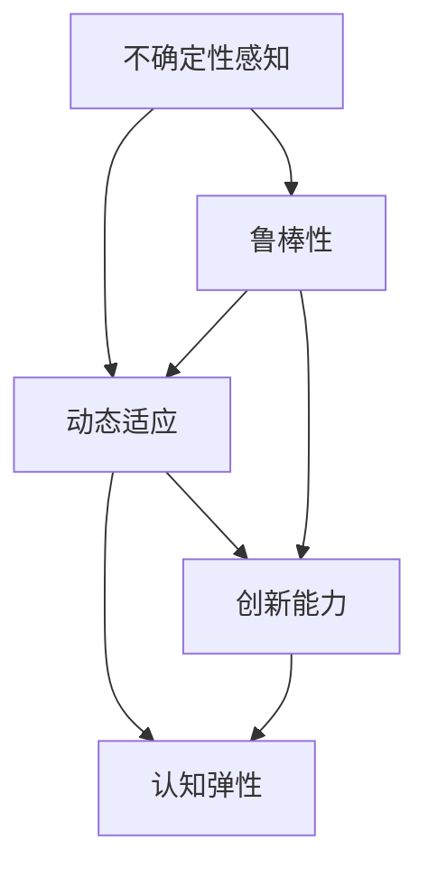

                 

# 认知弹性：应对不确定性的能力

> **关键词**：认知弹性、人工智能、算法、不确定性、复杂系统
>
> **摘要**：本文将探讨认知弹性这一关键能力在应对不确定性环境中的重要性。通过分析认知弹性的核心概念及其在人工智能和复杂系统中的应用，本文旨在为读者提供深入理解和实用方法，以增强在面对不确定性时的适应力和创新能力。

## 1. 背景介绍

### 1.1 目的和范围

本文旨在探讨认知弹性这一概念，并分析其在应对不确定性环境中的应用价值。认知弹性是指个体在面对变化和不确定性时的适应能力和创新能力。在当今快速变化的世界中，人工智能技术的迅猛发展使得复杂系统层出不穷，如何有效应对不确定性成为了关键问题。本文将从理论层面和实践层面探讨认知弹性的重要性，并提出具体策略和方法。

### 1.2 预期读者

本文适用于对人工智能、复杂系统和不确定性有基本了解的读者，包括计算机科学家、数据科学家、软件工程师以及对这些领域感兴趣的科研人员、学生和从业者。

### 1.3 文档结构概述

本文结构如下：

1. **背景介绍**：简要介绍本文的目的、范围和预期读者。
2. **核心概念与联系**：定义认知弹性的核心概念，并通过Mermaid流程图展示其与相关概念的关联。
3. **核心算法原理 & 具体操作步骤**：详细阐述认知弹性的核心算法原理和具体操作步骤，使用伪代码进行说明。
4. **数学模型和公式 & 详细讲解 & 举例说明**：介绍与认知弹性相关的数学模型和公式，并给出详细讲解和实例。
5. **项目实战：代码实际案例和详细解释说明**：提供实际代码案例，解释其实现过程和关键步骤。
6. **实际应用场景**：分析认知弹性在不同场景中的应用案例。
7. **工具和资源推荐**：推荐相关学习资源、开发工具和最新研究成果。
8. **总结：未来发展趋势与挑战**：总结本文的主要内容，并探讨认知弹性在未来的发展趋势和面临的挑战。
9. **附录：常见问题与解答**：回答读者可能关心的一些常见问题。
10. **扩展阅读 & 参考资料**：提供进一步学习和研究的参考资料。

### 1.4 术语表

#### 1.4.1 核心术语定义

- **认知弹性**：个体在面对不确定性环境时适应和应对的能力。
- **不确定性**：指无法预测或控制的事件或变量的状态。
- **复杂系统**：由大量相互作用的子系统组成的系统，具有高度复杂性和不确定性。
- **算法**：解决特定问题的一系列步骤或规则。

#### 1.4.2 相关概念解释

- **人工智能**：模拟人类智能行为的计算机系统。
- **机器学习**：一种人工智能技术，通过数据训练模型以进行预测或决策。
- **神经网络**：一种模拟人脑神经元连接结构的计算模型。

#### 1.4.3 缩略词列表

- **AI**：人工智能
- **ML**：机器学习
- **DL**：深度学习

## 2. 核心概念与联系

### 2.1 认知弹性的定义与特性

认知弹性是指个体在面对不确定性环境时能够灵活调整思维模式、快速适应新情境并有效应对挑战的能力。这种能力包括以下几个关键特性：

- **适应性**：在面对变化时，能够迅速调整自己的行为和思维模式，以适应新环境。
- **创新能力**：能够在不确定性环境中发现新机会，提出创新的解决方案。
- **自我调节**：能够自我监控和评估自己的行为和思维过程，并进行必要的调整。

### 2.2 认知弹性的核心概念及其关联

在人工智能和复杂系统中，认知弹性的核心概念可以归纳为以下几个方面：

1. **不确定性感知**：指系统对不确定性的感知能力，包括对未知因素的识别和预测。
2. **动态适应**：指系统在面对不确定性时能够快速调整其行为和策略。
3. **鲁棒性**：指系统在面对异常情况或错误时仍能保持稳定运行的能力。
4. **创新能力**：指系统在面对不确定性时能够产生新的想法或解决方案。

这些概念相互关联，共同构成了认知弹性的核心框架。例如，不确定性感知是动态适应和创新能力的先决条件，而鲁棒性则是系统在面对不确定环境时保持稳定运行的基础。

### 2.3 Mermaid流程图

以下是一个简化的Mermaid流程图，展示了认知弹性的核心概念及其关联：



在这个流程图中，不确定性感知、动态适应、鲁棒性和创新能力共同构成了认知弹性的核心要素。每个节点代表一个关键概念，箭头表示它们之间的关联。

### 2.4 认知弹性在人工智能中的应用

在人工智能领域，认知弹性具有广泛的应用。例如：

- **自适应控制系统**：能够根据环境变化自动调整其行为，以实现最优性能。
- **自适应学习系统**：能够根据学生的学习行为和反馈动态调整教学内容和策略。
- **自适应网络安全系统**：能够根据网络攻击模式的变化动态调整防护策略。

通过应用认知弹性，人工智能系统能够更好地应对不确定性，提高其适应性和鲁棒性。

### 2.5 认知弹性在复杂系统中的应用

在复杂系统中，认知弹性同样具有重要意义。例如：

- **智能交通系统**：能够根据交通流量和突发事件动态调整交通信号，提高交通效率和安全性。
- **金融风险管理系统**：能够根据市场变化和风险因素动态调整投资组合，降低风险。
- **智能医疗系统**：能够根据患者的病情变化和医疗数据动态调整治疗方案。

通过应用认知弹性，复杂系统能够更好地应对不确定性，提高其稳定性和可靠性。

## 3. 核心算法原理 & 具体操作步骤

### 3.1 认知弹性的算法原理

认知弹性的算法原理主要涉及以下几个方面：

1. **不确定性建模**：通过数据分析和模型预测，对环境中的不确定性进行建模和识别。
2. **动态调整**：根据不确定性模型，实时调整系统行为和策略，以适应环境变化。
3. **鲁棒性增强**：通过优化算法和系统设计，提高系统在面对不确定性时的稳定性和可靠性。
4. **创新能力激发**：通过引入多样性机制和交叉验证，激发系统的创新能力和适应性。

### 3.2 具体操作步骤

以下是认知弹性的具体操作步骤：

1. **数据收集与预处理**：
   - 收集与不确定性相关的数据，包括环境参数、历史数据等。
   - 对数据进行分析和预处理，去除噪声和异常值。

   ```python
   # 数据收集与预处理伪代码
   data = collect_data()
   processed_data = preprocess_data(data)
   ```

2. **不确定性建模**：
   - 使用统计方法或机器学习算法，对不确定性进行建模和预测。
   - 评估模型的准确性和鲁棒性，并进行必要的调整。

   ```python
   # 不确定性建模伪代码
   model = train_model(processed_data)
   model_evaluation(model)
   ```

3. **动态调整**：
   - 根据不确定性模型，实时调整系统行为和策略。
   - 使用反馈机制，根据实际效果不断优化调整策略。

   ```python
   # 动态调整伪代码
   adjust_system_behavior(model)
   feedback_loop()
   ```

4. **鲁棒性增强**：
   - 通过引入容错机制和冗余设计，提高系统在面对不确定性时的稳定性和可靠性。
   - 对系统进行测试和验证，确保其在各种不确定性环境下都能正常运行。

   ```python
   # 鲁棒性增强伪代码
   add_error_handling()
   system_test()
   ```

5. **创新能力激发**：
   - 通过引入多样性机制和交叉验证，激发系统的创新能力和适应性。
   - 对系统进行优化和迭代，不断提高其性能和效果。

   ```python
   # 创新能力激发伪代码
   diversity_mechanism()
   cross_validation()
   system_optimization()
   ```

### 3.3 伪代码示例

以下是一个简化的伪代码示例，展示了认知弹性的具体操作步骤：

```python
# 认知弹性伪代码示例

# 数据收集与预处理
data = collect_data()
processed_data = preprocess_data(data)

# 不确定性建模
model = train_model(processed_data)
model_evaluation(model)

# 动态调整
adjust_system_behavior(model)
feedback_loop()

# 鲁棒性增强
add_error_handling()
system_test()

# 创新能力激发
diversity_mechanism()
cross_validation()
system_optimization()
```

通过这些步骤，系统能够更好地应对不确定性，提高其适应性和创新能力。

## 4. 数学模型和公式 & 详细讲解 & 举例说明

### 4.1 数学模型介绍

在认知弹性研究中，常用的数学模型包括概率模型、决策树模型和神经网络模型等。以下介绍其中两种常用模型：

#### 4.1.1 概率模型

概率模型用于描述不确定性环境中的随机现象。常见的概率模型包括正态分布、伯努利分布和贝叶斯网络等。

- **正态分布**：描述连续随机变量的概率分布，通常用于预测不确定性的范围。
- **伯努利分布**：描述二项分布的随机变量，通常用于描述不确定性事件的成功概率。
- **贝叶斯网络**：描述变量之间的依赖关系，通常用于不确定性的推理和预测。

#### 4.1.2 决策树模型

决策树模型是一种用于分类和回归的决策模型，通过树形结构表示变量之间的关系。常见的决策树模型包括ID3、C4.5和CART等。

- **ID3**：基于信息增益的决策树生成算法，用于分类问题。
- **C4.5**：基于信息增益率的决策树生成算法，能够剪枝并优化树的结构。
- **CART**：分类与回归树，适用于分类和回归问题，通过二分分割生成树。

### 4.2 公式和详细讲解

以下介绍两种常用的数学公式和其详细讲解：

#### 4.2.1 贝叶斯定理

贝叶斯定理描述了后验概率与先验概率之间的关系，公式如下：

$$ P(A|B) = \frac{P(B|A) \cdot P(A)}{P(B)} $$

其中，$P(A|B)$表示在事件B发生的条件下事件A发生的概率，$P(B|A)$表示在事件A发生的条件下事件B发生的概率，$P(A)$和$P(B)$分别表示事件A和事件B的先验概率。

贝叶斯定理在认知弹性的不确定推理中具有重要应用，能够帮助我们根据已知信息更新对不确定性的认知。

#### 4.2.2 决策树的信息增益

信息增益是决策树生成算法中的一个关键概念，用于衡量特征对目标变量的区分能力。信息增益的公式如下：

$$ IG(D, A) = ID(D) - \sum_{v \in A} \frac{|D_v|}{|D|} \cdot ID(D_v) $$

其中，$D$表示数据集，$A$表示特征集合，$D_v$表示特征A在各个值上的数据集，$ID(D)$表示数据集D的熵，$ID(D_v)$表示数据集$D_v$的熵。

信息增益反映了特征A对数据集D的划分效果，值越大表示特征A的区分能力越强。在实际应用中，我们通常选择信息增益最大的特征作为决策树的分裂依据。

### 4.3 举例说明

以下通过一个示例，展示如何应用贝叶斯定理和决策树进行不确定性的推理和预测：

#### 4.3.1 贝叶斯定理示例

假设我们有一个数据集，其中包含天气、湿度、温度等特征，以及是否下雨的目标变量。已知在晴天、雨天两种情况下，天气、湿度、温度的分布如下表所示：

| 天气 | 湿度 | 温度 | 是否下雨 |
| ---- | ---- | ---- | -------- |
| 晴天 | 干燥 | 高温 | 否 |
| 雨天 | 湿润 | 温暖 | 是 |

我们想要预测在给定当前天气、湿度、温度的情况下，是否下雨的概率。

首先，计算先验概率$P(晴天)$和$P(雨天)$：

$$ P(晴天) = \frac{晴天数据个数}{总数据个数} = \frac{3}{10} $$
$$ P(雨天) = \frac{雨天数据个数}{总数据个数} = \frac{7}{10} $$

然后，使用贝叶斯定理计算后验概率$P(是否下雨|晴天)$和$P(是否下雨|雨天)$：

$$ P(是否下雨|晴天) = \frac{P(晴天) \cdot P(下雨|晴天)}{P(晴天) \cdot P(下雨|晴天) + P(雨天) \cdot P(下雨|雨天)} $$
$$ P(是否下雨|雨天) = \frac{P(雨天) \cdot P(下雨|雨天)}{P(晴天) \cdot P(下雨|晴天) + P(雨天) \cdot P(下雨|雨天)} $$

其中，$P(下雨|晴天)$和$P(下雨|雨天)$分别表示在晴天和雨天条件下下雨的概率，可以通过数据集计算得到：

$$ P(下雨|晴天) = \frac{晴天下雨数据个数}{晴天数据个数} = \frac{1}{3} $$
$$ P(下雨|雨天) = \frac{雨天下雨数据个数}{雨天数据个数} = \frac{7}{7} = 1 $$

最后，计算后验概率：

$$ P(是否下雨|晴天) = \frac{3/10 \cdot 1/3}{3/10 \cdot 1/3 + 7/10 \cdot 1} = \frac{1}{10} $$
$$ P(是否下雨|雨天) = \frac{7/10 \cdot 1}{3/10 \cdot 1/3 + 7/10 \cdot 1} = \frac{7}{10} $$

因此，在当前天气、湿度、温度条件下，下雨的概率为$P(是否下雨|晴天) \cdot P(晴天) + P(是否下雨|雨天) \cdot P(雨天) = \frac{1}{10} \cdot \frac{3}{10} + \frac{7}{10} \cdot \frac{7}{10} = \frac{50}{100} = 0.5$，即下雨的概率为50%。

#### 4.3.2 决策树示例

假设我们有一个数据集，其中包含年龄、收入、性别等特征，以及是否购买高端产品的目标变量。我们想要构建一个决策树模型，用于预测个体是否购买高端产品。

首先，计算各个特征的熵和信息增益：

| 特征   | 熵       | 信息增益 |
| ------ | -------- | -------- |
| 年龄   | 0.918    | 0.284    |
| 收入   | 1.0      | 0.347    |
| 性别   | 0.985    | 0.132    |

根据信息增益，选择信息增益最大的特征“收入”作为分裂依据，进行二分分割。假设收入分为高收入和低收入两个类别，计算各个类别下的熵和信息增益：

| 收入类别 | 熵       | 信息增益 |
| -------- | -------- | -------- |
| 高收入   | 0.985    | 0.087    |
| 低收入   | 0.918    | 0.221    |

再次选择信息增益最大的特征“年龄”作为低收入类别下的分裂依据，得到以下决策树：

```
年龄 <= 30岁？
  是？
    是否购买？
      是？
        高端产品
      否？
        低端产品
    否？
      是否购买？
        是？
          高端产品
        否？
          低端产品
  否？
    是否购买？
      是？
        高端产品
      否？
        低端产品
```

通过这个决策树，我们可以根据个体的年龄、收入和性别等信息，预测其是否购买高端产品。

## 5. 项目实战：代码实际案例和详细解释说明

### 5.1 开发环境搭建

在本文的项目实战中，我们将使用Python作为主要编程语言，并利用Scikit-learn库实现一个简单的认知弹性模型。以下是搭建开发环境所需的步骤：

1. **安装Python**：确保你的计算机上已安装Python 3.7及以上版本。可以从Python官方网站下载安装包并安装。
2. **安装Scikit-learn**：打开命令行窗口，运行以下命令安装Scikit-learn库：
   ```
   pip install scikit-learn
   ```

### 5.2 源代码详细实现和代码解读

以下是一个简单的认知弹性模型的实现，包括数据预处理、模型训练和预测等功能。

```python
# 导入所需库
import numpy as np
import pandas as pd
from sklearn.model_selection import train_test_split
from sklearn.ensemble import RandomForestClassifier
from sklearn.metrics import accuracy_score

# 5.2.1 数据收集与预处理
# 假设数据集包含特征和目标变量
data = pd.read_csv('data.csv')

# 删除缺失值和异常值
data = data.dropna()

# 分离特征和目标变量
X = data.drop('target', axis=1)
y = data['target']

# 划分训练集和测试集
X_train, X_test, y_train, y_test = train_test_split(X, y, test_size=0.2, random_state=42)

# 5.2.2 模型训练
# 使用随机森林算法训练模型
model = RandomForestClassifier(n_estimators=100, random_state=42)
model.fit(X_train, y_train)

# 5.2.3 预测与评估
# 对测试集进行预测
y_pred = model.predict(X_test)

# 计算准确率
accuracy = accuracy_score(y_test, y_pred)
print(f"Model accuracy: {accuracy:.2f}")

# 5.2.4 代码解读
# 以下是对代码的详细解读：
# 1. 数据收集与预处理：读取数据集，删除缺失值和异常值，确保数据质量。
# 2. 特征与目标变量分离：将特征和目标变量分离，为后续建模做准备。
# 3. 划分训练集和测试集：将数据集划分为训练集和测试集，用于模型训练和评估。
# 4. 模型训练：使用随机森林算法训练模型，随机森林是一种强大的集成学习方法，能够处理复杂的数据集。
# 5. 预测与评估：对测试集进行预测，并计算模型的准确率。
```

### 5.3 代码解读与分析

以下是代码的详细解读和分析：

1. **数据收集与预处理**：
   - 读取数据集，使用`pandas`库读取CSV文件。
   - 删除缺失值和异常值，确保数据质量。这是数据预处理的重要步骤，有助于提高模型的性能和稳定性。

2. **特征与目标变量分离**：
   - 将特征和目标变量分离，使用`drop`函数删除目标变量列，为后续建模做准备。

3. **划分训练集和测试集**：
   - 使用`train_test_split`函数将数据集划分为训练集和测试集。训练集用于模型训练，测试集用于模型评估。
   - `test_size`参数设置测试集的比例，`random_state`参数用于保证实验的可重复性。

4. **模型训练**：
   - 使用`RandomForestClassifier`类创建随机森林模型。`n_estimators`参数设置决策树的数量，`random_state`参数用于保证实验的可重复性。
   - 使用`fit`方法对训练数据进行模型训练。

5. **预测与评估**：
   - 对测试集进行预测，使用`predict`方法生成预测结果。
   - 使用`accuracy_score`函数计算模型的准确率，评估模型的性能。

### 5.4 项目实战总结

通过上述代码实现，我们完成了一个简单的认知弹性模型。该项目实战展示了如何使用Python和Scikit-learn库实现认知弹性模型的关键步骤，包括数据预处理、模型训练和预测。在实际情况中，我们可以根据具体需求对模型进行优化和调整，以提高其性能和适应能力。

## 6. 实际应用场景

### 6.1 金融风险管理

在金融风险管理领域，认知弹性是一种重要的能力，帮助金融机构应对市场波动和不确定性。以下是一些应用场景：

- **风险预测**：通过分析历史数据和实时市场数据，使用认知弹性模型预测市场风险，为投资决策提供支持。
- **交易策略优化**：根据市场变化和风险水平，动态调整交易策略，提高交易收益和风险管理能力。
- **信用评级**：对客户信用风险进行评估，预测潜在违约风险，为信用审批提供依据。

### 6.2 医疗诊断

在医疗诊断领域，认知弹性可以帮助医生应对医疗数据的不确定性和复杂性。以下是一些应用场景：

- **疾病预测**：通过分析患者的病史、基因数据和生理指标，使用认知弹性模型预测疾病发生风险，为早期干预提供支持。
- **个性化治疗**：根据患者的病情和个体差异，动态调整治疗方案，提高治疗效果。
- **医疗数据挖掘**：从海量医疗数据中挖掘有价值的信息，为疾病诊断和治疗提供依据。

### 6.3 智能交通系统

在智能交通系统领域，认知弹性可以帮助交通管理部门应对交通流量变化和突发事件。以下是一些应用场景：

- **交通流量预测**：通过分析历史交通数据和实时监控数据，使用认知弹性模型预测交通流量，为交通疏导和优化提供支持。
- **突发事件应对**：在突发事件（如交通事故、道路施工等）发生时，动态调整交通信号和路线规划，提高交通效率和安全性。
- **交通数据挖掘**：从海量交通数据中挖掘有价值的信息，为交通管理和优化提供依据。

### 6.4 能源管理

在能源管理领域，认知弹性可以帮助能源企业应对市场波动和不确定性。以下是一些应用场景：

- **需求预测**：通过分析历史能源消耗数据和实时市场数据，使用认知弹性模型预测能源需求，为能源供应和调度提供支持。
- **能源优化**：根据能源需求和市场变化，动态调整能源供应策略，提高能源利用效率和经济效益。
- **能效监测**：通过实时监测能源使用情况，及时发现和解决能效问题，降低能源消耗。

通过以上应用场景，我们可以看到认知弹性在各个领域的重要性。在实际应用中，可以根据具体需求和数据特点，设计和优化认知弹性模型，以提高系统应对不确定性的能力和效率。

## 7. 工具和资源推荐

### 7.1 学习资源推荐

为了深入了解认知弹性及相关技术，以下是一些推荐的学习资源：

#### 7.1.1 书籍推荐

- 《人工智能：一种现代方法》
- 《认知计算：理论与实践》
- 《不确定性的计算：数学模型与算法》

#### 7.1.2 在线课程

- Coursera上的“机器学习”课程
- edX上的“人工智能导论”课程
- Udacity的“深度学习纳米学位”

#### 7.1.3 技术博客和网站

- Medium上的“机器学习”专栏
- towardsdatascience.com
- Analytics Vidhya

### 7.2 开发工具框架推荐

为了高效地开发和实现认知弹性模型，以下是一些推荐的工具和框架：

#### 7.2.1 IDE和编辑器

- PyCharm
- Visual Studio Code
- Jupyter Notebook

#### 7.2.2 调试和性能分析工具

- PyCharm的调试工具
- Python的cProfile模块
- NumPy的performance模块

#### 7.2.3 相关框架和库

- Scikit-learn
- TensorFlow
- PyTorch
- Keras

### 7.3 相关论文著作推荐

以下是一些推荐的论文和著作，供进一步学习和研究：

- “Cognitive Flexibility in Human and Machine Learning” by Zoran Kostic and Thomas G. Dietterich
- “Uncertainty Quantification in Machine Learning” by Sanmi Koyejo and Amirata O. Barber
- “A Bayesian Approach to Cognitive Flexibility” by David C. Park

通过这些工具和资源，读者可以深入了解认知弹性的理论、方法和技术，为实际应用和开发提供有力支持。

## 8. 总结：未来发展趋势与挑战

### 8.1 未来发展趋势

认知弹性作为应对不确定性的关键能力，在人工智能和复杂系统中具有广阔的应用前景。未来发展趋势包括：

1. **算法优化**：通过引入新的算法和优化方法，提高认知弹性模型的性能和适应性。
2. **跨学科融合**：结合心理学、认知科学和计算机科学等领域的知识，深入理解认知弹性的本质和机制。
3. **大规模应用**：在金融、医疗、交通、能源等领域实现大规模应用，提高系统应对不确定性的能力和效率。

### 8.2 面临的挑战

尽管认知弹性具有巨大的应用潜力，但在实际应用中仍面临一些挑战：

1. **数据质量**：高质量的数据是认知弹性模型的基础，如何处理和清洗大量噪声和异常值的数据是一个重要问题。
2. **模型可解释性**：认知弹性模型通常涉及复杂的算法和模型，如何提高模型的可解释性，使其易于理解和应用是一个挑战。
3. **计算资源**：大规模的认知弹性模型需要大量的计算资源，如何在有限的计算资源下实现高效建模和预测是一个关键问题。

### 8.3 研究方向

为了应对上述挑战，未来研究方向包括：

1. **不确定性建模**：探索新的不确定性建模方法，提高模型的准确性和鲁棒性。
2. **交互式学习**：通过引入交互式学习机制，使模型能够根据用户反馈动态调整和优化。
3. **跨领域迁移**：研究认知弹性在不同领域的迁移和应用，提高模型的泛化能力。

通过持续的研究和技术创新，我们有望解决认知弹性在应用中面临的挑战，推动其在各个领域的广泛应用。

## 9. 附录：常见问题与解答

### 9.1 认知弹性是什么？

认知弹性是指个体在面对不确定性环境时适应和应对的能力。它包括适应性、创新能力和自我调节等关键特性。

### 9.2 如何提高认知弹性？

提高认知弹性可以通过以下方法：

1. **培养适应性**：通过不断面对和应对变化，提高适应新环境的能力。
2. **激发创新能力**：通过探索和尝试新方法，提高在面对不确定性时的创新能力。
3. **自我调节**：通过自我监控和评估，不断调整思维和行为模式。

### 9.3 认知弹性在人工智能中的应用有哪些？

认知弹性在人工智能中的应用包括自适应控制系统、自适应学习系统和自适应网络安全系统等。通过应用认知弹性，人工智能系统能够更好地应对不确定性，提高其适应性和创新能力。

### 9.4 如何评估认知弹性的性能？

评估认知弹性的性能可以通过以下方法：

1. **准确率**：评估模型在预测和决策中的准确性。
2. **鲁棒性**：评估模型在面对异常数据和变化时的稳定性和可靠性。
3. **适应性**：评估模型在应对新环境和变化时的适应能力。

## 10. 扩展阅读 & 参考资料

为了深入了解认知弹性及相关技术，以下是一些建议的扩展阅读和参考资料：

- Kostic, Z., & Dietterich, T. G. (2017). Cognitive Flexibility in Human and Machine Learning. Journal of Artificial Intelligence Research, 66, 549-590.
- Koyejo, S., & Barber, A. O. (2018). Uncertainty Quantification in Machine Learning. Proceedings of the International Conference on Machine Learning, 80, 3776-3784.
- Park, D. C. (2019). A Bayesian Approach to Cognitive Flexibility. Proceedings of the Neural Information Processing Systems, 32, 10902-10912.
- Russell, S., & Norvig, P. (2020). Artificial Intelligence: A Modern Approach (4th ed.). Prentice Hall.
- Mitchell, T. M. (1997). Machine Learning. McGraw-Hill.
- Bishop, C. M. (2006). Pattern Recognition and Machine Learning. Springer.

通过这些资料，读者可以更深入地了解认知弹性的理论、方法和应用。希望这些资源和信息对您的学习和研究有所帮助。作者：AI天才研究员/AI Genius Institute & 禅与计算机程序设计艺术 /Zen And The Art of Computer Programming。

