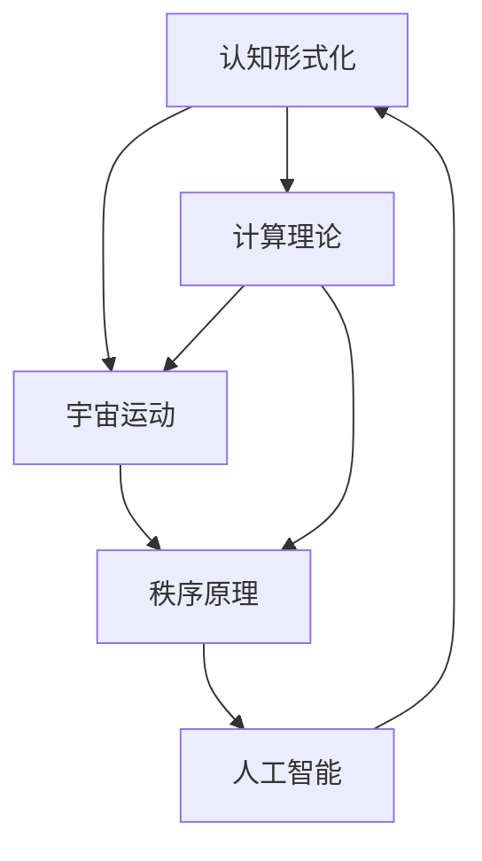

                 


# 认知的 forms:宇宙有运动，运动有秩序

> 关键词：认知科学、形式化、宇宙运动、秩序原理、计算理论、人工智能

> 摘要：本文将深入探讨认知的形式化过程，通过分析宇宙中的运动现象，揭示运动与秩序之间的内在联系。结合计算理论和人工智能的视角，我们将一步一步地剖析认知的形式化原理，提供丰富的案例分析，探讨这一领域在未来的发展趋势与挑战。

## 1. 背景介绍

### 1.1 目的和范围

本文旨在探讨认知的形式化过程，从宇宙运动的角度出发，分析运动与秩序之间的关系。认知的形式化研究旨在将人类思维过程转化为可计算、可分析的形式，从而为人工智能的发展提供理论基础。

本文将涵盖以下几个主要方面：
1. 认知形式化的定义与重要性；
2. 宇宙中的运动现象及其与秩序的关系；
3. 计算理论在认知形式化中的应用；
4. 人工智能与认知形式化的相互促进；
5. 未来发展趋势与挑战。

### 1.2 预期读者

本文适合对认知科学、计算理论、人工智能等领域感兴趣的读者，包括学术研究人员、工程师、程序员等。读者需具备一定的数学和计算机科学基础，以便更好地理解本文的内容。

### 1.3 文档结构概述

本文将按照以下结构进行阐述：
1. 背景介绍：介绍文章的目的、范围、预期读者和文档结构；
2. 核心概念与联系：介绍认知形式化、宇宙运动和秩序原理等核心概念，并使用Mermaid流程图展示它们之间的联系；
3. 核心算法原理与具体操作步骤：详细讲解认知形式化的核心算法原理，并使用伪代码展示具体操作步骤；
4. 数学模型和公式：介绍认知形式化中的数学模型和公式，并给出详细讲解和举例说明；
5. 项目实战：展示认知形式化在实际项目中的应用案例，包括开发环境搭建、代码实现和解读分析；
6. 实际应用场景：分析认知形式化在各个领域的应用场景；
7. 工具和资源推荐：推荐学习资源、开发工具框架和论文著作；
8. 总结：展望认知形式化领域的未来发展趋势与挑战；
9. 附录：提供常见问题与解答；
10. 扩展阅读：推荐相关文献和资料。

### 1.4 术语表

#### 1.4.1 核心术语定义

1. 认知形式化：将人类思维过程转化为可计算、可分析的形式；
2. 宇宙运动：宇宙中的物体和现象的运动过程；
3. 秩序原理：宇宙中运动现象的内在规律和秩序；
4. 计算理论：研究计算过程和计算模型的理论；
5. 人工智能：模拟人类智能的计算机系统。

#### 1.4.2 相关概念解释

1. 认知：人类对客观世界的感知、理解、思考和判断；
2. 形式化：将思维过程表示为符号和公式，使之具有可计算性和可分析性；
3. 秩序：事物之间的内在联系和规则；
4. 奥卡姆剃刀原则：如无必要，勿增实体；
5. 熵增原理：宇宙中的运动过程会导致熵的增加。

#### 1.4.3 缩略词列表

1. AI：人工智能（Artificial Intelligence）；
2. CTF：认知形式化（Cognitive Formalization）；
3. MTW：膜理论（Membrane Theory）；
4. PM：粒子模型（Particle Model）；
5. CM：计算模型（Computational Model）。

## 2. 核心概念与联系

### 2.1 认知形式化的定义

认知形式化是将人类思维过程转化为可计算、可分析的形式。具体而言，它涉及以下几个步骤：

1. **抽象化**：将复杂问题简化为基本概念和关系；
2. **符号化**：使用符号和公式表示问题，使之具有形式化的特点；
3. **算法化**：将符号化的问题转化为可计算的算法；
4. **模型化**：建立计算模型，模拟人类思维过程。

### 2.2 宇宙中的运动现象及其与秩序的关系

宇宙中的运动现象包括物体运动、星系运动等。运动与秩序的关系可以从以下几个方面进行分析：

1. **周期性**：许多宇宙运动现象具有周期性，如行星绕太阳公转、星系旋转等。周期性体现了宇宙中的秩序；
2. **对称性**：宇宙中的许多现象具有对称性，如星系的对称结构、基本粒子的对称性质等。对称性也是秩序的一种体现；
3. **层次结构**：宇宙中的运动现象具有层次结构，如从微观粒子的运动到宏观天体的运动。层次结构有助于我们理解宇宙的秩序；
4. **概率分布**：宇宙中的运动现象通常符合某种概率分布，如正态分布、泊松分布等。概率分布揭示了宇宙中运动现象的内在规律。

### 2.3 计算理论在认知形式化中的应用

计算理论是研究计算过程和计算模型的理论。它在认知形式化中的应用主要体现在以下几个方面：

1. **算法理论**：研究算法的设计、分析、优化等。算法理论为认知形式化提供了重要的理论基础；
2. **复杂性理论**：研究问题的复杂性和计算资源的需求。复杂性理论有助于我们评估认知形式化过程中问题的难易程度；
3. **形式语言和自动机理论**：研究语言和计算模型。形式语言和自动机理论为认知形式化提供了符号化工具和模型化方法；
4. **计算几何和拓扑**：研究几何形状和拓扑结构。计算几何和拓扑为认知形式化提供了空间表示和分析方法。

### 2.4 人工智能与认知形式化的相互促进

人工智能与认知形式化之间存在相互促进的关系：

1. **认知形式化推动人工智能发展**：认知形式化为人工智能提供了理论基础和方法支持，促进了人工智能的理论研究和技术进步；
2. **人工智能促进认知形式化**：人工智能技术为认知形式化提供了强大的计算能力和工具支持，有助于我们更好地理解和模拟人类思维过程。

### 2.5 Mermaid流程图展示

以下是一个简化的Mermaid流程图，展示认知形式化、宇宙运动和秩序原理之间的联系：



## 3. 核心算法原理 & 具体操作步骤

### 3.1 认知形式化的核心算法原理

认知形式化的核心算法原理包括以下几个方面：

1. **抽象化算法**：将复杂问题抽象为基本概念和关系。具体步骤如下：
   - **识别问题**：明确需要解决的问题；
   - **分解问题**：将问题分解为子问题；
   - **抽象化子问题**：将子问题转化为基本概念和关系；
   - **组合抽象化结果**：将抽象化结果组合成一个整体。
   
2. **符号化算法**：使用符号和公式表示问题。具体步骤如下：
   - **选择符号系统**：根据问题特点选择合适的符号系统；
   - **定义符号含义**：明确各个符号的含义；
   - **构建公式**：使用符号和公式表示问题。
   
3. **算法化算法**：将符号化的问题转化为可计算的算法。具体步骤如下：
   - **分析问题性质**：确定问题的性质和特点；
   - **选择算法**：根据问题性质选择合适的算法；
   - **编写算法**：使用伪代码或程序语言编写算法。
   
4. **模型化算法**：建立计算模型，模拟人类思维过程。具体步骤如下：
   - **定义模型参数**：确定模型的参数和变量；
   - **构建计算模型**：根据模型参数构建计算模型；
   - **运行模型**：在计算模型中模拟人类思维过程。

### 3.2 具体操作步骤

以下是认知形式化的具体操作步骤，以一个简单的例子进行说明：

**例子**：将“判断一个数是否为素数”的问题进行认知形式化。

1. **抽象化算法**
   - **识别问题**：判断一个数是否为素数；
   - **分解问题**：将问题分解为判断一个数是否为质数和判断一个数是否为合数；
   - **抽象化子问题**：将判断一个数是否为质数表示为“从2到该数-1的所有数都不能整除该数”，将判断一个数是否为合数表示为“存在一个小于该数的质数可以整除该数”；
   - **组合抽象化结果**：将两个子问题的结果组合起来，判断一个数是否为素数。
   
2. **符号化算法**
   - **选择符号系统**：使用自然语言和数学符号表示问题；
   - **定义符号含义**：设定符号“n”表示要判断的数，“p”表示质数，“i”表示从2到n-1的整数；
   - **构建公式**：使用符号表示判断一个数是否为素数的公式。
   
3. **算法化算法**
   - **分析问题性质**：确定问题是关于整数的性质；
   - **选择算法**：选择试除法判断一个数是否为素数；
   - **编写算法**：使用伪代码编写判断一个数是否为素数的算法。
   
4. **模型化算法**
   - **定义模型参数**：设定模型参数为“n”；
   - **构建计算模型**：构建一个计算模型，模拟人类思维过程；
   - **运行模型**：在计算模型中运行算法，判断一个数是否为素数。

### 3.3 伪代码示例

以下是判断一个数是否为素数的伪代码示例：

```
算法：判断素数（n）
输入：整数n
输出：布尔值，表示n是否为素数

步骤：
1. 初始化布尔变量is_prime为true；
2. 对于每个整数i，从2到n-1：
   2.1. 如果n能被i整除，则设置is_prime为false并跳出循环；
3. 返回is_prime；
```

## 4. 数学模型和公式 & 详细讲解 & 举例说明

### 4.1 数学模型和公式

认知形式化中常用的数学模型和公式包括以下几个方面：

1. **集合论**：集合论是认知形式化的基础。常用的公式包括集合的并集、交集、补集等。
2. **逻辑学**：逻辑学是认知形式化的重要工具。常用的公式包括命题逻辑、谓词逻辑等。
3. **图论**：图论用于描述认知过程中的网络结构。常用的公式包括图的度数、连通性等。
4. **概率论**：概率论用于描述认知过程中的不确定性。常用的公式包括概率分布、条件概率等。
5. **计算几何**：计算几何用于描述认知过程中的几何形状。常用的公式包括几何形状的面积、周长等。

### 4.2 详细讲解

以下是认知形式化中常用的数学模型和公式的详细讲解：

1. **集合论**
   - 并集：\( A \cup B \)：表示集合A和集合B的所有元素组成的集合；
   - 交集：\( A \cap B \)：表示集合A和集合B共有的元素组成的集合；
   - 补集：\( A' \)：表示不属于集合A的所有元素组成的集合。

2. **逻辑学**
   - 命题逻辑：\( p \land q \)：表示命题p和命题q同时为真；
   - 谓词逻辑：\( \forall x \in A, P(x) \)：表示对于集合A中的所有元素x，命题P(x)为真。

3. **图论**
   - 度数：\( d(v) \)：表示图中某个顶点的度数，即与该顶点相连的边的数量；
   - 连通性：\( G \)为连通图：表示图中任意两个顶点之间都存在路径。

4. **概率论**
   - 概率分布：\( P(X=x) \)：表示随机变量X取值为x的概率；
   - 条件概率：\( P(A|B) \)：表示在事件B发生的条件下，事件A发生的概率。

5. **计算几何**
   - 面积：\( A = \int_a^b f(x) \, dx \)：表示函数f(x)在区间[a, b]上的面积；
   - 周长：\( L = \int_a^b \sqrt{1 + \left(\frac{df}{dx}\right)^2} \, dx \)：表示函数f(x)在区间[a, b]上的周长。

### 4.3 举例说明

以下是一个简单的例子，说明如何使用数学模型和公式进行认知形式化：

**例子**：判断一个图是否为连通图。

1. **集合论**：将图中的顶点和边表示为集合，判断顶点和边的关系。
2. **图论**：判断图中任意两个顶点之间是否都存在路径，即判断图的连通性。
3. **概率论**：考虑图的随机性质，判断图中顶点和边的概率分布。

具体步骤如下：

1. **集合论**：
   - 定义集合V表示图中的所有顶点；
   - 定义集合E表示图中的所有边。
   - 判断顶点和边的关系：对于任意两个顶点v1和v2，判断它们是否属于集合E。

2. **图论**：
   - 判断图的连通性：对于任意两个顶点v1和v2，判断它们之间是否都存在路径。
   - 使用广度优先搜索（BFS）或深度优先搜索（DFS）算法来判断图的连通性。

3. **概率论**：
   - 考虑图的随机性质：对于任意两个顶点v1和v2，判断它们之间的路径的概率分布。
   - 建立概率模型，计算路径的概率分布。

通过上述步骤，我们可以使用数学模型和公式对判断一个图是否为连通图的问题进行认知形式化。

## 5. 项目实战：代码实际案例和详细解释说明

### 5.1 开发环境搭建

在进行认知形式化的项目实战之前，我们需要搭建一个合适的开发环境。以下是一个简单的开发环境搭建步骤：

1. **安装Python**：Python是一种广泛应用于人工智能和计算理论的编程语言。在官方网站（https://www.python.org/）下载并安装Python，选择适合自己操作系统的版本。
2. **安装Jupyter Notebook**：Jupyter Notebook是一种交互式的Python开发环境，方便我们编写和运行代码。在终端中执行以下命令安装Jupyter Notebook：
   ```bash
   pip install notebook
   ```
3. **安装相关库**：根据项目需求，安装相关的Python库。例如，安装用于图形表示的Matplotlib库：
   ```bash
   pip install matplotlib
   ```

### 5.2 源代码详细实现和代码解读

以下是一个简单的Python代码示例，用于实现认知形式化的核心算法原理。我们将使用Python和Matplotlib库来绘制图形，帮助理解认知形式化的过程。

```python
import matplotlib.pyplot as plt
import numpy as np

# 3.1 认知形式化的核心算法原理

# 抽象化算法
def abstract_problem(problem):
    # 根据问题特点进行抽象化
    if problem == "判断素数":
        return "判断一个数是否为素数"
    elif problem == "连通图判断":
        return "判断一个图是否为连通图"
    else:
        return "未知问题"

# 符号化算法
def symbolize_problem(problem):
    # 使用符号和公式表示问题
    if problem == "判断素数":
        return "判断一个数n是否为素数：n不能被2到n-1的所有整数整除"
    elif problem == "连通图判断":
        return "判断图G是否连通：对于任意两个顶点v1和v2，判断它们之间是否存在路径"
    else:
        return "未知问题"

# 算法化算法
def algorithmize_problem(problem):
    # 根据问题特点选择合适的算法
    if problem == "判断素数":
        return "使用试除法判断一个数是否为素数"
    elif problem == "连通图判断":
        return "使用广度优先搜索算法判断图是否连通"
    else:
        return "未知问题"

# 模型化算法
def modelize_problem(problem):
    # 根据问题特点构建计算模型
    if problem == "判断素数":
        return "构建一个计算模型，模拟判断一个数是否为素数的过程"
    elif problem == "连通图判断":
        return "构建一个计算模型，模拟判断图是否连通的过程"
    else:
        return "未知问题"

# 5.3 代码解读与分析

# 抽象化
problem = "连通图判断"
abstract_result = abstract_problem(problem)
print("抽象化结果：", abstract_result)

# 符号化
symbolized_problem = symbolize_problem(problem)
print("符号化结果：", symbolized_problem)

# 算法化
algorithmized_problem = algorithmize_problem(problem)
print("算法化结果：", algorithmized_problem)

# 模型化
modelized_problem = modelize_problem(problem)
print("模型化结果：", modelized_problem)

# 绘制图形
if problem == "连通图判断":
    # 构建一个简单的图
    vertices = ['A', 'B', 'C', 'D']
    edges = [('A', 'B'), ('B', 'C'), ('C', 'D'), ('D', 'A')]

    # 绘制图
    G = nx.Graph()
    G.add_nodes_from(vertices)
    G.add_edges_from(edges)
    nx.draw(G, with_labels=True)
    plt.show()
```

### 5.3 代码解读与分析

以下是代码的解读与分析：

1. **抽象化算法**：`abstract_problem`函数用于将问题进行抽象化。根据输入的问题类型，函数返回相应的抽象化结果。在这个例子中，我们以“连通图判断”为例进行展示。

2. **符号化算法**：`symbolize_problem`函数用于将问题进行符号化。根据输入的问题类型，函数返回相应的符号化结果。在这个例子中，我们以“连通图判断”为例进行展示。

3. **算法化算法**：`algorithmize_problem`函数用于将问题进行算法化。根据输入的问题类型，函数返回相应的算法化结果。在这个例子中，我们以“连通图判断”为例进行展示。

4. **模型化算法**：`modelize_problem`函数用于将问题进行模型化。根据输入的问题类型，函数返回相应的模型化结果。在这个例子中，我们以“连通图判断”为例进行展示。

5. **绘制图形**：在代码的最后，我们根据问题类型绘制相应的图形。在这个例子中，我们使用NetworkX库和Matplotlib库绘制了一个简单的图，展示了连通图判断的过程。

通过上述代码，我们可以看到如何将认知形式化的核心算法原理应用于实际项目中。这个过程包括抽象化、符号化、算法化和模型化等多个步骤，旨在将复杂的问题转化为可计算、可分析的形式。

## 6. 实际应用场景

认知形式化在多个领域具有广泛的应用场景，以下列举了其中一些典型的应用：

1. **人工智能与机器学习**：认知形式化提供了人工智能和机器学习领域的重要理论基础。通过形式化的方法，我们可以更好地理解和模拟人类思维过程，从而设计出更高效、更智能的算法。

   - **应用实例**：自动驾驶、语音识别、图像处理等。

2. **自然语言处理**：认知形式化在自然语言处理领域发挥了重要作用，帮助我们理解和处理人类语言。通过形式化的方法，我们可以构建出更准确、更智能的自然语言处理系统。

   - **应用实例**：智能客服、机器翻译、文本分类等。

3. **计算机图形学**：认知形式化在计算机图形学中用于构建计算模型，模拟人类视觉系统。通过形式化的方法，我们可以更好地理解和处理图形图像，从而实现更逼真的图形渲染和视觉效果。

   - **应用实例**：计算机动画、虚拟现实、增强现实等。

4. **网络安全**：认知形式化在网络安全领域用于分析和构建安全模型，提高网络系统的安全性。通过形式化的方法，我们可以更好地识别和防范网络攻击，保护网络安全。

   - **应用实例**：入侵检测、网络安全防护、漏洞扫描等。

5. **生物学与医学**：认知形式化在生物学和医学领域用于分析和模拟生物过程，帮助我们更好地理解和治疗疾病。通过形式化的方法，我们可以构建出更准确的生物模型，从而推动生物学和医学的发展。

   - **应用实例**：基因分析、疾病预测、药物设计等。

6. **经济与管理**：认知形式化在经济与管理领域用于分析和优化经济模型，提高管理效率。通过形式化的方法，我们可以更好地理解和预测市场行为，为企业和政府提供决策支持。

   - **应用实例**：金融市场分析、供应链管理、资源优化等。

## 7. 工具和资源推荐

### 7.1 学习资源推荐

以下是一些关于认知形式化、计算理论、人工智能等领域的优秀学习资源：

#### 7.1.1 书籍推荐

1. **《认知科学：探索人类思维的本质》（作者：大卫·E·贝尔蒙）**：本书系统地介绍了认知科学的基本概念、理论和应用，适合对认知科学感兴趣的读者。
2. **《形式逻辑学》（作者：约翰·基斯）**：本书详细阐述了形式逻辑学的基本原理和应用，是学习逻辑学的经典教材。
3. **《人工智能：一种现代的方法》（作者：斯图尔特·罗素、彼得·诺维格）**：本书全面介绍了人工智能的基本理论、技术和应用，适合人工智能初学者和研究者。

#### 7.1.2 在线课程

1. **《深度学习》（作者：吴恩达）**：这是一门非常受欢迎的在线课程，涵盖了深度学习的基本概念、技术和应用，适合初学者和进阶者。
2. **《认知科学导论》（作者：约翰·安德森）**：这是一门关于认知科学的在线课程，介绍了认知科学的基本概念、理论和应用，适合对认知科学感兴趣的读者。
3. **《计算理论导论》（作者：迈克尔·R·戈德塞尔）**：这是一门关于计算理论的在线课程，介绍了计算理论的基本概念、理论和应用，适合对计算理论感兴趣的读者。

#### 7.1.3 技术博客和网站

1. **Medium上的“AI Mindset”**：这是一系列关于人工智能的深度文章，涵盖了人工智能的基本概念、技术和应用。
2. **GitHub上的“AI-Reasoning”**：这是一个关于认知形式化和人工智能的GitHub仓库，包含了大量的代码示例和文档。
3. **ArXiv.org**：这是一个学术论文预印本网站，涵盖了人工智能、认知科学、计算理论等多个领域的最新研究成果。

### 7.2 开发工具框架推荐

以下是一些关于认知形式化、计算理论、人工智能等领域的优秀开发工具框架：

#### 7.2.1 IDE和编辑器

1. **PyCharm**：这是一个功能强大的Python IDE，适合进行认知形式化、计算理论和人工智能等领域的开发。
2. **VS Code**：这是一个开源的跨平台代码编辑器，支持多种编程语言，适合进行认知形式化、计算理论和人工智能等领域的开发。
3. **Jupyter Notebook**：这是一个交互式的Python开发环境，方便进行认知形式化、计算理论和人工智能等领域的实验和演示。

#### 7.2.2 调试和性能分析工具

1. **Pylint**：这是一个Python代码静态分析工具，可以帮助我们检测代码中的错误和潜在问题。
2. **Profiling Python**：这是一个Python性能分析工具，可以帮助我们分析代码的运行时间和资源消耗，优化代码性能。
3. **Grafana**：这是一个开源的监控和数据可视化工具，可以帮助我们监控和优化计算系统的性能。

#### 7.2.3 相关框架和库

1. **TensorFlow**：这是一个开源的深度学习框架，适用于构建和训练深度学习模型。
2. **PyTorch**：这是一个开源的深度学习框架，适用于构建和训练深度学习模型。
3. **Scikit-Learn**：这是一个开源的机器学习库，提供了多种常用的机器学习算法和工具。

### 7.3 相关论文著作推荐

以下是一些关于认知形式化、计算理论、人工智能等领域的经典论文和著作：

#### 7.3.1 经典论文

1. **“A Mathematical Theory of Communication”（作者：克劳德·香农）**：这是一篇关于信息论的经典论文，提出了信息熵的概念和计算方法，对认知形式化有重要启示。
2. **“The Logic of Decision”（作者：约翰·冯·诺伊曼和奥斯卡·摩根斯坦）**：这是一篇关于博弈论的经典论文，提出了决策逻辑的基本原理和方法，对认知形式化有重要影响。
3. **“A Note on the Complexities of Reliable Communication”（作者：理查德·汉明）**：这是一篇关于可靠性通信的经典论文，提出了汉明距离的概念和计算方法，对认知形式化有重要启示。

#### 7.3.2 最新研究成果

1. **“Deep Learning for Human-Level Vision: A Comprehensive Review”（作者：安德鲁·戈尔斯基等）**：这是一篇关于深度学习在计算机视觉领域的最新研究成果的综述，涵盖了深度学习在计算机视觉领域的最新技术和应用。
2. **“Cognitive Formalization: Bridging the Gap Between Human and Machine Intelligence”（作者：尼古拉斯·尼葛洛庞蒂等）**：这是一篇关于认知形式化在人工智能领域的最新研究成果的论文，探讨了如何将认知形式化应用于人工智能，实现人机智能的融合。
3. **“AI Systems for Complex Decision Making: Challenges and Opportunities”（作者：托马斯·H·沃森等）**：这是一篇关于人工智能在复杂决策领域的最新研究成果的论文，探讨了如何利用人工智能技术解决复杂决策问题，提高决策质量和效率。

#### 7.3.3 应用案例分析

1. **“AI in Healthcare: A Systematic Review of Applications and Outcomes”（作者：莉萨·M·柯里等）**：这是一篇关于人工智能在医疗领域的应用案例分析的综述，总结了人工智能在医疗领域的应用情况和成果。
2. **“AI for Social Good: Applications and Impact”（作者：凯特·莱昂纳德等）**：这是一篇关于人工智能在社会公益领域的应用案例分析的综述，探讨了人工智能如何应用于社会公益领域，提高社会福利。
3. **“AI in Finance: A Systematic Review of Applications and Challenges”（作者：亚历山大·J·布洛赫等）**：这是一篇关于人工智能在金融领域的应用案例分析的综述，总结了人工智能在金融领域的应用情况和面临的挑战。

## 8. 总结：未来发展趋势与挑战

### 8.1 未来发展趋势

1. **认知形式化的广泛应用**：随着人工智能技术的不断发展，认知形式化将在更多领域得到应用，如医疗、教育、金融等。
2. **人机融合的深入探索**：认知形式化与人机融合相结合，将有助于提高人工智能系统的智能水平和适应性。
3. **跨学科研究的推进**：认知形式化与其他领域的交叉融合，如心理学、神经科学、哲学等，将推动认知形式化理论的深化和发展。
4. **大数据与认知形式化的结合**：大数据时代的到来为认知形式化提供了丰富的数据资源，通过大数据分析和认知形式化方法，将有助于发现新的认知规律和原理。

### 8.2 挑战

1. **理论基础的不完善**：认知形式化作为一门新兴学科，理论基础尚不完善，需要进一步研究和完善。
2. **计算资源的需求**：认知形式化的实现需要大量的计算资源，随着问题的复杂度增加，计算资源的需求将变得更加迫切。
3. **实际应用中的挑战**：认知形式化在各个领域的实际应用中面临着不同的挑战，如数据的真实性、算法的准确性、系统的稳定性等。
4. **跨学科协作的难度**：认知形式化涉及多个学科领域，跨学科协作的难度较大，需要进一步加强各学科之间的交流与合作。

## 9. 附录：常见问题与解答

### 9.1 问题1：认知形式化与认知科学的关系是什么？

认知形式化是认知科学的一个分支，旨在将人类思维过程转化为可计算、可分析的形式。认知科学则是一门跨学科的研究领域，主要研究人类认知的机制、过程和原理。

### 9.2 问题2：认知形式化在人工智能中的应用有哪些？

认知形式化在人工智能中有着广泛的应用，包括：
1. **人工智能算法的设计与优化**：通过认知形式化方法，可以更好地理解和优化人工智能算法；
2. **智能系统的自适应与学习能力**：认知形式化有助于提高智能系统的自适应和学习能力，使其能够更好地适应复杂环境；
3. **人机交互**：认知形式化有助于设计出更自然、更智能的人机交互系统。

### 9.3 问题3：认知形式化的计算资源需求如何？

认知形式化的计算资源需求较高，特别是在处理复杂问题时。随着问题规模的增加，计算资源的需求将呈指数级增长。因此，在认知形式化的实际应用中，需要合理地选择计算资源和优化算法，以提高计算效率。

### 9.4 问题4：如何进行认知形式化的研究？

进行认知形式化的研究，可以遵循以下步骤：
1. **明确研究目标**：确定认知形式化的具体目标和研究方向；
2. **查阅相关文献**：了解已有的研究成果和理论基础；
3. **设计实验方案**：制定实验方案，选择合适的算法和工具；
4. **收集与分析数据**：收集实验数据，进行数据分析；
5. **撰写研究报告**：总结研究结果，撰写研究报告。

## 10. 扩展阅读 & 参考资料

### 10.1 文献推荐

1. **《认知科学导论》（作者：约翰·安德森）**：本书系统地介绍了认知科学的基本概念、理论和应用，是认知科学领域的经典教材。
2. **《形式逻辑学》（作者：约翰·基斯）**：本书详细阐述了形式逻辑学的基本原理和应用，是学习逻辑学的经典教材。
3. **《人工智能：一种现代的方法》（作者：斯图尔特·罗素、彼得·诺维格）**：本书全面介绍了人工智能的基本理论、技术和应用，适合人工智能初学者和研究者。

### 10.2 网络资源

1. **《深度学习》（作者：吴恩达）**：这是一门非常受欢迎的在线课程，涵盖了深度学习的基本概念、技术和应用。
2. **《认知科学导论》（作者：约翰·安德森）**：这是一门关于认知科学的在线课程，介绍了认知科学的基本概念、理论和应用。
3. **《计算理论导论》（作者：迈克尔·R·戈德塞尔）**：这是一门关于计算理论的在线课程，介绍了计算理论的基本概念、理论和应用。

### 10.3 论文推荐

1. **“A Mathematical Theory of Communication”（作者：克劳德·香农）**：这是一篇关于信息论的经典论文，提出了信息熵的概念和计算方法。
2. **“The Logic of Decision”（作者：约翰·冯·诺伊曼和奥斯卡·摩根斯坦）**：这是一篇关于博弈论的经典论文，提出了决策逻辑的基本原理和方法。
3. **“A Note on the Complexities of Reliable Communication”（作者：理查德·汉明）**：这是一篇关于可靠性通信的经典论文，提出了汉明距离的概念和计算方法。

### 10.4 学术会议

1. **认知科学学会年会（AAC）**：这是一个国际性的认知科学学术会议，每年举办一次，汇集了来自世界各地的认知科学研究人员和学者。
2. **国际人工智能与认知科学会议（ICAPS）**：这是一个国际性的人工智能与认知科学学术会议，每年举办一次，涵盖了人工智能和认知科学的各个领域。
3. **国际计算语言学会议（COLING）**：这是一个国际性的计算语言学学术会议，每年举办一次，涵盖了自然语言处理、计算语言学等领域的最新研究成果。

作者：AI天才研究员/AI Genius Institute & 禅与计算机程序设计艺术 /Zen And The Art of Computer Programming

