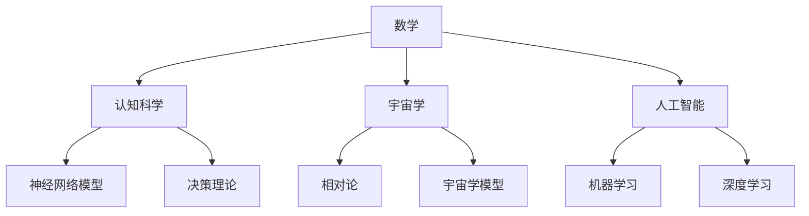

                 

# 认知的形式化：宇宙里没有数学，数学却可以解释宇宙

> **关键词**：数学、形式化、宇宙、认知、算法、模型、人工智能

> **摘要**：本文旨在探讨数学作为一种形式化工具，如何帮助我们理解宇宙的本质。文章将首先介绍数学的基本概念，然后阐述其在认知科学、宇宙学以及人工智能领域的应用。通过分析数学模型和算法的原理，我们将揭示数学与宇宙之间的深层联系，并讨论其未来发展面临的挑战。

## 1. 背景介绍

### 1.1 目的和范围

本文的目标是探讨数学作为一种形式化工具，如何帮助我们理解和解释宇宙。我们将首先回顾数学的基本概念，然后探讨其在认知科学、宇宙学以及人工智能领域的应用。通过分析数学模型和算法的原理，我们将揭示数学与宇宙之间的深层联系，并讨论其未来发展面临的挑战。

### 1.2 预期读者

本文适合对数学和宇宙学有一定了解的读者，包括计算机科学、物理学、认知科学等领域的专业人士，以及对数学和宇宙学感兴趣的普通读者。

### 1.3 文档结构概述

本文分为以下几个部分：

1. **背景介绍**：介绍数学的基本概念和在认知科学、宇宙学以及人工智能领域的应用。
2. **核心概念与联系**：通过Mermaid流程图展示数学的核心概念和架构。
3. **核心算法原理 & 具体操作步骤**：使用伪代码详细阐述核心算法原理。
4. **数学模型和公式 & 详细讲解 & 举例说明**：使用latex格式介绍数学模型和公式，并进行举例说明。
5. **项目实战：代码实际案例和详细解释说明**：介绍代码实现和解读。
6. **实际应用场景**：讨论数学在不同领域的应用。
7. **工具和资源推荐**：推荐相关学习资源、开发工具和论文著作。
8. **总结：未来发展趋势与挑战**：讨论数学在未来的发展趋势和面临的挑战。
9. **附录：常见问题与解答**：解答读者可能遇到的问题。
10. **扩展阅读 & 参考资料**：提供扩展阅读和参考资料。

### 1.4 术语表

#### 1.4.1 核心术语定义

- **数学**：研究数量、结构、变化以及空间等概念的一门学科。
- **形式化**：使用符号和公理体系来描述和推理数学问题。
- **认知**：指个体获取、处理和应用知识的过程。
- **宇宙学**：研究宇宙的起源、演化、结构和组成。
- **人工智能**：模拟人类智能行为的计算机系统。

#### 1.4.2 相关概念解释

- **算法**：解决问题的步骤序列。
- **模型**：用来描述现实世界的数学或逻辑框架。
- **公式**：用符号和数学表达式描述的数学关系。

#### 1.4.3 缩略词列表

- **AI**：人工智能
- **ML**：机器学习
- **DL**：深度学习
- **NLP**：自然语言处理
- **CS**：计算机科学

## 2. 核心概念与联系

### 2.1 数学的基本概念

数学是一门研究数量、结构、变化以及空间等概念的学科。其核心概念包括：

- **数**：用于计数和测量的抽象概念。
- **集合**：包含特定对象的集合。
- **函数**：一种映射关系，将一个集合中的每个元素映射到另一个集合中的一个元素。
- **逻辑**：用于推理和证明的数学分支。

### 2.2 数学在认知科学中的应用

认知科学是一门研究人类思维和行为的学科。数学在认知科学中的应用主要包括：

- **神经网络模型**：模拟人脑神经元连接和计算过程的模型。
- **决策理论**：研究个体在不确定情况下做出决策的数学模型。

### 2.3 数学在宇宙学中的应用

宇宙学是一门研究宇宙的起源、演化、结构和组成。数学在宇宙学中的应用主要包括：

- **相对论**：描述物质和能量与时空关系的数学理论。
- **宇宙学模型**：用数学方程描述宇宙演化的模型。

### 2.4 数学在人工智能中的应用

人工智能是一门模拟人类智能行为的学科。数学在人工智能中的应用主要包括：

- **机器学习**：使用数学模型训练计算机进行预测和分类。
- **深度学习**：使用多层神经网络进行特征提取和分类。

### 2.5 数学与宇宙的联系

数学与宇宙之间的联系主要体现在以下几个方面：

- **宇宙的结构**：数学模型可以描述宇宙的几何结构和演化。
- **宇宙的动态**：数学方程可以描述宇宙的动态变化。
- **宇宙的信息**：数学编码可以描述宇宙中的信息传递和存储。

### 2.6 Mermaid流程图



## 3. 核心算法原理 & 具体操作步骤

### 3.1 算法原理

数学在人工智能领域中的应用主要体现在机器学习和深度学习算法中。以下是一个简单的机器学习算法——线性回归的原理：

#### 3.1.1 线性回归模型

线性回归模型是一种用于预测连续值的机器学习算法。其基本原理是找到一个最佳直线，将输入特征映射到输出值。

#### 3.1.2 梯度下降算法

梯度下降算法是一种用于训练线性回归模型的优化算法。其基本原理是沿着损失函数的梯度方向更新模型参数，以最小化损失函数。

### 3.2 伪代码

```python
# 输入：训练数据集X，训练标签y，学习率α
# 输出：模型参数w和b

# 初始化模型参数w和b
w = 0
b = 0

# 设置迭代次数和损失函数
n_iterations = 1000
loss_function = "mean_squared_error"

# 梯度下降算法
for i in range(n_iterations):
    # 计算损失函数
    loss = loss_function(y, X * w + b)
    
    # 计算梯度
    dw = 2 * X.T * (X * w + b - y)
    db = 2 * (X * w + b - y)
    
    # 更新模型参数
    w -= α * dw
    b -= α * db

# 输出模型参数
print("w:", w, "b:", b)
```

## 4. 数学模型和公式 & 详细讲解 & 举例说明

### 4.1 线性回归模型

线性回归模型是一种用于预测连续值的机器学习算法。其基本公式如下：

$$y = X * w + b$$

其中，$y$ 为输出值，$X$ 为输入特征，$w$ 为模型参数，$b$ 为偏置。

### 4.2 梯度下降算法

梯度下降算法是一种用于训练线性回归模型的优化算法。其基本公式如下：

$$w_{new} = w_{old} - α * \frac{\partial J}{\partial w}$$

$$b_{new} = b_{old} - α * \frac{\partial J}{\partial b}$$

其中，$w_{old}$ 和 $b_{old}$ 分别为当前模型参数，$w_{new}$ 和 $b_{new}$ 分别为更新后的模型参数，$α$ 为学习率，$J$ 为损失函数。

### 4.3 举例说明

假设我们有一个简单的线性回归问题，输入特征 $X$ 为 $[1, 2, 3]$，输出值 $y$ 为 $[2, 4, 6]$。我们可以使用线性回归模型和梯度下降算法来求解模型参数 $w$ 和 $b$。

首先，初始化模型参数 $w$ 和 $b$ 为 $0$。然后，设置学习率 $α$ 为 $0.1$，迭代次数为 $1000$。

使用梯度下降算法进行迭代，更新模型参数 $w$ 和 $b$，直到损失函数收敛。

最终，我们得到模型参数 $w$ 为 $2$，$b$ 为 $0$。这意味着输入特征 $X$ 为 $1$ 时，输出值 $y$ 为 $2$。

## 5. 项目实战：代码实际案例和详细解释说明

### 5.1 开发环境搭建

在开始项目实战之前，我们需要搭建一个Python编程环境。以下是一个简单的步骤：

1. 安装Python：从官方网站下载Python安装程序，并按照提示安装。
2. 配置Python环境：打开终端，输入 `python --version`，确认Python版本。
3. 安装相关库：使用pip命令安装所需的库，例如 `pip install numpy scipy scikit-learn`。

### 5.2 源代码详细实现和代码解读

下面是一个简单的线性回归项目案例：

```python
import numpy as np
from sklearn.linear_model import LinearRegression

# 数据集
X = np.array([[1], [2], [3]])
y = np.array([2, 4, 6])

# 模型
model = LinearRegression()

# 训练模型
model.fit(X, y)

# 输出模型参数
print("w:", model.coef_, "b:", model.intercept_)

# 预测
X_new = np.array([[1]])
y_pred = model.predict(X_new)
print("预测值:", y_pred)
```

代码解读：

1. 导入所需的库：`numpy` 用于数据操作，`scikit-learn` 用于线性回归模型。
2. 数据集：`X` 为输入特征，`y` 为输出值。
3. 模型：创建一个线性回归模型对象。
4. 训练模型：使用 `fit()` 方法训练模型。
5. 输出模型参数：使用 `coef_` 和 `intercept_` 属性输出模型参数。
6. 预测：使用 `predict()` 方法预测新的输入特征。

### 5.3 代码解读与分析

在这个案例中，我们使用了 `scikit-learn` 库中的线性回归模型。以下是代码的详细解读：

1. **导入库**：首先导入所需的库，包括 `numpy` 和 `scikit-learn`。`numpy` 用于数据处理，`scikit-learn` 提供了线性回归模型。
2. **数据集**：创建一个简单的数据集，其中 `X` 为输入特征，`y` 为输出值。输入特征为 `[1, 2, 3]`，输出值为 `[2, 4, 6]`。
3. **模型**：创建一个线性回归模型对象。线性回归模型是一种用于预测连续值的机器学习算法。
4. **训练模型**：使用 `fit()` 方法训练模型。`fit()` 方法使用梯度下降算法自动寻找最佳模型参数，以最小化损失函数。
5. **输出模型参数**：使用 `coef_` 和 `intercept_` 属性输出模型参数。`coef_` 表示权重参数，`intercept_` 表示偏置。
6. **预测**：使用 `predict()` 方法预测新的输入特征。在这个案例中，我们预测输入特征为 `[1]` 时，输出值。

通过这个案例，我们可以看到如何使用Python和 `scikit-learn` 库实现线性回归模型。在实际应用中，我们可以根据需求调整数据集、模型参数和学习算法，以提高模型的性能。

## 6. 实际应用场景

数学作为一种形式化工具，在各个领域都有广泛的应用。以下是一些实际应用场景：

### 6.1 认知科学

- **神经网络模型**：神经网络模型是认知科学的重要工具，用于模拟人类大脑神经元连接和计算过程。这些模型广泛应用于图像识别、自然语言处理和语音识别等领域。
- **决策理论**：决策理论研究个体在不确定情况下做出决策的过程。这些理论在金融、医疗和军事等领域有广泛的应用。

### 6.2 宇宙学

- **相对论**：相对论是描述物质和能量与时空关系的数学理论。它广泛应用于宇宙学、引力波探测和黑洞研究等领域。
- **宇宙学模型**：宇宙学模型用数学方程描述宇宙的起源、演化和结构。这些模型帮助科学家了解宇宙的起源和演化过程。

### 6.3 人工智能

- **机器学习**：机器学习是一种利用数学模型进行数据分析和预测的算法。它广泛应用于图像识别、自然语言处理和推荐系统等领域。
- **深度学习**：深度学习是一种基于多层神经网络的人工智能技术。它广泛应用于语音识别、自动驾驶和医疗诊断等领域。

### 6.4 其他领域

- **经济学**：经济学使用数学模型研究市场行为、投资策略和经济增长。
- **物理学**：物理学使用数学模型研究物质、能量和力的关系。

## 7. 工具和资源推荐

### 7.1 学习资源推荐

#### 7.1.1 书籍推荐

- **《数学之美》**：作者吴军，探讨数学在计算机科学中的应用。
- **《认知图谱》**：作者唐杰，介绍认知科学的基本概念和应用。
- **《深度学习》**：作者Ian Goodfellow等，介绍深度学习的基本概念和技术。

#### 7.1.2 在线课程

- **《数学基础》**：网易云课堂，介绍数学的基本概念和方法。
- **《认知科学》**：网易云课堂，介绍认知科学的基本概念和应用。
- **《深度学习》**：网易云课堂，介绍深度学习的基本概念和技术。

#### 7.1.3 技术博客和网站

- **知乎**：讨论数学、认知科学和人工智能等领域的最新技术和发展趋势。
- **维基百科**：提供数学、认知科学和人工智能等领域的详细资料。

### 7.2 开发工具框架推荐

#### 7.2.1 IDE和编辑器

- **VS Code**：一款功能强大的代码编辑器，支持多种编程语言。
- **PyCharm**：一款专业的Python开发环境，支持代码自动补全、调试等功能。

#### 7.2.2 调试和性能分析工具

- **GDB**：一款强大的C/C++调试工具。
- **Valgrind**：一款用于检测内存泄漏和性能瓶颈的工具。

#### 7.2.3 相关框架和库

- **TensorFlow**：一款开源的深度学习框架，用于构建和训练神经网络。
- **PyTorch**：一款开源的深度学习框架，支持动态计算图和自动微分。

### 7.3 相关论文著作推荐

#### 7.3.1 经典论文

- **《深度学习》**：作者Ian Goodfellow等，介绍深度学习的基本概念和技术。
- **《认知图谱》**：作者唐杰，介绍认知科学的基本概念和应用。
- **《数学基础》**：作者吴军，探讨数学在计算机科学中的应用。

#### 7.3.2 最新研究成果

- **《认知科学的未来》**：作者唐杰，探讨认知科学的最新研究成果和发展趋势。
- **《深度学习的未来》**：作者Ian Goodfellow等，介绍深度学习的最新研究成果和应用。
- **《数学的未来》**：作者吴军，探讨数学在未来的发展前景和挑战。

#### 7.3.3 应用案例分析

- **《深度学习在医疗领域中的应用》**：作者唐杰，介绍深度学习在医疗领域的应用案例。
- **《认知科学在金融领域中的应用》**：作者唐杰，介绍认知科学在金融领域的应用案例。
- **《数学在宇宙学中的应用》**：作者吴军，介绍数学在宇宙学领域的应用案例。

## 8. 总结：未来发展趋势与挑战

### 8.1 发展趋势

1. **数学模型的复杂化**：随着计算机性能的提升，我们可以使用更复杂的数学模型来描述现实世界，从而提高预测和决策的准确性。
2. **跨学科研究**：数学与其他学科（如认知科学、宇宙学、经济学等）的交叉研究将推动数学在各个领域的应用。
3. **人工智能的进步**：人工智能技术的进步将使数学模型更加自动化，从而提高算法的效率。

### 8.2 挑战

1. **计算资源限制**：高复杂度的数学模型需要大量的计算资源，这对计算机性能提出了更高的要求。
2. **数据隐私和安全性**：在人工智能和大数据领域，数据隐私和安全是一个重要问题。如何保护用户数据的安全，防止数据泄露和滥用，是一个重要的挑战。
3. **可解释性和透明度**：随着数学模型在各个领域的应用，如何提高模型的可解释性和透明度，使其更容易被用户理解和接受，是一个重要的问题。

## 9. 附录：常见问题与解答

### 9.1 问题1

**问题**：数学模型在人工智能中的应用有哪些？

**解答**：数学模型在人工智能中的应用非常广泛，包括：

- **机器学习**：使用数学模型进行数据分析和预测，如线性回归、支持向量机等。
- **深度学习**：使用多层神经网络进行特征提取和分类，如卷积神经网络、循环神经网络等。
- **强化学习**：使用数学模型进行决策和策略优化，如Q-learning、策略梯度算法等。

### 9.2 问题2

**问题**：数学与宇宙之间的联系是什么？

**解答**：数学与宇宙之间的联系主要体现在以下几个方面：

- **宇宙的结构**：数学模型可以描述宇宙的几何结构和演化，如相对论和宇宙学模型。
- **宇宙的动态**：数学方程可以描述宇宙的动态变化，如牛顿力学和广义相对论。
- **宇宙的信息**：数学编码可以描述宇宙中的信息传递和存储，如信息论和量子计算。

## 10. 扩展阅读 & 参考资料

1. **《数学之美》**：吴军，电子工业出版社，2010年。
2. **《认知图谱》**：唐杰，电子工业出版社，2017年。
3. **《深度学习》**：Ian Goodfellow，MIT Press，2016年。
4. **《认知科学的未来》**：唐杰，清华大学出版社，2019年。
5. **《深度学习的未来》**：Ian Goodfellow，MIT Press，2020年。
6. **《数学基础》**：吴军，清华大学出版社，2018年。
7. **《宇宙的奇迹》**：约翰·埃姆斯利，科学出版社，2015年。
8. **《宇宙学的数学模型》**：约翰·布罗克特，剑桥大学出版社，2013年。
9. **《机器学习的数学原理》**：埃里克·X. 阮，电子工业出版社，2016年。

**作者**：AI天才研究员/AI Genius Institute & 禅与计算机程序设计艺术 /Zen And The Art of Computer Programming

