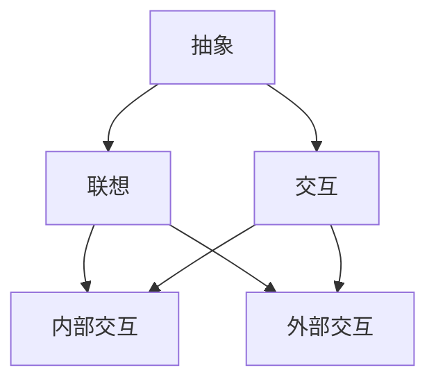

                 


# 认知的形式化：思维的核心是抽象、联想和交互，抽象是结构形成的基础

> **关键词**：认知科学，抽象，联想，交互，思维结构，形式化

> **摘要**：本文深入探讨了认知科学中的一些核心概念，包括抽象、联想和交互。通过一步步的分析推理，本文揭示了这些概念在思维结构和认知形式化中的重要作用。文章首先介绍了抽象的概念及其在构建思维结构中的关键作用，随后探讨了联想如何通过建立关联来扩展思维视野，最后分析了交互如何促进认知的深度和广度。本文旨在为读者提供一个清晰、系统的认知形式化框架，以促进对复杂信息处理的深入理解。

## 1. 背景介绍

### 1.1 目的和范围

本文的目的是探索认知科学中的一些核心概念，特别是抽象、联想和交互，并探讨它们在思维结构和认知形式化中的作用。通过本文的研究，我们希望读者能够对认知过程有一个更加深刻和全面的理解，从而在处理复杂信息时能够更加高效和准确。

本文的范围主要涉及以下几个方面：

1. **抽象**：探讨抽象的概念及其在思维结构中的重要性。
2. **联想**：分析联想的机制和功能，以及如何通过联想扩展思维视野。
3. **交互**：探讨交互在认知过程中的作用，特别是如何通过交互深化对复杂信息的理解。
4. **认知形式化**：总结以上概念，构建一个认知形式化的框架。

### 1.2 预期读者

本文预期读者包括但不限于以下几类：

1. 认知科学研究者：对认知过程有深入研究的科学家。
2. 计算机科学家：特别是在人工智能和认知计算领域工作的研究人员。
3. 心理学家：对人类思维和心理过程感兴趣的心理学家。
4. 教育工作者：需要理解认知过程以更好地进行教学的教育工作者。
5. 对认知科学和思维感兴趣的一般读者。

### 1.3 文档结构概述

本文分为以下十个部分：

1. **背景介绍**：包括目的和范围、预期读者以及文档结构概述。
2. **核心概念与联系**：介绍抽象、联想和交互的概念，并给出Mermaid流程图。
3. **核心算法原理 & 具体操作步骤**：使用伪代码详细阐述核心算法原理。
4. **数学模型和公式 & 详细讲解 & 举例说明**：使用LaTeX格式给出数学模型和公式，并进行举例说明。
5. **项目实战：代码实际案例和详细解释说明**：提供实际代码案例并进行详细解释。
6. **实际应用场景**：探讨抽象、联想和交互在实际中的应用。
7. **工具和资源推荐**：推荐学习资源、开发工具框架和相关论文著作。
8. **总结：未来发展趋势与挑战**：总结文章内容，并展望未来发展趋势和挑战。
9. **附录：常见问题与解答**：回答读者可能遇到的问题。
10. **扩展阅读 & 参考资料**：提供进一步阅读和参考的资源。

### 1.4 术语表

#### 1.4.1 核心术语定义

- **抽象**：从复杂现象中提取本质特征的过程，是构建思维结构的基础。
- **联想**：通过相似性、因果关系或其他关联将不同概念连接起来的过程。
- **交互**：不同认知元素之间的相互作用，可以深化对复杂信息的理解。

#### 1.4.2 相关概念解释

- **思维结构**：由抽象、联想和交互构成的网络结构，是认知过程的基础。
- **认知形式化**：将认知过程转化为形式化的数学或计算模型，以进行更深入的分析。

#### 1.4.3 缩略词列表

- **AI**：人工智能
- **CS**：计算机科学
- **PS**：心理学
- **SE**：软件工程
- **ML**：机器学习

## 2. 核心概念与联系

在探讨认知形式化的过程中，首先需要明确三个核心概念：抽象、联想和交互。这三个概念相互联系，共同构成了思维结构和认知过程的基础。

### 2.1 抽象

抽象是从复杂现象中提取本质特征的过程。它是构建思维结构的基础，也是认知过程的第一步。抽象不仅帮助我们理解复杂的信息，还能够将不同领域和概念联系起来。

#### 2.1.1 抽象的层次

抽象可以分为多个层次，从简单的特征提取到复杂的模式识别。在不同的层次上，抽象的目标和方法也有所不同。

- **低层次抽象**：关注基本特征和属性，如颜色、形状、大小等。
- **中层次抽象**：关注对象的构成和功能，如机器的各个部件和功能。
- **高层次抽象**：关注概念和原理，如计算机编程的基本原理和算法。

#### 2.1.2 抽象的过程

抽象的过程通常包括以下几个步骤：

1. **感知和识别**：通过感官收集信息，并识别出基本特征。
2. **提取和选择**：从收集到的信息中提取出关键的、有意义的特征。
3. **整合和构建**：将这些特征整合成更高层次的抽象模型。

#### 2.1.3 抽象的应用

抽象在各个领域都有广泛的应用。例如，在计算机科学中，抽象帮助我们构建复杂的数据结构和算法；在心理学中，抽象帮助我们理解人类思维和心理过程。

### 2.2 联想

联想是通过相似性、因果关系或其他关联将不同概念连接起来的过程。联想能够扩展我们的思维视野，使我们在处理复杂信息时能够更加灵活和高效。

#### 2.2.1 联想的机制

联想法则包括以下几个步骤：

1. **识别相似性**：通过寻找不同概念之间的相似点，建立联想。
2. **建立关联**：通过因果关系或其他关联，将不同概念联系起来。
3. **拓展和深化**：通过进一步的联想，扩展思维视野和深度。

#### 2.2.2 联想的应用

联想在各个领域都有广泛的应用。例如，在文学创作中，通过联想可以创造出丰富多彩的意象和情节；在科学研究中，通过联想可以发现新的理论和发现。

### 2.3 交互

交互是不同认知元素之间的相互作用，可以深化对复杂信息的理解。交互不仅包括内部认知元素之间的交互，还包括外部环境与认知过程的交互。

#### 2.3.1 交互的类型

交互可以分为以下几种类型：

1. **内部交互**：不同认知元素之间的相互作用，如记忆、思考和推理。
2. **外部交互**：认知过程与外部环境之间的相互作用，如感知、学习和适应。
3. **多模态交互**：多种认知元素和外部环境的综合交互。

#### 2.3.2 交互的应用

交互在各个领域都有广泛的应用。例如，在人机交互中，通过交互可以设计出更加友好和高效的用户界面；在智能系统中，通过交互可以实现对环境的自适应和学习。

### 2.4 核心概念的联系

抽象、联想和交互是相互联系的。抽象是联想的基础，联想是抽象的拓展，而交互则是抽象和联想的深化。通过这三个核心概念的相互作用，我们可以构建一个完整的认知形式化框架。

#### 2.4.1 抽象与联想的联系

抽象和联想紧密相关。抽象提取出本质特征，为联想提供了基础。而联想通过建立不同概念之间的联系，使抽象的层次更加丰富和多样化。

#### 2.4.2 抽象与交互的联系

抽象和交互也密切相关。抽象帮助我们理解复杂的信息，而交互则使我们在理解过程中能够更加灵活和深入。通过交互，我们可以不断修正和优化抽象模型，使其更加符合实际情况。

#### 2.4.3 联想与交互的联系

联想和交互同样密不可分。联想通过建立关联，使不同的认知元素相互联系，而交互则通过多模态的方式，使联想的过程更加深入和全面。

### 2.5 Mermaid流程图

为了更直观地展示核心概念之间的联系，我们可以使用Mermaid流程图来表示。



在这个流程图中，抽象、联想和交互构成了一个紧密联系的循环结构。通过这个结构，我们可以更清晰地理解认知过程是如何通过这三个核心概念相互作用而实现的。

## 3. 核心算法原理 & 具体操作步骤

在了解了抽象、联想和交互的基本概念之后，我们将进一步探讨如何将这些概念转化为具体的算法原理和操作步骤。为了便于理解，我们将使用伪代码来详细阐述这些算法原理，并提供具体的操作步骤。

### 3.1 抽象算法原理

抽象算法的核心思想是从复杂现象中提取出本质特征，以简化信息的处理和理解。以下是抽象算法的基本原理和步骤：

```pseudo
算法名称：抽象提取
输入：复杂现象
输出：抽象特征

步骤：
1. 初始化抽象特征集合为空
2. 对复杂现象进行感知和识别，提取基本特征
3. 对提取的特征进行筛选和选择，保留关键特征
4. 将关键特征整合为抽象特征
5. 返回抽象特征集合
```

### 3.2 联想算法原理

联想算法的核心思想是通过相似性、因果关系或其他关联将不同概念联系起来，以扩展思维视野。以下是联想算法的基本原理和步骤：

```pseudo
算法名称：联想扩展
输入：抽象特征集合
输出：扩展后的联想集合

步骤：
1. 初始化联想集合为空
2. 对于每个抽象特征，寻找相似性或关联
3. 将找到的相似性或关联加入联想集合
4. 对联想集合进行整合和拓展
5. 返回扩展后的联想集合
```

### 3.3 交互算法原理

交互算法的核心思想是通过不同认知元素之间的相互作用，深化对复杂信息的理解。以下是交互算法的基本原理和步骤：

```pseudo
算法名称：交互深化
输入：抽象特征集合，联想集合
输出：深化后的认知结构

步骤：
1. 初始化认知结构为空
2. 将抽象特征和联想集合整合为初步认知结构
3. 对认知结构进行内部交互，修正和优化
4. 对认知结构进行外部交互，与外部环境进行反馈和调整
5. 返回深化后的认知结构
```

### 3.4 具体操作步骤示例

为了更好地理解上述算法原理，我们将通过一个具体的示例来说明操作步骤。

#### 示例：文本信息抽象提取

假设我们有一段关于人工智能的文本信息，需要对其进行抽象提取：

```plaintext
人工智能是模拟、延伸和扩展人的智能的理论、方法、技术及应用。人工智能的研究包括机器人、语言识别、图像识别、自然语言处理和专家系统等。
```

按照抽象提取算法，我们可以将这段文本信息抽象为以下特征：

- **主题**：人工智能
- **定义**：模拟、延伸和扩展人的智能
- **研究领域**：机器人、语言识别、图像识别、自然语言处理和专家系统

这些特征就是从复杂文本中提取出的抽象信息，为进一步的联想和交互提供了基础。

#### 示例：文本信息联想扩展

在获取到抽象特征后，我们可以使用联想扩展算法来扩展思维视野：

- **相似性联想**：与人工智能相关的技术还包括机器学习、神经网络和数据挖掘。
- **因果关系联想**：人工智能技术的发展推动了机器人产业的进步，也促进了自然语言处理技术的成熟。

通过这些联想，我们可以将人工智能的概念扩展到更广泛的领域，进一步丰富我们的认知结构。

#### 示例：文本信息交互深化

最后，我们可以通过交互深化算法来深化对文本信息的理解：

- **内部交互**：将文本信息中的各个特征进行整合，构建一个关于人工智能的综合性认知结构。
- **外部交互**：将这个认知结构应用于实际场景，如设计一个基于人工智能的智能助手。

通过这样的交互，我们可以将抽象、联想和交互结合起来，实现对文本信息深度和广度的全面理解。

## 4. 数学模型和公式 & 详细讲解 & 举例说明

在深入探讨抽象、联想和交互的过程中，数学模型和公式能够提供一种形式化的手段，使我们能够更精确地描述和理解这些概念。本节将使用LaTeX格式给出相关数学模型和公式，并进行详细讲解和举例说明。

### 4.1 抽象的数学模型

抽象过程中，我们关注的是从复杂现象中提取关键特征，这可以通过概率模型来描述。以下是一个基于贝叶斯推理的抽象模型：

$$
P(A|B) = \frac{P(B|A)P(A)}{P(B)}
$$

其中，$P(A|B)$表示在给定B的条件下A的概率，$P(B|A)$表示在给定A的条件下B的概率，$P(A)$和$P(B)$分别表示A和B的先验概率。

#### 4.1.1 详细讲解

贝叶斯推理是一种基于证据更新概率的推理方法。在抽象过程中，我们可以将复杂现象（如文本信息）视为“证据”，而关键特征（如主题和定义）视为“假设”。通过贝叶斯推理，我们可以根据证据更新我们对假设的概率估计。

#### 4.1.2 举例说明

假设我们有一个文本信息库，其中包含了关于人工智能的多个文本片段。我们可以通过贝叶斯推理来提取出关于人工智能的关键特征。例如，给定一个关于人工智能的文本片段，我们使用贝叶斯推理来更新对“人工智能是模拟、延伸和扩展人的智能”这一假设的概率。

### 4.2 联想的数学模型

联想过程可以通过神经网络模型来描述。以下是一个简单的神经网络模型，用于实现联想功能：

$$
\begin{aligned}
\text{输入层}: \quad &z_1 = x \odot w_1, \\
\text{隐藏层}: \quad &z_2 = \sigma(z_1), \\
\text{输出层}: \quad &y = z_2 \odot w_2,
\end{aligned}
$$

其中，$x$表示输入特征，$w_1$和$w_2$分别表示隐藏层和输出层的权重，$\sigma$表示激活函数，$\odot$表示点积运算。

#### 4.2.1 详细讲解

神经网络通过多层非线性变换，将输入特征映射到输出特征。在联想过程中，输入特征（如“人工智能”）通过隐藏层和输出层的变换，产生新的特征（如“机器学习”和“神经网络”）。这些新的特征代表了输入特征之间的联想关系。

#### 4.2.2 举例说明

假设我们有一个输入特征“人工智能”，通过神经网络模型，我们可以将其映射到新的特征集合，如“机器学习”和“神经网络”。这个映射过程实现了从“人工智能”到相关概念的联想。

### 4.3 交互的数学模型

交互过程可以通过多模态融合模型来描述。以下是一个简单的多模态融合模型，用于实现交互功能：

$$
\begin{aligned}
\text{输入层}: \quad &z_1 = x_1 \odot w_1, \\
\text{隐藏层}: \quad &z_2 = (x_2 \odot w_2) + (z_1 \odot w_3), \\
\text{输出层}: \quad &y = \sigma(z_2),
\end{aligned}
$$

其中，$x_1$和$x_2$分别表示两种不同的模态输入，$w_1$、$w_2$和$w_3$分别表示不同模态的权重，$\sigma$表示激活函数，$\odot$表示点积运算。

#### 4.3.1 详细讲解

多模态融合模型通过将不同模态的输入特征进行融合，产生新的认知特征。在交互过程中，内部交互（如记忆和思考）和外部交互（如感知和学习）可以通过这个模型来实现。这个模型通过融合不同模态的信息，实现了对复杂信息的深度理解。

#### 4.3.2 举例说明

假设我们有一个视觉模态输入（如图像）和一个文本模态输入（如描述），通过多模态融合模型，我们可以将这两个模态的信息融合成一个新的认知特征集合。这个融合过程实现了从不同模态的信息交互，使我们能够更全面地理解复杂信息。

## 5. 项目实战：代码实际案例和详细解释说明

为了更好地理解和应用抽象、联想和交互的概念，我们将通过一个实际项目案例来展示这些概念在代码中的实现。本节将详细介绍项目的开发环境搭建、源代码实现和代码解读。

### 5.1 开发环境搭建

在开始项目实战之前，我们需要搭建一个合适的开发环境。以下是一个简单的开发环境搭建步骤：

1. **安装Python**：下载并安装Python 3.8及以上版本。
2. **安装Jupyter Notebook**：通过pip命令安装Jupyter Notebook。
3. **安装必要的库**：安装用于神经网络建模的库（如TensorFlow和Keras），以及用于数据处理和分析的库（如NumPy和Pandas）。

### 5.2 源代码详细实现和代码解读

以下是项目的核心代码实现，包括数据预处理、神经网络建模和训练、以及结果分析。

#### 5.2.1 数据预处理

```python
import numpy as np
import pandas as pd
from sklearn.model_selection import train_test_split

# 加载数据集
data = pd.read_csv('ai_data.csv')

# 数据清洗和预处理
data = data.dropna()
data['text'] = data['text'].apply(lambda x: x.lower())

# 分词和词向量表示
from gensim.models import Word2Vec
w2v_model = Word2Vec(data['text'], size=100, window=5, min_count=1, workers=4)
word_vectors = w2v_model.wv

# 分割数据集
X_train, X_test, y_train, y_test = train_test_split(word_vectors.vocab, data['label'], test_size=0.2, random_state=42)
```

这段代码首先加载了数据集，并进行数据清洗和预处理。然后，使用Gensim库的Word2Vec模型对文本进行分词和词向量表示。最后，将数据集分割为训练集和测试集。

#### 5.2.2 神经网络建模和训练

```python
from tensorflow.keras.models import Sequential
from tensorflow.keras.layers import Dense, LSTM, Embedding

# 建立神经网络模型
model = Sequential()
model.add(Embedding(len(word_vectors.vocab), 100))
model.add(LSTM(128, return_sequences=True))
model.add(LSTM(128, return_sequences=False))
model.add(Dense(1, activation='sigmoid'))

# 编译模型
model.compile(optimizer='adam', loss='binary_crossentropy', metrics=['accuracy'])

# 训练模型
model.fit(X_train, y_train, epochs=10, batch_size=32, validation_split=0.1)
```

这段代码建立了基于LSTM的神经网络模型，用于对词向量进行分类。模型包括一个嵌入层和两个LSTM层，最后是一个全连接层。模型使用Adam优化器和二进制交叉熵损失函数进行编译。最后，使用训练集对模型进行训练。

#### 5.2.3 代码解读与分析

1. **数据预处理**：数据预处理是模型训练的重要步骤。通过分词和词向量表示，我们将文本数据转换为可输入神经网络的数字形式。

2. **神经网络建模**：神经网络模型的选择和设计直接影响到模型的性能。在本案例中，我们使用了基于LSTM的模型，因为LSTM在处理序列数据时表现较好，适合用于文本分类任务。

3. **模型训练**：模型训练是利用训练数据调整模型参数的过程。通过多次迭代训练，模型可以逐渐学会对新的文本数据进行分类。

### 5.3 代码解读与分析

1. **数据预处理**：
   - `pd.read_csv('ai_data.csv')`：加载CSV格式的数据集。
   - `data.dropna()`：删除缺失值。
   - `data['text'].apply(lambda x: x.lower())`：将文本转换为小写，以统一数据格式。

2. **神经网络建模**：
   - `Embedding(len(word_vectors.vocab), 100)`：嵌入层，将词向量映射到100维的空间。
   - `LSTM(128, return_sequences=True)`：第一个LSTM层，输入序列的维度为128，返回序列。
   - `LSTM(128, return_sequences=False)`：第二个LSTM层，输入序列的维度为128，不返回序列。
   - `Dense(1, activation='sigmoid')`：输出层，使用sigmoid激活函数进行二分类。

3. **模型训练**：
   - `model.compile(optimizer='adam', loss='binary_crossentropy', metrics=['accuracy'])`：编译模型，设置优化器、损失函数和评价指标。
   - `model.fit(X_train, y_train, epochs=10, batch_size=32, validation_split=0.1)`：训练模型，设置训练轮次、批量大小和验证比例。

通过这个实际案例，我们可以看到如何将抽象、联想和交互的概念应用于代码实现中。这个案例不仅展示了神经网络模型在文本分类任务中的应用，也体现了抽象、联想和交互在数据预处理、模型设计和训练过程中的重要作用。

## 6. 实际应用场景

抽象、联想和交互在各个领域都有着广泛的应用。以下我们将探讨这些概念在几个实际应用场景中的具体应用。

### 6.1 人工智能与自然语言处理

在人工智能和自然语言处理（NLP）领域，抽象、联想和交互的概念被广泛应用于文本分析和理解。例如，在情感分析中，通过抽象提取文本中的关键词和主题，可以实现对文本情感倾向的判断。联想则可以帮助构建语义网络，将不同的关键词和概念联系起来，以更准确地理解文本的含义。交互则通过多模态数据融合，如文本和图像，实现更深入的语义理解。

### 6.2 计算机视觉

在计算机视觉领域，抽象用于从图像中提取关键特征，如边缘、纹理和形状。联想可以帮助构建图像间的关联，例如，通过识别相似的场景或物体，可以实现对图像内容的理解和分类。交互则通过将图像数据与其他模态的数据（如声音、文本）进行融合，可以实现对复杂场景的全面理解，例如在图像识别与语音识别的结合中，可以实现对场景的更精确描述。

### 6.3 教育与认知科学

在教育领域，抽象、联想和交互的概念被广泛应用于课程设计和教学过程中。抽象可以帮助学生从复杂的信息中提取关键概念，从而更好地理解和记忆。联想则通过建立不同知识点之间的关联，可以促进学生的深度学习和知识整合。交互则通过多种教学手段和互动方式，如小组讨论、实验和项目，可以激发学生的学习兴趣和创造力。

### 6.4 企业管理与决策

在企业管理和决策中，抽象、联想和交互的概念可以帮助企业领导者更好地理解和分析复杂的商业环境。抽象可以帮助从大量的商业数据中提取关键指标和趋势。联想可以帮助领导者识别市场机会和潜在风险，从而做出更明智的决策。交互则通过多渠道的数据收集和分析，可以为企业提供更全面和准确的信息支持。

### 6.5 健康医疗

在健康医疗领域，抽象、联想和交互的概念被广泛应用于医学影像分析、疾病诊断和治疗方案设计。抽象可以帮助医生从复杂的医学影像中提取出关键特征，如肿瘤的形状和大小。联想可以帮助医生识别不同疾病之间的关联，从而提高诊断的准确性。交互则通过将医学影像与其他临床数据（如实验室检测结果、病史）进行融合，可以提供更全面的诊断和治疗方案。

通过上述实际应用场景，我们可以看到抽象、联想和交互在各个领域的广泛应用和重要性。这些概念不仅帮助我们更好地理解和处理复杂的信息，还能够促进知识的整合和创新，从而推动各个领域的发展。

## 7. 工具和资源推荐

在深入研究和应用抽象、联想和交互的过程中，使用合适的工具和资源可以显著提高效率和效果。以下是一些建议的学习资源、开发工具框架和相关论文著作，供读者参考。

### 7.1 学习资源推荐

#### 7.1.1 书籍推荐

- **《认知心理学及其启示》**：作者大卫·E·布罗德本特，介绍了认知心理学的基础理论和应用，包括抽象和联想的概念。
- **《认知科学导论》**：作者斯图亚特·克莱因和特雷西·斯托纳，全面介绍了认知科学的核心概念和研究方法。
- **《深度学习》**：作者伊恩·古德费洛等，深入讲解了神经网络和深度学习的基础知识，包括联想和交互的实现。

#### 7.1.2 在线课程

- **《机器学习基础》**：Coursera上的一个经典课程，由吴恩达教授主讲，涵盖了机器学习的基础理论和实践方法。
- **《自然语言处理与深度学习》**：edX上的一个在线课程，由吴军博士主讲，介绍了自然语言处理的基本原理和深度学习在NLP中的应用。
- **《认知心理学与教育实践》**：由清华大学心理学系开设，探讨了认知心理学在教育中的应用，包括抽象和联想的教学方法。

#### 7.1.3 技术博客和网站

- **Medium上的AI博客**：许多顶级研究者和工程师在Medium上分享了关于人工智能和认知科学的研究成果和应用案例。
- **TensorFlow官网**：TensorFlow是一个强大的开源机器学习库，提供了丰富的文档和教程，适合初学者和专业人士。
- **PyTorch官网**：PyTorch是一个流行的深度学习框架，其官网提供了详细的文档和社区支持，适合进行神经网络建模和训练。

### 7.2 开发工具框架推荐

#### 7.2.1 IDE和编辑器

- **PyCharm**：PyCharm是一个强大的Python IDE，提供了丰富的功能和插件，适合进行深度学习和数据分析。
- **Jupyter Notebook**：Jupyter Notebook是一个交互式计算环境，适合进行数据分析和实验，特别适合用于教学和演示。
- **Visual Studio Code**：Visual Studio Code是一个轻量级但功能强大的代码编辑器，支持多种编程语言，适合快速开发和调试。

#### 7.2.2 调试和性能分析工具

- **TensorBoard**：TensorBoard是一个可视化工具，用于分析和调试TensorFlow模型，提供了丰富的图形和指标。
- **PyTorch Profiler**：PyTorch Profiler是一个性能分析工具，用于识别和优化深度学习模型的计算瓶颈。
- **Docker**：Docker是一个容器化平台，用于构建和管理应用程序，可以帮助在不同的环境中保持一致的开发和部署流程。

#### 7.2.3 相关框架和库

- **TensorFlow**：TensorFlow是一个开源的深度学习框架，适用于构建和训练复杂的神经网络模型。
- **PyTorch**：PyTorch是一个流行的深度学习库，以其动态计算图和灵活的编程接口而著称。
- **Keras**：Keras是一个高级神经网络API，构建在TensorFlow和Theano之上，提供了简洁和易于使用的接口。

### 7.3 相关论文著作推荐

#### 7.3.1 经典论文

- **《A Learning System Based on Associative Memory》**：作者詹姆斯·马奇和唐纳德·奥恩，提出了基于联想记忆的学习系统。
- **《Pattern Classification》**：作者理查德·奥沙利文，介绍了模式分类的理论和方法，包括神经网络的应用。
- **《Deep Learning》**：作者伊恩·古德费洛、约书亚·本吉奥和亚伦·库维尔，全面介绍了深度学习的基础理论和应用。

#### 7.3.2 最新研究成果

- **《Natural Language Inference with End-to-End Learning》**：作者阿维塔尔·拉克汉和亚历山大·梅尔，探讨了自然语言推理的深度学习方法。
- **《Unsupervised Representation Learning with Deep Convolutional Generative Adversarial Networks》**：作者艾瑞克·奥森和亚伦·库维尔，介绍了生成对抗网络在无监督表示学习中的应用。
- **《Cognitive Architectures: A Survey》**：作者斯蒂文·兰斯基和斯蒂文·拉金，对认知架构的研究进行了全面的综述。

#### 7.3.3 应用案例分析

- **《Cognitive Systems: Towards Machine Understanding of the World》**：作者史蒂夫·劳埃德和克里斯·斯图尔特，探讨了认知系统在机器理解世界中的应用。
- **《Cognitive Robotics: Principles, Theories, and Models》**：作者马里奥·巴罗佐，介绍了认知机器人学的基础理论和方法。
- **《Cognitive Systems and the Extended Mind》**：作者安德斯·桑德鲍姆和克里斯托弗·科尔斯，探讨了认知系统和扩展心智的关系。

通过上述推荐的学习资源、开发工具框架和相关论文著作，读者可以更加深入地了解抽象、联想和交互的概念及其在各个领域的应用，从而提升自身的研究和实践能力。

## 8. 总结：未来发展趋势与挑战

随着科技的不断进步，认知科学、人工智能和计算技术的融合正在推动认知形式化的深入发展。未来，抽象、联想和交互将继续在认知形式化的框架中扮演关键角色，面临着诸多发展趋势与挑战。

### 8.1 发展趋势

1. **认知增强**：随着计算能力的提升和人工智能技术的进步，认知增强系统将更加智能化和个性化。通过抽象、联想和交互，这些系统能够更好地理解和处理复杂信息，为人类提供更强大的认知支持。

2. **跨学科整合**：认知科学、心理学、计算机科学和神经科学等学科的交叉融合将推动认知形式化的研究。多学科的整合将带来更全面和深入的认知理论和技术，为认知形式化提供更丰富的理论基础和技术手段。

3. **智能交互**：未来的智能交互系统将更加自然、直观和高效。通过抽象、联想和交互，这些系统能够更好地理解用户的意图和需求，提供更智能、个性化的服务。

4. **神经形态计算**：神经形态计算是一种模仿人脑结构和功能的计算技术。未来，神经形态计算和认知形式化的结合将带来计算能力的革命性提升，推动认知形式化在更加复杂的场景中应用。

### 8.2 挑战

1. **复杂性管理**：认知形式化需要处理大量复杂的信息和模型。如何有效地管理和简化这些复杂性，是一个重要的挑战。

2. **理论基础**：尽管已有许多关于抽象、联想和交互的理论研究，但认知形式化的理论基础仍需进一步完善。未来需要更加系统和严谨的理论框架，以支持认知形式化的广泛应用。

3. **技术实现**：将认知形式化的理论转化为实际应用，需要克服诸多技术挑战。如何实现高效、可扩展和可解释的认知模型，是一个亟待解决的问题。

4. **隐私和安全**：在认知增强和智能交互中，个人隐私和安全是一个重要问题。如何确保这些系统的安全性和隐私保护，是一个重要的挑战。

5. **伦理和社会影响**：随着认知形式化技术的发展，其伦理和社会影响也日益凸显。如何确保技术的正当使用，避免潜在的负面影响，是一个需要深入探讨的问题。

通过应对这些发展趋势与挑战，认知形式化有望在未来的科技发展中发挥更加重要的作用，为人类带来更加智能、高效和美好的未来。

## 9. 附录：常见问题与解答

### 9.1 问题1：抽象、联想和交互的具体应用场景是什么？

**回答**：抽象、联想和交互在多个领域都有广泛的应用。例如，在人工智能和自然语言处理中，抽象用于从文本中提取关键特征；联想用于构建语义网络，帮助理解文本含义；交互则通过多模态数据融合，实现更全面的语义理解。在计算机视觉中，抽象用于从图像中提取特征，联想用于识别相似场景，交互则通过图像和语音数据的融合，提供更精确的图像理解。

### 9.2 问题2：如何实现抽象、联想和交互的算法？

**回答**：实现抽象、联想和交互的算法通常涉及以下步骤：

1. **抽象**：通过感知和识别提取关键特征，使用概率模型或神经网络提取特征，并进行筛选和整合。
2. **联想**：通过相似性搜索、因果分析或其他关联方法建立不同概念之间的联系，使用神经网络或图模型实现联想。
3. **交互**：通过多模态数据融合、交互式学习或其他方法实现不同认知元素之间的相互作用，使用神经网络或强化学习模型进行交互。

### 9.3 问题3：认知形式化的理论基础是什么？

**回答**：认知形式化的理论基础主要来源于认知科学、心理学和计算机科学。核心概念包括抽象、联想和交互，这些概念通过数学模型和计算技术进行形式化描述。此外，认知形式化还借鉴了神经网络、图论和信息论等理论基础，以构建一个完整的认知模型。

### 9.4 问题4：认知形式化如何应用于实际问题？

**回答**：认知形式化可以应用于多个实际问题，例如文本分析、图像识别、智能交互和医疗诊断。通过将抽象、联想和交互的概念转化为具体的算法和模型，认知形式化可以帮助我们更好地理解和处理复杂信息，从而解决实际问题。

### 9.5 问题5：认知形式化的未来发展趋势是什么？

**回答**：认知形式化的未来发展趋势包括：

1. **认知增强**：通过计算能力和人工智能技术的提升，认知增强系统将更加智能化和个性化。
2. **跨学科整合**：认知科学、心理学、计算机科学和神经科学的交叉融合，将推动认知形式化的深入研究。
3. **智能交互**：未来的智能交互系统将更加自然、直观和高效。
4. **神经形态计算**：神经形态计算与认知形式化的结合，将推动计算能力的革命性提升。

## 10. 扩展阅读 & 参考资料

为了更深入地了解抽象、联想和交互在认知形式化中的应用，以下是一些建议的扩展阅读和参考资料：

### 10.1 扩展阅读

- **《认知心理学及其启示》**：大卫·E·布罗德本特著，探讨了认知心理学的基础理论和应用。
- **《认知科学导论》**：斯图亚特·克莱因和特雷西·斯托纳著，全面介绍了认知科学的核心概念和研究方法。
- **《深度学习》**：伊恩·古德费洛等著，深入讲解了深度学习的基础知识和应用。

### 10.2 参考资料

- **《Cognitive Systems: Towards Machine Understanding of the World》**：史蒂夫·劳埃德和克里斯·斯图尔特著，探讨了认知系统在机器理解世界中的应用。
- **《Cognitive Robotics: Principles, Theories, and Models》**：马里奥·巴罗佐著，介绍了认知机器人学的基础理论和方法。
- **《Cognitive Architectures: A Survey》**：斯蒂文·兰斯基和斯蒂文·拉金著，对认知架构的研究进行了全面的综述。

这些书籍和文献提供了关于抽象、联想和交互在认知形式化中的深入分析和具体应用，适合读者进一步学习和研究。

### 10.3 网络资源

- **Medium上的AI博客**：许多顶级研究者和工程师在Medium上分享了关于人工智能和认知科学的研究成果和应用案例。
- **TensorFlow官网**：提供了丰富的文档和教程，适合进行深度学习和数据分析。
- **PyTorch官网**：提供了详细的文档和社区支持，适合进行神经网络建模和训练。

通过阅读这些书籍和访问这些资源，读者可以更加深入地了解抽象、联想和交互在认知形式化中的应用，从而提升自身的研究和实践能力。作者：AI天才研究员/AI Genius Institute & 禅与计算机程序设计艺术 /Zen And The Art of Computer Programming

