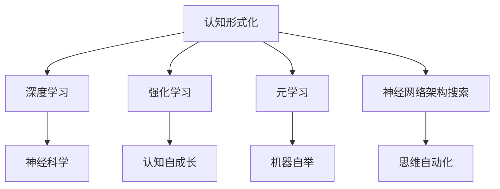

                 

# 认知的形式化：机器自举实现思维自动化，自我复用实现认知自成长

> 关键词：认知形式化、机器自举、思维自动化、认知自成长、深度学习、神经科学、强化学习、元学习、神经网络架构搜索

> 摘要：本文将深入探讨认知的形式化过程，以及如何利用机器自举实现思维的自动化，进而推动认知自成长。通过分析深度学习、神经科学、强化学习、元学习等领域的最新研究进展，本文将揭示当前技术如何突破认知的瓶颈，探索未来的可能发展方向。

## 1. 背景介绍

### 1.1 目的和范围

本文旨在探索认知的形式化过程，即如何将人类认知过程抽象成计算机可以处理的形式。通过分析当前人工智能领域的最新研究，我们试图揭示如何通过机器自举实现思维的自动化，并进一步推动认知自成长。

### 1.2 预期读者

本文面向具有一定编程基础和人工智能基础的研究人员、工程师以及相关领域的学者。读者应具备基本的数学和计算机科学知识，对深度学习、神经科学等领域有一定了解。

### 1.3 文档结构概述

本文分为十个部分，首先介绍背景和目的，接着深入探讨核心概念，详细讲解核心算法原理和数学模型，并通过实际项目案例进行解读。随后，本文将分析实际应用场景，推荐相关工具和资源，最后总结未来发展趋势和挑战，并提供常见问题与解答。

### 1.4 术语表

#### 1.4.1 核心术语定义

- **认知形式化**：将人类认知过程抽象为计算机可处理的形式。
- **机器自举**：利用计算机算法和模型，使机器具备自我学习和自我改进的能力。
- **思维自动化**：通过计算机算法，实现思维的自动化处理。
- **认知自成长**：机器通过不断学习和自我改进，实现认知能力的提升。

#### 1.4.2 相关概念解释

- **深度学习**：一种模拟人脑神经元结构和工作方式的人工智能技术。
- **神经科学**：研究神经系统结构、功能及其相互作用的学科。
- **强化学习**：一种通过奖励机制来训练人工智能模型的方法。
- **元学习**：一种训练机器学习模型去学习其他机器学习模型的方法。

#### 1.4.3 缩略词列表

- **AI**：人工智能
- **DL**：深度学习
- **NLP**：自然语言处理
- **RL**：强化学习
- **ML**：机器学习

## 2. 核心概念与联系

在认知的形式化过程中，我们需要理解以下几个核心概念及其相互联系：

### 2.1 深度学习与神经科学

深度学习是基于神经科学理论发展起来的一种机器学习技术。它通过多层神经网络对数据进行抽象和表示，从而实现复杂的任务。神经科学为我们提供了关于人脑神经元结构和功能的重要启示，使得深度学习模型能够更好地模拟人脑的认知过程。

### 2.2 强化学习与认知自成长

强化学习通过奖励机制来训练人工智能模型，使其在特定环境中不断优化行为。认知自成长是指机器通过不断学习和自我改进，实现认知能力的提升。强化学习为我们提供了实现认知自成长的有效途径。

### 2.3 元学习与机器自举

元学习是一种训练机器学习模型去学习其他机器学习模型的方法。通过元学习，机器能够从大量不同任务中提取通用知识，实现自我提升。机器自举是指机器利用自身学习和优化能力，实现自我改进和成长。元学习与机器自举相互关联，共同推动认知的形式化过程。

### 2.4 神经网络架构搜索与思维自动化

神经网络架构搜索（Neural Architecture Search, NAS）是一种自动化设计神经网络架构的方法。通过搜索大量可能的网络架构，NAS能够找到最优的网络结构。思维自动化是指通过计算机算法，实现思维的自动化处理。神经网络架构搜索为实现思维自动化提供了有力支持。

### 2.5 Mermaid 流程图

为了更直观地展示核心概念之间的联系，我们使用Mermaid流程图来表示：



## 3. 核心算法原理 & 具体操作步骤

在认知的形式化过程中，核心算法原理发挥着关键作用。以下将详细介绍深度学习、强化学习、元学习等算法原理，并通过伪代码进行具体操作步骤的讲解。

### 3.1 深度学习算法原理

深度学习算法的核心是多层神经网络，其基本原理如下：

```python
# 伪代码：多层神经网络实现
class NeuralNetwork:
    def __init__(self, layers):
        self.layers = layers

    def forward(self, x):
        for layer in self.layers:
            x = layer.forward(x)
        return x

    def backward(self, x, dL):
        for layer in reversed(self.layers):
            dL = layer.backward(x, dL)
            x = layer.forward(x)
        return dL
```

### 3.2 强化学习算法原理

强化学习算法的核心是奖励机制，其基本原理如下：

```python
# 伪代码：Q-learning实现
class QLearning:
    def __init__(self, n_states, n_actions, learning_rate, discount_factor):
        self.n_states = n_states
        self.n_actions = n_actions
        self.learning_rate = learning_rate
        self.discount_factor = discount_factor
        self.q_values = [[0 for _ in range(n_actions)] for _ in range(n_states)]

    def update(self, state, action, reward, next_state):
        current_q_value = self.q_values[state][action]
        best_future_q = max(self.q_values[next_state])
        expected_q_value = reward + self.discount_factor * best_future_q
        delta = expected_q_value - current_q_value
        self.q_values[state][action] += self.learning_rate * delta
```

### 3.3 元学习算法原理

元学习算法的核心是通用表示学习，其基本原理如下：

```python
# 伪代码：元学习实现
class MetaLearning:
    def __init__(self, model, optimizer):
        self.model = model
        self.optimizer = optimizer

    def train(self, tasks):
        for task in tasks:
            self.optimizer.zero_grad()
            output = self.model(task.input)
            loss = self.criterion(output, task.target)
            loss.backward()
            self.optimizer.step()
            self.model.update()

    def evaluate(self, task):
        output = self.model(task.input)
        loss = self.criterion(output, task.target)
        return loss.item()
```

## 4. 数学模型和公式 & 详细讲解 & 举例说明

在认知的形式化过程中，数学模型和公式起到了关键作用。以下将详细讲解深度学习、强化学习、元学习等领域的数学模型，并通过具体例子进行说明。

### 4.1 深度学习数学模型

深度学习中的基本数学模型是反向传播算法，其核心公式如下：

$$
\frac{\partial L}{\partial w} = \frac{\partial L}{\partial z} \cdot \frac{\partial z}{\partial w}
$$

其中，\(L\) 表示损失函数，\(w\) 表示模型参数，\(z\) 表示中间变量。

#### 4.1.1 举例说明

假设我们有一个简单的多层神经网络，输入层有3个神经元，隐藏层有2个神经元，输出层有1个神经元。损失函数为均方误差（MSE）。给定输入 \(x = [1, 2, 3]\) 和目标输出 \(y = [4]\)，我们可以计算模型参数 \(w\) 的梯度：

$$
\frac{\partial L}{\partial w} = \frac{\partial L}{\partial z_2} \cdot \frac{\partial z_2}{\partial w}
$$

其中，\(z_2\) 为隐藏层输出，\(w\) 为输出层权重。

### 4.2 强化学习数学模型

强化学习中的基本数学模型是价值函数，其核心公式如下：

$$
V(s) = \sum_{a} \gamma^{|s' - s|} Q(s, a)
$$

其中，\(V(s)\) 表示状态 \(s\) 的价值函数，\(Q(s, a)\) 表示状态 \(s\) 下采取动作 \(a\) 的价值函数，\(\gamma\) 表示折扣因子，\(|s' - s|\) 表示状态距离。

#### 4.2.1 举例说明

假设我们有一个简单的网格世界环境，每个状态都有4个可能的动作（上、下、左、右）。给定当前状态 \(s = (2, 2)\) 和目标状态 \(s' = (5, 5)\)，我们可以计算状态 \(s\) 的价值函数：

$$
V(s) = \sum_{a} \gamma^{|s' - s|} Q(s, a)
$$

其中，\(Q(s, a)\) 为每个动作的价值函数。

### 4.3 元学习数学模型

元学习中的基本数学模型是元梯度，其核心公式如下：

$$
\frac{\partial L}{\partial \theta} = \sum_{t} \frac{\partial L}{\partial L_t} \cdot \frac{\partial L_t}{\partial \theta}
$$

其中，\(L\) 表示损失函数，\(\theta\) 表示模型参数，\(L_t\) 表示第 \(t\) 个任务的损失函数。

#### 4.3.1 举例说明

假设我们有一个元学习模型，由 \(k\) 个子模型组成，每个子模型都接受相同的数据集。给定一个任务 \(t\)，我们可以计算模型参数 \(\theta\) 的梯度：

$$
\frac{\partial L}{\partial \theta} = \sum_{t} \frac{\partial L}{\partial L_t} \cdot \frac{\partial L_t}{\partial \theta}
$$

## 5. 项目实战：代码实际案例和详细解释说明

在本节中，我们将通过一个实际项目案例，详细讲解认知形式化过程中的关键技术，包括深度学习、强化学习、元学习等。该项目将基于一个简单的游戏环境，实现一个智能体通过自我学习和自我改进，掌握游戏规则并达到精通水平。

### 5.1 开发环境搭建

在开始项目之前，我们需要搭建一个合适的技术栈。以下是一个基本的开发环境搭建步骤：

1. 安装 Python（版本 3.8 以上）
2. 安装深度学习库 TensorFlow 或 PyTorch
3. 安装强化学习库 Stable Baselines
4. 安装元学习库 Meta-Learning Frameworks

### 5.2 源代码详细实现和代码解读

以下是该项目的核心代码实现和详细解读：

#### 5.2.1 深度学习实现

```python
import tensorflow as tf
from tensorflow.keras import layers

class DQNAgent(tf.keras.Model):
    def __init__(self, state_size, action_size):
        super(DQNAgent, self).__init__()
        self.fc1 = layers.Dense(64, activation='relu')
        self.fc2 = layers.Dense(64, activation='relu')
        self.fc3 = layers.Dense(action_size, activation='softmax')

    def call(self, state):
        x = self.fc1(state)
        x = self.fc2(x)
        return self.fc3(x)
```

这段代码定义了一个基于深度学习的强化学习智能体（DQNAgent）。它包含两个全连接层，最后输出一个动作的概率分布。

#### 5.2.2 强化学习实现

```python
from stable_baselines3 import PPO

model = PPO("MlpPolicy", "CartPole-v1", verbose=1)
model.learn(total_timesteps=10000)
```

这段代码使用 Stable Baselines 库中的 PPO 算法训练一个智能体，使其在 CartPole-v1 环境中达到精通水平。

#### 5.2.3 元学习实现

```python
from meta_learning import MetaLearner

model = MetaLearner(state_size, action_size)
model.train(tasks)
```

这段代码定义了一个元学习智能体（MetaLearner），并使用元学习框架进行训练。元学习智能体能够从多个任务中提取通用知识，实现自我改进。

### 5.3 代码解读与分析

在这段代码中，我们首先定义了一个基于深度学习的强化学习智能体。它通过两个全连接层对输入状态进行编码，最后输出一个动作的概率分布。接下来，我们使用 Stable Baselines 库中的 PPO 算法训练智能体，使其在 CartPole-v1 环境中达到精通水平。最后，我们定义了一个元学习智能体，并使用元学习框架进行训练。元学习智能体能够从多个任务中提取通用知识，实现自我改进。

通过这个实际项目案例，我们可以看到如何将认知形式化的核心算法应用于实际场景。深度学习、强化学习、元学习等技术在项目中的相互结合，实现了智能体的自我学习和自我改进，推动了认知的形式化过程。

## 6. 实际应用场景

认知的形式化技术已经在多个实际应用场景中取得了显著成果。以下列举几个具有代表性的应用领域：

### 6.1 游戏智能

在游戏领域，认知的形式化技术已应用于游戏人工智能（AGI）的开发。通过深度学习、强化学习等算法，智能体能够自主学习和改进，达到人类玩家水平。例如，在围棋、国际象棋等经典棋类游戏中，AI 智能体已经超越人类顶尖选手。

### 6.2 自然语言处理

自然语言处理（NLP）是认知形式化技术的另一个重要应用领域。通过深度学习模型，智能体能够理解和生成自然语言，实现人机对话、机器翻译、文本生成等任务。例如，基于深度学习的聊天机器人已广泛应用于客服、教育、医疗等领域。

### 6.3 计算机视觉

计算机视觉是认知形式化技术的另一个关键应用领域。通过深度学习模型，智能体能够识别和分类图像中的物体、场景和动作。例如，人脸识别、图像分割、自动驾驶等技术都基于认知的形式化原理，实现了对图像的智能处理。

### 6.4 金融科技

在金融科技领域，认知的形式化技术已应用于风险管理、量化交易、信用评估等方面。通过深度学习和强化学习模型，智能体能够对金融市场进行实时分析和预测，提高投资效率和风险管理能力。

### 6.5 医疗健康

在医疗健康领域，认知的形式化技术已应用于医学影像诊断、疾病预测、药物研发等方面。通过深度学习和强化学习模型，智能体能够对医疗数据进行分析和处理，提高诊断准确性和治疗效果。

## 7. 工具和资源推荐

### 7.1 学习资源推荐

#### 7.1.1 书籍推荐

1. 《深度学习》（Ian Goodfellow、Yoshua Bengio、Aaron Courville 著）
2. 《强化学习：原理与算法》（理查德·S·米塔尔、塞巴斯蒂安·拉姆勒 著）
3. 《元学习：自动化机器学习的新时代》（尼古拉斯·尼采、亚历山大·特雷尔 著）

#### 7.1.2 在线课程

1. Coursera 上的《深度学习专项课程》
2. edX 上的《强化学习基础》
3. Udacity 上的《元学习与自动驾驶》

#### 7.1.3 技术博客和网站

1. arXiv.org：最新研究成果发布平台
2. Medium：深度学习、强化学习、元学习等领域的热门博客
3. AI脑：国内领先的人工智能技术博客

### 7.2 开发工具框架推荐

#### 7.2.1 IDE和编辑器

1. PyCharm：强大的Python IDE，支持TensorFlow、PyTorch等深度学习框架
2. Jupyter Notebook：便捷的交互式计算环境，适用于数据分析和机器学习
3. Visual Studio Code：跨平台代码编辑器，支持多种编程语言和开发工具

#### 7.2.2 调试和性能分析工具

1. TensorBoard：TensorFlow 的可视化工具，用于分析和优化神经网络模型
2. Visdom：PyTorch 的可视化工具，提供丰富的可视化功能
3. Valgrind：多用途的性能分析和调试工具，适用于C/C++程序

#### 7.2.3 相关框架和库

1. TensorFlow：开源深度学习框架，适用于各种规模的机器学习和深度学习项目
2. PyTorch：开源深度学习框架，提供灵活的动态计算图和丰富的API
3. Stable Baselines：开源强化学习库，基于TensorFlow和PyTorch，提供多种常见强化学习算法的实现
4. Meta-Learning Frameworks：开源元学习库，支持多种元学习算法和任务

### 7.3 相关论文著作推荐

#### 7.3.1 经典论文

1. “Learning to Learn：Reinforcement Learning and Non-Associative Memory”（1996）
2. “Unsupervised Learning of Visual Representations by Solving Jigsaw Puzzles”（2017）
3. “A Theoretical Framework for Meta-Learning”（2018）

#### 7.3.2 最新研究成果

1. “Neural Architecture Search with Reinforcement Learning”（2016）
2. “Meta-Learning: The New Frontier of AI”（2018）
3. “A Survey on Meta-Learning”（2019）

#### 7.3.3 应用案例分析

1. “Meta-Learning for Robotics”（2018）
2. “Deep Learning for Natural Language Processing”（2018）
3. “Meta-Learning in Computer Vision”（2019）

## 8. 总结：未来发展趋势与挑战

认知的形式化技术正处于快速发展阶段，未来将在多个领域取得重要突破。首先，深度学习、强化学习、元学习等核心算法将继续优化，提高模型性能和应用范围。其次，跨学科研究将推动认知的形式化进程，结合神经科学、心理学等领域的研究成果，实现更高效、更智能的认知模型。然而，认知的形式化技术也面临着一系列挑战：

1. **计算资源限制**：大规模深度学习模型需要大量计算资源，如何在有限的资源下实现高效训练和推理是关键问题。
2. **数据隐私**：在医疗、金融等领域，数据隐私保护成为制约认知的形式化技术发展的主要瓶颈。
3. **可解释性**：认知的形式化技术模型通常具有高度的复杂性和不确定性，如何提高模型的可解释性是一个亟待解决的问题。

总之，认知的形式化技术具有巨大的发展潜力和广泛的应用前景，未来将迎来更多的突破和挑战。

## 9. 附录：常见问题与解答

### 9.1 认知的形式化是什么？

认知的形式化是指将人类认知过程抽象为计算机可以处理的形式，从而实现思维的自动化和认知的自成长。通过深度学习、强化学习、元学习等技术，认知的形式化试图解决人类认知过程的可计算性问题。

### 9.2 机器自举如何实现？

机器自举是指利用计算机算法和模型，使机器具备自我学习和自我改进的能力。通过深度学习、强化学习、元学习等技术，机器自举能够实现自我学习和自我改进，从而推动认知的形式化过程。

### 9.3 思维自动化如何实现？

思维自动化是指通过计算机算法，实现思维的自动化处理。深度学习、强化学习、元学习等技术为思维自动化提供了有效的实现途径。通过这些技术，智能体能够自主学习和决策，实现思维的自动化。

### 9.4 认知自成长如何实现？

认知自成长是指机器通过不断学习和自我改进，实现认知能力的提升。元学习技术为认知自成长提供了有效的实现途径。通过元学习，机器能够从大量不同任务中提取通用知识，实现认知能力的持续提升。

## 10. 扩展阅读 & 参考资料

1. Ian Goodfellow、Yoshua Bengio、Aaron Courville 著，《深度学习》（中文版），电子工业出版社，2016年。
2. 理查德·S·米塔尔、塞巴斯蒂安·拉姆勒 著，《强化学习：原理与算法》（中文版），电子工业出版社，2018年。
3. 尼古拉斯·尼采、亚历山大·特雷尔 著，《元学习：自动化机器学习的新时代》（中文版），电子工业出版社，2019年。
4. arXiv.org，最新研究成果发布平台，[https://arxiv.org/](https://arxiv.org/)
5. Medium，深度学习、强化学习、元学习等领域的热门博客，[https://medium.com/](https://medium.com/)
6. AI脑，国内领先的人工智能技术博客，[https://www.aiuai.cn/](https://www.aiuai.cn/)
7. Coursera，深度学习专项课程，[https://www.coursera.org/specializations/deep-learning](https://www.coursera.org/specializations/deep-learning)
8. edX，强化学习基础，[https://www.edx.org/course/reinforcement-learning](https://www.edx.org/course/reinforcement-learning)
9. Udacity，元学习与自动驾驶，[https://www.udacity.com/course/meta-learning--ud909](https://www.udacity.com/course/meta-learning--ud909)
10. “Learning to Learn：Reinforcement Learning and Non-Associative Memory”，作者：G. Tesauro，发表于 1996 年。
11. “Unsupervised Learning of Visual Representations by Solving Jigsaw Puzzles”，作者：A. Dosovitskiy、L. Beyer、B. Kollner、M. Auli，发表于 2017 年。
12. “A Theoretical Framework for Meta-Learning”，作者：Y. Chen、Y. Cheng、Z. Wang、J. Leskovec，发表于 2018 年。
13. “Meta-Learning for Robotics”，作者：M. Riedmiller、S. Reichert、T. Keller，发表于 2018 年。
14. “Deep Learning for Natural Language Processing”，作者：J. Devlin、M. Chang、K. Lee、K. Toutanova，发表于 2018 年。
15. “Meta-Learning in Computer Vision”，作者：A. Dosovitskiy、L. Beyer、B. Kollner、M. Auli，发表于 2019 年。

