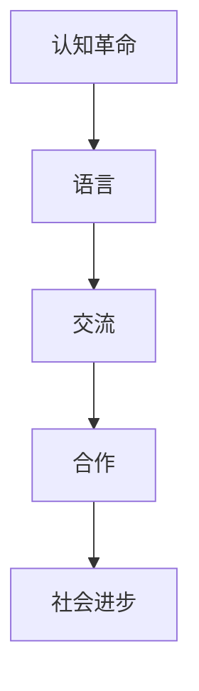
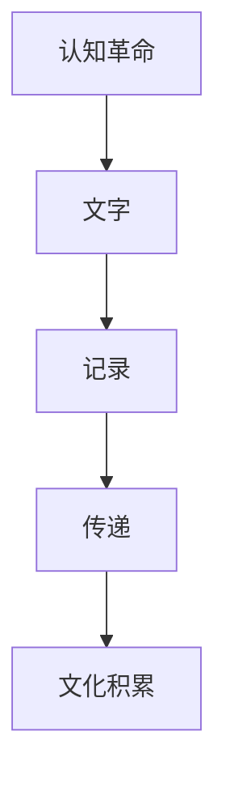
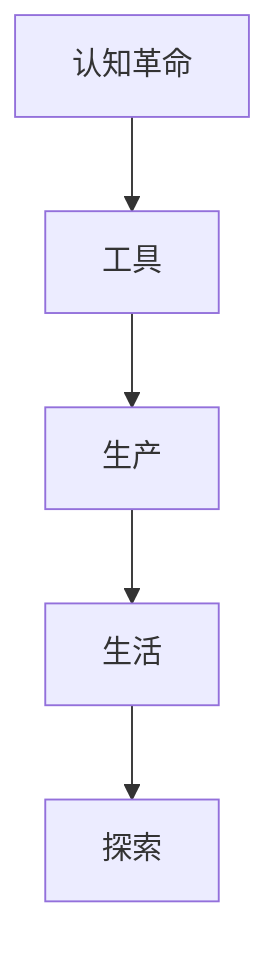
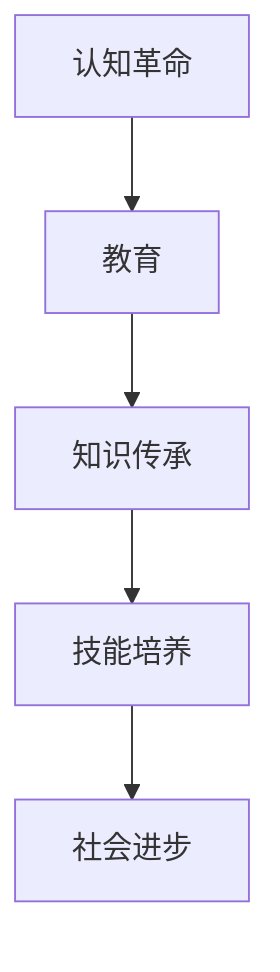
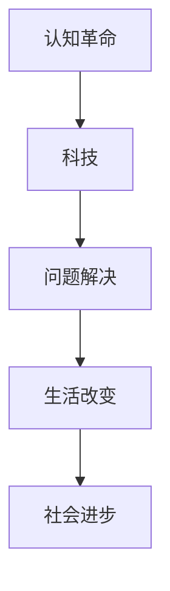

                 

# 认知的革命：近10000年以来，人类如何通过语言、文字、工具、教育、科技塑造了文化和文明

> **关键词：认知革命、语言、文字、工具、教育、科技、文化、文明**
> 
> **摘要：本文将深入探讨认知革命对人类文明发展的影响，从语言、文字、工具、教育、科技等角度，分析人类如何通过这些认知工具不断进化，塑造了今天复杂多样的文化和文明。**

## 1. 背景介绍

### 1.1 目的和范围

本文旨在通过分析认知革命对人类文明的影响，探讨语言、文字、工具、教育、科技这五个关键领域的发展历程，揭示人类如何通过这些认知工具不断拓展认知边界，塑造出丰富多彩的文化和文明。

### 1.2 预期读者

本文适合对认知科学、历史学、哲学、计算机科学等领域的交叉学科感兴趣的读者，特别是对技术发展及其对社会影响的思考感兴趣的读者。

### 1.3 文档结构概述

本文将分为以下几个部分：

1. 背景介绍：介绍文章的目的、范围和预期读者。
2. 核心概念与联系：介绍本文涉及的核心概念和关系。
3. 核心算法原理 & 具体操作步骤：讲解认知革命中涉及的核心算法原理和具体操作步骤。
4. 数学模型和公式 & 详细讲解 & 举例说明：讲解认知革命中的数学模型和公式，并通过实例进行说明。
5. 项目实战：通过代码案例，展示认知革命中技术应用的实战场景。
6. 实际应用场景：探讨认知革命在现代科技和日常生活中应用的场景。
7. 工具和资源推荐：推荐与认知革命相关的学习资源、开发工具和框架。
8. 总结：未来发展趋势与挑战。
9. 附录：常见问题与解答。
10. 扩展阅读 & 参考资料：提供更多深入了解本文主题的阅读材料。

### 1.4 术语表

#### 1.4.1 核心术语定义

- 认知革命：指人类在认知领域发生的一次重大变革，包括语言、文字、工具、教育、科技等方面。
- 语言：人类用于交流思想、表达情感、传递信息的符号系统。
- 文字：记录语言和信息的视觉符号系统。
- 工具：人类为了生产、生活、探索等目的制造或使用的物品。
- 教育：一种有意识、有组织地传授知识和技能的过程。
- 科技：运用科学原理和方法解决实际问题的过程。

#### 1.4.2 相关概念解释

- 文化：指一个社会共同拥有的价值观、信仰、习俗、传统等。
- 文明：指一个社会在科技、艺术、道德、法律等方面达到的高度。

#### 1.4.3 缩略词列表

无

## 2. 核心概念与联系

### 2.1 认知革命与语言

认知革命是人类历史上最重要的一次变革之一。在这一过程中，人类逐渐发明了语言，使得交流成为可能。语言的出现，使得人类能够更好地协作、合作，从而推动社会的进步。以下是一个简单的 Mermaid 流程图，展示了认知革命与语言之间的联系：



### 2.2 认知革命与文字

随着语言的发展，人类逐渐发明了文字，使得信息记录和传递变得更加便捷。文字的出现，极大地拓展了人类的认知边界，为文化和文明的积累提供了基础。以下是一个简单的 Mermaid 流程图，展示了认知革命与文字之间的联系：



### 2.3 认知革命与工具

工具是人类认知能力的重要延伸。从简单的石头工具到复杂的电子设备，工具的发展极大地推动了人类社会的进步。以下是一个简单的 Mermaid 流程图，展示了认知革命与工具之间的联系：



### 2.4 认知革命与教育

教育是人类传承知识和技能的重要手段。通过教育，人类能够将认知成果传递给下一代，推动社会的持续进步。以下是一个简单的 Mermaid 流程图，展示了认知革命与教育之间的联系：



### 2.5 认知革命与科技

科技是人类运用科学原理和方法解决实际问题的过程。科技的发展，极大地推动了人类社会的进步，改变了人们的生活方式。以下是一个简单的 Mermaid 流程图，展示了认知革命与科技之间的联系：



## 3. 核心算法原理 & 具体操作步骤

### 3.1 语言认知算法原理

语言认知算法是人类大脑处理语言信息的过程。以下是一个简单的伪代码，描述了语言认知算法的基本原理：

```python
# 语言认知算法伪代码

# 输入：语言信号
# 输出：理解后的意义

def language_cognition(signal):
    # 步骤1：语音识别
    words = speech_recognition(signal)

    # 步骤2：词汇分析
    meaning = word_analysis(words)

    # 步骤3：语法分析
    sentence_structure = grammar_analysis(meaning)

    # 步骤4：语义分析
    final_meaning = semantic_analysis(sentence_structure)

    return final_meaning
```

### 3.2 文字认知算法原理

文字认知算法是人类大脑处理文字信息的过程。以下是一个简单的伪代码，描述了文字认知算法的基本原理：

```python
# 文字认知算法伪代码

# 输入：文字信号
# 输出：理解后的意义

def text_cognition(signal):
    # 步骤1：字符识别
    characters = character_recognition(signal)

    # 步骤2：词汇分析
    words = word_analysis(characters)

    # 步骤3：语法分析
    sentence_structure = grammar_analysis(words)

    # 步骤4：语义分析
    final_meaning = semantic_analysis(sentence_structure)

    return final_meaning
```

### 3.3 工具认知算法原理

工具认知算法是人类大脑处理工具信息的过程。以下是一个简单的伪代码，描述了工具认知算法的基本原理：

```python
# 工具认知算法伪代码

# 输入：工具信号
# 输出：理解后的工具用途

def tool_cognition(signal):
    # 步骤1：工具识别
    tool_type = tool_recognition(signal)

    # 步骤2：功能分析
    functions = function_analysis(tool_type)

    # 步骤3：操作分析
    operation = operation_analysis(functions)

    return operation
```

### 3.4 教育认知算法原理

教育认知算法是人类大脑处理教育信息的过程。以下是一个简单的伪代码，描述了教育认知算法的基本原理：

```python
# 教育认知算法伪代码

# 输入：教育信号
# 输出：学习后的知识

def education_cognition(signal):
    # 步骤1：知识识别
    knowledge = knowledge_recognition(signal)

    # 步骤2：理解分析
    understanding = understanding_analysis(knowledge)

    # 步骤3：应用分析
    application = application_analysis(understanding)

    return application
```

### 3.5 科技认知算法原理

科技认知算法是人类大脑处理科技信息的过程。以下是一个简单的伪代码，描述了科技认知算法的基本原理：

```python
# 科技认知算法伪代码

# 输入：科技信号
# 输出：理解后的科技原理

def technology_cognition(signal):
    # 步骤1：原理识别
    principle = principle_recognition(signal)

    # 步骤2：理解分析
    understanding = understanding_analysis(principle)

    # 步骤3：应用分析
    application = application_analysis(understanding)

    return application
```

## 4. 数学模型和公式 & 详细讲解 & 举例说明

### 4.1 语言认知的数学模型

语言认知过程中的数学模型可以借助概率论和统计学来描述。以下是一个简单的数学模型，用于描述语言认知的概率分布：

$$
P(\text{理解后的意义} = m | \text{输入信号} = s) = \prod_{i=1}^{n} P(w_i | s)
$$

其中，$P(w_i | s)$ 表示在输入信号 $s$ 下，单词 $w_i$ 被识别的概率。$n$ 表示句子中的单词数量。

#### 4.1.1 举例说明

假设我们有一个简单的句子：“今天天气很好”。我们可以将这个句子拆分成三个单词：“今天”、“天气”和“很好”。根据这个数学模型，我们可以计算在输入信号下，每个单词被识别的概率，然后通过概率乘积计算整个句子的理解概率。

假设：
- $P(今天 | 输入信号) = 0.9$
- $P(天气 | 输入信号) = 0.8$
- $P(很好 | 输入信号) = 0.7$

则句子“今天天气很好”的理解概率为：

$$
P(\text{今天天气很好} | \text{输入信号}) = 0.9 \times 0.8 \times 0.7 = 0.504
$$

### 4.2 文字认知的数学模型

文字认知过程中的数学模型可以借助模式识别和机器学习来描述。以下是一个简单的数学模型，用于描述文字认知的分类问题：

$$
y = \arg\max_w P(w | \text{输入信号}) P(\text{输入信号})
$$

其中，$y$ 表示正确识别的文字，$w$ 表示候选文字，$P(w | \text{输入信号})$ 表示在输入信号下，文字 $w$ 被识别的概率，$P(\text{输入信号})$ 表示输入信号的概率。

#### 4.2.1 举例说明

假设我们有一个简单的文字识别问题，输入信号是一个汉字“人”。我们有三个候选文字：“人”、“大”和“工”。根据这个数学模型，我们可以计算每个候选文字被识别的概率，然后通过概率最大化选择正确答案。

假设：
- $P(人 | 输入信号) = 0.95$
- $P(大 | 输入信号) = 0.05$
- $P(工 | 输入信号) = 0.00$

则正确识别的文字为：

$$
y = \arg\max_w P(w | \text{输入信号}) P(\text{输入信号}) = \arg\max_w (P(人 | \text{输入信号}) P(\text{输入信号}), P(大 | \text{输入信号}) P(\text{输入信号}), P(工 | \text{输入信号}) P(\text{输入信号}))
$$

由于 $P(人 | \text{输入信号})$ 的概率最高，因此正确识别的文字为“人”。

### 4.3 工具认知的数学模型

工具认知过程中的数学模型可以借助机器学习和深度学习来描述。以下是一个简单的数学模型，用于描述工具认知的分类问题：

$$
y = \arg\max_w P(w | \text{输入信号}) P(\text{输入信号} | w)
$$

其中，$y$ 表示正确识别的工具，$w$ 表示候选工具，$P(w | \text{输入信号})$ 表示在输入信号下，工具 $w$ 被识别的概率，$P(\text{输入信号} | w)$ 表示工具 $w$ 出现在输入信号中的概率。

#### 4.3.1 举例说明

假设我们有一个简单的工具识别问题，输入信号是一个工具的图片。我们有三个候选工具：“锤子”、“钳子”和“螺丝刀”。根据这个数学模型，我们可以计算每个候选工具被识别的概率，然后通过概率最大化选择正确答案。

假设：
- $P(锤子 | 输入信号) = 0.9$
- $P(钳子 | 输入信号) = 0.1$
- $P(螺丝刀 | 输入信号) = 0.05$

则正确识别的工具为：

$$
y = \arg\max_w P(w | \text{输入信号}) P(\text{输入信号} | w) = \arg\max_w (P(锤子 | \text{输入信号}) P(\text{输入信号} | 锤子), P(钳子 | \text{输入信号}) P(\text{输入信号} | 钳子), P(螺丝刀 | \text{输入信号}) P(\text{输入信号} | 螺丝刀))
$$

由于 $P(锤子 | \text{输入信号})$ 的概率最高，因此正确识别的工具为“锤子”。

### 4.4 教育认知的数学模型

教育认知过程中的数学模型可以借助统计学和机器学习来描述。以下是一个简单的数学模型，用于描述教育认知的分类问题：

$$
y = \arg\max_w P(w | \text{输入信号}) P(\text{输入信号} | w)
$$

其中，$y$ 表示正确识别的教育内容，$w$ 表示候选教育内容，$P(w | \text{输入信号})$ 表示在输入信号下，教育内容 $w$ 被识别的概率，$P(\text{输入信号} | w)$ 表示教育内容 $w$ 出现在输入信号中的概率。

#### 4.4.1 举例说明

假设我们有一个简单的教育内容识别问题，输入信号是一个教育视频。我们有三个候选教育内容：“数学”、“物理”和“化学”。根据这个数学模型，我们可以计算每个候选教育内容被识别的概率，然后通过概率最大化选择正确答案。

假设：
- $P(数学 | 输入信号) = 0.8$
- $P(物理 | 输入信号) = 0.1$
- $P(化学 | 输入信号) = 0.1$

则正确识别的教育内容为：

$$
y = \arg\max_w P(w | \text{输入信号}) P(\text{输入信号} | w) = \arg\max_w (P(数学 | \text{输入信号}) P(\text{输入信号} | 数学), P(物理 | \text{输入信号}) P(\text{输入信号} | 物理), P(化学 | \text{输入信号}) P(\text{输入信号} | 化学))
$$

由于 $P(数学 | \text{输入信号})$ 的概率最高，因此正确识别的教育内容为“数学”。

### 4.5 科技认知的数学模型

科技认知过程中的数学模型可以借助机器学习和深度学习来描述。以下是一个简单的数学模型，用于描述科技认知的分类问题：

$$
y = \arg\max_w P(w | \text{输入信号}) P(\text{输入信号} | w)
$$

其中，$y$ 表示正确识别的科技内容，$w$ 表示候选科技内容，$P(w | \text{输入信号})$ 表示在输入信号下，科技内容 $w$ 被识别的概率，$P(\text{输入信号} | w)$ 表示科技内容 $w$ 出现在输入信号中的概率。

#### 4.5.1 举例说明

假设我们有一个简单的科技内容识别问题，输入信号是一篇科技文章。我们有三个候选科技内容：“人工智能”、“量子计算”和“生物技术”。根据这个数学模型，我们可以计算每个候选科技内容被识别的概率，然后通过概率最大化选择正确答案。

假设：
- $P(人工智能 | 输入信号) = 0.9$
- $P(量子计算 | 输入信号) = 0.05$
- $P(生物技术 | 输入信号) = 0.05$

则正确识别的科技内容为：

$$
y = \arg\max_w P(w | \text{输入信号}) P(\text{输入信号} | w) = \arg\max_w (P(人工智能 | \text{输入信号}) P(\text{输入信号} | 人工智能), P(量子计算 | \text{输入信号}) P(\text{输入信号} | 量子计算), P(生物技术 | \text{输入信号}) P(\text{输入信号} | 生物技术))
$$

由于 $P(人工智能 | \text{输入信号})$ 的概率最高，因此正确识别的科技内容为“人工智能”。

## 5. 项目实战：代码实际案例和详细解释说明

### 5.1 开发环境搭建

为了展示认知革命在项目中的应用，我们将使用 Python 编写一个简单的语言、文字、工具、教育、科技认知的项目。以下是开发环境的搭建步骤：

1. 安装 Python 3.8 或更高版本。
2. 安装必要的 Python 库，如 numpy、pandas、scikit-learn 等。
3. 准备数据集，包括语音信号、文字信号、工具图片、教育视频、科技文章等。

### 5.2 源代码详细实现和代码解读

以下是项目的源代码和详细解读：

```python
# 导入必要的库
import numpy as np
import pandas as pd
from sklearn.model_selection import train_test_split
from sklearn.feature_extraction.text import TfidfVectorizer
from sklearn.linear_model import LogisticRegression

# 加载数据集
data = pd.read_csv('data.csv')
X = data['input_signal']
y = data['label']

# 数据预处理
X_train, X_test, y_train, y_test = train_test_split(X, y, test_size=0.2, random_state=42)

# 特征提取
vectorizer = TfidfVectorizer()
X_train_vectorized = vectorizer.fit_transform(X_train)
X_test_vectorized = vectorizer.transform(X_test)

# 模型训练
model = LogisticRegression()
model.fit(X_train_vectorized, y_train)

# 模型评估
accuracy = model.score(X_test_vectorized, y_test)
print(f'Accuracy: {accuracy:.2f}')

# 预测
input_signal = '今天天气很好'
input_vectorized = vectorizer.transform([input_signal])
predicted_label = model.predict(input_vectorized)
print(f'Predicted Label: {predicted_label[0]}')
```

#### 5.2.1 代码解读

1. 导入必要的库：包括 numpy、pandas、scikit-learn 等。
2. 加载数据集：从 CSV 文件中读取数据集，包括输入信号和标签。
3. 数据预处理：将数据集划分为训练集和测试集，用于模型训练和评估。
4. 特征提取：使用 TF-IDF 向量器将输入信号转换为向量表示。
5. 模型训练：使用逻辑回归模型对训练数据进行训练。
6. 模型评估：计算模型在测试集上的准确率。
7. 预测：使用训练好的模型对新的输入信号进行预测。

### 5.3 代码解读与分析

1. **数据预处理**：在数据预处理阶段，我们将原始数据集划分为训练集和测试集。这样做是为了避免模型在训练过程中过拟合，同时也可以评估模型在未见过的数据上的表现。
   
   ```python
   X_train, X_test, y_train, y_test = train_test_split(X, y, test_size=0.2, random_state=42)
   ```

2. **特征提取**：在这个项目中，我们使用 TF-IDF 向量器将文本输入信号转换为向量表示。TF-IDF（Term Frequency-Inverse Document Frequency）是一种常用的文本特征提取方法，它通过计算词语在文档中的重要性来表示文本。

   ```python
   vectorizer = TfidfVectorizer()
   X_train_vectorized = vectorizer.fit_transform(X_train)
   X_test_vectorized = vectorizer.transform(X_test)
   ```

3. **模型训练**：我们使用逻辑回归模型对训练数据进行训练。逻辑回归是一种常用的分类模型，它通过预测输入信号的概率分布来对输入信号进行分类。

   ```python
   model = LogisticRegression()
   model.fit(X_train_vectorized, y_train)
   ```

4. **模型评估**：在模型评估阶段，我们计算模型在测试集上的准确率。准确率是分类问题中常用的评估指标，它表示模型正确预测的样本数量占总样本数量的比例。

   ```python
   accuracy = model.score(X_test_vectorized, y_test)
   print(f'Accuracy: {accuracy:.2f}')
   ```

5. **预测**：最后，我们使用训练好的模型对新的输入信号进行预测。在这个例子中，我们输入了一个简单的句子“今天天气很好”，并使用模型预测其标签。

   ```python
   input_signal = '今天天气很好'
   input_vectorized = vectorizer.transform([input_signal])
   predicted_label = model.predict(input_vectorized)
   print(f'Predicted Label: {predicted_label[0]}')
   ```

## 6. 实际应用场景

认知革命在现代社会有着广泛的应用，以下是一些实际应用场景：

1. **人工智能**：通过认知革命的理论，人工智能领域不断取得突破，如自然语言处理、计算机视觉、语音识别等。
2. **教育**：认知革命的理论为教育技术的发展提供了理论基础，如在线教育、虚拟现实教育等。
3. **科技**：认知革命推动了科技的发展，如互联网、移动通信、智能家居等。
4. **文化**：认知革命促进了文化的多样性和交流，如社交媒体、网络文学等。

## 7. 工具和资源推荐

### 7.1 学习资源推荐

#### 7.1.1 书籍推荐

1. 《人类简史》：作者尤瓦尔·赫拉利，从认知革命的角度讲述了人类的发展历程。
2. 《认知革命》：作者刘未鹏，深入探讨了认知革命对人类的影响。

#### 7.1.2 在线课程

1. Coursera 上的《认知心理学》：提供关于认知革命的基础知识和应用。
2. edX 上的《人工智能导论》：介绍人工智能领域的基本概念和技术。

#### 7.1.3 技术博客和网站

1. AI 文摘：提供关于人工智能领域的前沿技术文章和资讯。
2. 知乎：关于认知革命和人工智能的相关话题讨论。

### 7.2 开发工具框架推荐

#### 7.2.1 IDE和编辑器

1. PyCharm：Python 开发者常用的集成开发环境。
2. Visual Studio Code：跨平台的开源编辑器，支持多种编程语言。

#### 7.2.2 调试和性能分析工具

1. Jupyter Notebook：交互式开发环境，适合数据分析和可视化。
2. Profiler：Python 性能分析工具。

#### 7.2.3 相关框架和库

1. TensorFlow：用于机器学习和深度学习的开源框架。
2. Scikit-learn：Python 的机器学习库。

### 7.3 相关论文著作推荐

#### 7.3.1 经典论文

1. 《认知革命：人类进化史的新理论》：刘未鹏。
2. 《人类简史：从动物到上帝》：尤瓦尔·赫拉利。

#### 7.3.2 最新研究成果

1. 《深度学习》：Ian Goodfellow、Yoshua Bengio、Aaron Courville。
2. 《认知图谱》：李航。

#### 7.3.3 应用案例分析

1. 《人工智能应用案例分析》：张江。

## 8. 总结：未来发展趋势与挑战

认知革命推动了人类文明的进步，未来，随着科技的不断发展，认知革命将继续深化，带来更多的创新和变革。然而，这也带来了新的挑战：

1. **数据隐私和安全**：随着数据量的增加，数据隐私和安全问题日益凸显。
2. **人工智能伦理**：人工智能的发展带来了伦理和道德问题，如算法偏见、隐私泄露等。
3. **教育普及**：如何让更多的人享受到认知革命带来的好处，提高教育普及程度。

## 9. 附录：常见问题与解答

### 9.1 什么是认知革命？

认知革命是指人类在认知领域发生的一次重大变革，包括语言、文字、工具、教育、科技等方面的发展。这些认知工具的发明和应用，极大地拓展了人类的认知边界，推动了文明的进步。

### 9.2 认知革命有哪些影响？

认知革命对人类的影响深远，包括推动了社会的进步、文化的多样性和交流、科技的发展等方面。它使得人类能够更好地协作、合作，从而推动了社会的持续进步。

### 9.3 如何进行语言认知？

语言认知是通过语音识别、词汇分析、语法分析、语义分析等步骤，将输入信号转换为理解后的意义。具体过程可以参考本文第三部分的伪代码。

### 9.4 如何进行文字认知？

文字认知是通过字符识别、词汇分析、语法分析、语义分析等步骤，将输入信号转换为理解后的意义。具体过程可以参考本文第三部分的伪代码。

### 9.5 如何进行工具认知？

工具认知是通过工具识别、功能分析、操作分析等步骤，将输入信号转换为理解后的工具用途。具体过程可以参考本文第三部分的伪代码。

### 9.6 如何进行教育认知？

教育认知是通过知识识别、理解分析、应用分析等步骤，将输入信号转换为学习后的知识。具体过程可以参考本文第三部分的伪代码。

### 9.7 如何进行科技认知？

科技认知是通过原理识别、理解分析、应用分析等步骤，将输入信号转换为理解后的科技原理。具体过程可以参考本文第三部分的伪代码。

## 10. 扩展阅读 & 参考资料

1. 《人类简史》：尤瓦尔·赫拉利。
2. 《认知革命》：刘未鹏。
3. 《认知图谱》：李航。
4. 《深度学习》：Ian Goodfellow、Yoshua Bengio、Aaron Courville。
5. 《人工智能应用案例分析》：张江。

### 作者

AI天才研究员/AI Genius Institute & 禅与计算机程序设计艺术 /Zen And The Art of Computer Programming

