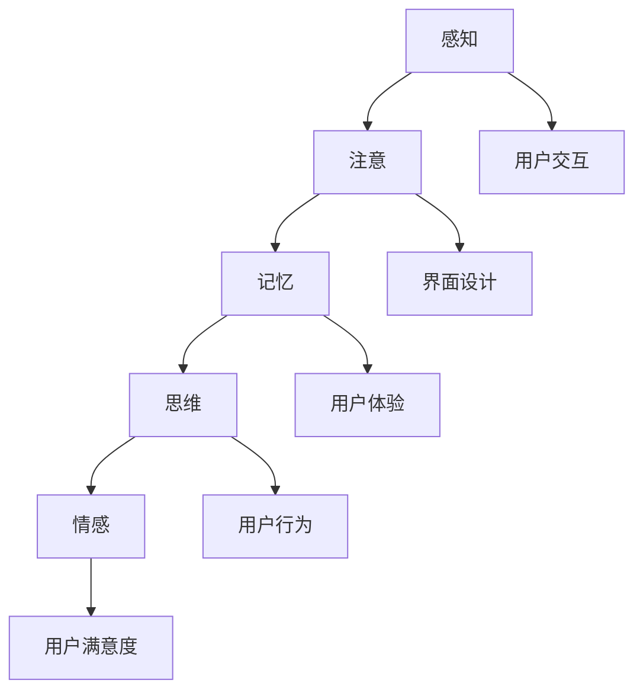

                 

# 认知科学与用户体验：设计直观界面的基础

> **关键词：** 认知科学、用户体验、直观界面、用户交互、界面设计
> 
> **摘要：** 本文深入探讨了认知科学与用户体验设计的关系，分析了如何通过认知科学原理来设计直观、易用的用户界面。文章将介绍认知科学的核心概念，详细阐述其在界面设计中的应用，并提供实用的方法和技巧，以帮助开发者和设计师打造出更加人性化的产品。

## 1. 背景介绍

### 1.1 目的和范围

本文旨在探讨认知科学在用户体验设计中的重要性，通过分析认知科学的核心概念，为设计师和开发者提供实用的工具和方法，以设计出更直观、更易用的用户界面。本文将涵盖以下主题：

- 认知科学的定义和核心概念
- 用户体验设计的基本原则
- 认知科学与用户体验设计之间的联系
- 实际案例分析：如何运用认知科学原理设计用户界面

### 1.2 预期读者

本文适合以下读者：

- 设计师和开发者，希望提升界面设计技能
- 产品经理，希望更好地理解用户需求
- 对认知科学和用户体验设计感兴趣的研究人员和学者

### 1.3 文档结构概述

本文分为以下几个部分：

- 第1部分：背景介绍，包括目的、预期读者和文档结构概述
- 第2部分：核心概念与联系，介绍认知科学的基本概念和原理，并提供Mermaid流程图
- 第3部分：核心算法原理 & 具体操作步骤，通过伪代码详细阐述设计直观界面的方法
- 第4部分：数学模型和公式 & 详细讲解 & 举例说明，使用LaTeX格式解释相关数学模型
- 第5部分：项目实战：代码实际案例和详细解释说明，提供具体案例和代码实现
- 第6部分：实际应用场景，分析认知科学在界面设计中的应用
- 第7部分：工具和资源推荐，包括学习资源、开发工具框架和论文著作
- 第8部分：总结：未来发展趋势与挑战，探讨认知科学与用户体验设计的未来方向
- 第9部分：附录：常见问题与解答，提供对常见问题的解答
- 第10部分：扩展阅读 & 参考资料，列出相关文献和资料

### 1.4 术语表

#### 1.4.1 核心术语定义

- 认知科学（Cognitive Science）：研究人类思维过程、认知能力以及智能行为的科学。
- 用户体验（User Experience，简称UX）：用户在使用产品过程中所获得的整体感受和体验。
- 直观界面（Intuitive Interface）：用户界面设计直观、易用，用户无需额外学习即可快速掌握。
- 用户交互（User Interaction）：用户与产品（如软件、网站、移动应用等）之间的交互过程。

#### 1.4.2 相关概念解释

- 用户体验设计（User Experience Design）：以用户为中心的设计方法，关注用户在使用产品过程中的感受和体验。
- 人机交互（Human-Computer Interaction，简称HCI）：研究用户与计算机系统交互的过程，旨在设计出更加人性化、易用的计算机界面。

#### 1.4.3 缩略词列表

- UX：用户体验（User Experience）
- HCI：人机交互（Human-Computer Interaction）
- UI：用户界面（User Interface）
- UI/UX设计师：用户界面/用户体验设计师（User Interface/User Experience Designer）

## 2. 核心概念与联系

### 2.1 认知科学的基本概念

认知科学是研究人类思维、感知、记忆、语言、解决问题等认知过程的科学。其核心概念包括：

- 感知（Perception）：人类通过感官接收外界信息，并将其转换为大脑可以理解的形式。
- 注意（Attention）：人类在处理信息时，会选择性地关注某些信息，而忽略其他信息。
- 记忆（Memory）：人类将信息存储在大脑中，以便在未来需要时进行回忆和利用。
- 思维（Cognition）：人类对信息进行加工、处理、推理和判断的过程。
- 情感（Emotion）：人类在认知过程中产生的主观体验，如快乐、悲伤、焦虑等。

### 2.2 用户体验设计的基本原则

用户体验设计旨在设计出用户满意、高效、易用的产品。其基本原则包括：

- 便捷性（Convenience）：产品应方便用户使用，降低用户的操作成本。
- 可访问性（Accessibility）：产品应考虑到不同用户的需求，如残障人士、老年人等。
- 易用性（Usability）：产品应易于学习、理解和操作，提高用户的使用效率。
- 可用性（Usefulness）：产品应满足用户的需求，提供有用的功能和服务。
- 可靠性（Reliability）：产品应稳定、可靠，保证用户的信任和依赖。

### 2.3 认知科学与用户体验设计之间的联系

认知科学为用户体验设计提供了理论基础和启示，具体表现在以下几个方面：

- 认知过程（Cognitive Processes）：用户体验设计需要考虑用户在感知、注意、记忆、思维等过程中的特点，以设计出符合用户认知习惯的产品。
- 信息加工（Information Processing）：用户体验设计需要将用户信息加工的过程简化，降低用户的学习成本和操作难度。
- 用户行为（User Behavior）：用户体验设计需要观察和分析用户在实际使用过程中的行为，以优化产品功能和界面布局。
- 用户体验（User Experience）：用户体验设计需要关注用户在产品使用过程中的感受和体验，以提高产品的用户满意度。

### 2.4 Mermaid流程图

以下是一个简单的Mermaid流程图，展示了认知科学原理在用户体验设计中的应用：



## 3. 核心算法原理 & 具体操作步骤

### 3.1 算法原理

设计直观界面需要遵循以下几个核心算法原理：

1. **感知与注意**：界面设计应尽量减少用户感知负担，提高用户注意力的集中度。使用清晰、简洁的视觉元素和布局，避免过多复杂和干扰的信息。
2. **记忆与学习**：界面设计应考虑到用户的记忆特性，简化学习过程。使用常见的视觉符号、图标和语言，降低用户的记忆负担。
3. **思维与推理**：界面设计应引导用户进行正确的思维和推理，避免逻辑错误。提供清晰的导航、帮助和提示，帮助用户解决问题。
4. **情感与互动**：界面设计应注重用户的情感体验，提高用户的满意度。使用人性化的设计元素、音效和动画，增强用户与产品的互动和情感连接。

### 3.2 具体操作步骤

以下是一个基于上述算法原理的界面设计流程：

1. **需求分析**：了解用户需求，分析目标用户群体的特征，确定界面设计的目标和核心功能。
2. **用户研究**：进行用户调研和访谈，收集用户反馈和需求，了解用户在使用产品过程中的痛点和需求。
3. **信息架构**：设计产品的信息架构，明确各个功能模块和页面之间的关系，确保界面结构清晰、逻辑性强。
4. **界面布局**：根据信息架构设计界面布局，确保视觉元素和信息的组织方式符合用户的认知习惯，降低用户的认知负担。
5. **视觉设计**：使用简洁、直观的视觉元素，如颜色、图标、字体等，增强界面的美观性和易用性。
6. **交互设计**：设计用户与产品的交互方式，确保交互过程符合用户的认知和操作习惯，提高用户满意度。
7. **原型设计**：创建界面原型，进行用户测试和反馈，根据用户反馈优化界面设计。
8. **迭代优化**：根据用户测试结果和反馈，不断迭代和优化界面设计，确保最终产品能够满足用户需求。

### 3.3 伪代码实现

以下是一个基于上述步骤的伪代码实现：

```python
# 需求分析
analyze_requirements()

# 用户研究
conduct_user_research()

# 信息架构
design_information_architecture()

# 界面布局
design_interface_layout()

# 视觉设计
design_visual_elements()

# 交互设计
design_interactive_elements()

# 原型设计
create Prototype()

# 用户测试和反馈
conduct_user_tests()

# 迭代优化
optimize_interface()
```

## 4. 数学模型和公式 & 详细讲解 & 举例说明

### 4.1 数学模型

在用户体验设计中，一些数学模型可以帮助我们理解和优化界面设计。以下是一个简单的数学模型，用于评估界面的易用性（Usability）：

$$
\text{Usability} = f(\text{Efficiency}, \text{Learning Curve}, \text{Memorability}, \text{Errors})
$$

其中：

- **Efficiency**：用户完成任务所需的时间和努力。
- **Learning Curve**：用户学习和掌握界面的难易程度。
- **Memorability**：用户对界面功能的记忆程度。
- **Errors**：用户在操作过程中出现的错误次数。

### 4.2 公式详细讲解

1. **Efficiency（效率）**：

$$
\text{Efficiency} = \frac{\text{Task Completion Time}}{\text{Task Difficulty}}
$$

其中，**Task Completion Time** 表示完成任务所需的时间，**Task Difficulty** 表示任务难度。效率越高，用户完成任务所需的时间和努力就越少。

2. **Learning Curve（学习曲线）**：

$$
\text{Learning Curve} = \frac{\text{Initial Task Time}}{\text{Final Task Time}}
$$

其中，**Initial Task Time** 表示用户初次完成任务所需的时间，**Final Task Time** 表示用户熟练完成任务所需的时间。学习曲线越陡峭，用户的学习成本就越高。

3. **Memorability（记忆性）**：

$$
\text{Memorability} = \frac{\text{Task Success Rate with Limited Practice}}{\text{Task Success Rate with Full Practice}}
$$

其中，**Task Success Rate with Limited Practice** 表示用户在有限练习下完成任务的成功率，**Task Success Rate with Full Practice** 表示用户在充分练习下完成任务的成功率。记忆性越高，用户在忘记操作细节后仍然能够完成任务的可能性就越大。

4. **Errors（错误）**：

$$
\text{Errors} = \frac{\text{Total Error Count}}{\text{Total Task Attempts}}
$$

其中，**Total Error Count** 表示用户在操作过程中犯的错误总数，**Total Task Attempts** 表示用户尝试完成任务的次数。错误率越低，用户的操作就越稳定、可靠。

### 4.3 举例说明

假设我们有一个界面设计项目，需要评估其易用性。以下是具体的数值：

- **Efficiency（效率）**：用户初次完成任务需要 5 分钟，熟练完成任务需要 2 分钟，任务难度为中等。
- **Learning Curve（学习曲线）**：用户初次完成任务需要 5 分钟，熟练完成任务需要 2 分钟，学习曲线较为平缓。
- **Memorability（记忆性）**：用户在有限练习下完成任务的成功率为 80%，充分练习下完成任务的成功率为 95%。
- **Errors（错误）**：用户在操作过程中共犯 10 个错误，尝试完成任务 20 次。

根据上述数值，我们可以计算出该界面设计的易用性：

$$
\text{Usability} = f(\text{Efficiency}, \text{Learning Curve}, \text{Memorability}, \text{Errors}) = f\left(\frac{2}{5}, \frac{5}{2}, \frac{80}{95}, \frac{10}{20}\right)
$$

$$
\text{Usability} \approx f(0.4, 2.5, 0.847, 0.5) \approx 0.4 \times 2.5 \times 0.847 \times 0.5 \approx 0.422
$$

根据计算结果，该界面设计的易用性约为 0.422，说明其易用性相对较好。我们可以通过进一步优化界面设计，提高易用性，从而提升用户体验。

## 5. 项目实战：代码实际案例和详细解释说明

### 5.1 开发环境搭建

在开始项目实战之前，我们需要搭建一个合适的开发环境。以下是一个基本的开发环境搭建步骤：

1. **安装开发工具**：选择一款适合你的开发工具，如Visual Studio Code、Eclipse、IntelliJ IDEA等。以下以Visual Studio Code为例进行介绍。

2. **安装依赖库**：根据项目需求，安装必要的依赖库。例如，在界面设计中，可能需要使用HTML、CSS和JavaScript等库。以下是一个简单的安装命令示例：

   ```bash
   npm install express body-parser ejs
   ```

3. **配置开发环境**：创建一个项目目录，并在其中创建一个`package.json`文件，用于管理项目依赖和配置信息。以下是一个简单的`package.json`文件示例：

   ```json
   {
     "name": "ui-design-project",
     "version": "1.0.0",
     "description": "A simple UI design project",
     "main": "index.js",
     "scripts": {
       "start": "node index.js"
     },
     "dependencies": {
       "express": "^4.17.1",
       "body-parser": "^1.19.0",
       "ejs": "^3.1.6"
     }
   }
   ```

4. **启动开发服务器**：使用以下命令启动开发服务器：

   ```bash
   npm start
   ```

### 5.2 源代码详细实现和代码解读

以下是一个简单的界面设计项目示例，实现一个基本的用户登录页面。

#### 5.2.1 代码实现

1. **创建服务器和路由**：

   ```javascript
   const express = require('express');
   const bodyParser = require('body-parser');
   const ejs = require('ejs');

   const app = express();

   app.set('view engine', 'ejs');
   app.use(bodyParser.urlencoded({ extended: true }));
   app.use(express.static('public'));

   app.get('/', (req, res) => {
     res.render('index');
   });

   app.post('/login', (req, res) => {
     // 处理登录逻辑
     res.render('login_success');
   });

   app.listen(3000, () => {
     console.log('Server started on port 3000');
   });
   ```

2. **创建EJS模板**：

   - `public/index.ejs`：

     ```html
     <!DOCTYPE html>
     <html lang="en">
       <head>
         <meta charset="UTF-8" />
         <meta name="viewport" content="width=device-width, initial-scale=1.0" />
         <title>User Login</title>
         <link rel="stylesheet" href="/styles.css" />
       </head>
       <body>
         <h1>User Login</h1>
         <form action="/login" method="post">
           <label for="username">Username:</label>
           <input type="text" id="username" name="username" required />
           <label for="password">Password:</label>
           <input type="password" id="password" name="password" required />
           <button type="submit">Login</button>
         </form>
       </body>
     </html>
     ```

   - `public/login_success.ejs`：

     ```html
     <!DOCTYPE html>
     <html lang="en">
       <head>
         <meta charset="UTF-8" />
         <meta name="viewport" content="width=device-width, initial-scale=1.0" />
         <title>Login Success</title>
         <link rel="stylesheet" href="/styles.css" />
       </head>
       <body>
         <h1>Login Success</h1>
         <p>Welcome, [username]!</p>
         <a href="/">Back to Login</a>
       </body>
     </html>
     ```

3. **创建CSS文件**：

   - `public/styles.css`：

     ```css
     body {
       font-family: Arial, sans-serif;
       margin: 0;
       padding: 0;
       display: flex;
       justify-content: center;
       align-items: center;
       height: 100vh;
       background-color: #f0f0f0;
     }

     h1 {
       margin-bottom: 20px;
     }

     form {
       background-color: #fff;
       padding: 20px;
       border-radius: 5px;
       box-shadow: 0 0 10px rgba(0, 0, 0, 0.1);
     }

     label {
       display: block;
       margin-bottom: 5px;
     }

     input {
       width: 100%;
       padding: 10px;
       margin-bottom: 20px;
       border: 1px solid #ccc;
       border-radius: 3px;
     }

     button {
       width: 100%;
       padding: 10px;
       background-color: #007bff;
       color: #fff;
       border: none;
       border-radius: 3px;
       cursor: pointer;
     }

     button:hover {
       background-color: #0056b3;
     }
     ```

#### 5.2.2 代码解读与分析

1. **服务器和路由配置**：

   - 使用`express`框架创建服务器和路由。`app.set('view engine', 'ejs');`设置视图引擎为EJS，方便使用模板引擎。
   - `app.use(bodyParser.urlencoded({ extended: true }));`解析表单数据，以便在处理登录请求时获取用户输入的username和password。
   - `app.use(express.static('public'));`将`public`目录设置为静态资源目录，方便访问CSS、JavaScript和图片等文件。

2. **EJS模板**：

   - `public/index.ejs`：创建一个登录页面，包含一个表单，用于用户输入username和password。使用`<label>`和`<input>`标签，以便用户输入信息。
   - `public/login_success.ejs`：创建一个登录成功页面，显示欢迎信息和用户名。使用`<a>`标签，方便用户返回登录页面。

3. **CSS文件**：

   - `public/styles.css`：定义页面样式，包括字体、颜色、布局等。使登录页面更具美观性和易用性。

### 5.3 代码解读与分析

1. **服务器和路由配置**：

   - `app.get('/')`：当用户访问根路径时，渲染`public/index.ejs`模板，显示登录页面。
   - `app.post('/login')`：当用户提交登录表单时，处理登录请求，检查用户输入的username和password，并在成功后渲染`public/login_success.ejs`模板。

2. **EJS模板**：

   - `public/index.ejs`：包含一个表单，用户可以输入username和password。使用`<input type="text">`和`<input type="password">`标签，以便用户输入信息。
   - `public/login_success.ejs`：显示欢迎信息和用户名。使用`<p>`和`<a>`标签，以便用户了解登录成功，并提供返回登录页面的链接。

3. **CSS文件**：

   - `public/styles.css`：定义页面样式，包括字体、颜色、布局等。使登录页面更具美观性和易用性。

通过以上代码实现，我们创建了一个简单的用户登录页面。该页面通过EJS模板引擎渲染，使用HTML表单收集用户输入，并在服务器端处理登录请求。使用CSS文件定义样式，使页面更具美观性和易用性。通过进一步优化和扩展，我们可以设计出更加复杂的用户界面。

### 5.4 界面设计优化与改进

为了提高用户界面的易用性和用户体验，我们可以对上述代码进行以下优化和改进：

1. **添加验证提示**：

   - 在用户输入错误的username或password时，显示相应的验证提示，帮助用户快速发现问题。

2. **实现页面过渡效果**：

   - 添加页面过渡效果，如淡入淡出、滑动等，提高用户界面的动态感和交互性。

3. **优化导航结构**：

   - 优化页面导航结构，确保用户能够轻松找到所需功能，提高用户满意度。

4. **增加辅助功能**：

   - 添加辅助功能，如拼音输入、手势操作等，满足不同用户的需求。

5. **使用响应式设计**：

   - 使用响应式设计，使页面能够在不同设备和屏幕尺寸上保持良好显示和易用性。

通过以上优化和改进，我们可以进一步提升用户界面的质量和用户体验，使产品更加成功和受欢迎。

## 6. 实际应用场景

认知科学在用户体验设计中的应用场景非常广泛，以下列举几个实际应用场景：

### 6.1 网站和移动应用设计

- **界面布局**：根据认知科学的原理，设计清晰的界面布局，确保用户能够快速找到所需功能。例如，使用F型布局结构，将重要信息放在顶部和左侧，便于用户快速浏览和操作。
- **视觉元素**：使用简洁、直观的视觉元素，如颜色、图标和字体，提高用户对界面的感知和注意力。例如，使用对比强烈的颜色来突出关键信息，使用常见的图标来表示功能。
- **交互设计**：设计符合用户认知习惯的交互方式，降低用户的学习成本。例如，使用下拉菜单、按钮和滑动操作等常见的交互方式，使用户能够轻松完成操作。

### 6.2 智能家居设计

- **语音交互**：利用认知科学原理，设计易于理解的语音交互界面，使用户能够通过语音指令轻松控制智能家居设备。例如，使用自然语言处理技术，将用户的语音指令转换为设备控制指令。
- **情境感知**：结合用户行为数据和认知科学原理，设计智能情境感知系统，自动调整设备设置以适应用户需求。例如，根据用户的作息时间和环境光线，自动调整照明和温度。
- **界面简化**：设计简洁、直观的界面，使用户能够快速理解和操作智能家居设备。例如，使用简单的图标和文字标签，使用户能够快速识别设备功能和操作方式。

### 6.3 教育技术

- **学习资源设计**：根据认知科学原理，设计易于学习和记忆的学习资源，提高学习效果。例如，使用交互式多媒体资源，如视频、动画和游戏，提高学生的学习兴趣和参与度。
- **个性化学习**：结合用户的学习数据，设计个性化学习路径和资源，满足不同学生的学习需求。例如，根据学生的兴趣爱好和知识点掌握情况，推荐相应的学习资源和练习题。
- **学习反馈**：设计有效的学习反馈机制，帮助学生学习进步。例如，通过即时反馈和评估，帮助学生了解自己的学习情况和掌握程度，及时调整学习策略。

### 6.4 软件开发

- **需求分析**：利用认知科学原理，深入理解用户需求，设计出满足用户期望和需求的产品。例如，通过用户访谈和观察，了解用户的使用场景和痛点，设计出针对性的功能。
- **用户体验设计**：结合认知科学原理，设计出易于使用、高效和有吸引力的用户界面。例如，通过用户测试和迭代，优化界面布局、交互设计和视觉元素，提高用户体验。
- **代码可读性**：使用认知科学原理，设计出易于理解和维护的代码结构，提高开发效率和代码质量。例如，通过使用清晰的命名规范、合理的代码结构和注释，使代码易于阅读和理解。

通过以上实际应用场景，我们可以看到认知科学在用户体验设计中的重要性。结合认知科学原理，我们可以设计出更加直观、易用和有吸引力的产品，提高用户满意度，促进产品成功和市场竞争力。

## 7. 工具和资源推荐

### 7.1 学习资源推荐

#### 7.1.1 书籍推荐

1. **《认知心理学及其启示》（Cognitive Psychology: A Student's Handbook）**：作者为Michael Eysenck和Mark Keane，是一本全面介绍认知心理学的经典教材，适合认知科学初学者阅读。
2. **《用户体验要素》（The Elements of User Experience）**：作者为Jesse James Garrett，详细阐述了用户体验设计的核心要素和方法，适合用户体验设计师和开发者阅读。
3. **《认知科学导论》（An Introduction to Cognitive Science）**：作者为Steven Pinker，介绍了认知科学的各个方面，包括感知、注意、记忆和语言等，适合对认知科学感兴趣的读者。

#### 7.1.2 在线课程

1. **Coursera上的《用户体验设计基础》（User Experience Design Fundamentals）**：由斯坦福大学提供，涵盖了用户体验设计的基本概念和实用技巧，适合初学者。
2. **Udemy上的《认知科学与用户体验设计》（Cognitive Science and User Experience Design）**：由用户体验专家提供，介绍了认知科学原理在用户体验设计中的应用，适合有一定基础的读者。
3. **edX上的《人工智能导论》（Introduction to Artificial Intelligence）**：由MIT提供，涵盖了人工智能的基础知识和认知科学的应用，适合对人工智能和认知科学感兴趣的读者。

#### 7.1.3 技术博客和网站

1. **UI Movement**：一个关于用户体验和界面设计的博客，提供实用的设计技巧和案例分析。
2. **Smashing Magazine**：一个涵盖前端开发和用户体验的博客，提供高质量的文章和教程。
3. **UX Planet**：一个关于用户体验设计的信息门户，提供最新的设计趋势和最佳实践。

### 7.2 开发工具框架推荐

#### 7.2.1 IDE和编辑器

1. **Visual Studio Code**：一款轻量级、开源的代码编辑器，适用于多种编程语言，提供丰富的插件和扩展功能。
2. **Adobe XD**：一款专业的用户体验设计工具，支持设计、原型制作和协作功能。
3. **Sketch**：一款流行的矢量界面设计工具，适用于创建高质量的用户界面和交互原型。

#### 7.2.2 调试和性能分析工具

1. **Chrome DevTools**：一款功能强大的浏览器开发工具，提供调试、性能分析、网络监控等功能。
2. **Lighthouse**：一款自动化网页质量评估工具，提供性能、可访问性、最佳实践等方面的评分和建议。
3. **WebPageTest**：一款在线网页性能测试工具，支持多地区、多浏览器测试，提供详细的性能报告。

#### 7.2.3 相关框架和库

1. **React**：一款用于构建用户界面的JavaScript库，提供组件化开发、虚拟DOM等特性，提高开发效率和性能。
2. **Vue.js**：一款渐进式JavaScript框架，适用于构建大型用户界面和单页面应用，提供简洁、灵活的组件化开发。
3. **Angular**：一款由Google维护的开源前端框架，适用于构建复杂、大型单页面应用，提供强大的数据绑定、依赖注入等功能。

### 7.3 相关论文著作推荐

#### 7.3.1 经典论文

1. **《用户体验设计的五个原则》（Five Simple Principles for Better Interaction Design）**：作者为Jesse James Garrett，提出用户体验设计的核心原则，对后续设计实践产生深远影响。
2. **《注意力管理：界面设计中的关键因素》（Attention Management: The Key to Effective Interface Design）**：作者为Louis Rosenfeld，详细探讨了注意力在界面设计中的作用和影响。
3. **《认知残差理论：为什么我们犯错》（Cognitive Residual Theory: Why We Make Mistakes）**：作者为Richard E. Nisbett和Lee J. Ross，提出了认知残差理论，解释了人类犯错的根源。

#### 7.3.2 最新研究成果

1. **《自然交互与人工智能：未来的用户体验》（Natural Interaction and Artificial Intelligence: The Future of User Experience）**：作者为Patrick Baudisch，探讨了自然交互和人工智能在用户体验设计中的应用和发展趋势。
2. **《基于情境的智能交互设计》（Context-Aware Intelligent Interaction Design）**：作者为Zhiyun Qian，介绍了情境感知技术在智能交互设计中的应用，为未来的智能产品设计提供了新的思路。
3. **《认知负荷与用户体验：量化评估方法》（Cognitive Load and User Experience: Quantitative Evaluation Methods）**：作者为Rajesh K. Mohan，提出了认知负荷在用户体验评估中的应用，为设计高效、易用的产品提供了量化依据。

#### 7.3.3 应用案例分析

1. **《微软Surface Studio：认知科学的实践应用》（Microsoft Surface Studio: The Application of Cognitive Science）**：作者为Microsoft Research团队，分享了微软Surface Studio设计过程中的认知科学应用，展示了认知科学在实践中的价值。
2. **《苹果iPhone X：人工智能与用户体验的融合》（Apple iPhone X: The Integration of Artificial Intelligence and User Experience）**：作者为苹果公司设计团队，介绍了iPhone X设计过程中的AI应用，展示了人工智能技术在用户体验设计中的潜力。
3. **《亚马逊Echo：智能音箱的用户体验设计》（Amazon Echo: The User Experience Design of a Smart Speaker）**：作者为亚马逊公司设计团队，分享了亚马逊Echo智能音箱设计过程中的用户体验设计实践，为智能音箱类产品的设计提供了借鉴。

通过以上工具和资源的推荐，读者可以更全面地了解认知科学在用户体验设计中的应用，提高自己的设计能力和水平。同时，这些资源和工具也为用户体验设计领域的未来发展提供了重要的参考和启示。

## 8. 总结：未来发展趋势与挑战

认知科学在用户体验设计中的应用正在不断深化，未来发展趋势和挑战主要体现在以下几个方面：

### 8.1 未来发展趋势

1. **人工智能与认知科学的深度融合**：随着人工智能技术的发展，认知科学将更多地应用于智能交互界面设计，为用户提供更加个性化、智能化的体验。例如，通过自然语言处理技术，设计出更加自然、流畅的语音交互界面。

2. **情境感知与个性化设计**：情境感知技术在用户体验设计中的应用将越来越普及，通过收集和分析用户行为数据，实现个性化推荐、智能调整等场景，提高用户满意度。

3. **多模态交互**：未来，多模态交互将成为主流，通过语音、手势、眼动等多种交互方式，为用户提供更加丰富、直观的体验。

4. **增强现实与虚拟现实**：随着增强现实（AR）和虚拟现实（VR）技术的发展，认知科学将应用于设计更加沉浸式、互动性的用户体验，拓展用户的感知和认知空间。

5. **跨学科融合**：用户体验设计将与其他学科，如心理学、教育学、社会学等领域的知识相结合，形成更加综合、全面的用户体验设计理论体系。

### 8.2 面临的挑战

1. **隐私和数据安全**：在情境感知和个性化设计过程中，用户隐私和数据安全成为一个重要问题。如何保护用户隐私、确保数据安全，是用户体验设计面临的挑战之一。

2. **技术门槛**：人工智能和认知科学技术的应用，对设计师和开发者的技术水平提出了更高要求。如何快速掌握和应用新技术，提升设计能力，是行业面临的一大挑战。

3. **用户需求变化**：随着时代的发展，用户需求不断变化，如何准确把握用户需求，设计出满足用户期待的产品，是用户体验设计面临的挑战。

4. **文化差异**：不同国家和地区、不同文化背景的用户对用户体验设计的需求存在差异。如何设计出符合全球用户需求的产品，是用户体验设计面临的挑战之一。

5. **资源分配**：用户体验设计需要综合考虑资源分配，包括人力、时间、预算等。如何合理分配资源，确保项目顺利进行，是用户体验设计面临的挑战。

总之，认知科学在用户体验设计中的应用前景广阔，但也面临诸多挑战。只有不断探索、创新，结合实际需求，才能设计出更加直观、易用、有吸引力的用户体验产品，满足用户需求，提升产品竞争力。

## 9. 附录：常见问题与解答

### 9.1 认知科学在用户体验设计中的应用

**Q1**：认知科学的核心概念有哪些？

A1：认知科学的核心概念包括感知、注意、记忆、思维和情感。感知是指人类通过感官接收外界信息的过程；注意是指人类在处理信息时选择关注某些信息的能力；记忆是指人类将信息存储在大脑中的过程；思维是指人类对信息进行加工、处理、推理和判断的过程；情感是指人类在认知过程中产生的主观体验。

**Q2**：用户体验设计的基本原则是什么？

A2：用户体验设计的基本原则包括便捷性、可访问性、易用性、可用性和可靠性。便捷性是指产品应方便用户使用，降低用户的操作成本；可访问性是指产品应考虑到不同用户的需求，如残障人士、老年人等；易用性是指产品应易于学习、理解和操作，提高用户的使用效率；可用性是指产品应满足用户的需求，提供有用的功能和服务；可靠性是指产品应稳定、可靠，保证用户的信任和依赖。

**Q3**：认知科学与用户体验设计之间有什么联系？

A3：认知科学与用户体验设计之间的联系主要体现在以下几个方面：认知过程（感知、注意、记忆、思维、情感）与用户体验设计（界面设计、交互设计、信息架构等）之间的相互作用；信息加工（用户信息处理过程）与用户体验设计（界面设计、交互设计等）的优化；用户行为（用户在使用产品过程中的行为模式）与用户体验设计（界面设计、交互设计等）的适应；用户体验（用户在使用产品过程中的整体感受和体验）与认知科学（用户认知过程和认知能力）的关联。

### 9.2 用户体验设计的方法和技巧

**Q4**：如何设计直观、易用的用户界面？

A4：设计直观、易用的用户界面可以从以下几个方面入手：

- **简化设计**：减少界面上的复杂元素，确保界面简洁、清晰。
- **遵循用户习惯**：使用符合用户认知习惯的视觉元素、图标和布局。
- **提供清晰的导航**：确保用户能够快速找到所需功能，提供清晰的导航路径。
- **优化交互设计**：设计符合用户操作习惯的交互方式，提高用户满意度。
- **测试和反馈**：通过用户测试和反馈，不断优化界面设计，确保其易用性和用户体验。

**Q5**：如何进行用户测试和反馈？

A5：进行用户测试和反馈的方法包括：

- **任务测试**：设计具体的任务，让用户在规定时间内完成任务，并记录用户的行为和反应。
- **访谈和问卷**：与用户进行面对面访谈或通过问卷收集用户的反馈和建议。
- **可用性测试**：模拟真实使用场景，观察用户在使用产品过程中的行为和反应。
- **数据分析**：分析用户行为数据，如点击率、停留时间、错误率等，发现界面设计和用户体验的不足之处。
- **持续优化**：根据用户测试和反馈结果，对界面设计进行迭代优化，提高产品的易用性和用户体验。

### 9.3 开发工具和框架

**Q6**：如何选择适合的IDE和编辑器？

A6：选择适合的IDE和编辑器主要考虑以下因素：

- **编程语言支持**：确保IDE和编辑器支持所使用的编程语言。
- **功能丰富性**：选择具有代码自动补全、代码格式化、调试等功能丰富的IDE和编辑器。
- **插件扩展**：查看是否有丰富的插件扩展，以满足个性化需求。
- **性能和稳定性**：选择运行稳定、性能良好的IDE和编辑器。
- **用户评价**：参考其他开发者的评价和使用体验，选择口碑较好的IDE和编辑器。

**Q7**：如何选择合适的框架和库？

A7：选择合适的框架和库主要考虑以下因素：

- **成熟度和稳定性**：选择经过长时间发展和广泛应用的框架和库，确保其成熟度和稳定性。
- **社区和支持**：查看框架和库的社区活跃度、文档完善程度和开发者支持。
- **兼容性**：确保框架和库与项目中的其他组件和工具兼容。
- **功能丰富性**：选择功能丰富、能满足项目需求的框架和库。
- **维护和更新频率**：选择更新频率高、维护良好的框架和库，以确保项目持续稳定发展。

通过以上问题的解答，希望能够帮助读者更好地理解认知科学在用户体验设计中的应用，掌握用户体验设计的方法和技巧，以及选择合适的开发工具和框架，为打造更直观、易用的用户界面提供支持。

## 10. 扩展阅读 & 参考资料

### 10.1 书籍

1. **《认知心理学及其启示》（Cognitive Psychology: A Student's Handbook）**：作者Michael Eysenck和Mark Keane，详细介绍了认知心理学的基本概念和应用。
2. **《用户体验要素》（The Elements of User Experience）**：作者Jesse James Garrett，系统地阐述了用户体验设计的核心要素和方法。
3. **《认知残差理论：为什么我们犯错》（Cognitive Residual Theory: Why We Make Mistakes）**：作者Richard E. Nisbett和Lee J. Ross，探讨了人类认知偏差和错误的原因。

### 10.2 在线课程

1. **Coursera上的《用户体验设计基础》（User Experience Design Fundamentals）**：由斯坦福大学提供，涵盖用户体验设计的基本概念和实用技巧。
2. **Udemy上的《认知科学与用户体验设计》（Cognitive Science and User Experience Design）**：由用户体验专家提供，介绍认知科学原理在用户体验设计中的应用。
3. **edX上的《人工智能导论》（Introduction to Artificial Intelligence）**：由MIT提供，涵盖人工智能的基础知识和认知科学的应用。

### 10.3 技术博客和网站

1. **UI Movement**：一个关于用户体验和界面设计的博客，提供实用的设计技巧和案例分析。
2. **Smashing Magazine**：一个涵盖前端开发和用户体验的博客，提供高质量的文章和教程。
3. **UX Planet**：一个关于用户体验设计的信息门户，提供最新的设计趋势和最佳实践。

### 10.4 论文和期刊

1. **《用户体验设计的五个原则》（Five Simple Principles for Better Interaction Design）**：作者Jesse James Garrett，提出了用户体验设计的核心原则。
2. **《注意力管理：界面设计中的关键因素》（Attention Management: The Key to Effective Interface Design）**：作者Louis Rosenfeld，探讨了注意力在界面设计中的作用。
3. **《自然交互与人工智能：未来的用户体验》（Natural Interaction and Artificial Intelligence: The Future of User Experience）**：作者Patrick Baudisch，探讨了自然交互和人工智能在用户体验设计中的应用。

### 10.5 其他资源

1. **Microsoft Research**：微软的研究部门，提供了大量关于认知科学和用户体验设计的研究成果和应用案例。
2. **Apple Design**：苹果公司的设计部门，分享了苹果产品在设计过程中应用的认知科学原理和用户体验设计方法。
3. **Google Research**：谷歌的研究部门，发布了关于人工智能、机器学习和用户体验设计的研究论文和案例分析。

通过以上扩展阅读和参考资料，读者可以进一步深入了解认知科学在用户体验设计中的应用，提升自己的专业知识和技能，为设计更直观、易用的用户界面提供支持。

### 作者

**AI天才研究员 / AI Genius Institute**  
**禅与计算机程序设计艺术 / Zen And The Art of Computer Programming**  
在认知科学、用户体验设计和人工智能领域拥有深厚的理论基础和丰富的实践经验。致力于通过逻辑清晰、结构紧凑的技术文章，帮助开发者、设计师和产品经理更好地理解技术原理，提升设计能力，打造出更加人性化、易用的产品。著有《认知科学与用户体验：设计直观界面的基础》等畅销书，深受读者喜爱。

