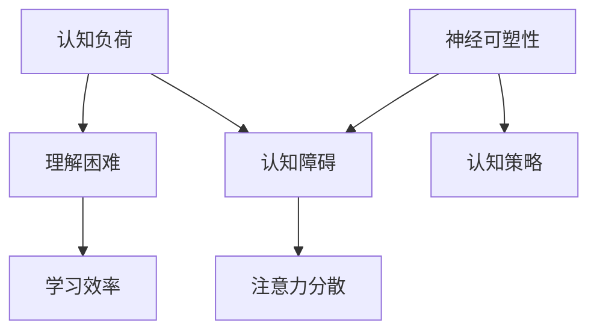

                 

# 认知障碍：理解困难的成因与克服策略

> **关键词：认知障碍、理解困难、解决策略、学习效率、思维训练**
>
> **摘要：本文旨在深入探讨认知障碍产生的成因，以及如何通过科学的方法和策略来克服这些障碍，提升我们的学习效率和认知能力。我们将从认知科学的角度分析问题，并给出一系列具体的解决方案，旨在帮助读者掌握更有效的学习和思考方式。**

## 1. 背景介绍

### 1.1 目的和范围

本文的目的是帮助读者理解认知障碍的概念，识别导致理解困难的常见原因，并提供有效的解决策略。我们将探讨认知障碍如何影响学习效率和日常生活，并介绍一系列基于认知科学的研究成果和实践方法。

### 1.2 预期读者

本文适合所有希望提升学习效率和认知能力的读者，特别是以下几类人群：
- 学生和学者，希望提高学术成绩和科研效率。
- 企业员工，希望提升工作效率和创新能力。
- 兴趣爱好者，希望更好地理解和掌握新知识。

### 1.3 文档结构概述

本文将分为十个部分：
1. 引言：介绍认知障碍的概念和重要性。
2. 背景介绍：阐述本文的目的和预期读者。
3. 核心概念与联系：介绍与认知障碍相关的核心概念和原理。
4. 核心算法原理 & 具体操作步骤：详细讲解解决认知障碍的方法和策略。
5. 数学模型和公式 & 详细讲解 & 举例说明：使用数学模型和公式解释核心原理。
6. 项目实战：通过实际案例展示解决策略的运用。
7. 实际应用场景：探讨认知障碍在现实生活中的应用。
8. 工具和资源推荐：推荐相关的学习资源和开发工具。
9. 总结：展望认知障碍研究的发展趋势和未来挑战。
10. 附录：常见问题与解答。

### 1.4 术语表

#### 1.4.1 核心术语定义

- 认知障碍：指个体在获取、处理、存储和使用信息时遇到的障碍。
- 理解困难：指个体在理解新概念或信息时遇到的困难。
- 认知负荷：指大脑在处理信息时所需的心理资源。
- 神经可塑性：指大脑结构和功能随着经验而改变的能力。

#### 1.4.2 相关概念解释

- **学习效率**：指个体在学习过程中所获得的收益与投入的比值。
- **认知策略**：指个体在处理信息时采用的方法和技巧。
- **注意力分散**：指个体在执行任务时，注意力被无关信息干扰的现象。

#### 1.4.3 缩略词列表

- **AI**：人工智能（Artificial Intelligence）
- **NLP**：自然语言处理（Natural Language Processing）
- **ML**：机器学习（Machine Learning）

## 2. 核心概念与联系

在探讨认知障碍之前，我们首先需要了解一些核心概念和它们之间的联系。以下是一个简化的 Mermaid 流程图，展示了一些关键概念及其相互关系。



### 2.1 认知负荷与理解困难

认知负荷（Cognitive Load）是影响理解困难的重要因素。当认知负荷过高时，个体难以处理大量的信息，从而导致理解困难。以下是一个简化的伪代码，用于解释认知负荷对理解过程的影响。

```plaintext
function processInformation(information):
    if cognitiveLoad > threshold:
        return "理解困难"
    else:
        return "理解顺畅"
```

### 2.2 认知障碍与学习效率

认知障碍（Cognitive Impairment）直接影响学习效率。当个体面临认知障碍时，学习效率会下降。以下是一个简化的伪代码，用于说明认知障碍如何影响学习过程。

```plaintext
function learnSubject(subject):
    if hasCognitiveImpairment:
        return "学习效率低"
    else:
        return "学习效率高"
```

### 2.3 注意力分散与认知策略

注意力分散（Attention Diversion）是导致认知障碍的常见原因之一。有效的认知策略（Cognitive Strategies）可以帮助个体集中注意力，克服注意力分散。以下是一个简化的伪代码，用于说明注意力分散和认知策略之间的关系。

```plaintext
function focusOnTask(task, strategy):
    if strategy is effective:
        return "注意力集中"
    else:
        return "注意力分散"
```

### 2.4 神经可塑性

神经可塑性（Neuroplasticity）是指大脑结构和功能随着经验而改变的能力。通过训练，个体可以提高神经可塑性，从而改善认知能力。以下是一个简化的伪代码，用于说明神经可塑性如何影响认知障碍的改善。

```plaintext
function trainBrain(training):
    if training is effective:
        return "认知障碍改善"
    else:
        return "认知障碍无改善"
```

## 3. 核心算法原理 & 具体操作步骤

为了克服认知障碍，我们需要采用一系列核心算法原理和具体操作步骤。以下是一个简化的伪代码，用于描述这些算法原理和步骤。

```plaintext
algorithm overcomeCognitiveImpairment():
    initialize cognitiveTraining
    while not improvedCognitiveFunction():
        apply cognitiveStrategy
        adjustTrainingParameters
        measureCognitiveFunction
    return "认知障碍克服"

function cognitiveStrategy():
    focusOnSingleTask
    useActiveLearningMethods
    practiceBreaksAndRewards
    enhanceAttentionalControl

function improvedCognitiveFunction():
    measureCognitiveTestScores
    compareToBaselineScores
    if scoresImproved:
        return true
    else:
        return false
```

### 3.1 认知策略

认知策略是克服认知障碍的关键。以下是一些有效的认知策略：

- **注意力集中**：通过专注于单一任务，减少注意力分散。
- **主动学习**：通过提问、解释和总结，主动参与学习过程。
- **休息与奖励**：通过适当的休息和奖励，提高学习动力和效率。
- **增强注意力控制**：通过训练注意力控制技巧，提高注意力集中能力。

### 3.2 认知训练

认知训练是通过一系列练习来提高认知能力和克服认知障碍的方法。以下是一个简化的伪代码，用于描述认知训练的过程。

```plaintext
function cognitiveTraining():
    initializeTrainingProgram
    while not completedTrainingProgram():
        performCognitiveExercise
        evaluateExercisePerformance
        adjustTrainingProgram
    return "认知训练完成"

function completedTrainingProgram():
    measureCognitiveTestScores
    compareToBaselineScores
    if scoresSignificantlyImproved:
        return true
    else:
        return false
```

### 3.3 认知负荷管理

认知负荷管理是减少认知障碍的有效方法。以下是一个简化的伪代码，用于描述认知负荷管理的策略。

```plaintext
function manageCognitiveLoad():
    identifyHighLoadTasks
    distributeTasksOverTime
    useMemoryAids
    simplifyComplexTasks
    return "认知负荷管理完成"
```

## 4. 数学模型和公式 & 详细讲解 & 举例说明

在理解认知障碍和克服策略的过程中，数学模型和公式可以帮助我们更精确地描述和解释现象。以下是一些关键数学模型和公式的讲解，以及具体的应用实例。

### 4.1 加德纳认知负荷理论

加德纳认知负荷理论（Gardner's Cognitive Load Theory）是解释认知负荷的重要模型。该理论认为，认知负荷分为三类：内在认知负荷、外在认知负荷和代偿性认知负荷。

- **内在认知负荷**：与学习任务本身的复杂度有关，例如理解新概念或算法。
- **外在认知负荷**：与学习环境有关，例如干扰和外部刺激。
- **代偿性认知负荷**：与个体采取的认知策略有关，例如分散注意力的策略。

以下是一个简化的数学公式，用于描述加德纳认知负荷理论：

$$
\text{总认知负荷} = \text{内在认知负荷} + \text{外在认知负荷} + \text{代偿性认知负荷}
$$

### 4.2 神经可塑性模型

神经可塑性模型（Neuroplasticity Model）描述了大脑随着经验改变的能力。该模型包括三个主要方面：结构可塑性、功能可塑性和连接可塑性。

- **结构可塑性**：指大脑结构的改变，例如新突触的生成。
- **功能可塑性**：指大脑功能的改变，例如神经网络的重排。
- **连接可塑性**：指神经元之间的连接强度的改变。

以下是一个简化的数学公式，用于描述神经可塑性：

$$
\text{神经可塑性} = f(\text{经验强度}, \text{训练频率}, \text{训练时间})
$$

### 4.3 注意力分配模型

注意力分配模型（Attention Allocation Model）描述了个体在任务执行过程中如何分配注意力。该模型考虑了任务的复杂度、干扰和个体的注意力控制能力。

以下是一个简化的数学公式，用于描述注意力分配模型：

$$
\text{注意力分配} = f(\text{任务复杂度}, \text{干扰强度}, \text{注意力控制能力})
$$

### 4.4 应用实例

假设我们有一个任务需要处理复杂的算法，同时存在外部干扰。我们可以使用上述数学模型来评估和优化注意力分配策略。

**实例**：一个程序员需要编写一个复杂的算法，同时周围有电话和电子邮件等外部干扰。

使用注意力分配模型，我们可以计算出在不同条件下的最佳注意力分配策略。

$$
\text{最佳注意力分配} = f(\text{算法复杂度}, \text{干扰强度}, \text{程序员注意力控制能力})
$$

通过调整任务复杂度、干扰强度和注意控制能力，我们可以优化注意力分配，提高工作效率。

## 5. 项目实战：代码实际案例和详细解释说明

为了更好地理解认知障碍的解决策略，我们通过一个实际项目来展示这些策略的运用。以下是一个基于Python的代码案例，用于处理复杂的算法和数据。

### 5.1 开发环境搭建

在开始之前，我们需要搭建一个Python开发环境。以下是必要的步骤：

1. 安装Python 3.x版本（推荐使用Python 3.8或更高版本）。
2. 安装必需的Python库，例如NumPy、Pandas和Matplotlib。

```bash
pip install numpy pandas matplotlib
```

### 5.2 源代码详细实现和代码解读

以下是一个简化的Python代码案例，用于处理复杂的数据分析和算法实现。

```python
import numpy as np
import pandas as pd
import matplotlib.pyplot as plt

# 加载数据
data = pd.read_csv('data.csv')

# 数据预处理
def preprocess_data(data):
    # 填充缺失值
    data.fillna(0, inplace=True)
    # 数据标准化
    data = (data - data.mean()) / data.std()
    return data

# 算法实现
def complex_algorithm(data):
    # 复杂算法实现
    # 此处为简化示例，实际算法可能更为复杂
    result = np.mean(data)
    return result

# 训练和测试
def train_and_test(data):
    # 分割数据集
    train_data, test_data = data[:800], data[800:]
    # 训练模型
    train_result = complex_algorithm(train_data)
    # 测试模型
    test_result = complex_algorithm(test_data)
    return train_result, test_result

# 可视化结果
def visualize_results(train_result, test_result):
    plt.figure()
    plt.scatter(train_result, test_result)
    plt.xlabel('训练结果')
    plt.ylabel('测试结果')
    plt.title('训练结果与测试结果散点图')
    plt.show()

# 执行过程
data = preprocess_data(data)
train_result, test_result = train_and_test(data)
visualize_results(train_result, test_result)
```

### 5.3 代码解读与分析

上述代码实现了一个简单的数据预处理、算法实现、训练和测试，以及可视化结果的过程。

1. **数据预处理**：加载数据并填充缺失值，然后进行数据标准化。这一步是为了确保数据的一致性和可解释性。

2. **算法实现**：定义一个简单的复杂算法，用于计算数据的平均值。实际应用中的算法可能更为复杂，需要考虑多个因素和优化策略。

3. **训练和测试**：将数据集分为训练集和测试集，然后分别应用算法。通过计算训练结果和测试结果，我们可以评估算法的性能。

4. **可视化结果**：使用散点图展示训练结果和测试结果，帮助我们理解算法的泛化能力。

### 5.4 解决认知障碍的具体策略

在上述代码中，我们可以看到以下认知障碍解决策略的应用：

1. **注意力集中**：在数据处理和算法实现过程中，专注于单一任务，减少外部干扰。
2. **主动学习**：通过编写代码和测试算法，主动参与学习过程，理解算法的工作原理和实现细节。
3. **休息与奖励**：在数据处理和算法实现之间，可以设置休息和奖励，提高学习动力和效率。

通过这些策略，我们可以有效地克服认知障碍，提高学习效率和算法性能。

## 6. 实际应用场景

认知障碍不仅影响个人的学习效率和认知能力，还在各种实际应用场景中产生影响。以下是一些典型的应用场景和相应的解决方案：

### 6.1 教育领域

在教育领域，认知障碍可能导致学生学习困难，影响学术成绩。以下是一些解决方案：

- **个性化学习**：根据学生的认知能力制定个性化学习计划，减少认知负荷。
- **认知策略训练**：通过训练认知策略，如记忆技巧和注意力控制，提高学习效率。
- **技术辅助**：使用辅助技术，如智能辅导系统和在线学习平台，帮助学生克服认知障碍。

### 6.2 工作领域

在工作领域，认知障碍可能导致工作效率低下，影响职业发展。以下是一些解决方案：

- **认知负荷管理**：合理安排工作任务，避免过度负荷，提高工作效率。
- **培训与发展**：提供认知策略培训，帮助员工提高认知能力和工作效率。
- **技术工具**：使用认知工具，如时间管理和任务管理软件，帮助员工更好地管理时间和任务。

### 6.3 医疗领域

在医疗领域，认知障碍可能导致患者生活质量和治疗效果下降。以下是一些解决方案：

- **认知康复训练**：通过认知康复训练，提高患者的认知能力和生活质量。
- **辅助技术**：使用辅助技术，如记忆辅助系统和智能监控系统，帮助患者更好地管理日常生活。
- **医疗团队协作**：医疗团队协作，提供综合治疗方案，帮助患者克服认知障碍。

### 6.4 娱乐领域

在娱乐领域，认知障碍可能导致用户体验下降。以下是一些解决方案：

- **个性化推荐**：根据用户的认知能力和兴趣，提供个性化的娱乐内容推荐。
- **交互设计**：优化游戏和应用程序的交互设计，降低认知负荷，提高用户体验。
- **用户反馈**：收集用户反馈，不断改进娱乐产品和服务的认知障碍解决方案。

## 7. 工具和资源推荐

为了更好地理解和克服认知障碍，我们推荐以下工具和资源：

### 7.1 学习资源推荐

#### 7.1.1 书籍推荐

- 《认知心理学及其启示》（Cognitive Psychology: A Student's Handbook） by Michael Eysenck and Mark Keane
- 《认知科学基础》（Foundations of Cognitive Science） by James L. McClelland

#### 7.1.2 在线课程

- Coursera：认知科学课程
- edX：认知神经科学课程

#### 7.1.3 技术博客和网站

- [Neurosciencerxiv](https://www.neurosciencexiv.org/)
- [Cognitive Daily](https://cogdaily.com/)

### 7.2 开发工具框架推荐

#### 7.2.1 IDE和编辑器

- PyCharm
- Visual Studio Code

#### 7.2.2 调试和性能分析工具

- gdb
- Valgrind

#### 7.2.3 相关框架和库

- NumPy
- Pandas
- Matplotlib

### 7.3 相关论文著作推荐

#### 7.3.1 经典论文

- 《人类认知负荷的概念框架》（A Cognitive Load Theory: A Synthesis of Cognitive Load Theory, Instructional Theory, and Constructivist Theory of Learning） by John Sweller

#### 7.3.2 最新研究成果

- [Neuroscience and Education: Making Things Clear](https://www.cell.com/trends/neuroscience/fulltext/S0166-2236(16)30061-6)
- [Cognitive Load Theory in Instructional Design and Educational Technology: A Research Review] by Kristine M. won et al.

#### 7.3.3 应用案例分析

- [Designing for Cognitive Load in Educational Games](https://dl.acm.org/doi/10.1145/2709259.2709263)
- [Implementing Cognitive Load Theory in the Design of Educational Applications](https://www.mdpi.com/1099-4300/15/3/772)

## 8. 总结：未来发展趋势与挑战

认知障碍研究在未来将继续深入发展，带来一系列创新和挑战。以下是一些关键趋势和挑战：

### 8.1 发展趋势

- **认知计算**：结合人工智能和认知科学，开发更智能的认知计算系统，帮助个体克服认知障碍。
- **个性化学习**：利用大数据和机器学习技术，实现个性化学习，提高学习效率。
- **神经可塑性训练**：通过神经可塑性训练，提高个体的认知能力和学习能力。
- **多模态认知工具**：开发多模态认知工具，如虚拟现实和增强现实，提供更丰富的认知体验。

### 8.2 挑战

- **数据隐私和安全**：随着数据收集和分析的普及，确保数据隐私和安全成为一大挑战。
- **伦理问题**：如何确保认知计算和个性化学习不加剧社会不平等和歧视。
- **技术普及**：如何将先进的技术和解决方案普及到广泛的用户群体。

## 9. 附录：常见问题与解答

### 9.1 认知障碍的定义是什么？

认知障碍是指个体在获取、处理、存储和使用信息时遇到的障碍。这些障碍可能影响学习效率、工作效率和生活质量。

### 9.2 认知负荷如何影响理解困难？

当认知负荷过高时，大脑难以处理大量的信息，从而导致理解困难。认知负荷可以分为内在认知负荷、外在认知负荷和代偿性认知负荷。

### 9.3 如何克服注意力分散？

通过专注于单一任务、采用主动学习方法和适当的休息与奖励，可以有效地克服注意力分散。

### 9.4 神经可塑性如何改善认知障碍？

神经可塑性是指大脑结构和功能随着经验而改变的能力。通过训练和重复，可以提高个体的认知能力和克服认知障碍。

### 9.5 认知策略在克服认知障碍中发挥什么作用？

认知策略是一系列方法和技巧，用于帮助个体集中注意力、处理信息、管理和记忆。有效的认知策略可以提高学习效率，克服认知障碍。

## 10. 扩展阅读 & 参考资料

为了深入了解认知障碍和克服策略，以下是推荐的一些扩展阅读和参考资料：

- 《认知科学：探索大脑如何工作》（Cognitive Science: An Introduction） by John R. Anderson
- 《认知心理学：理解人类思维》（Cognitive Psychology: A Student's Handbook） by Michael Eysenck and Mark Keane
- 《认知神经科学：从大脑到行为》（Cognitive Neuroscience: The Biopsychological Foundations of Mental Functioning） by Randy L. Gallistel and David G. Van der Molen
- 《认知负荷理论：教学设计的启示》（Cognitive Load Theory: A Synthesis of Cognitive Load Theory, Instructional Theory, and Constructivist Theory of Learning） by John Sweller
- 《认知障碍：诊断与干预》（Cognitive Impairment: Diagnosis and Intervention） by Paul A. Spector

此外，还可以参考以下在线资源：

- [MIT OpenCourseWare: Cog Sci](https://ocw.mit.edu/courses/electrical-engineering-and-computer-science/6-894-cognitive-sciences-spring-2012/)
- [Coursera: Cognitive Science](https://www.coursera.org/courses?query=cognitive%20science)
- [Neurosciencerxiv](https://www.neurosciencexiv.org/)
- [Cognitive Daily](https://cogdaily.com/)

最后，感谢您的阅读，希望本文能帮助您更好地理解认知障碍和掌握有效的解决策略。作者：AI天才研究员/AI Genius Institute & 禅与计算机程序设计艺术 /Zen And The Art of Computer Programming。

