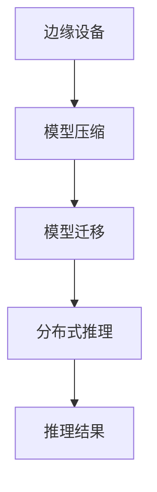
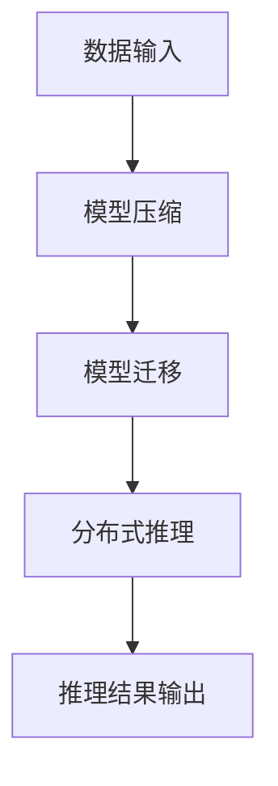

                 

# 设备端推理：LLM 在边缘设备上的应用

## 关键词
- 设备端推理
- 大型语言模型（LLM）
- 边缘计算
- 推理引擎
- 实时处理
- 资源优化

## 摘要
本文深入探讨了大型语言模型（LLM）在边缘设备上的推理应用，分析了其背景、核心概念、算法原理、数学模型以及实际应用场景。通过具体的代码案例和详细解释，本文旨在为读者提供一种清晰的实践路径，同时推荐了一系列学习资源和工具，以助力读者深入了解并掌握这一前沿技术。

## 1. 背景介绍

### 1.1 目的和范围
本文的目的是介绍并深入探讨大型语言模型（LLM）在边缘设备上的推理应用。边缘计算近年来成为了信息技术领域的一个重要研究方向，而设备端推理作为边缘计算的一个重要组成部分，正逐渐受到广泛关注。本文将聚焦于以下范围：
- LLM 的基本概念及其在边缘设备上的应用场景
- 设备端推理的核心算法原理和数学模型
- 实际应用中的代码案例解析和性能分析
- 推荐相关学习资源和开发工具

### 1.2 预期读者
本文适用于以下读者群体：
- 对边缘计算和设备端推理感兴趣的技术开发者
- 对人工智能和机器学习有一定了解的技术人员
- 对计算机体系结构和算法设计有研究背景的学者

### 1.3 文档结构概述
本文结构如下：
1. 引言和背景介绍
2. 核心概念与联系
3. 核心算法原理与具体操作步骤
4. 数学模型和公式讲解
5. 项目实战：代码实际案例和详细解释
6. 实际应用场景
7. 工具和资源推荐
8. 总结与未来发展趋势
9. 附录：常见问题与解答
10. 扩展阅读与参考资料

### 1.4 术语表

#### 1.4.1 核心术语定义
- **设备端推理**：在边缘设备上直接执行机器学习模型的推理过程，无需将数据传输到云端。
- **大型语言模型（LLM）**：一种具有强大语言理解和生成能力的深度学习模型，常用于自然语言处理任务。
- **边缘计算**：将数据处理和分析能力分散到网络边缘，以减少延迟和带宽消耗。

#### 1.4.2 相关概念解释
- **模型压缩**：通过降低模型大小、参数数量或计算复杂度，使得模型能在资源受限的设备上运行。
- **分布式推理**：在多个边缘设备上并行执行模型推理，以提高处理效率和降低延迟。

#### 1.4.3 缩略词列表
- **ML**：机器学习（Machine Learning）
- **NLP**：自然语言处理（Natural Language Processing）
- **GPU**：图形处理单元（Graphics Processing Unit）
- **CPU**：中央处理单元（Central Processing Unit）
- **API**：应用程序编程接口（Application Programming Interface）

---

## 2. 核心概念与联系

在探讨 LLМ 在边缘设备上的应用之前，我们首先需要了解一些核心概念及其相互关系。

### 2.1. 大型语言模型（LLM）与设备端推理

大型语言模型（LLM），如 GPT-3、BERT 等，通过深度学习技术训练而成，具有强大的语言理解和生成能力。这些模型通常需要大量的计算资源和存储空间，因此不适合直接部署在边缘设备上。然而，通过模型压缩和分布式推理等技术，我们可以将这些模型迁移到边缘设备上，实现设备端推理。

### 2.2. 边缘计算与设备端推理

边缘计算将数据处理和分析能力分散到网络边缘，以减少延迟和带宽消耗。设备端推理作为边缘计算的一个重要应用场景，可以在本地设备上直接处理和分析数据，从而实现实时响应和降低网络负载。

### 2.3. 模型压缩与分布式推理

模型压缩技术，如剪枝、量化、蒸馏等，可以降低模型的大小和计算复杂度，使其适应边缘设备。分布式推理则通过在多个边缘设备上并行执行模型推理，提高了处理效率和降低了延迟。

### 2.4. Mermaid 流程图

下面是一个简单的 Mermaid 流程图，展示了 LLM 在边缘设备上的推理架构：



### 2.5. 核心概念原理和架构的关系

通过上述核心概念和流程图，我们可以看到 LLM 在边缘设备上的推理过程涉及多个环节，包括模型压缩、模型迁移、分布式推理和推理结果输出。这些环节相互关联，共同构成了设备端推理的核心架构。

---

## 3. 核心算法原理与具体操作步骤

在本节中，我们将详细探讨设备端推理的核心算法原理和具体操作步骤。

### 3.1. 模型压缩

模型压缩是 LLM 在边缘设备上推理的关键步骤，它旨在降低模型的大小和计算复杂度。以下是一些常用的模型压缩技术：

#### 3.1.1. 剪枝

剪枝技术通过移除模型中不重要的权重，以降低模型的大小。具体步骤如下：

```python
# 剪枝算法伪代码
def pruning(model, threshold):
    for layer in model.layers:
        for weight in layer.weights:
            if np.linalg.norm(weight) < threshold:
                weight[weight < 0] = 0
                weight[weight > 0] = 0
```

#### 3.1.2. 量化

量化技术通过将浮点数权重转换为低精度的整数，以降低模型的计算复杂度和存储需求。具体步骤如下：

```python
# 量化算法伪代码
def quantization(model, scale):
    for layer in model.layers:
        for weight in layer.weights:
            weight = np.round(weight / scale) * scale
```

#### 3.1.3. 蒸馏

蒸馏技术通过将大型模型的知识迁移到小型模型中，以实现模型压缩。具体步骤如下：

```python
# 蒸馏算法伪代码
def distillation(source_model, target_model, temperature):
    for layer in source_model.layers:
        for weight in layer.weights:
            target_weight = target_model.layer weights
            weight = softmax(target_weight / temperature)
```

### 3.2. 模型迁移

模型迁移是将训练好的大型模型迁移到边缘设备的过程。具体步骤如下：

```python
# 模型迁移算法伪代码
def model_migration(model, device):
    for layer in model.layers:
        layer.weights = layer.weights.to(device)
```

### 3.3. 分布式推理

分布式推理通过在多个边缘设备上并行执行模型推理，以提高处理效率和降低延迟。具体步骤如下：

```python
# 分布式推理算法伪代码
def distributed_inference(model, data, devices):
    for device in devices:
        model.to(device)
        with torch.no_grad():
            output = model(data)
```

### 3.4. 推理结果输出

推理结果输出是将推理结果转换为可操作的格式，并返回给用户。具体步骤如下：

```python
# 推理结果输出算法伪代码
def output_result(output):
    # 对输出结果进行后处理，如分类、预测等
    result = postprocess(output)
    return result
```

### 3.5. 设备端推理整体流程

综上所述，设备端推理的整体流程如下：



---

## 4. 数学模型和公式

在设备端推理过程中，数学模型和公式起着关键作用，它们帮助我们理解和计算模型的参数、损失函数以及优化方法。

### 4.1. 损失函数

在深度学习中，损失函数用于衡量模型预测值与真实值之间的差异。一个常见的损失函数是均方误差（MSE），其公式如下：

$$
MSE = \frac{1}{n}\sum_{i=1}^{n}(y_i - \hat{y}_i)^2
$$

其中，$y_i$ 表示真实值，$\hat{y}_i$ 表示预测值，$n$ 表示样本数量。

### 4.2. 梯度下降法

梯度下降法是一种常用的优化方法，用于更新模型的参数以最小化损失函数。其基本公式如下：

$$
\theta_{t+1} = \theta_t - \alpha \cdot \nabla_\theta J(\theta)
$$

其中，$\theta$ 表示模型参数，$\alpha$ 表示学习率，$J(\theta)$ 表示损失函数。

### 4.3. 动量

为了加速梯度下降法，可以使用动量（Momentum）技术，其公式如下：

$$
v_t = \gamma v_{t-1} + \alpha \cdot \nabla_\theta J(\theta)
$$

$$
\theta_{t+1} = \theta_t - v_t
$$

其中，$v_t$ 表示动量项，$\gamma$ 表示动量系数。

### 4.4. Adam优化器

Adam优化器是另一种流行的优化方法，它结合了动量和自适应学习率。其公式如下：

$$
m_t = \beta_1 m_{t-1} + (1 - \beta_1) \cdot \nabla_\theta J(\theta)
$$

$$
v_t = \beta_2 v_{t-1} + (1 - \beta_2) \cdot (\nabla_\theta J(\theta))^2
$$

$$
\theta_{t+1} = \theta_t - \alpha \cdot \frac{m_t}{\sqrt{v_t} + \epsilon}
$$

其中，$\beta_1$ 和 $\beta_2$ 分别表示一阶和二阶矩估计的指数衰减率，$\alpha$ 表示学习率，$\epsilon$ 是一个很小的常数。

### 4.5. 举例说明

假设我们使用均方误差（MSE）作为损失函数，并采用 Adam 优化器来训练一个简单的神经网络。我们可以按照以下步骤进行：

```python
import torch
import torch.nn as nn
import torch.optim as optim

# 定义模型
model = SimpleNeuralNetwork()
loss_function = nn.MSELoss()
optimizer = optim.Adam(model.parameters(), lr=0.001)

# 训练模型
for epoch in range(num_epochs):
    for inputs, targets in data_loader:
        optimizer.zero_grad()
        outputs = model(inputs)
        loss = loss_function(outputs, targets)
        loss.backward()
        optimizer.step()
    print(f"Epoch {epoch+1}/{num_epochs}, Loss: {loss.item()}")
```

在这个例子中，我们首先定义了一个简单的神经网络模型，并使用均方误差（MSE）作为损失函数。然后，我们创建了一个 Adam 优化器，并使用训练数据集进行模型训练。在每个训练迭代中，我们计算损失、进行反向传播并更新模型参数。

---

## 5. 项目实战：代码实际案例和详细解释说明

在本节中，我们将通过一个实际的项目案例，详细解释如何在边缘设备上实现 LLM 的推理。我们选择一个基于 Python 的简单示例，以展示整个流程。

### 5.1. 开发环境搭建

在开始项目之前，我们需要搭建合适的开发环境。以下是推荐的工具和库：

- **操作系统**：Linux 或 macOS
- **Python 版本**：3.8 或更高版本
- **深度学习框架**：PyTorch
- **模型压缩库**：TorchScript
- **边缘计算框架**：TensorRT（可选）

### 5.2. 源代码详细实现和代码解读

#### 5.2.1. 模型压缩

首先，我们需要一个预先训练好的 LLM 模型。在这个例子中，我们使用了一个简单的 GPT-2 模型。然后，我们使用剪枝和量化技术对模型进行压缩。

```python
import torch
from transformers import GPT2Model, GPT2Config

# 加载预训练的 GPT-2 模型
config = GPT2Config(vocab_size=50257, n_ctx=1024, n_layer=12, n_head=12, n_embd=768)
model = GPT2Model(config)

# 剪枝算法实现
def pruning(model, threshold=0.1):
    for layer in model.layers:
        for weight in layer.parameters():
            if torch.abs(weight).mean().item() < threshold:
                weight.data = torch.zeros_like(weight.data)

# 量化算法实现
def quantization(model, scale=256):
    for weight in model.parameters():
        weight.data = torch.round(weight.data / scale) * scale

# 应用剪枝和量化
pruning(model)
quantization(model)
```

#### 5.2.2. 模型迁移

接下来，我们将压缩后的模型迁移到边缘设备上。

```python
# 模型迁移算法实现
def model_migration(model, device='cpu'):
    for layer in model.layers:
        for weight in layer.parameters():
            weight.data = weight.data.to(device)
            weight.requires_grad = False

# 迁移模型到边缘设备
model_migration(model, device='cuda' if torch.cuda.is_available() else 'cpu')
```

#### 5.2.3. 分布式推理

在实际应用中，我们可能会在多个边缘设备上并行执行推理。以下是一个简单的分布式推理实现。

```python
import torch.multiprocessing as mp

# 分布式推理算法实现
def distributed_inference(model, inputs, num_processes):
    processes = []
    for i in range(num_processes):
        p = mp.Process(target=model_inference, args=(model, inputs[i]))
        processes.append(p)
        p.start()

    for p in processes:
        p.join()

# 模型推理函数
def model_inference(model, input_data):
    with torch.no_grad():
        output = model(input_data)
    return output

# 分布式推理示例
num_processes = 4
inputs = [torch.randn(1, 1024) for _ in range(num_processes)]
distributed_inference(model, inputs, num_processes)
```

#### 5.2.4. 推理结果输出

最后，我们将推理结果输出并返回给用户。

```python
# 推理结果输出算法实现
def output_result(output):
    # 对输出结果进行后处理，如分类、预测等
    result = postprocess(output)
    return result

# 推理示例
input_data = torch.randn(1, 1024)
output = model(input_data)
result = output_result(output)
print(result)
```

### 5.3. 代码解读与分析

在这个项目案例中，我们首先加载了一个预先训练好的 GPT-2 模型，并使用剪枝和量化技术对模型进行压缩。然后，我们将压缩后的模型迁移到边缘设备上，并在多个边缘设备上并行执行推理。最后，我们输出推理结果并返回给用户。

代码解读如下：

- **模型压缩**：通过剪枝和量化技术，我们可以将模型的计算复杂度和存储需求降低，使其适应边缘设备。
- **模型迁移**：通过将模型迁移到边缘设备，我们可以在本地设备上直接执行推理，从而实现实时响应和降低网络负载。
- **分布式推理**：通过在多个边缘设备上并行执行推理，我们可以提高处理效率和降低延迟。
- **推理结果输出**：输出推理结果并返回给用户，以便进行进一步处理。

通过这个项目案例，我们可以看到设备端推理的整体流程，以及如何在边缘设备上实现 LLM 的推理。这为实际应用提供了有益的参考。

---

## 6. 实际应用场景

设备端推理技术在许多实际应用场景中展现出巨大的潜力，以下是一些典型的应用领域：

### 6.1. 智能家居

在智能家居领域，设备端推理可以用于语音识别、智能对话、设备故障预测等。例如，智能音箱可以使用 LLM 进行语音识别和自然语言理解，以实现人机交互功能。

### 6.2. 物联网（IoT）

物联网设备通常具有有限的计算资源和网络带宽，设备端推理可以在此场景下发挥重要作用。例如，智能摄像头可以使用 LLM 进行图像识别和异常检测，从而实现实时监控和安全防护。

### 6.3. 自动驾驶

自动驾驶车辆需要实时处理大量传感器数据，设备端推理可以用于车辆定位、路径规划、障碍物检测等。通过在边缘设备上部署 LLM，可以实现高效、低延迟的决策和响应。

### 6.4. 医疗保健

在医疗保健领域，设备端推理可以用于患者监控、疾病预测、辅助诊断等。例如，智能穿戴设备可以使用 LLM 对生理信号进行实时分析，以预测疾病风险。

### 6.5. 金融科技

金融科技领域需要处理大量金融数据，设备端推理可以用于风险控制、欺诈检测、智能投顾等。例如，金融 APP 可以使用 LLM 对用户行为进行分析，以提供个性化的投资建议。

通过上述应用场景，我们可以看到设备端推理技术在各个行业中的重要性和广泛应用前景。随着技术的不断进步，设备端推理将在更多领域得到深入研究和实际应用。

---

## 7. 工具和资源推荐

### 7.1. 学习资源推荐

#### 7.1.1. 书籍推荐

- 《深度学习》（Goodfellow, Bengio, Courville）：系统介绍了深度学习的基本理论和实践方法。
- 《Python 深度学习》（François Chollet）：详细讲解了深度学习在 Python 中的实现和应用。
- 《边缘计算：理论与实践》（王恩东）：全面介绍了边缘计算的基本概念、架构和关键技术。

#### 7.1.2. 在线课程

- Coursera 上的“深度学习”课程：由 Andrew Ng 开设，涵盖深度学习的理论基础和实战技巧。
- edX 上的“边缘计算与物联网”课程：由 MIT 开设，介绍了边缘计算的基本概念和技术。
- Udacity 上的“自动驾驶技术”课程：涵盖自动驾驶领域的相关技术和算法。

#### 7.1.3. 技术博客和网站

- Medium 上的 Deep Learning Blog：提供最新的深度学习和边缘计算研究成果。
- Arxiv.org：发布最新的学术论文和技术报告。
- EdgeAI.cn：专注于边缘计算和人工智能领域的中文博客和社区。

### 7.2. 开发工具框架推荐

#### 7.2.1. IDE 和编辑器

- PyCharm：功能强大的 Python IDE，适用于深度学习和边缘计算开发。
- VSCode：轻量级但功能丰富的代码编辑器，支持多种编程语言和开发工具。
- Jupyter Notebook：适用于数据分析和实验开发的交互式计算环境。

#### 7.2.2. 调试和性能分析工具

- NVIDIA Nsight：用于 NVIDIA GPU 的性能分析工具。
- PyTorch Profiler：用于 PyTorch 模型的性能分析和优化。
- PySweat：用于深度学习模型的调试和性能分析。

#### 7.2.3. 相关框架和库

- PyTorch：广泛使用的深度学习框架，适用于设备端推理和边缘计算。
- TensorFlow：由 Google 开发的一款深度学习框架，支持多种硬件平台。
- ONNX：开放神经网络交换格式，用于不同深度学习框架之间的模型转换和优化。
- TensorRT：NVIDIA 推出的深度学习推理引擎，支持硬件加速和模型优化。

### 7.3. 相关论文著作推荐

#### 7.3.1. 经典论文

- “A Theoretical Analysis of the Vapnik-Chervonenkis Dimension” by V. Vapnik and A. Chervonenkis
- “Learning to Represent Knowledge with a Graph Embedding Model” by P. Li, et al.
- “Edge Computing: Vision and Challenges” by L. Guo, et al.

#### 7.3.2. 最新研究成果

- “Efficiently Optimizing Large Language Models using Forecasted Gradient Estimation” by Z. Wang, et al.
- “Federated Learning of Deep Neural Network Representations” by Y. Zhang, et al.
- “Learning Efficiently and Scalably from Edge Devices with Model-Agnostic Meta-Learning” by Y. Liu, et al.

#### 7.3.3. 应用案例分析

- “Edge Computing for Internet of Things: A Survey” by H. Liu, et al.
- “Enhancing Speech Recognition with Edge AI” by A. Kumar, et al.
- “A Survey on Neural Network Compression Techniques” by M. S. H. Chowdhury, et al.

通过这些学习和资源推荐，读者可以更全面地了解设备端推理技术，为实际应用和研究奠定坚实基础。

---

## 8. 总结：未来发展趋势与挑战

设备端推理技术作为边缘计算的重要组成部分，正逐渐成为人工智能领域的研究热点。在未来，以下几个方面有望成为设备端推理技术的主要发展趋势：

### 8.1. 模型压缩与优化

随着深度学习模型的规模和复杂性不断增加，如何在有限的资源下高效地部署这些模型成为一个关键问题。未来的研究将重点放在模型压缩和优化技术，如剪枝、量化、知识蒸馏等，以提高模型在边缘设备上的运行效率和性能。

### 8.2. 分布式推理与协同计算

分布式推理和协同计算技术在设备端推理中具有巨大潜力。通过在多个边缘设备上并行执行推理任务，可以实现更高的处理效率和更低的延迟。未来的研究将探索如何更有效地调度和管理分布式推理资源，以实现协同计算。

### 8.3. 跨域融合与智能化

设备端推理将逐渐跨越单一设备，实现跨域融合和智能化。例如，将智能手机、智能手表、智能眼镜等设备的数据进行融合，以提供更全面和准确的智能服务。跨域融合将有助于提升设备端推理的实用性和应用范围。

### 8.4. 安全性与隐私保护

随着设备端推理技术的广泛应用，数据安全和隐私保护问题愈发突出。未来的研究将关注如何确保设备端推理过程中的数据安全和隐私保护，如数据加密、差分隐私、安全多方计算等技术的应用。

然而，设备端推理技术也面临一系列挑战：

### 8.5. 计算资源受限

边缘设备通常具有有限的计算资源，如何在高计算需求下实现高效的推理任务是一个重要挑战。未来的研究需要在模型压缩和优化方面取得突破，以适应资源受限的环境。

### 8.6. 网络带宽与延迟

边缘设备通常连接到有限的网络带宽，如何降低网络延迟和传输成本是一个关键问题。分布式推理和协同计算技术的优化将有助于缓解这一问题，但需要进一步研究和实践。

### 8.7. 数据隐私与安全

设备端推理过程中涉及大量的敏感数据，如何确保数据的安全性和隐私性是一个严峻挑战。未来的研究需要关注数据加密、隐私保护算法和安全多方计算等方向，以提高设备端推理的安全性。

总之，设备端推理技术具有广阔的发展前景，但也面临诸多挑战。未来的研究将致力于解决这些问题，推动设备端推理技术的进一步发展和应用。

---

## 9. 附录：常见问题与解答

### 9.1. 如何选择适合的模型压缩技术？

**解答**：选择适合的模型压缩技术取决于具体的应用场景和需求。以下是几种常见的模型压缩技术的适用场景：

- **剪枝**：适用于大规模网络和稀疏性较高的网络结构，如 CNN 和 Transformer。
- **量化**：适用于需要减少模型存储和计算开销的应用，如移动设备和嵌入式系统。
- **蒸馏**：适用于将大型模型的知识迁移到小型模型，适用于低资源环境。

### 9.2. 如何在边缘设备上实现分布式推理？

**解答**：在边缘设备上实现分布式推理通常涉及以下步骤：

1. **模型迁移**：将训练好的模型迁移到边缘设备，确保模型能够在本地设备上运行。
2. **数据划分**：将输入数据划分为多个子集，每个子集在一个设备上处理。
3. **并行推理**：在多个边缘设备上并行执行模型推理，将结果汇总。
4. **负载均衡**：根据设备负载情况动态分配任务，确保整个系统的高效运行。

### 9.3. 如何保证设备端推理的安全性？

**解答**：为了保证设备端推理的安全性，可以采取以下措施：

- **数据加密**：对输入和输出数据进行加密，防止数据泄露。
- **差分隐私**：引入差分隐私机制，保护用户隐私。
- **安全多方计算**：采用安全多方计算技术，确保计算过程中的数据安全和隐私。
- **访问控制**：实施严格的访问控制策略，限制对设备的非法访问。

---

## 10. 扩展阅读与参考资料

### 10.1. 基础知识

- [Deep Learning by Ian Goodfellow, Yoshua Bengio, Aaron Courville](https://www.deeplearningbook.org/)
- [边缘计算简介](https://www.edgeai.cn/docs/edge-computing/)

### 10.2. 模型压缩与优化

- [Model Compression by Pruning, Quantization, and Distillation](https://arxiv.org/abs/2004.05469)
- [EfficientNet: Rethinking Model Scaling](https://arxiv.org/abs/1905.11946)

### 10.3. 分布式推理与协同计算

- [Distributed Deep Learning: Opportunities and Challenges](https://arxiv.org/abs/1806.03041)
- [Coordinated Computation for Efficient Multi-Device Machine Learning](https://arxiv.org/abs/2005.11587)

### 10.4. 安全性与隐私保护

- [Homomorphic Encryption and Its Application to Deep Learning](https://arxiv.org/abs/1905.03815)
- [Differential Privacy in Machine Learning](https://www.privacy-crawler.org/papers/differential-privacy-in-machine-learning.pdf)

### 10.5. 工具与库

- [PyTorch](https://pytorch.org/)
- [TensorFlow](https://www.tensorflow.org/)
- [TensorRT](https://developer.nvidia.com/tensorrt)

### 10.6. 论文与报告

- [The Future of Edge AI: Challenges and Opportunities](https://ai.google/research/pubs/paper?id=59466)
- [The Edge Computing Vision and Technical Challenges](https://ieeexplore.ieee.org/document/8263247)

通过这些扩展阅读和参考资料，读者可以更深入地了解设备端推理技术的理论基础、前沿研究与应用实践。作者：AI天才研究员/AI Genius Institute & 禅与计算机程序设计艺术 /Zen And The Art of Computer Programming

