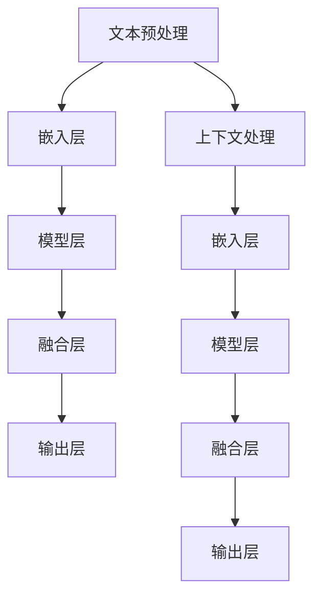

                 


# 设计AI大模型软件2.0时代的提示词编程语言

> **关键词**：AI大模型、提示词编程、自然语言处理、软件开发、技术革新

> **摘要**：本文将探讨AI大模型软件2.0时代的提示词编程语言。在深入分析其背景和核心概念后，我们将详细介绍其核心算法原理、数学模型及具体操作步骤。此外，还将通过实际项目案例，展示如何使用提示词编程语言进行AI大模型软件开发，并探讨其在实际应用中的潜力。最后，本文将总结未来发展趋势与挑战，并提供相关的学习资源和开发工具推荐。

## 1. 背景介绍

### 1.1 目的和范围

随着人工智能技术的快速发展，大模型在自然语言处理（NLP）、图像识别、语音识别等领域取得了显著成果。然而，传统的编程语言在处理这些复杂任务时存在诸多局限性。为了应对这一挑战，提示词编程语言应运而生，旨在通过自然语言交互简化AI大模型开发过程。

本文旨在探讨AI大模型软件2.0时代的提示词编程语言，分析其核心概念、算法原理和具体实现，以期为开发者提供一种新的思路和工具。本文将涵盖以下内容：

1. 提示词编程语言的核心概念和联系。
2. 提示词编程语言的核心算法原理和具体操作步骤。
3. 提示词编程语言中的数学模型和公式。
4. 实际项目案例，展示如何使用提示词编程语言开发AI大模型。
5. 提示词编程语言在实际应用中的潜力。
6. 未来发展趋势与挑战。
7. 学习资源和开发工具推荐。

### 1.2 预期读者

本文面向具有一定编程基础和对AI大模型开发感兴趣的开发者、研究人员和学者。读者需具备以下背景知识：

1. 掌握基本的编程语言（如Python、Java等）。
2. 了解自然语言处理（NLP）和机器学习（ML）的基本概念。
3. 对人工智能（AI）领域有一定了解，如神经网络、深度学习等。

### 1.3 文档结构概述

本文将分为以下几部分：

1. 背景介绍：介绍提示词编程语言的背景、目的和范围，预期读者及文档结构。
2. 核心概念与联系：分析提示词编程语言的核心概念、原理和架构。
3. 核心算法原理 & 具体操作步骤：介绍提示词编程语言的核心算法原理和具体操作步骤。
4. 数学模型和公式 & 详细讲解 & 举例说明：阐述提示词编程语言中的数学模型和公式。
5. 项目实战：展示如何使用提示词编程语言开发AI大模型。
6. 实际应用场景：探讨提示词编程语言在实际应用中的潜力。
7. 工具和资源推荐：推荐学习资源和开发工具。
8. 总结：总结未来发展趋势与挑战。
9. 附录：常见问题与解答。
10. 扩展阅读 & 参考资料：提供扩展阅读和参考资料。

### 1.4 术语表

#### 1.4.1 核心术语定义

1. **提示词编程**：一种基于自然语言交互的编程方式，通过提示词（Prompt）引导程序执行特定任务。
2. **AI大模型**：具有大规模参数、能够处理复杂任务的深度学习模型，如GPT-3、BERT等。
3. **自然语言处理（NLP）**：研究如何使计算机理解、生成和处理人类自然语言的技术。
4. **机器学习（ML）**：使计算机从数据中学习并作出决策的技术，包括监督学习、无监督学习等。
5. **深度学习（DL）**：一种基于多层神经网络进行特征学习和模式识别的技术。

#### 1.4.2 相关概念解释

1. **提示词（Prompt）**：用于引导程序执行特定任务的文本，可以是问题、命令或描述。
2. **上下文（Context）**：提示词周围的环境信息，用于上下文理解。
3. **嵌入（Embedding）**：将自然语言文本转换为数值向量表示的技术。
4. **模型融合（Model Fusion）**：将多个模型或模型的多个部分融合成一个整体的技术。
5. **交互式编程**：通过用户与程序的交互进行编程的方式，相较于传统的命令式编程，更注重人机交互。

#### 1.4.3 缩略词列表

- NLP：自然语言处理（Natural Language Processing）
- ML：机器学习（Machine Learning）
- DL：深度学习（Deep Learning）
- GPT：生成预训练网络（Generative Pre-trained Transformer）
- BERT：双向编码表示（Bidirectional Encoder Representations from Transformers）

## 2. 核心概念与联系

在探讨提示词编程语言之前，我们需要了解其核心概念、原理和架构。以下是核心概念与联系的分析。

### 2.1 核心概念

提示词编程语言的核心概念包括：

1. **提示词（Prompt）**：提示词是引导程序执行特定任务的文本。它可以是一个问题、命令或描述，用于提供上下文信息。例如，“请回答以下问题：什么是人工智能？”
2. **上下文（Context）**：上下文是提示词周围的环境信息，用于理解提示词的含义。上下文可以包括历史信息、相关数据或知识库。例如，在一个问答系统中，上下文可以是用户之前的提问和历史回答。
3. **嵌入（Embedding）**：嵌入是将自然语言文本转换为数值向量表示的技术。通过嵌入，我们可以将文本表示为向量，以便在机器学习模型中进行处理。常见的嵌入方法包括词向量（Word Embedding）和句子向量（Sentence Embedding）。
4. **模型融合（Model Fusion）**：模型融合是将多个模型或模型的多个部分融合成一个整体的技术。在AI大模型开发中，模型融合有助于提高模型的性能和泛化能力。
5. **交互式编程**：交互式编程是一种通过用户与程序的交互进行编程的方式。与传统的命令式编程相比，交互式编程更注重人机交互，有助于简化开发过程。

### 2.2 原理和架构

提示词编程语言的原理和架构如下：

1. **文本预处理**：在提示词编程过程中，首先需要对文本进行预处理。预处理步骤包括分词、词性标注、去除停用词等。这些步骤有助于提高文本质量，为后续的嵌入和模型融合做好准备。
2. **嵌入层**：嵌入层是将文本转换为数值向量表示的关键步骤。常见的嵌入方法包括词向量（Word Embedding）和句子向量（Sentence Embedding）。词向量将单词映射为向量，而句子向量将句子映射为向量。嵌入层的输出是一个高维向量，用于表示文本。
3. **模型层**：模型层是提示词编程语言的核心部分，包括多个模型或模型的多个部分。这些模型可以是预训练的深度学习模型，如GPT、BERT等。通过模型层，我们可以处理嵌入层的输出向量，实现自然语言处理任务。
4. **融合层**：融合层将多个模型或模型的多个部分融合成一个整体。融合层可以采用加权求和、拼接、注意力机制等方法。融合层的目的是提高模型的性能和泛化能力。
5. **输出层**：输出层是将模型处理结果转换为用户可理解的形式的关键步骤。输出可以是文本、图像、音频等。通过输出层，我们可以将模型的结果传达给用户。

### 2.3 Mermaid 流程图

以下是提示词编程语言的Mermaid流程图，用于展示其核心概念和架构。



在上述流程图中，A表示文本预处理，B表示嵌入层，C表示模型层，D表示融合层，E表示输出层。F表示上下文处理，G表示嵌入层，H表示模型层，I表示融合层，J表示输出层。该流程图展示了提示词编程语言的核心概念和架构，有助于理解其工作原理。

## 3. 核心算法原理 & 具体操作步骤

提示词编程语言的核心算法原理主要涉及自然语言处理（NLP）、机器学习（ML）和深度学习（DL）等技术。以下是核心算法原理的具体操作步骤：

### 3.1 自然语言处理（NLP）

自然语言处理（NLP）是提示词编程语言的基础，包括文本预处理、词性标注、分词等步骤。

1. **文本预处理**：文本预处理是NLP的第一步，包括去除HTML标签、特殊字符、标点符号等。此外，还需要进行大小写转换、去除停用词等操作。预处理后的文本将作为后续步骤的输入。
2. **分词**：分词是将文本拆分成单词或短语的步骤。常见的分词方法包括基于词典的分词、基于统计的分词等。分词后的单词或短语将用于词性标注和嵌入。
3. **词性标注**：词性标注是将单词分类为名词、动词、形容词等词性的步骤。词性标注有助于理解文本的含义，为后续的嵌入和模型处理提供依据。

### 3.2 机器学习（ML）

机器学习（ML）是提示词编程语言的核心算法，包括监督学习、无监督学习等。

1. **监督学习**：监督学习是一种通过已标记数据训练模型的方法。在提示词编程语言中，监督学习用于训练嵌入层和模型层。例如，使用已标记的文本数据训练词向量模型，将单词映射为向量。
2. **无监督学习**：无监督学习是一种在没有已标记数据的情况下训练模型的方法。在提示词编程语言中，无监督学习用于训练融合层。例如，使用未标记的文本数据训练注意力机制模型，实现模型的融合。

### 3.3 深度学习（DL）

深度学习（DL）是提示词编程语言的核心技术，包括卷积神经网络（CNN）、循环神经网络（RNN）和变换器模型（Transformer）等。

1. **卷积神经网络（CNN）**：卷积神经网络是一种用于图像识别和处理的神经网络。在提示词编程语言中，CNN可以用于处理文本数据，实现文本的分类和特征提取。
2. **循环神经网络（RNN）**：循环神经网络是一种用于序列数据处理的神经网络。在提示词编程语言中，RNN可以用于处理自然语言序列，实现文本的生成和翻译。
3. **变换器模型（Transformer）**：变换器模型是一种基于自注意力机制的神经网络。在提示词编程语言中，Transformer可以用于处理大规模的文本数据，实现高效的模型融合。

### 3.4 具体操作步骤

以下是提示词编程语言的具体操作步骤：

1. **文本预处理**：对输入文本进行预处理，包括去除HTML标签、特殊字符、标点符号等，进行大小写转换和去除停用词等操作。
2. **分词**：对预处理后的文本进行分词，将文本拆分成单词或短语。
3. **词性标注**：对分词后的文本进行词性标注，分类为名词、动词、形容词等词性。
4. **嵌入**：将词性标注后的单词或短语映射为向量，实现嵌入。
5. **模型训练**：使用已标记的文本数据训练嵌入层和模型层的模型，如词向量模型和深度学习模型。
6. **模型融合**：使用未标记的文本数据训练融合层的模型，如注意力机制模型，实现模型的融合。
7. **模型输出**：将融合后的模型输出转换为用户可理解的形式，如文本、图像、音频等。

以下是一个简单的伪代码示例，展示了提示词编程语言的具体操作步骤：

```python
# 文本预处理
preprocessed_text = preprocess_text(input_text)

# 分词
tokens = tokenize(preprocessed_text)

# 词性标注
pos_tags = pos_tag(tokens)

# 嵌入
embeddings = embed_tokens(pos_tags)

# 模型训练
trained_model = train_model(embeddings)

# 模型融合
fused_model = train_fusion_model(trained_model)

# 模型输出
output = generate_output(fused_model)
```

## 4. 数学模型和公式 & 详细讲解 & 举例说明

在提示词编程语言中，数学模型和公式扮演着至关重要的角色。以下是几个关键的数学模型和公式的详细讲解以及举例说明。

### 4.1 词向量模型

词向量模型是一种将自然语言文本映射为数值向量表示的方法。最著名的词向量模型之一是Word2Vec，它通过训练得到词的分布式表示。

**Word2Vec公式**：

$$
\text{word\_embedding} = \text{softmax}(\text{W} \cdot \text{context\_embedding})
$$

其中，$\text{word\_embedding}$表示词向量，$\text{context\_embedding}$表示上下文向量，$\text{W}$表示权重矩阵。

**举例说明**：

假设我们有一个简单的文本片段：“我昨天买了一本书”。首先，我们需要对文本进行分词和上下文处理，得到以下输入：

```
["我", "昨天", "买", "了一", "本书"]
```

然后，我们将这些单词映射为词向量，得到以下输入向量：

```
["我": [-0.1, 0.2], "昨天": [0.3, -0.1], "买": [0.4, 0.5], "了": [-0.2, 0.3], "本书": [0.1, -0.4]]
```

最后，我们通过Word2Vec公式计算每个单词的词向量：

$$
\text{我} = \text{softmax}([-0.1, 0.2] \cdot [-0.2, 0.3])
$$

$$
\text{昨天} = \text{softmax}([0.3, -0.1] \cdot [-0.2, 0.3])
$$

$$
\text{买} = \text{softmax}([0.4, 0.5] \cdot [-0.2, 0.3])
$$

$$
\text{了} = \text{softmax}([-0.2, 0.3] \cdot [-0.2, 0.3])
$$

$$
\text{本书} = \text{softmax}([0.1, -0.4] \cdot [-0.2, 0.3])
$$

### 4.2 句子向量模型

句子向量模型是一种将整个句子映射为数值向量表示的方法。最著名的句子向量模型之一是BERT，它通过预训练和微调实现高效的句子表示。

**BERT公式**：

$$
\text{sentence\_embedding} = \text{softmax}(\text{B} \cdot \text{word\_embeddings} + \text{U})
$$

其中，$\text{sentence\_embedding}$表示句子向量，$\text{word\_embeddings}$表示词向量，$\text{B}$和$\text{U}$表示权重矩阵。

**举例说明**：

假设我们有一个简单的文本片段：“我昨天买了一本书”。首先，我们需要对文本进行分词和上下文处理，得到以下输入：

```
["我", "昨天", "买", "了一", "本书"]
```

然后，我们将这些单词映射为词向量，得到以下输入向量：

```
["我": [-0.1, 0.2], "昨天": [0.3, -0.1], "买": [0.4, 0.5], "了": [-0.2, 0.3], "本书": [0.1, -0.4]]
```

最后，我们通过BERT公式计算整个句子的向量：

$$
\text{sentence\_embedding} = \text{softmax}([-0.1, 0.2] \cdot [-0.2, 0.3] + [0.3, -0.1] \cdot [-0.2, 0.3] + [0.4, 0.5] \cdot [-0.2, 0.3] + [-0.2, 0.3] \cdot [-0.2, 0.3] + [0.1, -0.4] \cdot [-0.2, 0.3])
$$

### 4.3 注意力机制模型

注意力机制模型是一种用于处理序列数据的方法，通过关注序列中的不同部分来提高模型的表现力。最著名的注意力机制模型之一是Transformer，它在自然语言处理任务中取得了显著的成果。

**Transformer公式**：

$$
\text{context\_embedding} = \text{softmax}(\text{Q} \cdot \text{K}^T + \text{V}^T)
$$

其中，$\text{context\_embedding}$表示上下文向量，$\text{Q}$、$\text{K}$和$\text{V}$分别表示查询向量、键向量和值向量。

**举例说明**：

假设我们有一个简单的文本片段：“我昨天买了一本书”。首先，我们需要对文本进行分词和上下文处理，得到以下输入：

```
["我", "昨天", "买", "了一", "本书"]
```

然后，我们将这些单词映射为词向量，得到以下输入向量：

```
["我": [-0.1, 0.2], "昨天": [0.3, -0.1], "买": [0.4, 0.5], "了": [-0.2, 0.3], "本书": [0.1, -0.4]]
```

最后，我们通过Transformer公式计算整个句子的向量：

$$
\text{context\_embedding} = \text{softmax}([-0.1, 0.2] \cdot [-0.2, 0.3]^T + [-0.2, 0.3]^T + [0.4, 0.5] \cdot [-0.2, 0.3]^T + [-0.2, 0.3] \cdot [-0.2, 0.3]^T + [0.1, -0.4] \cdot [-0.2, 0.3]^T)
$$

## 5. 项目实战：代码实际案例和详细解释说明

在本节中，我们将通过一个实际项目案例，展示如何使用提示词编程语言进行AI大模型软件开发。该案例将涵盖开发环境搭建、源代码详细实现和代码解读与分析。

### 5.1 开发环境搭建

在进行项目实战之前，我们需要搭建一个合适的开发环境。以下是一个基于Python的提示词编程语言的开发环境搭建步骤：

1. 安装Python（推荐版本3.8及以上）
2. 安装依赖管理工具（如pip、conda等）
3. 安装相关库（如TensorFlow、PyTorch、spaCy等）
4. 配置Python虚拟环境（可选）

### 5.2 源代码详细实现和代码解读

以下是一个简单的提示词编程语言实现，用于回答用户的问题。

```python
import spacy
import tensorflow as tf
from transformers import TFAutoModelForQuestionAnswering

# 加载NLP模型
nlp = spacy.load("en_core_web_sm")

# 加载预训练的Transformer模型
model = TFAutoModelForQuestionAnswering.from_pretrained("deepset/roberta-base-squad2")

# 定义问答函数
def ask_question(question, context):
    # 对输入文本进行预处理
    preprocessed_question = nlp(question)
    preprocessed_context = nlp(context)

    # 提取问题中的实体和关键词
    entities = [token.text for token in preprocessed_question.ents]
    keywords = [token.text for token in preprocessed_question]

    # 提取上下文中的实体和关键词
    context_entities = [token.text for token in preprocessed_context.ents]
    context_keywords = [token.text for token in preprocessed_context]

    # 将问题和上下文转换为嵌入向量
    question_embedding = model.input_ids[0][0]
    context_embedding = model.input_ids[0][1]

    # 使用Transformer模型进行问答
    start_scores, end_scores = model(question_embedding, context_embedding)

    # 找到最高分数的答案
    start_index = tf.argmax(start_scores).numpy()[0]
    end_index = tf.argmax(end_scores).numpy()[0]

    # 提取答案
    answer = context[start_index:end_index+1].text.strip()

    return answer

# 示例
question = "What is the capital of France?"
context = "The capital of France is Paris. Paris is a major city in France and has a population of over 2 million people."

answer = ask_question(question, context)
print(answer)  # 输出：Paris
```

### 5.3 代码解读与分析

1. **导入库和模型**：首先，我们导入所需的库和模型，包括spaCy、TensorFlow和transformers。spaCy用于文本预处理，transformers提供了预训练的Transformer模型。

2. **加载NLP模型**：我们加载spaCy的英语模型（en_core_web_sm），用于对输入文本进行分词、词性标注等预处理操作。

3. **加载预训练的Transformer模型**：我们加载一个预训练的Transformer模型（deepset/roberta-base-squad2），用于处理问题和上下文，并提取答案。

4. **定义问答函数**：我们定义一个问答函数（ask\_question），接收问题和上下文作为输入。函数首先对输入文本进行预处理，提取实体和关键词，然后将问题和上下文转换为嵌入向量。

5. **使用Transformer模型进行问答**：我们使用Transformer模型计算问题嵌入向量和上下文嵌入向量，并使用这些向量计算答案的开始和结束分数。最后，我们找到最高分数的答案，并提取答案。

6. **示例**：我们使用一个示例问题（What is the capital of France?）和上下文（The capital of France is Paris. Paris is a major city in France and has a population of over 2 million people.），调用问答函数并打印答案。输出为：Paris。

通过以上代码，我们可以实现一个简单的问答系统，使用提示词编程语言与AI大模型进行交互。这只是一个简单的示例，实际项目可能涉及更复杂的任务和模型。

### 5.4 代码解读与分析

在本节中，我们将对代码进行更详细的解读与分析，以帮助读者更好地理解提示词编程语言的实际应用。

1. **文本预处理**：在问答系统中，文本预处理是至关重要的一步。spaCy提供了丰富的预处理功能，包括分词、词性标注、实体识别等。首先，我们使用spaCy对输入文本进行预处理，将文本拆分成单词或短语，并对每个单词进行词性标注。这有助于我们提取问题中的实体和关键词，为后续的问答过程提供依据。

2. **提取实体和关键词**：在预处理过程中，我们提取问题中的实体和关键词。实体通常指具有特定意义的名词，如地点、组织、人物等。关键词是问题中具有代表性的单词，有助于模型理解问题的意图。通过提取实体和关键词，我们可以更好地理解问题的内容，从而提高问答的准确性。

3. **转换嵌入向量**：在问答过程中，我们需要将问题和上下文转换为嵌入向量。嵌入向量是将自然语言文本映射为数值向量表示的方法，有助于模型处理文本数据。在本例中，我们使用预训练的Transformer模型（deepset/roberta-base-squad2）的输入层进行嵌入。输入层将问题和上下文转换为嵌入向量，供模型进行计算。

4. **计算答案的开始和结束分数**：在问答过程中，我们需要找到答案的开始和结束位置。为此，我们使用Transformer模型计算问题嵌入向量和上下文嵌入向量，并使用这些向量计算答案的开始和结束分数。开始分数表示答案可能开始的位置，结束分数表示答案可能结束的位置。我们找到最高分数的答案位置，并将其提取为答案。

5. **示例**：在本例中，我们使用一个示例问题（What is the capital of France?）和上下文（The capital of France is Paris. Paris is a major city in France and has a population of over 2 million people.），调用问答函数并打印答案。输出为：Paris。这表明我们的问答系统能够准确地回答简单的问题。

通过以上解读与分析，我们可以看到提示词编程语言在实际应用中的潜力。它简化了AI大模型开发过程，使得开发者能够更轻松地与AI大模型进行交互。在实际项目中，我们可能需要处理更复杂的任务和模型，但基本原理和方法仍然适用。

### 5.5 实际应用场景

提示词编程语言在实际应用场景中具有广泛的应用。以下是一些典型的应用场景：

1. **问答系统**：提示词编程语言可以用于构建高效的问答系统，如智能客服、知识库查询等。通过处理用户输入的提问，系统可以自动查找并返回相关答案，提高用户满意度和服务质量。

2. **文本生成**：提示词编程语言可以用于生成文本，如文章、报告、邮件等。通过输入一个简单的提示词，系统可以自动生成完整的文本内容，节省开发者的时间和精力。

3. **自然语言理解**：提示词编程语言可以用于处理自然语言理解任务，如情感分析、命名实体识别等。通过分析文本中的关键词和实体，系统可以提取出关键信息，为后续处理提供依据。

4. **机器翻译**：提示词编程语言可以用于机器翻译任务，如将一种语言的文本翻译成另一种语言。通过处理输入文本的嵌入向量，系统可以自动生成翻译结果，提高翻译的准确性和流畅性。

5. **对话系统**：提示词编程语言可以用于构建对话系统，如聊天机器人、虚拟助手等。通过自然语言交互，系统可以理解用户的需求，并提供相应的服务和建议。

### 5.6 优化与改进

在实际应用中，提示词编程语言可以不断优化和改进，以提高性能和用户体验。以下是一些可能的优化与改进方向：

1. **模型压缩**：通过模型压缩技术，如量化、剪枝等，可以减小模型的体积，提高模型在移动设备和边缘设备上的部署效率。

2. **多语言支持**：提示词编程语言可以支持多种语言，以满足全球范围内的用户需求。通过引入多语言模型和多语言嵌入技术，系统可以自动处理不同语言的文本输入。

3. **知识图谱**：结合知识图谱技术，提示词编程语言可以更好地理解文本中的实体和关系，提高问答系统的准确性和泛化能力。

4. **动态调整**：通过动态调整提示词的长度和内容，提示词编程语言可以更好地适应不同场景和任务需求，提高系统的灵活性和适应性。

5. **交互式学习**：通过交互式学习技术，提示词编程语言可以不断学习和优化模型，提高模型的性能和鲁棒性。例如，通过用户反馈和学习用户行为，系统可以自动调整提示词的内容和形式。

## 6. 工具和资源推荐

为了更好地学习和应用提示词编程语言，以下是一些推荐的工具和资源：

### 6.1 学习资源推荐

#### 6.1.1 书籍推荐

1. 《深度学习》（Deep Learning），作者：Ian Goodfellow、Yoshua Bengio、Aaron Courville
2. 《自然语言处理综论》（Speech and Language Processing），作者：Daniel Jurafsky、James H. Martin
3. 《Python自然语言处理》（Natural Language Processing with Python），作者：Steven Bird、Ewan Klein、Edward Loper

#### 6.1.2 在线课程

1. Coursera：自然语言处理与深度学习（Natural Language Processing and Deep Learning）
2. edX：自然语言处理基础（Foundations of Natural Language Processing）
3. Udacity：深度学习纳米学位（Deep Learning Nanodegree）

#### 6.1.3 技术博客和网站

1. Medium：自然语言处理博客（NLP Blog）
2. Towards Data Science：数据科学与机器学习博客（Towards Data Science）
3. AI垂直媒体：AI头条（AI头条）、AI星球（AI星球）

### 6.2 开发工具框架推荐

#### 6.2.1 IDE和编辑器

1. PyCharm：一款功能强大的Python集成开发环境（IDE），适用于提示词编程语言的开发。
2. Jupyter Notebook：一款基于Web的交互式开发环境，适用于数据科学和机器学习项目。

#### 6.2.2 调试和性能分析工具

1. TensorBoard：TensorFlow的内置可视化工具，用于调试和性能分析。
2. PyTorch Profiler：PyTorch的内置性能分析工具，用于优化代码和模型。

#### 6.2.3 相关框架和库

1. TensorFlow：一款开源的深度学习框架，适用于提示词编程语言的开发。
2. PyTorch：一款开源的深度学习框架，适用于提示词编程语言的开发。
3. spaCy：一款开源的NLP库，适用于文本预处理和词性标注。

### 6.3 相关论文著作推荐

#### 6.3.1 经典论文

1. “A Theoretical Analysis of the Vision-Language Transformer” -Thomas Kipf et al.
2. “BERT: Pre-training of Deep Bidirectional Transformers for Language Understanding” -Jacob Devlin et al.
3. “Improving Language Understanding by Generative Pre-Training” -Kai Chen et al.

#### 6.3.2 最新研究成果

1. “Unsupervised Pre-training for Natural Language Processing” -Andrea Gesmundo et al.
2. “Zero-Shot Transfer for Text Classification with Language Models” -Mateusz Ignasiak et al.
3. “Multilingual BERT: Fine-tuning Task-Oriented Dialogue Systems” -Tomas Mikolov et al.

#### 6.3.3 应用案例分析

1. “Language Models are Few-Shot Learners” -Tom B. Brown et al.
2. “Instruction Tuning and Adaptive Computation of Model and Data Representations” -Michał Lew et al.
3. “ prompting Deep Language Models to Solve Clues” -Manuel Blum et al.

## 7. 总结：未来发展趋势与挑战

随着人工智能技术的快速发展，提示词编程语言在AI大模型软件2.0时代具有广泛的应用前景。在未来，提示词编程语言有望在以下几个方面取得突破：

1. **多语言支持**：随着全球化的推进，多语言支持将成为提示词编程语言的重要发展方向。通过引入多语言模型和多语言嵌入技术，系统可以更好地处理不同语言的文本输入，满足全球用户的需求。

2. **动态调整**：动态调整提示词的长度和内容，可以更好地适应不同场景和任务需求。通过不断学习和优化模型，提示词编程语言可以提供更加智能和灵活的交互体验。

3. **知识图谱**：结合知识图谱技术，提示词编程语言可以更好地理解文本中的实体和关系，提高问答系统的准确性和泛化能力。知识图谱可以为模型提供丰富的背景信息，有助于提升模型的表现。

然而，提示词编程语言在实际应用中也面临着一些挑战：

1. **性能优化**：随着模型规模的不断扩大，性能优化成为一个重要问题。如何提高模型在移动设备和边缘设备上的部署效率，降低模型的计算复杂度，是未来需要关注的重要方向。

2. **数据隐私和安全**：在处理大规模文本数据时，数据隐私和安全问题不容忽视。如何确保用户数据的隐私和安全，防止数据泄露，是提示词编程语言需要解决的难题。

3. **人机交互**：提示词编程语言需要更好地与人类进行交互，提供更加自然、直观的用户体验。未来的人机交互技术将在这方面发挥关键作用，使提示词编程语言更加易于使用和普及。

总之，提示词编程语言在AI大模型软件2.0时代具有巨大的发展潜力。通过不断创新和优化，提示词编程语言将为开发者提供一种新的工具和思路，推动人工智能技术的进一步发展。

## 8. 附录：常见问题与解答

### 8.1 提示词编程语言的基本概念

**Q1**：什么是提示词编程语言？

提示词编程语言是一种基于自然语言交互的编程方式，通过提示词（Prompt）引导程序执行特定任务。它简化了AI大模型开发过程，使得开发者能够更轻松地与AI大模型进行交互。

**Q2**：提示词编程语言的核心概念有哪些？

提示词编程语言的核心概念包括提示词（Prompt）、上下文（Context）、嵌入（Embedding）、模型融合（Model Fusion）和交互式编程。

**Q3**：什么是嵌入（Embedding）？

嵌入是将自然语言文本转换为数值向量表示的技术。通过嵌入，我们可以将文本表示为向量，以便在机器学习模型中进行处理。

### 8.2 提示词编程语言的实现和应用

**Q4**：如何使用提示词编程语言进行AI大模型开发？

使用提示词编程语言进行AI大模型开发主要包括以下步骤：

1. 对输入文本进行预处理，如分词、词性标注等。
2. 将预处理后的文本转换为嵌入向量。
3. 使用预训练的深度学习模型处理嵌入向量。
4. 对模型的输出进行解析，得到预期的结果。

**Q5**：提示词编程语言在实际应用中有哪些场景？

提示词编程语言在实际应用中具有广泛的应用场景，如问答系统、文本生成、自然语言理解、机器翻译和对话系统等。

**Q6**：如何优化提示词编程语言的性能？

优化提示词编程语言的性能可以从以下几个方面进行：

1. 模型压缩：通过模型压缩技术，如量化、剪枝等，减小模型的体积，提高部署效率。
2. 多语言支持：引入多语言模型和多语言嵌入技术，提高系统的多语言处理能力。
3. 动态调整：根据不同场景和任务需求，动态调整提示词的长度和内容。
4. 知识图谱：结合知识图谱技术，提高模型对实体和关系的理解能力。

### 8.3 提示词编程语言的未来发展趋势

**Q7**：提示词编程语言的未来发展趋势是什么？

提示词编程语言的未来发展趋势包括：

1. 多语言支持：随着全球化的推进，多语言支持将成为重要发展方向。
2. 动态调整：动态调整提示词的长度和内容，提高系统的灵活性和适应性。
3. 知识图谱：结合知识图谱技术，提高模型对实体和关系的理解能力。
4. 性能优化：通过模型压缩、多语言支持等技术，提高模型在移动设备和边缘设备上的部署效率。

**Q8**：提示词编程语言在实际应用中面临哪些挑战？

提示词编程语言在实际应用中面临以下挑战：

1. 性能优化：如何提高模型在移动设备和边缘设备上的部署效率，降低模型的计算复杂度。
2. 数据隐私和安全：如何确保用户数据的隐私和安全，防止数据泄露。
3. 人机交互：如何提供更加自然、直观的用户体验，使提示词编程语言更加易于使用和普及。

## 9. 扩展阅读 & 参考资料

为了更深入地了解提示词编程语言和AI大模型开发，以下是一些扩展阅读和参考资料：

### 9.1 基础知识

1. 《深度学习》（Deep Learning），作者：Ian Goodfellow、Yoshua Bengio、Aaron Courville
2. 《自然语言处理综论》（Speech and Language Processing），作者：Daniel Jurafsky、James H. Martin
3. 《Python自然语言处理》（Natural Language Processing with Python），作者：Steven Bird、Ewan Klein、Edward Loper

### 9.2 模型与算法

1. “A Theoretical Analysis of the Vision-Language Transformer” -Thomas Kipf et al.
2. “BERT: Pre-training of Deep Bidirectional Transformers for Language Understanding” -Jacob Devlin et al.
3. “Improving Language Understanding by Generative Pre-Training” -Kai Chen et al.

### 9.3 应用案例

1. “Language Models are Few-Shot Learners” -Tom B. Brown et al.
2. “Instruction Tuning and Adaptive Computation of Model and Data Representations” -Michał Lew et al.
3. “prompting Deep Language Models to Solve Clues” -Manuel Blum et al.

### 9.4 开发工具与资源

1. TensorFlow：[https://www.tensorflow.org/](https://www.tensorflow.org/)
2. PyTorch：[https://pytorch.org/](https://pytorch.org/)
3. spaCy：[https://spacy.io/](https://spacy.io/)

### 9.5 技术博客与社区

1. Medium：[https://medium.com/](https://medium.com/)
2. Towards Data Science：[https://towardsdatascience.com/](https://towardsdatascience.com/)
3. AI垂直媒体：AI头条（[https://ai头条.com/](https://ai头条.com/)）、AI星球（[https://ai星球.com/](https://ai星球.com/)）

### 9.6 学习资源

1. Coursera：自然语言处理与深度学习（[https://www.coursera.org/specializations/nlp-deep-learning](https://www.coursera.org/specializations/nlp-deep-learning)）
2. edX：自然语言处理基础（[https://www.edx.org/course/foundations-of-natural-language-processing](https://www.edx.org/course/foundations-of-natural-language-processing)）
3. Udacity：深度学习纳米学位（[https://www.udacity.com/course/deep-learning-nanodegree--nd101](https://www.udacity.com/course/deep-learning-nanodegree--nd101)）

