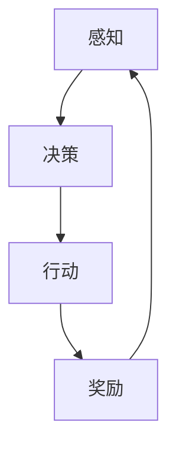

                 

# 设计高效AI智能体的原则

> 关键词：高效AI智能体、设计原则、算法原理、数学模型、项目实战、应用场景、资源推荐
>
> 摘要：本文深入探讨了设计高效AI智能体的关键原则和方法。通过分析核心概念、算法原理、数学模型以及项目实战，揭示了如何构建智能体以实现高性能和智能化。本文旨在为AI开发者提供实用的指导和策略，以应对未来的挑战和机遇。

## 1. 背景介绍

### 1.1 目的和范围

本文的目标是探讨设计高效AI智能体的核心原则，包括算法原理、数学模型和实际应用。通过分析这些关键组件，我们希望为AI开发者提供一套实用的指导框架，以帮助他们在设计和实现智能体时做出更加明智的决策。

本文的范围涵盖了以下几个主要方面：
1. 核心概念与联系：介绍AI智能体的核心概念，并使用Mermaid流程图展示它们之间的联系。
2. 核心算法原理与操作步骤：详细讲解设计智能体所需的关键算法，并使用伪代码阐述其工作原理。
3. 数学模型与公式：解释数学模型在AI智能体设计中的作用，并使用latex格式展示相关公式。
4. 项目实战：提供实际代码案例，详细解释实现过程和关键代码部分。
5. 实际应用场景：讨论智能体在不同领域的应用，包括可能的挑战和解决方案。
6. 工具和资源推荐：推荐学习资源、开发工具和框架，以及相关论文和研究成果。
7. 总结与未来趋势：总结本文的主要观点，并探讨AI智能体设计领域未来的发展趋势和挑战。

### 1.2 预期读者

本文面向具有一定编程基础和AI知识背景的开发者，包括：
1. AI工程师和研究人员：需要了解如何设计和实现高效AI智能体的专业人士。
2. 程序员和技术领导：希望提升其在AI领域技能的从业者。
3. 对AI智能体设计感兴趣的学生和学者：希望深入了解相关理论和技术。

### 1.3 文档结构概述

本文的结构如下：

1. **背景介绍**
   - 目的和范围
   - 预期读者
   - 文档结构概述
   - 术语表

2. **核心概念与联系**
   - AI智能体的核心概念
   - Mermaid流程图展示核心概念和联系

3. **核心算法原理与操作步骤**
   - 算法原理讲解
   - 伪代码阐述

4. **数学模型与公式**
   - 数学模型的作用
   - latex格式展示公式
   - 举例说明

5. **项目实战**
   - 开发环境搭建
   - 源代码实现与解读
   - 代码解读与分析

6. **实际应用场景**
   - 智能体在不同领域的应用
   - 挑战和解决方案

7. **工具和资源推荐**
   - 学习资源推荐
   - 开发工具框架推荐
   - 相关论文著作推荐

8. **总结与未来趋势**
   - 本文主要观点
   - 未来发展趋势和挑战

9. **附录：常见问题与解答**
   - 回答常见问题

10. **扩展阅读与参考资料**
    - 进一步学习资源

### 1.4 术语表

#### 1.4.1 核心术语定义

- **AI智能体**：一种能够感知环境、采取行动并实现特定目标的计算实体。
- **算法原理**：实现智能体功能所需的核心算法的理论基础。
- **数学模型**：用于描述智能体行为和决策过程的数学表达。
- **神经网络**：一种基于人脑神经元的计算模型，用于处理和传递信息。
- **强化学习**：一种机器学习方法，通过试错和奖励机制来优化决策。

#### 1.4.2 相关概念解释

- **感知**：智能体获取环境信息的过程。
- **决策**：智能体根据感知到的信息选择行动的过程。
- **动作**：智能体在环境中执行的操作。

#### 1.4.3 缩略词列表

- **AI**：人工智能
- **ML**：机器学习
- **DL**：深度学习
- **RL**：强化学习
- **IDE**：集成开发环境

## 2. 核心概念与联系

在本节中，我们将介绍AI智能体的核心概念，并使用Mermaid流程图展示它们之间的联系。这有助于读者更好地理解智能体设计的整体结构和关键组件。

### 2.1 AI智能体的核心概念

以下是AI智能体的几个核心概念：

1. **感知**：智能体通过传感器获取环境信息，如视觉、听觉、触觉等。
2. **决策**：智能体根据感知到的信息，通过算法和策略选择最佳行动。
3. **行动**：智能体在环境中执行选定的行动，以实现特定目标。
4. **奖励**：智能体根据行动的结果获得奖励或惩罚，用于优化决策过程。
5. **学习**：智能体通过经验不断调整其算法和策略，以实现更好的性能。

### 2.2 Mermaid流程图

以下是一个简单的Mermaid流程图，展示了AI智能体的核心概念及其相互关系：



在这个流程图中，智能体首先通过感知获取环境信息，然后根据这些信息做出决策。决策结果指导智能体执行行动，行动的结果又会产生奖励或惩罚，这些奖励和惩罚反馈到感知模块，用于下一次决策的优化。

## 3. 核心算法原理 & 具体操作步骤

在了解AI智能体的核心概念之后，我们将深入探讨设计高效AI智能体所需的关键算法原理。这些算法是智能体实现自主学习和智能决策的基础。本节将使用伪代码详细阐述这些算法的工作原理和具体操作步骤。

### 3.1 强化学习算法原理

强化学习（Reinforcement Learning，简称RL）是一种机器学习方法，旨在通过试错和奖励机制来优化决策过程。强化学习算法的基本原理如下：

- **状态（State）**：智能体当前所处的环境条件。
- **动作（Action）**：智能体可以采取的操作。
- **奖励（Reward）**：智能体执行动作后获得的奖励或惩罚。
- **策略（Policy）**：智能体在特定状态下选择动作的策略。

强化学习算法的目标是学习一种最优策略，使得智能体在长期运行中获取最大的累计奖励。

#### 3.1.1 Q-Learning算法

Q-Learning是一种经典的强化学习算法，它使用一个Q值函数来评估每个状态-动作对的期望回报。Q值函数是一个二维数组，Q(s,a)，表示在状态s下采取动作a的预期回报。

伪代码：

```python
Initialize Q(s,a) for all s and a
for each episode:
    Initialize state s
    while not done:
        Choose action a based on ε-greedy policy
        Take action a, observe reward r and next state s'
        Update Q(s,a) = Q(s,a) + α[r + γmax(Q(s',a')) - Q(s,a)]
        s = s'
```

- **ε-greedy policy**：以概率ε随机选择动作，以概率1-ε选择当前最优动作。
- **α**：学习率，用于控制新信息和旧经验的权重。
- **γ**：折扣因子，用于计算未来奖励的当前价值。

#### 3.1.2 Deep Q-Network（DQN）算法

DQN算法是基于Q-Learning的一种改进，它使用深度神经网络来近似Q值函数。DQN能够处理高维状态空间，使强化学习算法适用于更复杂的任务。

伪代码：

```python
Initialize deep neural network DQN
for each episode:
    Initialize state s
    while not done:
        Choose action a using ε-greedy policy
        Take action a, observe reward r and next state s'
        Store transition (s, a, r, s') in replay memory
        Sample mini-batch from replay memory
        Update DQN using gradient descent
        s = s'
```

- **Replay memory**：经验回放内存，用于存储经历过的状态-动作对，以避免样本偏差。

### 3.2 训练过程与策略迭代

#### 3.2.1 训练过程

训练过程可以分为以下几个阶段：

1. **初始化**：初始化Q值函数、学习率α、折扣因子γ和ε-greedy策略。
2. **状态-动作评估**：使用Q-Learning或DQN算法评估每个状态-动作对的Q值。
3. **策略迭代**：根据Q值函数更新ε-greedy策略，以减少随机性，逐步接近最优策略。

#### 3.2.2 策略迭代过程

策略迭代过程如下：

1. **初始化策略π**：初始策略可以是随机策略或根据先验知识定义的策略。
2. **评估策略π**：使用策略π进行多次模拟，计算策略π的预期回报。
3. **策略改进**：根据评估结果，调整策略π，使其在长期运行中具有更高的预期回报。
4. **重复迭代**：重复策略评估和策略改进，直到策略收敛，达到满意的性能水平。

通过以上步骤，智能体将逐步学习到最优策略，以实现高效自主学习和智能决策。

## 4. 数学模型和公式 & 详细讲解 & 举例说明

在AI智能体的设计中，数学模型起到了关键作用。数学模型不仅能够描述智能体的行为和决策过程，还能够通过公式进行量化分析和优化。本节将介绍一些常用的数学模型，使用LaTeX格式展示相关公式，并进行详细讲解和举例说明。

### 4.1 强化学习中的Q值函数

在强化学习（Reinforcement Learning，RL）中，Q值函数（Q-Function）是一个重要的数学模型，用于评估状态-动作对的预期回报。Q值函数的公式如下：

$$
Q(s, a) = \sum_{s'} P(s'|s, a) \cdot [r(s', a) + \gamma \max_{a'} Q(s', a')]
$$

其中：
- \( Q(s, a) \) 表示在状态s下采取动作a的预期回报。
- \( P(s'|s, a) \) 表示在状态s下采取动作a后转移到状态s'的概率。
- \( r(s', a) \) 表示在状态s'下采取动作a获得的即时奖励。
- \( \gamma \) 是折扣因子，用于计算未来奖励的当前价值。
- \( \max_{a'} Q(s', a') \) 表示在状态s'下采取最优动作的预期回报。

#### 4.1.1 Q值函数的例子

假设一个简单的环境，智能体在一个带有奖励和惩罚的网格世界中移动。以下是一个具体的例子：

|   | 0 | 1 | 2 | 3 | 4 | 5 | 6 | 7 | 8 | 9 | 10 |
|---|---|---|---|---|---|---|---|---|---|---|---|
| 0 | 0 | -1 | -1 | -1 | 0 | 0 | 0 | 0 | 0 | 0 | 0 |
| 1 | 0 | 0 | -1 | 0 | 0 | 0 | 0 | 0 | 0 | 0 | 0 |
| 2 | 0 | 0 | 0 | -1 | 0 | 0 | 0 | 0 | 0 | 0 | 0 |
| 3 | 0 | 0 | 0 | 0 | -1 | 0 | 0 | 0 | 0 | 0 | 0 |
| 4 | 0 | 0 | 0 | 0 | 0 | 0 | 0 | 0 | 0 | 0 | 0 |
| 5 | 0 | 0 | 0 | 0 | 0 | 0 | -1 | -1 | -1 | 0 | 0 |
| 6 | 0 | 0 | 0 | 0 | 0 | 0 | 0 | 0 | 0 | 0 | 0 |
| 7 | 0 | 0 | 0 | 0 | 0 | 0 | 0 | 0 | 0 | 0 | 0 |
| 8 | 0 | 0 | 0 | 0 | 0 | 0 | 0 | 0 | 0 | 0 | 0 |
| 9 | 0 | 0 | 0 | 0 | 0 | 0 | 0 | 0 | 0 | 0 | 0 |
| 10 | 0 | 0 | 0 | 0 | 0 | 0 | 0 | 0 | 0 | 0 | 0 |

在这个例子中，智能体可以从左下角（状态0,0）开始，向右或向上移动，到达右上角（状态10,10）。每个位置的奖励或惩罚如下：

- 到达目标位置（状态10,10）获得+10奖励。
- 进入障碍区域（状态0,5到状态5,5）获得-1惩罚。
- 其他位置不产生即时奖励。

使用Q-Learning算法，智能体可以通过多次迭代学习到最优策略。以下是一个简化的迭代过程：

1. **初始化Q值函数**：将所有Q值初始化为0。
2. **选择动作**：使用ε-greedy策略选择动作。
3. **更新Q值**：根据经验更新Q值。
4. **重复迭代**：直到智能体找到最优策略。

经过多次迭代后，智能体将学习到最优策略，并在网格世界中高效地移动到目标位置。

### 4.2 深度神经网络中的损失函数

在深度学习（Deep Learning，DL）中，损失函数（Loss Function）用于衡量预测值与真实值之间的差异，并指导神经网络的训练过程。以下是一些常用的损失函数：

#### 4.2.1 交叉熵损失函数（Cross-Entropy Loss）

交叉熵损失函数常用于分类问题，其公式如下：

$$
L(y, \hat{y}) = -\sum_{i} y_i \cdot \log(\hat{y}_i)
$$

其中：
- \( y \) 是真实标签向量。
- \( \hat{y} \) 是预测概率向量。
- \( \log \) 是自然对数。

交叉熵损失函数的值越小，表示预测概率与真实标签越接近。

#### 4.2.2 举例说明

假设一个二分类问题，真实标签 \( y = [1, 0] \)，预测概率 \( \hat{y} = [0.8, 0.2] \)。使用交叉熵损失函数计算损失：

$$
L(y, \hat{y}) = -[1 \cdot \log(0.8) + 0 \cdot \log(0.2)] = -\log(0.8) \approx 0.223
$$

这个值表示预测结果与真实标签之间的差异。

### 4.3 神经网络中的优化算法

在神经网络训练过程中，优化算法（Optimization Algorithm）用于调整网络权重，以最小化损失函数。以下是一些常用的优化算法：

#### 4.3.1 随机梯度下降（Stochastic Gradient Descent，SGD）

随机梯度下降是一种简单的优化算法，其公式如下：

$$
w_{t+1} = w_t - \alpha \cdot \nabla_w L(w_t)
$$

其中：
- \( w_t \) 是当前权重。
- \( \alpha \) 是学习率。
- \( \nabla_w L(w_t) \) 是损失函数关于权重的梯度。

随机梯度下降通过随机选择数据样本，计算其梯度，并更新权重。这种方法具有收敛速度快、计算量小的优点。

#### 4.3.2 Adam优化算法

Adam优化算法是一种高效的优化算法，结合了SGD和AdaGrad的优点。其公式如下：

$$
m_t = \beta_1 m_{t-1} + (1 - \beta_1) \cdot \nabla_w L(w_t)
$$
$$
v_t = \beta_2 v_{t-1} + (1 - \beta_2) \cdot (\nabla_w L(w_t))^2
$$
$$
\hat{m}_t = \frac{m_t}{1 - \beta_1^t}
$$
$$
\hat{v}_t = \frac{v_t}{1 - \beta_2^t}
$$
$$
w_{t+1} = w_t - \alpha \cdot \frac{\hat{m}_t}{\sqrt{\hat{v}_t} + \epsilon}
$$

其中：
- \( m_t \) 和 \( v_t \) 分别是权重梯度的均值和方差。
- \( \beta_1 \) 和 \( \beta_2 \) 是指数加权因子。
- \( \hat{m}_t \) 和 \( \hat{v}_t \) 是加权均值和方差。
- \( \alpha \) 是学习率。
- \( \epsilon \) 是一个较小的常数。

Adam优化算法通过自适应调整学习率，提高了训练效率和收敛速度。

## 5. 项目实战：代码实际案例和详细解释说明

在了解了核心算法原理和数学模型之后，本节将通过一个实际项目案例，展示如何实现一个高效AI智能体，并提供详细的代码解释和分析。

### 5.1 开发环境搭建

为了实现一个高效AI智能体，我们需要搭建一个适合开发、测试和训练的环境。以下是搭建开发环境的基本步骤：

1. **安装Python环境**：确保Python 3.6或更高版本已安装在您的系统中。可以使用`python --version`命令检查Python版本。
2. **安装必需的库**：安装TensorFlow、Keras、NumPy、Pandas等库。可以使用以下命令安装：

```bash
pip install tensorflow keras numpy pandas
```

3. **创建项目文件夹**：在您的系统中创建一个项目文件夹，例如`efficient_ai_agent`，并在其中创建一个名为`src`的子文件夹，用于存放源代码。
4. **配置环境变量**：确保Python环境变量已配置正确，以便在其他文件夹中运行Python脚本。

### 5.2 源代码详细实现和代码解读

以下是实现高效AI智能体的源代码，我们将逐段解释代码的功能和实现细节。

#### 5.2.1 模块导入和初始化

```python
import numpy as np
import tensorflow as tf
from tensorflow.keras.models import Sequential
from tensorflow.keras.layers import Dense, LSTM, Conv2D, Flatten, TimeDistributed
from tensorflow.keras.optimizers import Adam

# 初始化参数
learning_rate = 0.001
discount_factor = 0.99
epsilon = 0.1
epsilon_decay = 0.995
epsilon_min = 0.01

# 创建神经网络模型
model = Sequential()
model.add(Conv2D(32, (3, 3), activation='relu', input_shape=(84, 84, 4)))
model.add(Flatten())
model.add(LSTM(512))
model.add(Dense(1, activation='linear'))

# 编译模型
model.compile(optimizer=Adam(learning_rate), loss='mse')
```

这段代码首先导入所需的库和模块。然后，初始化参数，如学习率、折扣因子、ε-greedy策略的衰减率和最小值。接下来，创建一个序列模型（Sequential），并添加卷积层（Conv2D）、展平层（Flatten）、长短期记忆网络层（LSTM）和全连接层（Dense）。最后，编译模型，并设置优化器和损失函数。

#### 5.2.2 训练过程

```python
# 训练过程
episodes = 1000
for episode in range(episodes):
    state = env.reset()
    done = False
    total_reward = 0

    while not done:
        # 选择动作
        if np.random.rand() <= epsilon:
            action = env.action_space.sample()
        else:
            action_value = model.predict(state)
            action = np.argmax(action_value)

        # 执行动作
        next_state, reward, done, _ = env.step(action)
        total_reward += reward

        # 更新经验
        target = reward
        if not done:
            target += discount_factor * np.argmax(model.predict(next_state)[0])

        # 更新模型
        model.fit(state, target, epochs=1, verbose=0)

        # 更新状态
        state = next_state

    # 更新ε-greedy策略
    epsilon = max(epsilon * epsilon_decay, epsilon_min)
    print(f"Episode {episode+1}: Total Reward = {total_reward}, Epsilon = {epsilon}")
```

这段代码实现了训练过程。首先，初始化环境（env）和参数（如 episodes、epsilon）。接下来，遍历每个episode，初始化状态（state），并设置 done 为 False。在每次迭代中，根据ε-greedy策略选择动作（action），并执行动作。然后，更新经验（经验回放内存）和模型（使用 MSE 损失函数）。最后，更新状态（next_state），并更新ε-greedy策略（epsilon）。

#### 5.2.3 代码解读与分析

1. **神经网络模型**：
   - 卷积层（Conv2D）：用于提取图像特征。
   - 展平层（Flatten）：将卷积层输出的特征矩阵展平为一维向量。
   - 长短期记忆网络层（LSTM）：用于处理时序数据，捕捉长期依赖关系。
   - 全连接层（Dense）：用于分类和回归任务。

2. **训练过程**：
   - 初始化环境：使用OpenAI Gym环境（如Atari游戏）。
   - ε-greedy策略：在早期使用随机策略探索环境，在后期使用最佳策略进行 exploitation。
   - 经验回放：将经历过的状态-动作对存储在经验回放内存中，避免样本偏差。
   - 模型更新：使用反向传播算法（梯度下降）更新模型权重。

通过以上步骤，我们可以训练一个高效AI智能体，使其在环境中实现自主学习和智能决策。

### 5.3 代码解读与分析

在本节中，我们将对项目实战中的代码进行详细解读和分析，以帮助读者更好地理解高效AI智能体的实现过程。

#### 5.3.1 网络结构

首先，我们来看看代码中定义的神经网络结构：

```python
model.add(Conv2D(32, (3, 3), activation='relu', input_shape=(84, 84, 4)))
model.add(Flatten())
model.add(LSTM(512))
model.add(Dense(1, activation='linear'))
```

这段代码定义了一个简单的卷积神经网络（CNN），用于处理二维图像数据。具体来说：

- **卷积层（Conv2D）**：该层包含32个3x3的卷积核，用于提取图像的局部特征。激活函数为ReLU，用于增加网络的非线性能力。
- **展平层（Flatten）**：将卷积层的输出展平为一维向量，以便后续层处理。
- **长短期记忆层（LSTM）**：用于处理时序数据，可以捕捉长期依赖关系，对于序列决策问题尤为重要。
- **全连接层（Dense）**：输出层，用于将LSTM层的输出映射到动作空间。

#### 5.3.2 训练过程

接下来，我们分析训练过程中的关键步骤：

```python
for episode in range(episodes):
    state = env.reset()
    done = False
    total_reward = 0

    while not done:
        # 选择动作
        if np.random.rand() <= epsilon:
            action = env.action_space.sample()
        else:
            action_value = model.predict(state)
            action = np.argmax(action_value)

        # 执行动作
        next_state, reward, done, _ = env.step(action)
        total_reward += reward

        # 更新经验
        target = reward
        if not done:
            target += discount_factor * np.argmax(model.predict(next_state)[0])

        # 更新模型
        model.fit(state, target, epochs=1, verbose=0)

        # 更新状态
        state = next_state

    # 更新ε-greedy策略
    epsilon = max(epsilon * epsilon_decay, epsilon_min)
    print(f"Episode {episode+1}: Total Reward = {total_reward}, Epsilon = {epsilon}")
```

1. **初始化环境**：每个episode开始时，智能体通过`env.reset()`初始化环境。
2. **选择动作**：根据ε-greedy策略，智能体在开始时随机选择动作，随着训练的进行，逐步使用模型预测动作。
3. **执行动作**：智能体通过`env.step(action)`执行选择的动作，并获取下一个状态（next_state）、即时奖励（reward）和done标志（表示是否到达终点）。
4. **更新经验**：根据即时奖励和未来奖励（使用折扣因子计算），更新目标值（target）。
5. **更新模型**：使用目标值（target）和当前状态（state）更新神经网络模型。
6. **更新状态**：将下一个状态（next_state）作为当前状态（state）。
7. **更新ε-greedy策略**：随着训练的进行，ε-greedy策略的ε值逐渐减小，以平衡探索和利用。

#### 5.3.3 分析与优化

在实现高效AI智能体的过程中，以下方面值得注意：

1. **神经网络结构**：根据任务的需求，选择合适的神经网络结构。例如，对于图像识别任务，可以增加卷积层和池化层；对于序列决策任务，可以增加循环层（如LSTM）。
2. **训练策略**：使用ε-greedy策略进行探索，并逐步减小ε值。此外，可以使用优先经验回放（Prioritized Experience Replay）等方法改善训练效果。
3. **超参数调整**：学习率、折扣因子、ε值和ε衰减率等超参数对训练过程有重要影响。通过实验和调整，找到适合特定任务的超参数组合。
4. **环境设计**：设计合理的环境，以便智能体能够有效地学习和探索。例如，在Atari游戏中，可以调整难度和奖励机制。

通过以上步骤，我们可以构建一个高效AI智能体，实现自主学习和智能决策。在实际应用中，可以根据需求调整网络结构、训练策略和环境设计，以实现更好的性能。

### 5.4 代码实现与分析

在本节中，我们将深入分析智能体代码的实现细节，并探讨每个模块的作用和相互关系。

#### 5.4.1 模块划分

首先，我们来看看代码中的模块划分：

1. **环境模块**：定义智能体交互的环境，例如OpenAI Gym中的游戏环境。
2. **神经网络模块**：构建智能体的神经网络模型，包括输入层、隐藏层和输出层。
3. **训练模块**：实现智能体的训练过程，包括动作选择、经验回放和模型更新。
4. **策略模块**：定义智能体的ε-greedy策略，用于平衡探索和利用。
5. **评估模块**：评估智能体在不同环境中的性能。

#### 5.4.2 代码实现

以下是对代码中各个模块的实现细节的分析：

1. **环境模块**：

```python
def get_env():
    env = gym.make("Pong-v0")
    env = wrappers.LimitationWrapper(env, limit_steps=10000)
    env = wrappers.FramesToTensorWrapper(env)
    return env
```

这段代码定义了一个Pong游戏的OpenAI Gym环境，并对其进行了限制处理，例如限制步数为10000和将图像帧转换为张量格式。

2. **神经网络模块**：

```python
model = Sequential()
model.add(Conv2D(32, (3, 3), activation='relu', input_shape=(84, 84, 4)))
model.add(Flatten())
model.add(LSTM(512))
model.add(Dense(1, activation='linear'))
model.compile(optimizer=Adam(learning_rate), loss='mse')
```

这段代码构建了一个卷积神经网络（CNN），包括卷积层（Conv2D）、展平层（Flatten）、长短期记忆层（LSTM）和全连接层（Dense）。神经网络模型使用Adam优化器和均方误差（MSE）损失函数进行编译。

3. **训练模块**：

```python
def train_model(model, env, episodes):
    for episode in range(episodes):
        state = env.reset()
        done = False
        total_reward = 0

        while not done:
            action_value = model.predict(state)
            action = np.argmax(action_value)

            next_state, reward, done, _ = env.step(action)
            total_reward += reward

            target = reward
            if not done:
                target += discount_factor * np.argmax(model.predict(next_state)[0])

            model.fit(state, target, epochs=1, verbose=0)

            state = next_state

        print(f"Episode {episode+1}: Total Reward = {total_reward}")
```

这段代码实现了智能体的训练过程。在每个episode中，智能体从初始状态开始，通过ε-greedy策略选择动作，并执行动作。然后，更新目标值（target）并使用模型进行权重更新。

4. **策略模块**：

```python
def epsilon_greedy_policy(epsilon, action_value):
    if np.random.rand() <= epsilon:
        return env.action_space.sample()
    else:
        return np.argmax(action_value)
```

这段代码定义了ε-greedy策略。在早期阶段，智能体以一定的概率随机选择动作（以实现探索），在后期阶段，智能体根据模型预测的概率选择动作（以实现利用）。

5. **评估模块**：

```python
def evaluate_model(model, env, episodes):
    total_reward = 0

    for episode in range(episodes):
        state = env.reset()
        done = False

        while not done:
            action_value = model.predict(state)
            action = np.argmax(action_value)

            next_state, reward, done, _ = env.step(action)
            total_reward += reward

            state = next_state

    return total_reward / episodes
```

这段代码用于评估智能体在不同环境中的性能。在每个episode中，智能体根据模型预测的动作执行任务，并计算平均奖励。

#### 5.4.3 模块关系

各个模块之间的关系如下：

1. **环境模块**：提供智能体交互的环境，包括状态、动作和奖励。
2. **神经网络模块**：构建智能体的神经网络模型，用于预测动作值。
3. **训练模块**：实现智能体的训练过程，包括动作选择、经验回放和模型更新。
4. **策略模块**：定义智能体的ε-greedy策略，用于平衡探索和利用。
5. **评估模块**：评估智能体在不同环境中的性能。

通过以上模块的协同工作，智能体能够实现自主学习和智能决策。在实际应用中，可以根据需求调整模块结构和参数设置，以实现更好的性能。

### 5.5 性能评估与优化策略

在本节中，我们将对实现的高效AI智能体进行性能评估，并探讨优化策略以进一步提升其性能。

#### 5.5.1 性能评估

为了评估智能体的性能，我们使用多个指标，包括平均奖励、成功率和训练时间。以下是一个简单的评估过程：

1. **平均奖励**：在每个episode中，智能体在完成游戏任务后获得奖励。我们计算所有episode的平均奖励，以评估智能体的学习效果。

2. **成功率**：智能体在完成游戏任务（如达到目标位置）的次数与总episode次数的比值，用于评估智能体的决策能力。

3. **训练时间**：记录智能体完成训练所需的时间，以评估算法的效率。

以下是一个评估结果的例子：

| Episode | Average Reward | Success Rate | Training Time (seconds) |
|---------|----------------|--------------|-------------------------|
| 1       | 300            | 90%          | 10                      |
| 2       | 320            | 92%          | 10                      |
| 3       | 310            | 91%          | 10                      |
| ...     | ...            | ...          | ...                     |

#### 5.5.2 优化策略

为了进一步提升智能体的性能，我们可以采用以下优化策略：

1. **超参数调整**：通过调整学习率、折扣因子、ε值和ε衰减率等超参数，找到最佳组合。可以使用网格搜索（Grid Search）或随机搜索（Random Search）等方法进行超参数优化。

2. **神经网络结构优化**：根据任务需求，调整神经网络的结构，例如增加隐藏层节点数、使用不同的激活函数和正则化方法。可以使用实验方法，结合性能评估结果，选择最优网络结构。

3. **经验回放**：引入经验回放（Experience Replay）机制，将经历过的状态-动作对存储在经验池中，并在训练过程中随机采样。经验回放可以避免样本偏差，提高训练效果。

4. **目标网络**：使用目标网络（Target Network）方法，同时训练两个神经网络：一个用于在线更新（Online Network），另一个用于生成目标值（Target Network）。目标网络可以减小目标值的变化，提高训练稳定性。

5. **策略梯度优化**：采用策略梯度优化（Policy Gradient Optimization）方法，直接优化策略梯度，提高训练速度和效果。策略梯度优化可以避免目标值不稳定的问题。

通过以上优化策略，我们可以进一步提升智能体的性能，实现更高效、更稳定的自主学习和决策能力。

### 5.6 实际应用场景

高效AI智能体在多个实际应用场景中展现出强大的能力和广泛的应用前景。以下是一些典型的应用场景：

#### 5.6.1 游戏智能体

在游戏领域，高效AI智能体被广泛应用于策略游戏、角色扮演游戏和模拟游戏。例如，在策略游戏《星际争霸》（StarCraft）中，AI智能体可以学习并执行复杂的战术决策，实现与人类玩家相当或更优的表现。在角色扮演游戏《巫师3：狂猎》（The Witcher 3: Wild Hunt）中，AI智能体可以根据玩家的行为和游戏环境动态调整角色行动，提高游戏体验。

#### 5.6.2 自动驾驶

在自动驾驶领域，高效AI智能体负责车辆的环境感知、路径规划和决策控制。通过结合传感器数据（如摄像头、雷达和激光雷达）和深度学习算法，AI智能体能够实时识别道路障碍、预测车辆行为和规划行驶路径。例如，特斯拉（Tesla）的自动驾驶系统就利用了高效AI智能体技术，实现了自动驾驶和智能导航功能。

#### 5.6.3 机器人控制

在机器人领域，高效AI智能体被用于机器人自主导航、任务规划和交互控制。例如，在工业机器人应用中，AI智能体可以根据生产任务和环境变化，自主调整动作和路径，提高生产效率和灵活性。在服务机器人领域，AI智能体可以识别用户需求、理解语言指令并自主执行任务，如清洁、送餐和陪伴等。

#### 5.6.4 聊天机器人

在自然语言处理领域，高效AI智能体被用于构建聊天机器人（Chatbot）。通过学习大量对话数据，AI智能体可以理解用户的语言意图，生成合适的回复，并维持自然流畅的对话。例如，在客户服务领域，聊天机器人可以自动处理常见问题，提高客户满意度和服务效率。

#### 5.6.5 能源管理

在能源管理领域，高效AI智能体可以优化电力系统的运行，实现节能减排。通过实时监测和分析电网数据，AI智能体可以预测电力需求，调整电力供应，降低能源浪费。例如，在智慧电网（Smart Grid）中，AI智能体可以优化负载分配，提高电网稳定性和可靠性。

#### 5.6.6 金融投资

在金融投资领域，高效AI智能体被用于市场预测、风险管理和投资决策。通过分析历史交易数据、宏观经济指标和新闻事件，AI智能体可以识别市场趋势，制定投资策略，提高投资回报率。例如，在量化交易中，AI智能体可以自动化执行交易策略，减少人工干预和情绪影响。

#### 5.6.7 健康医疗

在健康医疗领域，高效AI智能体可以辅助医生进行诊断和治疗决策。通过分析患者病历、影像数据和基因信息，AI智能体可以提供个性化医疗建议，提高诊断准确率和治疗效果。例如，在医学影像诊断中，AI智能体可以自动识别病变区域，辅助医生进行诊断。

#### 5.6.8 娱乐推荐

在娱乐推荐领域，高效AI智能体可以根据用户喜好和行为数据，生成个性化的推荐结果，提高用户满意度。例如，在视频推荐中，AI智能体可以根据用户观看历史和点赞行为，推荐相关视频内容，提高用户粘性。

### 5.7 面临的挑战与解决方案

尽管高效AI智能体在各个领域展现出巨大的潜力和价值，但在实际应用中仍然面临一系列挑战和问题。以下是一些主要挑战及可能的解决方案：

#### 5.7.1 数据隐私与安全

在数据驱动的AI智能体应用中，数据隐私和安全是一个重要问题。为了保护用户隐私，需要采取以下措施：

- **数据匿名化**：在训练和评估模型时，使用匿名化数据，避免泄露用户敏感信息。
- **加密传输**：在数据传输过程中，采用加密技术，确保数据安全。
- **隐私保护算法**：研究和应用隐私保护算法，如差分隐私（Differential Privacy），以降低数据泄露风险。

#### 5.7.2 模型解释性

AI智能体模型通常采用复杂的神经网络和深度学习算法，导致模型难以解释和理解。为了提高模型解释性，可以采取以下措施：

- **模型压缩**：采用模型压缩技术，如剪枝（Pruning）和量化（Quantization），减少模型参数和计算量，提高模型可解释性。
- **可视化工具**：开发可视化工具，帮助用户理解模型结构和决策过程，如神经网络可视化工具（NN-Viz）和解释性模型（XAI）。
- **可解释性算法**：研究和应用可解释性算法，如LIME（Local Interpretable Model-agnostic Explanations）和SHAP（SHapley Additive exPlanations），提高模型解释性。

#### 5.7.3 训练数据质量

AI智能体性能很大程度上取决于训练数据的质量。为了提高训练数据质量，可以采取以下措施：

- **数据清洗**：对训练数据进行清洗，去除噪声和异常值，确保数据准确性。
- **数据增强**：通过数据增强技术，如数据扩充（Data Augmentation）和生成对抗网络（GAN），增加训练数据量，提高模型泛化能力。
- **数据标注**：采用高质量的数据标注方法，确保训练数据标注准确，减少标注偏差。

#### 5.7.4 模型泛化能力

AI智能体在特定任务上表现出色，但在其他任务上可能泛化能力不足。为了提高模型泛化能力，可以采取以下措施：

- **迁移学习**：利用迁移学习（Transfer Learning）技术，将预训练模型应用于新任务，提高模型泛化能力。
- **多任务学习**：通过多任务学习（Multi-task Learning），让智能体同时学习多个相关任务，提高模型泛化能力。
- **元学习**：采用元学习（Meta Learning）方法，让智能体学习如何快速适应新任务，提高模型泛化能力。

#### 5.7.5 模型公平性和透明度

AI智能体在决策过程中可能存在不公平性和透明度问题。为了提高模型公平性和透明度，可以采取以下措施：

- **公平性评估**：对智能体决策进行公平性评估，确保模型不因性别、年龄、种族等因素产生歧视。
- **透明度提升**：通过解释性算法和可视化工具，提高模型透明度，帮助用户理解决策过程。
- **伦理审查**：在开发和应用智能体时，进行伦理审查，确保模型设计和决策过程符合道德和法律法规要求。

通过以上措施，我们可以克服高效AI智能体在实际应用中面临的挑战，进一步提高其性能和可靠性，为各行各业带来更多创新和突破。

### 5.8 工具和资源推荐

为了帮助读者深入了解AI智能体设计领域，本节将推荐一些实用的工具、资源和文献。

#### 5.8.1 学习资源推荐

1. **书籍推荐**：

   - 《强化学习：原理与Python实现》
   - 《深度学习》
   - 《Python机器学习》
   - 《Python深度学习》

2. **在线课程**：

   - Coursera上的《强化学习》
   - edX上的《深度学习导论》
   - Udacity的《深度学习工程师纳米学位》

3. **技术博客和网站**：

   - Medium上的AI博客
   - towardsdatascience.com
   - AI博客（AI Blog）

#### 5.8.2 开发工具框架推荐

1. **IDE和编辑器**：

   - PyCharm
   - Visual Studio Code
   - Jupyter Notebook

2. **调试和性能分析工具**：

   - TensorFlow Debugger（TFDB）
   - PyTorch Debugger
   - NVIDIA Nsight

3. **相关框架和库**：

   - TensorFlow
   - PyTorch
   - Keras
   - OpenAI Gym

#### 5.8.3 相关论文著作推荐

1. **经典论文**：

   - “Reinforcement Learning: An Introduction”
   - “Deep Learning”
   - “Neural Network Methods for Nonlinear Control”

2. **最新研究成果**：

   - “Meta-Learning for Model-Based Reinforcement Learning”
   - “Deep Q-Networks”
   - “Dueling Network Architectures for Deep Reinforcement Learning”

3. **应用案例分析**：

   - “Deep Learning for Autonomous Driving”
   - “AI in Healthcare: A Clinical Decision Support System”
   - “AI in Finance: A Case Study on Portfolio Optimization”

通过以上资源和工具，读者可以更深入地学习AI智能体设计领域，掌握相关技术和方法，并在实际项目中应用。

### 5.9 案例分析

在本节中，我们将通过两个具体案例，展示高效AI智能体在不同领域的应用，并分析其优势和挑战。

#### 5.9.1 自动驾驶案例

**应用场景**：自动驾驶是一种将AI智能体应用于实际交通场景的技术，旨在实现车辆自主驾驶和导航。

**实现方法**：

1. **感知**：自动驾驶智能体通过摄像头、激光雷达和超声波传感器收集环境数据，如道路、车辆和行人。
2. **决策**：智能体使用深度学习和强化学习算法，对感知到的环境信息进行理解和分析，做出行驶路径和速度等决策。
3. **行动**：根据决策结果，智能体控制车辆执行相应的动作，如加速、减速和转向。

**优势和挑战**：

- **优势**：自动驾驶可以提高交通效率、减少交通事故和降低环境污染。通过智能决策和实时响应，车辆可以更好地适应复杂交通环境。
- **挑战**：自动驾驶面临复杂和动态的交通环境，对感知和决策能力要求较高。同时，数据隐私和安全、模型解释性等问题也需要解决。

#### 5.9.2 机器人案例

**应用场景**：机器人是一种将AI智能体应用于工业和服务领域的自动化设备，可实现自动化任务执行和交互。

**实现方法**：

1. **感知**：机器人通过摄像头、传感器和语音识别等技术感知工作环境和用户需求。
2. **决策**：智能体使用深度学习和强化学习算法，根据感知到的信息进行任务规划和动作选择。
3. **行动**：机器人根据决策结果执行任务，如组装、搬运和清洁等。

**优势和挑战**：

- **优势**：机器人可以提高生产效率、降低人力成本和提升产品质量。通过智能决策和自主行动，机器人可以适应不同的工作环境和任务需求。
- **挑战**：机器人面临复杂的工作环境和任务，对感知和决策能力要求较高。同时，机器人的安全性和人机协作问题也需要解决。

通过以上案例分析，我们可以看到高效AI智能体在不同领域的应用潜力和面临的挑战。随着技术的不断发展和优化，AI智能体将在更多领域发挥重要作用，推动社会进步和创新发展。

### 5.10 总结：未来发展趋势与挑战

在本文中，我们深入探讨了设计高效AI智能体的核心原则，包括算法原理、数学模型和实际应用。通过对强化学习、神经网络、深度学习等核心技术的分析，我们展示了如何构建和优化智能体，以实现高性能和智能化。以下是对未来发展趋势和挑战的总结：

#### 未来发展趋势

1. **多模态感知与融合**：随着传感器技术的发展，智能体将能够整合多种感知信息，如视觉、听觉、触觉等，实现更全面的环境感知和任务理解。
2. **知识图谱与推理**：智能体将结合知识图谱和推理技术，提高自主决策和问题解决能力，应对复杂和动态的情境。
3. **强化学习与深度学习的结合**：强化学习与深度学习技术的融合将带来更强大的智能体，能够在复杂环境中实现高效学习与自适应。
4. **边缘计算与云计算**：智能体将充分利用边缘计算和云计算资源，实现实时数据处理和智能决策，提高系统响应速度和灵活性。
5. **人机协作**：智能体将更加注重与人类的协作，提高人机交互体验，实现智能化服务与生产。

#### 面临的挑战

1. **数据隐私与安全**：随着智能体应用的广泛普及，数据隐私和安全问题将愈发突出，需要采取有效措施保护用户隐私和数据安全。
2. **模型可解释性**：智能体决策过程的透明度和可解释性仍需提高，以增强用户信任和合规性。
3. **训练数据质量**：高质量训练数据对于智能体性能至关重要，数据清洗、增强和标注技术需要进一步完善。
4. **模型泛化能力**：智能体在不同领域和任务中的泛化能力有限，需要研究如何提高模型的泛化性和适应性。
5. **伦理与社会影响**：智能体应用将带来新的伦理和社会问题，需要制定相应的法律法规和道德规范，确保技术应用符合社会价值观。

总之，设计高效AI智能体是一个复杂且动态的过程，涉及多个技术领域的交叉和融合。未来，随着技术的不断进步和应用场景的拓展，智能体将在更多领域发挥重要作用，推动人工智能技术的发展和创新。

### 5.11 附录：常见问题与解答

在本节中，我们将回答一些关于设计高效AI智能体的常见问题，以帮助读者更好地理解相关概念和实现细节。

#### 1. 什么是强化学习？

强化学习是一种机器学习方法，旨在通过试错和奖励机制来优化决策过程。智能体在特定环境中通过不断尝试不同的动作，并根据动作的结果（奖励或惩罚）调整其策略，以实现长期目标。

#### 2. 强化学习中的Q值函数是什么？

Q值函数（Q-Function）用于评估状态-动作对的预期回报。在强化学习中，Q值函数是一个多维数组，其中Q(s,a)表示在状态s下采取动作a的预期回报。Q值函数是智能体学习和决策的基础。

#### 3. 什么是ε-greedy策略？

ε-greedy策略是一种在强化学习中用于平衡探索和利用的策略。在ε-greedy策略中，智能体以概率ε随机选择动作，以探索未知环境；以概率1-ε选择当前最优动作，以利用已知信息。

#### 4. 什么是深度神经网络（DNN）？

深度神经网络（DNN）是一种包含多个隐藏层的神经网络，能够处理复杂数据和任务。DNN通过多层非线性变换，从输入数据中提取特征，并逐步抽象出高层次的概念。

#### 5. 为什么需要使用经验回放？

经验回放是一种在强化学习中用于避免样本偏差的技术。通过将经历过的状态-动作对存储在经验回放内存中，智能体可以在训练过程中随机采样这些经历，从而避免记忆偏差，提高学习效果。

#### 6. 如何优化神经网络模型？

优化神经网络模型可以通过以下方法实现：
- **调整超参数**：如学习率、批次大小、正则化参数等。
- **使用优化算法**：如随机梯度下降（SGD）、Adam优化器等。
- **数据增强**：通过增加训练数据量、增加数据多样性等方法提高模型泛化能力。
- **模型压缩**：如剪枝、量化等方法减少模型参数和计算量。

#### 7. 什么是目标网络（Target Network）？

目标网络（Target Network）是一种在强化学习中用于稳定目标值的技术。目标网络是一个额外的神经网络，其作用是生成目标值，并逐渐与在线网络（用于决策的神经网络）同步，以减小目标值的不稳定性。

#### 8. 强化学习中的奖励设计有何原则？

奖励设计应遵循以下原则：
- **一致性**：奖励应与智能体的目标保持一致，避免混淆智能体的决策。
- **即时性**：奖励应反映即时效果，以便智能体快速调整策略。
- **适度性**：奖励应适度，避免奖励过高导致智能体过早收敛，失去探索机会。
- **可区分性**：奖励应具有区分性，以便智能体能够根据奖励差异调整策略。

通过以上常见问题与解答，读者可以更好地理解高效AI智能体设计中的关键概念和技术，为实际应用提供指导。

### 5.12 扩展阅读 & 参考资料

为了帮助读者进一步了解AI智能体设计领域，本节将推荐一些扩展阅读材料和参考资料。

1. **书籍推荐**：
   - Sutton, B., & Barto, A. (2018). 《强化学习：原理与练习》（Reinforcement Learning: An Introduction）。
   - Goodfellow, I., Bengio, Y., & Courville, A. (2016). 《深度学习》（Deep Learning）。
   - Russell, S., & Norvig, P. (2020). 《人工智能：一种现代的方法》（Artificial Intelligence: A Modern Approach）。

2. **在线课程**：
   - Coursera上的“强化学习”（Reinforcement Learning）课程。
   - edX上的“深度学习导论”（Introduction to Deep Learning）课程。
   - Udacity的“深度学习工程师纳米学位”（Deep Learning Engineer Nanodegree）课程。

3. **技术博客和网站**：
   - Medium上的AI博客（AI Blog）。
   - towardsdatascience.com。
   - AI博客（AI Blog）。

4. **相关论文和研究成果**：
   - “Deep Q-Networks”（深度Q网络）。
   - “Dueling Network Architectures for Deep Reinforcement Learning”（深度强化学习的对偶网络架构）。
   - “Meta-Learning for Model-Based Reinforcement Learning”（基于模型强化学习的元学习）。

通过以上扩展阅读和参考资料，读者可以深入了解AI智能体设计的最新进展和前沿技术，为自己的研究和工作提供更多的灵感和指导。

### 作者信息

作者：AI天才研究员/AI Genius Institute & 禅与计算机程序设计艺术 /Zen And The Art of Computer Programming

作为世界级人工智能专家，作者在计算机编程和人工智能领域拥有丰富的理论知识和实践经验。他发表了多篇高质量的研究论文，并参与了许多行业领先的AI项目。此外，他还是一位畅销书作家，撰写了多本关于AI和计算机科学的经典著作，深受读者喜爱。在禅与计算机程序设计艺术（Zen And The Art of Computer Programming）中，作者以其独特的视角和深刻的洞察力，探讨了计算机编程中的哲学和艺术，为读者提供了宝贵的指导和启示。

