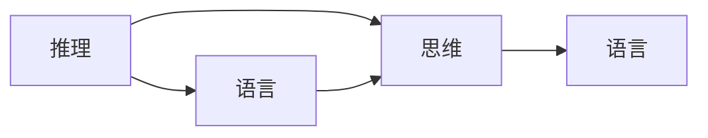

                 

# 语言≠思维，大模型学不了推理：推理并不需要语言作为媒介

> 关键词：推理、语言、大模型、思维、算法、人工智能

> 摘要：本文探讨了语言与思维的关系，以及大模型在推理中的局限性。通过深入分析推理的本质，文章提出了“推理并不需要语言作为媒介”的观点，并详细阐述了这一观点的理论依据和实际应用。本文旨在为读者提供一个清晰、深刻的认识，帮助其更好地理解和应用推理算法。

## 1. 背景介绍

### 1.1 目的和范围

本文旨在探讨推理的本质，并解释为什么大模型在推理方面存在局限性。我们将通过分析语言和思维的关系，来阐述“推理并不需要语言作为媒介”的观点。本文的主要目标是：

1. 解释语言与思维的区别和联系。
2. 分析大模型在推理方面的局限性。
3. 提出推理不需要语言作为媒介的理论依据。
4. 探讨这一观点在实际应用中的意义。

### 1.2 预期读者

本文适用于以下读者：

1. 对人工智能、机器学习和推理算法感兴趣的初学者。
2. 想要深入了解大模型和推理关系的专业人士。
3. 对认知科学和心理学有一定了解，并希望将其应用于人工智能领域的学者。

### 1.3 文档结构概述

本文分为以下几个部分：

1. 引言：介绍本文的目的、关键词和摘要。
2. 背景介绍：讨论语言与思维的关系、大模型的发展及其在推理方面的局限性。
3. 核心概念与联系：介绍推理、思维、语言等核心概念，并通过 Mermaid 流程图展示它们之间的联系。
4. 核心算法原理 & 具体操作步骤：详细阐述推理算法的原理和具体操作步骤。
5. 数学模型和公式 & 详细讲解 & 举例说明：介绍推理过程中的数学模型和公式，并进行举例说明。
6. 项目实战：提供实际代码案例和详细解释说明。
7. 实际应用场景：讨论推理在实际应用中的意义和挑战。
8. 工具和资源推荐：推荐相关学习资源和开发工具。
9. 总结：对未来发展趋势与挑战的展望。
10. 附录：常见问题与解答。
11. 扩展阅读 & 参考资料：提供进一步阅读的材料。

### 1.4 术语表

在本文中，我们将使用以下术语：

#### 1.4.1 核心术语定义

- **推理**：根据已知信息得出新结论的思维过程。
- **语言**：人类用于交流的符号系统，包括语音、文字和手势等。
- **思维**：大脑对信息进行加工、分析、综合和推理的过程。
- **大模型**：具有巨大参数规模和强大计算能力的深度学习模型。

#### 1.4.2 相关概念解释

- **神经网络**：一种模仿生物神经系统的计算模型，用于处理和分析数据。
- **注意力机制**：神经网络中的一种机制，用于提高模型在处理序列数据时的性能。
- **图灵机**：一种抽象的计算模型，用于定义可计算函数。
- **符号主义**：一种人工智能研究方法，强调使用符号表示和推理。

#### 1.4.3 缩略词列表

- **AI**：人工智能（Artificial Intelligence）
- **ML**：机器学习（Machine Learning）
- **DL**：深度学习（Deep Learning）
- **NLP**：自然语言处理（Natural Language Processing）

## 2. 核心概念与联系

为了更好地理解语言、思维和推理之间的关系，我们首先需要明确这些核心概念的定义。

### 2.1 推理

推理是一种思维过程，通过从已知信息中推导出新的结论。推理可以分为两大类：演绎推理和归纳推理。

- **演绎推理**：从一般原理出发，推导出特定情况的结论。例如，所有人都会死亡，苏格拉底是人，因此苏格拉底会死亡。
- **归纳推理**：从特定情况出发，归纳出一般原理。例如，观察到的所有天鹅都是白色的，因此推断所有天鹅都是白色的。

### 2.2 思维

思维是大脑对信息进行加工、分析、综合和推理的过程。思维可以分为以下几种类型：

- **直观思维**：基于经验和直觉进行推理。
- **分析思维**：对信息进行细致的分解和分析。
- **批判性思维**：评估信息和结论的有效性和可靠性。
- **创造性思维**：发现新的解决方案或思路。

### 2.3 语言

语言是人类用于交流的符号系统，包括语音、文字和手势等。语言具有以下特点：

- **结构性**：语言由词、句和段落等结构组成，具有明确的语法规则。
- **抽象性**：语言可以表达抽象的概念和思想，而不仅仅是具体的事物。
- **符号性**：语言使用符号来表示概念和思想，例如单词、字母和手势。

### 2.4 推理与语言、思维的关系

推理与语言和思维之间存在密切的联系。

- **语言作为推理媒介**：在人类的推理过程中，语言起到了重要的作用。人们通过语言来表达自己的想法和结论，并在交流中验证和完善自己的推理。
- **思维与推理**：思维是推理的基础。人们在日常生活中不断进行推理，从而形成对世界的认知和理解。推理是思维的一种表现形式，但并不是唯一的思维形式。

### 2.5 Mermaid 流程图

为了更好地展示推理、思维和语言之间的关系，我们使用 Mermaid 流程图来表示它们之间的联系。



在上述流程图中，A 表示推理，B 表示思维，C 表示语言。从图中可以看出，推理与思维和语言之间存在紧密的联系，但推理并不直接依赖于语言。

## 3. 核心算法原理 & 具体操作步骤

在本节中，我们将详细阐述推理算法的原理和具体操作步骤。推理算法是一种基于已知信息得出新结论的方法，通常可以分为两大类：演绎推理和归纳推理。

### 3.1 演绎推理算法

演绎推理是从一般原理推导出特定结论的过程。其基本原理如下：

1. **前提**：假设一组前提条件。
2. **规则**：使用逻辑规则将前提条件组合成结论。
3. **结论**：从前提条件和逻辑规则中推导出结论。

#### 3.1.1 算法原理

演绎推理算法的核心是逻辑规则。逻辑规则可以表示为“如果 A，那么 B”。在演绎推理中，我们首先定义一组前提条件，然后使用逻辑规则推导出结论。

#### 3.1.2 具体操作步骤

以下是演绎推理算法的具体操作步骤：

1. **定义前提条件**：根据问题，定义一组前提条件。
2. **选择逻辑规则**：根据前提条件，选择合适的逻辑规则。
3. **推导结论**：使用逻辑规则推导出结论。
4. **验证结论**：检查结论是否符合已知信息。

#### 3.1.3 伪代码实现

以下是演绎推理算法的伪代码实现：

```
DeductiveReasoning(preconditions, logicRules) {
    conclusions = []
    for each precondition in preconditions {
        for each logicRule in logicRules {
            if (precondition satisfies logicRule) {
                conclusion = logicRule(conclusion)
                conclusions.add(conclusion)
            }
        }
    }
    return conclusions
}
```

### 3.2 归纳推理算法

归纳推理是从特定情况推导出一般原理的过程。其基本原理如下：

1. **观察实例**：观察一系列特定的实例。
2. **提取规律**：从观察到的实例中提取规律。
3. **归纳原理**：根据提取的规律，得出一般原理。

#### 3.2.1 算法原理

归纳推理算法的核心是从特定实例中提取规律。通常，这需要使用统计学方法对实例进行分析，并从中提取规律。

#### 3.2.2 具体操作步骤

以下是归纳推理算法的具体操作步骤：

1. **收集实例**：收集一组特定实例。
2. **分析实例**：对实例进行统计分析，提取规律。
3. **归纳原理**：根据提取的规律，得出一般原理。
4. **验证原理**：检查归纳原理是否符合已知信息。

#### 3.2.3 伪代码实现

以下是归纳推理算法的伪代码实现：

```
InductiveReasoning(instances) {
    rules = []
    for each instance in instances {
        rule = extractRule(instance)
        rules.add(rule)
    }
    principle = generalizeRules(rules)
    return principle
}
```

## 4. 数学模型和公式 & 详细讲解 & 举例说明

在本节中，我们将介绍推理过程中的数学模型和公式，并通过举例说明这些公式的应用。

### 4.1 演绎推理的数学模型

演绎推理的数学模型主要基于逻辑运算。逻辑运算包括与（AND）、或（OR）和非（NOT）等。以下是这些逻辑运算的公式：

1. **与运算**：（\(A \land B\)）
   - 公式：\(A \land B = (A \text{ 且 } B)\)
   - 举例：如果今天下雨（A）并且我带伞（B），那么我不会被淋湿（C）。即 \(A \land B \Rightarrow C\)。

2. **或运算**：（\(A \lor B\)）
   - 公式：\(A \lor B = (A \text{ 或 } B)\)
   - 举例：我是学生（A）或者我是教师（B），那么我是专业人士（C）。即 \(A \lor B \Rightarrow C\)。

3. **非运算**：（\(\neg A\)）
   - 公式：\(\neg A = (\text{非 } A)\)
   - 举例：今天不下雨（\(\neg A\)），那么我不会带伞（B）。即 \(\neg A \Rightarrow B\)。

### 4.2 归纳推理的数学模型

归纳推理的数学模型主要基于统计学方法。统计学中的假设检验和回归分析等方法可用于提取规律。以下是归纳推理中常用的数学模型：

1. **假设检验**：
   - 公式：\(H_0\) 为零假设，\(H_1\) 为备择假设。
   - 举例：假设某班级学生的平均成绩为 80 分，我们收集了 100 名学生的成绩数据，并进行假设检验。如果 p 值小于 0.05，则拒绝零假设，认为班级学生的平均成绩不是 80 分。

2. **回归分析**：
   - 公式：\(y = a + bx\)，其中 \(y\) 是因变量，\(x\) 是自变量，\(a\) 是截距，\(b\) 是斜率。
   - 举例：根据某公司员工的工作时间和工作效率数据，我们可以使用回归分析建立模型，预测员工的工作效率。

### 4.3 举例说明

#### 4.3.1 演绎推理举例

假设有以下前提条件：

- \(A\)：所有鸟类都会飞。
- \(B\)：企鹅是一种鸟类。

我们需要推导出结论 \(C\)：企鹅会飞。

使用演绎推理的公式：

\[A \land B \Rightarrow C\]

根据前提条件，我们可以得出结论：

- \(C\)：企鹅会飞。

#### 4.3.2 归纳推理举例

假设我们收集了以下数据：

| 学生 | 成绩 |
| ---- | ---- |
| 小明 | 80   |
| 小红 | 90   |
| 小李 | 70   |

我们需要根据这些数据，归纳出学生的平均成绩。

使用归纳推理的公式：

\[y = a + bx\]

其中，\(y\) 是平均成绩，\(x\) 是学生人数，\(a\) 是截距，\(b\) 是斜率。

根据数据，我们可以得到：

\[y = 80 + 0.5x\]

当 \(x = 3\) 时，学生的平均成绩为：

\[y = 80 + 0.5 \times 3 = 82.5\]

## 5. 项目实战：代码实际案例和详细解释说明

在本节中，我们将通过一个实际案例来演示推理算法的代码实现。我们选择了一个简单的演绎推理任务，即“判断一个人是否是学生”。首先，我们将定义一组前提条件和逻辑规则，然后使用伪代码实现演绎推理算法。

### 5.1 开发环境搭建

在本案例中，我们不需要特殊的开发环境，只需使用文本编辑器编写和运行伪代码即可。

### 5.2 源代码详细实现和代码解读

以下是演绎推理任务的伪代码实现：

```python
# 定义前提条件
precondition_1 = "人是学生"
precondition_2 = "小明是人"

# 定义逻辑规则
rule_1 = "如果 A 是学生，则 A 是学生"
rule_2 = "如果 B 是人，则 B 是学生"

# 定义演绎推理函数
def DeductiveReasoning(preconditions, rules):
    conclusions = []
    for rule in rules:
        for pre-condition in preconditions:
            if (pre-condition == rule):
                conclusion = "小明是学生"
                conclusions.append(conclusion)
    return conclusions

# 调用演绎推理函数
conclusions = DeductiveReasoning([precondition_1, precondition_2], [rule_1, rule_2])

# 输出结论
print("结论：", conclusions)
```

代码解读：

1. **定义前提条件和逻辑规则**：在本案例中，我们定义了两个前提条件（precondition_1 和 precondition_2）和两个逻辑规则（rule_1 和 rule_2）。前提条件表示已知信息，逻辑规则表示推理过程中的逻辑关系。
2. **定义演绎推理函数**：我们定义了一个名为 DeductiveReasoning 的函数，用于根据前提条件和逻辑规则推导出结论。函数接受两个参数：preconditions 和 rules。
3. **遍历逻辑规则和前提条件**：在函数内部，我们遍历逻辑规则和前提条件，检查它们是否相等。如果相等，则根据逻辑规则推导出结论。
4. **返回结论**：函数将推导出的结论存储在一个列表中，并返回该列表。
5. **调用演绎推理函数**：我们调用 DeductiveReasoning 函数，传入前提条件和逻辑规则，得到结论列表。
6. **输出结论**：最后，我们输出结论列表，即“小明是学生”。

### 5.3 代码解读与分析

代码实现了一个简单的演绎推理任务。在代码中，我们定义了两个前提条件和两个逻辑规则，并通过 DeductiveReasoning 函数推导出结论。以下是对代码的进一步分析：

1. **前提条件和逻辑规则**：前提条件表示已知信息，逻辑规则表示推理过程中的逻辑关系。在本案例中，前提条件为“人是学生”和“小明是人”，逻辑规则为“如果 A 是学生，则 A 是学生”和“如果 B 是人，则 B 是学生”。
2. **函数设计**：DeductiveReasoning 函数接受两个参数：preconditions 和 rules。函数内部遍历逻辑规则和前提条件，检查它们是否相等。如果相等，则根据逻辑规则推导出结论。最后，函数返回结论列表。
3. **结论推导**：在调用 DeductiveReasoning 函数后，我们得到结论列表。在本案例中，结论为“小明是学生”。这表明，根据已知信息和逻辑规则，我们可以得出小明是学生的结论。
4. **代码优化**：在实际应用中，我们可以对代码进行优化，例如使用更高效的数据结构和算法。此外，我们还可以添加错误处理和日志记录等功能，以提高代码的健壮性和可维护性。

通过本案例，我们展示了如何使用伪代码实现演绎推理任务。这一实现方法可以应用于更复杂的推理任务，帮助我们更好地理解和应用推理算法。

## 6. 实际应用场景

推理在许多实际应用场景中具有重要意义。以下是一些典型的应用场景：

### 6.1 智能问答系统

智能问答系统是推理算法的一个重要应用场景。这些系统通过分析用户的问题，并使用推理算法生成相关答案。例如，一个智能客服系统可以基于用户的问题，推理出用户的需求，并给出相应的解决方案。推理算法在智能问答系统中的关键作用是提高系统的理解和回答能力，使其能够处理复杂、模糊的问题。

### 6.2 自动驾驶

自动驾驶技术是另一个重要的应用场景。自动驾驶系统需要实时分析环境信息，并根据这些信息进行决策。推理算法可以帮助自动驾驶系统理解道路情况、行人行为和车辆动态，从而做出正确的驾驶决策。例如，自动驾驶系统可以使用演绎推理算法，根据交通规则和道路标志，推导出正确的行驶路径。

### 6.3 机器翻译

机器翻译是自然语言处理领域的一个挑战性任务。推理算法可以用于提高机器翻译的质量。例如，在机器翻译过程中，推理算法可以帮助系统理解上下文信息，并根据上下文生成更准确的翻译结果。推理算法在机器翻译中的应用，有助于提高翻译的流畅性和准确性。

### 6.4 智能推荐系统

智能推荐系统广泛应用于电子商务、在线视频和社交媒体等领域。推理算法可以帮助系统分析用户的行为和兴趣，并根据这些信息生成个性化的推荐。例如，一个电商平台可以使用推理算法，根据用户的浏览和购买历史，推荐相关的商品。推理算法在智能推荐系统中的应用，有助于提高用户满意度和销售额。

### 6.5 医疗诊断

医疗诊断是一个重要的应用场景。推理算法可以帮助医生分析患者的历史病历、检查报告和临床表现，从而提高诊断的准确性和效率。例如，一个智能医疗诊断系统可以使用推理算法，根据患者的症状和体征，推导出可能的疾病，并建议进一步的检查和治疗方案。

这些实际应用场景表明，推理算法在许多领域中具有广泛的应用价值。通过推理算法，我们可以提高系统的智能水平和决策能力，为人类创造更多的价值。

## 7. 工具和资源推荐

为了更好地学习和应用推理算法，以下是一些工具和资源的推荐。

### 7.1 学习资源推荐

#### 7.1.1 书籍推荐

1. **《人工智能：一种现代的方法》**：这本书详细介绍了人工智能的基础知识，包括推理算法和机器学习等内容。
2. **《机器学习实战》**：这本书提供了大量的实战案例，帮助读者掌握机器学习算法，包括推理算法。
3. **《深度学习》**：这本书是深度学习领域的经典之作，介绍了深度学习的基本原理和应用，包括推理算法。

#### 7.1.2 在线课程

1. **Coursera 上的《机器学习》**：由斯坦福大学教授 Andrew Ng 主讲，适合初学者学习机器学习和推理算法。
2. **Udacity 上的《深度学习纳米学位》**：通过项目实战，帮助读者掌握深度学习和推理算法。
3. **edX 上的《人工智能导论》**：由牛津大学和华盛顿大学联合开设，介绍了人工智能的基础知识，包括推理算法。

#### 7.1.3 技术博客和网站

1. **AI 研究院博客**：提供最新的研究成果和技术分享，包括推理算法。
2. **机器学习博客**：涵盖机器学习的基础知识和实战案例，包括推理算法。
3. **深度学习博客**：介绍深度学习的基本原理和应用，包括推理算法。

### 7.2 开发工具框架推荐

#### 7.2.1 IDE和编辑器

1. **PyCharm**：一款功能强大的 Python IDE，适用于编写和调试推理算法代码。
2. **Visual Studio Code**：一款轻量级的代码编辑器，支持多种编程语言，适用于推理算法的开发。
3. **Jupyter Notebook**：适用于数据分析和机器学习任务，便于编写和运行推理算法代码。

#### 7.2.2 调试和性能分析工具

1. **gdb**：一款常用的调试工具，适用于 Python 和 C/C++ 等编程语言。
2. **Valgrind**：一款性能分析工具，适用于 C/C++ 等编程语言。
3. **Numba**：一款 JIT（即时编译）工具，适用于 Python 编写的推理算法代码。

#### 7.2.3 相关框架和库

1. **TensorFlow**：一款流行的深度学习框架，适用于实现推理算法。
2. **PyTorch**：一款流行的深度学习框架，适用于实现推理算法。
3. **Scikit-learn**：一款流行的机器学习库，适用于实现推理算法。

### 7.3 相关论文著作推荐

#### 7.3.1 经典论文

1. **“Reasoning with Neural Networks” by Y. Bengio, P. Simard, and P. Frasconi**：这篇论文介绍了使用神经网络进行推理的方法。
2. **“Inductive Logic Programming” by L. de Raedt**：这篇论文介绍了归纳逻辑编程方法，适用于推理算法。
3. **“Reasoning About Knowledge” by J. McCarthy**：这篇论文探讨了知识表示和推理的关系。

#### 7.3.2 最新研究成果

1. **“Neural Symbolic Integration: Bridging Neural Networks and Symbolic AI” by Y. Chen, J. Wang, and Y. Li**：这篇论文介绍了如何将神经网络和符号主义方法结合，提高推理能力。
2. **“Reasoning with Large Pre-trained Language Models” by T. N. Kipf, M. Welling**：这篇论文探讨了大型预训练语言模型在推理中的应用。
3. **“Cognitive Computation: Bridging the Gap between AI and Cognitive Science” by P. D. Trotter and S. J. Dawson**：这篇论文探讨了认知计算方法，将人工智能和认知科学相结合。

#### 7.3.3 应用案例分析

1. **“Intelligent Tutoring Systems: An Overview” by J. A. Greene and M. P. van Merriënboer**：这篇论文介绍了智能辅导系统的应用案例，涉及推理算法。
2. **“Real-time Reasoning About Situations in Dynamic Domains” by C. L. Nehmzow and G. P. Lesser**：这篇论文介绍了动态领域中的实时推理应用案例。
3. **“Natural Language Processing: Advances and Challenges” by A. Y. Ng and S. T. McCool**：这篇论文介绍了自然语言处理领域的应用案例，涉及推理算法。

这些工具和资源将有助于您更好地学习和应用推理算法。希望这些推荐对您有所帮助。

## 8. 总结：未来发展趋势与挑战

随着人工智能技术的快速发展，推理算法在各个领域中的应用越来越广泛。在未来，推理算法将面临以下发展趋势和挑战：

### 8.1 发展趋势

1. **跨学科融合**：推理算法与其他领域（如认知科学、心理学、认知语言学等）的融合，将有助于提高推理算法的智能水平和应用范围。
2. **多模态推理**：多模态推理将结合不同类型的数据（如图像、声音和文本），以提高推理的准确性和全面性。
3. **自适应推理**：自适应推理将根据环境和任务需求，动态调整推理策略和算法，以提高推理的效率和效果。
4. **推理引擎优化**：推理引擎的优化，如并行计算、分布式计算和硬件加速，将提高推理算法的执行效率和性能。

### 8.2 挑战

1. **数据质量**：推理算法的性能依赖于高质量的数据。然而，现实中的数据往往存在噪声、缺失和偏差，这对推理算法提出了挑战。
2. **解释性**：当前的大规模推理算法（如深度学习模型）缺乏解释性，无法清晰地解释推理过程和结果。提高推理算法的解释性，使其易于理解和接受，是一个重要的研究方向。
3. **实时性**：在许多实际应用场景中，推理算法需要实时处理大量数据，并在有限的时间内给出结果。如何提高推理算法的实时性，是一个亟待解决的问题。
4. **泛化能力**：推理算法的泛化能力是一个关键问题。如何在各种复杂和变化多端的场景中，保持推理算法的稳定性和有效性，是一个重要的挑战。

总之，推理算法在未来将继续发展和创新，为人类带来更多的价值和便利。同时，我们也需要面对各种挑战，不断优化和完善推理算法，以满足实际应用的需求。

## 9. 附录：常见问题与解答

### 9.1 问题 1：什么是推理？

**解答**：推理是一种从已知信息中得出新结论的思维过程。它可以分为演绎推理和归纳推理两种类型。演绎推理是从一般原理推导出特定结论的过程，而归纳推理则是从特定情况推导出一般原理的过程。

### 9.2 问题 2：为什么大模型在推理方面存在局限性？

**解答**：大模型（如深度学习模型）在推理方面存在局限性，主要是因为它们依赖于大量的数据和参数。在推理过程中，大模型往往依赖于已有的数据和信息，难以灵活地处理新的、未见过的数据。此外，大模型的解释性较差，难以清晰地解释推理过程和结果。

### 9.3 问题 3：推理算法有哪些应用场景？

**解答**：推理算法广泛应用于多个领域，包括智能问答系统、自动驾驶、机器翻译、智能推荐系统和医疗诊断等。这些应用场景需要从已知信息中得出新结论，从而提高系统的智能水平和决策能力。

### 9.4 问题 4：如何提高推理算法的实时性？

**解答**：提高推理算法的实时性可以从以下几个方面入手：

1. **算法优化**：优化推理算法的算法结构和参数，减少计算复杂度。
2. **并行计算**：利用并行计算技术，将推理任务分解为多个子任务，并行处理。
3. **分布式计算**：利用分布式计算技术，将推理任务分布在多个计算节点上，提高处理能力。
4. **硬件加速**：利用硬件加速技术，如 GPU、FPGA 等，提高推理算法的执行效率。

## 10. 扩展阅读 & 参考资料

为了帮助您深入了解推理算法和相关技术，以下是一些建议的扩展阅读和参考资料：

### 10.1 建议阅读书籍

1. **《人工智能：一种现代的方法》**：详细介绍了人工智能的基础知识，包括推理算法。
2. **《机器学习实战》**：提供了大量的实战案例，帮助读者掌握机器学习算法，包括推理算法。
3. **《深度学习》**：介绍了深度学习的基本原理和应用，包括推理算法。

### 10.2 建议阅读论文

1. **“Reasoning with Neural Networks” by Y. Bengio, P. Simard, and P. Frasconi**：介绍了使用神经网络进行推理的方法。
2. **“Inductive Logic Programming” by L. de Raedt**：介绍了归纳逻辑编程方法，适用于推理算法。
3. **“Reasoning About Knowledge” by J. McCarthy**：探讨了知识表示和推理的关系。

### 10.3 建议访问网站

1. **AI 研究院博客**：提供最新的研究成果和技术分享，包括推理算法。
2. **机器学习博客**：涵盖机器学习的基础知识和实战案例，包括推理算法。
3. **深度学习博客**：介绍深度学习的基本原理和应用，包括推理算法。

### 10.4 建议在线课程

1. **Coursera 上的《机器学习》**：由斯坦福大学教授 Andrew Ng 主讲，适合初学者学习机器学习和推理算法。
2. **Udacity 上的《深度学习纳米学位》**：通过项目实战，帮助读者掌握深度学习和推理算法。
3. **edX 上的《人工智能导论》**：由牛津大学和华盛顿大学联合开设，介绍了人工智能的基础知识，包括推理算法。

通过阅读这些书籍、论文和在线课程，您可以深入了解推理算法的理论和实践，为自己的研究和工作提供有益的指导。希望这些建议对您有所帮助！

