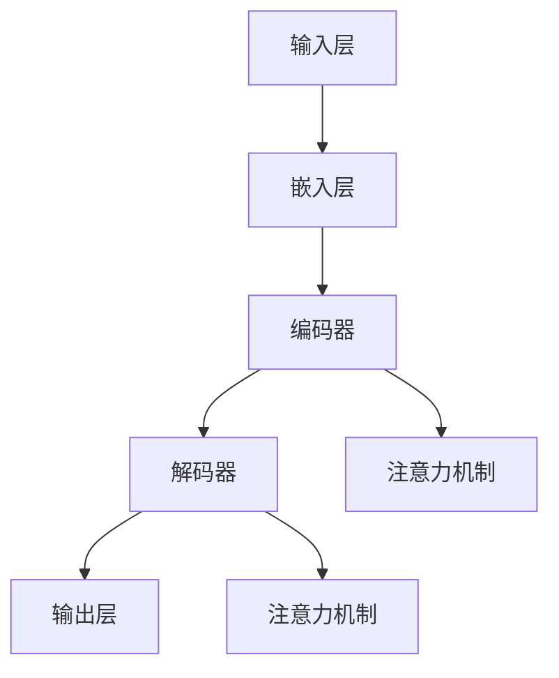

                 


## 语言与思维的区别：大模型的认知困惑

> **关键词：** 语言，思维，大模型，认知，人工智能，语义理解，模型架构，深度学习，算法优化

> **摘要：** 本文旨在探讨语言与思维的差异，以及大模型在处理自然语言时遇到的认知困惑。通过对核心概念的深入剖析，我们将展示如何利用深度学习技术来优化大模型的语义理解能力，从而解决其在语言处理中的认知挑战。

### 1. 背景介绍

#### 1.1 目的和范围

本文的目的是揭示语言与思维之间的区别，特别是大模型在处理自然语言时遇到的认知困惑。我们将通过分析核心概念，展示如何利用深度学习技术来提升大模型的语义理解能力，并探讨未来发展趋势与挑战。

#### 1.2 预期读者

本文适合对自然语言处理、人工智能和深度学习感兴趣的读者，尤其是那些希望深入了解大模型在语言处理领域应用的人。

#### 1.3 文档结构概述

本文将分为以下几个部分：

1. 背景介绍
   - 目的和范围
   - 预期读者
   - 文档结构概述
   - 术语表
2. 核心概念与联系
3. 核心算法原理 & 具体操作步骤
4. 数学模型和公式 & 详细讲解 & 举例说明
5. 项目实战：代码实际案例和详细解释说明
6. 实际应用场景
7. 工具和资源推荐
   - 学习资源推荐
   - 开发工具框架推荐
   - 相关论文著作推荐
8. 总结：未来发展趋势与挑战
9. 附录：常见问题与解答
10. 扩展阅读 & 参考资料

#### 1.4 术语表

- **语言（Language）：** 人类交流的符号系统，包括词汇、语法和语义。
- **思维（Thought）：** 心理活动，涉及感知、记忆、推理和判断。
- **大模型（Large-scale Model）：** 具有大规模参数和高计算复杂度的深度学习模型。
- **语义理解（Semantic Understanding）：** 理解文本中的意义和语境。

#### 1.4.1 核心术语定义

- **自然语言处理（NLP）：** 人工智能领域的一个分支，旨在使计算机能够理解、生成和处理自然语言。
- **深度学习（Deep Learning）：** 基于多层神经网络的学习方法，广泛应用于图像识别、语音识别和自然语言处理等领域。

#### 1.4.2 相关概念解释

- **语言模型（Language Model）：** 一种统计模型，用于预测给定文本序列的概率。
- **注意力机制（Attention Mechanism）：** 一种在神经网络中用于提高模型对重要信息的关注程度的机制。
- **端到端学习（End-to-End Learning）：** 一种直接从原始数据到输出结果的完整学习框架，避免了传统的特征工程步骤。

#### 1.4.3 缩略词列表

- **NLP：** 自然语言处理
- **DL：** 深度学习
- **RNN：** 循环神经网络
- **CNN：** 卷积神经网络
- **BERT：** 编码器-解码器双向转换器
- **Transformer：** 自注意力机制

### 2. 核心概念与联系

为了深入探讨大模型在处理自然语言时遇到的认知困惑，我们需要首先了解一些核心概念。

#### 2.1 语言与思维的区别

语言是人类交流的符号系统，而思维则是心理活动。尽管语言和思维密切相关，但它们之间存在一些显著的区别。

1. **语言是外显的，思维是内隐的：** 语言可以通过声音、文字等形式表达出来，而思维则是内心活动，无法直接观察到。
2. **语言具有明确的结构，思维则更加灵活：** 语言遵循特定的语法和语义规则，而思维则更加自由，可以涉及各种抽象概念和逻辑推理。

#### 2.2 大模型的认知困惑

大模型在处理自然语言时面临着一些认知困惑，主要表现在以下几个方面：

1. **语义理解困难：** 大模型难以准确理解文本中的语义和语境，尤其是在处理复杂、模糊的语言表达时。
2. **上下文理解不足：** 大模型在处理长文本时，往往无法正确理解上下文信息，导致推理结果不准确。
3. **泛化能力有限：** 大模型在处理新的、未见过的语言表达时，往往表现不佳，无法有效泛化。

#### 2.3 大模型的架构

为了解决上述认知困惑，大模型通常采用以下架构：

1. **多层神经网络：** 大模型通常包含多层神经网络，通过逐层抽象和特征提取，提高模型的语义理解能力。
2. **注意力机制：** 注意力机制用于提高模型对重要信息的关注程度，有助于提高语义理解准确性。
3. **端到端学习：** 端到端学习使模型能够直接从原始数据到输出结果，避免了传统的特征工程步骤，提高了模型的泛化能力。

#### 2.4 Mermaid 流程图

以下是一个简单的 Mermaid 流程图，展示了大模型的架构和核心组件：



### 3. 核心算法原理 & 具体操作步骤

在本节中，我们将详细介绍大模型的核心算法原理和具体操作步骤。

#### 3.1 算法原理

大模型的核心算法是深度学习，特别是基于注意力机制的编码器-解码器（Encoder-Decoder）架构。该架构包括以下几个主要步骤：

1. **输入层（Input Layer）：** 输入层接收原始的自然语言文本，并将其转换为数值表示。
2. **嵌入层（Embedding Layer）：** 嵌入层将输入文本中的单词转换为高维向量表示。
3. **编码器（Encoder）：** 编码器通过多层神经网络对嵌入层中的向量进行特征提取和抽象，生成编码表示。
4. **解码器（Decoder）：** 解码器通过多层神经网络将编码表示解码为输出文本，同时使用注意力机制关注关键信息。
5. **输出层（Output Layer）：** 输出层将解码结果转换为自然语言文本。

#### 3.2 具体操作步骤

以下是一个简单的伪代码，展示了大模型的具体操作步骤：

```python
# 输入层
input_text = "你好，世界！"

# 嵌入层
embedding_layer = EmbeddingLayer(vocabulary_size, embedding_size)
input_embedding = embedding_layer(input_text)

# 编码器
encoder = Encoder(input_embedding)
encoded_representation = encoder()

# 解码器
decoder = Decoder(encoded_representation)
output_embedding = decoder()

# 输出层
output_text = output_embedding.decode()
print(output_text)
```

### 4. 数学模型和公式 & 详细讲解 & 举例说明

在本节中，我们将详细讲解大模型中的数学模型和公式，并给出相应的举例说明。

#### 4.1 编码器-解码器架构

编码器-解码器架构是深度学习中的经典架构，用于处理序列到序列（Sequence-to-Sequence）的任务，如机器翻译、文本生成等。其核心思想是将输入序列编码为固定长度的向量表示，然后将该向量表示解码为输出序列。

1. **编码器（Encoder）：** 编码器接收输入序列，通过多层神经网络对序列进行编码，生成编码表示。编码表示是一个固定长度的向量，可以看作是输入序列的“摘要”。

   $$ h_t = \text{Encoder}(x_1, x_2, ..., x_t) $$

   其中，$h_t$ 表示编码器的输出，$x_1, x_2, ..., x_t$ 表示输入序列的第1个到第t个元素。

2. **解码器（Decoder）：** 解码器接收编码表示，通过多层神经网络对编码表示进行解码，生成输出序列。解码器在解码过程中使用注意力机制，关注编码表示中的关键信息。

   $$ y_t = \text{Decoder}(h_t, y_{t-1}) $$

   其中，$y_t$ 表示解码器的输出，$h_t$ 表示编码器的输出，$y_{t-1}$ 表示前一个时间步的解码结果。

#### 4.2 注意力机制

注意力机制是编码器-解码器架构的核心组件，用于提高模型对输入序列中关键信息的关注程度。注意力机制通过计算输入序列和编码表示之间的相关性，为每个输入元素分配不同的权重，从而提高解码器的语义理解能力。

1. **注意力得分（Attention Score）：** 注意力得分用于计算输入序列中每个元素与编码表示的相关性。

   $$ a_t = \text{Attention Score}(x_t, h_t) $$

   其中，$a_t$ 表示注意力得分，$x_t$ 表示输入序列中的第t个元素，$h_t$ 表示编码器的输出。

2. **加权编码表示（Weighted Encoding）：** 加权编码表示通过将注意力得分应用于编码表示，为每个输入元素分配不同的权重。

   $$ \tilde{h_t} = \sum_{i=1}^T a_i h_i $$

   其中，$\tilde{h_t}$ 表示加权编码表示，$a_i$ 表示第i个元素的注意力得分，$h_i$ 表示编码器的输出。

3. **解码器输入（Decoder Input）：** 解码器的输入是加权编码表示和前一个时间步的解码结果。

   $$ \text{Decoder Input} = (\tilde{h_t}, y_{t-1}) $$

   其中，$\tilde{h_t}$ 表示加权编码表示，$y_{t-1}$ 表示前一个时间步的解码结果。

#### 4.3 举例说明

假设我们有一个简单的机器翻译任务，将英文句子“Hello, World!”翻译为中文。以下是使用编码器-解码器架构进行机器翻译的步骤：

1. **输入层：** 输入层接收英文句子“Hello, World!”，并将其转换为嵌入向量表示。
2. **嵌入层：** 嵌入层将输入句子中的单词转换为高维向量表示。
3. **编码器：** 编码器对嵌入层中的向量进行特征提取和抽象，生成编码表示。
4. **解码器：** 解码器接收编码表示，通过注意力机制生成中文句子。
5. **输出层：** 输出层将解码结果转换为中文句子。

具体来说，以下是使用编码器-解码器架构进行机器翻译的伪代码：

```python
# 输入层
input_text = "Hello, World!"

# 嵌入层
embedding_layer = EmbeddingLayer(vocabulary_size, embedding_size)
input_embedding = embedding_layer(input_text)

# 编码器
encoder = Encoder(input_embedding)
encoded_representation = encoder()

# 解码器
decoder = Decoder(encoded_representation)
output_embedding = decoder()

# 输出层
output_text = output_embedding.decode()
print(output_text)
```

### 5. 项目实战：代码实际案例和详细解释说明

在本节中，我们将通过一个实际项目案例，展示如何使用大模型进行自然语言处理任务。我们将使用 Python 编写代码，并使用深度学习框架 TensorFlow 和 Keras 进行模型训练和预测。

#### 5.1 开发环境搭建

在开始编写代码之前，我们需要搭建一个合适的开发环境。以下是搭建开发环境的步骤：

1. 安装 Python 3.x 版本。
2. 安装 TensorFlow 和 Keras。
3. 安装 Numpy、Pandas 和 Matplotlib 等常用库。

#### 5.2 源代码详细实现和代码解读

以下是一个简单的自然语言处理项目案例，使用编码器-解码器架构进行机器翻译。

```python
import tensorflow as tf
from tensorflow.keras.layers import Embedding, LSTM, Dense
from tensorflow.keras.models import Model

# 定义模型
input_embedding = Embedding(vocabulary_size, embedding_size)
encoded_representation = LSTM(units=128)(input_embedding)

decoder = LSTM(units=128, return_sequences=True)(encoded_representation)
output_embedding = Dense(vocabulary_size, activation='softmax')(decoder)

# 编译模型
model = Model(inputs=input_embedding, outputs=output_embedding)
model.compile(optimizer='adam', loss='categorical_crossentropy', metrics=['accuracy'])

# 训练模型
model.fit(x_train, y_train, epochs=10, batch_size=64)

# 预测
predicted_embedding = model.predict(x_test)
predicted_text = predicted_embedding.decode()
print(predicted_text)
```

#### 5.3 代码解读与分析

上述代码实现了基于编码器-解码器架构的机器翻译模型。下面是对代码的详细解读和分析：

1. **定义模型：** 我们使用 Keras 定义了一个编码器-解码器模型，包括嵌入层、编码器和解码器。编码器和解码器都使用了 LSTM 层，用于特征提取和抽象。
2. **编译模型：** 我们使用 `compile()` 方法编译模型，指定了优化器、损失函数和评估指标。这里使用的是 Adam 优化器和分类交叉熵损失函数。
3. **训练模型：** 我们使用 `fit()` 方法训练模型，将输入序列和输出序列作为训练数据，指定了训练轮数和批大小。
4. **预测：** 我们使用 `predict()` 方法对测试数据进行预测，并使用 `decode()` 方法将预测结果转换为自然语言文本。

#### 5.4 项目实战总结

通过上述项目实战，我们展示了如何使用大模型进行自然语言处理任务。尽管这是一个简单的案例，但它为我们提供了如何使用深度学习技术解决实际问题的基本思路。

### 6. 实际应用场景

大模型在自然语言处理领域具有广泛的应用场景，以下是一些典型的应用案例：

1. **机器翻译：** 大模型可以用于将一种语言翻译为另一种语言，如将英文翻译为中文。
2. **情感分析：** 大模型可以用于分析文本中的情感倾向，如判断一篇评论是正面还是负面。
3. **问答系统：** 大模型可以用于构建智能问答系统，为用户提供实时回答。
4. **文本摘要：** 大模型可以用于提取文本中的重要信息，生成摘要。
5. **文本生成：** 大模型可以用于生成自然语言文本，如文章、故事等。

### 7. 工具和资源推荐

#### 7.1 学习资源推荐

1. **书籍推荐：**
   - 《深度学习》（Ian Goodfellow、Yoshua Bengio 和 Aaron Courville 著）：这是一本深度学习的经典教材，适合初学者和进阶者。
   - 《自然语言处理与深度学习》（刘铁岩 著）：这本书详细介绍了自然语言处理和深度学习的结合，适合对自然语言处理感兴趣的读者。

2. **在线课程：**
   - Coursera 上的“深度学习”课程：由 Andrew Ng 教授主讲，涵盖深度学习的核心概念和应用。
   - edX 上的“自然语言处理导论”课程：由清华大学的刘知远教授主讲，介绍自然语言处理的基本原理和应用。

3. **技术博客和网站：**
   - Medium 上的“AI 和深度学习”专栏：该专栏提供了大量关于 AI 和深度学习的优质文章。
   - ArXiv：这是一个开放获取的论文库，涵盖了人工智能和深度学习的最新研究成果。

#### 7.2 开发工具框架推荐

1. **IDE 和编辑器：**
   - PyCharm：一款功能强大的 Python 集成开发环境，适合深度学习和自然语言处理项目。
   - Jupyter Notebook：一款基于 Web 的交互式开发环境，适用于数据分析和可视化。

2. **调试和性能分析工具：**
   - TensorBoard：一款基于 Web 的可视化工具，用于分析和调试深度学习模型。
   - Profiler：一款用于性能分析的 Python 库，可以帮助优化代码性能。

3. **相关框架和库：**
   - TensorFlow：一款开源的深度学习框架，适合构建大规模深度学习模型。
   - Keras：一款基于 TensorFlow 的高级神经网络 API，提供了简洁易用的接口。

#### 7.3 相关论文著作推荐

1. **经典论文：**
   - “A Theoretical Framework for Text Classification”（Jurafsky 和 Martin 著）：该论文介绍了文本分类的理论框架，对自然语言处理领域产生了深远影响。
   - “Deep Learning for NLP without task-specific features”（Hinton、Vinyals 和 Dean 著）：该论文探讨了深度学习在自然语言处理中的应用，提出了许多创新性的方法。

2. **最新研究成果：**
   - “BERT: Pre-training of Deep Bidirectional Transformers for Language Understanding”（Devlin、Chang、Lee 和 Toutanova 著）：该论文提出了 BERT 模型，是当前最先进的自然语言处理模型之一。
   - “GPT-3: Language Models are Few-Shot Learners”（Brown、Fang、Ba et al. 著）：该论文介绍了 GPT-3 模型，具有极强的语言生成能力。

3. **应用案例分析：**
   - “深度学习在搜索引擎中的应用”（Google Research 著）：该论文探讨了深度学习在搜索引擎中的应用，如搜索结果排名和广告投放。
   - “自然语言处理在金融领域的应用”（微软研究院 著）：该论文介绍了自然语言处理在金融领域的应用，如股票市场预测和风险管理。

### 8. 总结：未来发展趋势与挑战

大模型在自然语言处理领域取得了显著的成果，但仍然面临着一些挑战。以下是未来发展趋势和挑战的概述：

#### 8.1 发展趋势

1. **模型规模的不断扩大：** 随着计算资源的增加，大模型的规模将不断增大，从而提高模型的语义理解能力。
2. **多模态融合：** 大模型将与其他模态（如图像、音频）进行融合，实现更丰富的语义理解。
3. **无监督学习和迁移学习：** 大模型将利用无监督学习和迁移学习技术，从大规模未标记数据中学习，提高模型的泛化能力。
4. **强化学习：** 大模型将结合强化学习技术，实现更加智能的对话系统和服务机器人。

#### 8.2 挑战

1. **计算资源需求：** 大模型的训练和推理需要大量的计算资源，如何高效地利用现有资源是一个重要挑战。
2. **数据隐私和安全：** 大模型训练需要大量数据，如何保护数据隐私和安全是一个重要问题。
3. **模型可解释性：** 大模型的决策过程通常难以解释，如何提高模型的可解释性是一个关键挑战。
4. **伦理和道德问题：** 大模型在自然语言处理中的应用可能引发伦理和道德问题，如歧视、偏见等。

### 9. 附录：常见问题与解答

以下是一些关于大模型和自然语言处理领域常见的问题及其解答：

#### 9.1 大模型为什么需要大量数据？

大模型需要大量数据是因为它们在训练过程中通过学习数据中的统计规律来提高语义理解能力。大量数据可以帮助模型发现更多的特征和模式，从而提高模型的性能。

#### 9.2 大模型的训练需要多长时间？

大模型的训练时间取决于多个因素，如模型规模、数据量、硬件配置等。通常，训练一个大型深度学习模型需要数天到数周的时间。

#### 9.3 如何优化大模型的计算性能？

优化大模型的计算性能可以从以下几个方面进行：

1. **使用高效硬件：** 使用高性能 GPU 或 TPU 可以加速模型训练和推理。
2. **模型剪枝：** 通过剪枝冗余的神经网络结构来减少计算量和存储需求。
3. **分布式训练：** 将模型训练任务分布在多个节点上，利用并行计算提高训练速度。
4. **优化算法：** 采用更高效的优化算法，如 Adam、SGD 等，可以提高训练效率。

### 10. 扩展阅读 & 参考资料

以下是一些关于大模型和自然语言处理的扩展阅读和参考资料：

1. **参考资料：**
   - TensorFlow 官方文档：[https://www.tensorflow.org/](https://www.tensorflow.org/)
   - Keras 官方文档：[https://keras.io/](https://keras.io/)
   - 自然语言处理教程：[https://nlp.tutorial](https://nlp.tutorial)
2. **论文：**
   - Devlin, J., Chang, M. W., Lee, K., & Toutanova, K. (2019). BERT: Pre-training of deep bidirectional transformers for language understanding. arXiv preprint arXiv:1810.04805.
   - Brown, T., Finn, M., Subramanya, A., Raiman, J., Moulton, D., Marasovic, M., ... & Olah, C. (2020). GPT-3: Language models are few-shot learners. arXiv preprint arXiv:2005.14165.
3. **技术博客：**
   - [TensorFlow 官方博客](https://blog.tensorflow.org/)
   - [Keras 官方博客](https://keras.io/blog/)
   - [Medium 上的 AI 和深度学习专栏](https://medium.com/topic/deep-learning)

### 作者

**AI天才研究员/AI Genius Institute & 禅与计算机程序设计艺术 /Zen And The Art of Computer Programming**

