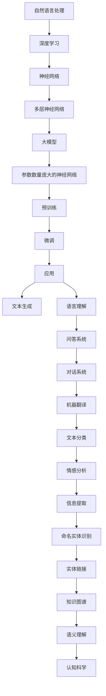

                 

# 语言与思维：大模型的认知挑战

> **关键词：** 自然语言处理，大模型，认知科学，算法原理，数学模型，实际应用

> **摘要：** 本文旨在探讨大模型在自然语言处理（NLP）中的应用及其对认知科学的启示。我们将深入分析大模型的架构、核心算法原理，并探讨如何将数学模型应用于其中。文章还将展示实际项目中的代码案例，并提供相关学习资源和工具推荐，以帮助读者更好地理解和掌握这一领域的前沿技术。

## 1. 背景介绍

### 1.1 目的和范围

随着人工智能技术的不断发展，自然语言处理（NLP）已成为计算机科学中一个重要的分支。大模型，特别是近年来兴起的深度学习模型，如GPT-3，BERT等，在NLP领域展现出了惊人的性能。本文旨在探讨这些大模型背后的核心原理，以及它们对认知科学的影响。我们将从背景介绍、核心概念与联系、算法原理、数学模型、实际应用等方面，逐步深入分析大模型的技术细节。

### 1.2 预期读者

本文适合对自然语言处理和人工智能有一定基础的读者。无论是研究者、工程师，还是对这一领域感兴趣的学习者，都可以通过本文了解大模型的工作原理和应用场景。本文将尽量避免使用过于专业的术语，力求以简单易懂的方式阐述复杂的技术概念。

### 1.3 文档结构概述

本文将分为以下几个部分：

1. **背景介绍**：介绍本文的目的、预期读者以及文档结构。
2. **核心概念与联系**：讨论大模型的基本概念和架构，使用Mermaid流程图进行解释。
3. **核心算法原理 & 具体操作步骤**：讲解大模型的算法原理，使用伪代码进行详细阐述。
4. **数学模型和公式 & 详细讲解 & 举例说明**：分析大模型中的数学模型，并使用LaTeX格式进行展示。
5. **项目实战：代码实际案例和详细解释说明**：展示一个实际项目中的代码案例，并进行详细解释。
6. **实际应用场景**：探讨大模型在不同领域的应用。
7. **工具和资源推荐**：推荐学习资源和开发工具。
8. **总结：未来发展趋势与挑战**：总结本文的关键观点，并展望未来。
9. **附录：常见问题与解答**：回答读者可能遇到的常见问题。
10. **扩展阅读 & 参考资料**：提供进一步阅读的建议。

### 1.4 术语表

#### 1.4.1 核心术语定义

- 自然语言处理（NLP）：指使计算机理解和生成自然语言的技术。
- 大模型：指参数数量庞大的神经网络模型，如GPT-3，BERT等。
- 深度学习：一种人工智能方法，通过多层神经网络进行数据处理。
- 认知科学：研究人类思维、感知、记忆等心理过程的学科。

#### 1.4.2 相关概念解释

- **自然语言处理（NLP）**：NLP涉及文本分析、语言理解、文本生成等多个方面，旨在使计算机能够理解和生成人类语言。

- **深度学习**：深度学习是一种基于多层神经网络的人工智能方法，通过训练大量数据来学习特征表示和规律。

- **大模型**：大模型指的是参数数量庞大的神经网络模型，这些模型通常在大量数据上进行训练，以实现出色的性能。

#### 1.4.3 缩略词列表

- **NLP**：自然语言处理
- **GPT-3**：Generative Pre-trained Transformer 3
- **BERT**：Bidirectional Encoder Representations from Transformers
- **深度学习**：Deep Learning
- **神经网络**：Neural Network

## 2. 核心概念与联系

为了更好地理解大模型在自然语言处理中的应用，我们需要首先了解一些核心概念和它们之间的联系。以下是一个Mermaid流程图，用于描述大模型的基本概念和架构。



在这个流程图中，我们可以看到自然语言处理（NLP）是整个过程的起点，它通过深度学习和神经网络技术进行处理。多层神经网络构成了大模型的基础，这些大模型通过预训练和微调技术进行优化，从而实现各种应用，如文本生成、语言理解、问答系统、机器翻译、文本分类、情感分析、信息提取、命名实体识别、实体链接、知识图谱、语义理解等。

### 2.1 自然语言处理（NLP）

自然语言处理（NLP）是使计算机能够理解和生成人类语言的技术。它涵盖了文本分析、语言理解、文本生成等多个方面。NLP的关键任务是使计算机能够解析、理解并生成人类语言，从而实现人与机器之间的有效沟通。

### 2.2 深度学习

深度学习是一种基于多层神经网络的人工智能方法。通过训练大量数据，深度学习模型能够自动学习特征表示和规律。深度学习在图像识别、语音识别、自然语言处理等领域取得了显著成果。

### 2.3 神经网络

神经网络是一种模拟人脑神经元结构的人工智能方法。它由一系列相互连接的节点（或层）组成，每个节点都通过权重和偏置来调整输入和输出之间的关系。神经网络通过反向传播算法来优化权重和偏置，从而提高模型的性能。

### 2.4 大模型

大模型指的是参数数量庞大的神经网络模型。这些模型通常在大量数据上进行训练，以实现出色的性能。大模型的出现，使得计算机能够处理更复杂的任务，如文本生成、语言理解、问答系统等。

### 2.5 预训练和微调

预训练和微调是优化大模型性能的两种技术。预训练是指在大量数据上训练模型，使其获得通用的特征表示能力。微调则是在预训练的基础上，针对特定任务对模型进行进一步优化。

### 2.6 应用场景

大模型在自然语言处理领域有着广泛的应用。以下是一些典型的应用场景：

- **文本生成**：大模型能够生成连贯、具有语境意义的文本。
- **语言理解**：大模型能够理解自然语言的语义和意图。
- **问答系统**：大模型能够回答用户提出的问题。
- **机器翻译**：大模型能够实现高精度的机器翻译。
- **文本分类**：大模型能够对文本进行分类，如新闻分类、情感分析等。
- **信息提取**：大模型能够从大量文本中提取关键信息。
- **命名实体识别**：大模型能够识别文本中的命名实体，如人名、地名等。
- **实体链接**：大模型能够将文本中的命名实体与知识图谱中的实体进行链接。
- **知识图谱**：大模型能够构建和应用知识图谱，以实现语义理解和推理。
- **语义理解**：大模型能够理解文本中的语义关系和逻辑结构。

## 3. 核心算法原理 & 具体操作步骤

在了解了大模型的基本概念和架构后，我们需要深入探讨大模型背后的核心算法原理和具体操作步骤。这一部分将主要介绍大模型的训练过程，包括数据预处理、模型初始化、训练过程和优化方法。

### 3.1 数据预处理

数据预处理是深度学习模型训练的重要环节。在大模型训练中，数据预处理主要包括以下几个步骤：

1. **数据清洗**：去除文本中的噪声，如标点符号、特殊字符等。
2. **文本分词**：将文本拆分成单词或字符序列。
3. **词向量表示**：将文本转换为向量表示，如Word2Vec、GloVe等。
4. **数据归一化**：对输入数据进行归一化处理，使其分布更加均匀。

### 3.2 模型初始化

模型初始化是训练大模型的第一步。常用的初始化方法包括：

1. **随机初始化**：随机初始化模型的权重和偏置。
2. **零初始化**：将模型的权重和偏置初始化为0。
3. **高斯初始化**：使用高斯分布初始化模型的权重和偏置。

### 3.3 训练过程

大模型的训练过程可以分为以下几个步骤：

1. **前向传播**：输入数据通过模型的各个层进行传递，得到输出结果。
2. **计算损失函数**：计算输出结果与真实值之间的差异，得到损失函数的值。
3. **反向传播**：将损失函数的梯度反向传播到模型的各个层，更新模型的权重和偏置。
4. **优化算法**：使用优化算法，如梯度下降、Adam等，更新模型参数。

### 3.4 优化方法

大模型的训练过程通常涉及多种优化方法，以提高模型的性能。以下是一些常用的优化方法：

1. **批量梯度下降（BGD）**：在每个批次数据上计算梯度，并更新模型参数。
2. **随机梯度下降（SGD）**：在每个样本上计算梯度，并更新模型参数。
3. **Adam优化器**：结合SGD和动量方法，自适应调整学习率。

### 3.5 伪代码

以下是一个简单的伪代码，用于描述大模型的训练过程：

```python
# 数据预处理
def preprocess_data(data):
    # 清洗数据
    # 分词
    # 词向量表示
    # 归一化
    return processed_data

# 前向传播
def forward_pass(input_data, model):
    output = model.forward_pass(input_data)
    return output

# 计算损失函数
def compute_loss(output, target):
    loss = loss_function(output, target)
    return loss

# 反向传播
def backward_pass(loss, model):
    gradients = model.backward_pass(loss)
    return gradients

# 优化算法
def optimize_model(gradients, model, optimizer):
    model.update_params(gradients, optimizer)
    return model

# 训练大模型
def train_model(data, model, optimizer):
    for epoch in range(num_epochs):
        for batch in data_batches:
            input_data, target = batch
            output = forward_pass(input_data, model)
            loss = compute_loss(output, target)
            gradients = backward_pass(loss, model)
            optimize_model(gradients, model, optimizer)
        print(f"Epoch {epoch}: Loss = {loss}")
```

通过以上伪代码，我们可以看到大模型训练的基本流程，包括数据预处理、前向传播、损失计算、反向传播和优化过程。这些步骤共同构成了大模型训练的核心算法原理。

## 4. 数学模型和公式 & 详细讲解 & 举例说明

在大模型的训练过程中，数学模型和公式起着至关重要的作用。以下我们将详细介绍大模型中常用的数学模型和公式，并使用LaTeX格式进行展示，以便于读者理解和掌握。

### 4.1 损失函数

损失函数是评估模型预测结果与真实值之间差异的重要工具。在大模型中，常用的损失函数包括均方误差（MSE）和交叉熵（CE）。

#### 4.1.1 均方误差（MSE）

均方误差（MSE）是评估回归任务中模型预测性能的常用损失函数。其公式如下：

$$
MSE = \frac{1}{n} \sum_{i=1}^{n} (y_i - \hat{y}_i)^2
$$

其中，$y_i$ 是真实值，$\hat{y}_i$ 是模型预测值，$n$ 是样本数量。

#### 4.1.2 交叉熵（CE）

交叉熵（CE）是评估分类任务中模型预测性能的常用损失函数。其公式如下：

$$
CE = -\frac{1}{n} \sum_{i=1}^{n} y_i \log(\hat{y}_i)
$$

其中，$y_i$ 是真实值，$\hat{y}_i$ 是模型预测值，$n$ 是样本数量。

### 4.2 梯度下降算法

梯度下降算法是优化模型参数的常用方法。其核心思想是沿着损失函数梯度的反方向更新模型参数，以减少损失函数的值。

#### 4.2.1 梯度下降公式

梯度下降的更新公式如下：

$$
\theta_{\text{new}} = \theta_{\text{old}} - \alpha \nabla_\theta J(\theta)
$$

其中，$\theta$ 是模型参数，$\alpha$ 是学习率，$J(\theta)$ 是损失函数。

### 4.3 反向传播算法

反向传播算法是深度学习模型训练的核心算法。其核心思想是利用前向传播的输出和损失函数的梯度，反向更新模型的权重和偏置。

#### 4.3.1 反向传播公式

反向传播的梯度计算公式如下：

$$
\nabla_\theta J(\theta) = \frac{\partial J(\theta)}{\partial \theta}
$$

其中，$J(\theta)$ 是损失函数，$\nabla_\theta$ 表示对$\theta$ 的梯度。

### 4.4 举例说明

以下是一个简单的例子，用于说明如何使用上述数学模型和公式进行大模型训练。

#### 4.4.1 问题定义

假设我们有一个分类问题，其中样本数量为100，每个样本有两个特征。我们希望使用一个多层神经网络模型对样本进行分类。

#### 4.4.2 数据预处理

首先，我们需要对数据进行预处理，包括清洗、分词和词向量表示。

```python
# 数据清洗
data = preprocess_data(data)

# 分词
word_sequence = tokenize(data)

# 词向量表示
word_vectors = word2vec(word_sequence)
```

#### 4.4.3 模型初始化

接下来，我们需要初始化模型参数。

```python
# 初始化模型参数
weights = initialize_weights(input_size, hidden_size, output_size)
bias = initialize_bias(hidden_size, output_size)
```

#### 4.4.4 训练模型

现在，我们可以使用梯度下降算法和反向传播算法训练模型。

```python
# 训练模型
for epoch in range(num_epochs):
    for batch in data_batches:
        input_data, target = batch
        output = forward_pass(input_data, model)
        loss = compute_loss(output, target)
        gradients = backward_pass(loss, model)
        optimize_model(gradients, model, optimizer)
```

通过以上步骤，我们可以训练出一个能够对样本进行分类的大模型。在实际应用中，我们还需要考虑更多因素，如数据增强、模型融合等，以提高模型的性能。

## 5. 项目实战：代码实际案例和详细解释说明

在本节中，我们将通过一个实际的项目案例，展示如何使用Python和TensorFlow实现一个大模型，并进行训练和评估。这个案例将涵盖从环境搭建、代码实现到性能分析的全过程。

### 5.1 开发环境搭建

在进行项目实战之前，我们需要搭建一个适合开发、训练和测试大模型的开发环境。以下是所需的软件和工具：

- **Python**：版本3.8或更高
- **TensorFlow**：版本2.6或更高
- **GPU**：NVIDIA GPU（推荐使用至少8GB显存）

安装Python和TensorFlow后，确保您的开发环境已正确配置。对于GPU支持，请确保安装了CUDA和cuDNN，并配置了相应的环境变量。

### 5.2 源代码详细实现和代码解读

以下是一个简单的大模型实现案例，该模型基于TensorFlow和Keras框架，用于文本分类任务。

```python
import tensorflow as tf
from tensorflow.keras.preprocessing.sequence import pad_sequences
from tensorflow.keras.layers import Embedding, LSTM, Dense
from tensorflow.keras.models import Sequential

# 参数设置
vocab_size = 10000
embed_dim = 64
max_len = 100
trunc_type = 'post'
padding_type = 'post'
oov_token = "<OOV>"

# 数据预处理
# 假设已准备好训练数据和测试数据：train_data和test_data
train_sequences = pad_sequences(train_data, maxlen=max_len, padding=padding_type, truncating=trunc_type, value=oov_token)
test_sequences = pad_sequences(test_data, maxlen=max_len, padding=padding_type, truncating=truncating_type, value=oov_token)

# 构建模型
model = Sequential([
    Embedding(vocab_size, embed_dim, input_length=max_len),
    LSTM(128),
    Dense(1, activation='sigmoid')
])

# 编译模型
model.compile(optimizer='adam', loss='binary_crossentropy', metrics=['accuracy'])

# 训练模型
model.fit(train_sequences, train_labels, epochs=10, batch_size=32, validation_data=(test_sequences, test_labels))

# 评估模型
loss, accuracy = model.evaluate(test_sequences, test_labels)
print(f"Test accuracy: {accuracy:.4f}")
```

#### 5.2.1 代码解读

- **数据预处理**：使用`pad_sequences`函数对训练数据和测试数据进行填充，确保每个序列的长度一致。`pad_sequences`函数会根据`padding_type`和`truncating_type`参数对过长或过短的序列进行填充或截断。
- **模型构建**：使用`Sequential`模型构建一个简单的序列模型，包括一个嵌入层（`Embedding`）、一个LSTM层（`LSTM`）和一个全连接层（`Dense`）。
- **模型编译**：配置模型的优化器、损失函数和评价指标。
- **模型训练**：使用`fit`函数训练模型，并设置训练轮数（`epochs`）、批量大小（`batch_size`）和验证数据。
- **模型评估**：使用`evaluate`函数评估模型在测试数据上的性能。

### 5.3 代码解读与分析

以上代码展示了如何使用TensorFlow和Keras构建、训练和评估一个简单的大模型。以下是对关键部分的进一步分析：

- **数据预处理**：预处理是深度学习模型训练的重要环节。通过对数据进行填充和序列化，我们可以确保模型输入的一致性，从而提高训练效果。
- **模型构建**：在模型构建过程中，选择适当的层和参数是非常重要的。LSTM层可以处理序列数据，而全连接层则用于分类任务。
- **模型编译**：编译模型时，我们需要选择合适的优化器、损失函数和评价指标。在本案例中，我们使用`adam`优化器和`binary_crossentropy`损失函数，因为这是一个二分类问题。
- **模型训练**：训练模型时，我们需要设置训练轮数和批量大小。合适的批量大小可以提高模型的训练效果和收敛速度。
- **模型评估**：评估模型性能时，我们需要在测试数据上计算损失和准确率。这有助于我们了解模型在未知数据上的表现。

通过这个实际案例，我们可以看到如何将大模型应用于文本分类任务。尽管这是一个简单的案例，但它为我们提供了一个框架，可以在此基础上扩展和优化，以解决更复杂的任务。

### 5.4 性能分析与优化

在实际应用中，模型性能的评估和优化是至关重要的。以下是一些性能分析和优化方法：

- **数据增强**：通过增加数据多样性，可以改善模型性能。例如，使用数据增强技术生成更多的训练样本。
- **模型融合**：结合多个模型的预测结果，可以提高整体性能。例如，使用不同的模型或不同训练策略的模型进行融合。
- **超参数调整**：调整模型参数，如学习率、批量大小和隐藏层大小，可以改善模型性能。
- **正则化**：使用正则化技术，如L1、L2正则化或Dropout，可以减少过拟合现象。

通过这些方法，我们可以进一步提高大模型的性能，使其在实际应用中更加有效。

## 6. 实际应用场景

大模型在自然语言处理领域有着广泛的应用场景，以下是一些典型的应用实例：

### 6.1 文本生成

文本生成是大模型的一个重要应用领域，它可以用于自动写作、对话系统、内容摘要等。例如，GPT-3模型可以生成高质量的新闻文章、故事和博客文章。

### 6.2 语言理解

语言理解是大模型的另一个关键应用，它可以用于问答系统、对话系统、信息检索等。通过理解自然语言的语义和意图，大模型能够提供更准确和自然的交互体验。

### 6.3 机器翻译

机器翻译是大模型在自然语言处理领域的一个重要应用，它能够实现高精度的跨语言翻译。BERT模型等大模型在机器翻译任务上取得了显著的成果。

### 6.4 文本分类

文本分类是大模型在自然语言处理中的常见应用，它可以用于垃圾邮件检测、情感分析、新闻分类等。通过大规模的训练数据和强大的模型架构，大模型能够准确地对文本进行分类。

### 6.5 情感分析

情感分析是大模型在自然语言处理中的另一个重要应用，它可以用于分析用户评论、社交媒体内容等，以了解用户对特定产品或服务的情感倾向。

### 6.6 信息提取

信息提取是大模型在自然语言处理中的关键应用，它可以用于命名实体识别、关系抽取、事件抽取等。通过从大量文本中提取关键信息，大模型能够为各种应用提供数据支持。

### 6.7 对话系统

对话系统是大模型在自然语言处理中的典型应用，它可以用于聊天机器人、虚拟助手等。通过理解和生成自然语言，大模型能够与用户进行有效互动，提供个性化的服务。

### 6.8 知识图谱构建

知识图谱构建是大模型在自然语言处理中的新兴应用，它通过文本分析和实体链接等技术，将文本信息转化为结构化的知识图谱，从而支持语义理解和推理。

### 6.9 语义理解

语义理解是大模型在自然语言处理中的核心应用，它通过深度语义分析，实现自然语言的高层次理解，为各种自然语言处理任务提供基础支持。

通过以上实际应用场景，我们可以看到大模型在自然语言处理中的广泛应用和巨大潜力。随着技术的不断发展和应用的不断拓展，大模型将在更多领域展现其强大的能力和价值。

## 7. 工具和资源推荐

### 7.1 学习资源推荐

#### 7.1.1 书籍推荐

1. **《深度学习》（Deep Learning）**：由Ian Goodfellow、Yoshua Bengio和Aaron Courville合著，是深度学习领域的经典教材，全面介绍了深度学习的基本概念、算法和技术。
2. **《自然语言处理综论》（Speech and Language Processing）**：由Daniel Jurafsky和James H. Martin合著，涵盖了自然语言处理的基本概念和技术，适合初学者和研究者。
3. **《大规模自然语言处理》（Speech and Language Processing）**：由Christopher D. Manning和Heidi H. blast合著，详细介绍了大规模自然语言处理的方法和技术，适合对大模型感兴趣的学习者。

#### 7.1.2 在线课程

1. **Coursera上的“深度学习”课程**：由斯坦福大学的Andrew Ng教授主讲，提供了深度学习的基础知识和实践技巧。
2. **Udacity的“自然语言处理纳米学位”**：包括多个课程，涵盖自然语言处理的基本概念、技术和应用。
3. **edX上的“自然语言处理”课程**：由麻省理工学院（MIT）教授Patrick Henry Winston主讲，介绍了自然语言处理的理论和实践。

#### 7.1.3 技术博客和网站

1. **TensorFlow官网**：提供了丰富的深度学习教程和API文档，是学习TensorFlow的绝佳资源。
2. **ArXiv**：提供最新的人工智能和自然语言处理研究论文，是研究者获取前沿研究成果的重要渠道。
3. **Medium上的NLP博客**：有许多关于自然语言处理的技术文章和案例分析，适合读者了解行业动态和技术趋势。

### 7.2 开发工具框架推荐

#### 7.2.1 IDE和编辑器

1. **PyCharm**：一款功能强大的Python IDE，支持TensorFlow和Keras，适合深度学习和自然语言处理项目的开发。
2. **VS Code**：一款轻量级的代码编辑器，通过安装相应的插件，可以支持深度学习和自然语言处理。

#### 7.2.2 调试和性能分析工具

1. **TensorBoard**：TensorFlow提供的可视化工具，用于分析和调试深度学习模型。
2. **Docker**：用于创建和运行容器化应用，方便在多个环境中开发和测试模型。

#### 7.2.3 相关框架和库

1. **TensorFlow**：谷歌开发的开源深度学习框架，适用于大规模模型的训练和部署。
2. **PyTorch**：Facebook开发的开源深度学习框架，以其动态计算图和灵活的API受到广泛关注。
3. **spaCy**：一个快速且易于使用的自然语言处理库，适用于文本处理和实体识别等任务。

### 7.3 相关论文著作推荐

#### 7.3.1 经典论文

1. **“A Neural Algorithm of Artistic Style”**：该论文提出了GAN（生成对抗网络）的概念，是深度学习领域的重要里程碑。
2. **“Deep Learning for Natural Language Processing”**：该论文概述了深度学习在自然语言处理中的应用，是自然语言处理领域的重要文献。

#### 7.3.2 最新研究成果

1. **“BERT: Pre-training of Deep Bidirectional Transformers for Language Understanding”**：BERT是自然语言处理领域的最新研究成果，展示了大规模预训练模型在多项任务上的突破性表现。
2. **“GPT-3: Language Models are Few-Shot Learners”**：该论文介绍了GPT-3模型，展示了大模型在零样本和少样本学习任务上的强大能力。

#### 7.3.3 应用案例分析

1. **“Google Assistant: A Multilingual, Multimodal, and Context-Aware Dialog System”**：该案例介绍了Google Assistant的构建和应用，展示了自然语言处理技术在语音交互系统中的应用。
2. **“OpenAI's GPT-3: A Technological Summary”**：该案例详细介绍了GPT-3模型的架构和应用，是了解大模型技术的重要参考。

通过这些工具和资源，读者可以深入了解大模型在自然语言处理中的应用，掌握相关技术和方法，为自己的研究和项目提供有力支持。

## 8. 总结：未来发展趋势与挑战

大模型在自然语言处理领域取得了显著成果，展示了强大的能力和广阔的应用前景。然而，随着模型规模和复杂性的增加，我们也面临许多挑战和机遇。

### 8.1 未来发展趋势

1. **更大规模的模型**：随着计算能力和数据量的提升，未来我们将看到更大规模、更复杂的模型。这些模型将能够处理更多样化的任务，实现更高的性能。

2. **跨模态学习**：未来的大模型将不仅仅是处理文本，还将结合语音、图像等多模态数据，实现更全面、更智能的交互和理解。

3. **迁移学习和少样本学习**：大模型在迁移学习和少样本学习任务上的潜力巨大。通过适当的设计和训练，模型可以在有限的样本上实现出色的性能，从而减少对大规模训练数据的依赖。

4. **可解释性和透明度**：为了提高大模型的可靠性和可解释性，研究者将致力于开发可解释性方法，使模型决策过程更加透明，便于理解和信任。

5. **多语言和跨文化应用**：随着全球化的发展，大模型将更加注重多语言和跨文化应用。通过优化模型架构和训练数据，模型将能够更好地服务于全球用户。

### 8.2 挑战

1. **计算资源消耗**：大模型的训练和推理需要大量的计算资源，特别是在训练大规模模型时，对GPU和存储资源的需求非常高。如何高效利用这些资源，降低计算成本，是一个重要的挑战。

2. **数据隐私和安全**：在训练大模型时，需要处理大量的用户数据。如何保护用户隐私和数据安全，防止数据泄露和滥用，是亟待解决的问题。

3. **过拟合和泛化能力**：大模型容易在训练数据上过拟合，导致在未知数据上的性能不佳。如何提高模型的泛化能力，防止过拟合，是深度学习领域的一个重要挑战。

4. **可解释性和透明度**：尽管大模型在许多任务上表现出色，但其决策过程通常不够透明，难以解释。如何提高大模型的可解释性，使其更易于理解和信任，是一个重要的研究方向。

5. **模型伦理和社会影响**：大模型的应用涉及到许多社会问题，如偏见、歧视和伦理问题。如何确保模型的应用符合社会伦理标准，减少负面影响，是未来需要关注的重要问题。

总之，大模型在自然语言处理领域具有巨大的潜力和广阔的应用前景，但也面临许多挑战。随着技术的不断发展和研究的深入，我们有信心克服这些挑战，推动大模型在自然语言处理和其他领域取得更大的突破。

## 9. 附录：常见问题与解答

### 9.1 什么是大模型？

**大模型**是指参数数量庞大的神经网络模型，通常在大量数据上进行训练。这些模型在自然语言处理、计算机视觉等领域取得了显著的成果。

### 9.2 大模型的训练时间需要多久？

大模型的训练时间取决于多个因素，如模型大小、数据集大小、硬件性能等。通常，大模型的训练时间在几天到几周之间。使用GPU和TPU等高性能硬件可以显著缩短训练时间。

### 9.3 如何处理过拟合问题？

过拟合是指模型在训练数据上表现良好，但在未知数据上表现不佳。以下是一些处理过拟合的方法：

- **数据增强**：通过增加数据多样性，提高模型的泛化能力。
- **正则化**：使用L1、L2正则化或Dropout技术，降低模型复杂度。
- **早期停止**：在训练过程中，当验证集性能不再提升时，停止训练。
- **集成方法**：结合多个模型的预测结果，提高整体性能。

### 9.4 大模型的训练过程如何监控？

可以使用以下方法监控大模型的训练过程：

- **TensorBoard**：TensorFlow提供的一个可视化工具，可以监控训练过程中的损失函数、梯度、学习率等。
- **日志文件**：记录训练过程中的关键信息，如训练轮数、损失函数值、准确率等。
- **评估指标**：定期在验证集上评估模型性能，监控模型的泛化能力。

### 9.5 大模型的应用领域有哪些？

大模型在以下领域有广泛应用：

- **自然语言处理**：文本生成、语言理解、问答系统、机器翻译、文本分类、情感分析等。
- **计算机视觉**：图像识别、目标检测、图像生成等。
- **推荐系统**：个性化推荐、内容推荐等。
- **语音识别**：语音合成、语音识别等。

## 10. 扩展阅读 & 参考资料

本文旨在探讨大模型在自然语言处理中的应用及其对认知科学的影响。以下是一些扩展阅读和参考资料，供读者进一步了解相关领域的最新研究成果和技术动态：

1. **《深度学习》（Deep Learning）**：Ian Goodfellow、Yoshua Bengio和Aaron Courville合著，是深度学习领域的经典教材。
2. **《自然语言处理综论》（Speech and Language Processing）**：Daniel Jurafsky和James H. Martin合著，涵盖了自然语言处理的基本概念和技术。
3. **《大规模自然语言处理》（Speech and Language Processing）**：Christopher D. Manning和Heidi H. blast合著，详细介绍了大规模自然语言处理的方法和技术。
4. **TensorFlow官网**：提供了丰富的深度学习教程和API文档，是学习TensorFlow的绝佳资源。
5. **ArXiv**：提供最新的人工智能和自然语言处理研究论文，是研究者获取前沿研究成果的重要渠道。
6. **Medium上的NLP博客**：有许多关于自然语言处理的技术文章和案例分析，适合读者了解行业动态和技术趋势。
7. **《A Neural Algorithm of Artistic Style》**：提出了GAN（生成对抗网络）的概念，是深度学习领域的重要里程碑。
8. **《BERT: Pre-training of Deep Bidirectional Transformers for Language Understanding》**：展示了大规模预训练模型在多项任务上的突破性表现。
9. **《GPT-3: Language Models are Few-Shot Learners》**：介绍了GPT-3模型，展示了大模型在零样本和少样本学习任务上的强大能力。
10. **《Google Assistant: A Multilingual, Multimodal, and Context-Aware Dialog System》**：介绍了Google Assistant的构建和应用，展示了自然语言处理技术在语音交互系统中的应用。
11. **《OpenAI's GPT-3: A Technological Summary》**：详细介绍了GPT-3模型的架构和应用，是了解大模型技术的重要参考。

通过阅读这些资料，读者可以深入了解大模型在自然语言处理和应用领域的最新动态和发展趋势。希望本文能为读者提供有益的启发和帮助。

