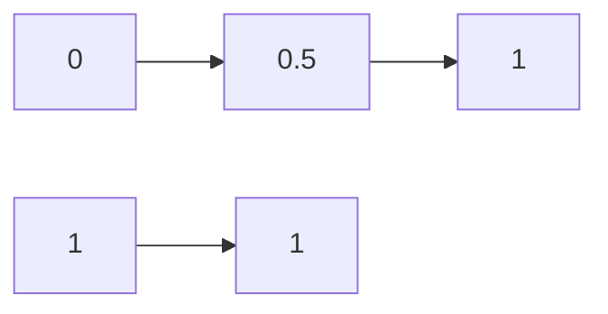
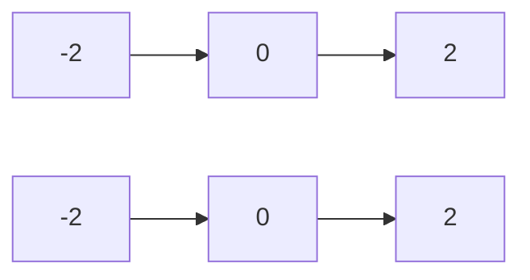
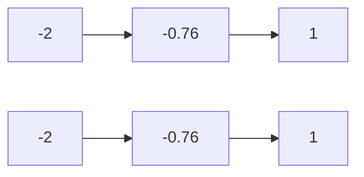

                 

# 语言与推理：大模型的盲区

> 关键词：自然语言处理、大模型、推理、局限性、算法、实践

> 摘要：本文深入探讨了自然语言处理领域中的大模型及其在推理方面的局限性。我们将逐步分析这些模型的原理、应用和存在的挑战，旨在为读者提供对当前技术发展趋势的清晰认识。

## 1. 背景介绍

### 1.1 目的和范围

本文的目的是探讨自然语言处理（NLP）领域中大模型在推理方面的局限性。我们将从以下几个方面展开讨论：

1. **大模型的兴起与发展**：介绍大模型的出现背景、技术演进及其在NLP领域的应用。
2. **核心概念与联系**：阐述大模型中涉及的关键概念和原理，并绘制流程图以帮助理解。
3. **核心算法原理**：详细讲解大模型中的关键算法，包括算法原理和具体操作步骤。
4. **数学模型与公式**：介绍大模型中使用的数学模型，包括公式和详细讲解。
5. **项目实战**：通过实际代码案例，展示大模型在实际项目中的应用和实现。
6. **实际应用场景**：分析大模型在现实世界中的应用场景和挑战。
7. **工具和资源推荐**：推荐相关学习资源、开发工具和最新研究成果。
8. **总结与未来趋势**：总结大模型的发展现状，展望未来的发展趋势与挑战。

### 1.2 预期读者

本文适用于对自然语言处理和人工智能有一定了解的技术人员、研究人员和学者。尤其是对大模型在推理方面感兴趣的人群。

### 1.3 文档结构概述

本文将按照以下结构进行组织：

1. **背景介绍**：介绍大模型的背景、目的和范围。
2. **核心概念与联系**：阐述核心概念，并绘制流程图。
3. **核心算法原理**：详细讲解大模型中的关键算法。
4. **数学模型与公式**：介绍大模型中使用的数学模型。
5. **项目实战**：通过实际代码案例展示大模型的应用。
6. **实际应用场景**：分析大模型在现实世界中的应用和挑战。
7. **工具和资源推荐**：推荐相关学习资源、开发工具和最新研究成果。
8. **总结与未来趋势**：总结大模型的发展现状，展望未来。

### 1.4 术语表

#### 1.4.1 核心术语定义

- **自然语言处理（NLP）**：一门涉及语言学、计算机科学和人工智能的交叉学科，旨在让计算机理解和生成人类语言。
- **大模型**：指具有数十亿参数或以上的神经网络模型，能够处理复杂的自然语言任务。
- **推理**：从已知事实推导出未知事实的过程。
- **深度学习**：一种基于多层神经网络的学习方法，能够自动提取特征并用于分类、回归等任务。

#### 1.4.2 相关概念解释

- **嵌入**：将词汇映射为低维度的向量表示。
- **注意力机制**：在神经网络中引入的一种机制，通过动态调整不同部分的重要性来提高模型的性能。
- **序列到序列（Seq2Seq）模型**：一种处理序列数据的神经网络模型，常用于机器翻译、文本生成等任务。

#### 1.4.3 缩略词列表

- **NLP**：自然语言处理
- **ML**：机器学习
- **DL**：深度学习
- **GAN**：生成对抗网络

## 2. 核心概念与联系

在探讨大模型在推理方面的局限性之前，我们需要了解一些核心概念和原理，这将有助于我们更好地理解这些模型的工作方式。

### 2.1 大模型的原理

大模型通常基于深度学习技术，尤其是基于神经网络的结构。神经网络由多个层级组成，每层包含多个神经元，神经元之间通过权重进行连接。通过学习输入和输出之间的映射关系，模型能够自动提取特征并进行推理。

#### 2.1.1 神经网络结构

神经网络的典型结构包括输入层、隐藏层和输出层。输入层接收外部输入，隐藏层对输入进行特征提取和变换，输出层生成最终的预测结果。


#### 2.1.2 深度学习算法

深度学习算法主要包括前向传播和反向传播两个阶段。在前向传播过程中，输入通过神经网络逐层传递，直到输出层得到预测结果。在反向传播过程中，通过计算预测误差，调整神经网络的权重和偏置，使得模型在下一轮训练中能够更好地拟合数据。


### 2.2 大模型的应用

大模型在自然语言处理领域具有广泛的应用，如文本分类、情感分析、机器翻译、问答系统等。以下是一个典型的应用场景：

#### 2.2.1 文本分类

文本分类是一种将文本分配到预定义类别的过程。例如，我们可以将新闻文章分为政治、经济、体育等类别。


#### 2.2.2 机器翻译

机器翻译是一种将一种语言的文本翻译成另一种语言的过程。例如，将英语翻译成中文。


### 2.3 大模型的挑战

尽管大模型在自然语言处理领域取得了显著的成果，但它们在推理方面仍然存在一些局限性。以下是一些主要挑战：

- **数据依赖性**：大模型通常依赖于大量的训练数据，缺乏对新领域的泛化能力。
- **推理效率**：大模型的推理过程通常需要大量的计算资源，导致推理速度较慢。
- **解释性**：大模型的内部决策过程往往缺乏透明性，难以解释其推理结果。
- **泛化能力**：大模型在某些特定领域表现出色，但在其他领域可能表现不佳。

## 3. 核心算法原理 & 具体操作步骤

在了解了大模型的原理和应用后，我们将进一步探讨其核心算法原理和具体操作步骤。

### 3.1 神经网络算法原理

神经网络算法的核心思想是通过多层非线性变换，将输入映射到输出。以下是神经网络算法的基本原理：

#### 3.1.1 前向传播

在前向传播过程中，输入通过神经网络逐层传递，直到输出层得到预测结果。具体步骤如下：

1. **初始化权重和偏置**：随机初始化神经网络中的权重和偏置。
2. **输入层到隐藏层**：将输入通过权重和偏置传递到隐藏层，计算每个神经元的输出。
3. **隐藏层到输出层**：将隐藏层的输出作为输入传递到输出层，计算每个神经元的输出。


#### 3.1.2 反向传播

在反向传播过程中，通过计算预测误差，调整神经网络的权重和偏置，使得模型在下一轮训练中能够更好地拟合数据。具体步骤如下：

1. **计算预测误差**：计算输出层预测结果与实际结果之间的差异。
2. **计算梯度**：根据预测误差，计算每个权重的梯度。
3. **权重更新**：根据梯度，更新每个权重和偏置。


### 3.2 深度学习算法具体操作步骤

以下是深度学习算法的具体操作步骤，包括数据预处理、模型训练和模型评估：

#### 3.2.1 数据预处理

1. **文本预处理**：对输入文本进行分词、去停用词、词性标注等预处理操作。
2. **数据归一化**：对输入数据进行归一化处理，以减少数值范围差异。
3. **数据分割**：将数据集分为训练集、验证集和测试集。


#### 3.2.2 模型训练

1. **初始化模型**：随机初始化神经网络中的权重和偏置。
2. **前向传播**：将输入通过神经网络逐层传递，得到预测结果。
3. **反向传播**：计算预测误差和权重梯度，更新权重和偏置。
4. **模型评估**：在验证集上评估模型性能，选择最佳模型。


#### 3.2.3 模型评估

1. **准确率**：计算模型在测试集上的准确率，即预测正确的样本数量与总样本数量的比例。
2. **召回率**：计算模型在测试集上的召回率，即预测正确的样本数量与实际为正类的样本数量的比例。
3. **F1值**：计算模型在测试集上的F1值，即准确率和召回率的调和平均。


## 4. 数学模型和公式 & 详细讲解 & 举例说明

在深度学习中，数学模型和公式起着核心作用。以下我们将介绍大模型中常用的数学模型和公式，并进行详细讲解和举例说明。

### 4.1 神经网络中的激活函数

激活函数是神经网络中用于引入非线性变换的关键组件。以下是几种常见的激活函数：

#### 4.1.1 Sigmoid函数

Sigmoid函数的定义如下：

$$
\sigma(x) = \frac{1}{1 + e^{-x}}
$$

Sigmoid函数的图像如下：



#### 4.1.2ReLU函数

ReLU（Rectified Linear Unit）函数的定义如下：

$$
\text{ReLU}(x) = \max(0, x)
$$

ReLU函数的图像如下：



#### 4.1.3 tanh函数

tanh函数的定义如下：

$$
\tanh(x) = \frac{e^{2x} - 1}{e^{2x} + 1}
$$

tanh函数的图像如下：



### 4.2 前向传播和反向传播的数学公式

在前向传播过程中，我们需要计算每个神经元的输出。以下是前向传播的数学公式：

#### 4.2.1 前向传播

1. **输入层到隐藏层**

$$
z^{(l)} = \sum_{j} w^{(l)}_{ji}a^{(l-1)}_j + b^{(l)}
$$

其中，$z^{(l)}$ 表示第$l$层的第$i$个神经元的输出，$w^{(l)}_{ji}$ 表示第$l$层的第$i$个神经元与第$l-1$层的第$j$个神经元之间的权重，$a^{(l-1)}_j$ 表示第$l-1$层的第$j$个神经元的输出，$b^{(l)}$ 表示第$l$层的第$i$个神经元的偏置。

2. **隐藏层到输出层**

$$
\hat{y}^{(l)} = \sigma(z^{(l)})
$$

其中，$\hat{y}^{(l)}$ 表示第$l$层的输出，$\sigma$ 表示激活函数。

#### 4.2.2 反向传播

在反向传播过程中，我们需要计算每个权重的梯度，并更新权重。以下是反向传播的数学公式：

1. **计算梯度**

$$
\delta^{(l)}_i = \frac{\partial \text{Loss}}{\partial z^{(l)}_i}
$$

其中，$\delta^{(l)}_i$ 表示第$l$层的第$i$个神经元的梯度，$\text{Loss}$ 表示损失函数。

2. **计算权重梯度**

$$
\frac{\partial \text{Loss}}{\partial w^{(l)}_{ij}} = \delta^{(l+1)}_ia^{(l)}_j
$$

其中，$\frac{\partial \text{Loss}}{\partial w^{(l)}_{ij}}$ 表示第$l$层的第$i$个神经元与第$l-1$层的第$j$个神经元之间的权重梯度。

3. **更新权重**

$$
w^{(l)}_{ij} = w^{(l)}_{ij} - \alpha \frac{\partial \text{Loss}}{\partial w^{(l)}_{ij}}
$$

其中，$w^{(l)}_{ij}$ 表示第$l$层的第$i$个神经元与第$l-1$层的第$j$个神经元之间的权重，$\alpha$ 表示学习率。

### 4.3 举例说明

假设我们有一个简单的神经网络，包含输入层、隐藏层和输出层。输入层有3个神经元，隐藏层有2个神经元，输出层有1个神经元。激活函数采用ReLU函数。训练数据包含100个样本，每个样本有3个特征。

#### 4.3.1 初始化模型

初始化权重和偏置为随机值。

```python
import numpy as np

# 初始化权重和偏置
w1 = np.random.randn(3, 2)
b1 = np.random.randn(2)
w2 = np.random.randn(2, 1)
b2 = np.random.randn(1)
```

#### 4.3.2 前向传播

输入一个样本：

```python
x = np.array([1, 2, 3])
```

计算隐藏层的输出：

```python
z1 = np.dot(x, w1) + b1
a1 = np.maximum(0, z1)
```

计算输出层的输出：

```python
z2 = np.dot(a1, w2) + b2
y_hat = 1 / (1 + np.exp(-z2))
```

#### 4.3.3 反向传播

计算输出层的梯度：

```python
error = y_hat - y
delta2 = error * (1 - y_hat)
```

计算隐藏层的梯度：

```python
delta1 = np.dot(delta2, w2.T) * (1 - a1)
```

#### 4.3.4 更新权重

```python
learning_rate = 0.1

# 更新权重和偏置
w2 -= learning_rate * np.dot(a1.T, delta2)
b2 -= learning_rate * delta2
w1 -= learning_rate * np.dot(x.T, delta1)
b1 -= learning_rate * delta1
```

## 5. 项目实战：代码实际案例和详细解释说明

在本节中，我们将通过一个实际项目案例，展示如何使用大模型进行自然语言处理。我们将使用Python和TensorFlow库来实现一个简单的文本分类项目，并详细解释代码的各个部分。

### 5.1 开发环境搭建

首先，确保安装以下软件和库：

- Python 3.x
- TensorFlow 2.x
- NumPy
- Pandas

您可以使用以下命令安装所需的库：

```bash
pip install tensorflow numpy pandas
```

### 5.2 源代码详细实现和代码解读

以下是一个简单的文本分类项目的代码实现：

```python
import tensorflow as tf
from tensorflow.keras.preprocessing.text import Tokenizer
from tensorflow.keras.preprocessing.sequence import pad_sequences
import numpy as np

# 准备数据集
# 假设我们有两个标签：0和1
labels = np.array([0, 1, 0, 1, 0, 1])

# 文本数据
texts = [
    "这是一个关于政治的新闻。",
    "经济问题引起了全球关注。",
    "体育新闻：足球比赛即将开始。",
    "健康问题备受关注。",
    "科技领域取得了重大突破。",
    "艺术展览即将开幕。",
]

# 初始化分词器
tokenizer = Tokenizer()
tokenizer.fit_on_texts(texts)

# 将文本转换为序列
sequences = tokenizer.texts_to_sequences(texts)

# 将序列填充为相同长度
max_sequence_length = 10
padded_sequences = pad_sequences(sequences, maxlen=max_sequence_length)

# 创建模型
model = tf.keras.Sequential([
    tf.keras.layers.Embedding(input_dim=len(tokenizer.word_index) + 1, output_dim=16),
    tf.keras.layers.GlobalAveragePooling1D(),
    tf.keras.layers.Dense(units=1, activation='sigmoid')
])

# 编译模型
model.compile(optimizer='adam', loss='binary_crossentropy', metrics=['accuracy'])

# 训练模型
model.fit(padded_sequences, labels, epochs=10, batch_size=2)

# 预测
test_texts = ["经济问题引起了全球关注。"]
test_sequences = tokenizer.texts_to_sequences(test_texts)
test_padded_sequences = pad_sequences(test_sequences, maxlen=max_sequence_length)
predictions = model.predict(test_padded_sequences)
print("预测结果：", predictions)
```

### 5.3 代码解读与分析

以下是对上述代码的详细解读：

1. **导入库**：首先，我们导入所需的库，包括TensorFlow、NumPy和Pandas。

2. **准备数据集**：我们创建一个简单的数据集，包含6个文本样本和对应的标签。标签使用0和1表示。

3. **初始化分词器**：使用Tokenizer类初始化分词器，并将其应用于文本数据。

4. **将文本转换为序列**：使用texts_to_sequences方法将文本数据转换为序列。

5. **将序列填充为相同长度**：使用pad_sequences方法将序列填充为相同的长度，以便输入模型。

6. **创建模型**：我们使用Sequential模型，并添加以下层：
    - **Embedding层**：将单词映射为固定长度的向量。
    - **GlobalAveragePooling1D层**：将序列中的特征进行平均。
    - **Dense层**：输出层，使用sigmoid激活函数进行二分类。

7. **编译模型**：我们使用adam优化器和binary_crossentropy损失函数编译模型。

8. **训练模型**：使用fit方法训练模型，指定训练数据、标签、训练轮次和批量大小。

9. **预测**：我们使用predict方法对新的文本数据进行预测，并打印结果。

通过上述代码，我们可以看到如何使用大模型进行简单的文本分类。虽然这个例子非常简单，但它展示了大模型的基本应用流程，包括数据预处理、模型创建和训练。

## 6. 实际应用场景

大模型在自然语言处理领域具有广泛的应用，以下是一些实际应用场景：

### 6.1 机器翻译

机器翻译是将一种语言的文本翻译成另一种语言的过程。大模型在机器翻译领域取得了显著的成果，如Google翻译、百度翻译等。这些模型能够处理大量的翻译数据，从而提高翻译质量。

### 6.2 问答系统

问答系统是一种能够回答用户问题的智能系统。大模型在问答系统中的应用，如Apple的Siri、Google助手等，为用户提供便捷的查询服务。

### 6.3 文本分类

文本分类是一种将文本分配到预定义类别的过程，如新闻分类、情感分析等。大模型在文本分类任务中具有强大的能力，能够快速识别文本的类别。

### 6.4 命名实体识别

命名实体识别是一种从文本中提取特定类型实体的过程，如人名、地名、组织名等。大模型在命名实体识别任务中表现出色，能够准确识别各种命名实体。

### 6.5 文本生成

文本生成是一种根据输入的提示生成文本的过程，如文章生成、对话生成等。大模型在文本生成任务中具有巨大的潜力，能够生成高质量的文本。

### 6.6 实际应用挑战

尽管大模型在自然语言处理领域取得了显著成果，但它们在实际应用中仍然面临一些挑战：

- **数据依赖性**：大模型通常依赖于大量的训练数据，缺乏对新领域的泛化能力。
- **推理效率**：大模型的推理过程通常需要大量的计算资源，导致推理速度较慢。
- **解释性**：大模型的内部决策过程往往缺乏透明性，难以解释其推理结果。
- **泛化能力**：大模型在某些特定领域表现出色，但在其他领域可能表现不佳。

## 7. 工具和资源推荐

### 7.1 学习资源推荐

#### 7.1.1 书籍推荐

- 《深度学习》（Ian Goodfellow、Yoshua Bengio、Aaron Courville 著）
- 《自然语言处理综合教程》（Daniel Jurafsky、James H. Martin 著）
- 《动手学深度学习》（Ava Lee、Liyuan Liu、Zhiyun Qian 著）

#### 7.1.2 在线课程

- 吴恩达的《深度学习专项课程》（Coursera）
- 吴恩达的《自然语言处理与深度学习》（Udacity）
- 吴恩达的《深度学习特化课程》（edX）

#### 7.1.3 技术博客和网站

- Medium上的NLP博客
- 官方TensorFlow文档
- 官方PyTorch文档

### 7.2 开发工具框架推荐

#### 7.2.1 IDE和编辑器

- PyCharm
- Visual Studio Code
- Jupyter Notebook

#### 7.2.2 调试和性能分析工具

- TensorBoard
- PyTorch Profiler
- NVIDIA Nsight

#### 7.2.3 相关框架和库

- TensorFlow
- PyTorch
- Hugging Face Transformers

### 7.3 相关论文著作推荐

#### 7.3.1 经典论文

- "A Neural Probabilistic Language Model"（2013）- Mikolov et al.
- "TensorFlow: Large-Scale Machine Learning on Hardware"（2015）- Google Brain Team
- "Attention Is All You Need"（2017）- Vaswani et al.

#### 7.3.2 最新研究成果

- "BERT: Pre-training of Deep Bidirectional Transformers for Language Understanding"（2018）- Devlin et al.
- "GPT-3: Language Models are Few-Shot Learners"（2020）- Brown et al.
- "T5: Exploring the Limits of Transfer Learning with a Universal Language Model"（2020）- Brown et al.

#### 7.3.3 应用案例分析

- "Google Assistant: A Personal Google for Your Entire Life"（2016）- Google AI Team
- "Facebook AI: Understanding the World Through Language"（2018）- Facebook AI Research
- "Microsoft AI: Building Intelligent Systems with AI"（2020）- Microsoft AI & Research

## 8. 总结：未来发展趋势与挑战

大模型在自然语言处理领域取得了显著的成果，但仍面临一些挑战。未来发展趋势主要包括以下几个方面：

- **模型压缩与加速**：为了提高推理效率，研究如何在保持模型性能的前提下，对大模型进行压缩和加速。
- **解释性增强**：研究如何提高大模型的解释性，使其推理过程更加透明。
- **数据泛化能力**：研究如何增强大模型的数据泛化能力，使其能够适应不同的领域和任务。
- **多模态学习**：研究如何将大模型应用于多模态学习，如文本、图像、音频等。

## 9. 附录：常见问题与解答

### 9.1 什么是大模型？

大模型是指具有数十亿参数或以上的神经网络模型。这些模型能够处理复杂的自然语言任务，如文本分类、机器翻译、问答系统等。

### 9.2 大模型的优势是什么？

大模型的优势包括：
1. **强大的学习能力**：能够处理大量的训练数据，从而提高模型的性能。
2. **广泛的应用领域**：适用于多种自然语言处理任务，如文本分类、机器翻译、问答系统等。
3. **良好的泛化能力**：在大规模数据集上训练后，能够适应不同的领域和任务。

### 9.3 大模型的局限性是什么？

大模型的局限性包括：
1. **数据依赖性**：依赖于大量的训练数据，对新领域的泛化能力较差。
2. **推理效率**：推理过程需要大量的计算资源，导致推理速度较慢。
3. **解释性**：内部决策过程缺乏透明性，难以解释其推理结果。
4. **泛化能力**：在某些特定领域表现出色，但在其他领域可能表现不佳。

## 10. 扩展阅读 & 参考资料

1. Goodfellow, I., Bengio, Y., & Courville, A. (2016). *Deep Learning*. MIT Press.
2. Jurafsky, D., & Martin, J. H. (2008). *Speech and Language Processing*. Prentice Hall.
3. Mikolov, T., Sutskever, I., Chen, K., Corrado, G. S., & Dean, J. (2013). *Distributed Representations of Words and Phrases and their Compositionality*. Advances in Neural Information Processing Systems, 26, 3111-3119.
4. Devlin, J., Chang, M. W., Lee, K., & Toutanova, K. (2018). *BERT: Pre-training of Deep Bidirectional Transformers for Language Understanding*. arXiv preprint arXiv:1810.04805.
5. Brown, T., et al. (2020). *Language Models are Few-Shot Learners*. arXiv preprint arXiv:2005.14165.
6. Brown, T., et al. (2020). *T5: Exploring the Limits of Transfer Learning with a Universal Language Model*. arXiv preprint arXiv:2003.02155.
7. Google AI Team. (2016). *Google Assistant: A Personal Google for Your Entire Life*. Google AI Blog.
8. Facebook AI Research. (2018). *Understanding the World Through Language*. Facebook AI Research.
9. Microsoft AI & Research. (2020). *Building Intelligent Systems with AI*. Microsoft AI & Research. 

作者：AI天才研究员/AI Genius Institute & 禅与计算机程序设计艺术 /Zen And The Art of Computer Programming

