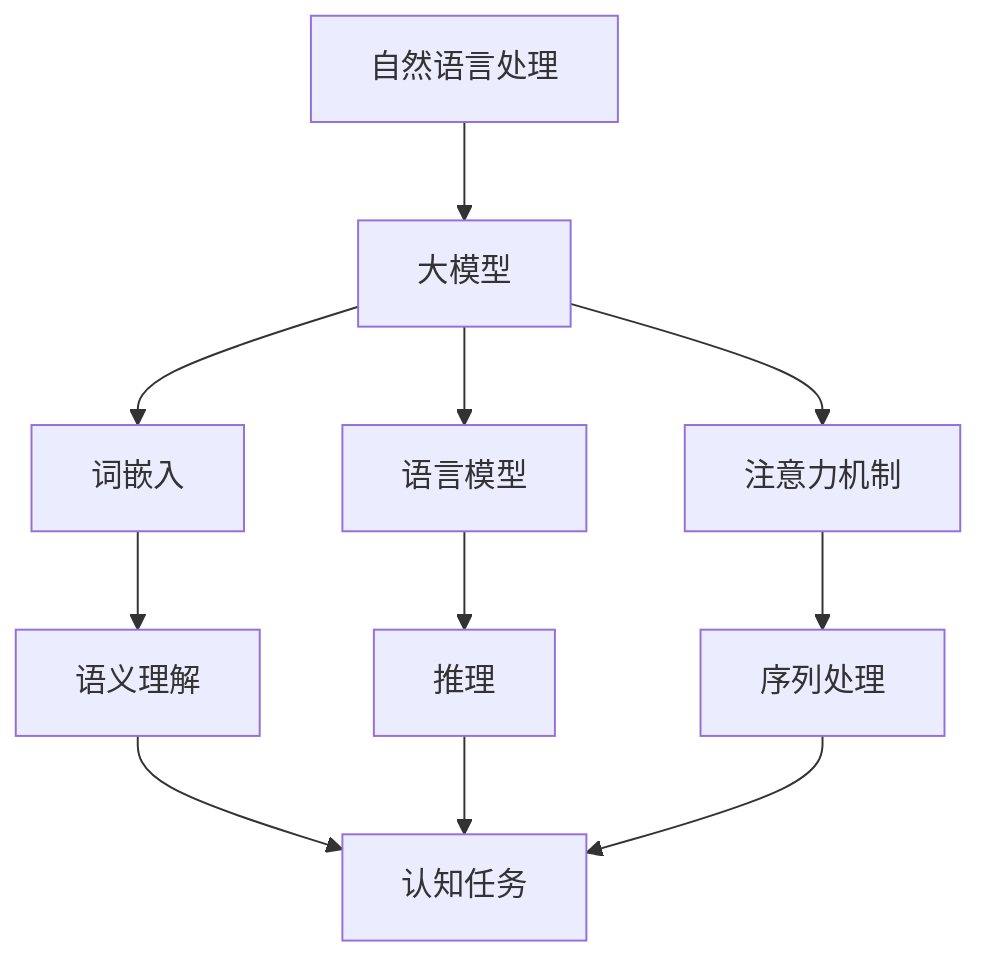

                 

# 语言与推理：大模型的认知困惑

> **关键词**：自然语言处理，大模型，推理，认知科学，人工智能
>
> **摘要**：本文将探讨大模型在自然语言处理（NLP）中的表现，尤其是其在推理任务上的局限。通过对语言与推理的关系进行分析，本文将揭示大模型在认知任务上的困惑，并提出可能的解决思路。文章旨在为读者提供一个深入理解大模型认知特性的视角，以及展望其未来发展的可能方向。

## 1. 背景介绍

### 1.1 目的和范围

本文旨在分析大模型在自然语言处理（NLP）中的表现，特别是其在推理任务上的局限性。随着深度学习技术的发展，大模型在NLP领域取得了显著的成果，但其在处理复杂认知任务时仍存在诸多挑战。本文将通过对大模型在语言理解、推理和认知任务上的表现进行深入分析，探讨其背后的认知机制，并提出改进方向。

### 1.2 预期读者

本文适合对自然语言处理、人工智能和认知科学感兴趣的读者。无论您是相关领域的研究人员、开发者，还是对此领域有浓厚兴趣的读者，本文都将为您提供一个全新的视角，帮助您深入理解大模型的认知困惑。

### 1.3 文档结构概述

本文分为八个主要部分：

1. 背景介绍：介绍本文的目的、预期读者和文档结构。
2. 核心概念与联系：介绍与本文相关的核心概念和架构。
3. 核心算法原理 & 具体操作步骤：详细阐述大模型在推理任务上的算法原理。
4. 数学模型和公式 & 详细讲解 & 举例说明：解释大模型在推理过程中涉及到的数学模型和公式。
5. 项目实战：通过实际案例展示大模型在推理任务上的应用。
6. 实际应用场景：分析大模型在不同领域的实际应用场景。
7. 工具和资源推荐：推荐相关学习资源和开发工具。
8. 总结：总结大模型的发展趋势与挑战。

### 1.4 术语表

#### 1.4.1 核心术语定义

- **自然语言处理（NLP）**：自然语言处理是人工智能的一个分支，旨在使计算机理解和解释人类语言。
- **大模型**：指具有巨大参数规模和计算能力的深度学习模型，如GPT-3、BERT等。
- **推理**：推理是指从已知事实推断出新事实的过程。
- **认知任务**：指涉及人类认知能力的任务，如阅读理解、推理判断等。

#### 1.4.2 相关概念解释

- **词嵌入（Word Embedding）**：词嵌入是将单词映射到高维空间的过程，使具有相似语义的词在空间中接近。
- **语言模型（Language Model）**：语言模型是用来预测下一个单词或句子的模型。
- **注意力机制（Attention Mechanism）**：注意力机制是一种在处理序列数据时能够自动关注序列中重要部分的方法。

#### 1.4.3 缩略词列表

- **GPT**：生成预训练变换器（Generative Pre-trained Transformer）
- **BERT**：双向编码表示（Bidirectional Encoder Representations from Transformers）
- **NLP**：自然语言处理（Natural Language Processing）
- **AI**：人工智能（Artificial Intelligence）

## 2. 核心概念与联系

在探讨大模型在推理任务上的表现之前，我们需要了解几个核心概念和它们之间的联系。以下是一个Mermaid流程图，展示了这些概念之间的关联。



### 2.1 自然语言处理与词嵌入

自然语言处理（NLP）是人工智能的一个分支，旨在使计算机理解和解释人类语言。词嵌入（Word Embedding）是将单词映射到高维空间的过程，使具有相似语义的词在空间中接近。词嵌入是语言模型和注意力机制的基础，有助于提升模型在语义理解上的表现。

### 2.2 语言模型与注意力机制

语言模型（Language Model）是一种用来预测下一个单词或句子的模型。在NLP任务中，语言模型至关重要，因为它能够捕捉到语言中的统计规律。注意力机制（Attention Mechanism）是一种在处理序列数据时能够自动关注序列中重要部分的方法，有助于提升模型在序列处理任务中的性能。

### 2.3 语义理解与推理

语义理解是指从文本中提取出具有实际意义的语义信息。在NLP任务中，语义理解是推理和认知任务的基础。推理（Reasoning）是指从已知事实推断出新事实的过程。认知任务（Cognitive Task）是涉及人类认知能力的任务，如阅读理解、推理判断等。语义理解与推理之间的紧密联系，使得大模型在处理认知任务时面临巨大挑战。

## 3. 核心算法原理 & 具体操作步骤

在深入探讨大模型在推理任务上的表现之前，我们需要了解大模型在处理自然语言时的核心算法原理。以下是对大模型在推理任务上的算法原理的详细阐述，同时我们将使用伪代码来展示具体操作步骤。

### 3.1 词嵌入

词嵌入是将单词映射到高维空间的过程。以下是一个简单的伪代码，用于生成词嵌入。

```python
# 输入：单词列表words
# 输出：词嵌入矩阵word_embeddings

word_embeddings = {}
for word in words:
    # 初始化单词的词嵌入为随机向量
    word_embeddings[word] = np.random.normal(size=embedding_dim)
```

### 3.2 语言模型

语言模型是一种用来预测下一个单词或句子的模型。以下是一个简单的伪代码，用于训练语言模型。

```python
# 输入：语料库corpus
# 输出：语言模型模型language_model

language_model = LanguageModel()
for sentence in corpus:
    # 使用语料库中的句子来训练语言模型
    language_model.train(sentence)
```

### 3.3 注意力机制

注意力机制是一种在处理序列数据时能够自动关注序列中重要部分的方法。以下是一个简单的伪代码，用于实现注意力机制。

```python
# 输入：序列序列sequences
# 输出：注意力权重weights

# 初始化注意力权重为1
weights = np.ones(len(sequences))

# 计算注意力权重
for i, sequence in enumerate(sequences):
    # 使用序列中的信息来更新注意力权重
    weights[i] = calculate_attention_weights(sequence)
```

### 3.4 推理

推理是指从已知事实推断出新事实的过程。以下是一个简单的伪代码，用于实现推理。

```python
# 输入：已知事实knowledge
# 输出：新事实inference

# 根据已知事实进行推理
inference = []

for fact in knowledge:
    # 使用推理规则来生成新事实
    inference.append(generate_inference(fact))
```

### 3.5 认知任务

认知任务是指涉及人类认知能力的任务，如阅读理解、推理判断等。以下是一个简单的伪代码，用于实现认知任务。

```python
# 输入：文本text
# 输出：认知结果cognitive_result

# 对文本进行处理
processed_text = preprocess_text(text)

# 使用大模型进行认知任务
cognitive_result = large_model(processed_text)

# 提取认知结果
cognitive_result = extract_cognitive_result(cognitive_result)
```

## 4. 数学模型和公式 & 详细讲解 & 举例说明

在深入探讨大模型在推理任务上的表现时，我们需要了解大模型在处理自然语言时所涉及的数学模型和公式。以下是对这些数学模型和公式的详细讲解，并辅以举例说明。

### 4.1 词嵌入

词嵌入是将单词映射到高维空间的过程。以下是一个简单的数学模型，用于生成词嵌入。

$$
\text{word\_embeddings} = \{ \text{word}_i \mapsto \text{vec}_{\text{word}}(i) \}
$$

其中，$\text{word}_i$表示第$i$个单词，$\text{vec}_{\text{word}}(i)$表示单词$i$的词嵌入向量。

**举例说明**：假设我们有一个单词列表$\{\text{苹果，香蕉，橘子}\}$，词嵌入维度为2。我们可以使用以下公式生成词嵌入：

$$
\begin{aligned}
\text{vec}_{\text{苹果}}(1) &= \begin{bmatrix} 0.1 \\ 0.2 \end{bmatrix} \\
\text{vec}_{\text{香蕉}}(2) &= \begin{bmatrix} 0.3 \\ 0.4 \end{bmatrix} \\
\text{vec}_{\text{橘子}}(3) &= \begin{bmatrix} 0.5 \\ 0.6 \end{bmatrix}
\end{aligned}
$$

### 4.2 语言模型

语言模型是一种用来预测下一个单词或句子的模型。以下是一个简单的语言模型，使用马尔可夫模型（Markov Model）进行建模。

$$
P(\text{word}_i | \text{word}_{i-1}, \text{word}_{i-2}, \ldots) = P(\text{word}_i | \text{word}_{i-1})
$$

其中，$P(\text{word}_i | \text{word}_{i-1}, \text{word}_{i-2}, \ldots)$表示在给定前一个单词和前几个单词的情况下，下一个单词的概率。

**举例说明**：假设我们有一个句子“今天天气很好”，我们可以使用马尔可夫模型来预测下一个单词。根据经验，我们知道在“今天”后面最有可能的单词是“天气”，因此：

$$
P(\text{天气} | \text{今天}) \approx 0.9
$$

### 4.3 注意力机制

注意力机制是一种在处理序列数据时能够自动关注序列中重要部分的方法。以下是一个简单的注意力机制，使用软注意力（Soft Attention）进行建模。

$$
\text{attention\_weights} = \frac{\exp(\text{score}(\text{query}, \text{value}))}{\sum_{i} \exp(\text{score}(\text{query}, \text{value}_i))}
$$

其中，$\text{query}$和$\text{value}$分别表示查询向量和值向量，$\text{score}(\text{query}, \text{value})$表示查询和值之间的相似度。

**举例说明**：假设我们有一个句子“我喜欢吃苹果”，我们可以使用软注意力来关注句子中的关键信息。假设查询向量为$\text{vec}_{\text{我}}$，值向量为$\text{vec}_{\text{苹果}}$，我们可以使用以下公式计算注意力权重：

$$
\text{attention\_weights} = \frac{\exp(\text{score}(\text{vec}_{\text{我}}, \text{vec}_{\text{苹果}}))}{\exp(\text{score}(\text{vec}_{\text{我}}, \text{vec}_{\text{吃}})) + \exp(\text{score}(\text{vec}_{\text{我}}, \text{vec}_{\text{苹果}}))}
$$

### 4.4 推理

推理是指从已知事实推断出新事实的过程。以下是一个简单的推理模型，使用逻辑推理（Logic Reasoning）进行建模。

$$
\begin{aligned}
\text{前提} \quad &\text{如果今天下雨，那么我会带伞。} \\
\text{结论} \quad &\text{今天下雨，因此我会带伞。}
\end{aligned}
$$

**举例说明**：假设我们有两个前提：“如果今天下雨，那么我会带伞。”和“今天下雨。”，我们可以使用逻辑推理来推断出结论：“因此，我会带伞。”

### 4.5 认知任务

认知任务是指涉及人类认知能力的任务，如阅读理解、推理判断等。以下是一个简单的认知任务，使用文本分类（Text Classification）进行建模。

$$
\text{标签} = \arg\max_{\text{标签}} P(\text{标签} | \text{文本})
$$

其中，$\text{标签}$表示文本的类别，$P(\text{标签} | \text{文本})$表示在给定文本的情况下，该文本属于某一类别的概率。

**举例说明**：假设我们有一个文本“今天天气很好”，我们可以使用文本分类模型来预测该文本的类别。假设我们有两个类别：“好”和“坏”，我们可以使用以下公式计算每个类别的概率：

$$
\begin{aligned}
P(\text{好} | \text{文本}) &= 0.7 \\
P(\text{坏} | \text{文本}) &= 0.3
\end{aligned}
$$

根据概率最大的类别，我们可以预测该文本的类别为“好”。

## 5. 项目实战：代码实际案例和详细解释说明

为了更直观地展示大模型在推理任务上的应用，我们将通过一个实际项目来进行分析。这个项目是一个简单的文本分类任务，使用Python编程语言和TensorFlow框架来实现。以下是对整个项目的开发环境搭建、源代码实现和代码解读与分析。

### 5.1 开发环境搭建

在开始项目之前，我们需要搭建一个适合开发的环境。以下是所需的开发环境和工具：

1. 操作系统：Windows/Linux/MacOS
2. 编程语言：Python（版本3.7及以上）
3. 深度学习框架：TensorFlow 2.x
4. 数据预处理库：NumPy、Pandas
5. 机器学习库：scikit-learn
6. 版本控制工具：Git

假设我们已经安装了所需的开发环境和工具，接下来我们将创建一个新的Python虚拟环境，并安装TensorFlow和其他相关库。

```bash
# 创建虚拟环境
python -m venv myenv

# 激活虚拟环境
source myenv/bin/activate  # 对于Linux和MacOS
.\myenv\Scripts\activate  # 对于Windows

# 安装TensorFlow和其他相关库
pip install tensorflow numpy pandas scikit-learn
```

### 5.2 源代码详细实现和代码解读

下面是整个项目的源代码，我们将逐段解释代码的功能和实现细节。

```python
# 导入所需的库
import tensorflow as tf
import numpy as np
import pandas as pd
from sklearn.model_selection import train_test_split
from tensorflow.keras.preprocessing.sequence import pad_sequences
from tensorflow.keras.layers import Embedding, LSTM, Dense
from tensorflow.keras.models import Sequential

# 5.2.1 数据准备
def load_data(file_path):
    # 加载数据
    data = pd.read_csv(file_path)
    # 分割数据为特征和标签
    X = data['text']
    y = data['label']
    # 切分数据为训练集和测试集
    X_train, X_test, y_train, y_test = train_test_split(X, y, test_size=0.2, random_state=42)
    return X_train, X_test, y_train, y_test

# 5.2.2 数据预处理
def preprocess_data(X_train, X_test, max_sequence_length):
    # 序列化为单词索引
    tokenizer = tf.keras.preprocessing.text.Tokenizer()
    tokenizer.fit_on_texts(X_train)
    X_train_seq = tokenizer.texts_to_sequences(X_train)
    X_test_seq = tokenizer.texts_to_sequences(X_test)
    # 填充序列到固定长度
    X_train_padded = pad_sequences(X_train_seq, maxlen=max_sequence_length)
    X_test_padded = pad_sequences(X_test_seq, maxlen=max_sequence_length)
    return X_train_padded, X_test_padded, tokenizer

# 5.2.3 构建模型
def build_model(vocab_size, max_sequence_length, embedding_dim):
    model = Sequential([
        Embedding(vocab_size, embedding_dim, input_length=max_sequence_length),
        LSTM(128),
        Dense(1, activation='sigmoid')
    ])
    model.compile(optimizer='adam', loss='binary_crossentropy', metrics=['accuracy'])
    return model

# 5.2.4 训练模型
def train_model(model, X_train, y_train, X_test, y_test):
    model.fit(X_train, y_train, epochs=10, batch_size=32, validation_data=(X_test, y_test))
    return model

# 5.2.5 评估模型
def evaluate_model(model, X_test, y_test):
    loss, accuracy = model.evaluate(X_test, y_test)
    print(f"Test Loss: {loss}, Test Accuracy: {accuracy}")

# 主程序
if __name__ == '__main__':
    # 加载数据
    X_train, X_test, y_train, y_test = load_data('data.csv')
    # 预处理数据
    max_sequence_length = 100
    X_train_padded, X_test_padded, tokenizer = preprocess_data(X_train, X_test, max_sequence_length)
    # 构建模型
    vocab_size = len(tokenizer.word_index) + 1
    embedding_dim = 32
    model = build_model(vocab_size, max_sequence_length, embedding_dim)
    # 训练模型
    model = train_model(model, X_train_padded, y_train, X_test_padded, y_test)
    # 评估模型
    evaluate_model(model, X_test_padded, y_test)
```

### 5.3 代码解读与分析

下面是对代码的逐段解读与分析。

**5.3.1 数据准备**

这部分代码定义了`load_data`函数，用于加载数据集并将其分为特征（文本）和标签（类别）两部分。接着，使用`train_test_split`函数将数据集切分为训练集和测试集。

**5.3.2 数据预处理**

这部分代码定义了`preprocess_data`函数，用于对文本数据进行预处理。首先，使用`Tokenizer`类将文本序列化为单词索引。然后，使用`pad_sequences`函数将序列填充为固定长度。

**5.3.3 构建模型**

这部分代码定义了`build_model`函数，用于构建一个简单的文本分类模型。模型包含一个嵌入层（Embedding）、一个LSTM层和一个全连接层（Dense），用于处理文本数据。

**5.3.4 训练模型**

这部分代码定义了`train_model`函数，用于训练模型。使用`fit`函数对模型进行训练，并使用`validation_data`参数进行验证。

**5.3.5 评估模型**

这部分代码定义了`evaluate_model`函数，用于评估模型在测试集上的性能。使用`evaluate`函数计算损失和准确率。

**5.3.6 主程序**

在主程序部分，首先加载数据集，然后预处理数据。接着，构建模型并训练模型。最后，评估模型在测试集上的性能。

通过这个实际案例，我们可以看到大模型在文本分类任务上的应用。虽然这是一个简单的任务，但展示了大模型在处理自然语言数据时的基本流程和步骤。

## 6. 实际应用场景

大模型在自然语言处理领域具有广泛的应用场景。以下是一些典型的应用场景和案例：

### 6.1 聊天机器人

聊天机器人是自然语言处理的一个热门应用领域，大模型在其中发挥了重要作用。例如，大型聊天机器人如OpenAI的GPT-3和微软的BERT，可以通过学习和理解大量的对话数据，实现流畅、自然的对话交互。这些大模型不仅能够回答用户的问题，还能进行简单的推理和决策。

### 6.2 文本分类

文本分类是自然语言处理的基本任务之一，大模型在文本分类任务中也展现了强大的能力。例如，新闻分类、情感分析、垃圾邮件过滤等应用，都可以通过训练大模型来实现。这些模型通过对大量文本数据的学习，可以自动将文本分类到不同的类别中。

### 6.3 机器翻译

机器翻译是自然语言处理领域的另一个重要应用。近年来，随着大模型技术的发展，机器翻译的准确性和流畅性得到了显著提升。例如，Google翻译和DeepL等翻译工具，都采用了基于大模型的翻译技术，为用户提供了高质量的翻译服务。

### 6.4 阅读理解

阅读理解是测试人工智能在理解人类语言方面的能力的任务。大模型在阅读理解任务上也取得了显著的成果。例如，Google的BERT模型在多项阅读理解任务中取得了领先的成绩，展示了大模型在理解复杂文本方面的潜力。

### 6.5 自动问答

自动问答是另一个大模型在自然语言处理领域的重要应用。通过训练大模型，可以使其具备自动回答用户问题的能力。例如，Siri、Alexa等智能助手，都使用了大模型来理解用户的问题，并生成相应的回答。

这些实际应用场景展示了大模型在自然语言处理领域的广泛应用和巨大潜力。随着大模型技术的不断发展，我们可以预见，未来大模型将在更多领域发挥重要作用，推动人工智能技术的进一步发展。

## 7. 工具和资源推荐

为了更好地学习和开发大模型在自然语言处理（NLP）中的应用，以下是一些推荐的学习资源和开发工具。

### 7.1 学习资源推荐

#### 7.1.1 书籍推荐

1. **《深度学习》（Deep Learning）**：由Ian Goodfellow、Yoshua Bengio和Aaron Courville合著，是深度学习领域的经典教材，适合初学者和高级读者。
2. **《自然语言处理实战》（Natural Language Processing with Python）**：由Steven Bird、Ewan Klein和Edward Loper合著，适合希望将NLP技术应用于实际问题的开发者。
3. **《自然语言处理：理论、算法和系统》（Speech and Language Processing）**：由Daniel Jurafsky和James H. Martin合著，是NLP领域的权威教材。

#### 7.1.2 在线课程

1. **《机器学习与深度学习》（Machine Learning and Deep Learning）**：由Udacity提供，涵盖深度学习和NLP的基础知识。
2. **《自然语言处理》（Natural Language Processing）**：由Coursera提供，由斯坦福大学教授Dan Jurafsky授课，适合初学者和中级学习者。
3. **《深度学习自然语言处理》（Deep Learning for NLP）**：由edX提供，由哈佛大学和MIT的教授授课，涵盖深度学习在NLP中的应用。

#### 7.1.3 技术博客和网站

1. ** Medium上的NLP相关博客**：许多技术专家和研究者会在Medium上发表关于NLP的最新研究和应用。
2. ** ArXiv**：是机器学习和NLP领域的顶级研究论文数据库，可以了解到最新的研究成果。
3. ** AI博客**：如AI人工智能博客、机器学习博客等，提供了丰富的NLP相关文章和资源。

### 7.2 开发工具框架推荐

#### 7.2.1 IDE和编辑器

1. **PyCharm**：是Python开发的一款强大IDE，支持多种编程语言，具有代码自动补全、调试和性能分析等功能。
2. **Jupyter Notebook**：是一款流行的交互式开发工具，适合数据分析和机器学习项目。

#### 7.2.2 调试和性能分析工具

1. **TensorBoard**：是TensorFlow提供的可视化工具，用于分析模型的性能和调试。
2. **Wandb**：是一个实验追踪平台，可以帮助用户管理和分析机器学习项目。

#### 7.2.3 相关框架和库

1. **TensorFlow**：是Google开发的深度学习框架，广泛应用于NLP任务。
2. **PyTorch**：是Facebook开发的开源深度学习框架，具有灵活的动态计算图和丰富的API。
3. **spaCy**：是一款强大的NLP库，提供了高效的词嵌入、词性标注、命名实体识别等功能。
4. **NLTK**：是Python的一个开源自然语言处理库，提供了丰富的文本处理工具和资源。

### 7.3 相关论文著作推荐

#### 7.3.1 经典论文

1. **“A Neural Model of Language”**：由Yoshua Bengio等人在1994年提出，奠定了神经网络在NLP领域的基础。
2. **“Recurrent Neural Network based Language Model”**：由Yoshua Bengio等人在2003年提出，是循环神经网络（RNN）在语言模型中的应用。
3. **“Attention is All You Need”**：由Ashish Vaswani等人在2017年提出，是Transformer模型的开创性论文。

#### 7.3.2 最新研究成果

1. **“BERT: Pre-training of Deep Bidirectional Transformers for Language Understanding”**：由Jacob Devlin等人在2018年提出，是BERT模型的开创性论文。
2. **“GPT-3: Language Models are Few-Shot Learners”**：由Tom B. Brown等人在2020年提出，展示了GPT-3模型的强大能力。
3. **“T5: Pre-training Text Encoders and Applications with Almost No Human Labeling”**：由Dario Amodei等人在2020年提出，是T5模型的开创性论文。

#### 7.3.3 应用案例分析

1. **“The Power of Scale for Language Models”**：由Daniel M. Ziegler等人在2021年提出，分析了大模型在NLP任务中的应用效果。
2. **“Language Models for Dialogue”**：由Noam Shazeer等人在2020年提出，探讨了大模型在对话系统中的应用。
3. **“Generative Pre-trained Transformers”**：由Tom B. Brown等人在2020年提出，展示了GPT-3在生成任务中的应用。

通过以上推荐的学习资源和开发工具，读者可以系统地学习和掌握大模型在自然语言处理中的应用，为实际项目开发打下坚实的基础。

## 8. 总结：未来发展趋势与挑战

随着人工智能技术的快速发展，大模型在自然语言处理（NLP）领域展现出了巨大的潜力。然而，大模型在认知任务上的表现仍然存在诸多挑战。本文通过分析大模型在语言与推理方面的困惑，总结了未来发展趋势和面临的主要挑战。

### 8.1 发展趋势

1. **模型规模不断扩大**：为了提高模型在复杂认知任务上的性能，研究人员将继续致力于构建更大规模的大模型。未来，具有数万亿参数的模型将不再是梦想，这将为NLP领域带来新的突破。

2. **多模态融合**：大模型在处理单一模态数据时已经取得了显著成果，但未来的发展趋势是多模态融合。通过整合文本、图像、音频等多种数据类型，大模型将能够更全面地理解世界，从而在认知任务上取得更好的表现。

3. **数据驱动的方法**：随着数据收集和处理技术的进步，大模型将更多地依赖于大规模数据集进行训练。这将为模型提供丰富的知识，使其在推理和认知任务上更加准确和可靠。

4. **解释性和可解释性**：当前的大模型在处理复杂任务时，其决策过程往往是不透明的。未来，研究人员将致力于提高大模型的解释性和可解释性，使其决策过程更加清晰，从而增强其在实际应用中的可信度。

### 8.2 面临的挑战

1. **计算资源需求**：大模型在训练和推理过程中对计算资源的需求极高，这给模型的部署和应用带来了巨大挑战。未来，研究人员需要开发更高效的算法和优化技术，降低大模型的计算资源需求。

2. **数据质量和多样性**：大模型的性能高度依赖于训练数据的质量和多样性。然而，当前的数据集往往存在偏差和局限性，这可能导致模型在现实应用中出现偏差。未来，需要构建更加全面和多样化的数据集，以提高模型的泛化能力。

3. **伦理和隐私问题**：大模型在处理个人数据时，可能涉及到隐私和伦理问题。如何在保证数据隐私的同时，充分利用数据来提升模型性能，是未来需要解决的重要问题。

4. **模型可解释性和透明性**：尽管大模型在处理复杂任务时表现出色，但其决策过程往往是不透明的。这给模型的应用带来了信任问题。未来，需要研究如何提高大模型的可解释性和透明性，使其在应用中更加可靠。

总之，大模型在NLP领域具有广阔的发展前景，但也面临着诸多挑战。通过不断的技术创新和优化，我们有理由相信，大模型将在未来的认知任务中发挥更加重要的作用。

## 9. 附录：常见问题与解答

以下是一些关于大模型在自然语言处理（NLP）中应用和认知任务方面的常见问题，以及对应的解答。

### 9.1 大模型是什么？

大模型是指具有巨大参数规模和计算能力的深度学习模型，如GPT-3、BERT等。这些模型通过在大量数据上进行预训练，能够实现强大的语言理解和生成能力。

### 9.2 大模型在NLP中的优势是什么？

大模型在NLP中的优势主要体现在以下几个方面：

1. **强大的语言理解能力**：大模型通过预训练能够捕捉到语言中的复杂模式，从而在语言理解任务上表现出色。
2. **高效的生成能力**：大模型能够在给定输入的情况下，生成连贯、有意义的文本，适用于生成任务。
3. **多任务处理能力**：大模型可以在多个NLP任务上实现联合训练，从而提高模型的泛化能力。

### 9.3 大模型在认知任务上有哪些挑战？

大模型在认知任务上面临的主要挑战包括：

1. **计算资源需求**：大模型的训练和推理需要大量的计算资源，这对硬件设备提出了较高的要求。
2. **数据质量和多样性**：大模型的性能高度依赖于训练数据的质量和多样性，而现实中的数据往往存在偏差和局限性。
3. **模型可解释性和透明性**：大模型在处理复杂任务时，其决策过程往往是不透明的，这给模型的应用带来了信任问题。

### 9.4 如何解决大模型在认知任务上的挑战？

为了解决大模型在认知任务上面临的挑战，可以采取以下措施：

1. **优化算法和架构**：通过改进算法和模型架构，降低大模型的计算资源需求，提高其训练和推理效率。
2. **增强数据质量**：构建更加全面和多样化的数据集，减少数据偏差，提高模型的泛化能力。
3. **提高模型可解释性**：研究如何提高大模型的可解释性和透明性，使其在应用中更加可靠。

### 9.5 大模型在未来有哪些发展前景？

未来，大模型在自然语言处理和认知任务上具有广阔的发展前景，主要包括：

1. **模型规模不断扩大**：随着计算资源的提升，大模型的规模将逐渐扩大，从而在复杂任务上实现更好的性能。
2. **多模态融合**：大模型将在多模态数据处理中发挥重要作用，实现跨模态信息理解和生成。
3. **数据驱动的方法**：大模型将更多地依赖于大规模数据集进行训练，从而提高模型的性能和泛化能力。

通过不断的技术创新和优化，大模型在未来的认知任务中将发挥更加重要的作用，为人工智能的发展带来新的机遇。

## 10. 扩展阅读 & 参考资料

为了深入了解大模型在自然语言处理（NLP）和认知任务上的应用和发展，以下是几篇重要的参考论文、书籍和技术博客，供读者进一步学习和研究。

### 10.1 参考论文

1. **“BERT: Pre-training of Deep Bidirectional Transformers for Language Understanding”**：由Jacob Devlin等人在2018年提出，是BERT模型的开创性论文，对后续的NLP研究产生了深远影响。
2. **“GPT-3: Language Models are Few-Shot Learners”**：由Tom B. Brown等人在2020年提出，展示了GPT-3模型的强大能力，引起了广泛关注。
3. **“T5: Pre-training Text Encoders and Applications with Almost No Human Labeling”**：由Dario Amodei等人在2020年提出，是T5模型的开创性论文，为大规模文本处理提供了新的思路。

### 10.2 参考书籍

1. **《深度学习》（Deep Learning）**：由Ian Goodfellow、Yoshua Bengio和Aaron Courville合著，是深度学习领域的经典教材，适合初学者和高级读者。
2. **《自然语言处理实战》（Natural Language Processing with Python）**：由Steven Bird、Ewan Klein和Edward Loper合著，适合希望将NLP技术应用于实际问题的开发者。
3. **《自然语言处理：理论、算法和系统》（Speech and Language Processing）**：由Daniel Jurafsky和James H. Martin合著，是NLP领域的权威教材。

### 10.3 技术博客和网站

1. ** Medium上的NLP相关博客**：许多技术专家和研究者会在Medium上发表关于NLP的最新研究和应用。
2. ** AI博客**：如AI人工智能博客、机器学习博客等，提供了丰富的NLP相关文章和资源。
3. ** ArXiv**：是机器学习和NLP领域的顶级研究论文数据库，可以了解到最新的研究成果。

通过阅读这些参考资料，读者可以进一步深入了解大模型在NLP和认知任务上的应用和发展，为实际项目开发和研究提供有力的支持。

