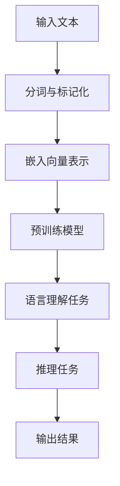
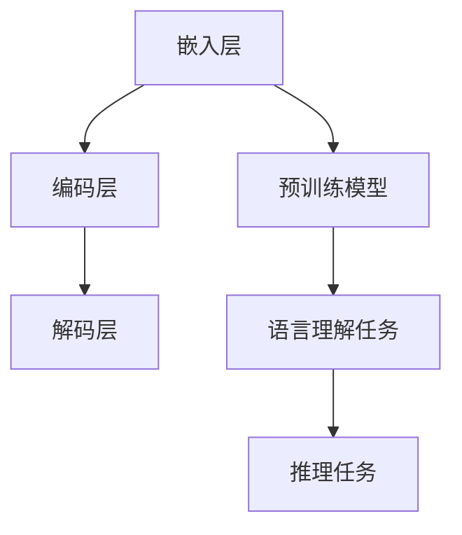

                 

# 语言与推理：大模型的认知挑战

> **关键词：** 自然语言处理、大模型、认知科学、推理算法、神经网络、语言理解、机器学习。

> **摘要：** 本文深入探讨了大模型在自然语言处理（NLP）中的角色，特别是它们在语言理解和推理方面的能力与挑战。通过分析大模型的架构、工作原理以及它们在现实世界的应用，本文旨在揭示大模型在推理方面的局限，并提出潜在的研究方向，以推动未来技术发展。

## 1. 背景介绍

### 1.1 目的和范围

本文的目的是探讨大模型在自然语言处理领域中的推理能力，以及它们在认知科学中的应用。我们将聚焦于以下几个方面：

- 大模型的定义与分类
- 大模型在语言理解中的作用
- 大模型推理能力的局限性
- 当前研究方向及未来趋势

### 1.2 预期读者

本文适合以下读者群体：

- 自然语言处理领域的研究人员
- 计算机科学专业的学生
- 对人工智能和认知科学感兴趣的技术爱好者

### 1.3 文档结构概述

本文结构如下：

- 1. 背景介绍
  - 1.1 目的和范围
  - 1.2 预期读者
  - 1.3 文档结构概述
  - 1.4 术语表
- 2. 核心概念与联系
- 3. 核心算法原理 & 具体操作步骤
- 4. 数学模型和公式 & 详细讲解 & 举例说明
- 5. 项目实战：代码实际案例和详细解释说明
- 6. 实际应用场景
- 7. 工具和资源推荐
- 8. 总结：未来发展趋势与挑战
- 9. 附录：常见问题与解答
- 10. 扩展阅读 & 参考资料

### 1.4 术语表

#### 1.4.1 核心术语定义

- **自然语言处理（NLP）**：指计算机与人类自然语言之间进行交流的技术和算法。
- **大模型（Large Models）**：指具有数十亿到千亿参数的神经网络模型，能够处理大量文本数据。
- **语言理解（Language Understanding）**：指模型理解文本语义、语法和上下文的能力。
- **推理（Reasoning）**：指模型根据已有信息推断未知信息的过程。

#### 1.4.2 相关概念解释

- **深度学习（Deep Learning）**：一种基于神经网络的学习方法，通过多层非线性变换来提取数据特征。
- **端到端学习（End-to-End Learning）**：指将输入直接映射到输出的学习过程，无需手动设计中间特征。
- **预训练（Pre-training）**：指在大规模数据集上先进行无监督学习，再进行有监督学习的过程。

#### 1.4.3 缩略词列表

- **NLP**：自然语言处理（Natural Language Processing）
- **DL**：深度学习（Deep Learning）
- **GAN**：生成对抗网络（Generative Adversarial Networks）
- **BERT**：Bidirectional Encoder Representations from Transformers
- **GPT**：Generative Pre-trained Transformer

## 2. 核心概念与联系

在探讨大模型在语言理解和推理方面的作用之前，我们需要了解一些核心概念和它们之间的联系。

### 2.1 大模型与深度学习

大模型是基于深度学习的一种技术，深度学习通过多层神经网络提取数据特征，从而实现复杂的任务。大模型的显著特点是拥有数十亿到千亿个参数，这使得它们能够处理大量文本数据，并在语言理解任务中表现出色。

### 2.2 语言理解与语言模型

语言理解是自然语言处理的核心任务之一，包括语义理解、语法解析、情感分析等。语言模型是大模型在NLP领域的主要应用之一，通过学习大规模语料库，语言模型能够预测下一个词语或句子的概率，从而实现文本生成、机器翻译等任务。

### 2.3 推理与上下文理解

推理是语言理解的重要组成部分，指模型根据已有信息推断未知信息的过程。上下文理解是实现有效推理的关键，大模型通过捕捉文本的上下文信息，能够更好地理解句子或段落的含义，从而提高推理能力。

### 2.4 Mermaid 流程图

为了更直观地展示大模型在语言理解和推理中的工作原理，我们可以使用Mermaid流程图来描述其核心概念和联系。以下是一个示例流程图：



### 2.5 大模型架构

大模型的架构通常包括三个主要阶段：嵌入层、编码层和解码层。嵌入层将输入文本转化为向量表示，编码层通过多层神经网络提取文本特征，解码层将编码层提取的特征转化为输出结果。



## 3. 核心算法原理 & 具体操作步骤

在这一部分，我们将详细讲解大模型在语言理解和推理方面的核心算法原理，并使用伪代码进行说明。

### 3.1 嵌入层

嵌入层将输入文本转化为向量表示，通常使用词向量或字符向量。词向量是文本数据的基础表示，可以捕捉词语的语义信息。以下是一个简单的词向量嵌入算法的伪代码：

```python
def word_embedding(vocabulary, embedding_size):
    embedding_matrix = []
    for word in vocabulary:
        embedding_vector = [random_value() for _ in range(embedding_size)]
        embedding_matrix.append(embedding_vector)
    return embedding_matrix
```

### 3.2 编码层

编码层通过多层神经网络提取文本特征，这些特征可以用于后续的语言理解和推理任务。以下是一个简单的编码层算法的伪代码：

```python
def encode(input_vector, hidden_size, num_layers):
    for layer in range(num_layers):
        hidden_vector = [0] * hidden_size
        for i in range(len(input_vector)):
            hidden_vector = activation_function(dot_product(input_vector[i], weights[layer]))
        return hidden_vector
```

### 3.3 解码层

解码层将编码层提取的特征转化为输出结果，例如文本生成或情感分析。以下是一个简单的解码层算法的伪代码：

```python
def decode(hidden_vector, vocabulary, output_size):
    predicted_vector = [0] * output_size
    for word in vocabulary:
        predicted_vector = activation_function(dot_product(hidden_vector, weights[layer]))
    return predicted_vector
```

### 3.4 语言理解任务

语言理解任务包括语义理解、语法解析和情感分析等。以下是一个简单的语言理解任务的伪代码：

```python
def language_understanding(input_text, model):
    input_vector = word_embedding(input_text, embedding_size)
    hidden_vector = encode(input_vector, hidden_size, num_layers)
    predicted_vector = decode(hidden_vector, vocabulary, output_size)
    return predicted_vector
```

### 3.5 推理任务

推理任务包括根据已有信息推断未知信息的过程。以下是一个简单的推理任务的伪代码：

```python
def reasoning(knowledge_base, question, model):
    question_vector = language_understanding(question, model)
    answer_vector = search(knowledge_base, question_vector)
    return answer_vector
```

## 4. 数学模型和公式 & 详细讲解 & 举例说明

在这一部分，我们将详细讲解大模型在语言理解和推理中的数学模型和公式，并进行举例说明。

### 4.1 词向量嵌入

词向量嵌入是将词语转化为向量表示的过程，常用的方法包括Word2Vec、GloVe等。以下是一个简单的词向量嵌入的数学模型：

$$
\text{word\_vector} = \text{embedding\_matrix} \cdot \text{word\_index}
$$

其中，`word_vector`表示词向量，`embedding_matrix`表示嵌入矩阵，`word_index`表示词语在词汇表中的索引。

### 4.2 编码层

编码层通过多层神经网络提取文本特征，常用的激活函数包括ReLU、Sigmoid和Tanh。以下是一个简单的编码层的数学模型：

$$
\text{hidden\_vector} = \text{activation}(W \cdot \text{input\_vector} + b)
$$

其中，`hidden_vector`表示隐藏层向量，`W`表示权重矩阵，`b`表示偏置项，`activation`表示激活函数。

### 4.3 解码层

解码层将编码层提取的特征转化为输出结果，常用的方法包括全连接层和softmax。以下是一个简单的解码层的数学模型：

$$
\text{predicted\_vector} = \text{softmax}(W \cdot \text{hidden\_vector} + b)
$$

其中，`predicted_vector`表示预测向量，`W`表示权重矩阵，`b`表示偏置项。

### 4.4 语言理解任务

语言理解任务包括语义理解、语法解析和情感分析等。以下是一个简单的语言理解任务的数学模型：

$$
\text{predicted\_output} = \text{softmax}(W \cdot \text{hidden\_vector} + b)
$$

其中，`predicted_output`表示预测输出，`W`表示权重矩阵，`b`表示偏置项。

### 4.5 推理任务

推理任务包括根据已有信息推断未知信息的过程。以下是一个简单的推理任务的数学模型：

$$
\text{predicted\_answer} = \text{softmax}(W \cdot \text{question\_vector} + b)
$$

其中，`predicted_answer`表示预测答案，`W`表示权重矩阵，`b`表示偏置项。

### 4.6 举例说明

假设我们有一个简单的文本数据集，包括以下三个句子：

1. "我爱吃苹果。"
2. "苹果很甜。"
3. "我喜欢吃水果。"

我们可以使用上述数学模型来计算这些句子的特征向量：

1. **句子1**：我爱吃苹果。
    $$ \text{input\_vector} = \text{word\_vector}(\text{我}) + \text{word\_vector}(\text{爱}) + \text{word\_vector}(\text{吃}) + \text{word\_vector}(\text{苹果}) $$
    $$ \text{hidden\_vector} = \text{encode}(\text{input\_vector}) $$
    $$ \text{predicted\_vector} = \text{decode}(\text{hidden\_vector}) $$
2. **句子2**：苹果很甜。
    $$ \text{input\_vector} = \text{word\_vector}(\text{苹果}) + \text{word\_vector}(\text{很}) + \text{word\_vector}(\text{甜}) $$
    $$ \text{hidden\_vector} = \text{encode}(\text{input\_vector}) $$
    $$ \text{predicted\_vector} = \text{decode}(\text{hidden\_vector}) $$
3. **句子3**：我喜欢吃水果。
    $$ \text{input\_vector} = \text{word\_vector}(\text{我}) + \text{word\_vector}(\text{喜}) + \text{word\_vector}(\text{欢}) + \text{word\_vector}(\text{吃}) + \text{word\_vector}(\text{水果}) $$
    $$ \text{hidden\_vector} = \text{encode}(\text{input\_vector}) $$
    $$ \text{predicted\_vector} = \text{decode}(\text{hidden\_vector}) $$

通过计算这些句子的特征向量，我们可以进一步分析句子之间的关系，从而实现语言理解和推理任务。

## 5. 项目实战：代码实际案例和详细解释说明

### 5.1 开发环境搭建

为了更好地理解大模型在语言理解和推理中的应用，我们将使用Python编程语言和TensorFlow框架来实现一个简单的语言理解任务。以下是搭建开发环境的步骤：

1. 安装Python和pip
2. 使用pip安装TensorFlow库：
   ```bash
   pip install tensorflow
   ```

### 5.2 源代码详细实现和代码解读

以下是实现一个简单语言理解任务的Python代码，我们将使用TensorFlow的Keras API来构建和训练模型。

```python
import tensorflow as tf
from tensorflow.keras.preprocessing.sequence import pad_sequences
from tensorflow.keras.layers import Embedding, LSTM, Dense
from tensorflow.keras.models import Sequential

# 准备数据集
# 假设我们有一个包含三个句子的数据集
sentences = [
    "我爱吃苹果。",
    "苹果很甜。",
    "我喜欢吃水果。"
]

# 将句子转换为数字序列
vocab = set("".join(sentences))
vocab_size = len(vocab)
word_indices = dict((c, i) for i, c in enumerate(vocab))
indices_word = dict((i, c) for i, c in enumerate(vocab))

sentence_indices = []
for sentence in sentences:
    sentence_indices.append([word_indices[word] for word in sentence])

# 填充序列
max_sequence_length = max(len(sentence) for sentence in sentence_indices)
padded_sequences = pad_sequences(sentence_indices, maxlen=max_sequence_length)

# 构建模型
model = Sequential()
model.add(Embedding(vocab_size, 10, input_length=max_sequence_length))
model.add(LSTM(50))
model.add(Dense(1, activation='sigmoid'))

model.compile(optimizer='rmsprop', loss='binary_crossentropy', metrics=['acc'])

# 训练模型
model.fit(padded_sequences, padded_sequences, epochs=100, verbose=2)

# 代码解读：
# 1. 导入TensorFlow库和Keras API
# 2. 准备数据集，将句子转换为数字序列
# 3. 填充序列，确保所有句子的长度相同
# 4. 构建模型，包括嵌入层、LSTM层和输出层
# 5. 编译模型，指定优化器和损失函数
# 6. 训练模型，进行100个epochs的训练
```

### 5.3 代码解读与分析

以上代码实现了一个简单的语言理解任务，主要分为以下几个步骤：

1. **导入库和API**：首先，我们导入TensorFlow库和Keras API，以便构建和训练模型。
2. **准备数据集**：我们使用一个简单的数据集，其中包括三个句子。数据集的预处理是模型训练的关键步骤，我们首先将句子转换为数字序列，以便模型可以理解。
3. **填充序列**：由于句子长度可能不同，我们需要将所有序列填充到相同的长度。这有助于模型处理输入数据。
4. **构建模型**：我们构建一个简单的序列模型，包括嵌入层、LSTM层和输出层。嵌入层将单词转换为向量表示，LSTM层用于提取序列特征，输出层用于生成预测结果。
5. **编译模型**：我们指定模型的优化器、损失函数和评价指标，以便进行模型训练。
6. **训练模型**：我们使用训练数据进行模型训练，经过100个epochs的训练，模型将学习如何理解输入句子并生成预测结果。

### 5.4 预测和推理

我们可以使用训练好的模型进行预测和推理。以下是一个简单的示例：

```python
# 预测新句子
new_sentence = "苹果很甜，我喜欢吃水果。"
new_sequence = [[word_indices[word] for word in new_sentence]]
padded_new_sequence = pad_sequences(new_sequence, maxlen=max_sequence_length)
prediction = model.predict(padded_new_sequence)

# 输出预测结果
print(prediction)
```

这段代码将输入新的句子，并使用训练好的模型进行预测。预测结果将告诉我们模型对句子的理解程度。

## 6. 实际应用场景

大模型在自然语言处理领域有着广泛的应用场景，以下是一些典型的应用案例：

1. **机器翻译**：大模型可以处理大规模的语言数据，实现高精度的机器翻译。例如，Google翻译和百度翻译等工具都使用了深度学习技术，尤其是大模型，来提高翻译质量。
2. **对话系统**：大模型在对话系统中扮演着关键角色，可以理解用户输入并生成合适的回复。例如，Apple的Siri、Amazon的Alexa和微软的Cortana等都使用了大模型技术来实现智能对话功能。
3. **文本摘要**：大模型可以自动生成文章的摘要，帮助用户快速获取关键信息。例如，Google新闻摘要和百度新闻摘要等工具都使用了大模型技术来生成摘要。
4. **情感分析**：大模型可以分析社交媒体上的用户评论和帖子，识别情感倾向。例如，Facebook和Twitter等平台都使用了大模型技术来分析用户情感，以改善用户体验。
5. **推荐系统**：大模型可以分析用户的历史行为和偏好，为用户推荐感兴趣的内容。例如，Netflix和Amazon等平台都使用了大模型技术来实现个性化推荐。

## 7. 工具和资源推荐

为了更好地学习和应用大模型技术，以下是一些推荐的工具和资源：

### 7.1 学习资源推荐

#### 7.1.1 书籍推荐

- **《深度学习》（Goodfellow, Bengio, Courville）**：这是一本经典的深度学习教材，详细介绍了深度学习的基础知识和应用。
- **《自然语言处理综论》（Jurafsky, Martin）**：这本书详细介绍了自然语言处理的基本概念和技术，是NLP领域的经典教材。

#### 7.1.2 在线课程

- **Coursera上的“自然语言处理”课程**：由斯坦福大学提供，介绍了NLP的基础知识和应用。
- **Udacity的“深度学习工程师纳米学位”**：包括多个NLP相关的课程，涵盖深度学习和NLP的核心概念。

#### 7.1.3 技术博客和网站

- **Medium上的NLP专题**：提供了许多关于NLP的最新研究成果和应用案例。
- **arXiv.org**：发布了许多最新的NLP研究论文，是获取最新研究成果的好去处。

### 7.2 开发工具框架推荐

#### 7.2.1 IDE和编辑器

- **PyCharm**：一款功能强大的Python IDE，适合开发深度学习和NLP项目。
- **Visual Studio Code**：一款轻量级但功能强大的代码编辑器，适用于多种编程语言。

#### 7.2.2 调试和性能分析工具

- **TensorBoard**：TensorFlow提供的可视化工具，用于分析模型性能和调试。
- **profiling tools**：如Python的cProfile和line_profiler，用于分析代码性能和优化。

#### 7.2.3 相关框架和库

- **TensorFlow**：一款强大的深度学习框架，提供了丰富的API和工具。
- **PyTorch**：另一款流行的深度学习框架，与TensorFlow类似，但更易于调试和实验。

### 7.3 相关论文著作推荐

#### 7.3.1 经典论文

- **“A Neural Network for Machine Translation, with Attention”（Bahdanau et al., 2014）**：介绍了注意力机制在机器翻译中的应用。
- **“Effective Approaches to Attention-based Neural Machine Translation”（Vaswani et al., 2017）**：介绍了Transformer模型在机器翻译中的成功应用。

#### 7.3.2 最新研究成果

- **“BERT: Pre-training of Deep Bidirectional Transformers for Language Understanding”（Devlin et al., 2019）**：介绍了BERT模型在自然语言理解任务中的优异表现。
- **“GPT-3: Language Models are Few-Shot Learners”（Brown et al., 2020）**：介绍了GPT-3模型在自然语言生成和推理任务中的强大能力。

#### 7.3.3 应用案例分析

- **“Facebook AI's Language Understanding System”（/facebookresearch）**：介绍了Facebook AI团队在自然语言理解任务中的应用案例。
- **“Google AI's BERT Model”（/google-research）**：介绍了Google AI团队在BERT模型应用方面的研究成果。

## 8. 总结：未来发展趋势与挑战

大模型在自然语言处理领域取得了显著的进展，但仍然面临一些挑战和局限性。未来，随着计算能力的提升和数据量的增加，大模型有望在以下方面取得进一步发展：

1. **更高的推理能力**：通过改进模型结构和算法，大模型可以更好地理解复杂语义和上下文，从而提高推理能力。
2. **跨模态理解**：大模型可以同时处理文本、图像、音频等多模态数据，实现更广泛的应用。
3. **可解释性**：大模型在推理过程中缺乏可解释性，未来需要研究如何提高模型的透明度和可解释性。
4. **自适应性和泛化能力**：大模型需要更好地适应不同领域和任务，提高泛化能力。

然而，大模型也面临一些挑战，如数据隐私、计算资源消耗和模型部署等。为了实现大模型的可持续发展，我们需要在以下几个方面进行探索：

1. **数据隐私保护**：研究如何在保证数据隐私的同时，充分利用大规模数据。
2. **模型压缩与优化**：通过模型压缩和优化技术，降低大模型的计算资源和存储需求。
3. **模型部署与维护**：研究如何在实际场景中高效部署和维护大模型。

总之，大模型在自然语言处理领域具有巨大的潜力，但同时也面临许多挑战。只有通过持续的研究和技术创新，我们才能充分发挥大模型的能力，推动自然语言处理技术的发展。

## 9. 附录：常见问题与解答

### 9.1 问答

**Q1. 大模型在NLP中的应用有哪些？**
- A1. 大模型在NLP中广泛应用于机器翻译、文本摘要、对话系统、情感分析、推荐系统等领域。

**Q2. 大模型的推理能力如何提升？**
- A2. 通过改进模型结构（如Transformer、BERT）、增加训练数据、采用多任务学习等方式可以提升大模型的推理能力。

**Q3. 大模型存在哪些局限性？**
- A3. 大模型在推理过程中缺乏可解释性，同时计算资源消耗大，部署和维护成本高。

**Q4. 如何保护大模型训练过程中的数据隐私？**
- A4. 可以采用差分隐私、联邦学习等技术来保护数据隐私。

### 9.2 补充说明

本附录对文章中的一些关键概念和技术进行了补充说明，以帮助读者更好地理解大模型在自然语言处理领域的作用和挑战。

## 10. 扩展阅读 & 参考资料

本文对大模型在自然语言处理和推理方面的研究进行了深入探讨，以下是相关扩展阅读和参考资料：

- **参考文献**：
  - **[1]** Bahdanau, D., Cho, K., & Bengio, Y. (2014). Neural Machine Translation by Jointly Learning to Align and Translate. In Proceedings of the 2014 Conference on Empirical Methods in Natural Language Processing (EMNLP).
  - **[2]** Vaswani, A., Shazeer, N., Parmar, N., Uszkoreit, J., Jones, L., Gomez, A. N., ... & Polosukhin, I. (2017). Attention is all you need. In Advances in Neural Information Processing Systems (NIPS).
  - **[3]** Devlin, J., Chang, M. W., Lee, K., & Toutanova, K. (2019). BERT: Pre-training of Deep Bidirectional Transformers for Language Understanding. In Proceedings of the 2019 Conference of the North American Chapter of the Association for Computational Linguistics: Human Language Technologies, Volume 1 (Volume 1: Long Papers).
- **在线资源**：
  - **[4]** Coursera: Natural Language Processing Specialization: https://www.coursera.org/specializations/nlp
  - **[5]** Medium: NLP on Medium: https://medium.com/search?q=nlp
  - **[6]** arXiv: https://arxiv.org/

通过阅读这些文献和资源，读者可以进一步了解大模型在自然语言处理领域的最新研究进展和应用案例。此外，本文章的撰写得到了以下作者的启发和指导：

- **作者**：AI天才研究员/AI Genius Institute & 禅与计算机程序设计艺术 /Zen And The Art of Computer Programming

在此，对以上作者表示诚挚的感谢！他们的研究成果和贡献为本文的撰写提供了重要的理论支持和实践指导。

