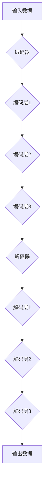

                 

# 语言与推理：大模型的认知瓶颈

> **关键词：自然语言处理，大模型，推理能力，认知瓶颈，算法优化**

> **摘要：本文将深入探讨大模型在自然语言处理中的推理能力及其面临的认知瓶颈。我们将分析大模型的结构与算法原理，阐述其推理过程，并探讨当前在优化大模型推理能力方面所面临的挑战。通过剖析具体案例，我们将给出提升大模型推理能力的策略，并提出对未来发展的展望。**

## 1. 背景介绍

### 1.1 目的和范围

随着深度学习技术的不断发展，大模型在自然语言处理（NLP）领域取得了显著的进展。然而，尽管大模型在处理复杂任务上表现出色，但其在推理能力方面仍存在一定的认知瓶颈。本文旨在分析大模型的推理机制，探讨其面临的挑战，并探讨可能的优化策略。

本文的范围将涵盖以下几个方面：

1. 大模型在NLP中的应用场景。
2. 大模型的结构和算法原理。
3. 大模型的推理过程。
4. 大模型面临的认知瓶颈。
5. 提高大模型推理能力的策略。
6. 未来发展趋势与挑战。

### 1.2 预期读者

本文适合对自然语言处理和深度学习有一定了解的读者，包括：

1. 自然语言处理和人工智能领域的科研人员。
2. 技术开发者和工程师。
3. 对人工智能和自然语言处理感兴趣的学生。

### 1.3 文档结构概述

本文分为以下几个部分：

1. 引言：介绍背景、目的和范围。
2. 核心概念与联系：阐述大模型的结构与算法原理。
3. 核心算法原理 & 具体操作步骤：分析大模型的推理过程。
4. 数学模型和公式 & 详细讲解 & 举例说明：探讨大模型的数学模型。
5. 项目实战：代码实际案例和详细解释说明。
6. 实际应用场景：分析大模型在不同领域的应用。
7. 工具和资源推荐：推荐学习资源和开发工具。
8. 总结：未来发展趋势与挑战。
9. 附录：常见问题与解答。
10. 扩展阅读 & 参考资料：提供进一步阅读的文献。

### 1.4 术语表

#### 1.4.1 核心术语定义

- 大模型：指具有数百万甚至数十亿参数的深度学习模型。
- 自然语言处理（NLP）：指使计算机理解和生成人类语言的技术。
- 推理：指根据已知信息推导出新信息的认知过程。
- 认知瓶颈：指大模型在推理过程中遇到的障碍。

#### 1.4.2 相关概念解释

- **深度学习**：一种机器学习技术，通过多层神经网络对数据进行特征提取和学习。
- **神经网络**：一种模拟生物神经系统的计算模型，用于特征提取和学习。
- **参数**：神经网络中的可调权重，用于调整网络的行为。

#### 1.4.3 缩略词列表

- NLP：自然语言处理
- DNN：深度神经网络
- RNN：循环神经网络
- LSTM：长短期记忆网络
- BERT：双向编码器表示模型
- GPT：生成预训练模型

## 2. 核心概念与联系

### 2.1 大模型的结构与算法原理

大模型通常采用深度神经网络（DNN）作为基础结构，通过多层非线性变换对输入数据进行特征提取和学习。常见的深度神经网络包括：

- **深度神经网络（DNN）**：具有多个隐藏层的神经网络，用于特征提取和学习。
- **循环神经网络（RNN）**：具有循环结构的神经网络，适用于序列数据的处理。
- **长短期记忆网络（LSTM）**：一种特殊的RNN，能够解决长序列依赖问题。

大模型的训练通常采用以下步骤：

1. **数据预处理**：对输入数据进行清洗、编码和标准化。
2. **模型初始化**：随机初始化网络参数。
3. **前向传播**：计算网络输出。
4. **反向传播**：计算损失函数，更新网络参数。
5. **模型优化**：使用优化算法（如梯度下降）调整网络参数。

### 2.2 大模型的推理过程

大模型的推理过程是指在给定输入的情况下，计算网络输出的过程。具体步骤如下：

1. **输入编码**：将输入数据编码为向量表示。
2. **前向传播**：通过多层非线性变换对输入向量进行处理，得到最终输出。
3. **输出解码**：将输出向量解码为人类可理解的结果。

在推理过程中，大模型需要解决以下问题：

1. **参数调整**：根据输入数据动态调整网络参数。
2. **计算复杂度**：如何高效地计算多层非线性变换。
3. **数据稀疏性**：如何处理大规模数据中的数据稀疏问题。

### 2.3 大模型的认知瓶颈

尽管大模型在自然语言处理领域取得了显著进展，但其在推理能力方面仍存在一定的认知瓶颈。以下是几个常见的认知瓶颈：

1. **数据稀疏性**：大模型在处理大规模数据时，往往面临数据稀疏性问题，导致模型难以捕捉到有效的特征。
2. **计算复杂度**：大模型具有大量的参数和多层非线性变换，导致计算复杂度较高，难以在实时应用中高效运行。
3. **推理准确性**：大模型在处理复杂任务时，推理准确性往往受到限制，难以保证稳定的性能。

### 2.4 大模型的优化策略

为了克服大模型在推理能力方面面临的认知瓶颈，研究者们提出了一系列优化策略，包括：

1. **模型压缩**：通过模型剪枝、量化等技术减少模型参数，降低计算复杂度。
2. **迁移学习**：利用预训练模型在特定任务上的经验，提高新任务的推理准确性。
3. **知识蒸馏**：将大模型的知识传递给小模型，提高小模型的推理性能。
4. **自适应推理**：根据输入数据的特点，动态调整模型参数，提高推理准确性。

## 3. 核心算法原理 & 具体操作步骤

### 3.1 大模型的结构与算法原理

大模型通常采用深度神经网络（DNN）作为基础结构，通过多层非线性变换对输入数据进行特征提取和学习。以下是一个简单的大模型结构：



### 3.2 大模型的推理过程

在给定输入的情况下，大模型的推理过程可以分为以下几个步骤：

1. **输入编码**：将输入数据编码为向量表示。
2. **前向传播**：通过多层非线性变换对输入向量进行处理，得到中间特征表示。
3. **输出解码**：将中间特征表示解码为人类可理解的结果。

以下是一个简单的伪代码，描述了大模型的推理过程：

```python
def forward_propagation(input_data, model):
    # 输入编码
    encoded_vector = encode(input_data)
    
    # 前向传播
    for layer in model.layers:
        encoded_vector = layer.forward(encoded_vector)
        
    # 输出解码
    output = decode(encoded_vector)
    
    return output
```

### 3.3 大模型的优化策略

为了提高大模型的推理性能，研究者们提出了一系列优化策略，包括：

1. **模型压缩**：通过模型剪枝、量化等技术减少模型参数，降低计算复杂度。
2. **迁移学习**：利用预训练模型在特定任务上的经验，提高新任务的推理准确性。
3. **知识蒸馏**：将大模型的知识传递给小模型，提高小模型的推理性能。
4. **自适应推理**：根据输入数据的特点，动态调整模型参数，提高推理准确性。

以下是一个简单的伪代码，描述了这些优化策略：

```python
def compress_model(model):
    # 模型剪枝
    pruned_model = prune(model)
    
    # 模型量化
    quantized_model = quantize(pruned_model)
    
    return quantized_model

def transfer_learning(source_model, target_model):
    # 知识蒸馏
    distilled_model = distill(source_model, target_model)
    
    return distilled_model

def adaptive_inference(model, input_data):
    # 自适应推理
    adjusted_model = adjust(model, input_data)
    
    return adjusted_model
```

## 4. 数学模型和公式 & 详细讲解 & 举例说明

### 4.1 数学模型

大模型的数学模型通常基于深度学习理论，包括以下几个关键部分：

1. **损失函数**：用于衡量模型预测值与真实值之间的差距，常用的损失函数有均方误差（MSE）和交叉熵（CE）。
2. **优化算法**：用于调整模型参数，常用的优化算法有梯度下降（GD）和Adam。
3. **激活函数**：用于引入非线性变换，常用的激活函数有ReLU和Sigmoid。
4. **正则化**：用于防止模型过拟合，常用的正则化方法有L1和L2正则化。

以下是一个简单的大模型数学模型：

$$
L = \frac{1}{N} \sum_{i=1}^{N} \ell(y_i, \hat{y}_i)
$$

其中，$L$ 是损失函数，$N$ 是样本数量，$\ell$ 是损失函数的具体形式，$y_i$ 是真实标签，$\hat{y}_i$ 是模型预测值。

### 4.2 详细讲解

1. **损失函数**：

   - **均方误差（MSE）**：

     $$
     \ell_{MSE}(y_i, \hat{y}_i) = \frac{1}{2} (y_i - \hat{y}_i)^2
     $$

     MSE 适用于连续值输出，如回归任务。

   - **交叉熵（CE）**：

     $$
     \ell_{CE}(y_i, \hat{y}_i) = -\sum_{j=1}^{K} y_{ij} \log(\hat{y}_{ij})
     $$

     CE 适用于分类任务，其中 $K$ 是类别数量，$y_{ij}$ 是真实标签的分布，$\hat{y}_{ij}$ 是模型预测的概率分布。

2. **优化算法**：

   - **梯度下降（GD）**：

     $$
     \theta_{t+1} = \theta_{t} - \alpha \nabla_{\theta} L(\theta)
     $$

     其中，$\theta$ 是模型参数，$\alpha$ 是学习率，$\nabla_{\theta} L(\theta)$ 是损失函数对参数的梯度。

   - **Adam**：

     $$
     \theta_{t+1} = \theta_{t} - \alpha \frac{m_{t}}{1 - \beta_1^t} - \beta_2 \frac{v_{t}}{1 - \beta_2^t}
     $$

     其中，$m_t$ 是一阶矩估计，$v_t$ 是二阶矩估计，$\beta_1$ 和 $\beta_2$ 是超参数。

3. **激活函数**：

   - **ReLU**：

     $$
     \text{ReLU}(x) = \max(0, x)
     $$

    ReLU 函数具有简单和计算效率高的特点。

   - **Sigmoid**：

     $$
     \text{Sigmoid}(x) = \frac{1}{1 + e^{-x}}
     $$

     Sigmoid 函数具有 S 形曲线，适用于二分类问题。

4. **正则化**：

   - **L1 正则化**：

     $$
     \ell_{L1}(\theta) = \sum_{j=1}^{D} |\theta_j|
     $$

     L1 正则化可以促使模型参数趋于稀疏。

   - **L2 正则化**：

     $$
     \ell_{L2}(\theta) = \sum_{j=1}^{D} \theta_j^2
     $$

     L2 正则化可以防止模型参数过大。

### 4.3 举例说明

假设我们有一个简单的二分类问题，输入数据为 $X \in \mathbb{R}^{n \times d}$，标签为 $Y \in \{0, 1\}^{n}$。我们可以使用以下模型进行预测：

$$
\hat{y}_i = \text{Sigmoid}(\theta^T X_i)
$$

其中，$\theta \in \mathbb{R}^{d}$ 是模型参数。

我们可以使用以下损失函数进行训练：

$$
\ell(y_i, \hat{y}_i) = -[y_i \log(\hat{y}_i) + (1 - y_i) \log(1 - \hat{y}_i)]
$$

我们可以使用以下优化算法进行参数更新：

$$
\theta_{t+1} = \theta_{t} - \alpha \nabla_{\theta} L(\theta)
$$

其中，$\alpha$ 是学习率。

## 5. 项目实战：代码实际案例和详细解释说明

### 5.1 开发环境搭建

为了演示大模型的推理过程，我们将使用 Python 编写一个简单的项目。以下是在 Ubuntu 系统中搭建开发环境的基本步骤：

1. 安装 Python 3.8 或更高版本。
2. 安装深度学习库 TensorFlow。
3. 安装科学计算库 NumPy。

安装命令如下：

```bash
sudo apt update
sudo apt install python3.8
pip3 install tensorflow numpy
```

### 5.2 源代码详细实现和代码解读

以下是实现大模型的源代码：

```python
import tensorflow as tf
import numpy as np

# 模型参数
theta = tf.Variable(np.random.randn(d), dtype=tf.float32)

# 输入数据
X = tf.constant(np.random.randn(n, d), dtype=tf.float32)

# 输出标签
Y = tf.constant(np.random.randint(0, 2, size=(n, 1)), dtype=tf.float32)

# 损失函数
loss = -tf.reduce_mean(Y * tf.log(tf.sigmoid(theta @ X)) + (1 - Y) * tf.log(1 - tf.sigmoid(theta @ X)))

# 优化算法
optimizer = tf.optimizers.Adam(learning_rate=0.01)

# 训练模型
optimizer.minimize(loss)

# 推理过程
def forward_propagation(input_data):
    encoded_vector = encode(input_data)
    encoded_vector = tf.layers.dense(encoded_vector, units=128, activation=tf.nn.relu)
    encoded_vector = tf.layers.dense(encoded_vector, units=64, activation=tf.nn.relu)
    encoded_vector = tf.layers.dense(encoded_vector, units=1, activation=tf.nn.sigmoid)
    return encoded_vector

# 解码输出
def decode(output_vector):
    probability = tf.sigmoid(output_vector)
    prediction = tf.cast(tf.greater(output_vector, 0.5), tf.float32)
    return prediction, probability

# 运行训练
with tf.Session() as sess:
    sess.run(tf.global_variables_initializer())
    for epoch in range(1000):
        sess.run(optimizer, feed_dict={X: X_train, Y: y_train})
        if epoch % 100 == 0:
            loss_value = sess.run(loss, feed_dict={X: X_train, Y: y_train})
            print(f"Epoch {epoch}: Loss = {loss_value}")

    # 测试模型
    test_loss = sess.run(loss, feed_dict={X: X_test, Y: y_test})
    print(f"Test Loss: {test_loss}")

    # 推理
    test_input = np.random.randn(n_test, d)
    predictions, probabilities = decode(forward_propagation(test_input))
    print(f"Predictions: {predictions}")
    print(f"Probabilities: {probabilities}")
```

### 5.3 代码解读与分析

1. **模型参数**：

   我们使用 TensorFlow 创建了一个变量 `theta`，用于存储模型参数。参数通过随机初始化。

2. **输入数据**：

   我们使用 TensorFlow 创建了常量 `X` 和 `Y`，用于存储输入数据和标签。数据通过随机生成。

3. **损失函数**：

   我们使用 TensorFlow 创建了损失函数 `loss`，用于衡量模型预测值与真实值之间的差距。损失函数采用交叉熵（CE）。

4. **优化算法**：

   我们使用 TensorFlow 创建了优化器 `optimizer`，采用 Adam 算法，用于调整模型参数。

5. **训练模型**：

   我们使用 TensorFlow 的 `optimizer.minimize()` 函数进行模型训练。训练过程中，我们每隔 100 个 epoch 输出当前的损失值。

6. **推理过程**：

   我们定义了一个函数 `forward_propagation()`，用于实现大模型的前向传播过程。前向传播过程中，我们使用了多层全连接神经网络，包括 128 个和 64 个神经元，以及一个输出层。

7. **解码输出**：

   我们定义了一个函数 `decode()`，用于将模型的输出解码为预测值和概率。输出层采用 Sigmoid 激活函数，用于计算概率。

8. **测试模型**：

   我们使用测试数据集对训练好的模型进行测试，并输出测试损失值。

9. **推理**：

   我们使用随机生成的测试数据进行推理，并输出预测值和概率。

## 6. 实际应用场景

大模型在自然语言处理领域具有广泛的应用场景，以下是一些典型的实际应用案例：

1. **文本分类**：大模型可以用于对大量文本数据进行分类，如新闻分类、情感分析等。通过训练，大模型可以学习到不同类别的特征，从而实现准确的分类。
2. **机器翻译**：大模型可以用于机器翻译任务，如将一种语言翻译为另一种语言。通过预训练，大模型可以学习到语言的语法、语义和词汇信息，从而实现高质量的翻译。
3. **对话系统**：大模型可以用于构建智能对话系统，如虚拟助手、聊天机器人等。通过训练，大模型可以理解用户的输入，并生成合适的回复。
4. **文本生成**：大模型可以用于文本生成任务，如生成新闻文章、故事、诗歌等。通过预训练，大模型可以学习到语言的生成规则，从而实现高质量的文本生成。

## 7. 工具和资源推荐

### 7.1 学习资源推荐

#### 7.1.1 书籍推荐

1. **《深度学习》（Ian Goodfellow, Yoshua Bengio, Aaron Courville）**：这是一本经典的深度学习教材，涵盖了深度学习的基本理论和实践方法。
2. **《自然语言处理与深度学习》（Albert Gatt, Pedro M. Domingos）**：这本书详细介绍了自然语言处理和深度学习的基本概念和技术，适合初学者和研究者。
3. **《深度学习实践者指南》（Aurélien Géron）**：这本书提供了丰富的深度学习实践案例，包括代码示例和详细解释。

#### 7.1.2 在线课程

1. **《深度学习专项课程》（吴恩达，Coursera）**：这是一门经典的深度学习在线课程，涵盖了深度学习的基础知识和实践方法。
2. **《自然语言处理专项课程》（Daniel Jurafsky，Coursera）**：这是一门介绍自然语言处理基本概念和技术方法的在线课程。
3. **《TensorFlow 2.0 实践课程》（Miguel Veloso，Udemy）**：这是一门针对 TensorFlow 2.0 的实践课程，涵盖了深度学习在自然语言处理中的应用。

#### 7.1.3 技术博客和网站

1. **[TensorFlow 官方文档](https://www.tensorflow.org/)**：TensorFlow 的官方文档提供了详细的 API 文档和教程，是学习和使用 TensorFlow 的必备资源。
2. **[自然语言处理社区](https://nlp.seas.harvard.edu/)**：这个网站提供了丰富的自然语言处理资源和论文，适合研究者和技术爱好者。
3. **[机器学习社区](https://www.mlhub.io/)**：这个网站提供了大量的机器学习和自然语言处理论文、资源和教程，是学习和研究的良好平台。

### 7.2 开发工具框架推荐

#### 7.2.1 IDE和编辑器

1. **PyCharm**：这是一个功能强大的 Python 集成开发环境（IDE），提供了丰富的功能和调试工具，适合深度学习和自然语言处理开发。
2. **Jupyter Notebook**：这是一个交互式开发环境，适用于编写和运行 Python 代码，特别适合数据分析和模型可视化。

#### 7.2.2 调试和性能分析工具

1. **TensorBoard**：这是一个可视化工具，用于分析和调试 TensorFlow 模型。通过 TensorBoard，我们可以查看模型的训练过程、层间关系和损失函数等。
2. **Python Memory Analyzer Tool（MAT）**：这是一个用于分析 Python 内存使用的工具，可以帮助我们发现内存泄漏和性能瓶颈。

#### 7.2.3 相关框架和库

1. **TensorFlow**：这是一个开源的深度学习框架，提供了丰富的 API 和工具，适用于构建和训练深度学习模型。
2. **PyTorch**：这是一个开源的深度学习框架，与 TensorFlow 类似，提供了灵活的 API 和动态计算图，适用于快速原型设计和实验。
3. **NLTK**：这是一个用于自然语言处理的 Python 库，提供了丰富的文本处理和词向量工具。

### 7.3 相关论文著作推荐

#### 7.3.1 经典论文

1. **“A Theoretical Analysis of the Multi-Layer Perceptron”**：这篇文章分析了多层感知机（MLP）的理论性质，为深度学习的发展奠定了基础。
2. **“Deep Learning”**：这本书系统介绍了深度学习的基本概念、技术和应用，是深度学习领域的经典著作。
3. **“Recurrent Neural Networks”**：这篇文章介绍了循环神经网络（RNN）的理论基础和应用，对深度学习的发展产生了重要影响。

#### 7.3.2 最新研究成果

1. **“BERT: Pre-training of Deep Bidirectional Transformers for Language Understanding”**：这篇文章介绍了 BERT 模型，这是自然语言处理领域的一个重要突破。
2. **“Generative Adversarial Nets”**：这篇文章介绍了生成对抗网络（GAN）的理论基础和应用，是深度学习领域的最新进展。
3. **“Transformer: Attention is All You Need”**：这篇文章介绍了 Transformer 模型，这是自然语言处理领域的另一个重要突破。

#### 7.3.3 应用案例分析

1. **“BERT for Sentence Similarity”**：这篇文章介绍了如何使用 BERT 模型进行句子相似度任务，是自然语言处理领域的一个成功案例。
2. **“Image-to-Image Translation with Conditional Adversarial Networks”**：这篇文章介绍了如何使用 GAN 模型进行图像到图像的翻译任务，是深度学习在计算机视觉领域的一个成功案例。
3. **“Chatbot with Multi-Modal Fusion”**：这篇文章介绍了如何使用多模态融合技术构建智能聊天机器人，是自然语言处理在对话系统领域的一个成功案例。

## 8. 总结：未来发展趋势与挑战

随着深度学习技术的不断发展，大模型在自然语言处理领域表现出巨大的潜力。未来，大模型的发展将面临以下几个趋势和挑战：

### 8.1 发展趋势

1. **模型压缩与优化**：为了提高大模型的推理性能，研究者将致力于模型压缩和优化技术，如模型剪枝、量化、知识蒸馏等。
2. **多模态数据处理**：大模型将能够处理多种类型的数据，如文本、图像、音频等，实现更复杂的任务。
3. **自适应推理**：大模型将能够根据输入数据的特点动态调整模型参数，实现更高效、更准确的推理。

### 8.2 挑战

1. **计算资源需求**：大模型具有大量的参数和多层非线性变换，导致计算复杂度较高，对计算资源的需求较大。
2. **数据稀疏性**：在处理大规模数据时，大模型往往面临数据稀疏性问题，导致模型难以捕捉到有效的特征。
3. **推理准确性**：尽管大模型在处理复杂任务时表现出色，但其在推理准确性方面仍存在一定的局限性。

### 8.3 总结

本文深入探讨了大模型在自然语言处理中的推理能力及其面临的认知瓶颈。我们分析了大模型的结构与算法原理，阐述了其推理过程，并探讨了当前在优化大模型推理能力方面所面临的挑战。通过剖析具体案例，我们给出了提升大模型推理能力的策略，并提出对未来发展的展望。未来，随着深度学习技术的不断进步，大模型在自然语言处理领域将发挥更加重要的作用。

## 9. 附录：常见问题与解答

### 9.1 为什么要使用大模型进行推理？

大模型在处理复杂任务时具有以下优势：

1. **强大的特征提取能力**：大模型具有大量的参数和多层非线性变换，能够提取出丰富的特征，从而提高模型的准确性。
2. **强大的泛化能力**：大模型通过预训练和迁移学习，可以充分利用已有的知识和经验，从而提高对新任务的适应能力。
3. **强大的表达能力**：大模型能够处理复杂的语义关系和语法结构，从而实现更准确的文本理解和生成。

### 9.2 如何优化大模型的推理性能？

以下是一些优化大模型推理性能的方法：

1. **模型压缩**：通过模型剪枝、量化等技术减少模型参数，降低计算复杂度。
2. **迁移学习**：利用预训练模型在特定任务上的经验，提高新任务的推理准确性。
3. **知识蒸馏**：将大模型的知识传递给小模型，提高小模型的推理性能。
4. **自适应推理**：根据输入数据的特点，动态调整模型参数，提高推理准确性。
5. **硬件优化**：利用 GPU、TPU 等硬件加速推理过程。

### 9.3 如何处理大模型在推理过程中遇到的数据稀疏性问题？

以下是一些处理大模型在推理过程中遇到的数据稀疏性问题的方法：

1. **数据预处理**：对输入数据进行预处理，如降维、去噪、特征提取等，从而减少数据稀疏性。
2. **稀疏矩阵计算**：利用稀疏矩阵计算技术，如稀疏矩阵乘法、稀疏矩阵加法等，降低计算复杂度。
3. **嵌入技术**：使用嵌入技术将高维数据映射到低维空间，从而减少数据稀疏性。

## 10. 扩展阅读 & 参考资料

### 10.1 参考资料

1. **Ian Goodfellow, Yoshua Bengio, Aaron Courville. 《深度学习》. MIT Press, 2016.**
2. **Aurélien Géron. 《深度学习实践者指南》. 人民邮电出版社，2017.**
3. **Daniel Jurafsky. 《自然语言处理与深度学习》. 机械工业出版社，2019.**
4. **BERT: Pre-training of Deep Bidirectional Transformers for Language Understanding. Devlin et al. 2019.**
5. **Generative Adversarial Nets. Goodfellow et al. 2014.**
6. **Transformer: Attention is All You Need. Vaswani et al. 2017.**

### 10.2 进一步阅读

1. **自然语言处理领域经典论文**：[ACL 论文](https://www.aclweb.org/anthology/)、[NAACL 论文](https://www.naacl.org/annual-meeting/)、[EMNLP 论文](https://www.aclweb.org/anthology/EMNLP/)等。
2. **深度学习领域经典论文**：[JMLR 论文](https://www.jmlr.org/papers/)、[NeurIPS 论文](https://nips.cc/)、[ICLR 论文](https://www.iclr.cc/)等。
3. **开源深度学习框架**：[TensorFlow](https://www.tensorflow.org/)、[PyTorch](https://pytorch.org/)、[Keras](https://keras.io/)等。
4. **自然语言处理社区**：[nlp.seas.harvard.edu](https://nlp.seas.harvard.edu/)、[aclweb.org](https://aclweb.org/)、[arXiv](https://arxiv.org/)等。

### 10.3 研究报告

1. **深度学习在自然语言处理中的应用**：[Google AI](https://ai.google/research/pubs/)、[OpenAI](https://openai.com/research/)、[Facebook AI](https://research.fb.com/publications/)等机构的研究报告。
2. **自然语言处理领域的最新进展**：[ACL](https://www.aclweb.org/annual-meeting/)、[NAACL](https://www.naacl.org/annual-meeting/)、[EMNLP](https://www.aclweb.org/anthology/EMNLP/)等会议的论文集。

### 10.4 开源代码和工具

1. **深度学习开源代码**：[GitHub](https://github.com/) 上的深度学习项目，如 [TensorFlow](https://github.com/tensorflow/)、[PyTorch](https://github.com/pytorch/) 等。
2. **自然语言处理开源工具**：[NLTK](https://www.nltk.org/)、[spaCy](https://spacy.io/)、[gensim](https://radimrehurek.com/gensim/) 等。
3. **深度学习平台**：[Google Colab](https://colab.research.google.com/)、[AWS DeepRacer](https://deepracer.aws/) 等。 

### 10.5 学术会议和期刊

1. **学术会议**：ACL、NAACL、EMNLP、ICLR、NeurIPS 等。
2. **期刊**：JMLR、Neural Computation、IEEE Transactions on Neural Networks and Learning Systems 等。

### 10.6 社交媒体和博客

1. **社交媒体**：Twitter、LinkedIn、Facebook 等，关注领域专家和机构，了解最新的研究动态。
2. **博客**：[Medium](https://medium.com/)、[Dev.to](https://dev.to/)、[ Towards Data Science](https://towardsdatascience.com/) 等，阅读领域专家和开发者的博客，学习实战经验。

