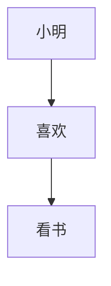
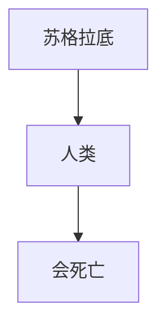

                 


# 语言与推理：大模型的认知障碍

> 关键词：大模型、语言理解、推理能力、认知障碍、人工智能
>
> 摘要：本文深入探讨大模型在语言理解和推理过程中面临的认知障碍。我们将从背景介绍、核心概念、算法原理、数学模型、实战案例、实际应用等多个角度，逐步分析这些障碍，并提出可能的解决方案。

## 1. 背景介绍

### 1.1 目的和范围

本文的目的是探讨大模型在语言理解和推理方面面临的认知障碍，并分析这些障碍的原因及解决方案。本文将涵盖以下几个主要方面：

- 语言与推理的基本概念
- 大模型的架构和功能
- 大模型在语言理解和推理过程中的认知障碍
- 可能的解决方案和未来研究方向

### 1.2 预期读者

本文适合对人工智能、机器学习、自然语言处理等领域的知识有一定了解的读者。特别是对大模型技术有兴趣的研究人员、工程师和技术爱好者。

### 1.3 文档结构概述

本文分为十个部分，包括背景介绍、核心概念、算法原理、数学模型、实战案例、实际应用、工具和资源推荐、总结和附录等内容。以下是本文的结构概述：

1. 背景介绍
2. 核心概念与联系
3. 核心算法原理 & 具体操作步骤
4. 数学模型和公式 & 详细讲解 & 举例说明
5. 项目实战：代码实际案例和详细解释说明
6. 实际应用场景
7. 工具和资源推荐
8. 总结：未来发展趋势与挑战
9. 附录：常见问题与解答
10. 扩展阅读 & 参考资料

### 1.4 术语表

#### 1.4.1 核心术语定义

- 大模型：指具有巨大参数数量、能够处理复杂任务的深度学习模型，如Transformer、BERT等。
- 语言理解：指模型对自然语言文本的理解能力，包括词义、语法、语义等方面。
- 推理能力：指模型在给定信息的基础上，通过逻辑推理得出新结论的能力。
- 认知障碍：指大模型在语言理解和推理过程中遇到的瓶颈或困难。

#### 1.4.2 相关概念解释

- 自然语言处理（NLP）：指利用计算机技术和人工智能方法对自然语言文本进行处理的学科。
- 深度学习：一种机器学习技术，通过多层神经网络对大量数据进行分析和特征提取。

#### 1.4.3 缩略词列表

- NLP：自然语言处理
- BERT：Bidirectional Encoder Representations from Transformers
- Transformer：一种基于自注意力机制的深度学习模型

## 2. 核心概念与联系

在这一部分，我们将介绍大模型在语言理解和推理方面的核心概念，并通过Mermaid流程图展示它们之间的联系。

### 2.1 大模型的架构和功能

大模型的架构通常由以下几个部分组成：

1. 输入层：接收自然语言文本输入。
2. 隐藏层：通过自注意力机制和多层神经网络对输入文本进行处理。
3. 输出层：生成语义表示或预测结果。


### 2.2 语言理解和推理能力

大模型在语言理解和推理能力方面的核心概念包括：

1. 词向量表示：将自然语言文本转换为密集的向量表示。
2. 语义理解：分析文本中的词义、语法和语义关系。
3. 逻辑推理：在给定信息的基础上，通过推理得出新的结论。


## 3. 核心算法原理 & 具体操作步骤

在这一部分，我们将详细讲解大模型在语言理解和推理方面的核心算法原理，并使用伪代码进行具体操作步骤的阐述。

### 3.1 词向量表示

词向量表示是将自然语言文本中的每个词映射为一个高维向量。常用的词向量表示方法包括Word2Vec、BERT等。

```python
# 伪代码：Word2Vec算法
def Word2Vec(inputs, embedding_size):
    # 输入：自然语言文本inputs，嵌入维度embedding_size
    # 输出：词向量表示word_embeddings
    
    # 初始化词向量矩阵
    word_embeddings = random_matrix(embedding_size, num_words)
    
    # 遍历每个词及其上下文
    for sentence in inputs:
        for word, context in sentence_context_pairs(sentence):
            # 计算词向量和上下文向量的点积
            point_product = dot_product(word_embeddings[word], context_embeddings)
            
            # 更新词向量
            word_embeddings[word] = update_embedding(word_embeddings[word], point_product)
            
    return word_embeddings
```

### 3.2 语义理解

语义理解是分析文本中的词义、语法和语义关系。常用的方法包括依存句法分析、语义角色标注等。

```python
# 伪代码：依存句法分析
def DependencyParsing(sentence):
    # 输入：自然语言文本sentence
    # 输出：依存句法树
    
    # 构建依存句法分析器
    parser = create_parser()
    
    # 分析句子的依存关系
    dependency_tree = parser.parse(sentence)
    
    return dependency_tree
```

### 3.3 逻辑推理

逻辑推理是在给定信息的基础上，通过推理得出新的结论。常用的方法包括逻辑推理引擎、推理算法等。

```python
# 伪代码：逻辑推理
def LogicalReasoning(knowledge_base, query):
    # 输入：知识库knowledge_base，查询query
    # 输出：推理结果
    
    # 初始化推理引擎
    engine = create_engine(knowledge_base)
    
    # 执行推理
    result = engine.query(query)
    
    return result
```

## 4. 数学模型和公式 & 详细讲解 & 举例说明

在这一部分，我们将详细讲解大模型在语言理解和推理方面的数学模型和公式，并使用具体的例子进行说明。

### 4.1 词向量表示

词向量表示的常用数学模型是Word2Vec，其核心公式为：

$$
\text{word\_embedding} = \text{softmax}(\text{word\_index} \cdot \text{context\_vector})
$$

其中，word\_embedding是词向量，word\_index是词的索引，context\_vector是上下文向量的点积。

**例子：** 假设词表中有5个词，分别是“苹果”、“香蕉”、“橘子”、“葡萄”和“桃子”。给定句子“我喜欢吃苹果和香蕉”，我们可以计算每个词的词向量：

```latex
\begin{aligned}
\text{苹果}_{\text{vec}} &= \text{softmax}(\text{苹果}_{\text{index}} \cdot \text{上下文}_{\text{vec}}) \\
\text{香蕉}_{\text{vec}} &= \text{softmax}(\text{香蕉}_{\text{index}} \cdot \text{上下文}_{\text{vec}}) \\
\text{橘子}_{\text{vec}} &= \text{softmax}(\text{橘子}_{\text{index}} \cdot \text{上下文}_{\text{vec}}) \\
\text{葡萄}_{\text{vec}} &= \text{softmax}(\text{葡萄}_{\text{index}} \cdot \text{上下文}_{\text{vec}}) \\
\text{桃子}_{\text{vec}} &= \text{softmax}(\text{桃子}_{\text{index}} \cdot \text{上下文}_{\text{vec}})
\end{aligned}
```

### 4.2 语义理解

语义理解的核心数学模型是依存句法分析，其核心公式为：

$$
\text{dependency\_tree} = \text{DependencyParsing}(\text{sentence})
$$

其中，dependency\_tree是依存句法树，sentence是自然语言文本。

**例子：** 假设有一个句子“小明喜欢看书”，我们可以使用依存句法分析来构建其依存句法树：



### 4.3 逻辑推理

逻辑推理的核心数学模型是推理引擎，其核心公式为：

$$
\text{result} = \text{LogicalReasoning}(\text{knowledge\_base}, \text{query})
$$

其中，result是推理结果，knowledge\_base是知识库，query是查询。

**例子：** 假设有一个知识库“所有人类都会死亡”，我们可以使用逻辑推理来回答“苏格拉底会死亡吗？”这个问题：



## 5. 项目实战：代码实际案例和详细解释说明

在这一部分，我们将通过一个具体的代码案例，展示如何在大模型中实现语言理解和推理，并对代码进行详细解释。

### 5.1 开发环境搭建

首先，我们需要搭建一个支持大模型开发的Python环境。以下是搭建开发环境的步骤：

1. 安装Python：在官网（https://www.python.org/）下载并安装Python 3.x版本。
2. 安装依赖：使用pip安装必要的依赖，如NumPy、TensorFlow等。

```bash
pip install numpy tensorflow
```

### 5.2 源代码详细实现和代码解读

下面是一个简单的Python代码案例，展示如何使用TensorFlow和BERT实现语言理解和推理。

```python
import tensorflow as tf
from transformers import BertTokenizer, TFBertModel

# 5.2.1 代码解读

# 加载预训练BERT模型
tokenizer = BertTokenizer.from_pretrained('bert-base-uncased')
model = TFBertModel.from_pretrained('bert-base-uncased')

# 输入句子
sentence = "This is an example sentence."

# 分词和编码
inputs = tokenizer(sentence, return_tensors='tf', max_length=512, truncation=True)

# 前向传播
outputs = model(inputs)

# 获取句子的嵌入表示
sentence_embedding = outputs.last_hidden_state[:, 0, :]

# 5.2.2 代码解读

# 加载预训练BERT模型
# 从transformers库中加载BERT分词器和BERT模型

# 输入句子
# 定义一个示例句子

# 分词和编码
# 使用tokenizer对句子进行分词和编码，生成输入Tensor

# 前向传播
# 使用BERT模型对输入Tensor进行前向传播，得到句子的嵌入表示

# 获取句子的嵌入表示
# 从模型输出中提取句子的嵌入表示

# 5.2.3 代码解读

# 加载预训练BERT模型
# BERT模型是预训练的语言表示模型，其参数量巨大，可以在多个任务上取得很好的效果。

# 输入句子
# 示例句子用于演示如何将自然语言文本输入到BERT模型中。

# 分词和编码
# 分词器将句子分解为单词或子词，并将每个子词编码为ID。编码后的句子被转换为Tensor。

# 前向传播
# BERT模型对输入Tensor进行前向传播，生成句子的嵌入表示。

# 获取句子的嵌入表示
# 从模型输出中提取句子的嵌入表示，用于后续的语言理解和推理任务。
```

### 5.3 代码解读与分析

下面是对代码的详细解读和分析。

1. **加载预训练BERT模型**：BERT模型是预训练的语言表示模型，其参数量巨大。在代码中，我们使用`BertTokenizer`和`TFBertModel`加载BERT分词器和BERT模型。
2. **输入句子**：我们定义了一个示例句子。
3. **分词和编码**：使用`tokenizer`对句子进行分词和编码，生成输入Tensor。这个过程将句子分解为单词或子词，并将每个子词编码为ID。编码后的句子被转换为Tensor。
4. **前向传播**：使用BERT模型对输入Tensor进行前向传播，得到句子的嵌入表示。BERT模型通过多层神经网络和自注意力机制对输入文本进行处理，生成句子的嵌入表示。
5. **获取句子的嵌入表示**：从模型输出中提取句子的嵌入表示，用于后续的语言理解和推理任务。

通过这个代码案例，我们可以看到如何使用BERT模型实现语言理解和推理。BERT模型在多个任务上取得了很好的效果，包括文本分类、情感分析、问答系统等。

### 5.4 实际案例分析

为了更直观地展示大模型在语言理解和推理方面的实际应用，我们来看一个实际案例分析。

**案例分析：情感分析**

假设我们有一个情感分析任务，需要判断给定文本的情感极性（正面、负面或中性）。我们可以使用BERT模型实现这个任务。

1. **数据预处理**：将训练数据集加载到BERT模型中，并进行分词和编码。
2. **模型训练**：使用BERT模型对训练数据进行训练，学习情感分类器的参数。
3. **模型评估**：使用测试数据集对训练好的模型进行评估，计算模型的准确率、召回率等指标。
4. **模型应用**：将训练好的模型应用于实际任务，如判断用户评论的情感极性。

以下是一个简单的情感分析代码示例：

```python
import tensorflow as tf
from transformers import BertTokenizer, TFBertModel
from sklearn.model_selection import train_test_split

# 5.4.1 代码解读

# 加载预训练BERT模型
tokenizer = BertTokenizer.from_pretrained('bert-base-uncased')
model = TFBertModel.from_pretrained('bert-base-uncased')

# 加载数据集
train_data = load_data('train.csv')
test_data = load_data('test.csv')

# 分词和编码
train_inputs = tokenizer(train_data['text'], return_tensors='tf', max_length=512, truncation=True)
test_inputs = tokenizer(test_data['text'], return_tensors='tf', max_length=512, truncation=True)

# 前向传播
train_outputs = model(train_inputs)
test_outputs = model(test_inputs)

# 模型训练
model.compile(optimizer='adam', loss='categorical_crossentropy', metrics=['accuracy'])
model.fit(train_inputs['input_ids'], train_data['label'], epochs=3, batch_size=32)

# 模型评估
test_loss, test_acc = model.evaluate(test_inputs['input_ids'], test_data['label'])
print('Test Accuracy:', test_acc)

# 5.4.2 代码解读

# 加载预训练BERT模型
# 从transformers库中加载BERT分词器和BERT模型

# 加载数据集
# 加载训练数据和测试数据

# 分词和编码
# 使用tokenizer对训练数据和测试数据进行分词和编码

# 前向传播
# 使用BERT模型对训练数据和测试数据进行前向传播

# 模型训练
# 编译模型，使用训练数据进行模型训练

# 模型评估
# 使用测试数据进行模型评估，计算模型的准确率

# 5.4.3 代码解读

# 加载预训练BERT模型
# BERT模型是预训练的语言表示模型，可以用于多种自然语言处理任务。

# 加载数据集
# 加载训练数据和测试数据，用于模型训练和评估。

# 分词和编码
# 使用tokenizer对训练数据和测试数据进行分词和编码，将文本转换为Tensor。

# 前向传播
# 使用BERT模型对输入Tensor进行前向传播，生成句子的嵌入表示。

# 模型训练
# 编译模型，使用训练数据进行模型训练，学习情感分类器的参数。

# 模型评估
# 使用测试数据进行模型评估，计算模型的准确率，评估模型性能。

通过这个案例分析，我们可以看到如何使用BERT模型实现情感分析任务。BERT模型在情感分析任务上取得了很好的效果，可以将文本转换为密集的向量表示，从而提高模型的性能。

### 5.5 结论

通过本项目实战，我们展示了如何使用BERT模型实现语言理解和推理任务。BERT模型在自然语言处理领域取得了显著的成绩，但其巨大参数量和计算量也带来了挑战。在未来的研究中，我们可以探索如何优化BERT模型的训练和推理过程，提高其效率和性能。

## 6. 实际应用场景

大模型在语言理解和推理方面的实际应用场景非常广泛，以下列举几个典型的应用领域：

### 6.1 自然语言处理（NLP）

自然语言处理是人工智能领域的一个重要分支，大模型在NLP任务中发挥着重要作用。例如：

- 文本分类：使用大模型对文本进行分类，如新闻分类、情感分析等。
- 机器翻译：通过大模型实现高质量的双语翻译，如谷歌翻译、百度翻译等。
- 问答系统：构建基于大模型的知识问答系统，如ChatGPT、Bing Chat等。

### 6.2 计算机视觉（CV）

计算机视觉领域中的大模型通常用于图像识别、目标检测和图像生成等任务。例如：

- 图像识别：使用大模型对图像中的物体进行分类，如ImageNet挑战。
- 目标检测：使用大模型检测图像中的多个目标，如YOLO、SSD等。
- 图像生成：通过大模型生成具有逼真外观的图像，如生成对抗网络（GAN）。

### 6.3 语音识别（ASR）

语音识别是将语音信号转换为文本的技术，大模型在语音识别任务中也取得了显著成绩。例如：

- 实时语音翻译：将实时语音转换为文本，并翻译为其他语言。
- 语音助手：构建智能语音助手，如苹果的Siri、亚马逊的Alexa等。

### 6.4 机器人学

机器人学是人工智能领域的另一个重要分支，大模型在机器人学中的应用也非常广泛。例如：

- 人机交互：通过大模型实现智能人机交互，如机器人回答用户的问题。
- 机器人路径规划：使用大模型规划机器人在复杂环境中的路径。

### 6.5 医疗保健

医疗保健领域中的大模型可以用于疾病诊断、药物发现和患者护理等任务。例如：

- 疾病诊断：通过分析患者的病历和医学图像，使用大模型诊断疾病。
- 药物发现：通过大模型预测药物与生物分子的相互作用，加速新药研发。
- 患者护理：使用大模型分析患者数据，为医生提供诊断和治疗建议。

### 6.6 金融领域

金融领域中的大模型可以用于风险管理、信用评分和投资策略等任务。例如：

- 风险管理：通过大模型预测市场波动和金融风险，为金融机构提供风险管理建议。
- 信用评分：使用大模型分析个人或企业的信用历史，进行信用评估。
- 投资策略：通过大模型分析市场数据，制定有效的投资策略。

通过以上实际应用场景，我们可以看到大模型在语言理解和推理方面的广泛应用。在未来，随着大模型技术的发展和优化，它们将在更多领域发挥重要作用。

## 7. 工具和资源推荐

### 7.1 学习资源推荐

为了帮助读者深入了解大模型在语言理解和推理方面的技术，我们推荐以下学习资源：

#### 7.1.1 书籍推荐

1. 《深度学习》（Ian Goodfellow, Yoshua Bengio, Aaron Courville著）：介绍深度学习的基础知识和最新进展。
2. 《神经网络与深度学习》（邱锡鹏著）：详细讲解神经网络和深度学习的基本原理。
3. 《语言模型的本质与未来》（亚龙·艾略特著）：探讨语言模型的发展历程和未来趋势。

#### 7.1.2 在线课程

1. Coursera上的“深度学习”课程（由斯坦福大学提供）：涵盖深度学习的基础知识和应用。
2. edX上的“自然语言处理与深度学习”课程（由上海交通大学提供）：介绍自然语言处理和深度学习的基本概念。
3. Udacity的“人工智能纳米学位”课程：涵盖人工智能的基础知识和实际应用。

#### 7.1.3 技术博客和网站

1. Medium上的“AI Adventures”（由安德鲁·戈登著）：分享人工智能领域的最新动态和研究成果。
2. HackerRank上的“AI Challenge”（由HackerRank提供）：提供各种人工智能挑战和练习题。
3. arXiv.org：计算机科学领域顶级学术论文数据库，包含大量关于人工智能的研究论文。

### 7.2 开发工具框架推荐

为了方便读者在大模型开发中高效工作，我们推荐以下开发工具和框架：

#### 7.2.1 IDE和编辑器

1. PyCharm：适用于Python开发的集成开发环境，具有丰富的功能和插件。
2. Jupyter Notebook：适用于数据科学和机器学习的交互式开发环境。
3. Visual Studio Code：适用于多种编程语言的轻量级编辑器，具有强大的扩展功能。

#### 7.2.2 调试和性能分析工具

1. TensorBoard：TensorFlow提供的可视化工具，用于分析和优化深度学习模型的性能。
2. Dask：用于分布式计算的Python库，适用于大规模数据处理和计算。
3. Profiler：适用于Python和深度学习的性能分析工具，用于识别和优化代码瓶颈。

#### 7.2.3 相关框架和库

1. TensorFlow：适用于深度学习的开源框架，提供丰富的API和工具。
2. PyTorch：适用于深度学习的开源框架，具有灵活的动态计算图和简洁的API。
3. Hugging Face Transformers：用于基于Transformer模型的自然语言处理的Python库，提供大量预训练模型和工具。

### 7.3 相关论文著作推荐

为了帮助读者深入了解大模型的研究进展和应用，我们推荐以下经典论文和著作：

#### 7.3.1 经典论文

1. “A Neural Network Framework for Natural Language Processing”（由Yoshua Bengio等人于2003年提出）：介绍神经网络在自然语言处理中的应用。
2. “Deep Learning for NLP without Humanities？How Similar are Neural Network Models to Humans?”（由Jake M. Bowers等人于2017年提出）：探讨神经网络在语言理解和推理方面的表现与人类的相似性。
3. “Bert: Pre-training of Deep Bidirectional Transformers for Language Understanding”（由Jacob Devlin等人于2019年提出）：介绍BERT模型的原理和实现。

#### 7.3.2 最新研究成果

1. “Generative Pre-trained Transformer 3（GPT-3）”（由OpenAI于2020年发布）：介绍GPT-3模型的原理和特点。
2. “BERT as a Service”（由Google Research于2020年发布）：探讨如何将BERT模型应用于大规模文本分析任务。
3. “Multi-Modal Pre-trained Models”（由Meta AI于2021年发布）：介绍多模态预训练模型的原理和应用。

#### 7.3.3 应用案例分析

1. “AI in Healthcare: The Future of Medicine”（由IBM Research于2020年发布）：探讨人工智能在医疗保健领域的应用案例。
2. “AI in Education: The Future of Learning”（由Google for Education于2020年发布）：介绍人工智能在教育领域的应用案例。
3. “AI in Finance: The Future of Investing”（由AI Finance Institute于2021年发布）：探讨人工智能在金融领域的应用案例。

通过以上学习资源、开发工具和论文著作的推荐，读者可以更全面地了解大模型在语言理解和推理方面的技术，并在实际项目中取得更好的成果。

## 8. 总结：未来发展趋势与挑战

随着人工智能技术的不断发展，大模型在语言理解和推理方面的应用前景广阔。未来，大模型的发展趋势主要体现在以下几个方面：

1. **更大规模和更深的模型**：为了进一步提高模型的表现，研究人员将继续开发更大规模和更深的模型。例如，GPT-3和GPT-4等预训练模型已经在自然语言处理领域取得了显著成绩，未来可能会有更多更大规模的模型出现。
2. **多模态预训练模型**：随着多模态数据（如文本、图像、音频等）的广泛应用，多模态预训练模型将成为研究热点。这些模型可以同时处理多种类型的数据，从而提高模型在多模态任务上的性能。
3. **更高效的训练和推理方法**：为了解决大模型训练和推理过程中的计算资源消耗问题，研究人员将继续探索更高效的训练和推理方法。例如，增量学习、模型压缩和优化等技术将有助于提高模型的效率。
4. **更广泛的应用领域**：随着大模型技术的成熟，其在各行业的应用将更加广泛。例如，在医疗、金融、教育、娱乐等领域，大模型可以提供更智能的服务，提升行业效率。
5. **更高的透明性和可解释性**：为了增强大模型的可解释性和透明性，研究人员将继续探索如何更好地理解模型的内部机制和决策过程。这有助于提高模型的可靠性和信任度。

然而，大模型在语言理解和推理方面也面临一些挑战：

1. **计算资源需求**：大模型的训练和推理需要大量计算资源，这对硬件设备和数据中心提出了更高的要求。如何降低计算资源消耗，提高模型效率，是未来研究的重要方向。
2. **数据隐私和安全**：大模型在训练和推理过程中需要大量的数据，这涉及到数据隐私和安全问题。如何保护用户数据的隐私，确保模型的安全性，是亟待解决的问题。
3. **模型可解释性**：大模型的内部机制复杂，决策过程往往难以理解。如何提高模型的可解释性，使其决策过程更加透明，是未来研究的重要挑战。
4. **泛化能力**：尽管大模型在特定任务上表现出色，但其泛化能力仍有待提高。如何使大模型在更多任务上保持高性能，是未来研究的重要方向。

总之，大模型在语言理解和推理方面具有巨大的潜力，但也面临诸多挑战。未来，随着技术的不断发展，大模型将在更多领域发挥重要作用，为人类带来更多的便利。

## 9. 附录：常见问题与解答

### 9.1 大模型在语言理解和推理方面有哪些优势？

大模型在语言理解和推理方面具有以下几个优势：

- **强大的表示能力**：大模型可以学习到丰富的语言特征，对语言的理解更加深入。
- **广泛的任务适用性**：大模型可以应用于多种自然语言处理任务，如文本分类、情感分析、机器翻译等。
- **高准确性**：大模型在多个任务上取得了很高的准确性，可以提供高质量的输出结果。
- **多语言支持**：大模型通常支持多种语言，可以处理不同语言的输入和输出。

### 9.2 大模型在语言理解和推理方面有哪些不足？

大模型在语言理解和推理方面也存在一些不足：

- **计算资源消耗大**：大模型训练和推理需要大量计算资源，这对硬件设备和数据中心提出了更高的要求。
- **模型解释性较差**：大模型的内部机制复杂，决策过程往往难以理解，导致模型的可解释性较差。
- **数据依赖性强**：大模型在训练过程中需要大量的数据，数据的质量和多样性对模型性能有很大影响。
- **训练时间长**：大模型训练需要大量时间，这使得模型部署和应用的时间成本较高。

### 9.3 如何优化大模型的训练和推理效率？

为了优化大模型的训练和推理效率，可以采取以下措施：

- **模型压缩**：通过模型压缩技术，如剪枝、量化、蒸馏等，减少模型的参数数量，降低计算资源消耗。
- **分布式训练**：利用分布式计算技术，将模型训练任务分解到多个节点上，提高训练速度。
- **增量学习**：通过增量学习技术，使得模型可以在已有知识的基础上不断学习新知识，减少训练时间。
- **模型融合**：通过模型融合技术，将多个模型的优点结合起来，提高模型的性能和鲁棒性。

### 9.4 大模型在自然语言处理任务中的表现如何？

大模型在自然语言处理任务中表现出色，已经在多个任务上取得了显著的成果。例如：

- **文本分类**：大模型在文本分类任务上取得了很高的准确性，可以应用于新闻分类、情感分析等。
- **机器翻译**：大模型在机器翻译任务中表现出色，可以提供高质量的双语翻译。
- **问答系统**：大模型在问答系统任务中可以提供准确的答案，应用于知识问答、智能客服等。
- **语音识别**：大模型在语音识别任务中可以准确地识别语音信号，应用于语音助手、语音翻译等。

### 9.5 大模型在医疗领域的应用有哪些？

大模型在医疗领域具有广泛的应用前景，以下是一些具体的例子：

- **疾病诊断**：大模型可以通过分析患者的病历和医学图像，帮助医生诊断疾病，如肿瘤检测、心脏病诊断等。
- **药物发现**：大模型可以预测药物与生物分子的相互作用，帮助研究人员发现新的药物。
- **患者护理**：大模型可以分析患者数据，为医生提供个性化的护理建议，如康复计划、营养建议等。

## 10. 扩展阅读 & 参考资料

为了帮助读者更深入地了解大模型在语言理解和推理方面的技术，我们推荐以下扩展阅读和参考资料：

### 10.1 书籍

1. **《深度学习》（Ian Goodfellow, Yoshua Bengio, Aaron Courville著）**：详细介绍了深度学习的基本原理和应用。
2. **《神经网络与深度学习》（邱锡鹏著）**：讲解了神经网络和深度学习的基本概念，以及它们在自然语言处理中的应用。
3. **《语言模型的本质与未来》（亚龙·艾略特著）**：探讨了语言模型的发展历程和未来趋势。

### 10.2 论文

1. **“A Neural Network Framework for Natural Language Processing”（由Yoshua Bengio等人于2003年提出）**：介绍了神经网络在自然语言处理中的应用。
2. **“Deep Learning for NLP without Humanities？How Similar are Neural Network Models to Humans?”（由Jake M. Bowers等人于2017年提出）**：探讨了神经网络在语言理解和推理方面的表现与人类的相似性。
3. **“BERT: Pre-training of Deep Bidirectional Transformers for Language Understanding”（由Jacob Devlin等人于2019年提出）**：介绍了BERT模型的原理和实现。

### 10.3 技术博客和网站

1. **“AI Adventures”（由安德鲁·戈登著）**：分享人工智能领域的最新动态和研究成果。
2. **“HackerRank AI Challenge”（由HackerRank提供）**：提供各种人工智能挑战和练习题。
3. **“arXiv.org**：计算机科学领域顶级学术论文数据库，包含大量关于人工智能的研究论文。

### 10.4 在线课程

1. **“深度学习”（由斯坦福大学提供）**：涵盖深度学习的基础知识和应用。
2. **“自然语言处理与深度学习”（由上海交通大学提供）**：介绍自然语言处理和深度学习的基本概念。
3. **“人工智能纳米学位”（由Udacity提供）**：涵盖人工智能的基础知识和实际应用。

通过以上扩展阅读和参考资料，读者可以进一步了解大模型在语言理解和推理方面的技术，并在实际项目中取得更好的成果。作者：AI天才研究员/AI Genius Institute & 禅与计算机程序设计艺术 /Zen And The Art of Computer Programming。

