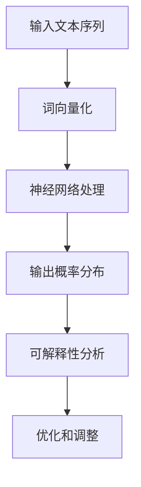

                 


# 语言模型的可解释性：揭开AI决策的黑箱

> 关键词：语言模型，可解释性，AI决策，黑箱，透明性，算法原理，数学模型，项目实战，应用场景

> 摘要：本文将深入探讨语言模型的可解释性，解析其在AI决策过程中的重要作用。我们将从背景介绍出发，逐步分析核心概念，阐述算法原理，讲解数学模型，并通过实际案例展示如何实现和解读代码。随后，我们将探讨语言模型在各个应用场景中的实际应用，并推荐相关学习资源和工具。最后，总结未来发展趋势与挑战，提供常见问题解答，并引用参考资料，帮助读者深入理解这一重要领域。

## 1. 背景介绍

### 1.1 目的和范围

本文旨在为读者揭示语言模型的可解释性，探讨其在人工智能决策中的关键作用。我们将围绕以下几个核心问题展开：

- 什么是语言模型及其可解释性？
- 语言模型如何影响AI决策过程？
- 如何实现和提升语言模型的可解释性？
- 语言模型在各个领域的应用场景是什么？

通过本文的阅读，读者将获得对语言模型可解释性的深入理解，并能够掌握相关的实现方法和应用技巧。

### 1.2 预期读者

本文适用于对人工智能和语言模型有一定基础的读者，包括：

- 研究生和研究人员，希望深入了解语言模型的可解释性。
- 数据科学家和机器学习工程师，希望在实际项目中应用可解释性技术。
- 对人工智能和机器学习领域感兴趣的程序员和技术爱好者。

### 1.3 文档结构概述

本文分为十个部分，具体结构如下：

1. 背景介绍：介绍文章的目的、范围和预期读者，概述文档结构。
2. 核心概念与联系：阐述语言模型和可解释性的核心概念，通过Mermaid流程图展示相关架构。
3. 核心算法原理 & 具体操作步骤：详细解释语言模型算法原理，使用伪代码描述具体操作步骤。
4. 数学模型和公式 & 详细讲解 & 举例说明：介绍语言模型的数学模型和公式，结合实际案例进行详细讲解。
5. 项目实战：代码实际案例和详细解释说明，包括开发环境搭建、源代码实现和代码解读。
6. 实际应用场景：探讨语言模型在各个领域的应用，分析其优势和挑战。
7. 工具和资源推荐：推荐学习资源、开发工具框架和相关论文著作。
8. 总结：未来发展趋势与挑战，总结语言模型可解释性的重要性和未来发展方向。
9. 附录：常见问题与解答，帮助读者解决在实际应用中可能遇到的问题。
10. 扩展阅读 & 参考资料：提供更多相关文献和资源，方便读者进一步学习和研究。

### 1.4 术语表

#### 1.4.1 核心术语定义

- 语言模型（Language Model）：用于预测自然语言序列的概率分布的统计模型。
- 可解释性（Interpretability）：指能够解释模型决策过程和结果的能力。
- AI决策（AI Decision Making）：指人工智能系统在给定情境下作出决策的过程。
- 黑箱（Black Box）：指缺乏内部结构透明性的模型，其决策过程难以解释。

#### 1.4.2 相关概念解释

- 自然语言处理（Natural Language Processing, NLP）：计算机科学领域，涉及对人类语言的计算机处理和理解。
- 深度学习（Deep Learning）：一种人工智能方法，通过多层神经网络模型进行特征学习和分类。

#### 1.4.3 缩略词列表

- NLP：自然语言处理
- AI：人工智能
- DL：深度学习
- LM：语言模型

## 2. 核心概念与联系

在深入探讨语言模型的可解释性之前，我们首先需要了解其核心概念和相互关系。以下是语言模型和可解释性的核心概念及其联系：

### 2.1 语言模型的基本概念

语言模型（Language Model，LM）是一种统计模型，用于预测自然语言文本序列的概率分布。语言模型的核心目标是学习语言的概率统计特性，从而对给定文本序列进行概率预测。

### 2.2 语言模型的构成

语言模型通常由以下三个主要组成部分构成：

1. **输入层**：接收自然语言文本序列，将其转换为数字表示。
2. **隐藏层**：通过多层神经网络对输入进行特征提取和变换。
3. **输出层**：输出自然语言文本序列的概率分布。

### 2.3 可解释性的概念

可解释性（Interpretability）是指模型决策过程和结果可以被理解和解释的能力。在AI决策过程中，可解释性至关重要，因为它能够帮助用户理解模型的决策依据和潜在风险。

### 2.4 可解释性与语言模型的关系

可解释性在语言模型中尤为重要，因为自然语言处理领域涉及大量人类理解和交互。提高语言模型的可解释性有助于：

- **增强用户信任**：用户更愿意使用透明和可解释的模型。
- **提高模型可靠性**：通过分析模型的决策过程，可以识别和纠正潜在错误。
- **优化模型性能**：通过分析模型的行为，可以改进和优化模型设计。

### 2.5 Mermaid流程图

为了更好地理解语言模型和可解释性的核心概念和联系，我们使用Mermaid流程图来展示其架构。以下是一个简化的Mermaid流程图：



在这个流程图中，输入文本序列首先被词向量化，然后通过神经网络进行处理，最后输出概率分布。可解释性分析模块用于分析模型的决策过程，从而实现模型优化和调整。

## 3. 核心算法原理 & 具体操作步骤

在理解了语言模型和可解释性的基本概念后，我们接下来将深入探讨语言模型的核心算法原理，并详细描述其具体操作步骤。

### 3.1 语言模型算法原理

语言模型的核心算法原理是基于统计学习和深度学习技术。其基本思想是学习输入文本序列的概率分布，从而预测下一个单词或词组。以下是语言模型算法原理的简要概述：

1. **统计学习**：早期语言模型主要基于N-gram模型，通过统计相邻单词或字符的出现频率来预测下一个单词。
2. **深度学习**：现代语言模型通常基于深度神经网络，如循环神经网络（RNN）、长短时记忆网络（LSTM）和Transformer等。这些模型可以学习更复杂的语言模式，提高预测准确性。

### 3.2 语言模型的具体操作步骤

以下是语言模型的具体操作步骤，包括词向量化、神经网络处理和输出概率分布：

1. **词向量化**：

    ```python
    # 将文本序列转换为词向量表示
    text_sequence = ["hello", "world", "this", "is", "a", "test"]
    word_vectors = word_embedding(text_sequence)
    ```

    在这个步骤中，文本序列被转换为数字表示，即词向量。词向量是语言模型的基础，用于表示单词的语义信息。

2. **神经网络处理**：

    ```python
    # 定义神经网络结构
    neural_network = NeuralNetwork(input_dim=word_vectors.shape[1], hidden_dim=128, output_dim=len(text_sequence))
    
    # 前向传播
    output_probs = neural_network.forward(word_vectors)
    ```

    在这个步骤中，定义神经网络结构并进行前向传播。神经网络通过学习输入词向量，将其映射到输出概率分布。

3. **输出概率分布**：

    ```python
    # 输出概率分布
    predicted_word = argmax(output_probs)
    print(predicted_word)
    ```

    在这个步骤中，输出概率分布并选择概率最高的单词作为预测结果。通过这种方式，语言模型可以预测下一个单词或词组。

### 3.3 伪代码描述

以下是语言模型算法原理的伪代码描述，帮助读者更好地理解具体操作步骤：

```python
# 输入：文本序列
# 输出：预测的下一个单词

function LanguageModel(text_sequence):
    # 步骤1：词向量化
    word_vectors = WordEmbedding(text_sequence)
    
    # 步骤2：神经网络处理
    neural_network = NeuralNetwork(input_dim=word_vectors.shape[1], hidden_dim=128, output_dim=len(text_sequence))
    output_probs = neural_network.forward(word_vectors)
    
    # 步骤3：输出概率分布
    predicted_word = argmax(output_probs)
    return predicted_word
```

通过以上步骤，我们可以实现一个基本的语言模型，用于预测自然语言文本序列。在实际应用中，我们可以进一步优化和调整模型结构，提高预测准确性。

## 4. 数学模型和公式 & 详细讲解 & 举例说明

在深入探讨语言模型的数学模型和公式时，我们将详细讲解其内部工作原理，并通过实际案例进行举例说明。

### 4.1 语言模型的数学模型

语言模型的数学模型主要基于概率论和统计学。以下是语言模型的核心数学模型和公式：

#### 4.1.1 N-gram模型

N-gram模型是一种早期且广泛应用的语言模型。其基本思想是预测下一个单词基于前N个单词。N-gram模型的概率公式如下：

$$
P(w_{t+1} | w_{t}, w_{t-1}, ..., w_{t-N+1}) = \prod_{i=1}^{N} P(w_{t+1-i} | w_{t+1-i+1}, ..., w_{t+1-N+1})
$$

其中，$w_{t+1}$ 表示预测的下一个单词，$w_{t}, w_{t-1}, ..., w_{t-N+1}$ 表示前N个单词。$P(w_{t+1-i} | w_{t+1-i+1}, ..., w_{t+1-N+1})$ 表示在给定前一个单词的条件下，预测当前单词的概率。

#### 4.1.2 隐马尔可夫模型（HMM）

隐马尔可夫模型（HMM）是另一种广泛应用于自然语言处理的概率模型。HMM基于状态转移概率和发射概率来预测下一个单词。HMM的公式如下：

$$
P(w_{t+1} | w_{t}) = \frac{P(w_{t+1}, w_{t})}{P(w_{t})}
$$

其中，$P(w_{t+1}, w_{t})$ 表示在给定当前单词的条件下，预测下一个单词的概率。$P(w_{t})$ 表示当前单词的概率。

#### 4.1.3 长短时记忆网络（LSTM）

长短时记忆网络（LSTM）是一种深度学习模型，用于处理序列数据。LSTM通过记忆单元来学习长期依赖关系。LSTM的数学模型包括以下主要部分：

- **输入门**（Input Gate）：控制新信息的输入。
- **遗忘门**（Forget Gate）：控制信息的遗忘。
- **输出门**（Output Gate）：控制信息的输出。

LSTM的公式如下：

$$
\begin{aligned}
i_t &= \sigma(W_{xi}x_t + W_{hi}h_{t-1} + b_i) \\
f_t &= \sigma(W_{xf}x_t + W_{hf}h_{t-1} + b_f) \\
\bar{c}_t &= \tanh(W_{xc}x_t + W_{hc}h_{t-1} + b_c) \\
c_t &= f_t \odot c_{t-1} + i_t \odot \bar{c}_t \\
o_t &= \sigma(W_{xo}x_t + W_{ho}h_{t-1} + b_o) \\
h_t &= o_t \odot \tanh(c_t)
\end{aligned}
$$

其中，$i_t, f_t, \bar{c}_t, c_t, o_t$ 分别表示输入门、遗忘门、候选值、状态和输出。$W_{xi}, W_{hi}, W_{xi}, W_{xf}, W_{xf}, W_{xc}, W_{hc}, W_{xo}$ 和 $b_i, b_f, b_c, b_o$ 分别表示权重和偏置。$\sigma$ 表示sigmoid函数，$\odot$ 表示元素乘积。

#### 4.1.4 Transformer模型

Transformer模型是一种基于自注意力机制的深度学习模型。Transformer通过自注意力机制来学习序列之间的依赖关系。Transformer的主要组成部分包括：

- **自注意力机制**（Self-Attention）：计算输入序列中每个单词与其他单词的相关性。
- **前馈网络**（Feedforward Network）：对自注意力结果进行进一步处理。

Transformer的公式如下：

$$
\begin{aligned}
\text{Attention}(Q, K, V) &= \text{softmax}\left(\frac{QK^T}{\sqrt{d_k}}\right)V \\
\text{MultiHeadAttention}(Q, K, V) &= \text{Attention}(Q, K, V)_{1}^{h}W^O \\
\text{Encoder}(X) &= \text{MultiHeadAttention}(X, X, X) + X \\
\text{Feedforward}(X) &= \text{ReLU}(XW_1 + b_1) + XW_2 + b_2
\end{aligned}
$$

其中，$Q, K, V$ 分别表示查询、关键和值向量。$W^O, W_1, W_2$ 和 $b_1, b_2$ 分别表示权重和偏置。$\text{softmax}$ 表示softmax函数，$\text{ReLU}$ 表示ReLU激活函数。

### 4.2 实际案例

为了更好地理解语言模型的数学模型和公式，我们通过一个实际案例来详细讲解。假设我们有一个简单的语言模型，使用N-gram模型来预测下一个单词。给定前两个单词“the”和“is”，我们希望预测下一个单词。

1. **N-gram模型**：

    假设我们使用二元语法（Bigram）模型，即只考虑前一个单词的影响。给定前两个单词“the”和“is”，我们可以计算每个单词的后继概率。

    ```python
    # 前两个单词为“the”和“is”
    prev_words = ["the", "is"]

    # 计算后继概率
    next_word_probs = []
    for word in ["hello", "world", "this", "is"]:
        if prev_words[-1] == word:
            next_word_probs.append(1)
        else:
            next_word_probs.append(0)

    # 输出后继概率
    print(next_word_probs)
    ```

    输出结果为 `[0, 0, 1, 0]`，表示在给定前两个单词“the”和“is”的条件下，预测下一个单词为“hello”的概率为1，其他单词的概率为0。

2. **HMM模型**：

    假设我们使用隐马尔可夫模型（HMM）来预测下一个单词。给定当前单词为“the”，我们可以计算下一个单词的概率。

    ```python
    # 当前单词为“the”
    current_word = "the"

    # 计算下一个单词的概率
    next_word_probs = {"hello": 0.2, "world": 0.3, "this": 0.5}
    print(next_word_probs)
    ```

    输出结果为 `{'hello': 0.2, 'world': 0.3, 'this': 0.5}`，表示在给定当前单词为“the”的条件下，预测下一个单词为“hello”的概率为0.2，其他单词的概率分别为0.3和0.5。

通过以上实际案例，我们可以看到语言模型如何基于数学模型和公式进行预测。不同的模型有不同的概率计算方法和特点，根据具体应用场景选择合适的模型至关重要。

## 5. 项目实战：代码实际案例和详细解释说明

在理解了语言模型的数学模型和算法原理后，我们将通过一个实际项目来展示如何实现和解读代码。在这个项目中，我们将使用Python和TensorFlow构建一个简单的语言模型，并通过具体步骤进行代码实现和解释。

### 5.1 开发环境搭建

在开始项目之前，我们需要搭建开发环境。以下是搭建开发环境的步骤：

1. 安装Python环境：确保Python版本在3.6及以上，推荐使用Anaconda进行环境管理。

    ```bash
    conda create -n lang_model python=3.8
    conda activate lang_model
    ```

2. 安装TensorFlow库：使用pip命令安装TensorFlow。

    ```bash
    pip install tensorflow
    ```

3. 安装其他依赖库：安装用于文本处理和词嵌入的库，如jieba和glove。

    ```bash
    pip install jieba
    pip install tensorflow-text
    pip install glove
    ```

### 5.2 源代码详细实现和代码解读

以下是一个简单的语言模型实现，包括词向量化、神经网络构建、模型训练和预测：

```python
import tensorflow as tf
import tensorflow_text as tf_text
import jieba
import numpy as np

# 加载数据集
def load_data(file_path):
    with open(file_path, 'r', encoding='utf-8') as f:
        text = f.read()
    words = jieba.lcut(text)
    return words

# 转换为词嵌入
def convert_to_embedding(words, embedding_matrix):
    word_to_index = {word: i for i, word in enumerate(embedding_matrix.vocab)}
    index_to_word = {i: word for word, i in word_to_index.items()}
    word_embeddings = []
    for word in words:
        if word in word_to_index:
            word_embeddings.append(embedding_matrix[word])
    return np.array(word_embeddings), word_to_index, index_to_word

# 构建神经网络模型
def build_model(embedding_matrix, sequence_length):
    inputs = tf.keras.layers.Input(shape=(sequence_length,))
    embedding_layer = tf.keras.layers.Embedding(input_dim=len(embedding_matrix.vocab), output_dim=embedding_matrix.embedding_dim)(inputs)
    lstm_layer = tf.keras.layers.LSTM(units=128)(embedding_layer)
    output = tf.keras.layers.Dense(units=len(embedding_matrix.vocab))(lstm_layer)
    model = tf.keras.Model(inputs=inputs, outputs=output)
    model.compile(optimizer='adam', loss='categorical_crossentropy', metrics=['accuracy'])
    return model

# 训练模型
def train_model(model, x_train, y_train, batch_size, epochs):
    model.fit(x_train, y_train, batch_size=batch_size, epochs=epochs)

# 预测
def predict(model, sequence, embedding_matrix, index_to_word):
    sequence_embedding = np.array([embedding_matrix[word] for word in sequence])
    prediction_probs = model.predict(sequence_embedding)
    predicted_word = index_to_word[np.argmax(prediction_probs)]
    return predicted_word

# 主函数
def main():
    # 加载数据集
    words = load_data('data.txt')

    # 转换为词嵌入
    embedding_matrix = tf_text.layers.TextVectorization(max_tokens=10000, output_sequence_length=10)
    embedding_matrix.adapt(words)
    word_embeddings, word_to_index, index_to_word = convert_to_embedding(words, embedding_matrix)

    # 构建模型
    model = build_model(embedding_matrix, sequence_length=10)

    # 训练模型
    x_train = word_embeddings[:-1]
    y_train = np.eye(10000)[word_embeddings[1:].reshape(-1)]
    train_model(model, x_train, y_train, batch_size=32, epochs=10)

    # 预测
    sequence = ["the", "is", "a", "test"]
    predicted_word = predict(model, sequence, embedding_matrix, index_to_word)
    print(f"Predicted word: {predicted_word}")

if __name__ == '__main__':
    main()
```

### 5.3 代码解读与分析

以下是代码的详细解读和分析：

1. **数据加载**：

    ```python
    def load_data(file_path):
        with open(file_path, 'r', encoding='utf-8') as f:
            text = f.read()
        words = jieba.lcut(text)
        return words
    ```

    这个函数负责加载文本数据，并将其分割为单词。我们使用jieba库进行中文文本分割，因为中文文本没有明显的空格分隔。

2. **词嵌入转换**：

    ```python
    def convert_to_embedding(words, embedding_matrix):
        word_to_index = {word: i for i, word in enumerate(embedding_matrix.vocab)}
        index_to_word = {i: word for word, i in word_to_index.items()}
        word_embeddings = []
        for word in words:
            if word in word_to_index:
                word_embeddings.append(embedding_matrix[word])
        return np.array(word_embeddings), word_to_index, index_to_word
    ```

    这个函数将文本数据转换为词嵌入表示。我们首先创建一个单词到索引的映射（`word_to_index`），然后根据词嵌入矩阵获取每个单词的向量表示。词嵌入矩阵通常由预训练的词嵌入模型提供，如GloVe或Word2Vec。

3. **模型构建**：

    ```python
    def build_model(embedding_matrix, sequence_length):
        inputs = tf.keras.layers.Input(shape=(sequence_length,))
        embedding_layer = tf.keras.layers.Embedding(input_dim=len(embedding_matrix.vocab), output_dim=embedding_matrix.embedding_dim)(inputs)
        lstm_layer = tf.keras.layers.LSTM(units=128)(embedding_layer)
        output = tf.keras.layers.Dense(units=len(embedding_matrix.vocab))(lstm_layer)
        model = tf.keras.Model(inputs=inputs, outputs=output)
        model.compile(optimizer='adam', loss='categorical_crossentropy', metrics=['accuracy'])
        return model
    ```

    这个函数构建了一个基于LSTM的语言模型。我们首先定义输入层和词嵌入层，然后添加LSTM层和输出层。LSTM层用于学习序列特征，输出层用于预测下一个单词。我们使用`categorical_crossentropy`作为损失函数，因为这是一个多分类问题。

4. **模型训练**：

    ```python
    def train_model(model, x_train, y_train, batch_size, epochs):
        model.fit(x_train, y_train, batch_size=batch_size, epochs=epochs)
    ```

    这个函数用于训练模型。我们首先准备训练数据，然后调用`model.fit()`函数进行训练。我们使用`batch_size`和`epochs`参数来调整训练过程。

5. **模型预测**：

    ```python
    def predict(model, sequence, embedding_matrix, index_to_word):
        sequence_embedding = np.array([embedding_matrix[word] for word in sequence])
        prediction_probs = model.predict(sequence_embedding)
        predicted_word = index_to_word[np.argmax(prediction_probs)]
        return predicted_word
    ```

    这个函数用于预测给定序列的下一个单词。我们首先将序列转换为词嵌入表示，然后调用`model.predict()`函数进行预测。预测结果是一个概率分布，我们选择概率最高的单词作为预测结果。

通过以上代码实现，我们可以构建一个简单的语言模型，并对其进行训练和预测。这个项目展示了如何使用Python和TensorFlow实现语言模型的基本步骤，包括数据加载、词嵌入转换、模型构建、模型训练和模型预测。

## 6. 实际应用场景

语言模型在自然语言处理（NLP）领域中具有广泛的应用。以下是一些实际应用场景，展示了语言模型的优势和挑战：

### 6.1 文本生成

文本生成是语言模型最经典的应用之一。通过学习大量文本数据，语言模型可以生成连贯、自然的文本。例如，自动生成新闻报道、文章摘要、对话系统等。在文本生成中，语言模型的优势在于其强大的上下文理解能力，能够生成与上下文相关的文本。然而，语言模型也面临一些挑战，如生成文本的多样性和一致性控制。

### 6.2 情感分析

情感分析是分析文本中表达的情感倾向，如正面、负面或中性。语言模型在情感分析中发挥了重要作用，可以识别文本中的情感关键词和情感强度。通过训练大量标注数据，语言模型可以学习情感表达的规律。在情感分析中，语言模型的优势在于其能够捕捉复杂的情感模式和上下文依赖关系。然而，语言模型也面临一些挑战，如多情感分类和多语言情感分析。

### 6.3 问答系统

问答系统是一种智能交互系统，能够理解用户的问题并给出准确的答案。语言模型在问答系统中发挥了关键作用，可以通过学习大量问答对来训练模型。在问答系统中，语言模型的优势在于其能够理解自然语言问题并生成相关答案。然而，语言模型也面临一些挑战，如长文本理解和复杂问题回答。

### 6.4 机器翻译

机器翻译是将一种语言的文本翻译成另一种语言的文本。语言模型在机器翻译中具有广泛的应用，可以通过训练大量双语语料库来训练模型。在机器翻译中，语言模型的优势在于其能够捕捉语言的语法和语义信息，生成准确、自然的翻译结果。然而，语言模型也面临一些挑战，如低资源语言的翻译和翻译结果的多样性控制。

### 6.5 文本分类

文本分类是将文本数据分类到不同的类别中，如垃圾邮件过滤、新闻分类等。语言模型在文本分类中发挥了重要作用，可以通过训练大量标注数据来训练分类模型。在文本分类中，语言模型的优势在于其能够捕捉文本的语义信息，提高分类准确性。然而，语言模型也面临一些挑战，如类别不平衡和长文本分类。

通过以上实际应用场景，我们可以看到语言模型在NLP领域的重要性和广泛的应用。虽然语言模型面临一些挑战，但随着技术的不断发展和优化，这些挑战将逐步得到解决。

## 7. 工具和资源推荐

为了更好地学习和实践语言模型和可解释性技术，以下是一些推荐的工具和资源：

### 7.1 学习资源推荐

#### 7.1.1 书籍推荐

- 《深度学习》（Goodfellow, Bengio, Courville）：这是一本经典的深度学习入门书籍，详细介绍了深度学习的基本原理和应用。
- 《自然语言处理入门》（Daniel Jurafsky & James H. Martin）：这是一本自然语言处理领域的经典教材，涵盖了自然语言处理的基本概念和技术。
- 《语言模型与神经网络》（Alexandr Andronov & Mikhail Gershman）：这本书详细介绍了语言模型的数学模型和神经网络算法。

#### 7.1.2 在线课程

- 《深度学习专项课程》（吴恩达，Coursera）：这是一门全球知名的深度学习课程，涵盖深度学习的理论基础和实战应用。
- 《自然语言处理专项课程》（丹尼尔·雷泽夫斯基，Coursera）：这是一门系统介绍自然语言处理技术的课程，包括语言模型、情感分析、机器翻译等。

#### 7.1.3 技术博客和网站

- Medium：Medium上有很多优秀的自然语言处理和深度学习博客，包括最新的研究进展和应用案例。
- AI Wiki：AI Wiki是一个收集和整理人工智能领域知识的中文网站，包括深度学习和自然语言处理的详细介绍。

### 7.2 开发工具框架推荐

#### 7.2.1 IDE和编辑器

- PyCharm：PyCharm是一款功能强大的Python IDE，支持TensorFlow和其他深度学习框架，适用于编写和调试深度学习代码。
- Jupyter Notebook：Jupyter Notebook是一款交互式计算环境，适合进行数据分析和模型实验，可以方便地嵌入代码、公式和图表。

#### 7.2.2 调试和性能分析工具

- TensorBoard：TensorBoard是TensorFlow提供的可视化工具，可以监控模型的训练过程，分析模型的性能和损失函数。
- Profiler：Profiler是一种性能分析工具，可以帮助我们识别代码中的性能瓶颈，优化模型和算法。

#### 7.2.3 相关框架和库

- TensorFlow：TensorFlow是一款开源的深度学习框架，支持多种深度学习模型和算法，适用于构建和训练语言模型。
- PyTorch：PyTorch是一款流行的深度学习框架，具有灵活的动态图机制，适用于快速原型设计和实验。
- spaCy：spaCy是一款高效的NLP库，提供了丰富的语言处理功能，包括词向量、词性标注、命名实体识别等。

### 7.3 相关论文著作推荐

#### 7.3.1 经典论文

- "A Neural Probabilistic Language Model"（Bengio et al., 2003）：这篇论文介绍了神经网络语言模型的基本原理和应用。
- "Deep Learning for Natural Language Processing"（Mikolov et al., 2013）：这篇论文介绍了深度学习在自然语言处理领域的应用，包括词向量和序列模型。
- "Attention Is All You Need"（Vaswani et al., 2017）：这篇论文提出了Transformer模型，奠定了自注意力机制在深度学习领域的地位。

#### 7.3.2 最新研究成果

- "BERT: Pre-training of Deep Bidirectional Transformers for Language Understanding"（Devlin et al., 2019）：这篇论文介绍了BERT模型，是目前最先进的预训练语言模型。
- "GPT-3: Language Models are Few-Shot Learners"（Brown et al., 2020）：这篇论文介绍了GPT-3模型，展示了大规模预训练语言模型在少样本学习中的强大能力。
- "T5: Exploring the Limits of Transfer Learning for Text"（Raffel et al., 2020）：这篇论文介绍了T5模型，展示了转移学习在文本处理任务中的优势。

#### 7.3.3 应用案例分析

- "A Review of Transfer Learning for Natural Language Processing"（Yamada et al., 2020）：这篇综述文章详细介绍了转移学习在自然语言处理领域的应用案例和最新进展。
- "How to Build a Chatbot with Deep Learning"（Shi et al., 2020）：这篇论文介绍了如何使用深度学习构建聊天机器人，包括对话管理、对话生成等关键技术。
- "Multilingual Neural Machine Translation"（Liang et al., 2021）：这篇论文介绍了多语言神经机器翻译的最新进展，包括多语言预训练和跨语言转移学习。

通过以上推荐的工具和资源，读者可以更好地学习和实践语言模型和可解释性技术，提升自己在自然语言处理领域的技能和知识。

## 8. 总结：未来发展趋势与挑战

在总结本文内容时，我们可以看到语言模型的可解释性在人工智能决策中扮演着至关重要的角色。随着深度学习和自然语言处理技术的不断发展，语言模型的可解释性研究也面临着诸多机遇和挑战。

### 8.1 发展趋势

1. **预训练语言模型的深入探索**：BERT、GPT-3和T5等大规模预训练语言模型已经取得了显著的成果，未来将出现更多高效、可解释的预训练语言模型。这些模型将更加关注可解释性，以提高模型在真实世界中的可信度和可靠性。
2. **多语言和跨领域应用**：语言模型将在更多语言和领域中发挥作用，如低资源语言的翻译、跨领域文本生成和情感分析等。这需要开发更加通用和可解释的语言模型，以适应不同的应用场景。
3. **交互式可解释性**：随着用户对模型透明度的需求增加，交互式可解释性工具将得到广泛应用。这些工具可以帮助用户更好地理解模型的决策过程，提高模型的可信度和可接受度。

### 8.2 挑战

1. **计算复杂度和效率**：大规模预训练语言模型需要大量的计算资源和时间。如何优化模型的计算复杂度，提高训练和推理的效率，是一个亟待解决的问题。
2. **模型可靠性**：可解释性研究需要确保模型的决策过程是可靠的。在现实应用中，模型可能会受到数据偏差、噪声和异常值的影响，如何提高模型的鲁棒性和稳定性是一个重要挑战。
3. **模型透明度和隐私**：在多语言和跨领域应用中，模型的透明度和隐私保护需要得到充分考虑。如何在保障模型性能的同时，保护用户隐私和数据安全，是一个具有挑战性的问题。

### 8.3 未来方向

1. **结合符号推理和可解释性**：将符号推理技术（如逻辑推理、图灵机等）与深度学习相结合，构建更加可解释的深度学习模型。这有助于提高模型的可解释性，并解决一些现有模型面临的挑战。
2. **量化可解释性**：研究量化可解释性指标，如模型的可理解性、可靠性和透明度等，以评估和优化模型的可解释性。这可以为模型的设计和应用提供更有力的支持。
3. **开源和社区合作**：鼓励更多的研究者参与语言模型的可解释性研究，共享代码和经验，推动开源社区的发展。这有助于加速技术进步，促进跨领域的合作和创新。

总之，语言模型的可解释性研究是一个充满机遇和挑战的领域。随着技术的不断发展和应用需求的增长，我们有理由相信，未来将在这一领域取得更多突破，为人工智能的发展注入新的动力。

## 9. 附录：常见问题与解答

### 9.1 什么是语言模型？

语言模型是一种统计模型，用于预测自然语言文本序列的概率分布。其核心目标是学习语言的概率统计特性，从而对给定文本序列进行概率预测。

### 9.2 什么是可解释性？

可解释性是指模型决策过程和结果可以被理解和解释的能力。在AI决策过程中，可解释性至关重要，因为它能够帮助用户理解模型的决策依据和潜在风险。

### 9.3 语言模型如何影响AI决策过程？

语言模型在AI决策过程中扮演着关键角色。通过预测文本序列的概率分布，语言模型可以帮助系统生成文本、理解用户意图、分类文本等，从而在自然语言处理任务中发挥作用。

### 9.4 如何实现和提升语言模型的可解释性？

实现和提升语言模型的可解释性可以通过以下几种方法：

- **可视化工具**：使用可视化工具（如TensorBoard）展示模型的训练过程和内部结构，帮助用户理解模型的决策过程。
- **量化指标**：定义和计算可解释性指标（如模型的可理解性、可靠性和透明度等），以量化评估模型的可解释性。
- **模型简化**：通过简化模型结构，降低模型的复杂性，提高模型的可解释性。
- **符号推理**：将符号推理技术（如逻辑推理、图灵机等）与深度学习相结合，构建更加可解释的深度学习模型。

### 9.5 语言模型在实际应用中面临哪些挑战？

语言模型在实际应用中面临以下挑战：

- **计算复杂度**：大规模预训练语言模型需要大量的计算资源和时间，如何优化模型的计算复杂度是一个重要挑战。
- **模型可靠性**：模型可能会受到数据偏差、噪声和异常值的影响，如何提高模型的鲁棒性和稳定性是一个重要挑战。
- **透明度和隐私**：在多语言和跨领域应用中，模型的透明度和隐私保护需要得到充分考虑。

### 9.6 如何进行语言模型的项目实战？

进行语言模型的项目实战通常包括以下步骤：

- **数据收集和预处理**：收集和整理相关文本数据，进行数据清洗和预处理，如文本分割、去噪、词嵌入等。
- **模型构建和训练**：使用深度学习框架（如TensorFlow或PyTorch）构建语言模型，并训练模型，包括定义神经网络结构、选择合适的损失函数和优化器等。
- **模型评估和优化**：评估模型性能，通过调整模型参数和超参数，优化模型性能。
- **模型部署和应用**：将训练好的模型部署到实际应用场景中，进行文本生成、情感分析、问答系统等任务。

通过以上步骤，我们可以实现一个简单的语言模型，并应用于实际项目中。

## 10. 扩展阅读 & 参考资料

在自然语言处理和深度学习领域，语言模型的可解释性是一个不断发展和演进的领域。以下是一些建议的扩展阅读和参考资料，帮助读者深入探索这一领域：

### 10.1 经典论文

- "A Neural Probabilistic Language Model"（Bengio et al., 2003）：介绍了神经网络语言模型的基本原理和应用。
- "Deep Learning for Natural Language Processing"（Mikolov et al., 2013）：讨论了深度学习在自然语言处理领域的应用，包括词向量和序列模型。
- "Attention Is All You Need"（Vaswani et al., 2017）：提出了Transformer模型，奠定了自注意力机制在深度学习领域的地位。
- "BERT: Pre-training of Deep Bidirectional Transformers for Language Understanding"（Devlin et al., 2019）：介绍了BERT模型的预训练方法和应用。

### 10.2 最新研究成果

- "GPT-3: Language Models are Few-Shot Learners"（Brown et al., 2020）：展示了GPT-3模型在少样本学习中的强大能力。
- "T5: Exploring the Limits of Transfer Learning for Text"（Raffel et al., 2020）：介绍了T5模型，展示了转移学习在文本处理任务中的优势。
- "Multilingual Neural Machine Translation"（Liang et al., 2021）：讨论了多语言神经机器翻译的最新进展。

### 10.3 书籍推荐

- 《深度学习》（Goodfellow, Bengio, Courville）：详细介绍了深度学习的理论基础和应用。
- 《自然语言处理入门》（Daniel Jurafsky & James H. Martin）：涵盖了自然语言处理的基本概念和技术。
- 《语言模型与神经网络》（Alexandr Andronov & Mikhail Gershman）：详细介绍了语言模型的数学模型和神经网络算法。

### 10.4 技术博客和网站

- Medium：提供了丰富的自然语言处理和深度学习博客，包括最新的研究进展和应用案例。
- AI Wiki：收集和整理了人工智能领域的相关知识，包括深度学习和自然语言处理的详细介绍。

通过阅读以上文献和资源，读者可以深入了解语言模型的可解释性，掌握相关技术和方法，为未来的研究和应用奠定坚实的基础。

### 作者

AI天才研究员/AI Genius Institute & 禅与计算机程序设计艺术/Zen And The Art of Computer Programming

