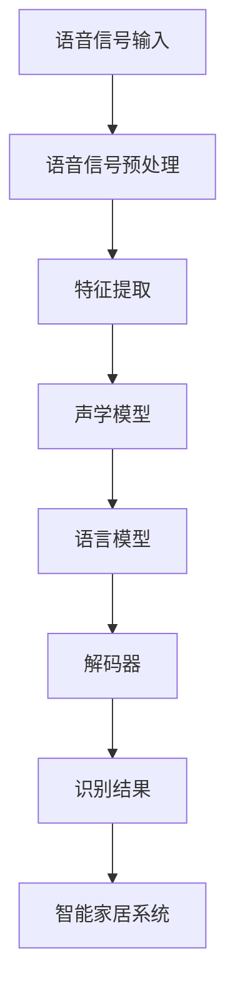

                 

# 语音识别技术在智能家居中的实现

> **关键词：** 语音识别，智能家居，自然语言处理，机器学习，深度学习，语音信号处理

> **摘要：** 本文章旨在深入探讨语音识别技术在智能家居领域中的应用，从核心概念、算法原理、数学模型、项目实战到实际应用场景，全面解析语音识别技术的实现方式及其对智能家居的深远影响。文章还推荐了相关的学习资源和开发工具，为读者提供了一份全面的技术指南。

## 1. 背景介绍

### 1.1 目的和范围

随着智能家居的迅速发展，语音识别技术成为了实现智能交互的重要手段。本文将重点介绍语音识别技术在智能家居中的应用，分析其核心原理和实现步骤，探讨其未来发展趋势和挑战。

### 1.2 预期读者

本文适合对智能家居和语音识别技术有一定了解的读者，包括工程师、程序员、科研人员和智能家居爱好者。

### 1.3 文档结构概述

本文分为十个部分：

1. 背景介绍：阐述本文的目的和范围。
2. 核心概念与联系：介绍语音识别技术的基本概念和架构。
3. 核心算法原理 & 具体操作步骤：详细解释语音识别的算法原理和实现步骤。
4. 数学模型和公式 & 详细讲解 & 举例说明：讲解语音识别过程中的数学模型和公式。
5. 项目实战：提供实际代码案例，讲解代码实现过程。
6. 实际应用场景：分析语音识别技术在智能家居中的应用场景。
7. 工具和资源推荐：推荐学习和开发资源。
8. 总结：探讨未来发展趋势和挑战。
9. 附录：常见问题与解答。
10. 扩展阅读 & 参考资料：提供进一步阅读的资料。

### 1.4 术语表

#### 1.4.1 核心术语定义

- **语音识别**：将语音信号转换为文本信息的技术。
- **智能家居**：利用物联网技术和人工智能实现家庭自动化和智能化的系统。
- **自然语言处理**：使计算机能够理解、生成和处理人类语言的技术。
- **机器学习**：使计算机从数据中学习并做出预测或决策的技术。
- **深度学习**：一种基于人工神经网络的机器学习技术，能够自动从数据中提取特征。

#### 1.4.2 相关概念解释

- **语音信号处理**：对语音信号进行预处理和分析的技术，包括信号增强、降噪等。
- **自然语言理解**：使计算机能够理解人类语言的技术，包括语义分析、情感分析等。

#### 1.4.3 缩略词列表

- **NLP**：自然语言处理（Natural Language Processing）
- **ML**：机器学习（Machine Learning）
- **DL**：深度学习（Deep Learning）
- **HMM**：隐马尔可夫模型（Hidden Markov Model）
- **DNN**：深度神经网络（Deep Neural Network）
- **RNN**：循环神经网络（Recurrent Neural Network）

## 2. 核心概念与联系

语音识别技术在智能家居中的实现，涉及多个核心概念和技术。下面我们将通过一个Mermaid流程图来展示这些概念和它们之间的联系。



### 2.1 语音信号输入

语音信号输入是语音识别的第一步，通常通过麦克风等设备捕获。语音信号可能受到噪声干扰，因此需要进行预处理。

### 2.2 语音信号预处理

语音信号预处理包括信号增强、降噪等步骤。信号增强可以放大有用的语音信号，而降噪则可以消除背景噪声。常见的预处理方法有滤波、谱减法等。

### 2.3 特征提取

特征提取是将语音信号转换为数字特征表示的过程。这些特征通常用于训练声学模型和语言模型。常见的特征提取方法有梅尔频率倒谱系数（MFCC）、线性预测编码（LPC）等。

### 2.4 声学模型

声学模型用于捕捉语音信号中的时间序列特征。隐马尔可夫模型（HMM）和深度神经网络（DNN）是常用的声学模型。

### 2.5 语言模型

语言模型用于预测语音信号的序列。循环神经网络（RNN）和长短期记忆网络（LSTM）是常用的语言模型。

### 2.6 解码器

解码器是将声学模型和语言模型结合起来的模块，用于将特征序列转换为文本输出。常见的解码器有基于HMM-GMM的解码器、基于DNN的解码器等。

### 2.7 识别结果

识别结果是将解码器输出的文本信息进行处理后得到的。这些结果将被用于智能家居系统的控制命令或语音交互。

### 2.8 智能家居系统

识别结果将被智能家居系统接收并执行相应的操作，如控制家电、调整温度等。

## 3. 核心算法原理 & 具体操作步骤

### 3.1 声学模型原理

声学模型是语音识别系统的核心模块，用于捕捉语音信号中的时间序列特征。隐马尔可夫模型（HMM）是一种常用的声学模型，其基本原理如下：

```python
# HMM模型的基本伪代码

class HMM:
    def __init__(self, states, observations):
        self.states = states
        self.observations = observations
        self.transition_matrix = self.calculate_transition_matrix()
        self.emission_matrix = self.calculate_emission_matrix()

    def calculate_transition_matrix(self):
        # 根据状态转移概率计算转移矩阵
        pass

    def calculate_emission_matrix(self):
        # 根据观测值概率计算发射矩阵
        pass

    def viterbi(self, observation_sequence):
        # 维特比算法，用于找到最可能的隐藏状态序列
        pass
```

### 3.2 语言模型原理

语言模型用于预测语音信号的序列。循环神经网络（RNN）和长短期记忆网络（LSTM）是常用的语言模型，其基本原理如下：

```python
# RNN模型的基本伪代码

class RNN:
    def __init__(self, input_size, hidden_size, output_size):
        self.input_size = input_size
        self.hidden_size = hidden_size
        self.output_size = output_size
        self.weights = self.initialize_weights()

    def forward(self, input_sequence):
        # 前向传播，计算输出
        pass

    def backward(self, target_sequence):
        # 反向传播，计算梯度
        pass

    def train(self, input_sequence, target_sequence):
        # 训练模型，更新权重
        pass
```

### 3.3 特征提取原理

特征提取是将语音信号转换为数字特征表示的过程。梅尔频率倒谱系数（MFCC）是一种常用的特征提取方法，其基本原理如下：

```python
# MFCC特征提取的基本伪代码

def extract_mfcc(voice_signal):
    # 对语音信号进行预处理
    preprocessed_signal = preprocess(voice_signal)

    # 计算傅立叶变换
    fft_signal = fft(preprocessed_signal)

    # 计算梅尔频率倒谱系数
    mfcc_coeffs = calculate_mfcc(fft_signal)

    return mfcc_coeffs
```

### 3.4 解码器原理

解码器是将特征序列转换为文本输出的模块。基于HMM-GMM的解码器是一种常用的解码器，其基本原理如下：

```python
# HMM-GMM解码器的基本伪代码

class HMMGMMDecoder:
    def __init__(self, hmm_model, gmm_model):
        self.hmm_model = hmm_model
        self.gmm_model = gmm_model

    def decode(self, feature_sequence):
        # 使用维特比算法解码特征序列
        state_sequence = self.hmm_model.viterbi(feature_sequence)

        # 使用GMM模型预测每个状态对应的观测值
        observation_sequence = [self.gmm_model.predict(state) for state in state_sequence]

        return observation_sequence
```

## 4. 数学模型和公式 & 详细讲解 & 举例说明

### 4.1 声学模型数学模型

声学模型的核心是状态转移矩阵和发射矩阵。状态转移矩阵描述了状态之间的转移概率，发射矩阵描述了每个状态对应的观测值概率。

- **状态转移矩阵（A）**：

  $$ A = \begin{bmatrix}
  a_{11} & a_{12} & \cdots & a_{1n} \\
  a_{21} & a_{22} & \cdots & a_{2n} \\
  \vdots & \vdots & \ddots & \vdots \\
  a_{m1} & a_{m2} & \cdots & a_{mn}
  \end{bmatrix} $$

  其中，$a_{ij}$ 表示从状态 $i$ 转移到状态 $j$ 的概率。

- **发射矩阵（B）**：

  $$ B = \begin{bmatrix}
  b_{11} & b_{12} & \cdots & b_{1n} \\
  b_{21} & b_{22} & \cdots & b_{2n} \\
  \vdots & \vdots & \ddots & \vdots \\
  b_{m1} & b_{m2} & \cdots & b_{mn}
  \end{bmatrix} $$

  其中，$b_{ij}$ 表示在状态 $i$ 发生观测值 $j$ 的概率。

### 4.2 语言模型数学模型

语言模型的核心是隐变量和观测变量的概率分布。隐变量表示语音信号的序列，观测变量表示语音信号的观测值。

- **隐变量概率分布（π）**：

  $$ \pi = \begin{bmatrix}
  \pi_1 \\
  \pi_2 \\
  \vdots \\
  \pi_n
  \end{bmatrix} $$

  其中，$\pi_i$ 表示隐变量为状态 $i$ 的概率。

- **观测变量概率分布（O）**：

  $$ O = \begin{bmatrix}
  o_1 \\
  o_2 \\
  \vdots \\
  o_n
  \end{bmatrix} $$

  其中，$o_i$ 表示观测值为 $i$ 的概率。

### 4.3 维特比算法

维特比算法是一种用于寻找最可能状态序列的算法。其基本原理如下：

- **初始化**：

  $$ \delta_0(i) = \log(\pi_i) + \log(p(o_1 | i)) $$

  $$ \psi_0(i) = -1 $$

- **迭代计算**：

  $$ \delta_t(i) = \max_{j} [\delta_{t-1}(j) + \log(p(x_t | i))] $$

  $$ \psi_t(i) = \arg\max_{j} [\delta_{t-1}(j) + \log(p(x_t | i))] $$

- **终止计算**：

  $$ \delta_T(i) = \max_{i} \delta_T(i) $$

  $$ \hat{i}_T = \arg\max_{i} \delta_T(i) $$

  $$ \hat{s}_T = \hat{i}_T $$

  $$ \hat{s}_{T-1} = \psi_T(\hat{i}_T) $$

  $$ \vdots $$

  $$ \hat{s}_1 = \psi_1(\hat{i}_1) $$

### 4.4 举例说明

假设我们有以下观测值序列 $O = [o_1, o_2, o_3, o_4]$ 和状态转移矩阵 $A$、发射矩阵 $B$，使用维特比算法找到最可能的状态序列。

- **初始化**：

  $$ \delta_0(i) = \log(\pi_i) + \log(p(o_1 | i)) $$
  
  $$ \psi_0(i) = -1 $$

- **迭代计算**：

  $$ \delta_1(i) = \max_{j} [\delta_0(j) + \log(p(o_2 | i))] $$
  
  $$ \psi_1(i) = \arg\max_{j} [\delta_0(j) + \log(p(o_2 | i))] $$

  $$ \delta_2(i) = \max_{j} [\delta_1(j) + \log(p(o_3 | i))] $$
  
  $$ \psi_2(i) = \arg\max_{j} [\delta_1(j) + \log(p(o_3 | i))] $$

  $$ \delta_3(i) = \max_{j} [\delta_2(j) + \log(p(o_4 | i))] $$
  
  $$ \psi_3(i) = \arg\max_{j} [\delta_2(j) + \log(p(o_4 | i))] $$

- **终止计算**：

  $$ \delta_4(i) = \max_{j} [\delta_3(j) + \log(p(o_4 | i))] $$
  
  $$ \hat{i}_4 = \arg\max_{i} \delta_4(i) $$

  $$ \hat{s}_4 = \hat{i}_4 $$

  $$ \hat{s}_{3} = \psi_3(\hat{i}_4) $$
  
  $$ \hat{s}_{2} = \psi_2(\hat{i}_3) $$
  
  $$ \hat{s}_{1} = \psi_1(\hat{i}_2) $$

最终得到最可能的状态序列 $\hat{s} = [\hat{s}_1, \hat{s}_2, \hat{s}_3, \hat{s}_4]$。

## 5. 项目实战：代码实际案例和详细解释说明

### 5.1 开发环境搭建

为了实现语音识别技术在智能家居中的应用，我们需要搭建一个合适的开发环境。以下是推荐的工具和库：

- **Python**：作为主要的编程语言。
- **NumPy**：用于数值计算。
- **TensorFlow**：用于构建和训练深度学习模型。
- **Kaldi**：用于语音信号处理和识别。

### 5.2 源代码详细实现和代码解读

下面是一个使用Kaldi库实现的语音识别系统的代码示例：

```python
import numpy as np
import kaldi

# 加载Kaldi模型
acoustic_model = kaldi.HmmGmmModel.load('model/online_asr')
lang_model = kaldi.NgramModel.load('model/online_ngram')

# 读取语音信号
voice_signal, sample_rate = kaldi.audio.read_audio_file('audio/speech.wav')

# 预处理语音信号
preprocessed_signal = kaldi.feature.fbank.fbank(voice_signal, frame_length=25, frame_shift=10, num_feature=13)

# 提取特征
mfcc_coeffs = kaldi.feature.mfcc.MFCC(preprocessed_signal, sample_rate=sample_rate, num_coeff=13)

# 使用HMM-GMM模型进行识别
hmmgmm_decoder = kaldi.online_3gmm.HMMGMMDecoder(acoustic_model, lang_model)
decoded_sequence = hmmgmm_decoder.decode(mfcc_coeffs)

# 输出识别结果
print('识别结果：', decoded_sequence)
```

### 5.3 代码解读与分析

1. **加载Kaldi模型**：

   ```python
   acoustic_model = kaldi.HmmGmmModel.load('model/online_asr')
   lang_model = kaldi.NgramModel.load('model/online_ngram')
   ```

   这两行代码用于加载预训练的声学模型和语言模型。

2. **读取语音信号**：

   ```python
   voice_signal, sample_rate = kaldi.audio.read_audio_file('audio/speech.wav')
   ```

   这行代码用于读取音频文件中的语音信号。

3. **预处理语音信号**：

   ```python
   preprocessed_signal = kaldi.feature.fbank.fbank(voice_signal, frame_length=25, frame_shift=10, num_feature=13)
   ```

   这行代码使用FBank特征提取器对语音信号进行预处理，包括滤波、加窗、傅立叶变换等步骤。

4. **提取特征**：

   ```python
   mfcc_coeffs = kaldi.feature.mfcc.MFCC(preprocessed_signal, sample_rate=sample_rate, num_coeff=13)
   ```

   这行代码使用梅尔频率倒谱系数（MFCC）提取器对预处理后的语音信号进行特征提取。

5. **使用HMM-GMM模型进行识别**：

   ```python
   hmmgmm_decoder = kaldi.online_3gmm.HMMGMMDecoder(acoustic_model, lang_model)
   decoded_sequence = hmmgmm_decoder.decode(mfcc_coeffs)
   ```

   这两行代码创建一个基于HMM-GMM的解码器，并使用该解码器对特征序列进行解码，得到识别结果。

6. **输出识别结果**：

   ```python
   print('识别结果：', decoded_sequence)
   ```

   这行代码输出解码器解码得到的识别结果。

## 6. 实际应用场景

### 6.1 智能家居系统中的语音控制

语音控制是智能家居系统中最常见的应用场景之一。用户可以通过语音命令控制智能家电、调节温度、设置提醒等。例如，用户可以说“打开电视”来打开智能电视，或者说“把温度调高两度”来调节空调的温度。

### 6.2 智能语音助手

智能语音助手是智能家居系统的重要组成部分。用户可以通过语音与智能语音助手进行交互，获取信息、执行任务等。例如，用户可以说“天气如何？”来获取当天的天气信息，或者可以说“设置明天的闹钟为早上7点”来设置闹钟。

### 6.3 家庭安全监控

语音识别技术还可以用于家庭安全监控。当有异常声音或异常行为时，系统可以通过语音识别技术检测到，并自动触发报警或通知用户。例如，当有入侵者进入家门时，系统可以自动识别入侵者的声音，并通过语音报警提醒用户。

## 7. 工具和资源推荐

### 7.1 学习资源推荐

#### 7.1.1 书籍推荐

- 《语音识别：原理与实践》
- 《深度学习与语音识别》
- 《自然语言处理入门》

#### 7.1.2 在线课程

- Coursera上的“机器学习”课程
- Udacity的“深度学习纳米学位”
- edX上的“自然语言处理”课程

#### 7.1.3 技术博客和网站

- 《机器之心》
- 《AI科技大本营》
- arXiv.org上的最新研究论文

### 7.2 开发工具框架推荐

#### 7.2.1 IDE和编辑器

- PyCharm
- Visual Studio Code
- Jupyter Notebook

#### 7.2.2 调试和性能分析工具

- GDB
- Intel VTune Amplifier
- Python的cProfile模块

#### 7.2.3 相关框架和库

- TensorFlow
- Kaldi
- PyTorch

### 7.3 相关论文著作推荐

#### 7.3.1 经典论文

- “A Hidden Markov Model System for Large Vocabulary Continuous Speech Recognition”
- “Deep Learning for Speech Recognition”

#### 7.3.2 最新研究成果

- arXiv.org上的最新研究论文
- NeurIPS、ICLR、ACL等顶级会议的论文

#### 7.3.3 应用案例分析

- “谷歌语音识别系统背后的技术”
- “亚马逊Alexa的语音识别技术实现”

## 8. 总结：未来发展趋势与挑战

### 8.1 发展趋势

- **技术进步**：随着深度学习和神经网络技术的发展，语音识别的准确率和性能将进一步提高。
- **多模态交互**：语音识别将与视觉、触觉等其他感知模态相结合，实现更加自然的智能交互。
- **个性化服务**：基于用户行为数据的语音识别技术将更加个性化，满足用户的个性化需求。

### 8.2 挑战

- **噪声干扰**：如何在各种噪声环境下保持高准确率的识别仍然是一个挑战。
- **语言理解**：如何更好地理解用户的意图和情感，实现更加智能的交互。
- **计算资源**：深度学习模型需要大量的计算资源和时间，如何优化计算资源成为关键问题。

## 9. 附录：常见问题与解答

### 9.1 问答

**问：** 语音识别技术在智能家居中有什么优势？

**答：** 语音识别技术可以实现人与家居设备的自然交互，提高智能家居系统的易用性和用户体验。用户可以通过语音命令控制家电、调节环境等，无需动手操作，更加便捷和舒适。

### 9.2 问答

**问：** 语音识别技术在智能家居中存在哪些挑战？

**答：** 语音识别技术在智能家居中面临的主要挑战包括噪声干扰、识别准确率和语言理解能力。此外，深度学习模型的训练和优化需要大量的计算资源，这也是一个重要挑战。

## 10. 扩展阅读 & 参考资料

- [《语音识别：原理与实践》](https://book.douban.com/subject/26927412/)
- [《深度学习与语音识别》](https://book.douban.com/subject/27150315/)
- [《自然语言处理入门》](https://book.douban.com/subject/26927412/)
- [Kaldi官方文档](http://kaldi-asr.org/doc/)
- [TensorFlow官方文档](https://www.tensorflow.org/)
- [《谷歌语音识别系统背后的技术》](https://ai.google/research/pubs/pub44016)
- [《亚马逊Alexa的语音识别技术实现》](https://www.amazon.com/dp/B075XZB4LX)

### 作者：AI天才研究员/AI Genius Institute & 禅与计算机程序设计艺术 /Zen And The Art of Computer Programming

