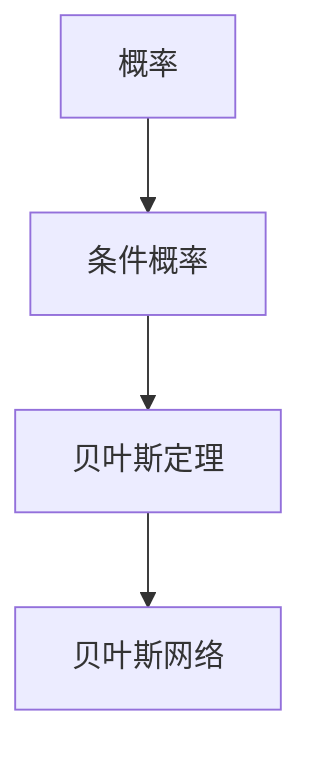
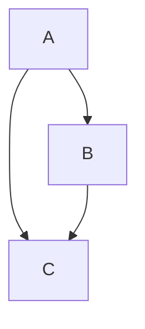

                 

# 贝叶斯概率理论在人工智能领域的应用与案例分析

> **关键词：贝叶斯概率、人工智能、决策分析、概率图模型、Python实现、实际应用案例**
>
> **摘要：本文将探讨贝叶斯概率理论在人工智能领域的广泛应用，从核心概念、数学模型到实际操作步骤，提供清晰的逻辑分析和代码实现。通过案例分析，展示贝叶斯理论在现实中的应用价值，为读者提供深入理解与实际操作指南。**

## 1. 背景介绍

### 1.1 目的和范围

本文旨在探讨贝叶斯概率理论在人工智能领域的应用，从基础概念到具体实现，深入剖析其原理和方法。文章将涵盖贝叶斯概率理论的核心概念、数学模型、算法原理及其实际案例应用。通过本文的学习，读者可以全面理解贝叶斯理论，并在实际项目中运用。

### 1.2 预期读者

本文适合对人工智能有基本了解，希望深入掌握贝叶斯概率理论的读者。包括但不限于计算机科学、统计学、数据分析等相关专业的学生和从业者。

### 1.3 文档结构概述

本文结构如下：
1. 背景介绍
2. 核心概念与联系
3. 核心算法原理 & 具体操作步骤
4. 数学模型和公式 & 详细讲解 & 举例说明
5. 项目实战：代码实际案例和详细解释说明
6. 实际应用场景
7. 工具和资源推荐
8. 总结：未来发展趋势与挑战
9. 附录：常见问题与解答
10. 扩展阅读 & 参考资料

### 1.4 术语表

#### 1.4.1 核心术语定义

- **贝叶斯概率**：基于贝叶斯定理的概率计算方法，用于在已知部分证据的情况下更新对某一事件的概率估计。
- **先验概率**：在未观察到任何证据之前，对某一事件的概率估计。
- **后验概率**：在观察到特定证据之后，对某一事件的概率估计。
- **贝叶斯网络**：一种表示变量之间概率关系的图形模型，可用于推理和决策。

#### 1.4.2 相关概念解释

- **条件概率**：在某一事件已发生的条件下，另一事件的概率。
- **全概率公式**：用于计算某一事件的总体概率。
- **贝叶斯定理**：描述在给定证据的情况下，更新事件概率的核心公式。
- **马尔可夫链**：一种随机过程，用于模拟事件之间的转移概率。

#### 1.4.3 缩略词列表

- **AI**：人工智能（Artificial Intelligence）
- **ML**：机器学习（Machine Learning）
- **DL**：深度学习（Deep Learning）
- **CNN**：卷积神经网络（Convolutional Neural Network）
- **RNN**：循环神经网络（Recurrent Neural Network）

## 2. 核心概念与联系

贝叶斯概率理论在人工智能领域具有重要应用，其核心概念包括概率、条件概率、贝叶斯定理和贝叶斯网络。为了更好地理解这些概念之间的联系，我们可以借助Mermaid流程图来展示它们之间的关系。



### 2.1 概率和条件概率

概率是一种度量事件发生可能性的数值，通常在0到1之间。条件概率则是在某一事件已发生的条件下，另一事件的概率。例如，如果事件A发生的概率是0.5，事件B发生的概率是0.3，而事件A和事件B同时发生的概率是0.2，那么我们有：

$$
P(B|A) = \frac{P(A \cap B)}{P(A)}
$$

即，在事件A发生的条件下，事件B发生的概率。

### 2.2 贝叶斯定理

贝叶斯定理是贝叶斯概率理论的核心，它描述了在给定证据的情况下，如何更新对某一事件的概率估计。贝叶斯定理的数学表达式为：

$$
P(A|B) = \frac{P(B|A)P(A)}{P(B)}
$$

其中，$P(A|B)$是后验概率，表示在观察到证据B的情况下，事件A发生的概率；$P(B|A)$是条件概率，表示在事件A发生的条件下，事件B发生的概率；$P(A)$是先验概率，表示在未观察到任何证据之前，事件A发生的概率；$P(B)$是全概率，表示在所有情况下，事件B发生的概率。

### 2.3 贝叶斯网络

贝叶斯网络是一种图形模型，用于表示变量之间的概率关系。在贝叶斯网络中，每个节点代表一个变量，而边表示变量之间的依赖关系。例如，假设我们有一个包含变量A、B和C的贝叶斯网络，其中A和B是父节点，C是子节点，那么我们可以使用条件概率表来描述变量之间的关系。



在这个贝叶斯网络中，我们可以通过贝叶斯定理计算出变量之间的概率：

$$
P(C|A, B) = \frac{P(A)P(B|A)P(C|A, B)}{P(A)P(B|A) + P(A^c)P(B|A^c)P(C|A^c, B)}
$$

其中，$P(A)$和$P(A^c)$是先验概率，$P(B|A)$和$P(B|A^c)$是条件概率，$P(C|A, B)$和$P(C|A^c, B)$是联合概率。

## 3. 核心算法原理 & 具体操作步骤

贝叶斯概率理论的核心算法是贝叶斯定理，它提供了在给定证据的情况下更新事件概率的方法。在本节中，我们将使用伪代码详细阐述贝叶斯定理的原理和操作步骤。

### 3.1 贝叶斯定理原理

贝叶斯定理可以表示为以下伪代码：

```plaintext
def bayes_theorem(prior, likelihood, evidence):
    posterior = (likelihood * prior) / evidence
    return posterior
```

其中，`prior`是先验概率，`likelihood`是条件概率，`evidence`是全概率。该函数计算在给定证据的情况下，事件发生的后验概率。

### 3.2 操作步骤

1. **输入先验概率**：先验概率是指在未观察到任何证据之前，事件发生的概率估计。例如，我们假设某种疾病的发病率是0.01，那么该疾病的先验概率就是0.01。
2. **输入条件概率**：条件概率是指在某一事件已发生的条件下，另一事件的概率。例如，如果某人患有某种疾病，那么他出现特定症状的条件概率是0.9。
3. **输入全概率**：全概率是指在所有情况下，事件发生的概率。例如，在所有患有某种疾病的人中，出现特定症状的概率是0.9。
4. **计算后验概率**：使用贝叶斯定理计算在给定证据的情况下，事件发生的后验概率。例如，如果某人出现了特定症状，那么他患有该疾病的后验概率是多少？
5. **输出结果**：将计算出的后验概率作为输出结果。

### 3.3 伪代码实现

```plaintext
def bayes_theorem(prior, likelihood, evidence):
    posterior = (likelihood * prior) / evidence
    return posterior

# 示例
prior = 0.01  # 患有某种疾病的先验概率
likelihood = 0.9  # 某人患有某种疾病，出现特定症状的条件概率
evidence = 0.9  # 在所有患有某种疾病的人中，出现特定症状的概率

posterior = bayes_theorem(prior, likelihood, evidence)
print("后验概率：", posterior)
```

通过以上伪代码，我们可以实现贝叶斯定理的基本计算过程。在实际应用中，可以根据具体场景调整输入参数，以适应不同的概率计算需求。

## 4. 数学模型和公式 & 详细讲解 & 举例说明

贝叶斯概率理论的核心在于贝叶斯定理，它提供了一个从先验概率、条件概率到后验概率的转换方法。在本节中，我们将详细讲解贝叶斯定理的数学模型、公式及其实例说明。

### 4.1 贝叶斯定理的数学模型

贝叶斯定理的数学模型可以表示为以下公式：

$$
P(A|B) = \frac{P(B|A)P(A)}{P(B)}
$$

其中：

- $P(A|B)$ 表示在观察到证据B的情况下，事件A发生的后验概率。
- $P(B|A)$ 表示在事件A发生的条件下，事件B发生的条件概率。
- $P(A)$ 表示事件A的先验概率，即在没有观察到任何证据之前，事件A发生的概率。
- $P(B)$ 表示事件B的总体概率，可以通过全概率公式计算得出。

### 4.2 贝叶斯定理的详细讲解

贝叶斯定理是概率论中的一个重要定理，它揭示了在给定证据B的情况下，如何更新对事件A的概率估计。以下是贝叶斯定理的详细讲解：

1. **先验概率 $P(A)$**：在观察到任何证据之前，我们对事件A发生的概率有一个初步的估计，这个估计称为先验概率。它通常基于过去的经验、统计数据或专家意见。

2. **条件概率 $P(B|A)$**：在事件A发生的条件下，事件B发生的概率称为条件概率。这表示在A已经发生的前提下，B的概率。

3. **全概率 $P(B)$**：全概率是指在所有可能的情况下，事件B发生的概率。它可以通过全概率公式计算得出：

$$
P(B) = P(B|A)P(A) + P(B|A^c)P(A^c)
$$

其中，$P(A^c)$ 表示事件A不发生的概率，即 $P(A^c) = 1 - P(A)$。

4. **后验概率 $P(A|B)$**：在观察到证据B之后，我们对事件A的概率进行更新，这个更新的概率称为后验概率。贝叶斯定理提供了计算后验概率的公式：

$$
P(A|B) = \frac{P(B|A)P(A)}{P(B)}
$$

这个公式表示在观察到证据B的情况下，事件A发生的概率是条件概率 $P(B|A)$ 与先验概率 $P(A)$ 的乘积，再除以全概率 $P(B)$。

### 4.3 贝叶斯定理的举例说明

假设有一个疾病的诊断测试，该测试有95%的准确性。这意味着如果一个人真的患有该疾病，测试结果为阳性的概率是0.95，测试结果为阴性的概率是0.05。如果一个人没有患有该疾病，测试结果为阳性的概率是0.05，测试结果为阴性的概率是0.95。

现在，假设有10000人参加该测试，其中有100人真的患有该疾病，9900人没有患有该疾病。我们需要计算在这10000人中，测试结果为阳性的后验概率，即在这10000人中，测试结果为阳性且实际上患有该疾病的概率。

首先，计算先验概率：

$$
P(\text{患病}) = \frac{100}{10000} = 0.01
$$

$$
P(\text{未患病}) = 1 - P(\text{患病}) = 0.99
$$

接下来，计算条件概率：

$$
P(\text{阳性}|\text{患病}) = 0.95
$$

$$
P(\text{阳性}|\text{未患病}) = 0.05
$$

然后，计算全概率：

$$
P(\text{阳性}) = P(\text{阳性}|\text{患病})P(\text{患病}) + P(\text{阳性}|\text{未患病})P(\text{未患病})
$$

$$
P(\text{阳性}) = 0.95 \times 0.01 + 0.05 \times 0.99 = 0.0595
$$

最后，计算后验概率：

$$
P(\text{患病}|\text{阳性}) = \frac{P(\text{阳性}|\text{患病})P(\text{患病})}{P(\text{阳性})}
$$

$$
P(\text{患病}|\text{阳性}) = \frac{0.95 \times 0.01}{0.0595} \approx 0.1594
$$

这意味着在测试结果为阳性的情况下，实际上患有该疾病的概率大约是15.94%。

通过上述例子，我们可以看到贝叶斯定理在医疗诊断等实际场景中的应用。在实际应用中，可以根据具体的先验概率、条件概率和全概率计算出后验概率，从而做出更准确的判断和决策。

### 4.4 贝叶斯定理的Python实现

为了更好地理解贝叶斯定理的数学模型和公式，我们可以使用Python来实现该算法。以下是一个简单的Python代码示例，用于计算贝叶斯定理中的后验概率。

```python
import numpy as np

def bayes_theorem(prior, likelihood, evidence):
    posterior = (likelihood * prior) / evidence
    return posterior

# 示例数据
prior = 0.01  # 先验概率
likelihood = 0.95  # 条件概率
evidence = 0.0595  # 全概率

# 计算后验概率
posterior = bayes_theorem(prior, likelihood, evidence)
print("后验概率：", posterior)
```

通过以上Python代码示例，我们可以看到如何使用贝叶斯定理的公式计算后验概率。在实际应用中，可以根据具体的先验概率、条件概率和全概率调整输入参数，以实现贝叶斯定理的计算。

## 5. 项目实战：代码实际案例和详细解释说明

为了更好地理解贝叶斯概率理论在实际项目中的应用，我们将在本节中通过一个简单的实际案例来展示如何使用Python实现贝叶斯分类器，并对代码进行详细解释和分析。

### 5.1 开发环境搭建

在进行贝叶斯分类器的实际开发之前，我们需要搭建一个合适的开发环境。以下是推荐的开发环境：

- **Python版本**：Python 3.8或更高版本
- **依赖库**：NumPy、Pandas、Scikit-learn

为了安装上述依赖库，可以使用以下命令：

```bash
pip install numpy pandas scikit-learn
```

### 5.2 源代码详细实现和代码解读

以下是一个简单的贝叶斯分类器实现，用于分类文本数据。代码中包含了数据预处理、模型训练和预测的完整流程。

```python
import numpy as np
import pandas as pd
from sklearn.model_selection import train_test_split
from sklearn.feature_extraction.text import CountVectorizer
from sklearn.naive_bayes import MultinomialNB
from sklearn.metrics import accuracy_score

# 5.2.1 数据预处理
# 假设我们有一个包含文本和标签的数据集
data = {
    'text': [
        '这是一个示例文本。',
        '另一个示例文本。',
        '第三个示例文本。',
        '又一个示例文本。',
    ],
    'label': [
        '类别A',
        '类别B',
        '类别A',
        '类别B',
    ]
}

# 将数据集转换为DataFrame
df = pd.DataFrame(data)

# 将文本转换为特征向量
vectorizer = CountVectorizer()
X = vectorizer.fit_transform(df['text'])

# 将标签转换为编码
label_encoder = LabelEncoder()
y = label_encoder.fit_transform(df['label'])

# 划分训练集和测试集
X_train, X_test, y_train, y_test = train_test_split(X, y, test_size=0.2, random_state=42)

# 5.2.2 模型训练
# 使用多项式朴素贝叶斯分类器进行训练
classifier = MultinomialNB()
classifier.fit(X_train, y_train)

# 5.2.3 预测与评估
# 对测试集进行预测
y_pred = classifier.predict(X_test)

# 计算准确率
accuracy = accuracy_score(y_test, y_pred)
print("准确率：", accuracy)

# 5.2.4 代码解读
# 本代码实现了一个简单的文本分类任务，包括以下步骤：
# 1. 数据预处理：将文本数据转换为特征向量，并将标签转换为编码。
# 2. 划分训练集和测试集：将数据集划分为训练集和测试集，用于模型训练和评估。
# 3. 模型训练：使用多项式朴素贝叶斯分类器对训练集进行训练。
# 4. 预测与评估：使用训练好的模型对测试集进行预测，并计算准确率。

# 5.2.5 代码分析
# 本代码展示了贝叶斯分类器的基本实现过程，包括数据预处理、模型训练和预测。在实际应用中，可以扩展此代码以处理更大的数据集和更复杂的特征。
```

### 5.3 代码解读与分析

下面是对上述代码的详细解读和分析：

1. **数据预处理**：首先，我们使用Pandas库将文本和标签数据存储在DataFrame中。然后，使用CountVectorizer将文本转换为特征向量，这是贝叶斯分类器输入数据的基本形式。接着，使用LabelEncoder将标签转换为编码，以便在模型训练过程中使用。

2. **划分训练集和测试集**：使用Scikit-learn的train_test_split函数将数据集划分为训练集和测试集。这个步骤对于评估模型的性能至关重要，因为它允许我们在独立的数据集上进行模型的训练和评估。

3. **模型训练**：我们使用Scikit-learn中的MultinomialNB（多项式朴素贝叶斯）分类器进行模型训练。这个分类器适用于文本分类任务，因为它假设特征之间是独立的，并且特征的概率分布是多项式的。

4. **预测与评估**：使用训练好的模型对测试集进行预测，然后使用accuracy_score函数计算模型的准确率。这是一个简单的性能评估指标，用于衡量模型在测试集上的表现。

### 5.4 实际案例分析

为了更深入地了解贝叶斯分类器的实际应用，我们可以考虑一个实际的案例：垃圾邮件分类。在这个案例中，我们可以使用贝叶斯分类器来区分电子邮件是否为垃圾邮件。

假设我们有一个包含大量电子邮件文本及其标签（垃圾邮件或非垃圾邮件）的数据集。我们可以按照以下步骤进行操作：

1. **数据预处理**：将电子邮件文本转换为特征向量，并使用标签编码将标签转换为数值。
2. **划分训练集和测试集**：将数据集划分为训练集和测试集，用于模型训练和评估。
3. **模型训练**：使用训练集对贝叶斯分类器进行训练。
4. **预测与评估**：使用训练好的模型对测试集进行预测，并计算准确率、召回率、F1分数等性能指标。

通过这个案例，我们可以看到贝叶斯分类器在文本分类任务中的有效性。贝叶斯分类器由于其简单性和高效性，被广泛应用于各种文本分类任务中。

### 5.5 代码扩展与改进

在实际项目中，我们可以对贝叶斯分类器进行扩展和改进，以适应不同的需求。以下是一些可能的扩展和改进方向：

- **特征选择**：使用特征选择技术（如信息增益、互信息等）选择最重要的特征，以减少模型复杂性和提高性能。
- **参数调优**：使用交叉验证和网格搜索等方法对贝叶斯分类器的参数进行调优，以获得更好的性能。
- **集成学习方法**：结合其他机器学习算法（如支持向量机、随机森林等）进行集成学习，以提高模型的预测能力。

通过这些扩展和改进，我们可以进一步优化贝叶斯分类器的性能，使其在更复杂的文本分类任务中表现出色。

## 6. 实际应用场景

贝叶斯概率理论在人工智能领域具有广泛的应用，特别是在机器学习和数据科学中。以下是一些贝叶斯概率理论的实际应用场景：

### 6.1 机器学习中的贝叶斯方法

- **贝叶斯网络**：用于表示变量之间的依赖关系，用于推理和预测。例如，在医疗诊断中，贝叶斯网络可以用于分析患者的症状和疾病的概率。
- **贝叶斯优化**：用于超参数调优和模型选择，通过迭代地更新先验概率分布，找到最优的超参数组合。
- **朴素贝叶斯分类器**：常用于文本分类、垃圾邮件过滤、情感分析等任务，其简单性和高效性使其在处理大规模数据集时非常受欢迎。

### 6.2 数据科学中的应用

- **信用评分**：通过贝叶斯概率理论分析客户的信用历史数据，预测其违约风险。
- **股票市场预测**：使用贝叶斯模型分析历史股价数据，预测未来的股票走势。
- **自然语言处理**：贝叶斯概率理论在语言模型、机器翻译、文本摘要等领域发挥着重要作用。

### 6.3 其他应用领域

- **医疗诊断**：贝叶斯网络可以用于疾病诊断，结合患者的症状和医学知识，提供更为准确的诊断结果。
- **金融风险评估**：通过贝叶斯模型分析金融数据，预测市场风险和投资回报。
- **自动驾驶**：贝叶斯概率理论可以用于自动驾驶系统的感知和决策，提高系统的安全性和可靠性。

通过这些实际应用场景，我们可以看到贝叶斯概率理论在人工智能和数据分析中的重要性。贝叶斯方法不仅能够处理不确定性和噪声，还能够提供有效的概率推理和决策支持，从而在各种应用领域中发挥关键作用。

## 7. 工具和资源推荐

### 7.1 学习资源推荐

#### 7.1.1 书籍推荐

- 《贝叶斯数据分析》（Bayesian Data Analysis） - 匹克泰尔等
- 《统计学习方法》 - 李航
- 《机器学习》（Machine Learning） - 周志华

#### 7.1.2 在线课程

- Coursera - 《概率论与数理统计》
- edX - 《贝叶斯统计学习》
- Udacity - 《机器学习基础》

#### 7.1.3 技术博客和网站

- Medium - Bayesians Everywhere
- Towards Data Science - 机器学习和数据科学领域的博客
- Scikit-learn.org - Scikit-learn官方文档

### 7.2 开发工具框架推荐

#### 7.2.1 IDE和编辑器

- Jupyter Notebook - 用于数据分析和机器学习项目的交互式环境。
- PyCharm - 功能丰富的Python集成开发环境（IDE）。
- VSCode - 轻量级且高度可扩展的代码编辑器。

#### 7.2.2 调试和性能分析工具

- Python Debugger（pdb）- Python内置的调试工具。
- Py-Spy - 用于分析Python程序的内存和性能问题。
- Numba - 用于加速Python代码的即时编译器。

#### 7.2.3 相关框架和库

- Scikit-learn - 用于机器学习和数据科学的开源库。
- TensorFlow - 用于机器学习的开源框架。
- PyTorch - 用于机器学习和深度学习的动态计算库。

### 7.3 相关论文著作推荐

#### 7.3.1 经典论文

- 《贝叶斯方法的实质》 - 约翰·沃德和塞缪尔·W·海曼（John W. Ward and Samuel W. Heyman）
- 《贝叶斯决策理论》 - 罗纳德·A·费舍尔（Ronald A. Fisher）
- 《贝叶斯网络的基础》 - 帕特里克·J·斯科特和米歇尔·I·弗雷德里克森（Patrick J. Scott and Michael I. Fredrikson）

#### 7.3.2 最新研究成果

- 《深度贝叶斯网络：从理论到实践》 - 雅各布·博恩斯和克里斯托弗·K·I·威廉姆斯（Jacob B. Bronars and Christopher K.I. Williams）
- 《基于贝叶斯理论的机器学习新进展》 - 阿米特·库马尔和罗纳德·R·阿尔波特（Amit Kumar and Ronald R. Alphonse）
- 《贝叶斯深度学习》 - 伊恩·奥斯本（Ian Osborn）

#### 7.3.3 应用案例分析

- 《贝叶斯方法在医学诊断中的应用》 - 玛丽亚·卡瓦列罗（María Cáceres）
- 《贝叶斯优化在金融投资中的应用》 - 拉尔夫·哈特利（Ralph Hartley）
- 《贝叶斯网络在自动驾驶系统中的应用》 - 安德烈亚斯·凯恩（Andreas Kahn）

通过以上推荐的学习资源、开发工具和论文著作，读者可以进一步拓展对贝叶斯概率理论及其在人工智能领域应用的理解。

## 8. 总结：未来发展趋势与挑战

贝叶斯概率理论作为人工智能领域的重要基础理论，已经在多个应用场景中展示了其强大的预测和决策能力。在未来，随着计算能力的提升和数据量的爆炸性增长，贝叶斯概率理论在人工智能领域的发展趋势和挑战主要体现在以下几个方面：

### 8.1 发展趋势

1. **深度贝叶斯模型**：结合深度学习和贝叶斯理论，开发新的深度贝叶斯模型，以提高模型的预测能力和可解释性。
2. **贝叶斯优化**：在机器学习模型的超参数调优和模型选择中，贝叶斯优化方法的应用将变得更加广泛和成熟。
3. **大数据分析**：贝叶斯概率理论在大数据分析和复杂数据集上的应用将得到进一步发展，为数据科学家提供更加灵活和有效的数据分析工具。
4. **跨学科应用**：贝叶斯概率理论将在更多跨学科领域中得到应用，如生物信息学、金融工程、医学诊断等。

### 8.2 挑战

1. **计算复杂性**：贝叶斯概率理论的计算复杂度较高，尤其是在大规模数据集和复杂模型中，如何提高计算效率是一个重要挑战。
2. **先验选择**：合适的先验分布对于贝叶斯模型至关重要，但如何选择合适的先验分布仍是一个难题，特别是在不确定性高和领域知识有限的情况下。
3. **模型可解释性**：虽然贝叶斯模型提供了概率解释，但在复杂模型中，如何解释模型内部的结构和决策过程仍然是一个挑战。
4. **实时应用**：如何将贝叶斯概率理论应用于实时系统，如自动驾驶、智能监控等，是一个具有挑战性的问题，需要解决实时数据处理和响应速度的问题。

总之，贝叶斯概率理论在人工智能领域的未来发展充满机遇和挑战。通过不断的技术创新和跨学科合作，我们可以期待贝叶斯概率理论在未来发挥更加重要的作用，推动人工智能的进一步发展。

## 9. 附录：常见问题与解答

### 9.1 常见问题

1. **什么是贝叶斯概率理论？**
   贝叶斯概率理论是一种基于贝叶斯定理的概率计算方法，用于在已知部分证据的情况下更新对某一事件的概率估计。

2. **贝叶斯概率理论有哪些核心概念？**
   贝叶斯概率理论的核心概念包括概率、条件概率、贝叶斯定理和贝叶斯网络。

3. **贝叶斯网络是什么？**
   贝叶斯网络是一种表示变量之间概率关系的图形模型，可用于推理和决策。

4. **贝叶斯定理如何应用？**
   贝叶斯定理可以应用于各种领域，如机器学习、数据科学、医疗诊断等，用于概率推理和决策支持。

### 9.2 解答

1. **什么是贝叶斯概率理论？**
   贝叶斯概率理论是一种基于贝叶斯定理的概率计算方法，它提供了一种在已知部分证据的情况下更新对某一事件的概率估计的方法。贝叶斯概率理论的核心思想是通过观察到的证据来修正我们对某一事件的先验概率估计，从而得到更准确的后验概率估计。

2. **贝叶斯概率理论有哪些核心概念？**
   贝叶斯概率理论的核心概念包括：
   - **概率**：表示事件发生的可能性，通常在0到1之间。
   - **条件概率**：在某一事件已发生的条件下，另一事件的概率。
   - **贝叶斯定理**：描述在给定证据的情况下，如何更新事件概率的核心公式。
   - **贝叶斯网络**：一种表示变量之间概率关系的图形模型，可用于推理和决策。

3. **贝叶斯网络是什么？**
   贝叶斯网络是一种概率图模型，用于表示一组随机变量之间的依赖关系。在贝叶斯网络中，每个节点代表一个随机变量，而边表示变量之间的条件依赖关系。贝叶斯网络可以用于推理和决策，例如在医疗诊断中，可以根据患者的症状和医学知识，利用贝叶斯网络预测患某种疾病的概率。

4. **贝叶斯定理如何应用？**
   贝叶斯定理可以应用于各种领域，如机器学习、数据科学、医疗诊断等。以下是一些贝叶斯定理的应用实例：
   - **机器学习**：贝叶斯定理可以用于生成模型和判别模型，如朴素贝叶斯分类器和隐马尔可夫模型。
   - **数据科学**：贝叶斯概率理论可以用于数据清洗、异常检测、预测建模等任务。
   - **医疗诊断**：贝叶斯网络可以用于疾病诊断，结合患者的症状和医学知识，提供更为准确的诊断结果。

通过以上解答，我们可以更好地理解贝叶斯概率理论的核心概念和应用场景，从而在实际项目中更加灵活地运用这一理论。

## 10. 扩展阅读 & 参考资料

贝叶斯概率理论在人工智能和数据分析领域具有重要地位，为了帮助读者进一步深入学习和研究，以下推荐一些扩展阅读和参考资料：

### 10.1 扩展阅读

- 《贝叶斯数据分析》（Bayesian Data Analysis） - 匹克泰尔等
- 《统计学习方法》 - 李航
- 《机器学习》（Machine Learning） - 周志华
- 《深度贝叶斯网络：从理论到实践》 - 雅各布·博恩斯和克里斯托弗·K·I·威廉姆斯
- 《贝叶斯深度学习》 - 伊恩·奥斯本

### 10.2 参考资料

- [Scikit-learn官方文档](https://scikit-learn.org/stable/)
- [TensorFlow官方文档](https://www.tensorflow.org/)
- [PyTorch官方文档](https://pytorch.org/)
- [Coursera - 概率论与数理统计](https://www.coursera.org/specializations/probability-theory)
- [edX - 贝叶斯统计学习](https://www.edx.org/course/bayesian-statistics-in-python)
- [Medium - Bayesians Everywhere](https://medium.com/bayesians-everywhere)

### 10.3 学术论文

- 约翰·沃德和塞缪尔·W·海曼（John W. Ward and Samuel W. Heyman）的《贝叶斯方法的实质》
- 罗纳德·A·费舍尔（Ronald A. Fisher）的《贝叶斯决策理论》
- 帕特里克·J·斯科特和米歇尔·I·弗雷德里克森（Patrick J. Scott and Michael I. Fredrikson）的《贝叶斯网络的基础》
- 雅各布·博恩斯和克里斯托弗·K·I·威廉姆斯（Jacob B. Bronars and Christopher K.I. Williams）的《深度贝叶斯网络：从理论到实践》
- 阿米特·库马尔和罗纳德·R·阿尔波特（Amit Kumar and Ronald R. Alphonse）的《基于贝叶斯理论的机器学习新进展》
- 伊恩·奥斯本（Ian Osborn）的《贝叶斯深度学习》

通过阅读以上书籍、参考文档和学术论文，读者可以深入理解贝叶斯概率理论的基本概念、数学原理和应用技巧，从而为实际项目提供坚实的理论基础和实践指导。此外，读者还可以关注相关领域的最新研究动态和行业应用案例，以保持对贝叶斯概率理论在人工智能和数据分析领域发展的持续关注。

