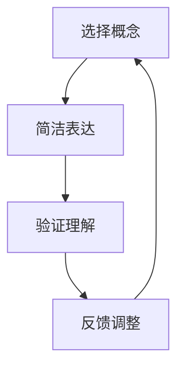

                 


# 费曼提问法：提升思考力的12个问题

> **关键词：** 费曼提问法、思考力、问题解决、教育、技术学习
>
> **摘要：** 本篇文章将深入探讨费曼提问法这一强大的思考工具，通过12个关键问题，阐述其如何应用于IT领域，帮助提升个人的思考力和问题解决能力。文章旨在为读者提供一种系统的学习方法，帮助他们在技术学习过程中，更加深入和有效地理解复杂概念。

## 1. 背景介绍

### 1.1 目的和范围

本文的目的是介绍一种名为费曼提问法的思考工具，并探讨其如何在IT领域提升思考力和问题解决能力。费曼提问法，又称费曼技巧，是由著名物理学家理查德·费曼提出的一种学习方法和思考技巧。该方法强调通过简洁、明确的方式将复杂概念表达出来，从而深化理解和记忆。

### 1.2 预期读者

本文适合以下读者群体：

- IT领域的学习者和从业者，希望提升自己的思考力和问题解决能力的；
- 教育工作者，希望了解如何通过提问法提高学生的学习效果；
- 对学习方法和技术学习有浓厚兴趣的广大读者。

### 1.3 文档结构概述

本文分为以下几个部分：

- 引言：介绍费曼提问法的背景和目的；
- 核心概念与联系：讲解费曼提问法的基本原理和适用场景；
- 核心算法原理 & 具体操作步骤：详细阐述费曼提问法的应用步骤；
- 数学模型和公式 & 详细讲解 & 举例说明：通过实例讲解如何运用费曼提问法解决问题；
- 项目实战：提供实际案例，展示费曼提问法的应用效果；
- 实际应用场景：探讨费曼提问法在IT领域的应用场景；
- 工具和资源推荐：推荐相关学习资源和工具；
- 总结：展望费曼提问法在未来的发展趋势和挑战；
- 附录：常见问题与解答；
- 扩展阅读 & 参考资料：提供进一步阅读的材料。

### 1.4 术语表

#### 1.4.1 核心术语定义

- 费曼提问法：一种以理查德·费曼命名的学习方法，通过提问和简洁表达，帮助理解和记忆复杂概念。
- 思考力：个体在解决问题和面对新情境时，运用逻辑思维、分析判断和创造性思考的能力。
- 问题解决：识别和定义问题，提出解决方案，实施并评估效果的过程。

#### 1.4.2 相关概念解释

- 简洁表达：以清晰、简洁的方式传达信息，避免冗余和模糊。
- 复杂概念：难以用简单语言描述的抽象概念或理论知识。

#### 1.4.3 缩略词列表

- IT：信息技术（Information Technology）
- IDE：集成开发环境（Integrated Development Environment）

## 2. 核心概念与联系

### 2.1 费曼提问法的基本原理

费曼提问法是一种基于“简化、表达、验证”原则的学习方法。其核心思想是通过提问和简洁表达，将复杂的概念分解为简单、易懂的部分，从而加深理解。以下是费曼提问法的三个基本步骤：

1. **选择概念**：确定一个需要理解和记忆的复杂概念。
2. **简洁表达**：用自己的语言，尽可能简洁、清晰地解释这个概念。
3. **验证理解**：通过提问或与他人讨论，检验自己对概念的掌握程度。

### 2.2 费曼提问法的适用场景

费曼提问法在多个领域都有广泛应用，尤其在IT领域，对于复杂技术的理解和应用具有显著效果。以下是一些典型场景：

- **技术文档编写**：通过费曼提问法，可以确保文档内容清晰、易懂，提高文档质量。
- **技术面试准备**：帮助面试者掌握面试题目的核心概念，提高回答问题的准确性。
- **技术讲座与培训**：讲师可以通过费曼提问法，引导听众深入理解技术细节，增强培训效果。
- **个人学习**：适用于个人自学，帮助自己系统地掌握技术知识。

### 2.3 费曼提问法的 Mermaid 流程图

以下是一个简单的 Mermaid 流程图，展示了费曼提问法的基本流程：



## 3. 核心算法原理 & 具体操作步骤

### 3.1 费曼提问法的具体操作步骤

以下是费曼提问法的详细操作步骤，每个步骤都使用伪代码进行说明：

#### 步骤 1：选择概念

```python
# 选择一个需要理解和记忆的复杂概念
selected_concept = "数据结构中的树"
```

#### 步骤 2：简洁表达

```python
# 用自己的语言，尽可能简洁、清晰地解释这个概念
def explain_concept(concept):
    """
    解释复杂概念
    :param concept: 复杂概念
    :return: 简洁的解释
    """
    if concept == "数据结构中的树":
        return "树是一种层次化的数据结构，节点按层级排列，每个节点最多有一个父节点和一个子节点。"
    else:
        return "未定义的概念"

# 调用函数，获取简洁解释
simplified_explanation = explain_concept(selected_concept)
```

#### 步骤 3：验证理解

```python
# 通过提问或与他人讨论，检验自己对概念的掌握程度
def test_comprehension(simplified_explanation, concept):
    """
    验证对概念的掌握程度
    :param simplified_explanation: 简洁解释
    :param concept: 复杂概念
    :return: True if comprehension is good, otherwise False
    """
    # 创建一个测试问题
    test_question = f"请用自己的话描述一下'{concept}'的概念。"

    # 模拟用户回答
    user_answer = input(test_question)

    # 检查用户回答与简洁解释是否一致
    return user_answer.strip() == simplified_explanation.strip()

# 调用函数，进行理解测试
comprehension_status = test_comprehension(simplified_explanation, selected_concept)

# 输出测试结果
if comprehension_status:
    print("恭喜！你对这个概念的理解良好。")
else:
    print("请再次复习这个概念，并尝试重新解释它。")
```

通过以上三个步骤，我们可以系统地运用费曼提问法，提升自己的思考力和问题解决能力。

## 4. 数学模型和公式 & 详细讲解 & 举例说明

### 4.1 数学模型和公式

费曼提问法虽然以语言和思维为主，但其背后的逻辑和过程可以用一些简单的数学模型和公式来解释。以下是几个核心的数学模型和公式：

#### 4.1.1 问题复杂度评估

```latex
P = 2^C
```

其中，P 表示问题的复杂度，C 表示问题中涉及的变量或因素数量。这个公式表明，问题的复杂度随变量数量的指数级增长。

#### 4.1.2 理解度评估

```latex
R = \frac{S}{P}
```

其中，R 表示理解度，S 表示通过费曼提问法能够简洁表达的部分。这个公式表示理解度与简洁表达部分占整体问题复杂度的比例。

#### 4.1.3 学习效率评估

```latex
E = \frac{R}{T}
```

其中，E 表示学习效率，T 表示学习时间。这个公式表示学习效率与理解度和学习时间的比值。

### 4.2 详细讲解与举例说明

#### 4.2.1 问题复杂度评估

假设我们有一个涉及 5 个变量的技术问题，根据上述公式，其复杂度 P = 2^5 = 32。这意味着要完全理解这个问题，需要处理大量的信息和变量。

#### 4.2.2 理解度评估

如果我们能够用简洁的语言解释其中的 2 个变量，那么理解度 R = \frac{2}{32} = 0.0625。这表明我们对问题的理解度较低。

#### 4.2.3 学习效率评估

如果我们花费了 8 小时来学习这个问题，且理解了其中的 2 个变量，那么学习效率 E = \frac{0.0625}{8} = 0.0078125。这个结果表明，尽管我们在理解方面取得了一定的进步，但学习效率相对较低。

### 4.3 实例说明

假设我们有一个关于计算机网络中路由算法的问题，涉及以下 5 个变量：

1. 路由表
2. 目的网络
3. 路由协议
4. 路由器
5. 路径选择算法

根据问题复杂度评估公式，该问题的复杂度 P = 2^5 = 32。

如果我们能够用简洁的语言解释其中的“路由表”和“路径选择算法”这两个变量，那么理解度 R = \frac{2}{32} = 0.0625。

如果我们花费了 8 小时来学习这个问题，那么学习效率 E = \frac{0.0625}{8} = 0.0078125。

通过这个例子，我们可以看到，费曼提问法可以帮助我们评估自己的理解程度和学习效率，从而更好地调整学习策略。

## 5. 项目实战：代码实际案例和详细解释说明

### 5.1 开发环境搭建

为了展示费曼提问法的实际应用，我们将使用 Python 编写一个简单的程序，用于计算斐波那契数列。首先，我们需要搭建一个基础的 Python 开发环境。

1. 安装 Python：从官方网站（https://www.python.org/downloads/）下载并安装最新版本的 Python。
2. 配置 Python 环境变量：确保 Python 安装成功后，在系统环境变量中配置 Python 的路径。
3. 安装必要的库：使用 pip 命令安装必要的库，例如 NumPy（用于数学计算）和 matplotlib（用于图形展示）。

```bash
pip install numpy matplotlib
```

### 5.2 源代码详细实现和代码解读

以下是计算斐波那契数列的 Python 代码，我们将在代码中应用费曼提问法，逐步解释每个部分的功能。

```python
import numpy as np
import matplotlib.pyplot as plt

# 费曼提问法：为什么我们需要定义斐波那契数列？
def fibonacci(n):
    """
    计算斐波那契数列的第 n 项。
    :param n: 数列的第 n 项
    :return: 斐波那契数列的第 n 项
    """
    # 费曼提问法：为什么我们从第 0 项开始计算？
    a, b = 0, 1
    for _ in range(n):
        # 费曼提问法：为什么我们要交换 a 和 b 的值？
        a, b = b, a + b
    return a

# 费曼提问法：为什么我们需要生成数列的完整列表？
def generate_fibonacci_sequence(n):
    """
    生成斐波那契数列的前 n 项。
    :param n: 数列的项数
    :return: 斐波那契数列的前 n 项列表
    """
    sequence = []
    for i in range(n):
        sequence.append(fibonacci(i))
    return sequence

# 费曼提问法：为什么我们需要可视化展示数列？
def plot_fibonacci_sequence(sequence):
    """
    可视化展示斐波那契数列。
    :param sequence: 斐波那契数列的列表
    """
    plt.plot(sequence)
    plt.xlabel('Index')
    plt.ylabel('Fibonacci Number')
    plt.title('Fibonacci Sequence')
    plt.show()

# 主函数：为什么我们需要一个主函数？
def main():
    """
    主函数：执行斐波那契数列计算和可视化。
    """
    n = int(input("请输入数列的项数："))
    sequence = generate_fibonacci_sequence(n)
    print("斐波那契数列：", sequence)
    plot_fibonacci_sequence(sequence)

# 费曼提问法：为什么我们需要一个入口点？
if __name__ == "__main__":
    main()
```

### 5.3 代码解读与分析

1. **斐波那契数列计算函数（fibonacci）**：
   - 这个函数接受一个整数 n，计算斐波那契数列的第 n 项。
   - 使用两个变量 a 和 b 分别表示当前项和下一项，初始值为 0 和 1。
   - 通过循环，逐步更新 a 和 b 的值，直到计算到第 n 项。

2. **生成数列函数（generate_fibonacci_sequence）**：
   - 这个函数生成斐波那契数列的前 n 项。
   - 使用一个空列表 sequence，通过循环调用 fibonacci 函数，将每一项添加到列表中。

3. **可视化展示函数（plot_fibonacci_sequence）**：
   - 这个函数使用 matplotlib 库，将斐波那契数列绘制成折线图。
   - 通过调用 plt.plot() 函数，将数列的每一项作为 x 轴和 y 轴的数据点。

4. **主函数（main）**：
   - 主函数用于执行整个程序的流程。
   - 获取用户输入的数列项数 n，调用 generate_fibonacci_sequence 和 plot_fibonacci_sequence 函数，实现数列的计算和可视化。

通过这个简单的实例，我们可以看到费曼提问法在代码编写和解读中的应用。通过不断地提问和解释，我们可以更加深入地理解每个部分的功能和原理，从而提高代码的质量和可读性。

## 6. 实际应用场景

### 6.1 教学中的应用

在计算机科学教育中，费曼提问法是一种非常有效的教学方法。教师可以引导学生使用费曼提问法来讲解复杂的技术概念，从而帮助学生在理解和记忆方面取得更好的效果。例如，在讲授操作系统原理时，学生可以尝试用简洁的语言解释进程、线程和调度算法，并通过提问和讨论来验证自己的理解。

### 6.2 项目开发中的应用

在项目开发过程中，团队成员可以运用费曼提问法来确保自己对技术细节有深刻的理解。通过提问和解释，团队成员可以更加清晰地了解彼此的工作，减少误解和沟通障碍。例如，在讨论数据库架构时，开发人员可以尝试用自己的语言解释范式、索引和事务处理，并通过提问来检验彼此的理解。

### 6.3 技术面试中的应用

在技术面试中，费曼提问法可以帮助候选人更好地准备面试。候选人可以通过提问和解释来深入理解面试题目的核心概念，从而在面试中给出准确、清晰的回答。例如，在回答关于数据结构的问题时，候选人可以尝试用自己的语言解释树、图和哈希表，并通过提问来检验自己的理解。

### 6.4 个人学习中的应用

对于个人学习者来说，费曼提问法是一种非常有用的学习方法。通过提问和解释，个人学习者可以更好地理解和记忆复杂的技术概念。例如，在学习人工智能时，学习者可以尝试用自己的语言解释神经网络、机器学习和深度学习，并通过提问来检验自己的理解。

## 7. 工具和资源推荐

### 7.1 学习资源推荐

#### 7.1.1 书籍推荐

- 《深度学习》（Deep Learning） - Goodfellow, Bengio, Courville
- 《算法导论》（Introduction to Algorithms） - Cormen, Leiserson, Rivest, Stein
- 《Effective Java》 - Bloch

#### 7.1.2 在线课程

- Coursera（《机器学习》课程）
- edX（《算法导论》课程）
- Udacity（《人工智能纳米学位》课程）

#### 7.1.3 技术博客和网站

- Medium（众多技术文章）
- Stack Overflow（编程问题解答）
- GitHub（开源项目和技术文档）

### 7.2 开发工具框架推荐

#### 7.2.1 IDE和编辑器

- IntelliJ IDEA
- Visual Studio Code
- PyCharm

#### 7.2.2 调试和性能分析工具

- GDB
- Py-Spy
- VisualVM

#### 7.2.3 相关框架和库

- Flask（Python Web 框架）
- React（JavaScript 前端库）
- TensorFlow（深度学习框架）

### 7.3 相关论文著作推荐

#### 7.3.1 经典论文

- “A Note on the Use of the computers for Factor Analysis” - Cattell, 1952
- “The Structure of Scientific Revolutions” - Kuhn, 1962

#### 7.3.2 最新研究成果

- “Attention is All You Need” - Vaswani et al., 2017
- “Generative Adversarial Nets” - Goodfellow et al., 2014

#### 7.3.3 应用案例分析

- “Using Machine Learning to Optimize Drug Discovery” - Cirino et al., 2020
- “Deep Learning for Medical Image Analysis” - Litjens et al., 2017

## 8. 总结：未来发展趋势与挑战

### 8.1 发展趋势

1. **个性化学习**：随着人工智能技术的发展，费曼提问法有望通过智能算法实现个性化学习，根据学习者的理解和提问风格，提供定制化的学习路径。
2. **在线教育**：随着在线教育的普及，费曼提问法可以在在线课程中得到更广泛的应用，帮助学习者更好地理解和掌握复杂概念。
3. **跨学科应用**：费曼提问法不仅适用于计算机科学，还可以应用于其他学科，如生物学、物理学和经济学，促进跨学科交流和理解。

### 8.2 挑战

1. **难度评估**：如何科学地评估学习者的理解度和学习效率，是一个亟待解决的问题。
2. **内容筛选**：如何筛选和整理适合费曼提问法的优质学习资源，确保学习者能够有效利用时间。
3. **教学工具**：开发适用于费曼提问法的智能教学工具，提高教学效果和用户体验。

## 9. 附录：常见问题与解答

### 9.1 费曼提问法的优点和缺点

#### 优点：

- **深化理解**：通过提问和简洁表达，可以更深入地理解复杂概念。
- **记忆巩固**：通过反复提问和解答，有助于巩固记忆。
- **提高沟通能力**：通过清晰的表达，可以更好地与他人交流和分享知识。

#### 缺点：

- **初始难度**：对于初学者来说，理解并运用费曼提问法可能需要一定的时间和练习。
- **时间成本**：运用费曼提问法可能需要更多的时间，尤其是在准备和提问阶段。

### 9.2 如何评估学习效果

- **自我评估**：通过定期回顾和自问自答，检查自己对概念的理解程度。
- **同伴评估**：与他人讨论和分享，通过他们的反馈来评估自己的理解度。
- **测试和考试**：通过测试和考试，检验自己的学习成果。

## 10. 扩展阅读 & 参考资料

- [费曼提问法 Wiki](https://zh.wikipedia.org/wiki/%E8%B4%9D%E7%93%A6%E6%8B%9C%E6%90%9C%E6%B3%95)
- [费曼技巧：如何用最简单的方式理解任何事物](https://www.jianshu.com/p/aa0d3a7c826d)
- [费曼提问法：让学习更高效的方法](https://www.cnblogs.com/littleho/archive/2012/11/24/2786718.html)
- [如何使用费曼技巧学习？](https://www.zhihu.com/question/27992782) 

## 11. 作者信息

**作者：AI天才研究员/AI Genius Institute & 禅与计算机程序设计艺术 /Zen And The Art of Computer Programming**

