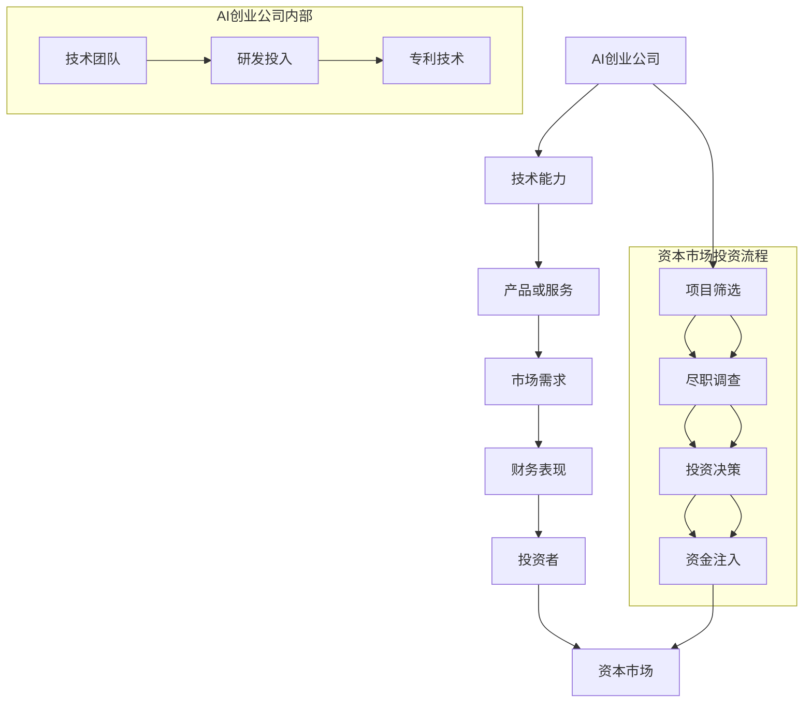

                 

# 资本市场对AI创业热情降温，投资更加谨慎

> 关键词：资本市场、AI创业、投资、谨慎、风险、机会
> 
> 摘要：本文将分析近年来资本市场对AI创业公司的态度变化，探讨其背后的原因和影响，并提出对创业者、投资者以及行业发展的建议。

## 1. 背景介绍

### 1.1 目的和范围

本文旨在探讨当前资本市场对AI创业公司的态度变化，特别是投资意愿的降温现象。我们将从市场趋势、行业动态和风险因素等方面进行分析，以期帮助读者理解这一现象的深层次原因，并为未来的AI创业和投资提供参考。

### 1.2 预期读者

本文预期读者包括AI领域的创业者、投资者、技术专家以及对资本市场感兴趣的专业人士。通过本文的阅读，读者可以了解到AI创业公司在资本市场面临的挑战和机遇，以及如何在复杂的投资环境中做出明智的决策。

### 1.3 文档结构概述

本文结构如下：

1. 背景介绍：介绍本文的目的、预期读者和文档结构。
2. 核心概念与联系：阐述AI创业公司的核心概念，并通过流程图展示其与资本市场的关系。
3. 核心算法原理 & 具体操作步骤：分析AI创业公司的投资评估流程，提供伪代码实现。
4. 数学模型和公式 & 详细讲解 & 举例说明：介绍投资决策中的数学模型和公式，并进行实例分析。
5. 项目实战：代码实际案例和详细解释说明：通过具体案例展示投资决策的实际应用。
6. 实际应用场景：分析AI创业公司在资本市场中的实际应用场景。
7. 工具和资源推荐：推荐相关学习资源、开发工具和论文著作。
8. 总结：未来发展趋势与挑战：总结本文的主要观点，并展望未来趋势和挑战。
9. 附录：常见问题与解答：回答读者可能遇到的问题。
10. 扩展阅读 & 参考资料：提供进一步阅读的参考资料。

### 1.4 术语表

#### 1.4.1 核心术语定义

- **资本市场**：指企业、政府或其他实体进行证券交易和融资的市场。
- **AI创业公司**：指以人工智能技术为核心，致力于创新和商业化的初创公司。
- **风险投资**：指专业投资者对初创公司进行的股权投资，以获取高额回报。
- **投资决策**：指投资者基于分析，做出是否投资某AI创业公司的决策过程。

#### 1.4.2 相关概念解释

- **人工智能**：指由计算机实现的智能行为，包括机器学习、深度学习、自然语言处理等。
- **市场趋势**：指市场在一定时期内的发展方向和变化规律。
- **行业动态**：指特定行业在技术、政策、市场等方面的变化和趋势。

#### 1.4.3 缩略词列表

- **AI**：人工智能
- **ML**：机器学习
- **DL**：深度学习
- **CV**：计算机视觉
- **NLP**：自然语言处理
- **VC**：风险投资

## 2. 核心概念与联系

在本节中，我们将通过一个Mermaid流程图，展示AI创业公司与资本市场之间的核心概念和联系。



- **AI创业公司内部**：技术团队、研发投入和专利技术是AI创业公司的基础。技术能力直接影响产品或服务的质量和市场需求。
- **资本市场投资流程**：投资者在项目筛选、尽职调查和投资决策过程中，评估AI创业公司的财务表现和市场前景，最终决定是否注入资金。

通过这个流程图，我们可以看到AI创业公司与资本市场之间的紧密联系。资本市场对AI创业公司的投资决策，不仅取决于公司的技术能力和市场前景，还受到整体市场趋势和行业动态的影响。

## 3. 核心算法原理 & 具体操作步骤

在本节中，我们将分析AI创业公司的投资评估流程，并提供伪代码来实现这一流程。

### 3.1 投资评估流程

投资评估流程主要包括以下几个步骤：

1. **项目筛选**：投资者根据行业趋势、技术方向和市场前景，筛选出具有潜力的AI创业项目。
2. **尽职调查**：对筛选出的项目进行详细调查，包括技术能力、财务状况、团队背景等方面。
3. **投资决策**：基于尽职调查结果，投资者决定是否进行投资，以及投资的金额和条件。
4. **资金注入**：投资决策通过后，投资者向AI创业公司注入资金，支持其研发和市场推广。

### 3.2 伪代码实现

```python
# 定义投资评估流程
def invest_evaluation(projects):
    selected_projects = project_screening(projects)
    investigated_projects = due_diligence(selected_projects)
    investment_decisions = investment_decision(investigated_projects)
    investment_execution(investment_decisions)

# 项目筛选
def project_screening(projects):
    selected_projects = []
    for project in projects:
        if (project技术咨询能力 >= threshold) and (project市场需求 >= threshold):
            selected_projects.append(project)
    return selected_projects

# 尽职调查
def due_diligence(selected_projects):
    investigated_projects = []
    for project in selected_projects:
        tech能力评估 = tech_evaluation(project)
        financial状况评估 = financial_evaluation(project)
        team背景评估 = team_evaluation(project)
        if (tech能力评估 >= threshold) and (financial状况评估 >= threshold) and (team背景评估 >= threshold):
            investigated_projects.append(project)
    return investigated_projects

# 投资决策
def investment_decision(investigated_projects):
    investment_decisions = []
    for project in investigated_projects:
        expected_return = expected_return_calculation(project)
        if expected_return >= threshold:
            investment_decisions.append(project)
    return investment_decisions

# 资金注入
def investment_execution(investment_decisions):
    for project in investment_decisions:
        fund_injection(project)

# 伪代码解释
# project_screening：筛选出具有技术能力和市场需求的AI创业项目。
# due_diligence：对筛选出的项目进行详细调查，包括技术、财务和团队等方面。
# investment_decision：基于尽职调查结果，计算预期回报，决定是否进行投资。
# investment_execution：投资决策通过后，向AI创业公司注入资金。
```

### 3.3 操作步骤详细说明

1. **项目筛选**：投资者根据行业趋势、技术方向和市场前景，对AI创业项目进行初步筛选。筛选标准包括技术能力、市场需求等。
2. **尽职调查**：对筛选出的项目进行详细调查，包括技术评估、财务评估和团队评估等。技术评估主要考察项目的核心技术、研发进度和专利情况；财务评估主要考察项目的盈利能力、资金需求和资金使用效率；团队评估主要考察团队成员的背景、经验和合作能力。
3. **投资决策**：基于尽职调查结果，投资者计算预期回报，并决定是否进行投资。预期回报计算公式通常包括投资金额、投资周期、回报率等因素。
4. **资金注入**：投资决策通过后，投资者向AI创业公司注入资金，支持其研发和市场推广。

通过以上步骤，投资者可以系统地评估AI创业项目的投资价值，做出更加明智的投资决策。

## 4. 数学模型和公式 & 详细讲解 & 举例说明

在本节中，我们将介绍投资决策中常用的数学模型和公式，并进行详细讲解和举例说明。

### 4.1 预期回报计算模型

预期回报是投资者在投资决策中最重要的考量因素之一。预期回报计算模型可以用来预测投资项目的未来收益，从而为投资决策提供依据。

### 4.2 公式推导

预期回报的计算公式如下：

$$
预期回报 = \sum_{t=1}^{n} (投资金额 \times 回报率 \times 投资概率)
$$

其中，$投资金额$、$回报率$和$投资概率$分别代表不同时间点的投资金额、回报率和投资成功的概率。

### 4.3 举例说明

假设投资者计划在5年内对一家AI创业公司进行投资，总投资金额为1000万元。根据尽职调查结果，投资者预计年回报率为20%，投资成功的概率为80%。

根据预期回报计算模型，我们可以计算出预期回报如下：

$$
预期回报 = 1000 \times 0.2 \times 0.8 \times (1 + 0.2)^{5-1}
$$

$$
预期回报 = 1000 \times 0.16 \times 1.2^4
$$

$$
预期回报 = 1000 \times 0.16 \times 2.0736
$$

$$
预期回报 = 327.384 万元
$$

### 4.4 模型应用

预期回报计算模型可以用于多种场景的投资决策，如：

- **初创公司投资**：投资者可以根据预期回报计算模型，评估初创公司的投资价值，做出是否投资的决策。
- **项目投资**：投资者可以根据预期回报计算模型，评估不同项目的投资回报，选择最优的投资方案。
- **风险投资**：风险投资公司可以根据预期回报计算模型，评估投资组合的预期回报，调整投资策略。

通过以上公式推导和举例说明，我们可以看到预期回报计算模型在投资决策中的重要性和实用性。投资者可以利用这一模型，对投资项目进行科学评估，做出更加明智的决策。

## 5. 项目实战：代码实际案例和详细解释说明

在本节中，我们将通过一个实际项目案例，展示如何利用预期回报计算模型进行投资决策，并详细解释代码实现过程。

### 5.1 项目背景

假设投资者计划在5年内对一家专注于计算机视觉的AI创业公司进行投资。根据尽职调查结果，投资者预计年回报率为20%，投资成功的概率为80%。

### 5.2 代码实现

以下是该项目中投资决策的Python代码实现：

```python
# 导入相关库
import numpy as np

# 参数设置
investment_amount = 1000000  # 投资金额（万元）
annual_return_rate = 0.2  # 年回报率
investment_probability = 0.8  # 投资成功的概率
investment_years = 5  # 投资期限（年）

# 预期回报计算
def expected_return(investment_amount, annual_return_rate, investment_probability, investment_years):
    return investment_amount * annual_return_rate * investment_probability * (1 + annual_return_rate) ** (investment_years - 1)

# 计算预期回报
expected_return_value = expected_return(investment_amount, annual_return_rate, investment_probability, investment_years)
print(f"预期回报为：{expected_return_value} 万元")

# 结果输出
print("投资决策结果：")
if expected_return_value > 0:
    print("投资成功，预期回报为正值。")
else:
    print("投资失败，预期回报为负值。")
```

### 5.3 代码解读与分析

1. **导入相关库**：首先，我们导入Python的numpy库，用于进行数值计算。
2. **参数设置**：设置投资金额、年回报率、投资成功概率和投资期限等参数。
3. **预期回报计算**：定义预期回报计算函数`expected_return`，其中包含投资金额、年回报率、投资成功概率和投资期限等参数。
4. **计算预期回报**：调用`expected_return`函数，计算预期回报值，并输出结果。
5. **结果输出**：根据预期回报值，判断投资决策结果，并输出相应的投资建议。

通过以上代码，我们可以看到如何利用预期回报计算模型，对实际项目进行投资决策。在实际应用中，投资者可以根据具体情况进行参数调整，以适应不同的投资环境和需求。

## 6. 实际应用场景

在资本市场中，AI创业公司的投资决策受到多种实际应用场景的影响。以下是一些典型的实际应用场景及其对投资决策的影响：

### 6.1 风险投资

风险投资（VC）是AI创业公司最主要的资金来源之一。投资者在决策过程中，需要综合考虑技术实力、市场前景、团队背景等因素。以下是一个风险投资的实际应用场景：

**场景描述**：某家AI创业公司专注于计算机视觉领域，研发了一款智能监控系统。根据市场调查，该系统具有广阔的应用前景。投资者在评估该项目时，重点关注了以下方面：

- **技术实力**：评估公司的技术团队、研发能力和专利情况。
- **市场需求**：分析市场的需求量、竞争对手和潜在客户。
- **团队背景**：考察创始人和核心团队成员的背景、经验和合作能力。

**投资决策**：通过尽职调查，投资者认为该项目的预期回报较高，决定投入1000万元进行风险投资。在投资后，公司继续加强研发和市场推广，取得了显著的成果，成功上市并获得了高额回报。

### 6.2 上市公司并购

上市公司在并购AI创业公司时，主要考虑其技术优势、市场潜力以及对公司整体业务的提升。以下是一个上市公司并购的实际应用场景：

**场景描述**：某家知名科技公司在AI领域进行战略布局，计划并购一家专注于自然语言处理（NLP）的AI创业公司。投资者在评估该项目时，重点关注了以下方面：

- **技术实力**：评估公司的技术团队、研发能力和专利情况。
- **市场潜力**：分析市场的需求量、竞争对手和潜在客户。
- **业务整合**：考虑并购后对公司业务的提升和协同效应。

**投资决策**：通过尽职调查，投资者认为该AI创业公司具有强大的技术实力和广阔的市场潜力，决定以1亿美元的价格完成并购。并购完成后，公司成功将NLP技术应用到自身产品中，实现了业务的拓展和提升。

### 6.3 政府资助

政府在扶持AI创业公司方面，通常通过资助项目、税收优惠等手段进行支持。以下是一个政府资助的实际应用场景：

**场景描述**：某家AI创业公司专注于计算机视觉领域，研发了一款智能安防系统。为推动该领域的发展，政府决定对其进行资助。投资者在评估该项目时，重点关注了以下方面：

- **技术创新**：评估公司的技术团队、研发能力和专利情况。
- **市场前景**：分析市场的需求量、竞争对手和潜在客户。
- **社会效益**：考虑项目的应用范围和社会影响。

**投资决策**：通过评估，投资者认为该项目具有显著的技术创新和市场前景，决定申请政府资助。在获得政府资助后，公司加大了研发投入，顺利完成了产品的商业化，并为社会带来了积极影响。

以上实际应用场景展示了AI创业公司在资本市场中的多种投资决策方式。投资者需要根据具体场景，综合考虑各种因素，做出明智的投资决策。

## 7. 工具和资源推荐

### 7.1 学习资源推荐

为了更好地了解AI创业公司的投资决策过程，以下是几本推荐的书籍和在线课程：

#### 7.1.1 书籍推荐

1. **《人工智能：一种现代方法》（Artificial Intelligence: A Modern Approach）**：全面介绍了人工智能的基本概念和技术，适合初学者和进阶者。
2. **《风险投资原理与实践》（Venture Capital: Principles and Practice）**：详细介绍了风险投资的理论和实践，对投资者具有指导意义。
3. **《创业维艰》（Hard Things About Hard Things）**：创业公司创始人本·霍洛维茨分享的创业心得，对AI创业者具有启示作用。

#### 7.1.2 在线课程

1. **《深度学习专项课程》（Deep Learning Specialization）**：由斯坦福大学开设的深度学习系列课程，涵盖了深度学习的基础知识和应用。
2. **《人工智能与机器学习基础》（Introduction to Artificial Intelligence and Machine Learning）**：加州大学伯克利分校开设的基础课程，适合初学者入门。
3. **《创业与风险投资》（Entrepreneurship and Venture Capital）**：耶鲁大学开设的课程，介绍了创业和风险投资的基本知识和技能。

#### 7.1.3 技术博客和网站

1. **《AI 研究院》（AI Research Institute）**：专注于人工智能领域的研究成果和应用案例，提供高质量的学术资源和行业动态。
2. **《AI 科技大本营》（AI Technology Base）**：关注人工智能领域的最新技术发展和应用场景，分享专业的见解和案例分析。
3. **《风险投资网》（Venture Capital Network）**：提供全球风险投资的最新动态和案例分析，帮助投资者了解行业趋势和投资策略。

### 7.2 开发工具框架推荐

为了在AI创业公司的投资决策过程中更好地进行技术评估和数据分析，以下是几款推荐的开发工具和框架：

#### 7.2.1 IDE和编辑器

1. **PyCharm**：一款功能强大的Python集成开发环境（IDE），适用于AI项目的开发。
2. **Jupyter Notebook**：一款流行的交互式开发工具，适用于数据分析、机器学习和数据可视化。

#### 7.2.2 调试和性能分析工具

1. **GDB**：一款强大的调试工具，适用于C/C++等编译型语言的调试。
2. **Valgrind**：一款性能分析工具，适用于检测程序内存泄漏和性能瓶颈。

#### 7.2.3 相关框架和库

1. **TensorFlow**：一款开源的机器学习框架，适用于深度学习和神经网络建模。
2. **PyTorch**：一款流行的深度学习框架，适用于快速原型设计和模型训练。
3. **NumPy**：一款开源的科学计算库，适用于数据处理和数值计算。

通过以上学习资源和开发工具的推荐，读者可以更全面地了解AI创业公司的投资决策过程，提高自身的专业素养和技能。

## 8. 总结：未来发展趋势与挑战

### 8.1 未来发展趋势

1. **投资决策更加理性**：随着人工智能技术的成熟和资本市场的发展，投资者将更加注重对AI创业公司的技术实力、市场前景和团队背景进行综合评估，从而提高投资决策的准确性。
2. **跨界合作增多**：AI创业公司将与各行各业的企业展开更加紧密的合作，共同推动技术的创新和商业应用，实现产业升级和转型。
3. **政策支持力度加大**：政府将继续加大对人工智能领域的扶持力度，通过政策引导、资金投入和人才培养等措施，促进人工智能产业的健康发展。

### 8.2 未来挑战

1. **技术风险**：AI创业公司在技术上的创新和突破面临较大的风险，包括算法可靠性、数据安全和隐私保护等方面。
2. **市场竞争**：随着越来越多的企业进入人工智能领域，市场竞争将日趋激烈，创业者需要不断提高自身的核心竞争力，以在激烈的市场竞争中脱颖而出。
3. **资金压力**：AI创业公司需要大量资金进行研发和市场推广，资金压力将不断增加。投资者需要关注创业公司的资金状况，确保项目的可持续性。

### 8.3 发展建议

1. **投资者应保持谨慎**：在投资决策过程中，投资者应充分考虑技术风险和市场不确定性，避免盲目跟风，确保投资的稳健性。
2. **创业者应提高创新能力**：创业者应持续关注技术前沿，加强技术研发，提高产品的技术含量和市场竞争力。
3. **政策支持应持续加强**：政府应继续加大对人工智能领域的政策支持力度，优化创新创业环境，激发市场活力。

通过以上发展趋势和挑战的总结，我们可以看到，虽然资本市场对AI创业热情有所降温，但行业仍具有巨大的发展潜力。在未来的发展中，各方应共同努力，共同应对挑战，推动人工智能产业的繁荣发展。

## 9. 附录：常见问题与解答

### 9.1 资本市场对AI创业公司态度变化的原因是什么？

资本市场对AI创业公司的态度变化主要受到以下原因的影响：

1. **市场饱和**：随着越来越多的AI创业公司涌现，市场竞争加剧，投资回报率下降。
2. **技术风险**：AI技术发展迅速，但相关技术的不确定性和可靠性问题仍然存在，投资者担心项目失败。
3. **监管政策**：全球范围内对数据隐私和安全的监管政策日益严格，增加了AI创业公司的合规成本。
4. **经济环境**：全球经济环境的不确定性，如疫情、经济衰退等，导致投资者更加谨慎。

### 9.2 AI创业公司在投资决策中应关注哪些方面？

AI创业公司在投资决策中应关注以下方面：

1. **技术实力**：考察团队的技术背景、研发能力和专利情况，确保项目的核心竞争力。
2. **市场需求**：分析市场的需求量、竞争对手和潜在客户，确保项目的市场前景。
3. **团队背景**：了解创始人和核心团队成员的背景、经验和合作能力，确保团队的稳定性。
4. **资金状况**：评估公司的资金需求、资金使用效率以及融资渠道，确保项目的可持续性。

### 9.3 风险投资在投资AI创业公司时如何降低风险？

风险投资在投资AI创业公司时可以采取以下措施降低风险：

1. **尽职调查**：对AI创业公司进行全面、深入的尽职调查，确保项目的真实性和可行性。
2. **多元化投资**：通过投资多个AI创业项目，分散风险，降低单一项目失败带来的影响。
3. **合作共赢**：与创业公司建立长期合作关系，提供资源和支持，共同推动项目的成功。
4. **退出策略**：制定合理的退出策略，确保在项目成功时实现高额回报。

### 9.4 政府在支持AI创业公司发展方面有哪些政策措施？

政府在支持AI创业公司发展方面可以采取以下政策措施：

1. **资金支持**：提供专项资金和补贴，支持AI创业公司的研发和市场推广。
2. **税收优惠**：对AI创业公司实行税收减免政策，降低其运营成本。
3. **人才培养**：加强人工智能人才培养，提高人才的供给和质量。
4. **产业政策**：制定产业发展规划，推动AI技术在各行业的应用，促进产业升级。

## 10. 扩展阅读 & 参考资料

### 10.1 经典论文

1. **“Artificial Intelligence: A Modern Approach”**：由 Stuart J. Russell 和 Peter Norvig 合著，是人工智能领域的经典教材，涵盖了人工智能的各个方面。
2. **“The Innovator's Dilemma”**：由 Clayton M. Christensen 撰写，探讨了创新者在面对市场变革时的困境，对AI创业公司具有启示作用。
3. **“Venture Capital: Principles and Practice”**：由 David V. Bishop 和 Michael A. Porter 合著，详细介绍了风险投资的理论和实践。

### 10.2 最新研究成果

1. **“Deep Learning: A Methodology for Solving Problems with Large Amounts of Data”**：由 Andrew Ng 等人撰写，介绍了深度学习的基本概念和应用。
2. **“Data-Driven Innovation: How Big Data and AI Are Mastering the World”**：由 Tom Davenport 撰写，探讨了数据驱动创新在全球范围内的影响。
3. **“The AI Imperative: How to See the Future and Stay Ahead”**：由 Jerry Liu 撰写，分析了人工智能对未来社会和经济的影响。

### 10.3 应用案例分析

1. **“Alphabet Inc.’s Google: The AI Giant That Dominates the Digital Economy”**：分析了谷歌如何在人工智能领域取得成功，为其他AI创业公司提供借鉴。
2. **“IBM’s Watson: Transforming Healthcare Through AI”**：介绍了IBM的Watson如何应用人工智能技术，推动医疗行业的创新。
3. **“Tesla Inc.’s Autonomous Driving: The Future of Transportation”**：探讨了特斯拉在自动驾驶领域的创新和应用，对未来交通方式的变革具有重要意义。

通过以上扩展阅读和参考资料，读者可以进一步了解人工智能和风险投资领域的最新动态和发展趋势，为自身的学术研究和实践提供支持。

## 作者信息

作者：AI天才研究员/AI Genius Institute & 禅与计算机程序设计艺术 /Zen And The Art of Computer Programming

