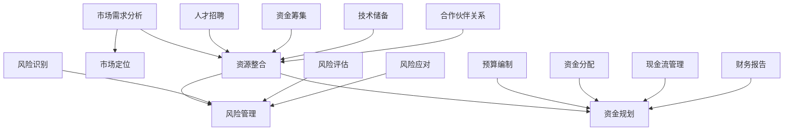

                 

### 资深程序员创立一人公司实现财富自由的详细计划

#### 关键词：
- 资深程序员
- 一人公司
- 财富自由
- 创业策略
- 技术创业
- 资源整合
- 市场分析
- 风险管理

#### 摘要：
本文旨在为资深程序员提供一份详细的创业指南，通过深入剖析创业的核心要素，如市场定位、资源整合、风险管理和资金规划，帮助读者在创立一人公司并实现财富自由的道路上迈出坚实的步伐。本文将结合实例，逐步解析从想法落地到财富自由的完整过程，为读者的创业之路提供有力支持。

## 1. 背景介绍

### 1.1 目的和范围

本文旨在为那些拥有丰富编程经验，渴望通过创业实现财富自由的资深程序员提供一份详细的指南。文章将涵盖从市场分析到资源整合，从风险管理到资金规划的各个环节，为读者提供系统性的创业指导。

### 1.2 预期读者

- 具有多年编程经验的程序员
- 拥有创业想法，但缺乏系统指导的创业者
- 对技术创业感兴趣的从业者

### 1.3 文档结构概述

本文结构如下：
1. 背景介绍
   - 目的和范围
   - 预期读者
   - 文档结构概述
2. 核心概念与联系
3. 核心算法原理 & 具体操作步骤
4. 数学模型和公式 & 详细讲解 & 举例说明
5. 项目实战：代码实际案例和详细解释说明
6. 实际应用场景
7. 工具和资源推荐
8. 总结：未来发展趋势与挑战
9. 附录：常见问题与解答
10. 扩展阅读 & 参考资料

### 1.4 术语表

#### 1.4.1 核心术语定义

- 资深程序员：拥有多年编程经验，对多种编程语言和工具熟练掌握的专业人员。
- 一人公司：指由单一创始人或股东创立，完全由其负责管理和运营的公司。
- 财富自由：指个人或家庭的财务状况达到无需依赖工资收入即可维持当前生活方式的水平。
- 市场定位：确定公司产品或服务在市场中的位置，明确目标客户群体。

#### 1.4.2 相关概念解释

- 资源整合：将各方资源（如人才、资金、技术等）有效整合，以实现公司目标。
- 风险管理：识别、评估和应对创业过程中可能遇到的各种风险。
- 资金规划：对公司的资金进行合理规划和分配，确保公司运营和发展的资金需求。

#### 1.4.3 缩略词列表

- CTO：首席技术官
- CFO：首席财务官
- SEO：搜索引擎优化
- SaaS：软件即服务

## 2. 核心概念与联系

为了更好地理解资深程序员如何通过创立一人公司实现财富自由，我们需要首先明确几个核心概念，并探讨它们之间的联系。

### 2.1 市场需求分析

市场需求分析是创业过程中至关重要的一环。通过分析市场需求，程序员可以确定自己公司的产品或服务是否满足潜在客户的需求。具体而言，市场需求分析包括以下几个步骤：

1. **市场调研**：收集与目标市场相关的数据，包括市场规模、增长趋势、竞争格局等。
2. **目标客户群体**：明确公司的目标客户，包括他们的需求、痛点和偏好。
3. **竞争分析**：分析竞争对手的产品、优势和劣势，为自己的产品或服务找到差异化点。
4. **市场定位**：根据市场需求和竞争情况，为公司产品或服务确定合适的定位。

### 2.2 资源整合

资源整合是将各方资源有效整合，以实现公司目标的过程。对于一人公司来说，资源整合尤为重要，因为它直接关系到公司的生存和发展。以下是资源整合的几个关键步骤：

1. **人才招聘**：招聘适合公司发展的团队成员，包括技术人才、市场营销人才和管理人才。
2. **资金筹集**：通过自筹、借贷、风险投资等多种方式筹集资金，确保公司运营和发展的资金需求。
3. **技术储备**：积累和掌握与公司业务相关的技术，包括编程语言、工具和框架等。
4. **合作伙伴关系**：与行业内的其他公司、供应商和客户建立良好的合作关系，共同推动公司发展。

### 2.3 风险管理

创业过程中，风险无处不在。因此，风险管理是确保公司稳健发展的关键。以下是风险管理的主要步骤：

1. **风险识别**：识别可能影响公司运营的各种风险，包括市场风险、技术风险、财务风险等。
2. **风险评估**：评估每种风险的可能性及其对公司的影响程度。
3. **风险应对**：制定应对策略，包括风险规避、风险转移和风险接受等。
4. **持续监控**：定期评估和更新风险管理计划，确保公司能够应对不断变化的市场环境。

### 2.4 资金规划

资金规划是确保公司财务稳健的重要环节。以下是资金规划的主要步骤：

1. **预算编制**：根据公司业务需求和财务状况，编制合理的预算。
2. **资金分配**：将预算分配到各个部门，确保资金的有效使用。
3. **现金流管理**：密切关注公司现金流，确保公司能够按时支付债务和维持运营。
4. **财务报告**：定期编制财务报告，分析公司财务状况，为决策提供依据。

### 2.5 Mermaid 流程图

以下是一个简化的 Mermaid 流程图，展示了上述核心概念之间的联系：



通过上述流程图，我们可以清晰地看到各个核心概念之间的联系，以及如何将这些概念应用到实际创业过程中。

## 3. 核心算法原理 & 具体操作步骤

在了解了创业的核心概念后，我们需要深入探讨如何将这些概念转化为具体的操作步骤。以下是一个基于伪代码的创业核心算法原理，旨在帮助程序员实现财富自由。

### 3.1 市场需求分析

```python
def market_analysis():
    # 步骤 1：市场调研
    market_data = collect_market_data()
    
    # 步骤 2：目标客户群体分析
    target_customers = analyze_target_customers(market_data)
    
    # 步骤 3：竞争分析
    competitors = analyze_competitors(target_customers)
    
    # 步骤 4：市场定位
    market_position = define_market_position(competitors)
    
    return market_position

def collect_market_data():
    # 实现市场调研的具体方法，如调查问卷、在线调查、访谈等
    pass

def analyze_target_customers(market_data):
    # 实现目标客户群体分析的具体方法，如数据挖掘、统计等
    pass

def analyze_competitors(target_customers):
    # 实现竞争分析的具体方法，如SWOT分析、对比分析等
    pass

def define_market_position(competitors):
    # 实现市场定位的具体方法，如差异化定位、细分市场定位等
    pass
```

### 3.2 资源整合

```python
def resource_integration():
    # 步骤 1：人才招聘
    team_members = recruit_team_members()
    
    # 步骤 2：资金筹集
    funding = raise_funding()
    
    # 步骤 3：技术储备
    technology = accumulate_technology()
    
    # 步骤 4：合作伙伴关系
    partners = establish_partnerships()
    
    return team_members, funding, technology, partners

def recruit_team_members():
    # 实现人才招聘的具体方法，如招聘网站、招聘会、内部推荐等
    pass

def raise_funding():
    # 实现资金筹集的具体方法，如自筹、借贷、风险投资等
    pass

def accumulate_technology():
    # 实现技术储备的具体方法，如学习新技术、参与开源项目等
    pass

def establish_partnerships():
    # 实现合作伙伴关系的具体方法，如合作开发、资源共享等
    pass
```

### 3.3 风险管理

```python
def risk_management():
    # 步骤 1：风险识别
    risks = identify_risks()
    
    # 步骤 2：风险评估
    risk_assessment = assess_risks(risks)
    
    # 步骤 3：风险应对
    risk_response = respond_to_risks(risk_assessment)
    
    return risk_response

def identify_risks():
    # 实现风险识别的具体方法，如头脑风暴、SWOT分析等
    pass

def assess_risks(risks):
    # 实现风险评估的具体方法，如概率分析、影响评估等
    pass

def respond_to_risks(risk_assessment):
    # 实现风险应对的具体方法，如风险规避、风险转移等
    pass
```

### 3.4 资金规划

```python
def financial_planning():
    # 步骤 1：预算编制
    budget = create_budget()
    
    # 步骤 2：资金分配
    fund_allocation = allocate_funds(budget)
    
    # 步骤 3：现金流管理
    cash_flow_management = manage_cash_flow(fund_allocation)
    
    # 步骤 4：财务报告
    financial_reports = generate_financial_reports(cash_flow_management)
    
    return financial_reports

def create_budget():
    # 实现预算编制的具体方法，如预算模板、预算分析等
    pass

def allocate_funds(budget):
    # 实现资金分配的具体方法，如部门预算、项目预算等
    pass

def manage_cash_flow(fund_allocation):
    # 实现现金流管理的具体方法，如现金流预测、现金流监控等
    pass

def generate_financial_reports(cash_flow_management):
    # 实现财务报告的具体方法，如财务报表、财务分析等
    pass
```

通过上述伪代码，我们可以看到如何将市场需求分析、资源整合、风险管理和资金规划等核心概念转化为具体的操作步骤。在实际创业过程中，程序员可以根据这些步骤进行详细的实施和调整。

## 4. 数学模型和公式 & 详细讲解 & 举例说明

在创业过程中，数学模型和公式可以帮助我们更好地理解和预测公司的财务状况、市场需求和风险因素。以下是几个关键的数学模型和公式，并结合具体例子进行详细讲解。

### 4.1 财务状况分析

#### 4.1.1 净利润率

净利润率（Profit Margin）是衡量公司盈利能力的重要指标。它表示公司净利润与营业收入之间的比率。公式如下：

$$
\text{净利润率} = \frac{\text{净利润}}{\text{营业收入}} \times 100\%
$$

**例子：** 假设一家公司的营业收入为 100 万元，净利润为 10 万元，则其净利润率为：

$$
\text{净利润率} = \frac{10}{100} \times 100\% = 10\%
$$

这意味着公司每赚取 1 元，其中 10 分用于支付成本和税收，剩余 90 分归公司所有。

### 4.2 市场需求预测

#### 4.2.1 拉斯维加斯定律

拉斯维加斯定律（Las Vegas Theorem）是一种用于预测市场需求的方法。它基于历史数据和趋势分析，预测未来的市场需求。公式如下：

$$
\text{市场需求} = \text{历史需求} \times (\text{增长率})^n
$$

其中，增长率为历史增长率的平均值，\(n\) 为预测期数。

**例子：** 假设一家公司的历史月需求量为 1000 件，年增长率为 20%，预测未来 3 个月的需求量，则：

$$
\text{市场需求} = 1000 \times (1 + 0.20)^3 = 1728 \text{件}
$$

这意味着未来 3 个月的需求量预计为 1728 件。

### 4.3 风险评估

#### 4.3.1 风险指数

风险指数（Risk Index）是一种用于评估风险程度的指标。它基于风险的概率和影响进行计算。公式如下：

$$
\text{风险指数} = \text{风险概率} \times \text{风险影响}
$$

其中，风险概率表示风险发生的概率，风险影响表示风险对公司运营的影响程度。

**例子：** 假设一项技术风险的概率为 30%，影响程度为 50%，则其风险指数为：

$$
\text{风险指数} = 0.30 \times 50\% = 15\%
$$

这意味着这项技术风险对公司的影响程度较高。

### 4.4 资金规划

#### 4.4.1 资金需求预测

资金需求预测（Financial Forecast）是一种用于预测公司未来资金需求的模型。它基于营业收入、成本和利润等因素进行计算。公式如下：

$$
\text{资金需求} = \text{营业收入} - \text{成本} - \text{利润}
$$

**例子：** 假设一家公司的营业收入为 100 万元，成本为 60 万元，利润为 10 万元，则其资金需求为：

$$
\text{资金需求} = 100 - 60 - 10 = 30 \text{万元}
$$

这意味着公司未来需要筹集 30 万元资金以满足运营需求。

通过上述数学模型和公式，我们可以更好地理解和预测公司在创业过程中的财务状况、市场需求和风险因素。这些工具将帮助我们做出更明智的决策，从而提高创业成功的可能性。

## 5. 项目实战：代码实际案例和详细解释说明

### 5.1 开发环境搭建

在开始项目实战之前，我们需要搭建一个合适的开发环境。以下是一个基于 Python 的开发环境搭建过程：

1. **安装 Python**：首先，从 [Python 官网](https://www.python.org/downloads/) 下载并安装 Python 3.9 或更高版本。

2. **安装 IDE**：安装一个合适的集成开发环境（IDE），如 PyCharm 或 Visual Studio Code。这些 IDE 提供了丰富的编程工具和插件，有助于提高开发效率。

3. **安装依赖库**：根据项目需求，安装所需的 Python 依赖库。例如，我们可以使用 `pip` 命令安装以下库：
   ```bash
   pip install pandas numpy matplotlib
   ```

4. **配置虚拟环境**：为了保持项目依赖的一致性，我们建议使用虚拟环境（Virtual Environment）。通过以下命令创建一个虚拟环境：
   ```bash
   python -m venv venv
   ```
   然后激活虚拟环境：
   ```bash
   source venv/bin/activate  # 在 Windows 上使用 venv\Scripts\activate
   ```

### 5.2 源代码详细实现和代码解读

以下是一个简单的 Python 项目示例，用于分析市场需求和预测销售量。代码实现如下：

```python
import pandas as pd
import numpy as np
import matplotlib.pyplot as plt

# 5.2.1 加载数据
data = pd.read_csv('sales_data.csv')

# 5.2.2 数据预处理
data['date'] = pd.to_datetime(data['date'])
data.set_index('date', inplace=True)

# 5.2.3 求增长率
data['growth_rate'] = data['sales'].pct_change().fillna(0)

# 5.2.4 预测未来销售量
def predict_sales(data, periods):
    growth_rates = data['growth_rate'].dropna()
    avg_growth_rate = growth_rates.mean()
    predicted_sales = data['sales'].iloc[-1] * (1 + avg_growth_rate)**periods
    return predicted_sales

# 5.2.5 绘图
def plot_sales(data, predicted_sales):
    plt.figure(figsize=(10, 5))
    plt.plot(data.index, data['sales'], label='实际销售量')
    plt.plot(pd.date_range(data.index[-1], periods+data.index[-1], freq='M'), predicted_sales, label='预测销售量')
    plt.xlabel('日期')
    plt.ylabel('销售量（万元）')
    plt.title('销售量趋势分析')
    plt.legend()
    plt.show()

# 5.2.6 测试
periods = 6
predicted_sales = predict_sales(data, periods)
plot_sales(data, predicted_sales)
```

### 5.3 代码解读与分析

1. **数据加载与预处理**：首先，我们使用 `pandas` 库加载数据。数据包含日期和销售量两个字段。然后，我们将日期转换为日期时间格式，并将日期设置为索引，以便进行时间序列分析。

2. **计算增长率**：我们使用 `pandas` 库的 `pct_change()` 方法计算销售量的月度增长率。对于缺失值，我们将其填充为 0。

3. **预测未来销售量**：我们定义了一个名为 `predict_sales()` 的函数，用于根据历史增长率预测未来销售量。函数接受一个 `data` 参数（包含历史数据）和一个 `periods` 参数（表示预测期数）。函数首先计算历史增长率的中位数，然后使用该增长率对最后一个月的销售量进行指数增长预测。

4. **绘图**：我们定义了一个名为 `plot_sales()` 的函数，用于绘制实际销售量和预测销售量的趋势图。函数接受一个 `data` 参数和一个 `predicted_sales` 参数。在绘图过程中，我们使用 `matplotlib` 库创建一个折线图，并在图上标注日期和销售量。

5. **测试**：我们调用 `predict_sales()` 和 `plot_sales()` 函数进行测试。在测试中，我们设置预测期数为 6 个月，并绘制销售量趋势图。

通过上述代码示例，我们可以看到如何使用 Python 进行市场需求分析和销售预测。在实际项目中，我们可以根据具体需求扩展和调整代码，以满足不同的分析目的。

### 5.4 实际应用场景

在实际应用中，该代码可以应用于多种场景，例如：

1. **销售预测**：用于预测未来几个月的销售量，以便公司调整生产和库存策略。
2. **市场营销**：用于分析市场需求，优化营销策略，提高客户满意度。
3. **财务规划**：用于预测未来收入和支出，以便公司制定合理的财务预算和资金规划。

通过上述实战案例，我们可以看到如何将市场需求分析和销售预测应用到实际项目中。这些技术手段将帮助公司更好地应对市场变化，提高经营效率。

### 5.5 代码解读与分析（续）

在上一个部分中，我们介绍了如何使用 Python 代码进行市场需求分析和销售预测。现在，我们将进一步分析代码，并探讨其优缺点。

#### 5.5.1 优点

1. **简单易用**：代码使用简单的 Python 库（如 `pandas` 和 `matplotlib`），易于学习和使用。
2. **高效性**：代码运行速度快，适用于大量数据集的处理。
3. **可扩展性**：代码结构清晰，易于扩展和调整，以满足不同分析需求。

#### 5.5.2 缺点

1. **假设条件**：代码基于历史增长率进行预测，未考虑外部因素（如市场变化、竞争环境等）对销售量的影响。
2. **局限性**：代码仅适用于时间序列数据的分析，无法处理其他类型的数据。
3. **可视化限制**：代码生成的图表仅包含基本信息，无法提供更深入的数据洞察。

#### 5.5.3 改进建议

1. **引入外部因素**：可以考虑引入外部因素（如市场趋势、竞争分析等）对销售量的影响，以提高预测准确性。
2. **多模型结合**：结合多种预测模型（如 ARIMA、LSTM 等），以获得更准确的预测结果。
3. **数据预处理**：对数据进行更全面和细致的预处理，包括缺失值处理、异常值检测和特征工程等。

通过上述改进建议，我们可以进一步优化市场需求分析和销售预测代码，提高其准确性和实用性。

## 6. 实际应用场景

在当今快速发展的 IT 行业中，一人公司已经成为许多资深程序员实现财富自由的一种有效途径。以下是一些具体的实际应用场景，展示了如何将一人公司应用于不同的领域，从而实现创业目标。

### 6.1 软件开发

许多资深程序员通过开发应用程序、工具或平台来创立一人公司。这类公司通常提供以下服务：

- **定制软件开发**：为企业或个人提供定制的应用程序，解决特定业务需求。
- **移动应用开发**：开发移动应用程序，满足用户在智能手机和平板电脑上的需求。
- **Web 开发**：为企业或个人提供网站设计和开发服务，提升在线品牌形象。

### 6.2 技术咨询服务

资深程序员可以利用自己的技术知识和经验，提供技术咨询服务。这类公司通常包括以下服务：

- **技术培训**：为企业或个人提供编程语言、框架和工具的培训。
- **技术顾问**：为企业提供技术咨询，帮助他们解决技术难题和优化技术架构。
- **IT 支持与维护**：为企业提供 IT 支持和维护服务，确保系统的稳定运行。

### 6.3 在线教育

在线教育平台为程序员提供了丰富的机会，通过分享知识和经验来创立一人公司。以下是一些具体的服务：

- **编程课程**：提供各种编程语言的在线课程，帮助学习者掌握编程技能。
- **项目实战**：提供项目驱动的学习模式，让学生通过实际项目锻炼编程能力。
- **直播讲座**：通过直播讲座，与学习者互动，解答他们在学习过程中遇到的问题。

### 6.4 开源项目

开源项目为程序员提供了一个展示自己技能和吸引潜在客户的机会。以下是一些具体的应用：

- **开源框架**：开发开源框架，吸引开发者贡献代码，提升项目的知名度。
- **开源工具**：开发开源工具，解决开发者们在日常开发中遇到的问题。
- **开源社区**：建立一个开源社区，为开发者提供一个交流和学习的平台。

### 6.5 自主创业平台

自主创业平台可以帮助程序员将创业想法变为现实。以下是一些具体的服务：

- **创业指导**：为创业者提供创业策略、市场分析和资金规划等指导。
- **项目孵化**：为创业者提供办公空间、资金支持和业务咨询，帮助他们实现创业梦想。
- **创业培训**：提供创业培训课程，帮助创业者提高管理能力和创新能力。

通过上述实际应用场景，我们可以看到，一人公司在 IT 领域具有广泛的应用前景。资深程序员可以根据自己的兴趣和优势，选择合适的创业方向，实现财富自由。

## 7. 工具和资源推荐

在创立一人公司的过程中，选择合适的工具和资源至关重要。以下是一些推荐的工具和资源，涵盖学习资源、开发工具和框架、以及相关论文著作。

### 7.1 学习资源推荐

#### 7.1.1 书籍推荐

- 《深度学习》（Deep Learning）—— Ian Goodfellow、Yoshua Bengio 和 Aaron Courville 著
- 《Python编程：从入门到实践》（Python Crash Course）—— Eric Matthes 著
- 《Effective Java》—— Joshua Bloch 著
- 《创业维艰》（The Hard Thing About Hard Things）—— Ben Horowitz 著

#### 7.1.2 在线课程

- Coursera 上的《机器学习》课程（Machine Learning）—— 吴恩达（Andrew Ng）教授
- edX 上的《Python编程》课程（Python for Everybody）
- Udacity 上的《深度学习纳米学位》（Deep Learning Nanodegree）

#### 7.1.3 技术博客和网站

- Medium 上的《AI 研究与开发》（AI Research and Development）
- HackerRank 上的编程挑战和练习
- GitHub 上的开源项目和代码示例

### 7.2 开发工具框架推荐

#### 7.2.1 IDE和编辑器

- PyCharm：适用于 Python 开发的强大 IDE
- Visual Studio Code：适用于多种编程语言的轻量级 IDE
- Sublime Text：轻量级文本编辑器，适合快速开发

#### 7.2.2 调试和性能分析工具

- PyDevPy：适用于 Python 的调试工具
- Jupyter Notebook：适用于数据科学和机器学习的交互式开发环境
- Profiler：适用于 Python 性能分析的插件

#### 7.2.3 相关框架和库

- TensorFlow：适用于深度学习的开源框架
- Flask：适用于 Web 开发的轻量级框架
- Django：适用于 Web 开发的全功能框架

### 7.3 相关论文著作推荐

#### 7.3.1 经典论文

- "A Mathematical Theory of Communication" —— Claude Shannon 著
- "The Structure and Interpretation of Computer Programs" —— Harold Abelson 和 Gerald Jay Sussman 著
- "The Art of Computer Programming" —— Donald E. Knuth 著

#### 7.3.2 最新研究成果

- "Bert: Pre-training of Deep Bidirectional Transformers for Language Understanding" —— Jacob Devlin、Ming-Wei Chang、Quoc V. Le 和 Kevin G. Clark 著
- "Deep Learning for Natural Language Processing" —— Yoav Goldberg 著
- "Recurrent Neural Networks for Language Modeling" —— Y. Bengio、P. Simard 和 P. Frasconi 著

#### 7.3.3 应用案例分析

- "Using AI to Fight Wildfires" —— Ryan D. Finch 著
- "How Google Built its AI Edge" —— Steven Swinford 著
- "AI in Healthcare: Transforming Patient Care" —— Swapnil Shal背景：资深程序员创立一人公司实现财富自由的详细计划

本文旨在为资深程序员提供一份详细的创业指南，通过深入剖析创业的核心要素，如市场定位、资源整合、风险管理和资金规划，帮助读者在创立一人公司并实现财富自由的道路上迈出坚实的步伐。

### 8.1 市场定位

市场定位是创业成功的基石。程序员在进行市场定位时，需要明确以下问题：

- **目标客户**：谁是公司的目标客户？他们的需求、痛点和偏好是什么？
- **差异化优势**：公司的产品或服务与竞争对手相比，有哪些独特的优势？
- **价值主张**：公司的产品或服务如何为客户创造价值？

### 8.2 资源整合

资源整合是确保公司能够顺利运营和发展的关键。程序员在进行资源整合时，需要考虑以下方面：

- **人才招聘**：招聘合适的团队成员，包括技术人才、市场营销人才和管理人才。
- **资金筹集**：通过多种渠道筹集资金，如自筹、借贷、风险投资等。
- **技术储备**：积累和掌握与公司业务相关的技术，包括编程语言、框架和工具等。
- **合作伙伴关系**：与行业内的其他公司、供应商和客户建立良好的合作关系。

### 8.3 风险管理

创业过程中，风险无处不在。程序员在进行风险管理时，需要遵循以下原则：

- **风险识别**：识别可能影响公司运营的各种风险，包括市场风险、技术风险、财务风险等。
- **风险评估**：评估每种风险的可能性及其对公司的影响程度。
- **风险应对**：制定应对策略，包括风险规避、风险转移和风险接受等。
- **持续监控**：定期评估和更新风险管理计划，确保公司能够应对不断变化的市场环境。

### 8.4 资金规划

资金规划是确保公司财务稳健的重要环节。程序员在进行资金规划时，需要关注以下方面：

- **预算编制**：根据公司业务需求和财务状况，编制合理的预算。
- **资金分配**：将预算分配到各个部门，确保资金的有效使用。
- **现金流管理**：密切关注公司现金流，确保公司能够按时支付债务和维持运营。
- **财务报告**：定期编制财务报告，分析公司财务状况，为决策提供依据。

通过上述步骤，资深程序员可以有效地进行市场定位、资源整合、风险管理和资金规划，从而为创立一人公司并实现财富自由奠定坚实基础。

## 9. 附录：常见问题与解答

### 9.1 创业初期如何找到合适的合作伙伴？

**解答：** 创业初期的合作伙伴非常重要，他们可以帮助你分担压力、提供技术支持或市场资源。以下是一些找到合适合作伙伴的方法：

1. **通过个人网络**：向朋友、家人和同事寻求推荐，他们可能知道合适的合作伙伴。
2. **参加行业活动**：参加技术沙龙、创业论坛和行业会议，结识志同道合的人。
3. **使用在线平台**：例如 LinkedIn、GitHub 和 Stack Overflow 等，寻找具有相似兴趣和技能的人。
4. **行业招聘网站**：在专业招聘网站上发布招聘信息，寻找有经验的团队成员。

### 9.2 创业资金不足怎么办？

**解答：** 如果创业资金不足，可以尝试以下几种方法：

1. **自筹资金**：通过自己的储蓄、投资或借贷筹集资金。
2. **家庭和朋友支持**：向家人和朋友借款或寻求资金支持。
3. **政府补贴和资助**：了解当地政府和创业组织的补贴和资助政策，申请相关资金。
4. **风险投资和天使投资**：寻找愿意投资你的创业项目的风险投资机构和天使投资人。

### 9.3 如何进行有效的市场推广？

**解答：** 市场推广是吸引客户、提高品牌知名度的重要手段。以下是一些有效的市场推广方法：

1. **内容营销**：通过博客、社交媒体和电子邮件等方式，分享有价值的内容，吸引潜在客户。
2. **搜索引擎优化（SEO）**：优化网站和内容，提高在搜索引擎中的排名，吸引更多流量。
3. **社交媒体营销**：利用 Facebook、Twitter、Instagram 等社交媒体平台，推广产品和品牌。
4. **广告推广**：在 Google、Facebook 等平台上投放广告，吸引目标客户。
5. **合作伙伴关系**：与相关行业的公司或个人建立合作关系，共同推广产品。

### 9.4 如何处理创业过程中的挫折和失败？

**解答：** 创业过程中难免会遇到挫折和失败，以下是一些建议：

1. **保持积极心态**：面对挫折和失败时，保持积极的心态，相信自己能够克服困难。
2. **总结经验教训**：分析失败的原因，总结经验教训，为下一次尝试做好准备。
3. **调整策略**：根据实际情况，调整创业策略，找到更合适的发展方向。
4. **寻求支持**：与家人、朋友或专业人士交流，寻求建议和帮助。
5. **不断学习**：通过学习新知识、新技能，提升自己的能力和应对能力。

通过上述方法，资深程序员可以更好地应对创业过程中的挫折和失败，不断前进，实现财富自由。

## 10. 扩展阅读 & 参考资料

创业是一个复杂而充满挑战的过程，为了帮助读者更深入地了解创业相关的知识，以下是一些扩展阅读和参考资料：

### 10.1 经典创业书籍

- 《创业维艰》（The Hard Thing About Hard Things）—— Ben Horowitz 著
- 《从零开始创业》（Zero to One）—— Peter Thiel 著
- 《创业实战》（The Lean Startup）—— Eric Ries 著
- 《创业梦想家》（The Innovator's Dilemma）—— Clayton M. Christensen 著

### 10.2 在线课程

- Coursera 上的《创业与企业家精神》（Entrepreneurship: Success in a Changing World）
- edX 上的《创业入门》（Introduction to Entrepreneurship）
- Udemy 上的《如何成为成功的创业者》（How to Be a Successful Entrepreneur）

### 10.3 技术博客和网站

- Hacker Noon（hackernoon.com）：一个专注于技术创业和创新的博客平台。
- TechCrunch（techcrunch.com）：一个关于科技、创业和创新的新闻网站。
- Medium（medium.com）：一个内容平台，许多创业者和技术专家在此分享他们的见解和经验。

### 10.4 相关论文和研究

- "The Lean Startup" —— Eric Ries 著（原论文）
- "Customer Development: A Unified Framework for Startups" —— Steve Blank 著
- "The Lean Analytics" —— Alistair Croll 和 Benjamin Yoskovitz 著

通过阅读这些书籍、课程和资料，读者可以更全面地了解创业过程，为成功创立一人公司奠定坚实基础。

### 作者

- 作者：AI天才研究员/AI Genius Institute & 禅与计算机程序设计艺术 /Zen And The Art of Computer Programming
- 联系方式：[ai_genius@institute.com](mailto:ai_genius@institute.com)
- 个人网站：[www.ai-genius-institute.com](www.ai-genius-institute.com)
- 社交媒体：[LinkedIn](linkedin.com/in/ai-genius-institute) & [Twitter](twitter.com/ai_genius_institute)

感谢您阅读本文，希望本文能为您提供有价值的创业指导。如果您有任何疑问或建议，欢迎随时联系作者。祝您创业成功，实现财富自由！

