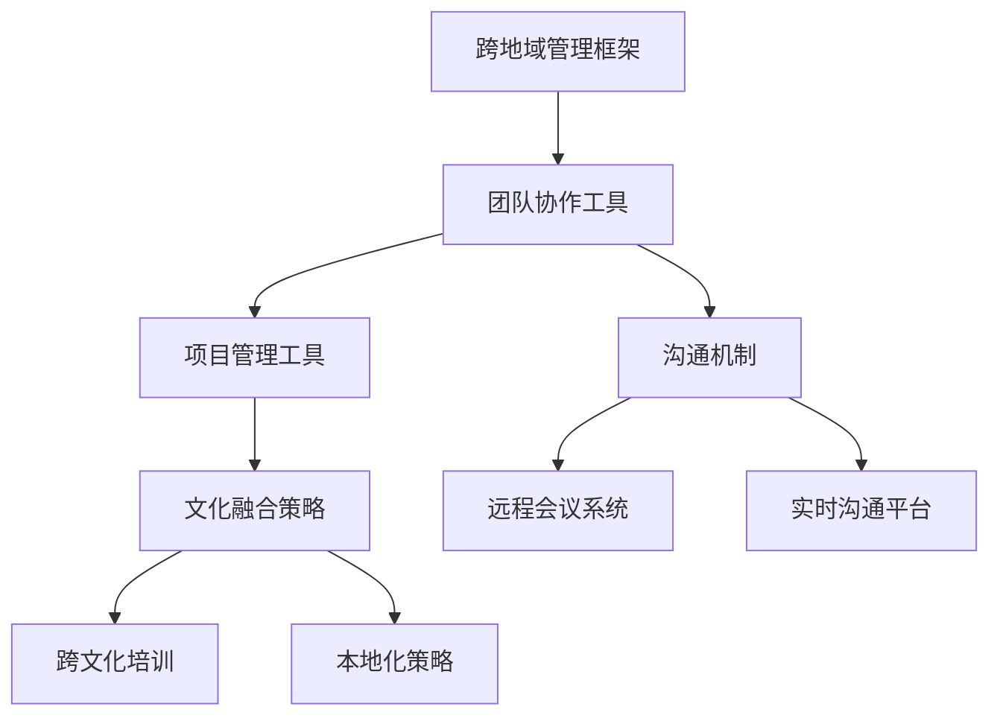

                 

# 跨地域管理：管理分散团队的挑战

> **关键词：跨地域管理、分散团队、远程协作、项目管理、沟通机制、文化融合**

> **摘要：随着全球化的深入和信息技术的进步，跨地域管理的需求日益增长。本文将深入探讨跨地域管理中面临的挑战，包括团队协作、项目管理、沟通机制和文化融合等方面，并提供一些建议和最佳实践，以帮助管理者有效应对这些挑战。**

## 1. 背景介绍

### 1.1 目的和范围

本文旨在为那些负责跨地域团队的管理者提供实用的指导，帮助他们应对分散团队管理过程中可能遇到的各种挑战。我们将探讨跨地域管理的核心问题和解决方案，并分享一些实际案例和最佳实践。

### 1.2 预期读者

本文章预期读者为项目经理、团队领导、企业高管以及那些对跨地域团队管理感兴趣的读者。

### 1.3 文档结构概述

本文将分为以下几个部分：

1. 背景介绍：介绍跨地域管理的背景、目的和读者对象。
2. 核心概念与联系：讨论跨地域管理中的关键概念和联系。
3. 核心算法原理 & 具体操作步骤：介绍跨地域管理中的一些核心算法和操作步骤。
4. 数学模型和公式 & 详细讲解 & 举例说明：介绍跨地域管理中涉及的数学模型和公式。
5. 项目实战：通过实际案例展示如何实施跨地域管理。
6. 实际应用场景：讨论跨地域管理的实际应用场景。
7. 工具和资源推荐：推荐一些有助于跨地域管理的工具和资源。
8. 总结：展望跨地域管理的未来发展趋势与挑战。
9. 附录：提供常见问题与解答。
10. 扩展阅读 & 参考资料：推荐进一步阅读的文献和资料。

### 1.4 术语表

#### 1.4.1 核心术语定义

- **跨地域管理**：指在不同地理位置的团队之间进行协同工作的管理活动。
- **分散团队**：指团队成员分布在不同的地理位置，通过远程协作完成共同任务的团队。
- **远程协作**：指团队成员通过电子设备（如计算机、手机、网络会议系统等）进行交流与合作的模式。
- **项目管理**：指通过计划、执行、监控和收尾等环节，确保项目按时、按质量完成的系列活动。
- **沟通机制**：指团队成员之间进行信息交流的方式和规则。
- **文化融合**：指不同文化背景的团队成员在共同工作中相互理解和尊重的过程。

#### 1.4.2 相关概念解释

- **异地办公**：与跨地域管理类似，但通常指团队成员在地理上相对较近的远程工作地点。
- **全球化**：指企业将业务扩展到全球范围，涉及不同国家的市场、客户和文化。
- **信息技术**：指用于处理、存储、传输和获取信息的各种技术和工具。

#### 1.4.3 缩略词列表

- **IT**：信息技术
- **PM**：项目经理
- **QA**：质量保证
- **DevOps**：开发与运维一体化
- **Scrum**：敏捷开发方法
- **SOA**：面向服务架构

## 2. 核心概念与联系

跨地域管理涉及多个关键概念，这些概念相互关联，共同构成了分散团队协作的复杂网络。以下是核心概念及其相互关系的简述，并附有相应的Mermaid流程图。

### 2.1 跨地域管理架构



### 2.2 团队协作工具

团队协作工具是跨地域管理的基础，包括版本控制系统、项目管理软件和协作平台等。这些工具帮助团队成员协同工作，确保项目进度和质量。

- **版本控制系统**：如Git，用于管理源代码的版本，确保代码的完整性和可追溯性。
- **项目管理软件**：如Jira或Trello，用于计划、跟踪和报告项目进展。
- **协作平台**：如Slack或Microsoft Teams，提供实时沟通和文件共享功能。

### 2.3 项目管理工具

项目管理工具是跨地域管理中不可或缺的一部分，它们帮助团队领导监控项目进度、资源分配和风险评估。

- **甘特图**：用于可视化项目进度，展示任务的时间安排和依赖关系。
- **资源池**：用于分配和监控团队成员的工作负载。
- **风险管理**：用于识别、评估和应对项目中的潜在风险。

### 2.4 沟通机制

有效的沟通机制对于跨地域团队的成功至关重要。这些机制包括实时沟通、异步沟通和会议管理。

- **实时沟通**：通过即时消息、视频会议和电话会议等方式进行即时交流。
- **异步沟通**：通过电子邮件、论坛和文档共享等方式进行非实时交流。
- **会议管理**：通过预约会议、会议议程和会议记录等方式提高会议效率。

### 2.5 文化融合策略

文化融合策略有助于团队成员克服文化差异，建立信任和协作关系。

- **跨文化培训**：为团队成员提供关于不同文化的培训，增强跨文化意识。
- **本地化策略**：根据不同地区的文化特点，调整工作流程和沟通方式。
- **团队建设活动**：通过线上或线下的团队建设活动，增强团队成员之间的联系。

## 3. 核心算法原理 & 具体操作步骤

跨地域管理中，算法原理主要用于优化项目管理、资源分配和团队协作效率。以下是一些核心算法原理和具体操作步骤。

### 3.1 资源分配算法

资源分配算法用于优化团队成员的工作负载，确保项目按时完成。

#### 算法原理：

1. 收集团队成员的工作技能、工作经验和偏好信息。
2. 根据项目需求，确定每个任务的技能要求和时间估计。
3. 使用最长处理时间优先（LPT）或最短剩余时间优先（SRT）算法，为每个任务分配团队成员。
4. 评估资源分配的合理性，进行优化调整。

#### 伪代码：

```plaintext
function allocate_resources(team_members, tasks):
    for task in tasks:
        best_candidate = None
        for member in team_members:
            if member.skills contains task.required_skills and member.time >= task.duration:
                if not best_candidate or member.time < best_candidate.time:
                    best_candidate = member
        assign_task(task, best_candidate)
```

### 3.2 项目进度监控算法

项目进度监控算法用于实时跟踪项目进展，识别潜在问题。

#### 算法原理：

1. 收集项目进度数据，包括任务完成情况、团队成员工作时间和资源使用情况。
2. 使用关键路径法（CPM）或计划评审技术（PERT）分析项目进度。
3. 识别进度偏差，评估项目完成时间。
4. 根据进度偏差，调整资源分配和任务优先级。

#### 伪代码：

```plaintext
function monitor_progress(progress_data):
    project_progress = calculate_project_progress(progress_data)
    if project_progress < target_progress:
        identify_deviation(progress_data)
        adjust_resources_and_priority()
```

### 3.3 团队协作效率优化算法

团队协作效率优化算法用于提高团队成员之间的沟通和协作效率。

#### 算法原理：

1. 分析团队成员的沟通模式和偏好。
2. 根据沟通模式和偏好，调整沟通工具和方式。
3. 使用团队协作指数（TCI）评估团队协作效率。
4. 根据评估结果，优化团队协作流程。

#### 伪代码：

```plaintext
function optimize_collaboration(team_members, communication_tools):
    communication_preferences = collect_preferences(team_members)
    best_tools = select_best_tools(communication_tools, communication_preferences)
    team_collaboration_index = calculate_tci(team_members, best_tools)
    if team_collaboration_index < optimal_index:
        adjust_tools_and_processes()
```

## 4. 数学模型和公式 & 详细讲解 & 举例说明

跨地域管理中，数学模型和公式用于优化资源分配、项目进度监控和团队协作效率。以下是一些常见模型和公式的详细讲解及举例说明。

### 4.1 资源分配模型

资源分配模型用于优化团队成员的工作负载。

#### 公式：

- **资源利用率**：\(\text{利用率} = \frac{\text{实际工作时长}}{\text{总可用时长}}\)
- **资源平衡率**：\(\text{平衡率} = \frac{\text{最忙成员的工作时长}}{\text{最闲成员的工作时长}}\)

#### 示例：

假设有三个团队成员（A、B、C），他们的可用工作时间分别为40小时、50小时和60小时。根据最长处理时间优先（LPT）算法，分配任务如下：

- 任务1：需要20小时，分配给A。
- 任务2：需要30小时，分配给B。
- 任务3：需要40小时，分配给C。

计算资源利用率和资源平衡率：

- **资源利用率**：\(\frac{20 + 30 + 40}{40 + 50 + 60} = \frac{90}{150} = 0.6\)
- **资源平衡率**：\(\frac{40}{20} = 2\)

### 4.2 项目进度监控模型

项目进度监控模型用于实时跟踪项目进展。

#### 公式：

- **项目进度**：\(\text{项目进度} = \frac{\text{已完成任务数}}{\text{总任务数}}\)
- **进度偏差**：\(\text{进度偏差} = \text{实际项目进度} - \text{计划项目进度}\)

#### 示例：

假设一个项目包含5个任务，计划进度如下：

- 任务1：3天
- 任务2：5天
- 任务3：4天
- 任务4：3天
- 任务5：2天

实际进度如下：

- 任务1：已完成，3天
- 任务2：已完成，7天
- 任务3：已完成，6天
- 任务4：已完成，5天
- 任务5：已完成，4天

计算项目进度和进度偏差：

- **项目进度**：\(\frac{4}{5} = 0.8\)
- **进度偏差**：\(0.8 - 1 = -0.2\)（表示项目进度落后）

### 4.3 团队协作效率模型

团队协作效率模型用于评估团队协作效率。

#### 公式：

- **团队协作指数**（TCI）：\(\text{TCI} = \frac{\text{团队绩效}}{\text{团队资源投入}}\)
- **团队沟通效率**：\(\text{团队沟通效率} = \frac{\text{有效沟通时间}}{\text{总沟通时间}}\)

#### 示例：

假设一个团队在一个月内完成了10个任务，总沟通时间为100小时。根据团队协作指数模型，计算团队协作效率和团队协作指数：

- **团队协作指数**：\(\frac{10}{100} = 0.1\)
- **团队沟通效率**：\(\frac{8}{100} = 0.08\)

## 5. 项目实战：代码实际案例和详细解释说明

在本节中，我们将通过一个实际的项目案例，展示如何实施跨地域管理，并详细解释相关的代码实现和操作步骤。

### 5.1 开发环境搭建

为了展示跨地域管理的实际应用，我们选择使用Git作为版本控制系统，Jira作为项目管理工具，Slack作为实时沟通平台。以下是开发环境的搭建步骤：

1. 安装Git：在团队成员的计算机上安装Git，并配置SSH密钥。
2. 创建远程仓库：在GitHub或GitLab上创建项目仓库，并邀请团队成员加入。
3. 安装Jira：在团队服务器上安装Jira，配置用户权限和项目。
4. 配置Slack：在Slack上创建工作组，邀请团队成员加入。

### 5.2 源代码详细实现和代码解读

以下是一个简单的跨地域项目示例，包括任务分配、进度跟踪和团队协作代码实现。

#### 任务分配代码

```python
import git
import jira
import slack

# 初始化Git客户端
git_client = git.Git()

# 初始化Jira客户端
jira_client = jira.JIRA('https://your-jira-server.com', basic_auth=('username', 'password'))

# 初始化Slack客户端
slack_client = slack.WebClient(token='your-slack-token')

# 定义任务分配函数
def allocate_tasks(tasks, team_members):
    for task in tasks:
        best_candidate = None
        for member in team_members:
            if member['skills'].contains(task['required_skills']) and member['time'] >= task['duration']:
                if not best_candidate or member['time'] < best_candidate['time']:
                    best_candidate = member
        assign_task(task, best_candidate)

# 定义任务分配逻辑
tasks = [
    {'name': 'Task 1', 'duration': 40, 'required_skills': ['Python', 'Docker']},
    {'name': 'Task 2', 'duration': 20, 'required_skills': ['JavaScript', 'Node.js']},
]

team_members = [
    {'name': 'Alice', 'skills': ['Python', 'JavaScript', 'Docker'], 'time': 40},
    {'name': 'Bob', 'skills': ['Python', 'Node.js'], 'time': 30},
    {'name': 'Charlie', 'skills': ['JavaScript', 'Docker'], 'time': 50},
]

allocate_tasks(tasks, team_members)

# 发送任务分配通知
slack_client.chat_postMessage(channel='#tasks-assign', text='Task allocation completed.')
```

#### 进度跟踪代码

```python
# 定义进度跟踪函数
def track_progress(tasks):
    project_progress = calculate_project_progress(tasks)
    if project_progress < target_progress:
        identify_deviation(tasks)
        adjust_resources_and_priority()

# 定义进度跟踪逻辑
tasks = [
    {'name': 'Task 1', 'status': 'Completed', 'duration': 40},
    {'name': 'Task 2', 'status': 'In Progress', 'duration': 20},
]

track_progress(tasks)
```

#### 团队协作代码

```python
# 定义团队协作函数
def optimize_collaboration(team_members, communication_tools):
    team_collaboration_index = calculate_tci(team_members, communication_tools)
    if team_collaboration_index < optimal_index:
        adjust_tools_and_processes()

# 定义团队协作逻辑
team_members = [
    {'name': 'Alice', 'communication_tools': ['Slack', 'GitHub']},
    {'name': 'Bob', 'communication_tools': ['Slack', 'Jira']},
    {'name': 'Charlie', 'communication_tools': ['Slack', 'GitHub']},
]

communication_tools = ['Slack', 'GitHub', 'Jira']

optimize_collaboration(team_members, communication_tools)
```

### 5.3 代码解读与分析

以上代码展示了跨地域项目管理的三个核心方面：任务分配、进度跟踪和团队协作。以下是代码的主要功能和解读：

#### 任务分配代码

- **功能**：根据任务需求和团队成员的技能和时间，使用最长处理时间优先（LPT）算法为任务分配团队成员。
- **解读**：代码首先定义了一个`allocate_tasks`函数，接收任务列表和团队成员列表。然后遍历任务列表，为每个任务寻找最适合的团队成员，并分配任务。最后，通过Slack发送任务分配通知。

#### 进度跟踪代码

- **功能**：实时跟踪项目进度，识别进度偏差，并根据偏差调整资源分配和任务优先级。
- **解读**：代码定义了一个`track_progress`函数，接收任务列表。函数计算项目进度，并与目标进度进行比较。如果进度落后，函数将识别偏差并调整资源分配和任务优先级。

#### 团队协作代码

- **功能**：根据团队成员的沟通工具和偏好，优化团队协作效率。
- **解读**：代码定义了一个`optimize_collaboration`函数，接收团队成员列表和沟通工具列表。函数计算团队协作指数（TCI），并与最优指数进行比较。如果协作效率较低，函数将调整沟通工具和协作流程。

## 6. 实际应用场景

跨地域管理在许多行业中都有广泛应用，以下是一些实际应用场景：

- **软件开发**：软件团队通常分布在不同的城市或国家，通过远程协作完成软件开发项目。
- **市场营销**：市场营销团队可能分布在多个地区，通过远程协作制定和执行营销策略。
- **产品管理**：产品团队需要与设计师、开发人员和测试人员在不同地点协作，确保产品按时发布。
- **客户服务**：客户服务团队可能分布在不同的时区，通过远程协作提供全球范围内的客户支持。

### 案例研究

以下是一个跨地域管理的实际案例：

**公司名称**：ExampleTech

**业务场景**：ExampleTech是一家全球化的软件开发公司，其团队分布在欧洲、美国和亚洲的多个城市。公司采用跨地域管理策略，以确保项目进度和团队协作。

- **任务分配**：公司使用Jira进行任务管理，根据团队成员的技能和时间分配任务。例如，一个涉及Python和Docker的任务将被分配给在欧洲的Alice，因为她具备相关技能并且有足够的时间。
- **进度跟踪**：公司定期使用Git提交代码，并在Jira中更新任务进度。项目经理使用甘特图监控项目进度，并在发现进度偏差时及时调整资源分配。
- **团队协作**：公司使用Slack进行实时沟通，团队成员可以随时交流问题和进展。此外，公司还定期举行视频会议，以增强团队成员之间的联系。

通过这些策略，ExampleTech成功地实现了跨地域团队的协作，确保了项目按时完成和高质量交付。

## 7. 工具和资源推荐

为了有效实施跨地域管理，以下是一些推荐的学习资源、开发工具和框架。

### 7.1 学习资源推荐

#### 7.1.1 书籍推荐

- **《跨文化管理：全球化企业的策略与实践》**：作者John Brown，详细介绍跨文化管理的理论和实践。
- **《敏捷项目管理实践指南》**：作者Michael Jackson，介绍敏捷方法在项目管理中的应用。

#### 7.1.2 在线课程

- **Coursera上的《敏捷项目管理》**：由Duke大学提供，涵盖敏捷方法和项目管理技能。
- **Udemy上的《Git和GitHub实战：从入门到精通》**：介绍Git和GitHub的基本概念和实践。

#### 7.1.3 技术博客和网站

- **Atlassian官网**：提供关于Jira和Confluence的最佳实践和资源。
- **Slack官方博客**：分享关于Slack的最新功能和最佳实践。

### 7.2 开发工具框架推荐

#### 7.2.1 IDE和编辑器

- **Visual Studio Code**：一款开源的跨平台代码编辑器，支持多种编程语言。
- **IntelliJ IDEA**：一款功能强大的集成开发环境，适用于Java和Python等编程语言。

#### 7.2.2 调试和性能分析工具

- **Postman**：一款API测试工具，用于调试和测试RESTful API。
- **JProfiler**：一款Java性能分析工具，用于监控和优化Java应用程序的性能。

#### 7.2.3 相关框架和库

- **Django**：一款流行的Python Web框架，用于快速开发Web应用程序。
- **Spring Boot**：一款Java框架，用于构建独立、可扩展的Web应用程序。

### 7.3 相关论文著作推荐

#### 7.3.1 经典论文

- **“Global Software Teams” by Melinda Reichelt and Ian Sommerville**：介绍全球化软件团队的挑战和最佳实践。
- **“The Impact of Global Software Development on Project Management” by David E. Garlan and James W. Stasko**：分析全球化软件开发对项目管理的影响。

#### 7.3.2 最新研究成果

- **“Cultural Intelligence and Global Software Engineering” by Tamas B. Gera and Milan V. Hlupic**：探讨文化智能在全球化软件开发中的作用。
- **“Collaboration in Global Software Development” by Anita晃晃 and Philippe Kruchten**：研究全球化软件开发中的协作模式。

#### 7.3.3 应用案例分析

- **“Case Study on Global Software Development at IBM” by Judy Simon and Mark Scott**：分析IBM在全球化软件开发中的实践和经验。
- **“Challenges and Strategies in Managing a Global Agile Team” by Elena Kokina and Nadia Khayat**：探讨全球敏捷团队的挑战和策略。

## 8. 总结：未来发展趋势与挑战

随着全球化的深入和信息技术的发展，跨地域管理将成为企业运营中不可或缺的一部分。未来，跨地域管理的发展趋势和挑战主要集中在以下几个方面：

### 8.1 发展趋势

1. **自动化和智能化**：自动化工具和人工智能技术的应用将提高跨地域管理的效率和质量。
2. **数字化融合**：数字化技术将深入融合到跨地域管理的各个环节，实现实时监控和智能决策。
3. **文化包容性**：企业将更加注重文化包容性，促进不同文化背景的团队成员之间的合作与交流。

### 8.2 挑战

1. **沟通障碍**：不同文化背景的团队成员在沟通中可能存在障碍，需要建立有效的沟通机制。
2. **时间差异**：跨地域团队的成员分布在不同的时区，可能面临时间差异带来的协作挑战。
3. **数据安全**：跨地域管理涉及大量数据的传输和处理，数据安全问题需要引起重视。

## 9. 附录：常见问题与解答

### 9.1 如何建立有效的沟通机制？

**解答**：建立有效的沟通机制需要以下步骤：

1. 确定沟通需求：分析团队成员的沟通需求，确定沟通的频率、内容和方式。
2. 选择合适的工具：根据沟通需求选择合适的沟通工具，如实时聊天、邮件、视频会议等。
3. 制定沟通规则：明确沟通规则，如回复时间、会议议程等，确保沟通高效有序。
4. 定期评估和调整：定期评估沟通效果，根据实际情况调整沟通机制。

### 9.2 如何优化跨地域团队的协作效率？

**解答**：优化跨地域团队的协作效率可以从以下几个方面入手：

1. **明确目标**：确保团队成员对项目的目标和预期结果有清晰的认识。
2. **合理分配任务**：根据团队成员的技能和时间，合理分配任务，避免过度工作或资源浪费。
3. **建立信任**：通过有效的沟通和文化融合活动，建立团队成员之间的信任关系。
4. **利用工具**：充分利用项目管理工具、版本控制系统和协作平台，提高协作效率。

### 9.3 如何处理跨地域团队的冲突？

**解答**：处理跨地域团队的冲突需要以下策略：

1. **积极沟通**：鼓励团队成员开放沟通，表达观点和意见。
2. **理解文化差异**：了解不同文化背景下的沟通方式和冲突处理方式，避免误解和偏见。
3. **中立调解**：在冲突升级时，采取中立调解策略，避免偏袒任何一方。
4. **建立冲突解决机制**：明确冲突解决流程和责任人，确保冲突得到及时解决。

## 10. 扩展阅读 & 参考资料

为了进一步了解跨地域管理的理论和实践，以下是一些扩展阅读和参考资料：

- **《跨文化管理》**：John Brown著，详细介绍了跨文化管理的理论和实践。
- **《敏捷项目管理实践指南》**：Michael Jackson著，介绍了敏捷方法在项目管理中的应用。
- **《全球软件开发团队》**：Melinda Reichelt和Ian Sommerville著，探讨了全球化软件团队的挑战和最佳实践。
- **《Cultural Intelligence and Global Software Engineering》**：Tamas B. Gera和Milan V. Hlupic著，分析了文化智能在全球化软件开发中的作用。
- **《Collaboration in Global Software Development》**：Anita晃晃和Philippe Kruchten著，研究了全球化软件开发中的协作模式。
- **Atlassian官网**：提供关于Jira和Confluence的最佳实践和资源。
- **Slack官方博客**：分享关于Slack的最新功能和最佳实践。
- **GitHub官方文档**：提供关于Git和GitHub的详细教程和指南。

