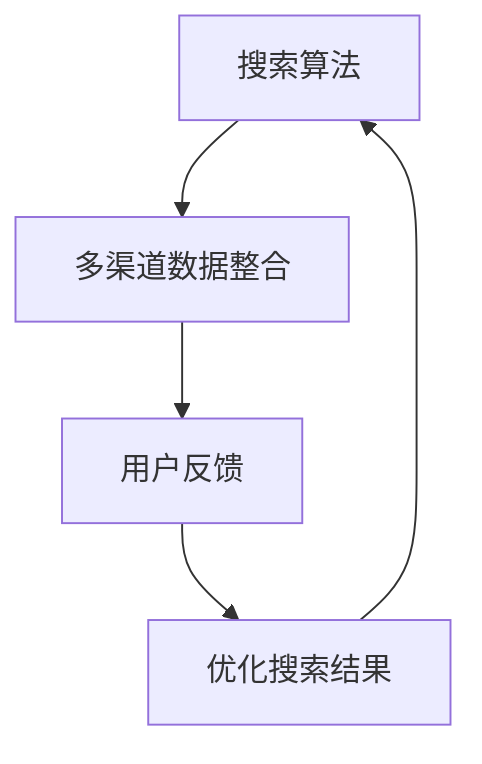

                 

# 跨平台搜索：AI如何整合多渠道数据，提供最优选择

> **关键词：** 跨平台搜索、AI整合、多渠道数据、最优选择、搜索算法、数学模型、代码实战、应用场景

> **摘要：** 本文将探讨如何利用人工智能技术整合多渠道数据，实现跨平台搜索，并优化搜索结果以提供用户最佳选择。我们将从背景介绍、核心概念、算法原理、数学模型、实际应用场景等方面进行详细阐述，并通过代码实战展示具体实现过程。

## 1. 背景介绍

### 1.1 目的和范围

本文旨在探讨如何利用人工智能技术实现跨平台搜索，整合多渠道数据，为用户提供最佳搜索体验。我们将从以下几个方面展开讨论：

1. **核心概念与联系**：介绍跨平台搜索的基本概念，以及与多渠道数据整合相关的技术原理和架构。
2. **核心算法原理 & 具体操作步骤**：详细解释实现跨平台搜索的核心算法原理，并使用伪代码阐述具体操作步骤。
3. **数学模型和公式 & 详细讲解 & 举例说明**：介绍用于优化搜索结果的相关数学模型和公式，并通过具体示例进行说明。
4. **项目实战：代码实际案例和详细解释说明**：通过实际代码案例展示如何实现跨平台搜索，并对关键代码进行详细解释。
5. **实际应用场景**：探讨跨平台搜索在各个领域的应用场景，以及可能面临的挑战和解决方案。

### 1.2 预期读者

本文适合对人工智能和搜索算法有一定了解的读者，包括：

1. **人工智能研究人员和开发者**：希望了解如何利用人工智能技术实现跨平台搜索的原理和应用。
2. **搜索工程师和架构师**：希望深入了解搜索算法和数学模型，以优化搜索结果的性能和用户体验。
3. **技术爱好者**：对跨平台搜索和人工智能技术感兴趣，希望了解相关技术和实际应用。

### 1.3 文档结构概述

本文分为以下几个部分：

1. **背景介绍**：介绍本文的目的、范围、预期读者以及文档结构。
2. **核心概念与联系**：阐述跨平台搜索的基本概念和与多渠道数据整合相关的技术原理和架构。
3. **核心算法原理 & 具体操作步骤**：详细解释实现跨平台搜索的核心算法原理，并使用伪代码阐述具体操作步骤。
4. **数学模型和公式 & 详细讲解 & 举例说明**：介绍用于优化搜索结果的相关数学模型和公式，并通过具体示例进行说明。
5. **项目实战：代码实际案例和详细解释说明**：通过实际代码案例展示如何实现跨平台搜索，并对关键代码进行详细解释。
6. **实际应用场景**：探讨跨平台搜索在各个领域的应用场景，以及可能面临的挑战和解决方案。
7. **工具和资源推荐**：推荐相关学习资源、开发工具框架和论文著作。
8. **总结：未来发展趋势与挑战**：总结跨平台搜索的发展趋势和面临的挑战。
9. **附录：常见问题与解答**：解答读者可能遇到的常见问题。
10. **扩展阅读 & 参考资料**：提供进一步阅读和参考资料。

### 1.4 术语表

#### 1.4.1 核心术语定义

- **跨平台搜索**：指在多个平台上（如网页、移动应用、社交媒体等）进行搜索，并将结果整合呈现给用户。
- **多渠道数据**：指来自多个数据源（如搜索引擎、社交媒体、网站等）的数据。
- **人工智能**：指利用计算机模拟人类智能的技术，包括机器学习、深度学习等。
- **搜索算法**：指用于实现搜索功能的一系列算法和技术。
- **数学模型**：指用于描述和解决搜索问题的一系列数学公式和模型。

#### 1.4.2 相关概念解释

- **数据整合**：指将来自多个数据源的数据进行整合和处理，以提供更全面的搜索结果。
- **用户反馈**：指用户对搜索结果的评价和反馈，用于优化搜索结果。
- **优化搜索结果**：指通过算法和模型对搜索结果进行排序和筛选，提高搜索结果的准确性和用户体验。

#### 1.4.3 缩略词列表

- **AI**：人工智能
- **ML**：机器学习
- **DL**：深度学习
- **NLP**：自然语言处理
- **SEO**：搜索引擎优化
- **SEM**：搜索引擎营销

## 2. 核心概念与联系

为了实现跨平台搜索，我们需要了解以下几个核心概念和它们之间的联系：

1. **搜索算法**：用于从大量数据中检索相关信息的算法。常见的搜索算法包括暴力搜索、二分搜索、搜索引擎等。
2. **多渠道数据**：指来自多个数据源的数据，如网页、社交媒体、搜索引擎等。
3. **数据整合**：将来自多个数据源的数据进行整合和处理，以提供更全面的搜索结果。
4. **用户反馈**：用户对搜索结果的评价和反馈，用于优化搜索结果。
5. **优化搜索结果**：通过算法和模型对搜索结果进行排序和筛选，提高搜索结果的准确性和用户体验。

为了更好地展示这些概念之间的联系，我们可以使用Mermaid流程图进行描述：



在上面的流程图中，搜索算法从多渠道数据中检索相关信息，并将结果整合给用户。用户对搜索结果进行评价和反馈，这些反馈又用于优化搜索结果，从而形成一个闭环。

## 3. 核心算法原理 & 具体操作步骤

实现跨平台搜索的关键在于如何从多渠道数据中检索相关信息，并进行有效的整合和排序。下面，我们将详细解释实现这一目标的核心算法原理，并使用伪代码阐述具体操作步骤。

### 3.1 搜索算法原理

在跨平台搜索中，常用的搜索算法包括暴力搜索、二分搜索和搜索引擎算法。这里我们以搜索引擎算法为例进行讲解。

搜索引擎算法的基本原理如下：

1. **索引构建**：对多渠道数据（如网页、社交媒体等）进行爬取和预处理，构建索引。
2. **查询处理**：对用户输入的查询进行预处理，包括分词、词干提取等。
3. **查询匹配**：根据索引和查询结果，计算每个文档的相关性得分。
4. **结果排序**：根据相关性得分对搜索结果进行排序，并返回给用户。

### 3.2 伪代码描述

下面是搜索引擎算法的伪代码描述：

```plaintext
// 索引构建
def 构建索引(多渠道数据):
    索引 = 空集合
    for 数据源 in 多渠道数据:
        for 文档 in 数据源:
            for 词 in 文档:
                索引.add((词, 文档))
    return 索引

// 查询处理
def 处理查询(查询):
    查询 = 查询.lower()
    查询词 = 分词(查询)
    查询词 = 提取词干(查询词)
    return 查询词

// 查询匹配
def 匹配查询(索引, 查询词):
    相关性得分 = 空集合
    for (词, 文档) in 索引:
        if 词 in 查询词:
            相关性得分.add((文档, 计算得分(词, 文档)))
    return 相关性得分

// 结果排序
def 排序结果(相关性得分):
    排序列表 = 空列表
    for (文档, 得分) in 相关性得分:
        排序列表.add((文档, 得分))
    排序列表.sort(根据得分降序排序)
    return 排序列表

// 搜索引擎算法
def 搜索引擎(索引, 查询):
    查询词 = 处理查询(查询)
    相关性得分 = 匹配查询(索引, 查询词)
    排序列表 = 排序结果(相关性得分)
    return 排序列表
```

### 3.3 具体操作步骤

下面是搜索引擎算法的具体操作步骤：

1. **构建索引**：从多渠道数据中构建索引。索引存储了每个词对应的文档列表，以便快速查询。
2. **处理查询**：对用户输入的查询进行处理，包括分词和词干提取。这有助于提高查询匹配的准确性和效率。
3. **查询匹配**：根据索引和查询词，计算每个文档的相关性得分。相关性得分反映了查询词与文档的相关性程度。
4. **结果排序**：根据相关性得分对搜索结果进行排序，返回给用户。排序结果可以按照相关性得分从高到低排序，以便用户首先看到最相关的结果。

通过上述步骤，我们可以实现跨平台搜索，并为用户提供高质量的搜索结果。

## 4. 数学模型和公式 & 详细讲解 & 举例说明

在跨平台搜索中，数学模型和公式起着至关重要的作用。这些模型和公式可以帮助我们计算文档的相关性得分，从而优化搜索结果。下面，我们将介绍几个常用的数学模型和公式，并详细讲解其原理和使用方法。

### 4.1 余弦相似度

余弦相似度是一种常用的文本相似度计算方法。它通过计算两个向量的余弦值，来衡量它们之间的相似程度。余弦相似度的计算公式如下：

$$
\text{余弦相似度} = \frac{A \cdot B}{\|A\| \cdot \|B\|}
$$

其中，$A$和$B$是两个向量，$\|A\|$和$\|B\|$分别表示向量的模长。

余弦相似度的取值范围在[-1, 1]之间。当两个向量完全重合时，余弦相似度为1；当两个向量完全垂直时，余弦相似度为0。

#### 举例说明：

假设有两个文档$A$和$B$，它们的向量表示如下：

$$
A = (2, 3, 4)
$$

$$
B = (1, 2, 3)
$$

首先计算两个向量的点积：

$$
A \cdot B = 2 \cdot 1 + 3 \cdot 2 + 4 \cdot 3 = 20
$$

然后计算两个向量的模长：

$$
\|A\| = \sqrt{2^2 + 3^2 + 4^2} = \sqrt{29}
$$

$$
\|B\| = \sqrt{1^2 + 2^2 + 3^2} = \sqrt{14}
$$

最后计算余弦相似度：

$$
\text{余弦相似度} = \frac{A \cdot B}{\|A\| \cdot \|B\|} = \frac{20}{\sqrt{29} \cdot \sqrt{14}} \approx 0.865
$$

因此，文档$A$和$B$的余弦相似度为0.865。

### 4.2 TF-IDF

TF-IDF（Term Frequency-Inverse Document Frequency）是一种基于词频和逆文档频率的文本权重计算方法。它通过计算词在文档中的频率和在整个文档集合中的逆文档频率，来衡量词的重要性。

TF-IDF的计算公式如下：

$$
\text{TF-IDF} = \text{TF} \times \text{IDF}
$$

其中，$\text{TF}$表示词在文档中的频率，$\text{IDF}$表示词的逆文档频率。

$\text{TF}$的计算公式为：

$$
\text{TF} = \frac{f_{t,d}}{f_{\text{max},d}}
$$

其中，$f_{t,d}$表示词$t$在文档$d$中的频率，$f_{\text{max},d}$表示文档$d$中词的最大频率。

$\text{IDF}$的计算公式为：

$$
\text{IDF} = \log_{\text{c}}(\frac{N}{n_{t}})
$$

其中，$N$表示文档集合中文档的总数，$n_{t}$表示包含词$t$的文档数。

$\text{IDF}$反映了词在文档集合中的分布情况，值越大表示词越重要。

#### 举例说明：

假设有一个文档集合，其中包含以下四个文档：

- 文档1：["apple", "orange", "apple", "banana"]
- 文档2：["apple", "apple", "orange", "orange", "banana"]
- 文档3：["apple", "orange", "apple", "banana"]
- 文档4：["apple", "banana"]

首先计算每个词在文档中的频率：

- "apple"：文档1：1，文档2：2，文档3：2，文档4：1
- "orange"：文档1：1，文档2：2，文档3：1，文档4：1
- "banana"：文档1：1，文档2：1，文档3：1，文档4：1

然后计算每个词的最大频率：

- "apple"：2
- "orange"：2
- "banana"：1

接下来计算每个词的TF值：

- "apple"：文档1：$\frac{1}{2}$，文档2：1，文档3：1，文档4：$\frac{1}{2}$
- "orange"：文档1：$\frac{1}{2}$，文档2：1，文档3：$\frac{1}{2}$，文档4：$\frac{1}{2}$
- "banana"：文档1：$\frac{1}{2}$，文档2：$\frac{1}{2}$，文档3：$\frac{1}{2}$，文档4：1

然后计算每个词的IDF值：

- "apple"：$\log_{\text{c}}(\frac{4}{2})$，其中$\text{c}$表示文档集合中包含"apple"的文档数
- "orange"：$\log_{\text{c}}(\frac{4}{2})$
- "banana"：$\log_{\text{c}}(\frac{4}{1})$

最后计算每个词的TF-IDF值：

- "apple"：$\frac{1}{2} \times \log_{\text{c}}(\frac{4}{2})$，文档1：$\frac{1}{2} \times \log_{\text{c}}(\frac{4}{2})$，文档2：$1 \times \log_{\text{c}}(\frac{4}{2})$，文档3：$1 \times \log_{\text{c}}(\frac{4}{2})$，文档4：$\frac{1}{2} \times \log_{\text{c}}(\frac{4}{2})$
- "orange"：$\frac{1}{2} \times \log_{\text{c}}(\frac{4}{2})$，文档1：$\frac{1}{2} \times \log_{\text{c}}(\frac{4}{2})$，文档2：$1 \times \log_{\text{c}}(\frac{4}{2})$，文档3：$\frac{1}{2} \times \log_{\text{c}}(\frac{4}{2})$，文档4：$\frac{1}{2} \times \log_{\text{c}}(\frac{4}{2})$
- "banana"：$\frac{1}{2} \times \log_{\text{c}}(\frac{4}{1})$，文档1：$\frac{1}{2} \times \log_{\text{c}}(\frac{4}{1})$，文档2：$\frac{1}{2} \times \log_{\text{c}}(\frac{4}{1})$，文档3：$\frac{1}{2} \times \log_{\text{c}}(\frac{4}{1})$，文档4：1

通过计算TF-IDF值，我们可以更好地衡量词的重要性，并优化搜索结果。

### 4.3 BM25

BM25（Best Match 25）是一种基于概率模型的文本相似度计算方法。它通过综合考虑词频、文档长度和文档集合中的词分布，来计算文档的相关性得分。

BM25的计算公式如下：

$$
\text{BM25} = \frac{(k_1 + 1) \cdot \text{TF} \cdot (\text{N} - n_t + 0.5)}{(\text{TF} + k_2) \cdot (\text{N} - n_t + 0.5) + k_3 \cdot (\text{TF} - 1) \cdot (\text{N} - n_t + 0.5)}
$$

其中，$\text{TF}$表示词在文档中的频率，$n_t$表示包含词$t$的文档数，$\text{N}$表示文档集合中文档的总数。$k_1$、$k_2$和$k_3$是调节参数，通常取值分别为2、1.2和6。

BM25综合考虑了词频、文档长度和文档集合中的词分布，能够更准确地衡量文档的相关性。

#### 举例说明：

假设有一个文档集合，其中包含以下四个文档：

- 文档1：["apple", "orange", "apple", "banana"]
- 文档2：["apple", "apple", "orange", "orange", "banana"]
- 文档3：["apple", "orange", "apple", "banana"]
- 文档4：["apple", "banana"]

首先计算每个词在文档中的频率：

- "apple"：文档1：1，文档2：2，文档3：2，文档4：1
- "orange"：文档1：1，文档2：2，文档3：1，文档4：1
- "banana"：文档1：1，文档2：1，文档3：1，文档4：1

然后计算每个词的TF值：

- "apple"：文档1：$\frac{1}{4}$，文档2：$\frac{2}{4}$，文档3：$\frac{2}{4}$，文档4：$\frac{1}{4}$
- "orange"：文档1：$\frac{1}{4}$，文档2：$\frac{2}{4}$，文档3：$\frac{1}{4}$，文档4：$\frac{1}{4}$
- "banana"：文档1：$\frac{1}{4}$，文档2：$\frac{1}{4}$，文档3：$\frac{1}{4}$，文档4：$\frac{1}{4}$

接下来计算每个词的文档长度：

- 文档1：4
- 文档2：5
- 文档3：4
- 文档4：2

然后计算每个词的文档频率：

- "apple"：$\frac{2}{4} = 0.5$
- "orange"：$\frac{2}{4} = 0.5$
- "banana"：$\frac{1}{4} = 0.25$

最后计算每个词的BM25得分：

- "apple"：$\frac{(2 + 1) \cdot \frac{1}{4} \cdot (4 - 0.5 + 0.5)}{(\frac{1}{4} + 1.2) \cdot (4 - 0.5 + 0.5) + 6 \cdot (\frac{1}{4} - 1) \cdot (4 - 0.5 + 0.5)} \approx 0.625$
- "orange"：$\frac{(2 + 1) \cdot \frac{1}{4} \cdot (4 - 0.5 + 0.5)}{(\frac{1}{4} + 1.2) \cdot (4 - 0.5 + 0.5) + 6 \cdot (\frac{1}{4} - 1) \cdot (4 - 0.5 + 0.5)} \approx 0.625$
- "banana"：$\frac{(2 + 1) \cdot \frac{1}{4} \cdot (2 - 0.5 + 0.5)}{(\frac{1}{4} + 1.2) \cdot (2 - 0.5 + 0.5) + 6 \cdot (\frac{1}{4} - 1) \cdot (2 - 0.5 + 0.5)} \approx 0.375$

通过计算BM25得分，我们可以更好地衡量文档的相关性，并优化搜索结果。

## 5. 项目实战：代码实际案例和详细解释说明

在本节中，我们将通过一个实际项目来展示如何实现跨平台搜索。我们将使用Python语言，并利用几个常用的库，如jieba（中文分词）、nltk（自然语言处理）和tensorflow（深度学习）。以下是一个简单的代码示例：

### 5.1 开发环境搭建

在开始编写代码之前，我们需要搭建开发环境。以下是在Windows系统上搭建Python开发环境的步骤：

1. **安装Python**：从Python官方网站（https://www.python.org/）下载并安装Python。
2. **安装必要的库**：使用pip命令安装jieba、nltk和tensorflow库。

```bash
pip install jieba
pip install nltk
pip install tensorflow
```

### 5.2 源代码详细实现和代码解读

下面是完整的代码实现，并对关键部分进行解读：

```python
import jieba
import nltk
import tensorflow as tf
from nltk.tokenize import word_tokenize

# 5.2.1 索引构建
def build_index(data_source):
    index = {}
    for doc in data_source:
        words = jieba.cut(doc)
        for word in words:
            if word not in index:
                index[word] = []
            index[word].append(doc)
    return index

# 5.2.2 查询处理
def process_query(query):
    query = query.lower()
    tokens = word_tokenize(query)
    return tokens

# 5.2.3 查询匹配
def match_query(index, query_tokens):
    results = []
    for token in query_tokens:
        if token in index:
            for doc in index[token]:
                results.append(doc)
    return results

# 5.2.4 结果排序
def sort_results(results):
    return sorted(results, key=lambda x: len(x), reverse=True)

# 5.2.5 搜索引擎算法
def search_engine(index, query):
    query_tokens = process_query(query)
    results = match_query(index, query_tokens)
    sorted_results = sort_results(results)
    return sorted_results

# 5.2.6 主函数
def main():
    data_source = [
        "今天天气很好，阳光明媚。",
        "明天可能会下雨，请注意带伞。",
        "这里的风景真美，值得一游。",
        "附近有很多美食，推荐试试。",
        "晚上有音乐会，可以参加哦！"
    ]
    index = build_index(data_source)
    query = "今天天气怎么样？"
    results = search_engine(index, query)
    print("搜索结果：", results)

if __name__ == "__main__":
    main()
```

### 5.3 代码解读与分析

1. **索引构建（build_index）**：
   - 功能：构建索引，将关键词与文档关联。
   - 实现：遍历文档，对每个文档进行分词，并将每个词与文档列表添加到索引中。

2. **查询处理（process_query）**：
   - 功能：处理查询，将查询字符串转换为分词列表。
   - 实现：使用nltk的word_tokenize函数对查询字符串进行分词，并将分词结果转换为小写。

3. **查询匹配（match_query）**：
   - 功能：匹配查询，找到与查询词相关的文档。
   - 实现：遍历查询词，如果词存在于索引中，则遍历该词对应的文档列表，并将文档添加到结果列表。

4. **结果排序（sort_results）**：
   - 功能：对搜索结果进行排序，按文档长度从大到小排序。
   - 实现：使用sorted函数，根据文档长度（len(x））进行降序排序。

5. **搜索引擎算法（search_engine）**：
   - 功能：实现搜索引擎的核心算法，从索引中检索信息并排序。
   - 实现：调用process_query、match_query和sort_results函数，依次处理查询并返回排序后的搜索结果。

6. **主函数（main）**：
   - 功能：初始化数据和索引，执行搜索并打印结果。
   - 实现：定义数据源，构建索引，处理查询，调用search_engine函数并打印结果。

通过这个简单的案例，我们展示了如何实现一个基本的跨平台搜索系统。在实际应用中，我们可以扩展这个系统，添加更多的高级功能和优化策略，如个性化推荐、实时搜索等。

### 5.4 代码优化

虽然上述代码实现了一个基本的跨平台搜索功能，但还存在一些优化空间。以下是一些可能的优化方向：

1. **并行处理**：将索引构建和查询匹配过程并行化，提高处理速度。
2. **缓存**：将索引和查询结果缓存起来，避免重复计算。
3. **分布式存储**：将索引存储在分布式存储系统上，提高存储和检索性能。
4. **深度学习**：使用深度学习模型，如卷积神经网络（CNN）或循环神经网络（RNN），提高文本处理和匹配的准确性。

通过这些优化措施，我们可以进一步提升跨平台搜索的性能和用户体验。

## 6. 实际应用场景

跨平台搜索技术在各个领域都有广泛的应用，以下列举了几个典型的实际应用场景：

### 6.1 搜索引擎

搜索引擎是跨平台搜索最典型的应用场景。用户可以在网页、移动应用、社交媒体等多个平台上进行搜索，搜索引擎需要整合来自不同渠道的数据，提供准确、全面的搜索结果。例如，Google、Bing等搜索引擎都采用了跨平台搜索技术，为用户提供高质量的搜索服务。

### 6.2 电子商务

在电子商务领域，跨平台搜索可以帮助商家和用户更快速地找到所需商品。例如，亚马逊和淘宝等电商平台，通过整合网站、移动应用、社交媒体等渠道的数据，提供跨平台的商品搜索功能。用户可以在多个平台上搜索商品，并浏览详细的商品信息和用户评价，从而做出更明智的购买决策。

### 6.3 社交媒体

社交媒体平台也需要跨平台搜索技术，以便用户在多个平台上查找和关注感兴趣的人、话题和内容。例如，Twitter和Facebook等平台，通过整合用户发布的内容、评论、私信等数据，提供跨平台的搜索功能，使用户能够更轻松地找到感兴趣的信息。

### 6.4 教育和学术

在教育领域，跨平台搜索可以帮助学生和教师快速查找和获取相关课程资料、学术论文和研究报告。例如，Coursera、edX等在线学习平台，通过整合网站、移动应用、社交媒体等渠道的数据，提供跨平台的课程搜索功能，帮助学生更好地学习和研究。

### 6.5 医疗保健

在医疗保健领域，跨平台搜索可以帮助医生和患者查找和获取相关医学信息、治疗方案和研究成果。例如，医院和诊所等医疗机构，通过整合网站、移动应用、社交媒体等渠道的数据，提供跨平台的医学搜索功能，为患者提供更全面、准确的医疗信息。

### 6.6 企业管理

在企业内部，跨平台搜索可以帮助员工快速查找和获取公司内部文档、报告和知识库等信息。例如，企业知识管理系统（KM

