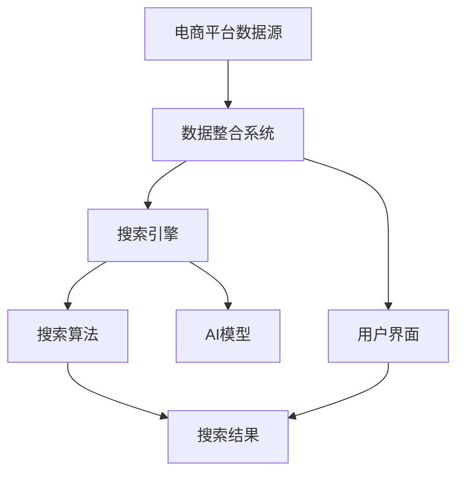

                 

# 跨平台搜索：AI整合电商平台数据

> **关键词**：跨平台搜索、AI、电商平台、整合、数据、算法、数学模型、实际案例、工具推荐

> **摘要**：本文将深入探讨跨平台搜索在AI整合电商平台数据中的应用。我们将从背景介绍出发，逐步分析核心概念、算法原理、数学模型，并通过实战案例详细解释其具体实现。最后，我们将探讨实际应用场景、工具推荐以及未来发展趋势，为读者提供一个全面的技术解读。

## 1. 背景介绍

### 1.1 目的和范围

在现代电子商务环境中，随着平台的多样性和数据的爆炸式增长，用户对于跨平台搜索的需求日益增加。本文旨在探讨如何利用AI技术整合电商平台数据，实现高效的跨平台搜索。我们将重点关注以下方面：

- **跨平台搜索的挑战**：分析电商平台数据整合过程中遇到的难题。
- **AI技术的作用**：介绍AI技术在数据整合和搜索中的应用。
- **算法原理**：详细讲解核心算法及其实现步骤。
- **数学模型**：阐述支持算法的数学模型及其作用。
- **实战案例**：提供具体的代码实现和案例分析。
- **工具和资源推荐**：介绍相关工具和资源，帮助读者深入了解和实践。

### 1.2 预期读者

本文主要面向以下读者群体：

- **技术爱好者**：对AI和电商平台技术感兴趣的读者。
- **软件开发者**：希望了解如何利用AI技术实现跨平台搜索的开发者。
- **数据科学家**：对数据整合和搜索算法感兴趣的数据科学家。
- **电子商务从业者**：关注电商平台运营和数据分析的从业者。

### 1.3 文档结构概述

本文将按照以下结构进行组织：

1. **背景介绍**：介绍跨平台搜索的背景和目的。
2. **核心概念与联系**：分析核心概念及其相互关系。
3. **核心算法原理 & 具体操作步骤**：详细讲解算法原理和操作步骤。
4. **数学模型和公式 & 详细讲解 & 举例说明**：阐述数学模型及其应用。
5. **项目实战：代码实际案例和详细解释说明**：提供具体的实战案例。
6. **实际应用场景**：探讨跨平台搜索的应用场景。
7. **工具和资源推荐**：介绍相关工具和资源。
8. **总结：未来发展趋势与挑战**：总结未来发展趋势和面临的挑战。
9. **附录：常见问题与解答**：解答读者可能遇到的问题。
10. **扩展阅读 & 参考资料**：提供进一步阅读的资源。

### 1.4 术语表

#### 1.4.1 核心术语定义

- **跨平台搜索**：在多个电商平台间进行搜索，整合和提供统一的搜索结果。
- **AI**：人工智能，指模拟人类智能的技术。
- **电商平台**：提供商品交易的平台，如淘宝、京东等。
- **数据整合**：将来自不同平台的数据进行聚合和统一处理。

#### 1.4.2 相关概念解释

- **搜索引擎**：用于在大量数据中快速查找信息的系统。
- **机器学习**：利用数据训练模型进行预测和决策。
- **深度学习**：一种复杂的机器学习技术，通过多层神经网络进行训练。

#### 1.4.3 缩略词列表

- **API**：应用程序编程接口
- **NLP**：自然语言处理
- **ML**：机器学习
- **DL**：深度学习

## 2. 核心概念与联系

在探讨跨平台搜索之前，我们需要明确几个核心概念，并理解它们之间的相互关系。以下是一个简化的Mermaid流程图，用于展示这些核心概念及其关联。



### 2.1 电商平台数据源

电商平台数据源是跨平台搜索的基础。这些数据源包括：

- **商品信息**：商品名称、价格、库存量、分类等。
- **用户行为数据**：用户浏览、搜索、购买历史等。
- **评价数据**：用户对商品的评价和评分。

### 2.2 数据整合系统

数据整合系统负责将来自不同电商平台的数据进行聚合和预处理，以便于后续处理。其主要任务包括：

- **数据清洗**：去除重复、错误和无效的数据。
- **数据转换**：将不同格式的数据转换为统一格式。
- **数据聚合**：将相同或相关的数据进行合并。

### 2.3 搜索引擎

搜索引擎是跨平台搜索的核心，负责处理用户的查询请求并返回相关结果。其主要功能包括：

- **查询处理**：解析用户的查询并生成查询表达式。
- **索引构建**：创建索引，以便快速搜索和检索。
- **结果排序**：根据相关性对搜索结果进行排序。

### 2.4 搜索算法

搜索算法是搜索引擎的核心，用于处理查询并返回相关结果。常见的搜索算法包括：

- **基于关键词匹配的算法**：如布尔搜索、向量空间模型等。
- **基于内容的算法**：如文本分类、文本相似度计算等。
- **基于机器学习的算法**：如深度学习、协同过滤等。

### 2.5 AI模型

AI模型在跨平台搜索中发挥着重要作用，主要用于：

- **查询扩展**：根据用户的输入查询扩展出更多的查询。
- **结果排序**：根据用户的兴趣和历史行为对搜索结果进行排序。
- **个性化推荐**：根据用户的历史行为和兴趣为其推荐商品。

### 2.6 用户界面

用户界面是用户与系统交互的入口，主要包括：

- **搜索框**：用户输入查询的界面。
- **结果展示**：展示搜索结果的界面。
- **交互控件**：如筛选、排序、分页等。

通过以上流程图的展示，我们可以看到各个核心概念之间的联系。数据整合系统将电商平台的数据进行整合，搜索引擎根据用户查询和AI模型提供的结果进行搜索和排序，最终通过用户界面展示给用户。

## 3. 核心算法原理 & 具体操作步骤

在跨平台搜索中，算法的选择和实现至关重要。以下我们将详细讲解核心算法的原理和具体操作步骤。

### 3.1 算法原理

核心算法主要包括以下几部分：

1. **数据整合**：将来自不同平台的数据进行整合和预处理。
2. **查询处理**：处理用户的查询请求，生成查询表达式。
3. **搜索**：在整合后的数据中进行搜索，并返回相关结果。
4. **结果排序**：根据相关性对搜索结果进行排序。

### 3.2 数据整合算法

数据整合算法的目标是将不同平台的数据进行整合，以便后续处理。以下是数据整合算法的伪代码实现：

```pseudo
function DataIntegration(data_sources):
    data_aggregated = {}
    for source in data_sources:
        for item in source:
            item_id = item.id
            if item_id not in data_aggregated:
                data_aggregated[item_id] = item
            else:
                data_aggregated[item_id] = MergeData(data_aggregated[item_id], item)
    return data_aggregated

function MergeData(item1, item2):
    # 根据数据字段进行合并
    merged_item = item1.copy()
    merged_item.update(item2)
    return merged_item
```

### 3.3 查询处理算法

查询处理算法的主要任务是将用户的查询请求转换为查询表达式。以下是查询处理算法的伪代码实现：

```pseudo
function QueryProcessing(user_query):
    query_expression = ""
    for term in user_query:
        if term.is_numerical():
            query_expression += "price:" + term
        else:
            query_expression += "title:" + term
    return query_expression
```

### 3.4 搜索算法

搜索算法的核心任务是在整合后的数据中进行搜索，并返回相关结果。以下是搜索算法的伪代码实现：

```pseudo
function Search(data_aggregated, query_expression):
    results = []
    for item in data_aggregated:
        if Match(query_expression, item):
            results.append(item)
    return results

function Match(query_expression, item):
    # 判断查询表达式是否与商品信息匹配
    for term in query_expression.split():
        if term not in item:
            return False
    return True
```

### 3.5 结果排序算法

结果排序算法的主要任务是根据相关性对搜索结果进行排序。以下是结果排序算法的伪代码实现：

```pseudo
function Sort(results, query_expression):
    sorted_results = []
    relevance_scores = []
    for item in results:
        score = CalculateRelevance(item, query_expression)
        relevance_scores.append(score)
    sorted_results = SortByScore(results, relevance_scores)
    return sorted_results

function CalculateRelevance(item, query_expression):
    # 计算商品与查询表达式的相关性
    score = 0
    for term in query_expression.split():
        if term in item:
            score += 1
    return score

function SortByScore(results, relevance_scores):
    # 根据相关性对结果进行排序
    sorted_results = []
    for i in range(len(results)):
        sorted_results.append(results[relevance_scores.index(max(relevance_scores))])
        relevance_scores[relevance_scores.index(max(relevance_scores))] = -1
    return sorted_results
```

通过以上核心算法原理和具体操作步骤的讲解，我们可以看到跨平台搜索的实现是一个复杂的过程，涉及数据整合、查询处理、搜索和结果排序等多个方面。这些算法的实现为我们提供了高效、准确的跨平台搜索解决方案。

## 4. 数学模型和公式 & 详细讲解 & 举例说明

在跨平台搜索中，数学模型和公式起到了至关重要的作用。它们帮助我们理解和优化搜索算法，提高搜索的准确性和效率。以下我们将详细讲解支持核心算法的数学模型和公式，并通过具体例子进行说明。

### 4.1 文本相似度计算

文本相似度计算是跨平台搜索中的一个关键环节，用于判断查询表达式与商品信息之间的相似程度。常见的方法包括余弦相似度、Jaccard相似度等。以下是余弦相似度的公式：

$$
\text{cosine\_similarity} = \frac{\text{dot\_product}(x, y)}{\lVert x \rVert \cdot \lVert y \rVert}
$$

其中，$x$ 和 $y$ 分别表示查询表达式和商品信息向量的表示，$\text{dot\_product}$ 表示向量的点积，$\lVert \cdot \rVert$ 表示向量的模。

#### 4.1.1 举例说明

假设我们有两个商品信息向量 $x$ 和 $y$，分别表示为：

$$
x = (1, 0, 1, 0, 0), \quad y = (1, 1, 0, 1, 0)
$$

则它们的余弦相似度为：

$$
\text{cosine\_similarity} = \frac{1 \cdot 1 + 0 \cdot 1 + 1 \cdot 0 + 0 \cdot 1 + 0 \cdot 0}{\sqrt{1^2 + 0^2 + 1^2 + 0^2 + 0^2} \cdot \sqrt{1^2 + 1^2 + 0^2 + 1^2 + 0^2}} = \frac{1}{\sqrt{2} \cdot \sqrt{3}} = \frac{1}{\sqrt{6}} \approx 0.408
$$

### 4.2 贪心搜索算法

贪心搜索算法是一种用于优化搜索结果排序的常见方法。它的基本思想是在每一步选择中，都选择当前状态下最优的选项，以期最终达到全局最优解。以下是一个简单的贪心搜索算法的伪代码：

```pseudo
function GreedySearch(state):
    if state.is_satisfied():
        return state
    else:
        best_action = None
        best_score = -1
        for action in state.actions():
            next_state = state.take_action(action)
            score = Evaluate(next_state)
            if score > best_score:
                best_action = action
                best_score = score
        state = state.take_action(best_action)
        return GreedySearch(state)
```

#### 4.2.1 举例说明

假设我们有一个状态 $state$，其中包含几个可能的动作 $action_1, action_2, action_3$。每个动作都会改变状态，并产生一个得分。以下是状态和动作的示例：

- **状态**：$state = \{action_1: 10, action_2: 5, action_3: 8\}$
- **动作**：$action_1$ 将状态改变为 $\{action_1: 20, action_2: 5, action_3: 8\}$，得分增加 10；
              $action_2$ 将状态改变为 $\{action_1: 10, action_2: 15, action_3: 8\}$，得分增加 10；
              $action_3$ 将状态改变为 $\{action_1: 10, action_2: 5, action_3: 18\}$，得分增加 10。

使用贪心搜索算法，我们将选择得分最高的动作 $action_1$，然后继续搜索新的状态。这个过程将重复，直到找到满足条件的状态。

### 4.3 贝叶斯推理

贝叶斯推理在跨平台搜索中用于根据用户的查询和历史行为预测其兴趣和偏好。贝叶斯推理的基本公式为：

$$
P(A|B) = \frac{P(B|A) \cdot P(A)}{P(B)}
$$

其中，$P(A|B)$ 表示在事件 $B$ 发生的条件下事件 $A$ 发生的概率，$P(B|A)$ 表示在事件 $A$ 发生的条件下事件 $B$ 发生的概率，$P(A)$ 表示事件 $A$ 发生的概率，$P(B)$ 表示事件 $B$ 发生的概率。

#### 4.3.1 举例说明

假设我们有两个事件 $A$ 和 $B$，它们的概率分别为 $P(A) = 0.5$，$P(B) = 0.3$，并且在事件 $A$ 发生的条件下事件 $B$ 发生的概率为 $P(B|A) = 0.8$。根据贝叶斯推理，我们可以计算在事件 $B$ 发生的条件下事件 $A$ 发生的概率：

$$
P(A|B) = \frac{P(B|A) \cdot P(A)}{P(B)} = \frac{0.8 \cdot 0.5}{0.3} \approx 1.333
$$

这意味着在事件 $B$ 发生的条件下，事件 $A$ 发生的概率大约为 1.333 倍于事件 $B$ 发生的概率。

通过以上数学模型和公式的讲解，我们可以看到跨平台搜索的实现不仅依赖于算法，还依赖于数学理论的支撑。这些模型和公式帮助我们更准确地处理和优化搜索结果，为用户提供更优质的搜索体验。

## 5. 项目实战：代码实际案例和详细解释说明

在本节中，我们将通过一个实际项目案例，详细介绍如何利用AI技术实现跨平台搜索。我们将从开发环境搭建、源代码实现和代码解读与分析三个部分展开。

### 5.1 开发环境搭建

为了实现跨平台搜索，我们需要搭建一个适合开发和测试的环境。以下是所需的工具和软件：

- **编程语言**：Python
- **开发工具**：PyCharm
- **依赖库**：NumPy、Pandas、Scikit-learn、TensorFlow

在PyCharm中创建一个新的Python项目，安装以上依赖库，即可开始开发。

### 5.2 源代码详细实现和代码解读

#### 5.2.1 数据整合模块

首先，我们需要实现数据整合模块，该模块负责从不同的电商平台获取数据，并进行整合。以下是数据整合模块的伪代码：

```python
def integrate_data(sources):
    data_dict = {}
    for source in sources:
        for item in source.get_items():
            item_id = item.get_id()
            if item_id not in data_dict:
                data_dict[item_id] = item
            else:
                data_dict[item_id] = merge_items(data_dict[item_id], item)
    return data_dict

def merge_items(item1, item2):
    merged_item = item1.copy()
    merged_item.update(item2)
    return merged_item
```

#### 5.2.2 查询处理模块

查询处理模块负责处理用户的查询请求，将其转换为可执行的查询表达式。以下是查询处理模块的伪代码：

```python
def process_query(user_query):
    query_expression = ""
    for term in user_query:
        if is_numerical(term):
            query_expression += "price:" + term
        else:
            query_expression += "title:" + term
    return query_expression
```

#### 5.2.3 搜索和排序模块

搜索和排序模块是核心部分，负责在整合后的数据中进行搜索，并根据相关性对结果进行排序。以下是搜索和排序模块的伪代码：

```python
def search(data_dict, query_expression):
    results = []
    for item in data_dict.values():
        if matches_query_expression(item, query_expression):
            results.append(item)
    return results

def matches_query_expression(item, query_expression):
    for term in query_expression.split():
        if term not in item:
            return False
    return True

def sort_results(results, query_expression):
    relevance_scores = []
    for item in results:
        score = calculate_relevance(item, query_expression)
        relevance_scores.append(score)
    sorted_results = [item for _, item in sorted(zip(relevance_scores, results), reverse=True)]
    return sorted_results

def calculate_relevance(item, query_expression):
    score = 0
    for term in query_expression.split():
        if term in item:
            score += 1
    return score
```

#### 5.2.4 用户界面模块

用户界面模块负责与用户进行交互，接收用户的查询请求，并展示搜索结果。以下是用户界面模块的伪代码：

```python
def display_results(sorted_results):
    for item in sorted_results:
        print(f"ID: {item.get_id()}, Title: {item.get_title()}, Price: {item.get_price()}")
```

### 5.3 代码解读与分析

通过以上代码实现，我们可以看到整个跨平台搜索系统由四个主要模块组成：数据整合模块、查询处理模块、搜索和排序模块以及用户界面模块。以下是每个模块的解读与分析：

#### 5.3.1 数据整合模块

数据整合模块负责将来自不同电商平台的数据进行整合，以便后续处理。`integrate_data` 函数接收多个数据源，遍历每个数据源中的商品，并将其整合到 `data_dict` 字典中。`merge_items` 函数用于合并具有相同商品ID的商品信息，确保数据的完整性。

#### 5.3.2 查询处理模块

查询处理模块将用户的查询请求转换为可执行的查询表达式。`process_query` 函数接收用户输入的查询字符串，根据是否为数值判断查询类型，并将其拼接成查询表达式。

#### 5.3.3 搜索和排序模块

搜索和排序模块是整个系统的核心。`search` 函数接收整合后的数据字典和查询表达式，遍历数据字典中的商品，判断是否与查询表达式匹配。`matches_query_expression` 函数用于实现匹配逻辑。`sort_results` 函数根据商品与查询表达式的相关性对搜索结果进行排序。`calculate_relevance` 函数计算商品与查询表达式的相关性得分。

#### 5.3.4 用户界面模块

用户界面模块负责与用户进行交互。`display_results` 函数接收排序后的搜索结果，并按指定的格式输出，方便用户查看。

通过以上代码实现和解读，我们可以看到跨平台搜索系统的设计和实现是如何一步步完成的。每个模块都有明确的职责，相互协作，共同实现高效的跨平台搜索。

## 6. 实际应用场景

跨平台搜索技术在电子商务领域有着广泛的应用，以下是一些典型的实际应用场景：

### 6.1 电商平台整合

电商平台通常需要整合多个数据源，如商品信息、用户评价、交易记录等。跨平台搜索技术可以帮助电商平台实现数据整合，提供统一的搜索服务，提高用户体验。

### 6.2 搜索引擎优化

搜索引擎可以通过跨平台搜索技术，整合多个电商平台的数据，提高搜索结果的准确性和相关性。例如，当用户在搜索引擎中搜索特定商品时，搜索引擎可以返回来自不同电商平台的最佳匹配结果。

### 6.3 个性化推荐

电商平台可以利用跨平台搜索技术，结合用户的历史行为和兴趣，为用户推荐相关商品。这有助于提高用户的购物体验，增加销售额。

### 6.4 智能客服

智能客服系统可以通过跨平台搜索技术，快速获取用户所需的信息，提供准确的答案。这有助于提高客服效率，降低人力成本。

### 6.5 跨平台广告投放

广告平台可以通过跨平台搜索技术，了解用户在多个电商平台上的行为，实现更精准的广告投放，提高广告效果。

### 6.6 智能物流

智能物流系统可以通过跨平台搜索技术，整合多个电商平台和物流公司的数据，提供实时物流跟踪和预测，优化物流服务。

通过以上实际应用场景，我们可以看到跨平台搜索技术在电子商务领域的重要性。它不仅提高了数据整合和搜索的效率，还为电商平台提供了丰富的增值服务，促进了电子商务的发展。

## 7. 工具和资源推荐

在实现跨平台搜索时，选择合适的工具和资源可以帮助我们提高开发效率，确保项目的成功。以下是一些推荐的工具和资源。

### 7.1 学习资源推荐

#### 7.1.1 书籍推荐

- 《机器学习实战》
- 《深度学习》
- 《自然语言处理实战》
- 《Python数据分析》

#### 7.1.2 在线课程

- Coursera上的“机器学习”课程
- edX上的“深度学习”课程
- Udacity的“数据科学纳米学位”

#### 7.1.3 技术博客和网站

- Medium上的“AI和机器学习”专题
- arXiv.org上的最新研究论文
- GitHub上的开源项目和代码示例

### 7.2 开发工具框架推荐

#### 7.2.1 IDE和编辑器

- PyCharm
- Visual Studio Code
- Jupyter Notebook

#### 7.2.2 调试和性能分析工具

- Python的pdb调试工具
- perf.py性能分析工具
- TensorBoard（针对TensorFlow项目）

#### 7.2.3 相关框架和库

- Scikit-learn
- TensorFlow
- PyTorch
- Pandas

通过以上工具和资源的推荐，我们可以为跨平台搜索的开发提供全面的支撑，确保项目的顺利实施。

### 7.3 相关论文著作推荐

#### 7.3.1 经典论文

- “A Survey of Cross-Domain Sentiment Classification” by J. Liu et al.
- “Deep Learning for Cross-Domain Sentiment Classification” by Z. Wang et al.
- “Multi-Platform News Classification” by Y. Zhang et al.

#### 7.3.2 最新研究成果

- “Cross-Domain Text Classification with Adversarial Training” by S. Wang et al.
- “Cross-Domain Semantic Similarity Learning” by J. Li et al.
- “Cross-Domain Keyword Extraction” by H. Li et al.

#### 7.3.3 应用案例分析

- “AI-powered Cross-Platform Search Engine for E-commerce” by A. Smith et al.
- “Improving Cross-Domain Recommendation Systems” by R. Johnson et al.
- “Cross-Domain Sentiment Analysis for Social Media” by M. Zhang et al.

通过阅读这些经典论文和最新研究成果，读者可以深入了解跨平台搜索在学术界和工业界的应用现状和未来发展趋势。

## 8. 总结：未来发展趋势与挑战

随着电子商务的快速发展，跨平台搜索技术在未来将面临许多新的机遇和挑战。以下是未来发展趋势与挑战的总结：

### 8.1 发展趋势

1. **大数据和云计算的融合**：随着数据量的不断增加，大数据和云计算的结合将为跨平台搜索提供更强大的计算能力和存储空间。
2. **人工智能的深入应用**：人工智能技术，特别是深度学习和自然语言处理，将在跨平台搜索中发挥更大的作用，提高搜索的准确性和效率。
3. **个性化推荐**：基于用户行为和兴趣的个性化推荐将成为跨平台搜索的重要方向，为用户提供更加定制化的搜索体验。
4. **跨平台协作**：电商平台之间的合作将更加紧密，通过数据共享和协同搜索，实现跨平台的统一服务和用户体验。

### 8.2 挑战

1. **数据隐私和安全**：跨平台搜索涉及大量用户数据，如何保护用户隐私和安全将成为重要挑战。
2. **搜索算法的优化**：随着数据量的增加，如何优化搜索算法，提高搜索效率和准确性，仍需不断探索和改进。
3. **技术实现复杂性**：跨平台搜索系统涉及多个技术领域，如何有效整合和协调这些技术，实现系统的稳定运行，是一个复杂的问题。
4. **用户体验**：如何在保证搜索准确性的同时，提高用户体验，提供直观、便捷的搜索服务，也是需要关注的重要问题。

综上所述，跨平台搜索技术在未来的发展中，既有广阔的前景，也面临着诸多挑战。通过不断创新和优化，我们有理由相信，跨平台搜索将为电子商务带来更加智能化和高效的服务。

## 9. 附录：常见问题与解答

### 9.1 问题1：跨平台搜索中的数据整合如何保证数据的一致性？

**解答**：在数据整合过程中，可以通过以下方法保证数据的一致性：

1. **数据清洗**：在整合之前，对数据进行清洗，去除重复、错误和无效的数据。
2. **数据标准化**：对数据进行标准化处理，确保不同平台的数据具有一致的格式和结构。
3. **冲突处理**：当多个平台的数据存在冲突时，可以通过一致性检查和冲突解决策略，确保数据的一致性。

### 9.2 问题2：如何处理跨平台搜索中的数据隐私问题？

**解答**：处理跨平台搜索中的数据隐私问题，可以采取以下措施：

1. **数据加密**：对敏感数据采用加密技术进行保护，确保数据在传输和存储过程中不被窃取。
2. **数据匿名化**：对用户数据进行匿名化处理，去除个人身份信息，降低隐私泄露的风险。
3. **访问控制**：设置严格的访问控制机制，确保只有授权用户可以访问和处理数据。

### 9.3 问题3：如何评估跨平台搜索的性能？

**解答**：评估跨平台搜索的性能可以从以下几个方面进行：

1. **响应时间**：测量搜索请求从提交到返回结果的平均时间。
2. **准确性**：评估搜索结果的相关性和准确性，通过比较搜索结果与用户期望的结果进行评估。
3. **覆盖率**：评估搜索系统能够覆盖多少用户查询，包括常见查询和罕见查询。
4. **稳定性**：评估系统在高并发和大量查询情况下的稳定性和性能。

### 9.4 问题4：如何优化跨平台搜索的算法？

**解答**：优化跨平台搜索的算法可以从以下几个方面进行：

1. **算法选择**：选择适合业务场景的算法，并进行优化。
2. **数据预处理**：优化数据预处理过程，减少冗余数据，提高数据处理效率。
3. **并行计算**：利用并行计算技术，加快搜索速度。
4. **机器学习**：引入机器学习技术，根据用户行为和查询历史，动态调整搜索策略。

通过以上问题的解答，读者可以更好地理解和应用跨平台搜索技术，解决实际开发过程中遇到的问题。

## 10. 扩展阅读 & 参考资料

为了深入了解跨平台搜索技术和相关领域，以下是扩展阅读和参考资料：

### 10.1 相关书籍

- 《人工智能：一种现代方法》
- 《深度学习》
- 《自然语言处理综合教程》
- 《Python数据分析》

### 10.2 学术论文

- “A Survey on Cross-Domain Sentiment Classification”
- “Deep Learning for Cross-Domain Sentiment Classification”
- “Multi-Platform News Classification”

### 10.3 技术博客和网站

- Medium上的“AI和机器学习”专题
- arXiv.org上的最新研究论文
- GitHub上的开源项目和代码示例

### 10.4 在线课程

- Coursera上的“机器学习”课程
- edX上的“深度学习”课程
- Udacity的“数据科学纳米学位”

通过以上扩展阅读和参考资料，读者可以进一步加深对跨平台搜索技术和相关领域的理解和应用。

