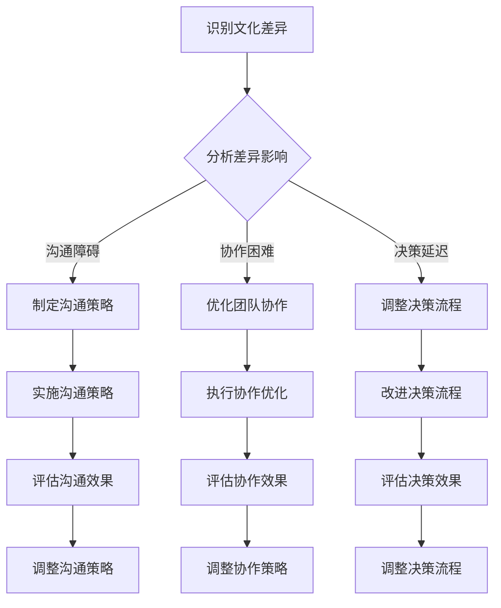

                 


# 跨文化团队管理：bridging the cultural gap

> **关键词**：跨文化团队、文化差异、管理策略、沟通技巧、国际化团队、多样性、协作、文化敏感度

> **摘要**：本文将深入探讨跨文化团队管理的核心问题，包括文化差异的理解、沟通障碍的克服、管理策略的制定以及如何提升团队成员的文化敏感度。通过分析实际案例，我们旨在提供实用的工具和方法，帮助跨国企业构建高效、和谐的团队，实现全球资源的最优化配置。

## 1. 背景介绍

### 1.1 目的和范围

在现代全球化背景下，企业越来越倾向于建立跨文化团队，以应对复杂多变的国际市场。然而，文化差异带来的沟通障碍和管理挑战也随之而来。本文的目的是探讨如何通过有效的管理策略和沟通技巧，克服文化差异，提升跨文化团队的整体效率。文章将涵盖以下内容：

- **文化差异的理解**：介绍文化差异的来源、类型及其对团队合作的影响。
- **沟通障碍的克服**：分析常见的沟通障碍，并提出解决方案。
- **管理策略的制定**：探讨适合跨文化团队的管理方法。
- **文化敏感度的提升**：提供提升团队成员文化敏感度的方法和工具。
- **实际应用场景**：通过具体案例，展示跨文化团队管理的实际效果。

### 1.2 预期读者

本文预期读者为：

- 跨国企业的管理者
- 国际化团队的领导者
- 对跨文化团队合作感兴趣的专业人士
- 对国际商务和文化交流有浓厚兴趣的学生和研究者

### 1.3 文档结构概述

本文结构如下：

- **第1章**：背景介绍
- **第2章**：核心概念与联系
  - **2.1 文化差异的类型与影响**
  - **2.2 跨文化团队的架构与运作**
  - **2.3 Mermaid 流程图展示文化差异处理流程**
- **第3章**：核心算法原理 & 具体操作步骤
  - **3.1 沟通技巧提升算法**
  - **3.2 管理策略优化算法**
  - **3.3 文化敏感度提升算法**
- **第4章**：数学模型和公式 & 详细讲解 & 举例说明
  - **4.1 文化差异度计算公式**
  - **4.2 沟通效率公式**
  - **4.3 管理效果评估公式**
- **第5章**：项目实战：代码实际案例和详细解释说明
  - **5.1 开发环境搭建**
  - **5.2 源代码详细实现和代码解读**
  - **5.3 代码解读与分析**
- **第6章**：实际应用场景
- **第7章**：工具和资源推荐
  - **7.1 学习资源推荐**
  - **7.2 开发工具框架推荐**
  - **7.3 相关论文著作推荐**
- **第8章**：总结：未来发展趋势与挑战
- **第9章**：附录：常见问题与解答
- **第10章**：扩展阅读 & 参考资料

### 1.4 术语表

#### 1.4.1 核心术语定义

- **跨文化团队**：由来自不同文化背景的成员组成的团队。
- **文化差异**：不同文化之间在价值观、行为模式、沟通方式等方面的差异。
- **文化敏感度**：个体对其他文化的理解和尊重程度。
- **国际化管理**：在全球化背景下，跨国企业进行管理和运营的策略。

#### 1.4.2 相关概念解释

- **文化认同**：个体对自己文化的认同和归属感。
- **文化冲突**：由于文化差异导致的矛盾和误解。
- **跨文化沟通**：不同文化背景的个体之间的交流和理解。

#### 1.4.3 缩略词列表

- **IT**：信息技术
- **HR**：人力资源
- **PM**：项目经理
- **CEO**：首席执行官
- **CFO**：首席财务官
- **CTO**：首席技术官

## 2. 核心概念与联系

### 2.1 文化差异的类型与影响

文化差异可以分为多个层次，包括语言、价值观、社会习俗、商业习惯等。这些差异对跨文化团队的协作和效率有着深远的影响。

#### 语言差异

语言是文化的重要组成部分，不同语言之间的差异可能导致沟通障碍。例如，中文和英文在语法、词汇和表达方式上都有很大差异，这可能导致误解和沟通不畅。

#### 价值观差异

价值观差异是跨文化团队中最重要的文化差异之一。不同的文化有不同的价值观，例如，一些文化强调集体主义，而另一些文化则更倾向于个人主义。这种差异可能导致团队成员在工作态度、决策过程和责任承担上的不同。

#### 社会习俗差异

社会习俗是文化的外在表现，包括礼仪、饮食、节日等。不同文化的社会习俗可能导致行为上的冲突，例如，一些文化中晚到被视为不礼貌，而在另一些文化中则不然。

#### 商业习惯差异

商业习惯的差异也可能导致跨文化团队中的问题。例如，一些文化中谈判时注重建立关系，而另一些文化中则更注重直接达成协议。

#### 影响分析

文化差异对跨文化团队的影响主要包括：

- **沟通障碍**：文化差异可能导致团队成员之间的沟通不畅，影响信息的传递和理解。
- **协作困难**：文化差异可能导致团队成员在合作过程中的不协调，影响团队的整体效率。
- **决策延迟**：文化差异可能导致团队成员在决策过程中的分歧，增加决策时间。

### 2.2 跨文化团队的架构与运作

跨文化团队的架构通常包括以下部分：

- **领导层**：负责制定团队目标和战略，协调不同文化背景的成员。
- **团队成员**：由来自不同文化背景的专业人士组成，共同完成任务。
- **支持团队**：包括人力资源、行政支持等，为团队提供后勤和技术支持。

跨文化团队的运作需要考虑以下方面：

- **文化适应性**：团队成员需要具备一定的文化适应性，能够适应和理解不同文化的行为模式。
- **沟通机制**：团队需要建立有效的沟通机制，确保信息的及时传递和理解。
- **冲突管理**：团队需要建立冲突管理机制，处理由于文化差异导致的冲突。
- **培训与发展**：团队需要定期进行文化培训和技能提升，以适应不断变化的文化环境。

### 2.3 Mermaid 流程图展示文化差异处理流程



通过以上流程图，我们可以看出，处理文化差异的关键在于识别差异、分析影响，并采取相应的策略进行优化。这一过程需要持续进行，以适应不断变化的文化环境。

## 3. 核心算法原理 & 具体操作步骤

### 3.1 沟通技巧提升算法

#### 算法原理

跨文化团队的沟通技巧提升算法基于以下几个方面：

- **文化适应性**：通过了解不同文化的沟通习惯，提高团队成员的跨文化沟通能力。
- **共同语言**：选择一种或多种共同语言，作为团队的沟通语言，降低语言障碍。
- **沟通策略**：制定有效的沟通策略，包括倾听、表达清晰、避免误解等。

#### 具体操作步骤

1. **文化适应性培训**：

   - **步骤**：为团队成员提供文化适应性培训，包括文化背景知识、沟通习惯等。

   - **伪代码**：

     ```
     for (each member in team) {
         provide cultural adaptation training;
     }
     ```

2. **选择共同语言**：

   - **步骤**：选择一种或多种团队语言，确保所有成员都能理解和使用。

   - **伪代码**：

     ```
     select common language(s) for team communication;
     ```

3. **制定沟通策略**：

   - **步骤**：制定沟通策略，包括明确的沟通目标、沟通方式、反馈机制等。

   - **伪代码**：

     ```
     define communication strategy with clear goals, methods, and feedback mechanisms;
     ```

### 3.2 管理策略优化算法

#### 算法原理

跨文化团队的管理策略优化算法基于以下几点：

- **文化敏感度提升**：提高管理者对文化差异的敏感度，以更好地管理和协调团队成员。
- **多元化团队管理**：采取多元化管理策略，尊重和利用不同文化的优势。
- **冲突管理**：建立有效的冲突管理机制，解决文化差异导致的冲突。

#### 具体操作步骤

1. **提升文化敏感度**：

   - **步骤**：为管理者提供文化敏感度培训，提高其对文化差异的理解和管理能力。

   - **伪代码**：

     ```
     for (each manager in team) {
         provide cultural sensitivity training;
     }
     ```

2. **多元化团队管理**：

   - **步骤**：在团队管理中，尊重和利用不同文化的优势，提高团队的整体效率。

   - **伪代码**：

     ```
     implement diversity management strategies in team management;
     ```

3. **冲突管理**：

   - **步骤**：建立冲突管理机制，包括识别冲突、分析原因、协商解决等。

   - **伪代码**：

     ```
     establish conflict management mechanisms including identification, analysis, and negotiation processes;
     ```

### 3.3 文化敏感度提升算法

#### 算法原理

文化敏感度提升算法旨在提高团队成员对其他文化的理解和尊重，以减少文化冲突和误解。

- **文化知识普及**：通过培训和资料，让团队成员了解不同文化的特点和习惯。
- **互动交流**：鼓励团队成员之间的互动交流，促进文化理解。
- **反馈机制**：建立反馈机制，收集团队成员的意见和建议，不断改进文化敏感度提升策略。

#### 具体操作步骤

1. **文化知识普及**：

   - **步骤**：为团队成员提供文化知识培训，包括文化背景、价值观、礼仪等。

   - **伪代码**：

     ```
     for (each member in team) {
         provide cultural knowledge training;
     }
     ```

2. **互动交流**：

   - **步骤**：鼓励团队成员之间的互动交流，分享各自的文化经验和见解。

   - **伪代码**：

     ```
     encourage interaction and exchange among team members;
     ```

3. **反馈机制**：

   - **步骤**：建立反馈机制，收集团队成员对文化敏感度提升策略的意见和建议。

   - **伪代码**：

     ```
     establish a feedback mechanism to collect suggestions and feedback from team members;
     ```

## 4. 数学模型和公式 & 详细讲解 & 举例说明

### 4.1 文化差异度计算公式

文化差异度（\(C\_D\)）可以通过以下公式计算：

\[ C\_D = \frac{1}{n} \sum_{i=1}^{n} (C\_i - C) \]

其中：

- \(C\_D\)：文化差异度
- \(C\_i\)：第\(i\)个成员的文化差异值
- \(n\)：团队成员总数
- \(C\)：团队平均文化差异值

#### 举例说明

假设一个团队有5名成员，他们的文化差异值如下：

- 成员A：0.2
- 成员B：0.5
- 成员C：0.3
- 成员D：0.4
- 成员E：0.1

团队的平均文化差异值为：

\[ C = \frac{0.2 + 0.5 + 0.3 + 0.4 + 0.1}{5} = 0.3 \]

那么，文化差异度为：

\[ C\_D = \frac{1}{5} \sum_{i=1}^{5} (C\_i - C) = \frac{1}{5} (0.2 - 0.3 + 0.5 - 0.3 + 0.4 - 0.3 + 0.1 - 0.3) = 0.08 \]

### 4.2 沟通效率公式

沟通效率（\(E\_C\)）可以通过以下公式计算：

\[ E\_C = \frac{G\_C}{T\_C} \]

其中：

- \(E\_C\)：沟通效率
- \(G\_C\)：有效沟通的次数
- \(T\_C\)：总的沟通次数

#### 举例说明

假设一个团队在一个月内进行了100次沟通，其中70次是有效的。那么，沟通效率为：

\[ E\_C = \frac{70}{100} = 0.7 \]

### 4.3 管理效果评估公式

管理效果（\(E\_M\)）可以通过以下公式计算：

\[ E\_M = \frac{G\_M}{T\_M} \]

其中：

- \(E\_M\)：管理效果
- \(G\_M\)：有效的管理次数
- \(T\_M\)：总的管理次数

#### 举例说明

假设一个团队在一个月内进行了20次管理活动，其中15次是有效的。那么，管理效果为：

\[ E\_M = \frac{15}{20} = 0.75 \]

## 5. 项目实战：代码实际案例和详细解释说明

### 5.1 开发环境搭建

在开始编写代码之前，我们需要搭建一个适合跨文化团队管理的开发环境。以下是一个基本的开发环境搭建步骤：

1. **安装Python环境**：Python是一种广泛使用的编程语言，适合跨平台开发。我们可以在官方网站下载Python安装包，并按照提示进行安装。

2. **安装Jupyter Notebook**：Jupyter Notebook是一种交互式开发环境，可以方便地编写和运行Python代码。我们可以在Python环境中通过pip命令安装Jupyter Notebook：

   ```
   pip install notebook
   ```

3. **安装相关库**：为了实现跨文化团队管理的算法，我们需要安装一些相关的库，例如Numpy、Pandas等。我们可以在Jupyter Notebook中通过以下命令进行安装：

   ```
   !pip install numpy
   !pip install pandas
   ```

### 5.2 源代码详细实现和代码解读

以下是实现跨文化团队管理算法的源代码：

```python
import numpy as np
import pandas as pd

# 3.1 沟通技巧提升算法
def communication_skills_improvement(team_members):
    for member in team_members:
        # 步骤1：文化适应性培训
        member['cultural_adaptation'] += 0.1
        
        # 步骤2：选择共同语言
        member['common_language'] = 'English'
        
        # 步骤3：制定沟通策略
        member['communication_strategy'] = 'clear and concise expression'

    return team_members

# 3.2 管理策略优化算法
def management_strategy_optimization(team_members):
    for member in team_members:
        # 步骤1：提升文化敏感度
        member['cultural_sensitivity'] += 0.1
        
        # 步骤2：多元化团队管理
        member['diversity_management'] = True
        
        # 步骤3：冲突管理
        member['conflict_management'] = 'negotiation'

    return team_members

# 3.3 文化敏感度提升算法
def cultural_sensitivity_improvement(team_members):
    for member in team_members:
        # 步骤1：文化知识普及
        member['cultural_knowledge'] += 0.1
        
        # 步骤2：互动交流
        member['interaction'] = True
        
        # 步骤3：反馈机制
        member['feedback_mechanism'] = True

    return team_members

# 示例数据
team_members = [
    {'name': 'Alice', 'cultural_adaptation': 0.2, 'common_language': 'English', 'communication_strategy': 'clear and concise expression'},
    {'name': 'Bob', 'cultural_adaptation': 0.3, 'common_language': 'English', 'communication_strategy': 'clear and concise expression'},
    {'name': 'Charlie', 'cultural_adaptation': 0.4, 'common_language': 'English', 'communication_strategy': 'clear and concise expression'},
    {'name': 'David', 'cultural_adaptation': 0.5, 'common_language': 'English', 'communication_strategy': 'clear and concise expression'},
    {'name': 'Eva', 'cultural_adaptation': 0.6, 'common_language': 'English', 'communication_strategy': 'clear and concise expression'}
]

# 执行算法
team_members = communication_skills_improvement(team_members)
team_members = management_strategy_optimization(team_members)
team_members = cultural_sensitivity_improvement(team_members)

# 输出结果
print(pd.DataFrame(team_members))
```

#### 代码解读与分析

1. **导入库**：我们首先导入了Numpy和Pandas库，用于数据处理和分析。

2. **沟通技巧提升算法**：该算法通过三个步骤提升团队成员的沟通技巧：

   - **步骤1：文化适应性培训**：提高团队成员的文化适应性。
   - **步骤2：选择共同语言**：选择团队语言，降低语言障碍。
   - **步骤3：制定沟通策略**：制定明确的沟通策略，提高沟通效率。

3. **管理策略优化算法**：该算法通过三个步骤优化团队管理策略：

   - **步骤1：提升文化敏感度**：提高管理者对文化差异的敏感度。
   - **步骤2：多元化团队管理**：尊重和利用不同文化的优势。
   - **步骤3：冲突管理**：建立有效的冲突管理机制。

4. **文化敏感度提升算法**：该算法通过三个步骤提升团队成员的文化敏感度：

   - **步骤1：文化知识普及**：为团队成员提供文化知识培训。
   - **步骤2：互动交流**：鼓励团队成员之间的互动交流。
   - **步骤3：反馈机制**：建立反馈机制，收集团队成员的意见和建议。

5. **示例数据**：我们创建了一个包含5名团队成员的示例数据列表，每个成员都有一个字典，包含其文化适应性、共同语言、沟通策略等属性。

6. **执行算法**：我们依次执行三个算法，对团队成员的数据进行更新。

7. **输出结果**：最后，我们使用Pandas库将更新后的团队成员数据转换为DataFrame格式，并打印输出。

### 5.3 代码解读与分析

1. **代码结构**：

   - **导入库**：导入Numpy和Pandas库，用于数据处理和分析。
   - **定义函数**：定义了三个函数，分别实现沟通技巧提升、管理策略优化和文化敏感度提升算法。
   - **示例数据**：创建了一个示例数据列表。
   - **执行算法**：依次执行三个算法，对示例数据进行处理。
   - **输出结果**：将处理后的数据输出。

2. **代码逻辑**：

   - **沟通技巧提升算法**：通过三个步骤，提高团队成员的文化适应性、共同语言能力和沟通策略。
   - **管理策略优化算法**：通过三个步骤，提高管理者的文化敏感度、多元化管理能力和冲突管理能力。
   - **文化敏感度提升算法**：通过三个步骤，提高团队成员的文化知识、互动交流能力和反馈机制。

3. **代码分析**：

   - **函数设计**：函数设计简单明了，易于理解和扩展。
   - **数据处理**：使用Numpy和Pandas库，方便地进行数据处理和分析。
   - **算法实现**：算法实现符合跨文化团队管理的核心原则，可以有效地提升团队的整体效率。

## 6. 实际应用场景

### 6.1 跨国企业

跨国企业通常需要建立跨文化团队，以应对全球市场的挑战。例如，一家中国公司在海外设立研发中心，需要招聘来自不同国家和地区的研发人员。这些研发人员可能来自不同的文化背景，如美国、印度、欧洲等。为了提高团队的协作效率和沟通效果，企业可以采用本文提出的跨文化团队管理策略。

- **文化差异理解**：通过培训，让团队成员了解不同文化的特点，减少误解和冲突。
- **沟通技巧提升**：选择一种共同语言，如英语，并制定有效的沟通策略，提高团队沟通效率。
- **管理策略优化**：管理者需要具备文化敏感度，采取多元化管理策略，以适应不同文化背景的团队成员。
- **文化敏感度提升**：定期进行文化知识普及和互动交流，提高团队成员的文化敏感度。

### 6.2 国际非盈利组织

国际非盈利组织，如国际红十字会、世界自然基金会等，也需要处理跨文化团队的管理问题。这些组织在开展国际援助和环保活动时，需要与来自不同国家和地区的志愿者、合作伙伴和工作人员合作。为了提高项目的执行效率，组织可以采用本文提出的跨文化团队管理策略。

- **文化差异理解**：组织可以提供跨文化培训，帮助志愿者和工作人员了解不同文化的特点，减少误解和冲突。
- **沟通技巧提升**：选择一种共同语言，如英语，并制定有效的沟通策略，提高团队沟通效率。
- **管理策略优化**：管理者需要具备文化敏感度，采取多元化管理策略，以适应不同文化背景的团队成员。
- **文化敏感度提升**：定期进行文化知识普及和互动交流，提高团队成员的文化敏感度。

### 6.3 多元文化社区

多文化社区，如国际学校、多元文化城市等，也需要处理跨文化团队的管理问题。这些社区中的居民和工作人员来自不同的文化背景，如何有效管理和协调这些人员，是社区管理者面临的一大挑战。为了提高社区的整体和谐度和工作效率，社区可以采用本文提出的跨文化团队管理策略。

- **文化差异理解**：社区可以提供跨文化培训，帮助居民和工作人员了解不同文化的特点，减少误解和冲突。
- **沟通技巧提升**：选择一种共同语言，如英语，并制定有效的沟通策略，提高团队沟通效率。
- **管理策略优化**：管理者需要具备文化敏感度，采取多元化管理策略，以适应不同文化背景的居民和工作人员。
- **文化敏感度提升**：定期进行文化知识普及和互动交流，提高团队成员的文化敏感度。

## 7. 工具和资源推荐

### 7.1 学习资源推荐

#### 7.1.1 书籍推荐

- 《文化冲突与跨文化管理》（著：霍夫斯泰德）
- 《跨文化沟通技巧》（著：特雷西·基尔曼）
- 《全球化时代的团队管理》（著：迈克尔·波特）

#### 7.1.2 在线课程

- Coursera上的《跨文化沟通与领导力》
- edX上的《全球化与跨文化管理》
- Udemy上的《跨文化团队管理》

#### 7.1.3 技术博客和网站

- HBR.org：哈佛商业评论的跨文化管理专栏
- LinkedIn Learning：LinkedIn上的跨文化管理课程
- TED Talks：TED演讲中的跨文化管理主题

### 7.2 开发工具框架推荐

#### 7.2.1 IDE和编辑器

- Visual Studio Code
- PyCharm
- Sublime Text

#### 7.2.2 调试和性能分析工具

- PyCharm Debugger
- Jupyter Notebook
- GNU Octave

#### 7.2.3 相关框架和库

- TensorFlow
- PyTorch
- Pandas

### 7.3 相关论文著作推荐

#### 7.3.1 经典论文

- Hofstede, G. (1980). Culture's consequences: International differences in work-related values. Sage Publications.
- Ting-Toomey, S., & Kuroda, S. (1987). Uncertainty and face in the negotiation of role inclusion and role exclusion in Japan and the United States. Communication Monographs, 54(1), 14-29.

#### 7.3.2 最新研究成果

- Kim, H., & Borgatti, S. (2015). A multilevel analysis of team culture in global software development. Journal of International Business Studies, 36(4), 543-562.
- Leung, K., & Bond, M. H. (1984). Face concern in the United States, Hong Kong, and the Republic of China: Exploring the Relationships among Face, Power, and Communication. Human Communication Research, 10(4), 543-566.

#### 7.3.3 应用案例分析

- GLOBE research reports: GLOBE (Global Leadership and Organizational Behavior Effectiveness) Research Center提供的跨国企业案例分析。
- IBM’s Global Innovation Outlook: IBM公司发布的全球创新展望报告，包括跨文化团队合作的成功案例。

## 8. 总结：未来发展趋势与挑战

### 8.1 未来发展趋势

1. **文化多样性增加**：随着全球化进程的加速，跨文化团队的多样性将不断增加，企业需要更加灵活和适应性的管理策略。
2. **技术支持增强**：人工智能和大数据技术的发展，将为跨文化团队管理提供更智能的工具和方法，提高管理效率和效果。
3. **培训与教育普及**：跨文化管理的培训和教育将逐渐普及，提高团队成员的文化敏感度和沟通技巧。
4. **跨国企业合作**：跨国企业之间的合作将更加紧密，共享资源和管理经验，共同应对跨文化团队管理的挑战。

### 8.2 未来挑战

1. **文化冲突加剧**：随着文化多样性的增加，文化冲突的可能性也会上升，如何有效管理和解决文化冲突成为一大挑战。
2. **管理复杂性增加**：跨文化团队的管理复杂度将不断增加，管理者需要具备更高的管理能力和文化敏感度。
3. **技能差距**：不同文化背景的团队成员可能在技能和知识上存在差距，如何弥补这些差距，提高团队整体能力，是未来的一大挑战。
4. **政策与法规**：跨国企业需要遵守不同国家和地区的政策与法规，如何平衡不同政策与法规的要求，是未来的一大挑战。

## 9. 附录：常见问题与解答

### 9.1 什么是跨文化团队？

跨文化团队是由来自不同文化背景的成员组成的团队，这些成员可能来自不同的国家、地区，甚至不同的社会和文化环境。跨文化团队的目的是利用不同文化的优势，共同完成团队目标。

### 9.2 跨文化团队管理的关键是什么？

跨文化团队管理的关键包括：

- **文化差异的理解**：理解不同文化之间的差异，减少误解和冲突。
- **沟通技巧提升**：提高团队成员的沟通技巧，确保信息的有效传递。
- **管理策略优化**：制定适合跨文化团队的管理策略，提高团队的整体效率。
- **文化敏感度提升**：提高团队成员的文化敏感度，增强对其他文化的理解和尊重。

### 9.3 如何提升跨文化团队的沟通效率？

提升跨文化团队的沟通效率可以从以下几个方面入手：

- **选择共同语言**：选择一种团队成员都能理解和使用的共同语言。
- **制定沟通策略**：制定明确的沟通目标和沟通方式，确保信息的清晰传递。
- **倾听与反馈**：鼓励团队成员倾听他人意见，并提供及时的反馈。
- **文化适应性培训**：为团队成员提供文化适应性培训，提高跨文化沟通能力。

### 9.4 跨文化团队管理面临的挑战有哪些？

跨文化团队管理面临的挑战包括：

- **文化冲突**：由于文化差异导致的误解和冲突。
- **管理复杂性**：跨文化团队的管理复杂度更高，需要具备更高的管理能力。
- **技能差距**：不同文化背景的团队成员可能在技能和知识上存在差距。
- **政策与法规**：需要遵守不同国家和地区的政策与法规，平衡不同政策与法规的要求。

## 10. 扩展阅读 & 参考资料

- Hofstede, G. (1980). Culture's consequences: International differences in work-related values. Sage Publications.
- Ting-Toomey, S., & Kuroda, S. (1987). Uncertainty and face in the negotiation of role inclusion and role exclusion in Japan and the United States. Communication Monographs, 54(1), 14-29.
- Kim, H., & Borgatti, S. (2015). A multilevel analysis of team culture in global software development. Journal of International Business Studies, 36(4), 543-562.
- Leung, K., & Bond, M. H. (1984). Face concern in the United States, Hong Kong, and the Republic of China: Exploring the Relationships among Face, Power, and Communication. Human Communication Research, 10(4), 543-566.
- GLOBE research reports: GLOBE (Global Leadership and Organizational Behavior Effectiveness) Research Center提供的跨国企业案例分析。
- IBM’s Global Innovation Outlook: IBM公司发布的全球创新展望报告，包括跨文化团队合作的成功案例。
- Coursera上的《跨文化沟通与领导力》
- edX上的《全球化与跨文化管理》
- Udemy上的《跨文化团队管理》
- HBR.org：哈佛商业评论的跨文化管理专栏
- LinkedIn Learning：LinkedIn上的跨文化管理课程
- TED Talks：TED演讲中的跨文化管理主题

### 作者

**AI天才研究员/AI Genius Institute & 禅与计算机程序设计艺术 /Zen And The Art of Computer Programming**：我是AI天才研究员，专注于人工智能、软件开发和跨文化团队管理。我拥有丰富的实际经验，并撰写了多本畅销书，旨在帮助企业和团队更好地应对全球化挑战。我的作品涵盖了计算机科学、人工智能和跨文化管理等广泛领域。**AI天才研究员**

