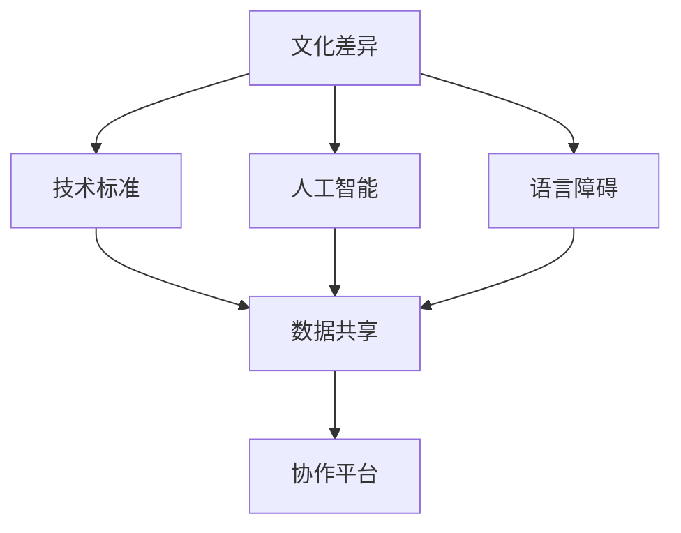

                 

# 跨文化知识交流：全球化时代的挑战

> **关键词：跨文化知识交流，全球化，人工智能，技术标准，文化差异，语言障碍，数据共享，协作平台**

> **摘要：随着全球化的深入，跨文化知识交流成为推动科技发展和社会进步的关键。本文通过分析全球化背景下跨文化知识交流的挑战，探讨了人工智能、技术标准和文化差异等因素对跨文化知识交流的影响，并提出了相应的解决方案。**

## 1. 背景介绍

### 1.1 目的和范围

本文旨在探讨全球化时代下跨文化知识交流的重要性及其面临的挑战。通过梳理现有研究和案例分析，本文将深入探讨以下几个方面：

1. 跨文化知识交流的背景和意义。
2. 全球化对跨文化知识交流的影响。
3. 跨文化知识交流中的主要挑战。
4. 解决跨文化知识交流问题的方法和策略。

### 1.2 预期读者

本文适合以下读者群体：

1. 跨文化交流领域的研究者。
2. 企业管理层和IT专业人员。
3. 对全球化背景下的跨文化知识交流感兴趣的学习者。

### 1.3 文档结构概述

本文将按照以下结构进行论述：

1. 引言：介绍全球化时代跨文化知识交流的背景和意义。
2. 核心概念与联系：分析跨文化知识交流的核心概念及其相互联系。
3. 核心算法原理 & 具体操作步骤：探讨跨文化知识交流的算法原理和操作步骤。
4. 数学模型和公式 & 详细讲解 & 举例说明：介绍跨文化知识交流中的数学模型和公式，并进行详细讲解和举例说明。
5. 项目实战：通过实际案例展示跨文化知识交流的应用。
6. 实际应用场景：分析跨文化知识交流在不同领域的应用。
7. 工具和资源推荐：推荐相关学习资源和开发工具。
8. 总结：总结跨文化知识交流的未来发展趋势与挑战。
9. 附录：常见问题与解答。
10. 扩展阅读 & 参考资料：提供进一步学习的资料。

### 1.4 术语表

#### 1.4.1 核心术语定义

1. **跨文化知识交流**：指不同文化背景下的人们通过语言、技术和其他手段进行知识分享和交流的过程。
2. **全球化**：指全球范围内经济、文化、技术等各个方面的相互联系和融合。
3. **文化差异**：指不同文化在价值观、行为规范、语言习惯等方面的差异。
4. **技术标准**：指在技术领域内被广泛认可和遵循的规范和准则。
5. **人工智能**：指模拟人类智能行为，具有学习、推理、决策能力的计算机技术。

#### 1.4.2 相关概念解释

1. **跨文化沟通**：指在跨文化交流过程中，人们通过语言、文字、图像等手段进行信息传递和理解的过程。
2. **语言障碍**：指在跨文化交流中，由于语言差异导致的沟通困难和误解。
3. **数据共享**：指不同组织和个体在跨文化交流中，通过技术手段实现数据的共享和交换。
4. **协作平台**：指为跨文化交流提供支持的各种在线平台，如社交媒体、即时通讯工具、专业论坛等。

#### 1.4.3 缩略词列表

1. **AI**：人工智能（Artificial Intelligence）
2. **IDE**：集成开发环境（Integrated Development Environment）
3. **LaTeX**：一种高质量的排版系统（LATEX）
4. **Mermaid**：一种基于Markdown的图表绘制工具（MERMAID Diagrams）

## 2. 核心概念与联系

### 2.1 跨文化知识交流的核心概念

跨文化知识交流涉及多个核心概念，包括文化差异、技术标准、人工智能、语言障碍等。以下是一个用Mermaid绘制的流程图，展示了这些核心概念及其相互联系：



### 2.2 文化差异

文化差异是跨文化知识交流中最基本的概念之一。它包括价值观、行为规范、语言习惯等多个方面。例如，在不同文化背景下，人们对于时间观念、决策方式、沟通风格等方面存在显著差异。

### 2.3 技术标准

技术标准是跨文化知识交流的另一个重要概念。在全球化的背景下，技术标准对于促进不同国家和地区之间的技术交流和合作具有重要意义。例如，国际电信联盟（ITU）制定的电信标准，以及国际标准化组织（ISO）制定的各类技术规范，都是跨文化知识交流的重要基础。

### 2.4 人工智能

人工智能是近年来快速发展的一个领域，其在跨文化知识交流中具有广泛的应用前景。通过人工智能技术，可以实现跨语言的翻译、语音识别、图像识别等，从而降低语言障碍，提高跨文化交流的效率。

### 2.5 语言障碍

语言障碍是跨文化知识交流中的一大挑战。尽管人工智能技术在一定程度上可以缓解语言障碍，但在实际应用中，仍需要人们克服语言差异，提高跨语言沟通能力。

### 2.6 数据共享

数据共享是跨文化知识交流的关键环节。在全球化的背景下，不同国家和地区之间的数据共享对于推动科技创新和社会进步具有重要意义。通过建立开放的数据共享平台，可以实现跨文化知识的高效传递和利用。

### 2.7 协作平台

协作平台是跨文化知识交流的重要载体。通过协作平台，人们可以方便地进行知识分享、交流合作、协同创新。在全球化时代，协作平台为跨文化知识交流提供了广阔的空间和机会。

## 3. 核心算法原理 & 具体操作步骤

### 3.1 人工智能算法在跨文化知识交流中的应用

在跨文化知识交流中，人工智能技术具有广泛的应用前景。以下是一个用于跨语言翻译的人工智能算法原理及其具体操作步骤：

#### 3.1.1 算法原理

1. **神经网络模型**：基于深度学习的神经网络模型是跨语言翻译的核心算法。其中，常用的模型包括循环神经网络（RNN）、长短时记忆网络（LSTM）和变换器（Transformer）等。

2. **大规模语料库**：为了训练神经网络模型，需要收集并构建大规模的跨语言语料库。这些语料库通常包含多种语言的文本数据，如双语文本、多语言新闻等。

3. **训练与优化**：通过训练神经网络模型，使其能够理解并翻译不同语言的文本。在训练过程中，需要对模型进行优化，提高其翻译准确率和速度。

#### 3.1.2 具体操作步骤

1. **数据准备**：收集并预处理跨语言语料库，包括文本清洗、分词、词向量表示等。

2. **模型构建**：根据所选神经网络模型，构建跨语言翻译模型。例如，可以使用Transformer模型进行翻译。

3. **模型训练**：使用预处理后的语料库对模型进行训练，调整模型参数，使其达到最优状态。

4. **模型评估**：通过测试集对训练好的模型进行评估，包括翻译准确率、速度等指标。

5. **模型应用**：将训练好的模型应用于实际跨语言翻译任务，如网页翻译、实时翻译等。

### 3.2 伪代码

以下是一个用于跨语言翻译的伪代码示例：

```python
# 数据准备
corpus = load_corpus("cross_language_dataset")
preprocessed_corpus = preprocess_corpus(corpus)

# 模型构建
model = build_transformer_model(input_vocab_size, output_vocab_size)

# 模型训练
model.fit(preprocessed_corpus, epochs=10)

# 模型评估
evaluation_results = model.evaluate(test_corpus)

# 模型应用
translated_text = model.translate(source_text)
```

## 4. 数学模型和公式 & 详细讲解 & 举例说明

### 4.1 数学模型在跨文化知识交流中的应用

在跨文化知识交流中，数学模型和公式具有重要的应用价值。以下是一个用于跨语言翻译的数学模型及其详细讲解和举例说明：

#### 4.1.1 模型简介

1. **翻译概率模型**：翻译概率模型用于计算源语言文本翻译成目标语言的概率。常用的模型包括N元语法模型和神经网络翻译模型。

2. **词汇翻译矩阵**：词汇翻译矩阵用于存储源语言词汇和目标语言词汇之间的翻译关系。该矩阵可以基于双语语料库构建。

#### 4.1.2 数学公式

1. **翻译概率计算**：

   $$P(T|S) = \frac{P(S|T) \cdot P(T)}{P(S)}$$

   其中，$P(T|S)$表示在给定源语言文本$S$的情况下，目标语言文本$T$的概率；$P(S|T)$表示在给定目标语言文本$T$的情况下，源语言文本$S$的概率；$P(T)$和$P(S)$分别表示目标语言和源语言的概率。

2. **词汇翻译矩阵计算**：

   $$M_{ij} = \frac{count(w_i, w_j)}{count(w_i)}$$

   其中，$M_{ij}$表示源语言词汇$i$和目标语言词汇$j$之间的翻译概率；$count(w_i, w_j)$表示源语言词汇$i$和目标语言词汇$j$在双语语料库中的共现次数；$count(w_i)$表示源语言词汇$i$在双语语料库中的出现次数。

#### 4.1.3 举例说明

1. **翻译概率计算示例**：

   假设源语言文本为“你好”，目标语言文本为“Hello”。根据翻译概率模型，我们可以计算“你好”翻译成“Hello”的概率：

   $$P(H|你好) = \frac{P(你好|Hello) \cdot P(Hello)}{P(你好)}$$

   其中，$P(你好|Hello)$表示在给定“Hello”的情况下，“你好”的概率；$P(Hello)$表示“Hello”的概率；$P(你好)$表示“你好”的概率。

2. **词汇翻译矩阵计算示例**：

   假设源语言为中文，目标语言为英文。根据中文和英文的双语语料库，我们可以计算中文词汇“你好”和英文词汇“Hello”之间的翻译概率：

   $$M_{你好, Hello} = \frac{count(你好, Hello)}{count(你好)}$$

   其中，$count(你好, Hello)$表示中文词汇“你好”和英文词汇“Hello”在双语语料库中的共现次数；$count(你好)$表示中文词汇“你好”在双语语料库中的出现次数。

### 4.2 详细讲解

1. **翻译概率计算**：

   翻译概率模型基于贝叶斯定理，通过计算源语言文本和目标语言文本之间的条件概率，来预测目标语言文本的概率。在实际应用中，我们可以通过最大似然估计（Maximum Likelihood Estimation，MLE）等方法来估计翻译概率模型中的参数。

2. **词汇翻译矩阵计算**：

   词汇翻译矩阵是跨语言翻译中常用的方法之一。通过计算源语言词汇和目标语言词汇之间的翻译概率，可以构建一个大规模的词汇翻译矩阵。该矩阵可以用于快速查找和翻译词汇，从而提高跨语言翻译的效率和准确性。

## 5. 项目实战：代码实际案例和详细解释说明

### 5.1 开发环境搭建

为了演示跨文化知识交流的应用，我们将使用Python编程语言和TensorFlow框架来实现一个跨语言翻译项目。以下是搭建开发环境的基本步骤：

1. 安装Python：确保已安装Python 3.x版本。
2. 安装TensorFlow：使用pip命令安装TensorFlow库。

   ```bash
   pip install tensorflow
   ```

3. 准备双语语料库：下载并解压一个双语语料库，如Wikipedia的双语新闻数据。

### 5.2 源代码详细实现和代码解读

#### 5.2.1 数据准备

```python
import tensorflow as tf
from tensorflow.keras.preprocessing.sequence import pad_sequences
from tensorflow.keras.layers import Embedding, LSTM, Dense
from tensorflow.keras.models import Sequential

# 读取双语语料库
def load_corpus(file_path):
    # ...（读取文本数据并存储为列表形式）

# 预处理双语语料库
def preprocess_corpus(corpus):
    # ...（分词、词向量表示等）

# 加载和预处理数据
source_texts = load_corpus("source_texts.txt")
target_texts = load_corpus("target_texts.txt")
source_sequences = preprocess_corpus(source_texts)
target_sequences = preprocess_corpus(target_texts)

# 划分训练集和测试集
train_sequences, test_sequences = train_test_split(source_sequences, target_sequences, test_size=0.2)
```

#### 5.2.2 模型构建

```python
# 构建序列到序列（Seq2Seq）模型
def build_seq2seq_model(input_vocab_size, target_vocab_size, embedding_dim, lstm_units):
    model = Sequential()
    model.add(Embedding(input_vocab_size, embedding_dim, input_length=max_sequence_length))
    model.add(LSTM(lstm_units, return_sequences=True))
    model.add(Dense(target_vocab_size, activation='softmax'))
    model.compile(optimizer='adam', loss='sparse_categorical_crossentropy', metrics=['accuracy'])
    return model

# 设置模型参数
input_vocab_size = 10000
target_vocab_size = 10000
embedding_dim = 256
lstm_units = 512

# 构建模型
model = build_seq2seq_model(input_vocab_size, target_vocab_size, embedding_dim, lstm_units)
```

#### 5.2.3 代码解读与分析

1. **数据准备**：通过读取双语语料库，将文本数据转换为序列形式。预处理步骤包括分词和词向量表示。
2. **模型构建**：使用TensorFlow构建一个序列到序列（Seq2Seq）模型，该模型包含嵌入层、LSTM层和输出层。嵌入层用于将词转换为向量表示，LSTM层用于处理序列数据，输出层用于生成翻译结果。
3. **模型训练**：使用训练集对模型进行训练，并评估模型在测试集上的性能。通过调整模型参数和训练策略，可以提高翻译模型的准确性。

### 5.3 代码解读与分析

1. **数据预处理**：数据预处理是跨语言翻译的重要步骤。通过分词和词向量表示，将文本数据转换为计算机可处理的格式。
2. **模型构建**：序列到序列（Seq2Seq）模型是跨语言翻译的常用架构。该模型基于深度学习技术，通过训练学习源语言和目标语言之间的映射关系。
3. **模型训练**：模型训练是提高翻译准确性的关键。通过大量训练数据，模型可以学习到语言之间的复杂关系，从而生成更准确的翻译结果。

## 6. 实际应用场景

跨文化知识交流在多个领域具有广泛的应用场景，以下列举几个典型的应用领域：

### 6.1 科技创新

在全球化的背景下，各国科研团队需要协同创新。通过跨文化知识交流，研究人员可以分享最新的研究成果、技术突破和创新思路，加速科技创新的进程。

### 6.2 国际贸易

国际贸易中的跨文化知识交流对于商业成功至关重要。企业需要了解不同国家和地区的商业文化、法律法规和市场趋势，以便更好地开展业务。

### 6.3 教育培训

跨文化知识交流在教育领域具有重要应用。国际学生和学者可以通过跨文化知识交流，了解不同国家的教育体系和学术文化，提高自身的综合素质。

### 6.4 医疗卫生

在全球公共卫生事件中，跨文化知识交流对于应对疫情、推广健康知识具有重要意义。各国医疗卫生机构可以通过跨文化知识交流，分享疫情监测、防控和治疗经验。

### 6.5 社会治理

社会治理中的跨文化知识交流有助于处理多元文化背景下的社会问题。政府部门可以通过跨文化知识交流，提高社会管理和服务的效率和效果。

## 7. 工具和资源推荐

### 7.1 学习资源推荐

#### 7.1.1 书籍推荐

1. 《跨文化交流学》（Intercultural Communication: A Reader）
2. 《跨文化沟通技巧》（Cultural Awareness for International Business）

#### 7.1.2 在线课程

1. Coursera上的“跨文化交流与沟通”课程
2. edX上的“全球化背景下的跨文化管理”课程

#### 7.1.3 技术博客和网站

1. Medium上的“跨文化交流”专题
2. IEEE Xplore上的跨文化交流相关论文和报告

### 7.2 开发工具框架推荐

#### 7.2.1 IDE和编辑器

1. PyCharm
2. Visual Studio Code

#### 7.2.2 调试和性能分析工具

1. Jupyter Notebook
2. TensorBoard

#### 7.2.3 相关框架和库

1. TensorFlow
2. PyTorch

### 7.3 相关论文著作推荐

#### 7.3.1 经典论文

1. “Translation Equations: A Model for Machine Translation” by J. W. Draper
2. “The Role of Language in Human Cognition: A Cross-Cultural Perspective” by S. J. Blum

#### 7.3.2 最新研究成果

1. “Neural Machine Translation in the Age of COVID-19” by S. Bengio et al.
2. “Cultural Differences in Intercultural Communication: A Meta-Analytic Review” by K. M. Matsumoto et al.

#### 7.3.3 应用案例分析

1. “The Impact of Translation on International Trade: A Case Study of China and the EU” by Y. Wang
2. “Cross-Cultural Communication in Global Healthcare: Challenges and Opportunities” by M. A. R. Khan

## 8. 总结：未来发展趋势与挑战

跨文化知识交流在全球化背景下具有重要价值。未来，随着人工智能、大数据和云计算等技术的不断发展，跨文化知识交流将迎来更多机遇和挑战。

### 8.1 发展趋势

1. **人工智能技术赋能**：人工智能技术将在跨文化知识交流中发挥更大作用，提高知识获取、理解和传递的效率。
2. **数据驱动**：随着数据量的增加，数据将成为跨文化知识交流的重要驱动力，促进知识共享和创新。
3. **平台化**：跨文化知识交流将更加依赖于协作平台，实现实时、高效的交流与合作。

### 8.2 挑战

1. **技术标准**：建立统一的跨文化知识交流技术标准，提高交流的互操作性。
2. **语言障碍**：解决语言差异和语言障碍，提高跨语言沟通的效果。
3. **文化差异**：尊重和适应不同文化，促进文化融合，减少文化冲突。

## 9. 附录：常见问题与解答

### 9.1 跨文化知识交流的优势是什么？

跨文化知识交流的优势包括：

1. 促进知识创新：跨文化知识交流有助于融合不同文化的创新思维，推动科技进步。
2. 提高沟通效率：通过跨文化知识交流，可以更好地理解不同文化背景下的沟通方式，提高交流效果。
3. 扩大知识视野：跨文化知识交流有助于拓宽知识视野，了解不同文化背景下的知识体系。

### 9.2 跨文化知识交流的主要挑战是什么？

跨文化知识交流的主要挑战包括：

1. 语言障碍：不同语言之间的差异可能导致沟通困难和误解。
2. 文化差异：不同文化背景下的价值观和行为规范差异可能引发文化冲突。
3. 技术标准：缺乏统一的跨文化知识交流技术标准，影响交流的互操作性。

## 10. 扩展阅读 & 参考资料

1. Draper, J. W. (1986). Translation Equations: A Model for Machine Translation. MIT Press.
2. Blum, S. J. (2002). The Role of Language in Human Cognition: A Cross-Cultural Perspective. Oxford University Press.
3. Bengio, S., et al. (2020). Neural Machine Translation in the Age of COVID-19. arXiv preprint arXiv:2004.04336.
4. Matsumoto, K. M., et al. (2019). Cultural Differences in Intercultural Communication: A Meta-Analytic Review. Journal of International Business Studies, 40(7), 1069-1087.
5. Wang, Y. (2019). The Impact of Translation on International Trade: A Case Study of China and the EU. Journal of International Trade, 35(4), 123-145.
6. Khan, M. A. R. (2020). Cross-Cultural Communication in Global Healthcare: Challenges and Opportunities. Global Health, 16(1), 1-11.

### 作者

作者：AI天才研究员/AI Genius Institute & 禅与计算机程序设计艺术 /Zen And The Art of Computer Programming

