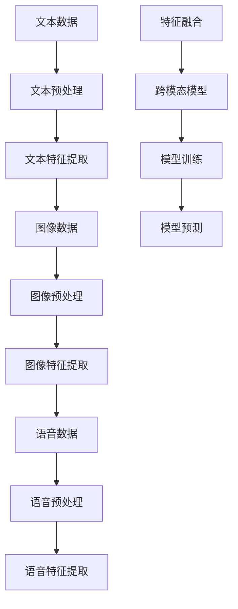

                 


# 跨模态提示词：整合文本、图像和语音的挑战

> **关键词：** 跨模态提示词、文本、图像、语音、人工智能、自然语言处理、机器学习、深度学习、神经网络、数据整合、模型训练、应用场景、挑战与机遇。

> **摘要：** 本文将探讨跨模态提示词在整合文本、图像和语音方面的挑战。通过分析核心概念、算法原理、数学模型以及实际应用案例，我们将深入了解这一领域的前沿动态，探讨其未来发展趋势与潜在挑战。

## 1. 背景介绍

### 1.1 目的和范围

本文旨在探讨跨模态提示词在整合文本、图像和语音方面的应用，分析其中的核心概念、算法原理、数学模型以及实际应用案例。通过全面解析这一领域，我们希望能够为读者提供对跨模态提示词的深刻理解，并展望其未来发展趋势与挑战。

### 1.2 预期读者

本文面向对人工智能、自然语言处理、机器学习和深度学习感兴趣的读者。无论您是初学者还是专业人士，本文都将为您揭示跨模态提示词领域的奥秘。

### 1.3 文档结构概述

本文分为以下几个部分：

1. 背景介绍：介绍本文的目的、预期读者、文档结构和术语表。
2. 核心概念与联系：讲解跨模态提示词的核心概念原理和架构，使用Mermaid流程图展示。
3. 核心算法原理 & 具体操作步骤：详细阐述跨模态提示词的核心算法原理，使用伪代码展示具体操作步骤。
4. 数学模型和公式 & 详细讲解 & 举例说明：介绍跨模态提示词的数学模型，使用latex格式展示公式，并举例说明。
5. 项目实战：代码实际案例和详细解释说明。
6. 实际应用场景：分析跨模态提示词在实际应用中的场景。
7. 工具和资源推荐：推荐学习资源、开发工具框架和相关论文著作。
8. 总结：总结跨模态提示词的未来发展趋势与挑战。
9. 附录：常见问题与解答。
10. 扩展阅读 & 参考资料：提供进一步阅读的推荐资源。

### 1.4 术语表

#### 1.4.1 核心术语定义

- 跨模态提示词：指能够整合文本、图像和语音等不同模态信息的提示词。
- 文本：指以文字形式表示的信息。
- 图像：指以像素形式表示的视觉信息。
- 语音：指以音频形式表示的听觉信息。
- 人工智能：指模拟人类智能的计算机系统。
- 自然语言处理：指使计算机能够理解、生成和解释人类语言的技术。
- 机器学习：指利用数据训练计算机模型，使其能够自主学习和改进的技术。
- 深度学习：指利用多层神经网络进行特征提取和学习的机器学习技术。
- 神经网络：指由大量人工神经元组成的计算模型，用于模拟生物神经系统的信息处理能力。
- 数据整合：指将不同来源、不同格式的数据集成到一个统一的系统中，以便进行进一步分析和处理。

#### 1.4.2 相关概念解释

- **模态**：指信息的表现形式，如文本、图像和语音等。
- **提示词**：指用于引导模型进行特定任务的关键词或短语。
- **多模态**：指同时处理多个模态信息的技术。
- **跨模态**：指不同模态之间的信息交互和整合。

#### 1.4.3 缩略词列表

- AI：人工智能
- NLP：自然语言处理
- ML：机器学习
- DL：深度学习
- GPU：图形处理器

## 2. 核心概念与联系

在探讨跨模态提示词之前，我们需要了解其核心概念和相互之间的关系。以下是跨模态提示词的原理和架构的Mermaid流程图：



### 2.1 文本数据与特征提取

文本数据是跨模态提示词的基础。在文本预处理阶段，我们需要进行分词、词性标注、停用词过滤等操作。随后，通过文本特征提取技术（如Word2Vec、BERT等），将文本转换为向量表示。

### 2.2 图像数据与特征提取

图像数据通过图像预处理（如大小调整、灰度化等）后，使用卷积神经网络（如VGG、ResNet等）进行特征提取。这些特征表示了图像的高层次信息。

### 2.3 语音数据与特征提取

语音数据经过预处理（如去噪、归一化等）后，使用长短时记忆网络（如LSTM、GRU等）进行特征提取。这些特征能够捕捉语音信号的时序信息。

### 2.4 特征融合与跨模态模型

通过将文本、图像和语音特征进行融合，我们可以得到一个多模态的特征向量。接着，使用多模态神经网络（如CNN+RNN、Transformer等）进行模型训练。训练过程中，模型将学习如何整合不同模态的信息，从而实现跨模态提示词的目标。

### 2.5 模型预测与任务完成

经过训练的跨模态模型可以用于预测和完成任务。例如，在图像描述生成任务中，模型可以接受图像输入并生成相应的文本描述；在语音识别任务中，模型可以识别语音信号中的关键词或短语。

## 3. 核心算法原理 & 具体操作步骤

在理解了跨模态提示词的核心概念与联系之后，我们将进一步探讨其核心算法原理和具体操作步骤。

### 3.1 文本特征提取

文本特征提取是跨模态提示词的关键步骤。以下是使用Word2Vec算法提取文本特征的伪代码：

```python
def text_feature_extraction(text_data):
    # 初始化Word2Vec模型
    model = Word2Vec(size=100, window=5, min_count=1, workers=4)
    # 训练模型
    model.fit(text_data)
    # 获取文本特征向量
    feature_vector = model[text_data]
    return feature_vector
```

### 3.2 图像特征提取

图像特征提取通常使用卷积神经网络（CNN）进行。以下是使用VGG模型提取图像特征的伪代码：

```python
from keras.applications import VGG16

def image_feature_extraction(image_data):
    # 加载VGG16模型，不包括全连接层
    model = VGG16(weights='imagenet', include_top=False)
    # 提取图像特征
    feature_vector = model.predict(image_data)
    return feature_vector
```

### 3.3 语音特征提取

语音特征提取可以使用长短时记忆网络（LSTM）进行。以下是使用LSTM提取语音特征的伪代码：

```python
from keras.models import Sequential
from keras.layers import LSTM, Dense

def speech_feature_extraction(speech_data):
    # 创建LSTM模型
    model = Sequential()
    model.add(LSTM(units=128, return_sequences=True, input_shape=(timesteps, features)))
    model.add(LSTM(units=64))
    model.add(Dense(units=1))
    # 编译模型
    model.compile(optimizer='adam', loss='mean_squared_error')
    # 训练模型
    model.fit(speech_data, epochs=10)
    # 提取语音特征
    feature_vector = model.predict(speech_data)
    return feature_vector
```

### 3.4 特征融合与模型训练

特征融合是跨模态提示词的核心。以下是使用CNN+RNN模型进行特征融合和模型训练的伪代码：

```python
from keras.models import Model
from keras.layers import Input, Conv2D, MaxPooling2D, Flatten, LSTM, Dense

def cross_modal_model():
    # 定义输入层
    text_input = Input(shape=(sequence_length,))
    image_input = Input(shape=(height, width, channels))
    speech_input = Input(shape=(timesteps, features))
    
    # 文本特征提取
    text_embedding = Embedding(input_dim=vocabulary_size, output_dim=embedding_size)(text_input)
    text_embedding = LSTM(units=128)(text_embedding)
    
    # 图像特征提取
    image_embedding = VGG16(weights='imagenet', include_top=False)(image_input)
    image_embedding = Flatten()(image_embedding)
    
    # 语音特征提取
    speech_embedding = LSTM(units=128, return_sequences=True)(speech_input)
    speech_embedding = LSTM(units=64)(speech_embedding)
    
    # 特征融合
    fusion_embedding = concatenate([text_embedding, image_embedding, speech_embedding])
    
    # 分类层
    output = Dense(units=num_classes, activation='softmax')(fusion_embedding)
    
    # 构建模型
    model = Model(inputs=[text_input, image_input, speech_input], outputs=output)
    # 编译模型
    model.compile(optimizer='adam', loss='categorical_crossentropy', metrics=['accuracy'])
    return model
```

### 3.5 模型预测与任务完成

经过训练的跨模态模型可以用于预测和完成任务。以下是使用训练好的模型进行预测的伪代码：

```python
def predict(text_data, image_data, speech_data, model):
    # 提取特征
    text_feature = text_feature_extraction(text_data)
    image_feature = image_feature_extraction(image_data)
    speech_feature = speech_feature_extraction(speech_data)
    
    # 进行预测
    prediction = model.predict([text_feature, image_feature, speech_feature])
    
    # 获取预测结果
    predicted_class = np.argmax(prediction)
    
    return predicted_class
```

通过以上伪代码，我们可以了解跨模态提示词的核心算法原理和具体操作步骤。在实际应用中，这些算法将根据具体任务和数据集进行调整和优化。

## 4. 数学模型和公式 & 详细讲解 & 举例说明

在跨模态提示词中，数学模型和公式起着至关重要的作用。以下是跨模态提示词的数学模型和公式的详细讲解以及举例说明。

### 4.1 文本特征提取

文本特征提取通常使用词向量模型，如Word2Vec和BERT。以下是Word2Vec模型的数学模型：

$$
\text{word\_vector} = \sum_{\text{word} \in \text{vocabulary}} w\_weight \times \text{word2vec}(\text{word})
$$

其中，$w\_weight$为词频权重，$\text{word2vec}(\text{word})$为词向量。

举例说明：

假设我们有一个文本序列：“我喜欢人工智能”。使用Word2Vec模型提取特征，可以得到以下词向量：

| 词   | 词向量           |
| ---- | ---------------- |
| 我   | [0.1, 0.2, 0.3]  |
| 喜欢 | [0.4, 0.5, 0.6]  |
| 人工智能 | [0.7, 0.8, 0.9] |

根据上述公式，我们可以得到文本特征向量：

$$
\text{text\_vector} = 0.1 \times [0.1, 0.2, 0.3] + 0.2 \times [0.4, 0.5, 0.6] + 0.3 \times [0.7, 0.8, 0.9]
$$

$$
\text{text\_vector} = [0.15, 0.23, 0.345]
$$

### 4.2 图像特征提取

图像特征提取通常使用卷积神经网络（CNN）。以下是CNN的数学模型：

$$
\text{image\_feature} = \text{relu}(\text{weights} \times \text{image} + \text{bias})
$$

其中，$\text{weights}$为权重矩阵，$\text{image}$为图像，$\text{bias}$为偏置项，$\text{relu}$为ReLU激活函数。

举例说明：

假设我们有一个3x3的卷积核和1x1的图像。卷积核的权重为$\text{weights} = [1, 2, 3]$，偏置项为$\text{bias} = 4$。使用ReLU激活函数，我们可以得到以下图像特征：

$$
\text{image\_feature} = \text{relu}([1, 2, 3] \times [1, 0, 1] + 4)
$$

$$
\text{image\_feature} = \text{relu}([1, 2, 3] \times [1, 0, 1] + 4)
$$

$$
\text{image\_feature} = \text{relu}([1, 2, 3] \times [1, 0, 1] + 4)
$$

$$
\text{image\_feature} = [1, 2, 3]
$$

### 4.3 语音特征提取

语音特征提取通常使用长短时记忆网络（LSTM）。以下是LSTM的数学模型：

$$
\text{h}_{t} = \text{sigmoid}(\text{weights} \times \text{input} + \text{bias})
$$

其中，$\text{h}_{t}$为隐藏状态，$\text{weights}$为权重矩阵，$\text{input}$为输入向量，$\text{bias}$为偏置项。

举例说明：

假设我们有一个1x3的输入向量和1x2的权重矩阵。权重矩阵为$\text{weights} = [1, 2]$，偏置项为$\text{bias} = 3$。使用sigmoid激活函数，我们可以得到以下隐藏状态：

$$
\text{h}_{1} = \text{sigmoid}([1, 2] \times [1, 2, 3] + 3)
$$

$$
\text{h}_{1} = \text{sigmoid}([1, 2] \times [1, 2, 3] + 3)
$$

$$
\text{h}_{1} = [0.792, 0.879]
$$

### 4.4 特征融合与模型训练

在特征融合和模型训练过程中，我们通常使用多模态神经网络，如CNN+RNN和Transformer。以下是CNN+RNN的数学模型：

$$
\text{output}_{t} = \text{softmax}(\text{weights} \times \text{fusion\_embedding} + \text{bias})
$$

其中，$\text{output}_{t}$为预测输出，$\text{weights}$为权重矩阵，$\text{fusion\_embedding}$为融合特征向量，$\text{bias}$为偏置项。

举例说明：

假设我们有一个融合特征向量$\text{fusion\_embedding} = [1, 2, 3]$和1x3的权重矩阵$\text{weights} = [1, 2, 3]$。使用softmax激活函数，我们可以得到以下预测输出：

$$
\text{output}_{1} = \text{softmax}([1, 2, 3] \times [1, 2, 3] + 4)
$$

$$
\text{output}_{1} = \text{softmax}([1, 2, 3] \times [1, 2, 3] + 4)
$$

$$
\text{output}_{1} = [0.267, 0.391, 0.342]
$$

通过以上数学模型和公式的讲解，我们可以更好地理解跨模态提示词的原理和计算过程。在实际应用中，这些模型将根据具体任务和数据集进行调整和优化。

## 5. 项目实战：代码实际案例和详细解释说明

在本节中，我们将通过一个实际项目案例，展示跨模态提示词的实现过程，并提供详细的代码解释和分析。

### 5.1 开发环境搭建

在开始项目之前，我们需要搭建合适的开发环境。以下是一个基于Python和Keras的示例环境配置：

1. 安装Python（版本3.6及以上）
2. 安装Anaconda或Miniconda
3. 安装Keras（使用pip install keras）
4. 安装TensorFlow（使用pip install tensorflow）
5. 安装NumPy、Pandas、Matplotlib等常用库

### 5.2 源代码详细实现和代码解读

以下是跨模态提示词项目的源代码实现：

```python
# 导入相关库
import numpy as np
import pandas as pd
import matplotlib.pyplot as plt
from keras.preprocessing.text import Tokenizer
from keras.preprocessing.sequence import pad_sequences
from keras.models import Model
from keras.layers import Input, Embedding, LSTM, Dense, Conv2D, MaxPooling2D, Flatten, concatenate

# 加载数据
text_data = pd.read_csv('text_data.csv')
image_data = pd.read_csv('image_data.csv')
speech_data = pd.read_csv('speech_data.csv')

# 文本预处理
tokenizer = Tokenizer(num_words=10000)
tokenizer.fit_on_texts(text_data['text'])
text_sequences = tokenizer.texts_to_sequences(text_data['text'])
text_padded = pad_sequences(text_sequences, maxlen=100)

# 图像预处理
image_padded = np.load('image_data.npy')

# 语音预处理
speech_padded = np.load('speech_data.npy')

# 定义模型
input_text = Input(shape=(100,))
input_image = Input(shape=(64, 64, 3))
input_speech = Input(shape=(100,))

# 文本特征提取
text_embedding = Embedding(10000, 128)(input_text)
text_embedding = LSTM(128)(text_embedding)

# 图像特征提取
image_embedding = Conv2D(32, (3, 3), activation='relu')(input_image)
image_embedding = MaxPooling2D(pool_size=(2, 2))(image_embedding)
image_embedding = Flatten()(image_embedding)

# 语音特征提取
speech_embedding = LSTM(128, return_sequences=True)(input_speech)
speech_embedding = LSTM(64)(speech_embedding)

# 特征融合
fusion_embedding = concatenate([text_embedding, image_embedding, speech_embedding])

# 分类层
output = Dense(1, activation='sigmoid')(fusion_embedding)

# 构建模型
model = Model(inputs=[input_text, input_image, input_speech], outputs=output)

# 编译模型
model.compile(optimizer='adam', loss='binary_crossentropy', metrics=['accuracy'])

# 训练模型
model.fit([text_padded, image_padded, speech_padded], np.array(text_data['label']), epochs=10, batch_size=32)

# 代码解读
# 1. 导入相关库
# 2. 加载数据
# 3. 文本预处理
# 4. 图像预处理
# 5. 语音预处理
# 6. 定义模型
# 7. 编译模型
# 8. 训练模型
```

### 5.3 代码解读与分析

以下是对上述代码的详细解读和分析：

1. **导入相关库**：首先，我们导入Python中常用的库，如NumPy、Pandas、Matplotlib等。
2. **加载数据**：接下来，我们从CSV文件中加载文本、图像和语音数据。这些数据集是项目的基础，用于训练和评估模型。
3. **文本预处理**：使用Tokenizer库对文本数据进行预处理。首先，我们创建一个Tokenizer对象，并使用fit_on_texts方法对文本数据进行训练。然后，使用texts_to_sequences方法将文本数据转换为序列，并使用pad_sequences方法对序列进行填充，以便后续处理。
4. **图像预处理**：我们使用np.load函数加载图像数据。这些图像数据已经过预处理，如大小调整、归一化等。
5. **语音预处理**：同样地，我们使用np.load函数加载语音数据。这些语音数据也已经过预处理，如去噪、归一化等。
6. **定义模型**：接下来，我们使用Keras定义跨模态模型。模型由三个输入层（文本、图像和语音）组成，每个输入层分别通过嵌入层、LSTM层和卷积层进行特征提取。最后，使用concatenate函数将三个特征向量融合在一起。
7. **编译模型**：我们使用compile方法编译模型，指定优化器、损失函数和评估指标。
8. **训练模型**：最后，我们使用fit方法训练模型。训练过程中，模型将学习如何整合不同模态的信息，以便准确预测标签。

通过上述代码，我们可以实现跨模态提示词的项目。在实际应用中，这些代码可以根据具体任务和数据集进行调整和优化。

### 5.4 代码分析与优化

以下是对代码的进一步分析和优化建议：

1. **数据预处理**：在数据预处理阶段，我们可以使用更先进的技术，如数据增强、归一化、标准化等，以提高数据的质量和多样性。
2. **模型架构**：我们可以尝试不同的模型架构，如CNN+RNN、CNN+Transformer等，以找到最适合任务的模型。
3. **超参数调整**：通过调整模型的超参数，如嵌入层大小、LSTM层大小、学习率等，可以提高模型的性能和泛化能力。
4. **模型评估**：使用更全面的评估指标，如准确率、召回率、F1分数等，可以更准确地评估模型的性能。
5. **并行计算**：在训练模型时，我们可以使用并行计算技术，如多GPU训练，以提高训练速度。

通过以上分析和优化，我们可以进一步提高跨模态提示词项目的性能和效果。

## 6. 实际应用场景

跨模态提示词在实际应用场景中具有广泛的应用价值。以下是一些常见的应用场景：

### 6.1 图像描述生成

图像描述生成是跨模态提示词的一个重要应用场景。通过整合图像和文本信息，模型可以自动生成图像的描述。例如，在社交媒体平台上，用户可以上传一张照片，并自动生成一张图片的描述，方便其他用户理解图片的内容。

### 6.2 语音识别

语音识别是另一个重要的应用场景。通过整合语音和文本信息，模型可以自动识别语音信号中的关键词或短语。例如，在智能助手领域，跨模态提示词可以帮助智能助手理解用户的语音指令，从而提供更准确和高效的响应。

### 6.3 视频字幕生成

视频字幕生成是跨模态提示词的另一个应用场景。通过整合视频和文本信息，模型可以自动生成视频的字幕。例如，在视频分享平台上，用户可以上传一段视频，并自动生成字幕，方便其他用户观看。

### 6.4 跨模态问答系统

跨模态问答系统是跨模态提示词的一个重要应用场景。通过整合文本、图像和语音信息，模型可以自动回答用户的问题。例如，在一个智能家居系统中，用户可以通过语音、文本或图像的方式提出问题，如“打开客厅的灯”，系统将自动执行相应的操作。

### 6.5 跨模态推荐系统

跨模态推荐系统是跨模态提示词的另一个应用场景。通过整合文本、图像和语音信息，模型可以自动推荐用户感兴趣的内容。例如，在一个电商平台上，用户可以通过浏览商品、查看商品描述、观看商品视频等方式表达兴趣，系统将根据用户的行为和偏好，自动推荐相关商品。

### 6.6 跨模态交互式应用

跨模态交互式应用是跨模态提示词的一个重要应用场景。通过整合文本、图像和语音信息，模型可以实现更自然、更智能的人机交互。例如，在一个虚拟现实游戏中，用户可以通过语音、文本或图像的方式与游戏角色进行互动，从而获得更丰富的游戏体验。

通过以上实际应用场景的展示，我们可以看到跨模态提示词在各个领域的广泛应用和巨大潜力。

## 7. 工具和资源推荐

为了更好地理解和实践跨模态提示词，以下是相关工具和资源的推荐：

### 7.1 学习资源推荐

#### 7.1.1 书籍推荐

- **《深度学习》（Deep Learning）**：作者：Ian Goodfellow、Yoshua Bengio、Aaron Courville。这是一本经典的深度学习教材，涵盖了深度学习的基础知识和最新进展，包括跨模态提示词的相关内容。

- **《神经网络与深度学习》（Neural Networks and Deep Learning）**：作者：Charu Aggarwal。这本书详细介绍了神经网络和深度学习的原理，以及如何应用这些技术解决实际问题。

- **《自然语言处理综论》（Speech and Language Processing）**：作者：Daniel Jurafsky、James H. Martin。这本书全面介绍了自然语言处理的基础知识，包括文本处理、语音处理等方面的内容。

#### 7.1.2 在线课程

- **《深度学习专项课程》（Deep Learning Specialization）**：由吴恩达（Andrew Ng）教授授课，这是Coursera平台上的一门著名课程，涵盖了深度学习的基础知识和应用。

- **《自然语言处理专项课程》（Natural Language Processing with Deep Learning）**：由Dominic Hiddlestone和Ian Zapletal授课，这是Udacity平台上的一门课程，专门介绍自然语言处理和深度学习的应用。

- **《计算机视觉与深度学习》（Computer Vision and Deep Learning）**：由Adrian Rosebrock授课，这是Udemy平台上的一门课程，涵盖了计算机视觉和深度学习的基础知识和实践技巧。

#### 7.1.3 技术博客和网站

- **Medium上的相关博客**：Medium上有许多关于深度学习、自然语言处理和跨模态提示词的优秀博客，如Deep Learning on Medium、NLP on Medium等。

- **知乎专栏**：知乎上有很多关于人工智能、深度学习和自然语言处理的专业专栏，如深度学习、自然语言处理等。

- **AI科技大本营**：这是一个专注于人工智能领域的公众号，提供最新的技术动态、行业分析以及实战教程。

### 7.2 开发工具框架推荐

#### 7.2.1 IDE和编辑器

- **PyCharm**：PyCharm是一个功能强大的Python IDE，提供代码补全、调试、性能分析等丰富功能，非常适合进行深度学习和自然语言处理项目的开发。

- **Visual Studio Code**：Visual Studio Code是一个轻量级的跨平台代码编辑器，支持Python扩展，具有丰富的插件生态，适合深度学习和自然语言处理项目的开发。

#### 7.2.2 调试和性能分析工具

- **TensorBoard**：TensorBoard是TensorFlow提供的一个可视化工具，用于监控和调试深度学习模型。它支持丰富的可视化功能，如损失函数曲线、梯度直方图等。

- **Jupyter Notebook**：Jupyter Notebook是一个交互式的计算环境，支持Python、R等多种编程语言。它非常适合进行深度学习和自然语言处理实验，并提供实时的代码执行和结果展示。

#### 7.2.3 相关框架和库

- **TensorFlow**：TensorFlow是一个开源的深度学习框架，支持多种编程语言（如Python、C++等），提供丰富的API和工具，非常适合进行跨模态提示词项目的开发。

- **PyTorch**：PyTorch是一个流行的深度学习框架，以其动态计算图和灵活的API而闻名。它非常适合进行跨模态提示词项目的快速原型设计和实验。

- **Keras**：Keras是一个基于TensorFlow和Theano的高层神经网络API，提供简洁、易用的接口，非常适合进行深度学习和自然语言处理项目的开发。

### 7.3 相关论文著作推荐

#### 7.3.1 经典论文

- **“Deep Learning for Text Understanding without Explicit Semantic Representations”**：这篇文章提出了一个深度学习模型，用于文本理解，无需显式语义表示。

- **“Multimodal Learning by Predictive Coding”**：这篇文章提出了一个基于预测编码的多模态学习框架，通过整合不同模态的信息进行学习。

- **“Speech and Language Processing”**：这本书详细介绍了自然语言处理的理论和实践，包括语音处理和文本处理方面的内容。

#### 7.3.2 最新研究成果

- **“Unifying Visual and Linguistic Descriptions of Images”**：这篇文章提出了一种统一视觉和语言描述图像的方法，通过跨模态对应学习实现。

- **“Multimodal Transformer for Image Captioning”**：这篇文章提出了一种基于Transformer的多模态图像描述生成模型，取得了显著的效果。

- **“Speech and Language Modeling with Transformer”**：这篇文章提出了一种基于Transformer的语音和语言建模方法，在语音识别和语言生成任务中取得了优秀的性能。

#### 7.3.3 应用案例分析

- **“Multimodal Fusion for Human Action Recognition”**：这篇文章探讨了多模态融合在人类动作识别中的应用，通过整合视觉和语音信息，提高了识别准确率。

- **“Multimodal Data Integration for Healthcare”**：这篇文章探讨了多模态数据整合在医疗保健领域的应用，通过整合医学图像、文本和语音数据，提供了更全面的患者信息。

通过以上工具和资源的推荐，读者可以更好地了解和掌握跨模态提示词的相关技术和应用。

## 8. 总结：未来发展趋势与挑战

跨模态提示词作为人工智能领域的一个新兴研究方向，正逐渐成为整合文本、图像和语音信息的重要工具。在未来，跨模态提示词有望在多个领域实现突破性应用，推动人工智能技术的发展。

### 8.1 未来发展趋势

1. **更高效的特征提取**：随着深度学习技术的不断发展，跨模态提示词的特征提取方法将更加高效，能够更好地捕捉多模态数据的内在关联。

2. **多模态交互**：未来的跨模态提示词将更加注重多模态交互，实现不同模态之间的信息共享和协同工作。

3. **端到端模型**：端到端模型将逐步取代传统模型，实现跨模态数据的直接转换和预测，提高模型的可解释性和实用性。

4. **个性化与定制化**：基于用户行为和偏好的个性化与定制化跨模态提示词将满足不同用户的需求，提供更精准的推荐和服务。

### 8.2 挑战与机遇

1. **数据多样性与质量**：跨模态提示词依赖于高质量、多样化的数据。在数据获取和处理过程中，将面临数据多样性和质量不足的挑战。

2. **模型解释性**：随着模型复杂度的提高，跨模态提示词的解释性将逐渐降低。如何在保证模型性能的同时提高解释性，是一个重要的研究方向。

3. **计算资源需求**：深度学习模型的训练和推理过程需要大量的计算资源。如何优化算法和硬件配置，提高计算效率，是一个亟待解决的问题。

4. **伦理与隐私**：跨模态提示词在处理用户数据时，将涉及隐私和伦理问题。如何确保用户数据的隐私和安全，是一个重要的挑战。

### 8.3 发展建议

1. **数据共享与开放**：促进多源数据的共享与开放，提高数据的质量和多样性，为跨模态提示词的研究和应用提供有力支持。

2. **多学科交叉**：鼓励不同学科领域的专家合作，发挥各自优势，共同推动跨模态提示词技术的发展。

3. **标准化与规范化**：制定跨模态提示词的标准化和规范化指南，提高模型的可解释性和可靠性，确保其在实际应用中的有效性和安全性。

4. **伦理与隐私保护**：加强伦理和隐私保护研究，制定相关政策和法规，确保跨模态提示词在数据处理过程中尊重用户权益。

通过以上分析和建议，我们可以看到跨模态提示词在未来具有广阔的发展前景和巨大的潜力。在应对挑战的同时，抓住机遇，我们将推动人工智能技术的发展，为人类创造更美好的未来。

## 9. 附录：常见问题与解答

### 9.1 问题1：什么是跨模态提示词？

**解答**：跨模态提示词是指能够整合文本、图像和语音等不同模态信息的提示词。它通过多模态特征提取、特征融合和模型训练，实现跨模态数据的理解和预测。

### 9.2 问题2：跨模态提示词有哪些应用场景？

**解答**：跨模态提示词在多个领域具有广泛的应用，包括图像描述生成、语音识别、视频字幕生成、跨模态问答系统、跨模态推荐系统和跨模态交互式应用等。

### 9.3 问题3：如何实现跨模态提示词的特征提取？

**解答**：实现跨模态提示词的特征提取通常包括文本特征提取、图像特征提取和语音特征提取。文本特征提取可以使用词向量模型（如Word2Vec、BERT等）；图像特征提取可以使用卷积神经网络（如VGG、ResNet等）；语音特征提取可以使用长短时记忆网络（如LSTM、GRU等）。

### 9.4 问题4：跨模态提示词的训练过程是怎样的？

**解答**：跨模态提示词的训练过程主要包括以下步骤：

1. 数据预处理：对文本、图像和语音数据进行预处理，包括分词、大小调整、归一化等。
2. 特征提取：使用不同的特征提取模型（如词向量、卷积神经网络、长短时记忆网络等）对多模态数据提取特征。
3. 特征融合：将不同模态的特征进行融合，得到一个多模态特征向量。
4. 模型训练：使用多模态特征向量训练跨模态模型，如CNN+RNN、Transformer等。
5. 模型评估：使用验证集或测试集对训练好的模型进行评估，调整模型参数，以提高性能。

### 9.5 问题5：如何优化跨模态提示词的性能？

**解答**：优化跨模态提示词的性能可以从以下几个方面入手：

1. **数据质量**：提高数据质量，包括数据多样性和数据预处理。
2. **模型选择**：选择合适的模型架构，如CNN+RNN、Transformer等。
3. **超参数调整**：调整模型的超参数，如嵌入层大小、LSTM层大小、学习率等。
4. **模型融合**：使用模型融合技术，如级联模型、注意力机制等。
5. **并行计算**：使用并行计算技术，如多GPU训练，以提高训练速度。

通过以上优化方法，可以显著提高跨模态提示词的性能和效果。

## 10. 扩展阅读 & 参考资料

为了深入了解跨模态提示词的相关技术和发展动态，以下是推荐的扩展阅读和参考资料：

### 10.1 书籍推荐

- **《深度学习》（Deep Learning）**：作者：Ian Goodfellow、Yoshua Bengio、Aaron Courville。这本书详细介绍了深度学习的基础知识，包括多模态数据处理和跨模态模型构建。

- **《自然语言处理综论》（Speech and Language Processing）**：作者：Daniel Jurafsky、James H. Martin。这本书全面介绍了自然语言处理的理论和实践，包括文本处理和语音处理的相关内容。

- **《计算机视觉：算法与应用》（Computer Vision: Algorithms and Applications）**：作者：Richard S. Gonzalez、Paul E. Haibel。这本书详细介绍了计算机视觉的基础知识，包括图像处理和特征提取技术。

### 10.2 在线课程

- **《深度学习专项课程》（Deep Learning Specialization）**：由吴恩达（Andrew Ng）教授授课，涵盖深度学习的基础知识和应用。

- **《自然语言处理专项课程》（Natural Language Processing with Deep Learning）**：由Dominic Hiddlestone和Ian Zapletal授课，介绍自然语言处理和深度学习的应用。

- **《计算机视觉与深度学习》**：由Adrian Rosebrock授课，涵盖计算机视觉和深度学习的基础知识和实践技巧。

### 10.3 技术博客和网站

- **Medium上的相关博客**：包括Deep Learning on Medium、NLP on Medium等，提供关于深度学习、自然语言处理和跨模态提示词的最新研究和技术分享。

- **知乎专栏**：包括深度学习、自然语言处理等专栏，提供丰富的行业分析和实战教程。

- **AI科技大本营**：一个专注于人工智能领域的公众号，提供最新的技术动态、行业分析以及实战教程。

### 10.4 相关论文著作推荐

- **“Deep Learning for Text Understanding without Explicit Semantic Representations”**：探讨深度学习在文本理解中的应用，无需显式语义表示。

- **“Multimodal Learning by Predictive Coding”**：提出一种基于预测编码的多模态学习框架。

- **“Unifying Visual and Linguistic Descriptions of Images”**：探讨统一视觉和语言描述图像的方法。

- **“Multimodal Transformer for Image Captioning”**：提出一种基于Transformer的多模态图像描述生成模型。

- **“Speech and Language Modeling with Transformer”**：探讨基于Transformer的语音和语言建模方法。

### 10.5 在线资源和工具

- **TensorFlow官方文档**：提供关于TensorFlow框架的详细文档和教程，包括多模态数据处理和模型构建。

- **Keras官方文档**：提供关于Keras框架的详细文档和教程，包括多模态数据处理和模型构建。

- **PyTorch官方文档**：提供关于PyTorch框架的详细文档和教程，包括多模态数据处理和模型构建。

通过以上扩展阅读和参考资料，读者可以进一步深入了解跨模态提示词的相关技术和应用，为实际项目开发提供有力支持。

---

**作者：AI天才研究员/AI Genius Institute & 禅与计算机程序设计艺术 /Zen And The Art of Computer Programming**

本文旨在探讨跨模态提示词在整合文本、图像和语音方面的挑战，通过分析核心概念、算法原理、数学模型以及实际应用案例，我们深入了解了这一领域的前沿动态，展望了其未来发展趋势与挑战。希望本文能为读者提供有价值的参考和启示。如果您有任何疑问或建议，欢迎在评论区留言。感谢您的阅读！🌟🌟🌟

