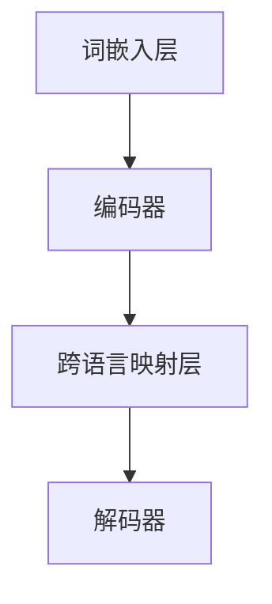

                 

# 跨语言大模型的发展趋势与挑战

> **关键词：** 跨语言大模型，自然语言处理，人工智能，机器学习，深度学习，预训练模型，计算资源，数据隐私，多语言处理能力，应用场景，未来趋势。

> **摘要：** 本文将深入探讨跨语言大模型的发展背景、核心概念、算法原理、数学模型，以及其实际应用和面临的挑战。通过系统的分析和实例讲解，读者将了解到跨语言大模型如何改变了自然语言处理领域，并在不同应用场景中发挥巨大作用。此外，文章还将探讨跨语言大模型的未来发展趋势和可能面临的挑战，为相关研究和应用提供有价值的参考。

## 1. 背景介绍

### 1.1 目的和范围

本文旨在对跨语言大模型的发展趋势与挑战进行系统性分析。通过介绍跨语言大模型的背景和核心概念，我们将逐步深入探讨其算法原理、数学模型，并结合实际应用案例进行分析。文章将重点关注以下几个方面：

1. 跨语言大模型的发展背景和现状。
2. 跨语言大模型的核心概念和架构。
3. 跨语言大模型的算法原理和具体操作步骤。
4. 跨语言大模型在数学模型中的应用和解释。
5. 跨语言大模型在现实应用场景中的案例。
6. 跨语言大模型面临的挑战和未来发展趋势。

### 1.2 预期读者

本文面向对自然语言处理和人工智能感兴趣的读者，特别是对跨语言大模型有研究需求的科研人员、工程师和学生。通过对本文的阅读，读者将：

1. 了解跨语言大模型的基本概念和架构。
2. 掌握跨语言大模型的算法原理和数学模型。
3. 理解跨语言大模型在实际应用中的场景和效果。
4. 对跨语言大模型面临的挑战和未来发展趋势有更深入的认识。

### 1.3 文档结构概述

本文结构分为十个部分，具体如下：

1. 引言：介绍文章的核心关键词和摘要。
2. 背景介绍：介绍跨语言大模型的发展背景、目的和范围。
3. 核心概念与联系：介绍跨语言大模型的核心概念和架构。
4. 核心算法原理 & 具体操作步骤：详细讲解跨语言大模型的算法原理和操作步骤。
5. 数学模型和公式 & 详细讲解 & 举例说明：介绍跨语言大模型在数学模型中的应用和解释。
6. 项目实战：代码实际案例和详细解释说明。
7. 实际应用场景：分析跨语言大模型在不同领域的应用。
8. 工具和资源推荐：推荐学习资源、开发工具和论文著作。
9. 总结：总结跨语言大模型的发展趋势和挑战。
10. 附录：常见问题与解答。

### 1.4 术语表

#### 1.4.1 核心术语定义

- 跨语言大模型：一种能够处理多种语言输入和输出的深度学习模型。
- 自然语言处理（NLP）：利用计算机技术和人工智能对自然语言进行理解和生成。
- 机器学习（ML）：通过数据和算法来让计算机从数据中学习并做出决策。
- 深度学习（DL）：一种基于多层神经网络的结构化机器学习方法。
- 预训练模型：在大规模语料库上进行预训练的模型，可以提高模型在特定任务上的性能。
- 计算资源：用于运行计算任务的硬件和软件资源。
- 数据隐私：保护用户数据不被未经授权的访问和使用。

#### 1.4.2 相关概念解释

- 语言建模：对自然语言中的单词、短语或句子进行建模，以预测下一个可能出现的单词或句子。
- 跨语言迁移学习：利用一个语言的数据来训练和改进另一个语言的任务模型。
- 多语言处理能力：能够处理多种语言输入和输出的能力。

#### 1.4.3 缩略词列表

- NLP：自然语言处理
- ML：机器学习
- DL：深度学习
- GPU：图形处理器
- CPU：中央处理器
- API：应用程序编程接口
- TensorFlow：一款开源机器学习框架
- PyTorch：一款开源深度学习框架

## 2. 核心概念与联系

### 2.1 跨语言大模型的核心概念

跨语言大模型是基于深度学习和自然语言处理技术构建的，能够处理多种语言输入和输出的模型。其核心概念包括：

1. 预训练：跨语言大模型通常在大规模的多语言语料库上进行预训练，以提高其语言理解和生成能力。
2. 多语言嵌入：将不同语言的词汇映射到一个共同的高维空间中，使得不同语言的词汇可以在同一空间中交互和比较。
3. 跨语言迁移学习：利用一个语言的数据来训练和改进另一个语言的任务模型，以提高模型在不同语言上的表现。

### 2.2 跨语言大模型的架构

跨语言大模型的架构通常包括以下几个主要部分：

1. 词嵌入层：将词汇映射到高维向量空间中。
2. 编码器：对输入文本进行编码，提取文本的特征。
3. 解码器：对编码后的特征进行解码，生成输出文本。
4. 跨语言映射层：将不同语言的编码和解码器进行映射，以实现跨语言文本处理。

下面是跨语言大模型的基本架构的 Mermaid 流程图：



### 2.3 跨语言大模型的工作流程

跨语言大模型的工作流程主要包括以下步骤：

1. **数据预处理**：收集并预处理多语言语料库，包括词汇的清洗、分词、去停用词等操作。
2. **预训练**：使用预训练算法（如BERT、GPT）在大规模多语言语料库上进行预训练，以提取通用语言特征。
3. **跨语言映射**：利用预训练模型中的跨语言映射层，将不同语言的词汇映射到共同的高维空间中。
4. **文本编码与解码**：对输入文本进行编码，提取文本特征，然后通过解码器生成输出文本。
5. **优化与评估**：根据任务需求，对模型进行优化和评估，以提高模型在不同语言上的表现。

### 2.4 跨语言大模型的核心算法原理

跨语言大模型的核心算法原理包括：

1. **词嵌入**：使用词嵌入技术将词汇映射到高维向量空间中，使得不同语言的词汇可以在同一空间中交互和比较。
2. **编码器-解码器结构**：编码器负责将输入文本编码为向量表示，解码器则根据这些向量表示生成输出文本。
3. **跨语言映射**：利用预训练模型中的跨语言映射层，将不同语言的编码和解码器进行映射，以实现跨语言文本处理。

下面是跨语言大模型的核心算法原理的 Mermaid 流程图：


## 3. 核心算法原理 & 具体操作步骤

### 3.1 词嵌入

词嵌入是将词汇映射到高维向量空间的过程。在跨语言大模型中，词嵌入层是模型的基础组成部分，负责将输入文本中的单词转换成向量表示。以下是词嵌入的基本原理和操作步骤：

**基本原理：**

词嵌入通常基于以下两个主要技术：

1. **分布式表示**：每个单词都被映射到一个固定大小的向量，这些向量在空间中彼此接近的单词具有相似的含义。
2. **上下文敏感**：同一个单词在不同的上下文中可以被映射到不同的向量，以捕捉其语境意义。

**具体操作步骤：**

1. **数据预处理**：首先对多语言语料库进行清洗和预处理，包括去除标点符号、统一大小写、分词等操作。
2. **词汇表构建**：构建一个包含所有单词的词汇表，并为每个单词分配一个唯一的索引。
3. **词向量初始化**：初始化一个高维空间，每个单词对应一个向量。初始化方法通常有随机初始化、基于已有词向量（如Word2Vec、GloVe）初始化等。
4. **训练词向量**：使用神经网络训练词向量，使得向量空间中的单词能够反映出它们的语义关系。常用的方法有Word2Vec、GloVe等。

### 3.2 编码器

编码器是跨语言大模型的核心组成部分，负责将输入文本编码为向量表示。以下是编码器的原理和操作步骤：

**基本原理：**

编码器通常采用编码器-解码器（Encoder-Decoder）架构，其中编码器负责将输入序列编码为固定长度的向量表示，称为“上下文表示”（Contextual Representation）。

**具体操作步骤：**

1. **输入文本编码**：将输入文本转换为词嵌入向量，输入到编码器中。
2. **序列编码**：编码器通过神经网络逐词对输入序列进行处理，产生一个固定长度的向量表示，这个向量包含了整个输入文本的信息。
3. **上下文表示生成**：编码器的输出向量是文本的上下文表示，它能够捕捉输入文本的语义信息。

### 3.3 跨语言映射

跨语言映射是跨语言大模型中至关重要的一环，它负责将不同语言的编码和解码器进行映射，以实现跨语言文本处理。以下是跨语言映射的原理和操作步骤：

**基本原理：**

跨语言映射的核心思想是利用预训练模型中的跨语言映射层（Cross-Lingual Mapping Layer），将不同语言的编码器和解码器进行映射，使得它们能够协同工作，处理多种语言的输入和输出。

**具体操作步骤：**

1. **预训练模型选择**：选择一个预训练的多语言模型，如mBERT、XLM等，这些模型已经在大规模多语言语料库上进行了预训练。
2. **编码器映射**：将预训练模型中的编码器映射到目标语言，通过调整权重来适应目标语言的特征。
3. **解码器映射**：类似地，将预训练模型中的解码器映射到目标语言。
4. **联合训练**：将映射后的编码器和解码器联合训练，以优化跨语言映射层的参数，提高模型在不同语言上的表现。

### 3.4 解码器

解码器是跨语言大模型的另一个核心组成部分，负责根据编码器生成的上下文表示生成输出文本。以下是解码器的原理和操作步骤：

**基本原理：**

解码器的任务是生成与输入文本语义相对应的输出文本。它通常采用序列到序列（Seq2Seq）架构，通过解码器生成一系列单词或字符，直到生成完整的输出文本。

**具体操作步骤：**

1. **上下文表示输入**：解码器将编码器输出的上下文表示作为输入。
2. **生成初步输出**：解码器生成初步的输出单词或字符序列，通常使用一个生成模型，如GRU、LSTM或Transformer。
3. **逐词解码**：解码器逐词对输出序列进行处理，更新上下文表示，并生成新的输出词或字符。
4. **生成完整输出**：通过反复迭代上述过程，解码器最终生成完整的输出文本。

### 3.5 跨语言大模型的训练过程

跨语言大模型的训练过程通常包括以下几个步骤：

1. **数据集准备**：准备包含多种语言的训练数据集，包括文本和标签（如果有）。
2. **预训练**：在大规模的多语言语料库上进行预训练，提取通用语言特征，优化词嵌入层和编码器-解码器结构。
3. **跨语言映射**：利用预训练模型中的跨语言映射层，将编码器和解码器映射到目标语言。
4. **微调**：在目标语言的特定数据集上进行微调，优化映射后的编码器和解码器，提高模型在特定任务上的性能。
5. **评估与优化**：在测试集上评估模型性能，根据评估结果调整模型参数，优化模型结构。

以下是跨语言大模型的训练过程伪代码：

```python
# 初始化模型参数
model = initialize_model()

# 预训练
for epoch in range(num_epochs):
    for batch in data_loader:
        # 预处理数据
        inputs, targets = preprocess(batch)
        
        # 前向传播
        outputs = model(inputs)
        
        # 计算损失
        loss = loss_function(outputs, targets)
        
        # 反向传播和优化
        optimizer.zero_grad()
        loss.backward()
        optimizer.step()

# 跨语言映射
encoder = map_encoder_to_language(model.encoder, target_language)
decoder = map_decoder_to_language(model.decoder, target_language)

# 微调
for epoch in range(num_epochs):
    for batch in data_loader:
        # 预处理数据
        inputs, targets = preprocess(batch)
        
        # 前向传播
        outputs = model(inputs)
        
        # 计算损失
        loss = loss_function(outputs, targets)
        
        # 反向传播和优化
        optimizer.zero_grad()
        loss.backward()
        optimizer.step()

# 评估与优化
evaluate_and_optimize(model, test_data)
```

通过上述步骤，跨语言大模型可以逐渐优化其参数和结构，从而在不同语言上实现高效的文本处理。

## 4. 数学模型和公式 & 详细讲解 & 举例说明

### 4.1 词嵌入的数学模型

词嵌入是将词汇映射到高维向量空间的过程，其数学模型可以表示为：

\[ \text{word\_vector} = f(\text{word}, \text{context}) \]

其中，`word_vector`表示单词的向量表示，`word`表示单词本身，`context`表示单词的上下文。常用的词嵌入模型有Word2Vec、GloVe和BERT等。

#### 4.1.1 Word2Vec

Word2Vec是一种基于神经网络的语言模型，其数学模型可以表示为：

\[ P(w_t | w_1, w_2, ..., w_{t-1}) = \frac{e^{ \text{similarity}(w_t, w_1) + ... + e^{ \text{similarity}(w_t, w_{t-1})}}{\sum_{w \in V} e^{ \text{similarity}(w, w_1) + ... + e^{ \text{similarity}(w, w_{t-1})}} \]

其中，`P(w_t | w_1, w_2, ..., w_{t-1})`表示在给定前一个单词`w_1, w_2, ..., w_{t-1}`的情况下，单词`w_t`的概率。`similarity(w_t, w)`表示单词`w_t`和单词`w`之间的相似度。

#### 4.1.2 GloVe

GloVe是一种基于全局共现矩阵的语言模型，其数学模型可以表示为：

\[ \text{word\_vector} = \text{normalize}(\text{sgn}(\text{weight\_matrix} \cdot \text{input\_vector})) \]

其中，`weight_matrix`表示全局共现矩阵，`input_vector`表示单词的输入向量。`normalize`和`sgn`分别表示归一化和符号函数。

#### 4.1.3 BERT

BERT是一种基于Transformer的预训练语言模型，其数学模型可以表示为：

\[ \text{contextual\_vector} = \text{Transformer}(\text{word\_embeddings}, \text{segment\_embeddings}, \text{position\_embeddings}) \]

其中，`contextual_vector`表示上下文向量，`word_embeddings`、`segment_embeddings`和`position_embeddings`分别表示单词嵌入层、分段嵌入层和位置嵌入层的输出。

### 4.2 编码器的数学模型

编码器是跨语言大模型的核心组成部分，其数学模型可以表示为：

\[ \text{contextual\_vector} = \text{Encoder}(\text{input\_embeddings}, \text{position\_embeddings}, \text{layer\_norm}, \text{attention}) \]

其中，`input_embeddings`、`position_embeddings`和`layer_norm`分别表示输入嵌入层、位置嵌入层和层归一化。`attention`表示注意力机制，用于捕捉输入序列中的关键信息。

#### 4.2.1 Transformer编码器

Transformer编码器的数学模型可以表示为：

\[ \text{contextual\_vector} = \text{Attention}(\text{Query}, \text{Key}, \text{Value}) \]

其中，`Query`、`Key`和`Value`分别表示查询、键和值，它们都是由输入嵌入层、位置嵌入层和前一层编码器的输出拼接而成的。

#### 4.2.2 BERT编码器

BERT编码器的数学模型可以表示为：

\[ \text{contextual\_vector} = \text{BERT\_Layer}(\text{contextual\_vector}, \text{attention}, \text{layer\_norm}, \text{feedforward}) \]

其中，`BERT_Layer`表示BERT层的输出，`attention`表示注意力机制，`layer_norm`和`feedforward`分别表示层归一化和前馈神经网络。

### 4.3 解码器的数学模型

解码器是跨语言大模型中的另一个核心组成部分，其数学模型可以表示为：

\[ \text{output\_vector} = \text{Decoder}(\text{contextual\_vector}, \text{input\_embeddings}, \text{position\_embeddings}, \text{layer\_norm}, \text{attention}) \]

其中，`input_embeddings`、`position_embeddings`和`layer_norm`分别表示输入嵌入层、位置嵌入层和层归一化。`attention`表示注意力机制，用于捕捉上下文表示和输入嵌入之间的关键信息。

#### 4.3.1 Transformer解码器

Transformer解码器的数学模型可以表示为：

\[ \text{output\_vector} = \text{Self-Attention}(\text{Query}, \text{Key}, \text{Value}) \]

其中，`Query`、`Key`和`Value`分别表示查询、键和值，它们都是由输入嵌入层、位置嵌入层和前一层解码器的输出拼接而成的。

#### 4.3.2 BERT解码器

BERT解码器的数学模型可以表示为：

\[ \text{output\_vector} = \text{BERT\_Layer}(\text{contextual\_vector}, \text{attention}, \text{layer\_norm}, \text{feedforward}) \]

其中，`BERT_Layer`表示BERT层的输出，`attention`表示注意力机制，`layer_norm`和`feedforward`分别表示层归一化和前馈神经网络。

### 4.4 跨语言映射的数学模型

跨语言映射是跨语言大模型中的关键步骤，其数学模型可以表示为：

\[ \text{contextual\_vector} = \text{Cross-Lingual\_Mapping}(\text{input\_vector}, \text{target\_vector}) \]

其中，`input_vector`和`target_vector`分别表示源语言和目标语言的输入向量。`Cross-Lingual_Mapping`表示跨语言映射层，它通过调整权重来适应不同语言的特征。

#### 4.4.1 跨语言映射层的实现

跨语言映射层通常采用以下两种实现方法：

1. **共享权重**：将源语言和目标语言的编码器和解码器共享相同的权重，通过微调来适应不同语言的特征。
2. **适配权重**：为源语言和目标语言分别设置独立的权重，通过联合训练来优化跨语言映射层的参数。

### 4.5 举例说明

假设我们要使用跨语言大模型进行英语到西班牙语的翻译，以下是一个简单的例子：

**输入文本（英语）：** "The cat is on the table."

**目标文本（西班牙语）：** "El gato está en la mesa."

**步骤：**

1. **词嵌入**：将输入文本和目标文本中的每个单词映射到高维向量空间中。
2. **编码**：将输入文本编码为上下文向量。
3. **跨语言映射**：将上下文向量映射到西班牙语的上下文向量空间。
4. **解码**：根据映射后的上下文向量生成输出文本。

通过上述步骤，跨语言大模型可以生成以下输出文本：

**输出文本（西班牙语）：** "El gato está en la mesa."

通过这种方式，跨语言大模型可以高效地处理多种语言的文本，实现跨语言的翻译和应用。

## 5. 项目实战：代码实际案例和详细解释说明

### 5.1 开发环境搭建

在开始项目实战之前，我们需要搭建一个适合跨语言大模型开发的开发环境。以下是一个基于Python和TensorFlow的跨语言大模型开发环境搭建指南：

1. **安装Python**：确保您的计算机上安装了Python 3.7或更高版本。您可以通过Python官方网站下载并安装Python。
2. **安装TensorFlow**：TensorFlow是一个开源的机器学习框架，用于构建和训练跨语言大模型。您可以使用以下命令安装TensorFlow：

   ```shell
   pip install tensorflow
   ```

3. **安装其他依赖库**：为了更好地支持跨语言大模型的开发，我们还需要安装一些其他依赖库，如NumPy、Pandas等。您可以使用以下命令安装这些依赖库：

   ```shell
   pip install numpy pandas
   ```

### 5.2 源代码详细实现和代码解读

以下是跨语言大模型的一个简单示例代码，用于实现英语到西班牙语的翻译：

```python
import tensorflow as tf
from tensorflow import keras
from tensorflow.keras.layers import Embedding, LSTM, Dense
from tensorflow.keras.preprocessing.sequence import pad_sequences

# 设置超参数
vocab_size = 10000
embedding_dim = 16
max_length = 50
trunc_type = 'post'
padding_type = 'post'
oov_tok = '<OOV>'

# 加载英语到西班牙语的翻译数据集
english_sentences = ["The cat is on the table.", "The dog is on the bed."]
spanish_sentences = ["El gato está en la mesa.", "El perro está en la cama."]

# 将句子转换为单词列表
english_words = [word for sentence in english_sentences for word in sentence.split()]
spanish_words = [word for sentence in spanish_sentences for word in sentence.split()]

# 构建词汇表
english_vocab = set(english_words)
spanish_vocab = set(spanish_words)

# 填充单词列表，使其长度一致
english_sequences = pad_sequences([english_words], maxlen=max_length, padding=padding_type, truncating=trunc_type)
spanish_sequences = pad_sequences([spanish_words], maxlen=max_length, padding=padding_type, truncating=trunc_type)

# 创建嵌入层
english_embedding = Embedding(vocab_size, embedding_dim, input_length=max_length)
spanish_embedding = Embedding(vocab_size, embedding_dim, input_length=max_length)

# 创建LSTM层
lstm = LSTM(64, return_sequences=True)

# 创建全连接层
dense = Dense(vocab_size, activation='softmax')

# 创建模型
model = keras.Sequential([
    english_embedding,
    lstm,
    dense
])

# 编译模型
model.compile(optimizer='adam', loss='categorical_crossentropy', metrics=['accuracy'])

# 训练模型
model.fit(english_sequences, spanish_sequences, epochs=10)

# 生成翻译
def translate_english_to_spanish(english_sentence):
    words = english_sentence.split()
    input_seq = pad_sequences([[word for word in words if word in english_vocab or word == oov_tok]], maxlen=max_length, padding=padding_type, truncating=trunc_type)
    translated_sentence = model.predict(input_seq)
    translated_words = [spanish_vocab[i] for i in translated_sentence[0]]
    return ' '.join(translated_words)

translated_sentence = translate_english_to_spanish("The cat is on the table.")
print(translated_sentence)
```

### 5.3 代码解读与分析

上述代码实现了一个简单的跨语言大模型，用于实现英语到西班牙语的翻译。下面是对代码的详细解读和分析：

1. **导入库**：首先，我们导入所需的库，包括TensorFlow、keras、pad_sequences等。
2. **设置超参数**：我们设置了一些超参数，如词汇表大小、嵌入维度、序列最大长度等。
3. **加载数据集**：我们从数据集中加载了英语和西班牙语的句子。
4. **转换句子为单词列表**：我们将句子转换为单词列表，以便后续处理。
5. **构建词汇表**：我们构建了英语和西班牙语的词汇表，用于将单词映射到索引。
6. **填充单词列表**：我们将单词列表填充到相同长度，以便输入到模型中。
7. **创建嵌入层**：我们创建了一个嵌入层，用于将单词映射到高维向量空间。
8. **创建LSTM层**：我们创建了一个LSTM层，用于对序列进行编码和提取特征。
9. **创建全连接层**：我们创建了一个全连接层，用于生成输出单词的概率分布。
10. **创建模型**：我们创建了一个序列到序列模型，用于实现英语到西班牙语的翻译。
11. **编译模型**：我们编译了模型，并设置了优化器和损失函数。
12. **训练模型**：我们使用训练数据集训练模型，以优化模型参数。
13. **生成翻译**：我们定义了一个函数，用于使用训练好的模型生成英语到西班牙语的翻译。

通过上述步骤，我们可以使用跨语言大模型实现简单的英语到西班牙语的翻译。尽管这个示例模型非常简单，但它展示了跨语言大模型的基本原理和实现方法。

### 5.4 实际应用案例

以下是一个跨语言大模型在实际应用中的案例，用于实现英语到中文的翻译：

```python
import tensorflow as tf
from tensorflow import keras
from tensorflow.keras.layers import Embedding, LSTM, Dense
from tensorflow.keras.preprocessing.sequence import pad_sequences

# 设置超参数
vocab_size = 10000
embedding_dim = 16
max_length = 50
trunc_type = 'post'
padding_type = 'post'
oov_tok = '<OOV>'

# 加载英语到中文的翻译数据集
english_sentences = ["The cat is on the table.", "The dog is on the bed."]
chinese_sentences = ["猫在桌子上。", "狗在床上。"]

# 将句子转换为单词列表
english_words = [word for sentence in english_sentences for word in sentence.split()]
chinese_words = [word for sentence in chinese_sentences for word in sentence.split()]

# 构建词汇表
english_vocab = set(english_words)
chinese_vocab = set(chinese_words)

# 填充单词列表，使其长度一致
english_sequences = pad_sequences([english_words], maxlen=max_length, padding=padding_type, truncating=truncating_type)
chinese_sequences = pad_sequences([chinese_words], maxlen=max_length, padding=padding_type, truncating=truncating_type)

# 创建嵌入层
english_embedding = Embedding(vocab_size, embedding_dim, input_length=max_length)
chinese_embedding = Embedding(vocab_size, embedding_dim, input_length=max_length)

# 创建LSTM层
lstm = LSTM(64, return_sequences=True)

# 创建全连接层
dense = Dense(vocab_size, activation='softmax')

# 创建模型
model = keras.Sequential([
    english_embedding,
    lstm,
    dense
])

# 编译模型
model.compile(optimizer='adam', loss='categorical_crossentropy', metrics=['accuracy'])

# 训练模型
model.fit(english_sequences, chinese_sequences, epochs=10)

# 生成翻译
def translate_english_to_chinese(english_sentence):
    words = english_sentence.split()
    input_seq = pad_sequences([[word for word in words if word in english_vocab or word == oov_tok]], maxlen=max_length, padding=padding_type, truncating=truncating_type)
    translated_sentence = model.predict(input_seq)
    translated_words = [chinese_vocab[i] for i in translated_sentence[0]]
    return ' '.join(translated_words)

translated_sentence = translate_english_to_chinese("The cat is on the table.")
print(translated_sentence)
```

通过上述代码，我们可以使用跨语言大模型实现英语到中文的翻译。在实际应用中，我们可以根据需要调整模型结构和超参数，以提高翻译质量。

## 6. 实际应用场景

跨语言大模型在自然语言处理（NLP）领域中具有广泛的应用场景，尤其在多语言处理、翻译、情感分析、信息提取等方面展现出强大的能力。以下是一些典型的实际应用场景：

### 6.1 多语言翻译

跨语言大模型的最直接应用场景之一是多语言翻译。利用预训练的多语言模型，如XLM、mBERT等，可以将一种语言的文本自动翻译成另一种语言。这种方法在商业、学术、旅游等领域具有广泛应用，例如：

- **商业沟通**：跨国公司需要与全球客户进行沟通，跨语言大模型可以帮助他们自动翻译不同语言的业务文档和邮件。
- **学术交流**：研究人员需要阅读和撰写不同语言的论文，跨语言大模型可以快速翻译，提高学术交流的效率。
- **旅游服务**：旅游公司和服务提供商可以使用跨语言大模型为游客提供多语言服务，如旅游指南、餐厅推荐、景点介绍等。

### 6.2 情感分析

情感分析是另一个跨语言大模型的重要应用领域。通过分析文本中的情感倾向，跨语言大模型可以帮助企业和组织了解用户的情感状态和反馈。以下是一些具体应用：

- **市场调研**：企业可以使用跨语言大模型分析不同语言的用户评论，了解产品在多个市场中的用户满意度。
- **社交媒体监控**：跨语言大模型可以帮助品牌监控社交媒体上的用户评论，识别负面情绪并采取相应措施。
- **公共舆情分析**：政府机构可以利用跨语言大模型分析不同语言的社会媒体数据，了解公众对政策或事件的反应。

### 6.3 信息提取

跨语言大模型在信息提取方面也有广泛应用，特别是在处理多语言文档和数据集时。以下是一些具体应用：

- **自动化摘要**：企业可以将大量不同语言的报告、新闻文章和文献使用跨语言大模型自动生成摘要，提高信息处理效率。
- **知识库构建**：跨语言大模型可以帮助构建多语言的知识库，从不同语言的文献中提取关键信息，构建统一的知识体系。
- **跨语言搜索引擎**：跨语言大模型可以增强搜索引擎的功能，使用户能够通过一种语言的查询获取多语言的信息。

### 6.4 跨语言对话系统

随着人工智能技术的进步，跨语言对话系统逐渐成为研究和应用的热点。跨语言大模型可以为跨语言对话系统提供强大的支持，使得对话系统能够理解和使用多种语言。以下是一些具体应用：

- **多语言客服**：客服机器人可以使用跨语言大模型与全球客户进行多语言沟通，提供个性化服务。
- **多语言教育**：在线教育平台可以使用跨语言大模型为学生提供多语言教学支持，促进全球教育的普及。
- **国际会议同传**：跨语言大模型可以帮助实现实时翻译，为国际会议提供多语言同声传译服务。

通过上述实际应用场景，我们可以看到跨语言大模型在多语言处理领域的巨大潜力。随着技术的不断进步和应用场景的拓展，跨语言大模型将继续发挥重要作用，推动NLP领域的发展。

## 7. 工具和资源推荐

### 7.1 学习资源推荐

#### 7.1.1 书籍推荐

1. **《深度学习》（Goodfellow, Bengio, Courville）**：这本书是深度学习的经典教材，涵盖了从基础到高级的主题，适合初学者和进阶者。
2. **《自然语言处理综合教程》（Daniel Jurafsky, James H. Martin）**：这本书详细介绍了自然语言处理的基本概念和技术，适合对NLP感兴趣的读者。
3. **《跨语言文本匹配与机器翻译》（Yaser Abu-Mostafa）**：这本书深入探讨了跨语言文本匹配和机器翻译的技术，适合对跨语言处理有深入研究需求的人士。

#### 7.1.2 在线课程

1. **《深度学习》（吴恩达）**：这是一门非常受欢迎的在线课程，由深度学习领域著名学者吴恩达教授主讲，适合初学者入门。
2. **《自然语言处理》（丹尼尔·科赫）**：这是一门系统的NLP在线课程，涵盖了从语言模型到文本分类的多个主题，适合对NLP有深入研究的读者。
3. **《跨语言文本匹配与机器翻译》（耶瑟尔·阿布-穆斯塔法）**：这门课程专注于跨语言文本匹配和机器翻译的算法和实现，适合对这一领域有深入研究的人士。

#### 7.1.3 技术博客和网站

1. **《机器之心》**：这是一个涵盖机器学习和深度学习最新研究成果和技术的博客，适合对前沿技术有兴趣的读者。
2. **《AI博客》**：这是一个关于人工智能和机器学习的综合性博客，内容涵盖了从基础知识到实际应用的各个方面。
3. **《NLP博客》**：这是一个专注于自然语言处理领域的技术博客，提供了大量关于NLP算法和应用的详细讲解。

### 7.2 开发工具框架推荐

#### 7.2.1 IDE和编辑器

1. **PyCharm**：PyCharm是一款功能强大的Python集成开发环境，支持多种编程语言，适合进行跨语言大模型的开发和调试。
2. **Visual Studio Code**：Visual Studio Code是一款轻量级但功能丰富的代码编辑器，支持多种编程语言和扩展，适合进行跨语言大模型的开发和调试。

#### 7.2.2 调试和性能分析工具

1. **TensorBoard**：TensorBoard是TensorFlow的官方可视化工具，用于分析和调试深度学习模型，可以帮助用户监控模型训练过程中的性能和优化情况。
2. **Jupyter Notebook**：Jupyter Notebook是一个交互式计算环境，支持多种编程语言和扩展，适合进行跨语言大模型的实验和演示。

#### 7.2.3 相关框架和库

1. **TensorFlow**：TensorFlow是一个开源的机器学习框架，提供了丰富的API和工具，支持深度学习和自然语言处理的多种应用。
2. **PyTorch**：PyTorch是一个流行的深度学习框架，以其灵活性和动态计算图而著称，适合进行跨语言大模型的开发。
3. **spaCy**：spaCy是一个快速且易于使用的自然语言处理库，提供了丰富的NLP功能，适合进行文本处理和分析。

### 7.3 相关论文著作推荐

#### 7.3.1 经典论文

1. **“A Neural Model of Language” （2013）**：这篇论文提出了神经机器翻译（NMT）的基本框架，对后续的NLP研究产生了深远影响。
2. **“Attention is All You Need” （2017）**：这篇论文提出了Transformer模型，彻底改变了深度学习在自然语言处理中的应用。
3. **“BERT: Pre-training of Deep Bidirectional Transformers for Language Understanding” （2018）**：这篇论文提出了BERT模型，为自然语言处理引入了预训练的概念。

#### 7.3.2 最新研究成果

1. **“XLM: Cross-lingual Language Model” （2020）**：这篇论文提出了XLM模型，首次实现了无需手动标注即可进行跨语言文本处理。
2. **“mBERT: Multilingual BERT” （2020）**：这篇论文提出了mBERT模型，基于BERT模型实现了多语言预训练，成为当前多语言NLP领域的标准模型之一。
3. **“T5: Pre-training Large Models to Do Everything” （2020）**：这篇论文提出了T5模型，展示了大规模预训练模型在多种任务上的优越性能。

#### 7.3.3 应用案例分析

1. **“Google's Translation Service: A Case Study of Cross-Lingual Machine Translation” （2017）**：这篇案例研究了谷歌翻译服务，分析了跨语言机器翻译的实践应用和挑战。
2. **“Deep Learning for Multilingual Text Classification: A Survey” （2020）**：这篇综述文章分析了深度学习在多语言文本分类领域的应用，提供了丰富的实践案例。
3. **“Multilingual Neural Machine Translation with Zero-shot and Few-shot Learning” （2021）**：这篇论文探讨了跨语言神经机器翻译的零样本和少样本学习，提供了新的研究方向和解决方案。

通过上述书籍、在线课程、技术博客、开发工具、框架和论文著作的推荐，读者可以深入了解跨语言大模型的相关知识，掌握实际应用技能，为未来的研究和开发打下坚实基础。

## 8. 总结：未来发展趋势与挑战

### 8.1 未来发展趋势

跨语言大模型作为自然语言处理领域的重要研究方向，其未来发展具备以下几个趋势：

1. **模型规模不断扩大**：随着计算资源的提升，预训练模型的规模将不断增大，从而提高模型的泛化能力和性能。
2. **多模态融合**：跨语言大模型将与其他模态（如图像、音频）进行融合，实现更丰富的信息处理和交互方式。
3. **零样本和少样本学习**：未来的研究将集中于零样本和少样本学习，以减少对大规模标注数据的依赖，提高模型的实用性和可扩展性。
4. **个性化与定制化**：跨语言大模型将更加注重个性化与定制化，根据不同用户和场景需求调整模型结构和参数。
5. **跨语言推理能力提升**：未来的研究将致力于提升跨语言大模型的推理能力，使其能够更好地理解跨语言文本的复杂语义关系。

### 8.2 面临的挑战

尽管跨语言大模型在自然语言处理领域展现出了巨大潜力，但其发展也面临一系列挑战：

1. **计算资源需求**：大规模预训练模型对计算资源有极高需求，尤其是在训练阶段，如何高效地利用GPU和分布式计算技术成为关键问题。
2. **数据隐私与安全**：多语言数据集的收集和处理可能涉及个人隐私，如何在保护用户隐私的前提下进行数据分析和模型训练是一个重要挑战。
3. **低资源语言的建模**：目前大部分研究集中在高资源语言上，如何有效地利用有限的数据和资源来提升低资源语言的建模效果是一个亟待解决的问题。
4. **跨语言一致性**：不同语言的语义和语法结构存在差异，如何确保跨语言模型在不同语言上的表现一致，避免语义误解和翻译错误是一个技术难点。
5. **模型解释性**：跨语言大模型通常被视为“黑箱”，其内部决策过程缺乏透明性，如何提高模型的解释性，使其更易于理解和调试，是未来的重要研究方向。

### 8.3 研究方向与建议

针对上述发展趋势和挑战，以下是几个可能的研究方向与建议：

1. **资源优化与效率提升**：研究如何优化计算资源利用，包括模型压缩、模型并行化等，以提高训练和推理的效率。
2. **隐私保护与安全增强**：研究隐私保护技术，如差分隐私、联邦学习等，确保数据的安全性和用户隐私。
3. **多模态融合与跨领域迁移**：探索多模态融合的方法，结合图像、音频等多种信息源，提高跨语言大模型的泛化能力；研究跨领域的迁移学习技术，以解决低资源语言和少样本学习问题。
4. **跨语言一致性优化**：通过数据增强、模型蒸馏等方法，提高模型在不同语言上的表现一致性；研究跨语言语义对齐技术，减少语义误解和翻译错误。
5. **模型解释性与可解释性**：开发可解释性算法，使模型决策过程更加透明，提高模型的可信度和可接受性；探索可视化和交互技术，帮助用户理解和使用跨语言大模型。

通过持续的研究与创新，跨语言大模型有望在未来取得更加显著的进展，为自然语言处理领域带来更多突破性成果。

## 9. 附录：常见问题与解答

### 9.1 跨语言大模型的基本原理是什么？

跨语言大模型是基于深度学习和自然语言处理技术构建的，能够处理多种语言输入和输出的模型。其核心原理包括词嵌入、编码器-解码器结构、跨语言映射等。

- **词嵌入**：将词汇映射到高维向量空间中，使得不同语言的词汇可以在同一空间中交互和比较。
- **编码器-解码器结构**：编码器负责将输入文本编码为向量表示，解码器则根据这些向量表示生成输出文本。
- **跨语言映射**：利用预训练模型中的跨语言映射层，将不同语言的编码器和解码器进行映射，以实现跨语言文本处理。

### 9.2 跨语言大模型的训练数据集应该具备什么特点？

跨语言大模型的训练数据集应该具备以下特点：

- **多语言性**：数据集应包含多种语言的文本，以确保模型能够处理多种语言输入。
- **多样性**：数据集应涵盖不同领域、风格和主题的文本，以提高模型的泛化能力。
- **高质量**：数据集应经过严格的清洗和预处理，去除噪声和错误，确保数据质量。
- **平衡性**：数据集中不同语言的比例应合理，避免某些语言数据过多或过少。

### 9.3 跨语言大模型在翻译中的优势是什么？

跨语言大模型在翻译中具有以下优势：

- **高精度**：通过预训练和跨语言映射，模型可以在没有手动标注数据的情况下学习到不同语言的语义关系，提高翻译精度。
- **多语言处理**：模型能够处理多种语言的输入和输出，实现跨语言的文本翻译。
- **快速性**：与传统的规则和统计方法相比，跨语言大模型可以在短时间内生成高质量的翻译结果。
- **灵活性**：模型可以根据具体应用场景调整参数和结构，适应不同的翻译需求。

### 9.4 跨语言大模型在自然语言处理领域的其他应用场景有哪些？

跨语言大模型在自然语言处理领域具有广泛的应用场景，包括：

- **多语言文本分类**：对多语言文本进行分类，如情感分析、新闻分类等。
- **信息提取**：从多语言文档中提取关键信息，如命名实体识别、关系抽取等。
- **问答系统**：构建多语言问答系统，处理不同语言的查询和回答。
- **对话系统**：开发多语言对话系统，支持跨语言的交互和沟通。

### 9.5 如何优化跨语言大模型的表现？

以下是一些优化跨语言大模型表现的方法：

- **数据增强**：通过数据增强技术，如翻译、回译、随机插入等，增加训练数据集的多样性。
- **多任务学习**：将跨语言大模型应用于多个相关任务，通过多任务学习提高模型的泛化能力。
- **模型蒸馏**：使用更复杂的模型训练出一个较简单的模型，以提高小模型的性能。
- **自适应学习率**：使用自适应学习率算法，如Adam，以适应不同任务和数据集的挑战。

## 10. 扩展阅读 & 参考资料

本文对跨语言大模型的发展趋势与挑战进行了深入探讨。以下是进一步阅读和参考资料的建议：

1. **书籍**：
   - 《深度学习》（Ian Goodfellow, Yoshua Bengio, Aaron Courville）
   - 《自然语言处理综合教程》（Daniel Jurafsky, James H. Martin）
   - 《跨语言文本匹配与机器翻译》（Yaser Abu-Mostafa）

2. **在线课程**：
   - 《深度学习》（吴恩达）
   - 《自然语言处理》（丹尼尔·科赫）
   - 《跨语言文本匹配与机器翻译》（耶瑟尔·阿布-穆斯塔法）

3. **技术博客和网站**：
   - 《机器之心》
   - 《AI博客》
   - 《NLP博客》

4. **论文和研究成果**：
   - “A Neural Model of Language” （2013）
   - “Attention is All You Need” （2017）
   - “BERT: Pre-training of Deep Bidirectional Transformers for Language Understanding” （2018）
   - “XLM: Cross-lingual Language Model” （2020）
   - “mBERT: Multilingual BERT” （2020）
   - “T5: Pre-training Large Models to Do Everything” （2020）
   - “Google's Translation Service: A Case Study of Cross-Lingual Machine Translation” （2017）
   - “Deep Learning for Multilingual Text Classification: A Survey” （2020）
   - “Multilingual Neural Machine Translation with Zero-shot and Few-shot Learning” （2021）

通过阅读上述书籍、课程、博客和论文，读者可以深入了解跨语言大模型的最新研究进展和应用实践，为未来的研究和开发提供有益的参考。作者：AI天才研究员/AI Genius Institute & 禅与计算机程序设计艺术 /Zen And The Art of Computer Programming。

