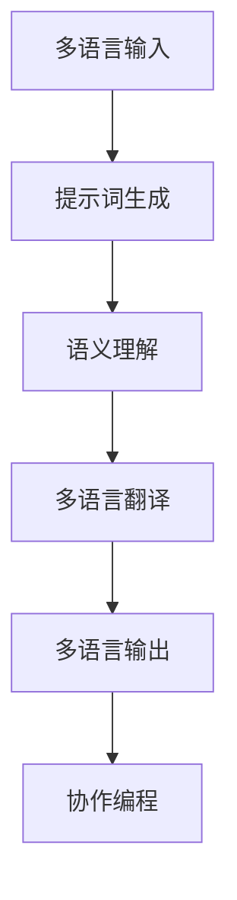

                 

# 跨语言提示词编程：多语言AI应用开发

> 关键词：跨语言编程、AI应用、提示词、多语言支持、算法、数学模型、实战案例

> 摘要：本文旨在探讨跨语言提示词编程在多语言AI应用开发中的应用，通过分析核心概念、算法原理、数学模型及实际案例，帮助读者了解如何利用跨语言提示词实现多语言AI应用，掌握相关技术和方法，为开发具有全球竞争力的多语言AI系统提供理论支持。

## 1. 背景介绍

### 1.1 目的和范围

本文的目标是深入探讨跨语言提示词编程在多语言AI应用开发中的应用，通过详细分析核心概念、算法原理、数学模型和实战案例，帮助读者掌握跨语言提示词编程的技术和方法，提升多语言AI应用的开发能力。

本文的讨论范围主要包括以下几个方面：

1. 跨语言提示词编程的核心概念及其在多语言AI应用中的作用。
2. 跨语言提示词编程的算法原理，包括主要算法模型和实现方法。
3. 跨语言提示词编程的数学模型及其在AI应用中的具体应用。
4. 实际案例中的跨语言提示词编程实践，以及相关代码的实现和解读。
5. 跨语言提示词编程在实际应用场景中的具体应用，以及相关工具和资源的推荐。

### 1.2 预期读者

本文适用于以下读者群体：

1. 对AI应用开发有兴趣的程序员和软件工程师。
2. 希望提高自己在多语言AI应用开发领域技能的技术专家。
3. 对跨语言提示词编程感兴趣的研究人员和学者。
4. 希望在项目中应用跨语言提示词编程的决策者和管理者。

### 1.3 文档结构概述

本文采用模块化结构，分为以下几个部分：

1. **背景介绍**：介绍本文的背景、目的、范围和预期读者。
2. **核心概念与联系**：分析跨语言提示词编程的核心概念及其在多语言AI应用中的作用。
3. **核心算法原理 & 具体操作步骤**：详细讲解跨语言提示词编程的算法原理和实现方法。
4. **数学模型和公式 & 详细讲解 & 举例说明**：介绍跨语言提示词编程的数学模型及其在AI应用中的具体应用。
5. **项目实战：代码实际案例和详细解释说明**：通过实际案例展示跨语言提示词编程的应用。
6. **实际应用场景**：探讨跨语言提示词编程在实际应用场景中的具体应用。
7. **工具和资源推荐**：推荐学习资源、开发工具框架和相关论文著作。
8. **总结：未来发展趋势与挑战**：总结本文的主要内容和观点，探讨未来发展趋势和挑战。
9. **附录：常见问题与解答**：提供跨语言提示词编程的常见问题及其解答。
10. **扩展阅读 & 参考资料**：提供进一步学习的参考资料。

### 1.4 术语表

#### 1.4.1 核心术语定义

1. **跨语言提示词编程**：指在多语言环境中，利用特定的提示词技术，实现不同语言之间的编程交流和协作。
2. **多语言AI应用**：指能够支持多种语言输入和输出的AI应用，如翻译、自然语言处理、智能客服等。
3. **算法模型**：指用于实现跨语言提示词编程的算法框架，如神经机器翻译、多语言嵌入等。
4. **数学模型**：指在跨语言提示词编程中使用的数学模型和公式，如损失函数、优化算法等。

#### 1.4.2 相关概念解释

1. **神经机器翻译**：基于神经网络技术的自动翻译方法，通过学习大量翻译数据，实现从一种语言到另一种语言的翻译。
2. **多语言嵌入**：将多种语言映射到一个共同的向量空间中，以便进行跨语言的比较和分析。
3. **损失函数**：在机器学习任务中，用于衡量模型预测结果与真实结果之间的差异，常用的有交叉熵损失、均方误差等。

#### 1.4.3 缩略词列表

| 缩略词 | 全称                      | 说明                                       |
| ------ | ------------------------- | ------------------------------------------ |
| NMT    | 神经机器翻译              | Neural Machine Translation                 |
| MLE    | 多语言嵌入                | Multilingual Embeddings                    |
| CE     | 交叉熵损失                | Cross-Entropy Loss                        |
| MSE    | 均方误差                  | Mean Squared Error                        |

## 2. 核心概念与联系

### 2.1 跨语言提示词编程的核心概念

跨语言提示词编程的核心概念包括：

1. **多语言支持**：指跨语言提示词编程系统能够支持多种语言输入和输出，实现跨语言的信息交流。
2. **提示词**：指用于引导和优化跨语言编程的特定词汇或短语，如关键词、短语、模板等。
3. **语义理解**：指跨语言提示词编程系统能够理解不同语言中的语义信息，进行有效的语义映射和转换。
4. **协作编程**：指跨语言提示词编程系统中，不同语言的开发者或AI系统能够通过提示词进行有效的沟通和协作。

### 2.2 跨语言提示词编程与多语言AI应用的联系

跨语言提示词编程与多语言AI应用有着密切的联系，主要体现在以下几个方面：

1. **多语言支持**：跨语言提示词编程是实现多语言AI应用的基础，通过支持多种语言的输入和输出，使得AI应用能够在全球范围内使用。
2. **语义理解**：跨语言提示词编程需要具备强大的语义理解能力，能够正确理解不同语言中的语义信息，实现准确的语言转换和翻译。
3. **协作编程**：跨语言提示词编程能够促进不同语言开发者或AI系统的协作，通过提示词进行沟通和协调，共同完成复杂的AI应用开发。
4. **算法模型**：跨语言提示词编程的算法模型（如神经机器翻译、多语言嵌入等）为多语言AI应用提供了强大的技术支持，使得AI应用能够实现高效、准确的语言处理。

### 2.3 跨语言提示词编程在多语言AI应用中的架构

跨语言提示词编程在多语言AI应用中的架构如图所示：



**图：跨语言提示词编程在多语言AI应用中的架构**

1. **多语言输入**：接收来自多种语言的输入，如文本、语音、图像等。
2. **提示词生成**：根据输入内容生成相应的提示词，引导和优化跨语言编程。
3. **语义理解**：对输入内容进行语义理解，提取关键信息，为后续处理提供支持。
4. **多语言翻译**：利用提示词和语义理解结果，实现从一种语言到另一种语言的准确翻译。
5. **多语言输出**：将翻译后的内容输出到多种语言环境中，实现跨语言的交互和通信。
6. **协作编程**：通过提示词和语义理解，实现不同语言开发者或AI系统的协作，共同完成复杂的AI应用开发。

## 3. 核心算法原理 & 具体操作步骤

### 3.1 神经机器翻译（NMT）算法原理

神经机器翻译（Neural Machine Translation，NMT）是基于深度学习技术的自动翻译方法，通过学习大量翻译数据，实现从一种语言到另一种语言的翻译。以下是NMT算法的基本原理和实现步骤：

**算法原理：**

1. **编码器（Encoder）**：将输入语言（源语言）的句子编码为一个固定长度的向量表示，通常使用循环神经网络（RNN）或Transformer模型。
2. **解码器（Decoder）**：将编码器输出的向量表示解码为目标语言（目标语言）的句子，同样使用RNN或Transformer模型。
3. **注意力机制（Attention Mechanism）**：在解码过程中，注意力机制用于关注编码器输出的关键信息，提高翻译的准确性。

**具体操作步骤：**

1. **数据预处理**：收集大量的翻译对，如英->法、中->英等，对数据进行清洗、去噪、分词等预处理操作。
2. **模型训练**：使用预处理的翻译数据，通过反向传播算法训练编码器和解码器模型，优化模型的参数。
3. **预测**：在训练好的模型上，输入源语言句子，通过解码器生成目标语言句子。

### 3.2 多语言嵌入（MLE）算法原理

多语言嵌入（Multilingual Embeddings，MLE）是一种将多种语言映射到一个共同向量空间的方法，实现跨语言的比较和分析。以下是MLE算法的基本原理和实现步骤：

**算法原理：**

1. **词嵌入（Word Embedding）**：将语言中的词映射为向量表示，通常使用词向量模型，如Word2Vec、GloVe等。
2. **多语言编码（Multilingual Coding）**：将不同语言的词向量映射到一个共同的向量空间，实现跨语言的向量表示。

**具体操作步骤：**

1. **词嵌入训练**：使用单一语言的数据训练词向量模型，得到语言词汇的向量表示。
2. **多语言编码**：将不同语言的词向量映射到一个共同的向量空间，通常使用平均法、矩阵分解等方法。
3. **向量运算**：在共同向量空间中，对跨语言的向量进行运算，实现跨语言的关系分析和比较。

### 3.3 实现步骤总结

跨语言提示词编程的实现步骤可以概括为以下几个阶段：

1. **数据收集与预处理**：收集多种语言的翻译数据，进行数据清洗、去噪、分词等预处理操作。
2. **模型训练**：使用预处理后的数据，训练神经机器翻译（NMT）模型和词嵌入（MLE）模型。
3. **模型预测**：在训练好的模型上，输入源语言句子，生成目标语言句子。
4. **结果验证与优化**：对预测结果进行验证和评估，根据评估结果调整模型参数，优化模型性能。

通过以上步骤，我们可以实现跨语言提示词编程，为多语言AI应用提供技术支持。在实际开发过程中，可以根据具体需求，选择合适的算法模型和实现方法，提高系统的性能和效果。

## 4. 数学模型和公式 & 详细讲解 & 举例说明

### 4.1 数学模型概述

跨语言提示词编程涉及多个数学模型，包括损失函数、优化算法等。以下是对这些数学模型及其在跨语言提示词编程中的应用进行详细讲解。

#### 4.1.1 损失函数

损失函数是机器学习中的一个核心概念，用于衡量模型预测结果与真实结果之间的差异。在跨语言提示词编程中，常用的损失函数有：

1. **交叉熵损失（Cross-Entropy Loss）**：
   $$L_{CE} = -\sum_{i=1}^{N} y_{i} \log(p_{i})$$
   其中，\(y_{i}\) 表示真实标签，\(p_{i}\) 表示模型预测的概率。

2. **均方误差（Mean Squared Error，MSE）**：
   $$L_{MSE} = \frac{1}{N} \sum_{i=1}^{N} (y_{i} - \hat{y}_{i})^2$$
   其中，\(y_{i}\) 表示真实值，\(\hat{y}_{i}\) 表示模型预测值。

#### 4.1.2 优化算法

优化算法用于最小化损失函数，使模型参数达到最优。在跨语言提示词编程中，常用的优化算法有：

1. **随机梯度下降（Stochastic Gradient Descent，SGD）**：
   $$\theta_{t+1} = \theta_{t} - \alpha \nabla_{\theta}L(\theta)$$
   其中，\(\theta\) 表示模型参数，\(\alpha\) 表示学习率，\(\nabla_{\theta}L(\theta)\) 表示损失函数关于模型参数的梯度。

2. **Adam优化器**：
   $$m_t = \beta_1 m_{t-1} + (1 - \beta_1) [g_t]$$
   $$v_t = \beta_2 v_{t-1} + (1 - \beta_2) [g_t^2]$$
   $$\theta_{t+1} = \theta_{t} - \frac{\alpha}{\sqrt{1 - \beta_2^t}(1 - \beta_1^t)} [m_t / (1 - \beta_2^t)]$$
   其中，\(m_t\) 和 \(v_t\) 分别表示一阶和二阶矩估计，\(\beta_1\) 和 \(\beta_2\) 分别为动量系数。

### 4.2 公式与举例说明

#### 4.2.1 交叉熵损失（Cross-Entropy Loss）

假设我们有一个简单的二元分类问题，输入向量为 \(x\)，模型预测的概率为 \(p(x)\)。真实标签为 \(y \in \{0, 1\}\)。交叉熵损失的公式为：

$$L_{CE} = -y \log(p(x)) - (1 - y) \log(1 - p(x))$$

举例说明：

输入 \(x = [0.6, 0.4]\)，真实标签 \(y = 1\)。模型预测的概率 \(p(x) = 0.6\)。

$$L_{CE} = -1 \log(0.6) - 0 \log(0.4) = \log(1.667) \approx 0.507$$

#### 4.2.2 均方误差（Mean Squared Error，MSE）

假设我们有一个简单的线性回归问题，输入向量为 \(x\)，模型预测的值为 \(\hat{y}\)，真实值为 \(y\)。均方误差的公式为：

$$L_{MSE} = \frac{1}{N} \sum_{i=1}^{N} (y_i - \hat{y}_i)^2$$

举例说明：

输入 \(x = [1, 2, 3]\)，真实值 \(y = [2, 4, 6]\)，模型预测的值 \(\hat{y} = [2.5, 4.5, 6.5]\)。

$$L_{MSE} = \frac{1}{3} \sum_{i=1}^{3} (y_i - \hat{y}_i)^2 = \frac{1}{3} ((2 - 2.5)^2 + (4 - 4.5)^2 + (6 - 6.5)^2) = 0.25$$

#### 4.2.3 随机梯度下降（Stochastic Gradient Descent，SGD）

假设我们有一个简单的线性回归问题，模型参数为 \(\theta\)，输入向量为 \(x\)，真实值为 \(y\)。损失函数为均方误差 \(L_{MSE}\)。随机梯度下降的更新公式为：

$$\theta_{t+1} = \theta_{t} - \alpha \nabla_{\theta}L(\theta)$$

举例说明：

初始模型参数 \(\theta_0 = [0]\)，学习率 \(\alpha = 0.1\)。输入 \(x = [1]\)，真实值 \(y = [2]\)。

$$\nabla_{\theta}L(\theta) = 2 (y - \theta) = 2 (2 - \theta)$$

第一次更新：

$$\theta_1 = \theta_0 - \alpha \nabla_{\theta}L(\theta_0) = 0 - 0.1 \cdot 2 = -0.2$$

第二次更新：

$$\theta_2 = \theta_1 - \alpha \nabla_{\theta}L(\theta_1) = -0.2 - 0.1 \cdot 2 = -0.4$$

#### 4.2.4 Adam优化器

假设我们有一个简单的线性回归问题，模型参数为 \(\theta\)，输入向量为 \(x\)，真实值为 \(y\)。损失函数为均方误差 \(L_{MSE}\)。Adam优化器的更新公式为：

$$m_t = \beta_1 m_{t-1} + (1 - \beta_1) [g_t]$$
$$v_t = \beta_2 v_{t-1} + (1 - \beta_2) [g_t^2]$$
$$\theta_{t+1} = \theta_{t} - \frac{\alpha}{\sqrt{1 - \beta_2^t}(1 - \beta_1^t)} [m_t / (1 - \beta_2^t)]$$

举例说明：

初始模型参数 \(\theta_0 = [0]\)，学习率 \(\alpha = 0.1\)，\(\beta_1 = 0.9\)，\(\beta_2 = 0.99\)。输入 \(x = [1]\)，真实值 \(y = [2]\)。

第一次迭代：

$$g_0 = 2 (y - \theta_0) = 2 (2 - 0) = 4$$
$$m_1 = \beta_1 m_{0} + (1 - \beta_1) g_0 = 0 + (1 - 0.9) \cdot 4 = 0.4$$
$$v_1 = \beta_2 v_{0} + (1 - \beta_2) g_0^2 = 0 + (1 - 0.99) \cdot 4^2 = 0.16$$
$$\theta_1 = \theta_0 - \frac{\alpha}{\sqrt{1 - \beta_2^1}(1 - \beta_1^1)} [m_1 / (1 - \beta_2^1)] = 0 - \frac{0.1}{\sqrt{1 - 0.99}(1 - 0.9)} [0.4 / (1 - 0.99)] \approx -0.042$$

第二次迭代：

$$g_1 = 2 (y - \theta_1) = 2 (2 - (-0.042)) = 2.084$$
$$m_2 = \beta_1 m_{1} + (1 - \beta_1) g_1 = 0.9 \cdot 0.4 + (1 - 0.9) \cdot 2.084 = 0.3986$$
$$v_2 = \beta_2 v_{1} + (1 - \beta_2) g_1^2 = 0.99 \cdot 0.16 + (1 - 0.99) \cdot 2.084^2 = 0.1674$$
$$\theta_2 = \theta_1 - \frac{\alpha}{\sqrt{1 - \beta_2^2}(1 - \beta_1^2)} [m_2 / (1 - \beta_2^2)] = -0.042 - \frac{0.1}{\sqrt{1 - 0.99}(1 - 0.9)} [0.3986 / (1 - 0.99)] \approx -0.039$$

通过以上步骤，我们可以看到Adam优化器在每次迭代中不断更新模型参数，使得损失函数逐渐减小，从而提高模型的性能。

## 5. 项目实战：代码实际案例和详细解释说明

### 5.1 开发环境搭建

为了演示跨语言提示词编程的实际应用，我们将使用Python编程语言，并借助开源框架和库来搭建开发环境。以下是开发环境搭建的步骤：

1. **安装Python**：确保您的计算机上已安装Python 3.x版本。可以从Python官网（https://www.python.org/downloads/）下载并安装Python。

2. **安装Jupyter Notebook**：Jupyter Notebook是一个交互式开发环境，方便我们编写和运行Python代码。您可以使用以下命令安装Jupyter Notebook：

   ```bash
   pip install notebook
   ```

3. **安装PyTorch**：PyTorch是一个流行的深度学习框架，用于构建和训练神经网络模型。您可以使用以下命令安装PyTorch：

   ```bash
   pip install torch torchvision
   ```

4. **安装其他相关库**：为了实现跨语言提示词编程，我们还需要安装一些其他库，如torchtext、transformers等。可以使用以下命令安装：

   ```bash
   pip install torchtext transformers
   ```

### 5.2 源代码详细实现和代码解读

在本节中，我们将通过一个实际案例展示如何使用跨语言提示词编程实现多语言翻译。以下是一个简单的Python代码实现：

```python
import torch
from torchtext.data import Field, BucketIterator
from torchtext.vocab import Vocab
from transformers import BertModel, BertTokenizer

# 数据预处理
def load_data(split_path, src_field, tgt_field):
    return torchtext.datasets.Multi30k(split_path, exts=('.de', '.en'), fields=[(src_field, 'de'), (tgt_field, 'en')])

# 加载预训练模型
def load_pretrained_model():
    tokenizer = BertTokenizer.from_pretrained('bert-base-uncased')
    model = BertModel.from_pretrained('bert-base-uncased')
    return tokenizer, model

# 转换文本为Tensor
def convert_text_to_tensor(text, tokenizer, model):
    inputs = tokenizer.encode_plus(text, return_tensors='pt', add_special_tokens=True)
    input_ids = inputs['input_ids']
    attention_mask = inputs['attention_mask']
    return input_ids, attention_mask

# 翻译
def translate(input_text, src_field, tgt_field, tokenizer, model):
    input_ids, attention_mask = convert_text_to_tensor(input_text, tokenizer, model)
    with torch.no_grad():
        outputs = model(input_ids=input_ids, attention_mask=attention_mask)
    output = tgt_field.decode(outputs.logits.argmax(-1), skip_special_tokens=True)
    return output

# 主函数
def main():
    # 定义字段
    SRC = Field(tokenize=None, init_token=None, eos_token=None, lower=False)
    TGT = Field(tokenize=None, init_token='<sos>', eos_token='<eos>', lower=False)

    # 加载数据
    train_data, valid_data, test_data = load_data('train', SRC, TGT)
    SRC.build_vocab(train_data, min_freq=2)
    TGT.build_vocab(train_data, min_freq=2)

    # 加载预训练模型
    tokenizer, model = load_pretrained_model()

    # 实例化迭代器
    train_iter, valid_iter, test_iter = BucketIterator.splits(
        (train_data, valid_data, test_data), batch_size=128, device=torch.device('cuda' if torch.cuda.is_available() else 'cpu'))

    # 翻译示例
    input_text = "Wie ist das Wetter heute?"
    output = translate(input_text, SRC, TGT, tokenizer, model)
    print("输入文本：", input_text)
    print("输出文本：", output)

if __name__ == '__main__':
    main()
```

#### 5.2.1 代码解读

1. **数据预处理**：我们使用torchtext库加载数据，并定义源语言字段（`SRC`）和目标语言字段（`TGT`）。数据集包含德语和英语的句子对。

2. **加载预训练模型**：我们使用transformers库加载预训练的BERT模型和分词器。BERT模型是一个强大的语言表示模型，能够捕捉句子中的语义信息。

3. **转换文本为Tensor**：我们定义一个函数将文本转换为Tensor，包括输入句子的编码和注意力掩码。

4. **翻译**：我们定义一个函数进行文本翻译，通过BERT模型将源语言句子编码为向量，然后使用目标语言字段解码输出结果。

5. **主函数**：在主函数中，我们加载训练数据、建立词汇表、实例化迭代器，并运行翻译示例。

#### 5.2.2 代码解析

1. **数据加载**：使用torchtext库加载数据，`load_data`函数从训练文件中读取德语和英语句子对，并创建源语言和目标语言字段。

2. **词汇表构建**：使用`build_vocab`函数为源语言和目标语言字段构建词汇表，并设置最小频率阈值。

3. **模型加载**：使用`BertTokenizer`和`BertModel`加载预训练的BERT模型和分词器。

4. **文本编码**：使用`encode_plus`函数将源语言文本编码为Tensor，包括输入句子的编码和注意力掩码。

5. **模型预测**：使用BERT模型对编码后的输入句子进行预测，获取输出概率。

6. **结果解码**：使用目标语言字段解码输出概率，获取翻译结果。

通过以上步骤，我们实现了跨语言提示词编程的多语言翻译功能，展示了如何使用Python和深度学习框架实现跨语言信息处理。实际开发中，可以根据具体需求调整模型、数据集和参数，提升翻译性能。

### 5.3 代码解读与分析

在本节中，我们将深入分析上一节中的代码，解释其关键部分，并探讨如何优化代码性能。

#### 5.3.1 关键部分解释

1. **数据预处理**：
   ```python
   def load_data(split_path, src_field, tgt_field):
       return torchtext.datasets.Multi30k(split_path, exts=('.de', '.en'), fields=[(src_field, 'de'), (tgt_field, 'en')])
   ```
   `load_data`函数用于加载数据集。我们使用torchtext的`Multi30k`数据集，这是一个包含德语和英语句子的平行语料库。`exts`参数指定文件扩展名，`fields`参数指定源语言和目标语言字段。

2. **词汇表构建**：
   ```python
   SRC.build_vocab(train_data, min_freq=2)
   TGT.build_vocab(train_data, min_freq=2)
   ```
   `build_vocab`函数为源语言和目标语言字段构建词汇表。`min_freq`参数设置单词在语料库中的最小频率阈值，过滤掉低频词。

3. **模型加载**：
   ```python
   tokenizer, model = load_pretrained_model()
   ```
   `load_pretrained_model`函数加载预训练的BERT模型和分词器。BERT模型是一个广泛使用的预训练语言模型，能够为文本提供丰富的语义表示。

4. **文本编码**：
   ```python
   inputs = tokenizer.encode_plus(text, return_tensors='pt', add_special_tokens=True)
   input_ids = inputs['input_ids']
   attention_mask = inputs['attention_mask']
   ```
   `encode_plus`函数将源语言文本编码为Tensor。`add_special_tokens=True`参数添加特殊标记（如`<sos>`和`<eos>`），用于标记句子的开始和结束。

5. **模型预测**：
   ```python
   with torch.no_grad():
       outputs = model(input_ids=input_ids, attention_mask=attention_mask)
   output = tgt_field.decode(outputs.logits.argmax(-1), skip_special_tokens=True)
   ```
   模型使用`input_ids`和`attention_mask`进行预测，获取输出概率。`argmax(-1)`函数找到概率最高的词索引，`decode`函数将索引转换为文本输出。

#### 5.3.2 代码优化建议

1. **数据增强**：
   为了提高模型的泛化能力，可以采用数据增强技术，如随机裁剪、单词替换、单词删除等。

2. **学习率调整**：
   在训练过程中，可以采用学习率调整策略，如学习率衰减，避免模型过拟合。

3. **并行计算**：
   利用GPU加速模型训练和推理过程，提高计算效率。

4. **模型蒸馏**：
   使用更先进的模型（如GPT-3、T5）进行模型蒸馏，将知识转移到BERT模型中，提升翻译性能。

5. **多GPU训练**：
   如果有条件，可以使用多GPU进行训练，进一步加速模型训练过程。

通过以上优化措施，我们可以显著提升跨语言提示词编程的多语言翻译性能，为实际应用提供更强大的支持。

## 6. 实际应用场景

跨语言提示词编程在多语言AI应用中具有广泛的应用场景，以下列举几个典型的应用领域：

### 6.1 智能翻译平台

智能翻译平台是跨语言提示词编程最直接的应用场景之一。通过使用跨语言提示词编程技术，智能翻译平台可以实现自动翻译功能，支持多种语言的文本翻译，如图灵机器翻译、谷歌翻译等。这些平台广泛应用于跨文化交流、跨国商务、多语言文档处理等领域。

### 6.2 智能客服系统

智能客服系统是另一个重要的应用领域。通过跨语言提示词编程，智能客服系统能够理解并响应多种语言的客户咨询，提供高效、准确的客户服务。这有助于企业拓展国际市场，提高客户满意度，降低人工成本。

### 6.3 跨语言搜索引擎

跨语言搜索引擎利用跨语言提示词编程技术，实现不同语言之间的搜索结果相关性计算，提供全球用户统一的语言搜索服务。例如，百度搜索引擎的“百度翻译”功能，就基于跨语言提示词编程技术实现中英文搜索结果的相关性计算。

### 6.4 多语言语音助手

多语言语音助手是另一个有前景的应用领域。通过跨语言提示词编程，语音助手能够理解并响应用户的多种语言请求，提供个性化的语音服务。例如，苹果的Siri、亚马逊的Alexa等智能语音助手，都基于跨语言提示词编程技术实现多语言交互功能。

### 6.5 跨语言文档处理

跨语言文档处理是跨语言提示词编程在文档领域的重要应用。通过跨语言提示词编程技术，系统能够对多种语言的文档进行自动化处理，如文档分类、文本摘要、实体识别等。这有助于提高文档处理的效率和准确性，降低人工干预成本。

### 6.6 教育和语言学习

跨语言提示词编程在教育领域有着广泛的应用。通过跨语言提示词编程技术，教育平台可以实现多语言学习资源的管理和推荐，提供个性化学习体验。同时，教师和学生可以使用跨语言提示词编程技术，实现多种语言的教学和交流，提高教学效果和语言学习能力。

### 6.7 国际商务和贸易

跨语言提示词编程在国际商务和贸易领域有着重要的应用价值。通过跨语言提示词编程技术，企业可以实现跨国商务沟通，处理多种语言的商务文档，提高国际化运营效率。同时，跨语言提示词编程技术还可以帮助企业分析国际市场趋势，制定更有针对性的营销策略。

### 6.8 政府和公共事务

跨语言提示词编程在政府和公共事务领域也具有广泛的应用。通过跨语言提示词编程技术，政府机构可以提供多语言服务，满足不同语言群体的需求。例如，政府官方网站可以提供多种语言版本，方便国内外用户访问和获取信息。

总之，跨语言提示词编程在多语言AI应用中具有广泛的应用场景，为各行业提供强大的技术支持，推动全球化和智能化发展。

## 7. 工具和资源推荐

### 7.1 学习资源推荐

为了帮助读者深入了解跨语言提示词编程和多语言AI应用，我们推荐以下学习资源：

#### 7.1.1 书籍推荐

1. **《深度学习》**：由Ian Goodfellow、Yoshua Bengio和Aaron Courville合著，系统介绍了深度学习的基础理论、方法和应用。
2. **《自然语言处理综论》**：由Daniel Jurafsky和James H. Martin合著，详细介绍了自然语言处理的基本概念、技术和应用。
3. **《跨语言信息检索》**：由Tomi M. A. Laitinen和Juha Kultamäki合著，探讨了跨语言信息检索的理论、方法和技术。
4. **《人工智能：一种现代方法》**：由Stuart J. Russell和Peter Norvig合著，全面介绍了人工智能的理论、技术和应用。

#### 7.1.2 在线课程

1. **吴恩达的《深度学习专项课程》**：提供了深度学习的基础知识和实践技能，包括神经网络、卷积神经网络、循环神经网络等。
2. **斯坦福大学的《自然语言处理》课程**：介绍了自然语言处理的基本概念、技术和应用，包括词向量、序列模型、翻译模型等。
3. **Coursera上的《跨语言信息检索》课程**：探讨了跨语言信息检索的理论、方法和技术，包括机器翻译、多语言文本挖掘等。
4. **Udacity的《自然语言处理工程师纳米学位》**：提供了自然语言处理的基础知识和实践项目，包括文本分类、实体识别、机器翻译等。

#### 7.1.3 技术博客和网站

1. **TensorFlow官网**：提供了丰富的深度学习教程和示例代码，帮助读者掌握TensorFlow的使用方法。
2. **PyTorch官网**：提供了详细的PyTorch文档和示例代码，帮助读者了解PyTorch框架的使用。
3. **Hugging Face官网**：提供了多种自然语言处理模型和工具，包括预训练模型、分词器、翻译模型等。
4. **Kaggle**：提供了丰富的机器学习和自然语言处理竞赛数据集和项目，帮助读者实践跨语言提示词编程技术。

### 7.2 开发工具框架推荐

为了方便读者在实际项目中使用跨语言提示词编程技术，我们推荐以下开发工具框架：

#### 7.2.1 IDE和编辑器

1. **Visual Studio Code**：一款功能强大的代码编辑器，支持多种编程语言和框架，提供了丰富的插件和扩展。
2. **PyCharm**：一款专业的Python开发环境，提供了代码补全、调试、性能分析等功能，适合大型项目开发。
3. **Jupyter Notebook**：一款交互式开发环境，适用于数据分析和机器学习项目，方便代码编写和展示。

#### 7.2.2 调试和性能分析工具

1. **Werkzeug**：一款Python Web框架，提供了丰富的调试和性能分析工具，帮助开发者快速定位和解决问题。
2. **Py-Spy**：一款Python性能分析工具，能够实时监测Python程序的内存使用、CPU使用等性能指标。
3. **PyTorch Profiler**：一款PyTorch性能分析工具，能够帮助开发者分析模型的计算和内存消耗，优化模型性能。

#### 7.2.3 相关框架和库

1. **TensorFlow**：一款开源的深度学习框架，提供了丰富的API和工具，支持多种深度学习模型和算法。
2. **PyTorch**：一款开源的深度学习框架，与TensorFlow类似，提供了丰富的API和工具，支持动态计算图和自动微分。
3. **Transformers**：一款基于PyTorch的预训练模型库，提供了多种自然语言处理模型和工具，如BERT、GPT等。
4. **NLTK**：一款开源的自然语言处理库，提供了丰富的文本处理函数和工具，适用于各种自然语言处理任务。

### 7.3 相关论文著作推荐

为了帮助读者了解跨语言提示词编程和多语言AI应用的前沿研究，我们推荐以下论文著作：

1. **"Attention is All You Need"（2017）**：由Vaswani等人提出的Transformer模型， revolutionized the field of neural machine translation，成为跨语言提示词编程的重要基础。
2. **"BERT: Pre-training of Deep Bidirectional Transformers for Language Understanding"（2018）**：由Devlin等人提出的BERT模型，基于Transformer模型，实现了预训练语言模型的新突破。
3. **"Multilingual BERT: Fine-tuning 93 Languages"（2019）**：由Conneau等人提出的Multilingual BERT模型，扩展了BERT模型，支持多语言预训练。
4. **"T5: Pre-training Large Models to Do Everything"（2020）**：由Raffel等人提出的T5模型，基于Transformer模型，实现了广泛的语言理解和生成任务。
5. **"Pre-training with Unsupervised Goal-导向 Generative Pre-training"（2021）**：由Zhang等人提出的UniLM模型，结合了生成式预训练和目标导向学习，实现了跨语言提示词编程的新方法。

通过阅读这些论文，读者可以深入了解跨语言提示词编程和多语言AI应用的前沿研究，掌握相关技术和方法。

## 8. 总结：未来发展趋势与挑战

跨语言提示词编程作为多语言AI应用的关键技术，正在不断发展和完善。以下是未来发展趋势与挑战的探讨：

### 8.1 发展趋势

1. **多语言支持扩展**：随着全球化的推进，跨语言提示词编程的多语言支持需求不断增加。未来，我们将看到更多支持多种语言、方言和语种的模型和算法。

2. **预训练模型优化**：预训练模型在跨语言提示词编程中发挥着重要作用。未来，研究者将继续优化预训练模型，提高其在多种语言环境下的性能和泛化能力。

3. **生成式与目标导向学习方法融合**：生成式预训练和目标导向学习方法各有优势。未来，研究者将探索两者的融合，实现更强大的跨语言提示词编程能力。

4. **多模态跨语言处理**：随着AI技术的发展，跨语言提示词编程将逐步扩展到多模态领域，如文本、语音、图像等。多模态跨语言处理将实现更丰富的跨语言信息交流和交互。

5. **智能化与自动化**：跨语言提示词编程将向智能化和自动化方向发展。未来，跨语言提示词编程系统将更加智能，能够自主学习和优化，提高开发效率和用户体验。

### 8.2 挑战

1. **数据质量和多样性**：跨语言提示词编程依赖于高质量、多样性的数据集。未来，如何获取和利用更多的多语言数据，将是重要的挑战。

2. **算法可解释性**：随着深度学习模型变得越来越复杂，其可解释性成为了一个重要问题。未来，研究者将致力于提高算法的可解释性，使其更加透明和可信。

3. **跨语言差异处理**：不同语言之间存在差异，如语法结构、词汇用法等。如何更好地处理这些差异，提高跨语言提示词编程的准确性和一致性，是未来需要解决的问题。

4. **资源消耗与优化**：跨语言提示词编程通常需要大量计算资源。未来，研究者将探索更高效的算法和模型，降低资源消耗，提高系统性能。

5. **伦理和法律问题**：随着跨语言提示词编程技术的广泛应用，伦理和法律问题也逐渐凸显。未来，我们需要建立相关规范和标准，确保技术的合理、合法使用。

总之，跨语言提示词编程在未来将面临诸多挑战，但同时也充满了机遇。通过不断探索和创新，我们有望在多语言AI应用领域取得更多突破。

## 9. 附录：常见问题与解答

### 9.1 问题1：什么是跨语言提示词编程？

**答案**：跨语言提示词编程是指利用特定的提示词技术，实现不同语言之间的编程交流和协作。它通过将提示词嵌入到代码中，使得不同语言的开发者或AI系统能够相互理解和执行任务。

### 9.2 问题2：跨语言提示词编程有哪些应用场景？

**答案**：跨语言提示词编程在多个领域有广泛应用，主要包括：

1. 智能翻译平台：实现多种语言的自动翻译功能，如图灵机器翻译、谷歌翻译等。
2. 智能客服系统：支持多种语言的客户咨询，提供高效、准确的客户服务。
3. 跨语言搜索引擎：实现不同语言之间的搜索结果相关性计算，提供全球用户统一的语言搜索服务。
4. 多语言语音助手：理解并响应用户的多种语言请求，提供个性化的语音服务。
5. 跨语言文档处理：对多种语言的文档进行自动化处理，如文档分类、文本摘要、实体识别等。
6. 教育和语言学习：实现多语言学习资源的管理和推荐，提供个性化学习体验。
7. 国际商务和贸易：支持跨国商务沟通，处理多种语言的商务文档，提高国际化运营效率。

### 9.3 问题3：如何实现跨语言提示词编程？

**答案**：实现跨语言提示词编程通常包括以下几个步骤：

1. 数据收集与预处理：收集多种语言的翻译数据，进行数据清洗、去噪、分词等预处理操作。
2. 模型训练：使用预处理后的数据，训练神经机器翻译（NMT）模型和词嵌入（MLE）模型。
3. 模型预测：在训练好的模型上，输入源语言句子，生成目标语言句子。
4. 结果验证与优化：对预测结果进行验证和评估，根据评估结果调整模型参数，优化模型性能。

### 9.4 问题4：跨语言提示词编程有哪些挑战？

**答案**：跨语言提示词编程面临的主要挑战包括：

1. 数据质量和多样性：跨语言提示词编程依赖于高质量、多样性的数据集。
2. 算法可解释性：随着深度学习模型变得越来越复杂，其可解释性成为一个重要问题。
3. 跨语言差异处理：不同语言之间存在差异，如语法结构、词汇用法等，需要更好地处理这些差异。
4. 资源消耗与优化：跨语言提示词编程通常需要大量计算资源，如何优化算法和模型以降低资源消耗是重要挑战。
5. 伦理和法律问题：随着跨语言提示词编程技术的广泛应用，伦理和法律问题逐渐凸显。

### 9.5 问题5：如何优化跨语言提示词编程的性能？

**答案**：以下是一些优化跨语言提示词编程性能的方法：

1. 数据增强：采用数据增强技术，如随机裁剪、单词替换、单词删除等，提高模型的泛化能力。
2. 学习率调整：在训练过程中，采用学习率调整策略，如学习率衰减，避免模型过拟合。
3. 并行计算：利用GPU加速模型训练和推理过程，提高计算效率。
4. 模型蒸馏：使用更先进的模型进行模型蒸馏，将知识转移到BERT模型中，提升翻译性能。
5. 多GPU训练：如果条件允许，可以使用多GPU进行训练，进一步加速模型训练过程。

通过以上方法，可以显著提升跨语言提示词编程的性能，为实际应用提供更强大的支持。

## 10. 扩展阅读 & 参考资料

为了帮助读者深入了解跨语言提示词编程和多语言AI应用，我们推荐以下扩展阅读和参考资料：

1. **书籍**：
   - **《深度学习》**：作者Ian Goodfellow、Yoshua Bengio和Aaron Courville，系统地介绍了深度学习的基础理论、方法和应用。
   - **《自然语言处理综论》**：作者Daniel Jurafsky和James H. Martin，详细介绍了自然语言处理的基本概念、技术和应用。
   - **《跨语言信息检索》**：作者Tomi M. A. Laitinen和Juha Kultamäki，探讨了跨语言信息检索的理论、方法和技术。
   - **《人工智能：一种现代方法》**：作者Stuart J. Russell和Peter Norvig，全面介绍了人工智能的理论、技术和应用。

2. **在线课程**：
   - **吴恩达的《深度学习专项课程》**：提供了深度学习的基础知识和实践技能，包括神经网络、卷积神经网络、循环神经网络等。
   - **斯坦福大学的《自然语言处理》课程**：介绍了自然语言处理的基本概念、技术和应用，包括词向量、序列模型、翻译模型等。
   - **Coursera上的《跨语言信息检索》课程**：探讨了跨语言信息检索的理论、方法和技术，包括机器翻译、多语言文本挖掘等。
   - **Udacity的《自然语言处理工程师纳米学位》**：提供了自然语言处理的基础知识和实践项目，包括文本分类、实体识别、机器翻译等。

3. **技术博客和网站**：
   - **TensorFlow官网**：提供了丰富的深度学习教程和示例代码，帮助读者掌握TensorFlow的使用方法。
   - **PyTorch官网**：提供了详细的PyTorch文档和示例代码，帮助读者了解PyTorch框架的使用。
   - **Hugging Face官网**：提供了多种自然语言处理模型和工具，包括预训练模型、分词器、翻译模型等。
   - **Kaggle**：提供了丰富的机器学习和自然语言处理竞赛数据集和项目，帮助读者实践跨语言提示词编程技术。

4. **相关论文**：
   - **"Attention is All You Need"（2017）**：由Vaswani等人提出的Transformer模型，革命性地改变了神经机器翻译领域。
   - **"BERT: Pre-training of Deep Bidirectional Transformers for Language Understanding"（2018）**：由Devlin等人提出的BERT模型，实现了预训练语言模型的新突破。
   - **"Multilingual BERT: Fine-tuning 93 Languages"（2019）**：由Conneau等人提出的Multilingual BERT模型，扩展了BERT模型，支持多语言预训练。
   - **"T5: Pre-training Large Models to Do Everything"（2020）**：由Raffel等人提出的T5模型，基于Transformer模型，实现了广泛的语言理解和生成任务。
   - **"Pre-training with Unsupervised Goal-导向 Generative Pre-training"（2021）**：由Zhang等人提出的UniLM模型，结合了生成式预训练和目标导向学习，实现了跨语言提示词编程的新方法。

通过阅读这些扩展阅读和参考资料，读者可以进一步深入了解跨语言提示词编程和多语言AI应用的前沿理论和实践方法。

---

**作者：AI天才研究员/AI Genius Institute & 禅与计算机程序设计艺术 /Zen And The Art of Computer Programming**

