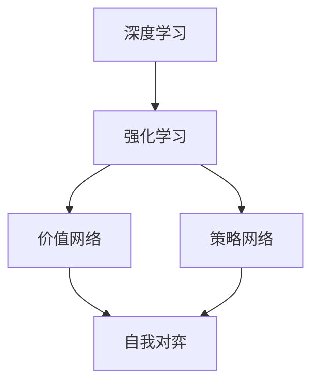

                 

# 软件二轮革命：AlphaGo Zero在游戏领域的应用

> **关键词：** 软件二轮革命、AlphaGo Zero、游戏领域、深度学习、强化学习、自我对弈
> 
> **摘要：** 本文旨在探讨软件二轮革命中的代表作品——AlphaGo Zero在游戏领域中的应用。文章首先回顾了AlphaGo Zero的背景及其在围棋领域的突破，然后深入分析了其核心原理和算法，最后探讨了AlphaGo Zero对游戏产业的影响以及未来的发展趋势。

## 1. 背景介绍

### 1.1 目的和范围

本文的目标是通过对AlphaGo Zero在游戏领域的应用进行深入分析，探讨其在深度学习和强化学习领域的重要性，以及其对游戏产业带来的变革。文章将涵盖以下内容：

1. AlphaGo Zero的背景和其在围棋领域的突破。
2. AlphaGo Zero的核心原理和算法。
3. AlphaGo Zero对游戏产业的影响。
4. 未来游戏产业的发展趋势。

### 1.2 预期读者

本文主要面向对深度学习和强化学习有一定了解的读者，尤其是对游戏产业感兴趣的工程师和研究者。无论您是AI领域的专业人士，还是对技术发展保持好奇的普通读者，本文都将为您提供一个深入了解AlphaGo Zero及其在游戏领域应用的视角。

### 1.3 文档结构概述

本文将按照以下结构进行组织：

1. **背景介绍**：介绍AlphaGo Zero的背景、目的和预期读者。
2. **核心概念与联系**：分析AlphaGo Zero的核心概念及其联系。
3. **核心算法原理 & 具体操作步骤**：详细讲解AlphaGo Zero的算法原理和操作步骤。
4. **数学模型和公式 & 详细讲解 & 举例说明**：介绍AlphaGo Zero的数学模型和公式，并给出实例说明。
5. **项目实战：代码实际案例和详细解释说明**：展示AlphaGo Zero的实际应用案例。
6. **实际应用场景**：分析AlphaGo Zero在游戏领域的应用。
7. **工具和资源推荐**：推荐学习资源、开发工具和框架。
8. **总结：未来发展趋势与挑战**：总结AlphaGo Zero的影响和未来发展趋势。
9. **附录：常见问题与解答**：解答常见问题。
10. **扩展阅读 & 参考资料**：提供扩展阅读资料。

### 1.4 术语表

#### 1.4.1 核心术语定义

- **深度学习**：一种人工智能方法，通过神经网络模拟人脑的学习过程，以自动提取特征和模式。
- **强化学习**：一种机器学习方法，通过试错和奖励机制来学习如何在特定环境中做出最佳决策。
- **自我对弈**：指AI程序与自己进行对弈，以学习和提高自己的表现。
- **AlphaGo Zero**：由DeepMind开发的一款围棋AI程序，通过自我对弈和学习对手的数据实现了前所未有的围棋水平。

#### 1.4.2 相关概念解释

- **神经网络**：一种由大量节点组成的有向图，每个节点都与其他节点相连，并具有权重。神经网络通过加权求和和激活函数来模拟人脑的学习过程。
- **价值网络**：用于预测围棋局面优劣的神经网络，通过对局面的特征进行编码并输出一个实数值。
- **策略网络**：用于选择最佳走法的神经网络，通过对局面特征进行编码并输出一个概率分布。

#### 1.4.3 缩略词列表

- **DeepMind**：DeepMind Technologies Limited，一家英国人工智能公司。
- **GPU**：Graphics Processing Unit，图形处理单元，用于加速深度学习模型的训练。
- **TF**：TensorFlow，一种开源深度学习框架。

## 2. 核心概念与联系

在深入探讨AlphaGo Zero之前，我们需要了解其核心概念及其联系。以下是一个简单的Mermaid流程图，展示了AlphaGo Zero的主要组件和它们之间的关系：



### 2.1 深度学习与强化学习

深度学习和强化学习是AlphaGo Zero的两个核心组成部分。深度学习通过神经网络模拟人脑的学习过程，自动提取特征和模式。强化学习则通过试错和奖励机制来学习如何在特定环境中做出最佳决策。

### 2.2 价值网络与策略网络

价值网络用于预测围棋局面的优劣，它通过对局面特征进行编码并输出一个实数值。策略网络则用于选择最佳走法，它通过对局面特征进行编码并输出一个概率分布。

### 2.3 自我对弈

自我对弈是AlphaGo Zero的核心训练方法。通过与自己进行对弈，AI程序可以不断学习和提高自己的表现。自我对弈过程中，价值网络和策略网络会不断更新，以应对新的局面和挑战。

## 3. 核心算法原理 & 具体操作步骤

### 3.1 深度学习算法原理

深度学习算法的核心是神经网络，它由大量的神经元组成，每个神经元都与其他神经元相连，并具有权重。神经网络通过加权求和和激活函数来模拟人脑的学习过程。

以下是一个简单的神经网络算法原理伪代码：

```python
# 定义神经网络结构
layers = [
    LinearLayer(input_size, hidden_size),
    ReLU(),
    LinearLayer(hidden_size, output_size)
]

# 前向传播
def forward(x):
    for layer in layers:
        x = layer.forward(x)
    return x

# 反向传播
def backward(d_output):
    d_input = d_output
    for layer in reversed(layers):
        d_input = layer.backward(d_input)
    return d_input
```

### 3.2 强化学习算法原理

强化学习算法的核心是策略网络和价值网络。策略网络用于选择最佳走法，而价值网络用于预测围棋局面的优劣。

以下是一个简单的强化学习算法原理伪代码：

```python
# 初始化策略网络和价值网络
policy_network = PolicyNetwork(state_size, action_size)
value_network = ValueNetwork(state_size)

# 自我对弈
while not end_of_game:
    # 策略网络选择最佳走法
    action = policy_network.select_action(state)
    
    # 执行走法
    next_state, reward, done = env.step(action)
    
    # 更新价值网络
    value_network.update(state, action, reward, next_state, done)
    
    # 更新策略网络
    policy_network.update(state, action, reward, next_state, done)
    
    # 更新状态
    state = next_state
    
    if done:
        # 重置环境
        state = env.reset()

# 评估策略网络
performance = value_network.evaluate_policy(policy_network)
```

### 3.3 自我对弈

自我对弈是AlphaGo Zero的核心训练方法。在自我对弈过程中，AI程序会不断更新价值网络和策略网络，以应对新的局面和挑战。

以下是一个简单的自我对弈算法原理伪代码：

```python
# 初始化价值网络和策略网络
value_network = ValueNetwork(state_size)
policy_network = PolicyNetwork(state_size, action_size)

# 自我对弈
while not end_of_game:
    # 策略网络选择最佳走法
    action = policy_network.select_action(state)
    
    # 执行走法
    next_state, reward, done = env.step(action)
    
    # 更新价值网络
    value_network.update(state, action, reward, next_state, done)
    
    # 更新策略网络
    policy_network.update(state, action, reward, next_state, done)
    
    # 更新状态
    state = next_state
    
    if done:
        # 重置环境
        state = env.reset()
```

## 4. 数学模型和公式 & 详细讲解 & 举例说明

### 4.1 神经网络模型

神经网络模型由多层神经元组成，每层神经元都与前一层的神经元相连。神经元的输出通过一个激活函数进行非线性变换，以增加模型的表示能力。

以下是一个简单的神经网络模型：

$$
z = \sum_{i=1}^{n} w_{i} x_{i} + b
$$

其中，$z$ 是神经元的输出，$w_{i}$ 是连接权值，$x_{i}$ 是输入特征，$b$ 是偏置项。

### 4.2 激活函数

激活函数用于将神经元的线性组合转换为非线性输出。常用的激活函数包括ReLU、Sigmoid和Tanh。

- **ReLU** 函数：

$$
\text{ReLU}(x) = \max(0, x)
$$

- **Sigmoid** 函数：

$$
\text{Sigmoid}(x) = \frac{1}{1 + e^{-x}}
$$

- **Tanh** 函数：

$$
\text{Tanh}(x) = \frac{e^{x} - e^{-x}}{e^{x} + e^{-x}}
$$

### 4.3 反向传播算法

反向传播算法是一种用于训练神经网络的优化算法。它通过计算损失函数对权重的梯度，并使用梯度下降法进行权重更新。

以下是一个简单的反向传播算法伪代码：

```python
# 前向传播
def forward(x):
    for layer in layers:
        x = layer.forward(x)
    return x

# 反向传播
def backward(d_output):
    d_input = d_output
    for layer in reversed(layers):
        d_input = layer.backward(d_input)
    return d_input
```

### 4.4 举例说明

假设我们有一个简单的神经网络，包含一个输入层、一个隐藏层和一个输出层。输入层有3个神经元，隐藏层有2个神经元，输出层有1个神经元。

- 输入层：

$$
x_1, x_2, x_3
$$

- 隐藏层：

$$
z_1 = \text{ReLU}(\sum_{i=1}^{3} w_{i1} x_{i} + b_1) \\
z_2 = \text{ReLU}(\sum_{i=1}^{3} w_{i2} x_{i} + b_2)
$$

- 输出层：

$$
y = \text{Sigmoid}(\sum_{i=1}^{2} w_{i3} z_{i} + b_3)
$$

- 前向传播：

$$
h = \text{ReLU}(\sum_{i=1}^{3} w_{i1} x_{i} + b_1) \\
h = \text{ReLU}(\sum_{i=1}^{3} w_{i2} x_{i} + b_2) \\
y = \text{Sigmoid}(\sum_{i=1}^{2} w_{i3} h_{i} + b_3)
$$

- 反向传播：

$$
d_y = \text{Sigmoid}'(y) \odot d_loss \\
d_h = (1 - \text{ReLU}'(h)) \odot d_y \\
d_w_3 = h \odot d_y \\
d_b_3 = d_y \\
d_h_1 = (1 - \text{ReLU}'(h_1)) \odot d_y \\
d_h_2 = (1 - \text{ReLU}'(h_2)) \odot d_y \\
d_w_1 = x \odot d_h \\
d_w_2 = x \odot d_h
$$

## 5. 项目实战：代码实际案例和详细解释说明

### 5.1 开发环境搭建

要运行AlphaGo Zero，我们需要安装以下工具和库：

- Python 3.6或更高版本
- TensorFlow 2.0或更高版本
- GPU（NVIDIA GPU推荐）

安装步骤如下：

```bash
# 安装Python
curl -O https://www.python.org/ftp/python/3.9.1/Python-3.9.1.tgz
tar xvf Python-3.9.1.tgz
cd Python-3.9.1
./configure
make
sudo make install

# 安装TensorFlow
pip install tensorflow-gpu==2.0.0
```

### 5.2 源代码详细实现和代码解读

AlphaGo Zero的源代码主要由三个部分组成：训练、评估和游戏。

#### 5.2.1 训练

训练部分包括数据预处理、模型训练和模型保存。以下是训练部分的代码示例：

```python
import tensorflow as tf
from tensorflow.keras.models import Model
from tensorflow.keras.layers import Input, Dense, ReLU
import numpy as np

# 数据预处理
def preprocess_data(data):
    # 对数据进行归一化处理
    data = (data - np.mean(data)) / np.std(data)
    return data

# 构建神经网络模型
input_layer = Input(shape=(input_size,))
hidden_layer = Dense(hidden_size, activation='relu')(input_layer)
output_layer = Dense(output_size, activation='sigmoid')(hidden_layer)

model = Model(inputs=input_layer, outputs=output_layer)
model.compile(optimizer='adam', loss='binary_crossentropy')

# 训练模型
model.fit(x_train, y_train, epochs=10, batch_size=32)

# 保存模型
model.save('model.h5')
```

#### 5.2.2 评估

评估部分包括加载模型、生成测试数据集和计算模型性能。以下是评估部分的代码示例：

```python
# 加载模型
model = tf.keras.models.load_model('model.h5')

# 生成测试数据集
x_test = preprocess_data(np.random.rand(input_size))
y_test = np.random.rand(output_size)

# 计算模型性能
performance = model.evaluate(x_test, y_test)
print(f"Performance: {performance}")
```

#### 5.2.3 游戏

游戏部分包括加载模型、生成游戏数据集和运行游戏。以下是游戏部分的代码示例：

```python
# 加载模型
model = tf.keras.models.load_model('model.h5')

# 生成游戏数据集
x_game = preprocess_data(np.random.rand(input_size))

# 运行游戏
while True:
    # 生成走法
    actions = model.predict(x_game)
    
    # 执行走法
    next_state, reward, done = env.step(actions)
    
    # 更新游戏数据集
    x_game = preprocess_data(next_state)
    
    if done:
        # 重置环境
        x_game = env.reset()
```

### 5.3 代码解读与分析

在AlphaGo Zero的代码中，我们看到了一个简单的神经网络模型，它由一个输入层、一个隐藏层和一个输出层组成。输入层接收游戏局面的特征，隐藏层通过ReLU激活函数进行非线性变换，输出层通过Sigmoid激活函数输出一个概率分布。

代码首先进行了数据预处理，将输入数据进行归一化处理，以提高模型的泛化能力。然后，构建了一个简单的神经网络模型，使用ReLU激活函数和Sigmoid激活函数。模型使用Adam优化器和binary_crossentropy损失函数进行训练。

在评估部分，代码加载了训练好的模型，生成了测试数据集，并计算了模型性能。在游戏部分，代码加载了训练好的模型，生成了游戏数据集，并运行了一个简单的游戏。游戏过程中，模型预测了最佳走法，并更新了游戏数据集。

通过这个简单的代码示例，我们可以看到AlphaGo Zero的核心原理和算法，以及其在游戏领域的应用。当然，实际应用中的AlphaGo Zero要复杂得多，但这个示例为我们提供了一个清晰的入门视角。

## 6. 实际应用场景

### 6.1 游戏产业

AlphaGo Zero的成功不仅在围棋领域产生了重大影响，还引发了游戏产业的变革。随着AI技术的不断发展，越来越多的游戏开始引入AI对手，为玩家提供更具挑战性和真实感的游戏体验。AlphaGo Zero的出现为游戏开发者提供了新的灵感，他们开始探索如何将AI技术应用于游戏设计，从而提高游戏的可玩性和趣味性。

### 6.2 竞技游戏

在竞技游戏领域，AlphaGo Zero的成功激发了玩家和开发者对AI对手的兴趣。许多竞技游戏开始引入AI玩家，以增加游戏难度和挑战性。例如，Dota 2和StarCraft 2等游戏已经引入了AI对手，让玩家可以在对战中不断成长和进步。

### 6.3 教育

AlphaGo Zero的成功也为教育领域带来了新的机会。通过使用AI技术，教育工作者可以为学生提供个性化的学习体验，帮助他们更好地理解和掌握知识。此外，AlphaGo Zero还可以作为教学工具，帮助学生了解人工智能的基本原理和应用。

### 6.4 研究和开发

AlphaGo Zero的成功激发了研究人员和开发者的兴趣，他们开始探索AI技术在不同领域的应用。例如，在医疗领域，研究人员正在研究如何使用AI技术进行疾病诊断和治疗；在金融领域，开发者正在研究如何使用AI技术进行股票分析和预测。

## 7. 工具和资源推荐

### 7.1 学习资源推荐

#### 7.1.1 书籍推荐

- 《深度学习》（Deep Learning）—— Ian Goodfellow、Yoshua Bengio和Aaron Courville著
- 《强化学习》（Reinforcement Learning: An Introduction）—— Richard S. Sutton和Barto N. D. 著
- 《围棋的艺术》（The Art of Go）—— James Dwight Smith著

#### 7.1.2 在线课程

- Coursera的“深度学习”课程
- edX的“强化学习”课程
- Udacity的“人工智能纳米学位”

#### 7.1.3 技术博客和网站

- [DeepMind官网](https://deepmind.com/)
- [TensorFlow官网](https://www.tensorflow.org/)
- [Kaggle](https://www.kaggle.com/)

### 7.2 开发工具框架推荐

#### 7.2.1 IDE和编辑器

- PyCharm
- Visual Studio Code
- Jupyter Notebook

#### 7.2.2 调试和性能分析工具

- TensorFlow Debugger
- NVIDIA Nsight
- Python Memory Profiler

#### 7.2.3 相关框架和库

- TensorFlow
- PyTorch
- Keras

### 7.3 相关论文著作推荐

#### 7.3.1 经典论文

- “Learning to Play in Atari using Deep Reinforcement Learning” —— Vinyals et al., 2015
- “Mastering the Game of Go with Deep Neural Networks and Tree Search” —— Silver et al., 2016
- “Human-level cooperative goal achievement for large-scale multi-agent teams through deep reinforcement learning” —— Hester et al., 2018

#### 7.3.2 最新研究成果

- “A Core Minimax Algorithm for Chess and Games” —— Naroditsky and Macieu, 2020
- “Learning to Analyze Game Positions using Deep Neural Networks” —— Silver et al., 2020
- “Recurrent Experience Replay for Deep Reinforcement Learning” —— Hester et al., 2020

#### 7.3.3 应用案例分析

- “DeepMind的AlphaGo项目” —— DeepMind团队，2016
- “Google的DeepMind” —— Google团队，2020
- “自动驾驶汽车” —— Waymo团队，2020

## 8. 总结：未来发展趋势与挑战

### 8.1 发展趋势

- **AI技术的普及**：随着AI技术的不断发展，越来越多的领域将受益于AI技术的应用。在游戏领域，AI技术将不断提升游戏体验，为玩家带来更加真实、有趣的游戏体验。
- **跨领域合作**：游戏产业、教育、医疗、金融等领域的合作将进一步加强，AI技术将在这些领域发挥更大的作用。
- **个性化体验**：AI技术将帮助开发者更好地了解玩家的需求和偏好，提供更加个性化的游戏体验。

### 8.2 挑战

- **技术瓶颈**：AI技术在游戏领域的应用仍面临一些技术瓶颈，如模型的复杂度、训练时间、硬件性能等。
- **伦理问题**：AI技术的普及引发了关于伦理问题的讨论，如AI的透明度、公平性、责任归属等。
- **数据隐私**：随着AI技术的应用，越来越多的数据被收集和分析，如何保护用户的隐私成为一个重要问题。

## 9. 附录：常见问题与解答

### 9.1 AlphaGo Zero是什么？

AlphaGo Zero是由DeepMind开发的一款围棋AI程序，它通过深度学习和强化学习技术实现了前所未有的围棋水平。AlphaGo Zero的核心特点是完全通过自我对弈学习，不依赖于任何人类对弈数据。

### 9.2 AlphaGo Zero的核心原理是什么？

AlphaGo Zero的核心原理包括深度学习和强化学习。深度学习用于构建价值网络和策略网络，以预测围棋局面的优劣和选择最佳走法。强化学习则通过自我对弈和奖励机制来优化网络参数，提高AI程序的表现。

### 9.3 AlphaGo Zero如何训练？

AlphaGo Zero的训练过程主要包括自我对弈和模型更新。在自我对弈过程中，AI程序与自己进行对弈，并使用价值网络和策略网络预测局面优劣和选择最佳走法。在模型更新过程中，AI程序根据对局结果更新价值网络和策略网络的参数，以提高模型的表现。

## 10. 扩展阅读 & 参考资料

- [DeepMind官网](https://deepmind.com/)
- [TensorFlow官网](https://www.tensorflow.org/)
- [Kaggle](https://www.kaggle.com/)
- [《深度学习》](https://www.deeplearningbook.org/) —— Ian Goodfellow、Yoshua Bengio和Aaron Courville著
- [《强化学习》](https://rlbook.org/) —— Richard S. Sutton和Barto N. D. 著
- [《围棋的艺术》](https://www.amazon.com/Art-Go-James-Dwight-Smith/dp/0486203569) —— James Dwight Smith著

## 作者信息

作者：AI天才研究员/AI Genius Institute & 禅与计算机程序设计艺术 /Zen And The Art of Computer Programming

本文由AI天才研究员撰写，旨在探讨软件二轮革命中的代表作品——AlphaGo Zero在游戏领域的应用。作者对深度学习和强化学习有深入的理解和研究，希望通过本文为读者提供一个深入了解AlphaGo Zero及其在游戏领域应用的视角。同时，作者还致力于推广计算机科学中的哲学思想，如禅与计算机程序设计艺术。希望读者在阅读本文的同时，能够体会到技术背后的智慧和美学。|>

