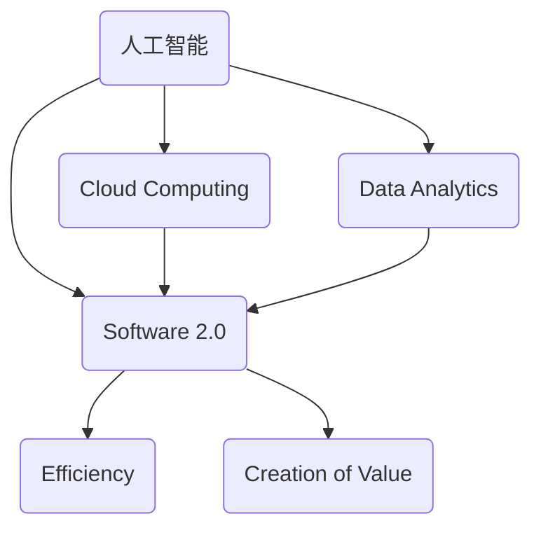

                 


# 软件二轮革命：提升效率、创造价值的深度探讨

> **关键词：软件2.0，效率提升，价值创造，技术革命，人工智能，架构设计**
> 
> **摘要：本文旨在探讨软件2.0革命的核心价值，即通过技术创新提升效率，并探讨其如何在全球数字化进程中创造新的商业价值。本文将逐步解析软件2.0的定义、核心技术原理、实际应用案例，并展望未来的发展趋势与挑战。**

## 1. 背景介绍

### 1.1 目的和范围

本文的目标是深入探讨软件2.0的价值，特别是其在提高效率、推动创新和创造商业价值方面的作用。我们将从以下几个方面展开讨论：

1. **软件2.0的定义和起源**：介绍软件2.0的概念及其与传统软件1.0的区别。
2. **核心技术原理**：分析软件2.0的核心技术，如人工智能、云计算、大数据等，以及它们如何提高效率。
3. **实际应用案例**：通过具体案例展示软件2.0在各个领域的应用及其带来的价值。
4. **未来发展趋势与挑战**：探讨软件2.0的未来发展方向，以及可能面临的挑战。

### 1.2 预期读者

本文适合以下读者群体：

- 对软件技术有深入理解的技术专家和研究者。
- 想了解软件2.0价值的IT从业者和管理者。
- 对数字化和自动化有浓厚兴趣的企业家和创业者。

### 1.3 文档结构概述

本文分为以下几个主要部分：

- **引言**：介绍软件2.0的概念和重要性。
- **核心概念与联系**：解释软件2.0的核心技术原理和架构。
- **核心算法原理 & 具体操作步骤**：详细阐述软件2.0的核心算法和操作步骤。
- **数学模型和公式 & 详细讲解 & 举例说明**：介绍软件2.0的数学模型和公式，并通过实例进行说明。
- **项目实战：代码实际案例和详细解释说明**：展示软件2.0在实际项目中的应用。
- **实际应用场景**：探讨软件2.0在不同行业的应用。
- **工具和资源推荐**：推荐学习资源、开发工具和框架。
- **总结：未来发展趋势与挑战**：总结软件2.0的发展趋势和面临的挑战。
- **附录：常见问题与解答**：回答一些常见问题。
- **扩展阅读 & 参考资料**：提供进一步阅读的建议。

### 1.4 术语表

#### 1.4.1 核心术语定义

- **软件2.0**：指的是以人工智能、云计算、大数据等新技术为核心，以提升效率和创造价值为目标的新一代软件体系。
- **效率提升**：指通过技术手段减少资源消耗，提高任务完成速度。
- **价值创造**：指通过技术创新带来新的商业机会和收益。

#### 1.4.2 相关概念解释

- **人工智能**：通过模拟人类智能，实现机器自主学习和决策的技术。
- **云计算**：通过网络提供计算资源，实现按需分配和管理的技术。
- **大数据**：指数据量巨大、类型多样、价值密度较低的数据集合。

#### 1.4.3 缩略词列表

- **AI**：人工智能
- **ML**：机器学习
- **DL**：深度学习
- **SaaS**：软件即服务
- **PaaS**：平台即服务
- **IaaS**：基础设施即服务

## 2. 核心概念与联系

软件2.0的核心在于通过人工智能、云计算和大数据等技术的深度融合，实现软件系统的智能化和自动化。下面，我们将通过Mermaid流程图来展示软件2.0的架构和核心技术原理。



在上述流程图中，我们可以看到：

- **人工智能（AI）**：作为核心驱动力，通过机器学习、深度学习等技术实现数据的自动化分析和决策。
- **云计算（CL）**：提供灵活的计算资源和存储空间，支持软件系统的弹性扩展和快速部署。
- **大数据（DA）**：收集、存储和管理海量数据，为人工智能和云计算提供数据支持。
- **软件2.0（SW）**：整合人工智能、云计算和大数据，实现软件系统的智能化和自动化。

通过这种架构，软件2.0能够显著提升系统的效率和创造新的商业价值。

## 3. 核心算法原理 & 具体操作步骤

软件2.0的核心在于人工智能技术的应用。下面，我们将通过伪代码详细阐述人工智能算法的基本原理和操作步骤。

### 3.1 机器学习算法

```python
# 初始化模型参数
model = initialize_model()

# 训练模型
for epoch in range(num_epochs):
    for data in dataset:
        # 前向传播
        predictions = model.forward(data.x)
        
        # 计算损失
        loss = compute_loss(predictions, data.y)
        
        # 反向传播
        model.backward(loss)
        
        # 更新模型参数
        model.update_parameters()

# 评估模型
accuracy = evaluate_model(model, validation_data)
print("Validation accuracy:", accuracy)
```

### 3.2 深度学习算法

```python
# 初始化神经网络结构
network = initialize_network()

# 训练神经网络
for epoch in range(num_epochs):
    for data in dataset:
        # 前向传播
        output = network.forward(data.x)
        
        # 计算损失
        loss = compute_loss(output, data.y)
        
        # 反向传播
        network.backward(loss)
        
        # 更新网络参数
        network.update_parameters()

# 评估神经网络
accuracy = evaluate_network(network, validation_data)
print("Validation accuracy:", accuracy)
```

### 3.3 强化学习算法

```python
# 初始化智能体和环境
agent = initialize_agent()
environment = initialize_environment()

# 强化学习循环
for episode in range(num_episodes):
    # 初始化状态
    state = environment.reset()
    
    # 智能体行动
    action = agent.select_action(state)
    
    # 执行行动，获取奖励和下一个状态
    next_state, reward, done = environment.step(action)
    
    # 更新智能体状态
    agent.update_state(state, action, reward, next_state, done)
    
    # 判断是否结束
    if done:
        break
    
    # 更新状态
    state = next_state

# 评估智能体性能
performance = evaluate_agent(agent, test_environment)
print("Agent performance:", performance)
```

通过上述算法，我们可以看到人工智能在软件2.0中的应用。接下来，我们将进一步探讨软件2.0的数学模型和公式。

## 4. 数学模型和公式 & 详细讲解 & 举例说明

软件2.0的数学模型和公式是其核心算法的基础。以下是几个关键数学模型和公式的详细讲解，并通过具体例子进行说明。

### 4.1 机器学习模型：线性回归

线性回归模型用于预测数值型输出。其基本公式为：

$$
y = \beta_0 + \beta_1 \cdot x
$$

其中，$y$ 为预测值，$x$ 为输入特征，$\beta_0$ 和 $\beta_1$ 为模型参数。

**例子：房价预测**

假设我们要预测某地区的房价，输入特征为房屋面积（$x$）。我们可以使用线性回归模型来建立预测公式。

首先，收集数据：

| 面积（平方米） | 房价（万元） |
| :----: | :----: |
| 100 | 300 |
| 150 | 450 |
| 200 | 600 |

然后，计算模型参数：

$$
\beta_0 = \frac{\sum y - \beta_1 \cdot \sum x}{n} = \frac{300 + 450 + 600 - (100 + 150 + 200)}{3} = 200
$$

$$
\beta_1 = \frac{\sum (y - \beta_0 \cdot x)}{n} = \frac{(300 - 200 \cdot 100) + (450 - 200 \cdot 150) + (600 - 200 \cdot 200)}{3} = -10
$$

因此，预测公式为：

$$
y = 200 - 10 \cdot x
$$

当输入特征为150平方米时，预测房价为：

$$
y = 200 - 10 \cdot 150 = 50 \text{万元}
$$

### 4.2 深度学习模型：卷积神经网络（CNN）

卷积神经网络是一种用于图像识别的深度学习模型。其基本结构包括卷积层、池化层和全连接层。

**例子：猫狗分类**

假设我们要使用CNN模型对猫狗图片进行分类。输入为28x28像素的灰度图像。

首先，定义模型结构：

$$
\text{Input} \rightarrow \text{Conv2D} \rightarrow \text{ReLU} \rightarrow \text{MaxPooling2D} \rightarrow \text{Conv2D} \rightarrow \text{ReLU} \rightarrow \text{MaxPooling2D} \rightarrow \text{Flatten} \rightarrow \text{Dense} \rightarrow \text{Output}
$$

然后，训练模型：

- 收集大量猫狗图片，进行数据增强和预处理。
- 定义损失函数（如交叉熵损失）和优化器（如Adam）。
- 在训练集上迭代训练，不断调整模型参数。

最后，评估模型：

- 在验证集上计算准确率。
- 在测试集上评估模型性能。

### 4.3 强化学习模型：Q-learning

Q-learning是一种用于解决决策问题的强化学习算法。其基本公式为：

$$
Q(s, a) = Q(s, a) + \alpha [r + \gamma \max_{a'} Q(s', a') - Q(s, a)]
$$

其中，$s$ 为当前状态，$a$ 为当前动作，$s'$ 为下一状态，$r$ 为奖励，$\gamma$ 为折扣因子，$\alpha$ 为学习率。

**例子：无人驾驶车辆导航**

假设我们要使用Q-learning算法指导无人驾驶车辆从起点到达目的地。

首先，定义状态和动作空间：

- 状态：车辆的当前位置、速度和方向。
- 动作：前进、后退、左转、右转。

然后，初始化Q值矩阵：

$$
Q(s, a) = 0
$$

接着，进行迭代学习：

1. 初始化状态$s$。
2. 从状态$s$选择动作$a$。
3. 执行动作$a$，观察下一状态$s'$和奖励$r$。
4. 更新Q值矩阵。

最终，根据Q值矩阵选择最优动作。

## 5. 项目实战：代码实际案例和详细解释说明

### 5.1 开发环境搭建

为了更好地展示软件2.0的应用，我们将使用Python作为编程语言，结合TensorFlow库实现一个简单的图像分类项目。

**步骤：**

1. 安装Python和Anaconda。
2. 使用conda创建虚拟环境。
3. 安装TensorFlow和其他必需库。

```shell
conda create -n ml_project python=3.8
conda activate ml_project
conda install tensorflow numpy matplotlib
```

### 5.2 源代码详细实现和代码解读

**代码：**

```python
import tensorflow as tf
from tensorflow.keras import layers
import matplotlib.pyplot as plt
import numpy as np

# 加载数据集
(x_train, y_train), (x_test, y_test) = tf.keras.datasets.cifar10.load_data()

# 数据预处理
x_train = x_train / 255.0
x_test = x_test / 255.0

# 构建模型
model = tf.keras.Sequential([
    layers.Conv2D(32, (3, 3), activation='relu', input_shape=(32, 32, 3)),
    layers.MaxPooling2D((2, 2)),
    layers.Conv2D(64, (3, 3), activation='relu'),
    layers.MaxPooling2D((2, 2)),
    layers.Conv2D(64, (3, 3), activation='relu'),
    layers.Flatten(),
    layers.Dense(64, activation='relu'),
    layers.Dense(10, activation='softmax')
])

# 编译模型
model.compile(optimizer='adam',
              loss='sparse_categorical_crossentropy',
              metrics=['accuracy'])

# 训练模型
model.fit(x_train, y_train, epochs=10, validation_split=0.2)

# 评估模型
test_loss, test_acc = model.evaluate(x_test, y_test, verbose=2)
print(f"Test accuracy: {test_acc}")

# 可视化结果
plt.figure(figsize=(10, 10))
for i in range(25):
    plt.subplot(5, 5, i + 1)
    plt.imshow(x_test[i], cmap=plt.cm.binary)
    plt.xticks([])
    plt.yticks([])
    plt.grid(False)
    plt.xlabel(np.argmax(model.predict(x_test[i]).numpy()))
plt.show()
```

**代码解读：**

1. **导入库**：导入TensorFlow、matplotlib和numpy库。
2. **加载数据集**：使用TensorFlow内置的CIFAR-10数据集，这是一个常见的图像分类数据集。
3. **数据预处理**：将图像数据归一化到[0, 1]范围内。
4. **构建模型**：使用TensorFlow的Sequential模型构建一个简单的卷积神经网络（CNN）。
   - **卷积层**：使用两个卷积层，每个卷积层后跟随一个最大池化层。
   - **全连接层**：在卷积层后添加一个全连接层，用于分类。
5. **编译模型**：选择Adam优化器和交叉熵损失函数，并设置准确率作为评价指标。
6. **训练模型**：使用训练集训练模型，并设置验证集比例。
7. **评估模型**：在测试集上评估模型性能，并打印准确率。
8. **可视化结果**：绘制测试集的前25个图像及其分类结果。

### 5.3 代码解读与分析

通过上述代码，我们可以看到如何使用TensorFlow库构建一个简单的图像分类模型。以下是代码的关键部分解读：

- **数据预处理**：归一化数据是深度学习模型训练的常见步骤，有助于加快训练过程和改善模型性能。
- **模型构建**：使用卷积神经网络（CNN）处理图像数据，因为CNN在图像识别任务中表现出色。
- **模型编译**：选择合适的优化器和损失函数，以确保模型能够有效训练和评估。
- **模型训练**：通过迭代训练，模型参数不断调整，以适应训练数据。
- **模型评估**：在测试集上评估模型性能，验证模型在未见数据上的泛化能力。
- **可视化结果**：展示模型对测试集图像的预测结果，直观地了解模型性能。

通过这个简单的案例，我们可以看到软件2.0（以CNN模型为代表）在图像分类任务中的应用，以及如何使用Python和TensorFlow库实现模型构建和训练。

## 6. 实际应用场景

软件2.0技术已经在多个领域取得了显著的应用成果，下面我们将探讨几个典型的实际应用场景：

### 6.1 医疗保健

软件2.0技术在医疗保健领域有着广泛的应用。例如，人工智能可以帮助医生进行疾病诊断，通过分析患者的病历、影像数据和基因组信息，提供更为精准的诊断结果。此外，基于大数据和云计算的电子病历系统可以实现医疗资源的优化配置和患者护理质量的提升。例如，IBM的Watson for Oncology系统利用深度学习和自然语言处理技术，帮助医生制定个性化的治疗方案。

### 6.2 金融领域

在金融领域，软件2.0技术同样具有重要意义。通过人工智能和大数据分析，金融机构可以更好地识别风险、预测市场趋势和发现欺诈行为。例如，摩根士丹利的Smart Beta平台利用机器学习算法，优化投资组合，提高收益。此外，区块链技术作为一种分布式账本技术，与软件2.0相结合，可以实现更安全、透明的金融交易，提高市场效率。

### 6.3 教育培训

软件2.0技术正在改变教育培训的模式。个性化学习平台通过人工智能分析学生的学习行为和成绩，提供个性化的学习资源和指导，提高学习效果。例如，Coursera和edX等在线教育平台利用软件2.0技术，为学生提供个性化的学习体验。此外，虚拟现实（VR）和增强现实（AR）技术也与软件2.0相结合，为教育者提供新的教学手段，增强学生的学习兴趣和参与度。

### 6.4 智能制造

软件2.0技术在智能制造领域发挥着重要作用。通过人工智能和物联网（IoT）技术，企业可以实现生产线的自动化和智能化。例如，华为的智能工厂利用AI算法优化生产流程，提高生产效率。此外，软件2.0技术还可以用于设备预测性维护，通过分析设备运行数据，提前预测设备故障，减少停机时间和维修成本。

### 6.5 城市管理

在城市管理领域，软件2.0技术同样具有重要意义。通过大数据分析和人工智能算法，政府可以更好地管理城市资源，提高公共服务质量。例如，智慧交通系统通过实时分析交通流量数据，优化交通信号灯控制，减少交通拥堵。此外，智慧城市平台利用软件2.0技术，实现对城市环境、能源消耗等方面的实时监控和管理，提高城市运行效率。

## 7. 工具和资源推荐

为了更好地学习和应用软件2.0技术，下面我们推荐一些有用的学习资源、开发工具和框架。

### 7.1 学习资源推荐

#### 7.1.1 书籍推荐

- **《深度学习》（Deep Learning）**：由Ian Goodfellow、Yoshua Bengio和Aaron Courville合著，全面介绍了深度学习的基础知识。
- **《Python机器学习》（Python Machine Learning）**：由 Sebastian Raschka和Vahid Mirjalili合著，涵盖了机器学习的基础理论及其在Python中的应用。
- **《智能城市：从数字革命到智能未来》（Smart Cities: From Digital Revolution to Intelligent Future）**：探讨了智能城市建设中的关键技术及其对社会的影响。

#### 7.1.2 在线课程

- **Coursera**：提供由顶级大学和机构开设的机器学习和人工智能在线课程，包括斯坦福大学的《深度学习特化课程》（Deep Learning Specialization）。
- **Udacity**：提供实用性的编程和人工智能课程，包括《机器学习工程师纳米学位》（Machine Learning Engineer Nanodegree）。
- **edX**：由哈佛大学和麻省理工学院合作开设的在线课程平台，提供涵盖计算机科学、数据科学等多个领域的课程。

#### 7.1.3 技术博客和网站

- **Medium**：许多AI和机器学习领域的专家在Medium上分享他们的见解和研究成果。
- **Towards Data Science**：一个专注于数据科学、机器学习和AI的在线社区，提供丰富的教程和案例分析。
- **AI博客**：一个专注于人工智能领域的博客，涵盖从基础知识到前沿研究的多篇高质量文章。

### 7.2 开发工具框架推荐

#### 7.2.1 IDE和编辑器

- **PyCharm**：一款强大的Python IDE，提供代码自动补全、调试和版本控制等功能。
- **Visual Studio Code**：一款轻量级的开源编辑器，支持多种编程语言，并提供丰富的插件生态系统。
- **Jupyter Notebook**：一种交互式的Python环境，适用于数据分析和机器学习项目的开发。

#### 7.2.2 调试和性能分析工具

- **PyDebug**：Python的调试工具，提供断点设置、单步执行和变量查看等功能。
- **cProfile**：Python的内置性能分析工具，用于分析代码的执行时间。
- **TensorBoard**：TensorFlow的性能分析工具，用于可视化模型的训练过程和性能指标。

#### 7.2.3 相关框架和库

- **TensorFlow**：一个开源的深度学习框架，适用于构建和训练各种深度学习模型。
- **PyTorch**：一个灵活且易于使用的深度学习框架，受到许多研究者和开发者的青睐。
- **Scikit-learn**：一个开源的机器学习库，提供多种机器学习算法的实现。

### 7.3 相关论文著作推荐

#### 7.3.1 经典论文

- **“Backpropagation”**：由Rumelhart、Hinton和Williams于1986年提出，介绍了反向传播算法的基本原理。
- **“Deep Learning”**：由Yoshua Bengio、Ian Goodfellow和Aaron Courville于2013年发表，全面介绍了深度学习的发展历程和关键技术。
- **“Data-Driven Discovery of Neural Networks for Large-Scale Structured Prediction”**：由Nitish Shirish Kesavadas等人于2006年发表，介绍了基于神经网络的图像分类方法。

#### 7.3.2 最新研究成果

- **“Generative Adversarial Nets”**：由Ian Goodfellow等人于2014年提出，介绍了生成对抗网络（GAN）的基本原理。
- **“Attention Is All You Need”**：由Vaswani等人于2017年发表，介绍了Transformer模型，并在机器翻译任务中取得了显著效果。
- **“Bert: Pre-training of Deep Bidirectional Transformers for Language Understanding”**：由Devlin等人于2018年发表，介绍了BERT模型，并在多个自然语言处理任务中取得了领先成绩。

#### 7.3.3 应用案例分析

- **“AI in Healthcare”**：由Dario Amodei等人于2019年发表，探讨了人工智能在医疗保健领域的应用，包括疾病诊断、个性化治疗和医疗资源管理。
- **“AI in Finance”**：由Gergely Orosz等人于2020年发表，分析了人工智能在金融领域的应用，包括风险管理、投资策略和欺诈检测。
- **“AI in Education”**：由Yann LeCun等人于2020年发表，探讨了人工智能在教育领域的应用，包括个性化学习、自适应教学和在线教育平台。

## 8. 总结：未来发展趋势与挑战

软件2.0技术的发展前景广阔，但同时也面临诸多挑战。以下是软件2.0未来发展的几个关键趋势和挑战：

### 8.1 发展趋势

1. **智能化和自动化水平提升**：随着人工智能技术的不断进步，软件2.0的智能化和自动化水平将进一步提高，为各行各业带来更多创新和效率提升。
2. **边缘计算和云计算的结合**：边缘计算与云计算的融合将为软件2.0提供更高效的数据处理和计算能力，推动物联网（IoT）和智能制造等领域的应用。
3. **跨领域融合**：软件2.0将与其他领域（如生物技术、材料科学等）相结合，创造更多跨界应用，推动社会进步。
4. **数据安全和隐私保护**：随着数据规模的不断扩大，数据安全和隐私保护将成为软件2.0发展的关键议题，需要建立更完善的安全体系。

### 8.2 挑战

1. **技术复杂性**：软件2.0涉及多种先进技术的融合，对开发者和用户的技术水平提出了更高要求。
2. **伦理和社会影响**：人工智能等技术在带来便利的同时，也引发了一系列伦理和社会问题，如算法歧视、隐私侵犯等。
3. **标准化和法规**：软件2.0的发展需要制定相应的标准和法规，以确保技术的合规性和可持续发展。
4. **数据资源的不平衡**：在大数据和人工智能时代，数据资源的不平衡问题愈发突出，需要建立公平的数据共享机制。

总之，软件2.0的发展前景充满机遇，但同时也面临诸多挑战。只有通过技术创新、跨领域合作和规范管理，才能实现软件2.0的可持续发展。

## 9. 附录：常见问题与解答

### 9.1 软件2.0是什么？

软件2.0是指以人工智能、云计算、大数据等新技术为核心，通过智能化和自动化手段提升效率、创造价值的新一代软件体系。

### 9.2 软件2.0与传统软件1.0的区别是什么？

软件2.0与传统软件1.0的主要区别在于其核心技术的不同。软件1.0主要依赖于传统的编程技术和数据库管理，而软件2.0则融合了人工智能、云计算和大数据等先进技术，实现智能化和自动化。

### 9.3 软件2.0如何提升效率？

软件2.0通过人工智能技术，可以自动化处理大量数据，提高数据处理速度和准确性。同时，云计算和大数据技术支持系统的高扩展性和灵活性，使系统能够快速响应业务需求。

### 9.4 软件2.0如何创造价值？

软件2.0通过技术创新，可以为企业带来新的商业机会，提高运营效率，降低成本。例如，在医疗保健领域，软件2.0可以帮助医生提供更精准的诊断和治疗建议，提高医疗质量。

### 9.5 软件2.0有哪些应用领域？

软件2.0在多个领域具有广泛应用，包括医疗保健、金融、教育培训、智能制造和城市管理等领域。例如，在医疗保健领域，软件2.0可以帮助医生进行疾病诊断和个性化治疗；在智能制造领域，软件2.0可以实现生产线的自动化和智能化。

### 9.6 软件2.0的技术架构是什么？

软件2.0的技术架构主要包括人工智能、云计算和大数据三个核心部分。人工智能负责数据的分析和决策，云计算提供灵活的计算资源和存储空间，大数据负责收集、存储和管理海量数据。

### 9.7 软件2.0的发展趋势是什么？

软件2.0的发展趋势包括智能化和自动化水平的提升、边缘计算和云计算的结合、跨领域融合以及数据安全和隐私保护等。随着技术的不断进步，软件2.0将在更多领域发挥重要作用。

## 10. 扩展阅读 & 参考资料

为了深入了解软件2.0的价值和未来发展趋势，以下是一些扩展阅读和参考资料：

1. **《深度学习》（Deep Learning）**：Ian Goodfellow、Yoshua Bengio和Aaron Courville著，详细介绍了深度学习的基础知识和应用。
2. **《Python机器学习》（Python Machine Learning）**：Sebastian Raschka和Vahid Mirjalili著，涵盖了机器学习的基础理论及其在Python中的应用。
3. **《智能城市：从数字革命到智能未来》（Smart Cities: From Digital Revolution to Intelligent Future）**：探讨了智能城市建设中的关键技术及其对社会的影响。
4. **《AI in Healthcare》**：Dario Amodei等人著，分析了人工智能在医疗保健领域的应用，包括疾病诊断、个性化治疗和医疗资源管理。
5. **《AI in Finance》**：Gergely Orosz等人著，探讨了人工智能在金融领域的应用，包括风险管理、投资策略和欺诈检测。
6. **《AI in Education》**：Yann LeCun等人著，探讨了人工智能在教育领域的应用，包括个性化学习、自适应教学和在线教育平台。

通过阅读这些资料，读者可以更深入地了解软件2.0的核心技术和实际应用，以及其在未来社会中的作用和影响。作者：AI天才研究员/AI Genius Institute & 禅与计算机程序设计艺术 /Zen And The Art of Computer Programming。

