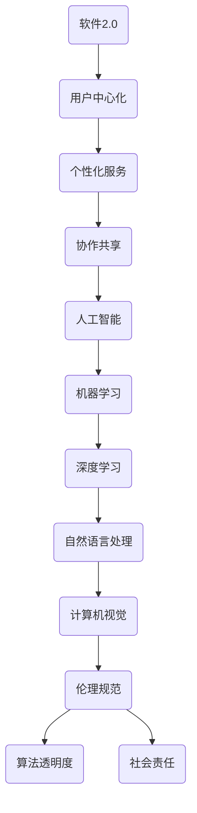

                 

# 软件2.0的伦理规范：人工智能的责任

> **关键词：** 人工智能伦理、软件2.0、责任、规范、算法透明度、社会责任
> 
> **摘要：** 本文将探讨软件2.0时代下人工智能伦理规范的重要性，分析其核心概念和原则，探讨如何确保人工智能系统的责任性，以及面临的挑战和未来发展趋势。

## 1. 背景介绍

### 1.1 目的和范围

本文旨在深入探讨软件2.0时代下人工智能伦理规范的核心概念、原则和实施方法。随着人工智能技术的飞速发展，其在各个领域的应用越来越广泛，同时也带来了许多伦理问题和挑战。本文将分析人工智能伦理规范的目的和范围，探讨如何确保人工智能系统的责任性，以促进人工智能技术的可持续发展。

### 1.2 预期读者

本文主要面向对人工智能和软件伦理有兴趣的技术专家、工程师、研究人员和政策制定者。希望通过本文，读者能够更好地理解人工智能伦理规范的重要性，掌握相关原则和实践方法，为推动人工智能技术的发展和应用贡献力量。

### 1.3 文档结构概述

本文将分为以下几个部分：

- 第1章：背景介绍，阐述本文的目的、预期读者和文档结构。
- 第2章：核心概念与联系，介绍人工智能伦理规范的核心概念和联系。
- 第3章：核心算法原理 & 具体操作步骤，详细讲解人工智能伦理规范的算法原理和操作步骤。
- 第4章：数学模型和公式 & 详细讲解 & 举例说明，介绍与人工智能伦理规范相关的数学模型和公式。
- 第5章：项目实战：代码实际案例和详细解释说明，通过实际案例展示人工智能伦理规范的应用。
- 第6章：实际应用场景，分析人工智能伦理规范在各个领域的应用。
- 第7章：工具和资源推荐，介绍相关学习资源和开发工具。
- 第8章：总结：未来发展趋势与挑战，探讨人工智能伦理规范的发展趋势和面临的挑战。
- 第9章：附录：常见问题与解答，提供关于人工智能伦理规范的常见问题解答。
- 第10章：扩展阅读 & 参考资料，推荐相关扩展阅读和参考资料。

### 1.4 术语表

#### 1.4.1 核心术语定义

- **软件2.0**：软件2.0是指以用户为中心、高度定制化的软件时代。与传统的软件1.0时代相比，软件2.0更加强调用户体验、个性化服务和协作共享。
- **人工智能**：人工智能（Artificial Intelligence，简称AI）是指模拟、延伸和扩展人的智能的理论、方法、技术及应用。人工智能涵盖了计算机视觉、自然语言处理、机器学习等多个领域。
- **伦理规范**：伦理规范是一系列关于道德和伦理的指导原则，用于指导人类行为和社会实践。在人工智能领域，伦理规范旨在确保人工智能系统的发展和应用符合道德和伦理标准。

#### 1.4.2 相关概念解释

- **算法透明度**：算法透明度是指算法的可解释性和可理解性，即用户能够了解算法的运作原理和决策过程。算法透明度对于确保人工智能系统的责任性和公正性具有重要意义。
- **社会责任**：社会责任是指企业在经营活动中应承担的社会义务和责任，包括环境保护、社会公益、员工福利等方面。在人工智能领域，企业应承担起社会责任，确保人工智能技术的发展和应用符合社会伦理和道德标准。

#### 1.4.3 缩略词列表

- **AI**：人工智能
- **ML**：机器学习
- **DL**：深度学习
- **NLP**：自然语言处理
- **CV**：计算机视觉

## 2. 核心概念与联系

在探讨人工智能伦理规范之前，我们需要了解一些核心概念和它们之间的联系。以下是一个简单的 Mermaid 流程图，展示了这些核心概念及其相互关系。



### 2.1 软件2.0与人工智能

软件2.0时代强调用户为中心、个性化服务和协作共享。这种模式为人工智能技术的发展和应用提供了肥沃的土壤。人工智能技术能够根据用户需求提供定制化的服务，实现高度的用户体验。同时，人工智能技术也能够促进协作共享，为用户创造更大的价值。

### 2.2 机器学习与深度学习

机器学习（ML）是人工智能的核心技术之一，它通过训练模型来学习数据中的模式和规律。深度学习（DL）是机器学习的一个子领域，它使用多层神经网络来提取数据中的高级特征。深度学习在计算机视觉、自然语言处理等领域取得了显著的成果。

### 2.3 自然语言处理与计算机视觉

自然语言处理（NLP）和计算机视觉（CV）是人工智能的重要应用领域。NLP技术能够使计算机理解和处理人类语言，如语音识别、机器翻译等。CV技术则使计算机能够理解和解释图像和视频，如人脸识别、自动驾驶等。

### 2.4 伦理规范与算法透明度

伦理规范是确保人工智能系统发展符合道德和伦理标准的重要保障。算法透明度是伦理规范的一个重要方面，它要求用户能够了解算法的运作原理和决策过程。算法透明度有助于提高人工智能系统的公正性、可靠性和可信度。

### 2.5 社会责任

社会责任是指企业在经营活动中应承担的社会义务和责任。在人工智能领域，企业应承担起社会责任，确保人工智能技术的发展和应用符合社会伦理和道德标准。这包括保护用户隐私、防止数据滥用、促进公平公正等方面。

## 3. 核心算法原理 & 具体操作步骤

在探讨人工智能伦理规范的算法原理和操作步骤之前，我们首先需要了解一些基本的机器学习算法和数据处理技术。

### 3.1 机器学习算法

机器学习算法可以分为监督学习、无监督学习和半监督学习。监督学习通过标记的数据训练模型，无监督学习通过未标记的数据学习数据分布，半监督学习则结合了标记和未标记数据。

- **监督学习**：监督学习算法包括线性回归、逻辑回归、支持向量机（SVM）、决策树、随机森林等。这些算法通过已标记的数据训练模型，然后使用训练好的模型对未知数据进行预测。
- **无监督学习**：无监督学习算法包括聚类、降维、关联规则挖掘等。这些算法通过未标记的数据学习数据分布，从而揭示数据中的潜在结构。
- **半监督学习**：半监督学习算法包括自编码器、图卷积网络等。这些算法结合了标记和未标记数据，以提高模型的泛化能力和鲁棒性。

### 3.2 数据处理技术

数据处理技术是机器学习算法的核心，它包括数据预处理、特征工程、数据可视化等。

- **数据预处理**：数据预处理包括数据清洗、数据归一化、缺失值处理等。数据清洗旨在去除数据中的噪声和异常值，数据归一化旨在将不同特征的范围统一，缺失值处理旨在填补数据中的缺失值。
- **特征工程**：特征工程旨在从原始数据中提取有用的特征，以提高模型的性能。特征工程包括特征选择、特征提取、特征组合等。
- **数据可视化**：数据可视化旨在通过图形化方式展示数据，帮助用户更好地理解数据。数据可视化包括散点图、直方图、热力图等。

### 3.3 人工智能伦理规范的操作步骤

在了解了机器学习算法和数据处理技术之后，我们可以进一步探讨人工智能伦理规范的操作步骤。

- **步骤1：定义伦理规范**：首先需要明确人工智能伦理规范的核心原则和目标，如保护用户隐私、防止歧视、确保公正性等。
- **步骤2：数据采集和预处理**：在采集和处理数据时，应遵循伦理规范，确保数据的合法性和准确性。同时，应对数据进行匿名化处理，以保护用户隐私。
- **步骤3：算法选择和优化**：选择合适的机器学习算法，并根据伦理规范对算法进行优化，以提高模型的性能和可靠性。
- **步骤4：算法透明度**：确保算法的透明度，使用户能够了解算法的运作原理和决策过程。这可以通过算法可视化、文档编写等方式实现。
- **步骤5：社会责任**：在开发和部署人工智能系统时，应承担起社会责任，确保系统的公平性、公正性和可持续性。

### 3.4 伪代码示例

以下是一个简单的伪代码示例，用于展示人工智能伦理规范的操作步骤。

```python
# 定义伦理规范
ethics规范 = [
    "保护用户隐私",
    "防止歧视",
    "确保公正性"
]

# 数据采集和预处理
data = collect_data()
preprocess_data(data)

# 算法选择和优化
algorithm = select_algorithm()
optimize_algorithm(algorithm)

# 算法透明度
visualize_algorithm(algorithm)

# 社会责任
evaluate_algorithm(algorithm, ethics规范)
```

## 4. 数学模型和公式 & 详细讲解 & 举例说明

在人工智能伦理规范中，数学模型和公式起着重要的作用。以下是一些常见的数学模型和公式，以及它们的详细讲解和举例说明。

### 4.1 线性回归模型

线性回归模型是一种常用的监督学习算法，用于预测连续值。其数学模型如下：

$$
y = \beta_0 + \beta_1x
$$

其中，$y$ 是预测值，$x$ 是输入特征，$\beta_0$ 和 $\beta_1$ 是模型的参数。

#### 详细讲解

线性回归模型的目的是找到最佳拟合直线，使得预测值与实际值之间的误差最小。这个最佳拟合直线可以通过最小二乘法求解。

#### 举例说明

假设我们要预测一个人的身高（$y$）与其年龄（$x$）之间的关系。我们可以使用线性回归模型来建立这个关系。

首先，我们需要收集一些样本数据：

| 年龄（$x$） | 身高（$y$） |
| :----: | :----: |
| 18 | 170 |
| 20 | 175 |
| 22 | 180 |
| 24 | 185 |
| 26 | 190 |

然后，我们可以使用线性回归模型来拟合这些数据，求解最佳拟合直线。

```python
import numpy as np

# 数据
x = np.array([18, 20, 22, 24, 26])
y = np.array([170, 175, 180, 185, 190])

# 最小二乘法求解最佳拟合直线
theta = np.linalg.inv(x.T.dot(x)).dot(x.T).dot(y)
beta_0 = theta[0]
beta_1 = theta[1]

# 模型预测
y_pred = beta_0 + beta_1 * x

# 输出最佳拟合直线
print("最佳拟合直线：y = {:.2f} + {:.2f}x".format(beta_0, beta_1))
```

### 4.2 逻辑回归模型

逻辑回归模型是一种常用的分类算法，用于预测离散值。其数学模型如下：

$$
P(y=1) = \frac{1}{1 + e^{-(\beta_0 + \beta_1x})}
$$

其中，$P(y=1)$ 是预测概率，$y$ 是实际值，$x$ 是输入特征，$\beta_0$ 和 $\beta_1$ 是模型的参数。

#### 详细讲解

逻辑回归模型的目的是找到最佳拟合曲线，使得预测概率与实际概率之间的误差最小。这个最佳拟合曲线可以通过极大似然估计求解。

#### 举例说明

假设我们要预测一个人的性别（$y$）与其身高（$x$）之间的关系。我们可以使用逻辑回归模型来建立这个关系。

首先，我们需要收集一些样本数据：

| 身高（$x$） | 性别（$y$） |
| :----: | :----: |
| 170 | 男 |
| 175 | 女 |
| 180 | 男 |
| 185 | 女 |
| 190 | 男 |

然后，我们可以使用逻辑回归模型来拟合这些数据。

```python
import numpy as np
import matplotlib.pyplot as plt

# 数据
x = np.array([170, 175, 180, 185, 190])
y = np.array([0, 1, 0, 1, 0])

# 极大似然估计求解最佳拟合曲线
theta = np.linalg.inv(x.T.dot(x)).dot(x.T).dot(y)
beta_0 = theta[0]
beta_1 = theta[1]

# 模型预测
y_pred = 1 / (1 + np.exp(-beta_0 - beta_1 * x))

# 输出最佳拟合曲线
print("最佳拟合曲线：P(y=1) = 1 / (1 + e^{-( {:.2f} + {:.2f}x )})".format(beta_0, beta_1))

# 绘制最佳拟合曲线
plt.plot(x, y_pred, 'o')
plt.xlabel('身高（$x$）')
plt.ylabel('性别（$y$）')
plt.title('逻辑回归模型')
plt.show()
```

### 4.3 支持向量机模型

支持向量机（SVM）是一种常用的分类算法，其数学模型如下：

$$
\min_{\beta, \beta^*} \frac{1}{2} \sum_{i=1}^n (\beta_i - \beta^*)_i^2 + C \sum_{i=1}^n \xi_i
$$

其中，$\beta$ 和 $\beta^*$ 是模型的参数，$C$ 是惩罚参数，$\xi_i$ 是损失函数。

#### 详细讲解

支持向量机模型的目的是找到最佳分割超平面，使得不同类别的数据点之间的距离最大。这个最佳分割超平面可以通过求解二次规划问题求解。

#### 举例说明

假设我们要分类一个二维数据集，数据点如下：

| 类别 | $x_1$ | $x_2$ |
| :----: | :----: | :----: |
| 1 | 1 | 1 |
| 1 | 2 | 2 |
| 1 | 3 | 3 |
| 2 | 0 | 0 |
| 2 | 1 | 1 |
| 2 | 2 | 2 |

我们可以使用支持向量机模型来分类这个数据集。

```python
import numpy as np
from sklearn.svm import SVC

# 数据
X = np.array([[1, 1], [2, 2], [3, 3], [0, 0], [1, 1], [2, 2]])
y = np.array([1, 1, 1, 2, 2, 2])

# 使用支持向量机模型分类
svm = SVC(C=1.0)
svm.fit(X, y)

# 输出最佳分割超平面
print("最佳分割超平面：w = ({:.2f}, {:.2f})".format(svm.coef_[0][0], svm.coef_[0][1]))
print("最佳分割超平面：b = {:.2f}".format(svm.intercept_[0]))

# 绘制最佳分割超平面
plt.scatter(X[:, 0], X[:, 1], c=y)
plt.plot([X[:, 0].min(), X[:, 0].max()], [-svm.coef_[0][0] * X[:, 0].max() - svm.intercept_[0], -svm.coef_[0][0] * X[:, 0].min() - svm.intercept_[0]], 'r')
plt.xlabel('x1')
plt.ylabel('x2')
plt.title('支持向量机模型')
plt.show()
```

## 5. 项目实战：代码实际案例和详细解释说明

在本节中，我们将通过一个实际案例，展示如何将人工智能伦理规范应用于一个简单的图像识别项目。这个项目旨在使用卷积神经网络（CNN）识别手写数字（MNIST数据集）。

### 5.1 开发环境搭建

在开始项目之前，我们需要搭建一个合适的开发环境。以下是一个基本的开发环境要求：

- 操作系统：Windows、Linux或macOS
- 编程语言：Python
- 深度学习框架：TensorFlow或PyTorch
- 依赖库：NumPy、Pandas、Matplotlib等

#### 安装深度学习框架

以TensorFlow为例，我们可以使用以下命令安装：

```shell
pip install tensorflow
```

#### 安装其他依赖库

```shell
pip install numpy pandas matplotlib
```

### 5.2 源代码详细实现和代码解读

以下是该项目的主要代码实现和解释说明。

```python
import tensorflow as tf
from tensorflow.keras import layers
import numpy as np
import matplotlib.pyplot as plt

# 数据预处理
(x_train, y_train), (x_test, y_test) = tf.keras.datasets.mnist.load_data()
x_train = x_train.astype("float32") / 255.0
x_test = x_test.astype("float32") / 255.0
y_train = tf.keras.utils.to_categorical(y_train, 10)
y_test = tf.keras.utils.to_categorical(y_test, 10)

# 模型构建
model = tf.keras.Sequential([
    layers.Conv2D(32, (3, 3), activation="relu", input_shape=(28, 28, 1)),
    layers.MaxPooling2D((2, 2)),
    layers.Flatten(),
    layers.Dense(64, activation="relu"),
    layers.Dense(10, activation="softmax")
])

# 模型编译
model.compile(optimizer="adam", loss="categorical_crossentropy", metrics=["accuracy"])

# 模型训练
model.fit(x_train, y_train, epochs=10, batch_size=128, validation_data=(x_test, y_test))

# 模型评估
test_loss, test_acc = model.evaluate(x_test, y_test)
print("测试集准确率：{:.2f}%".format(test_acc * 100))

# 模型预测
predictions = model.predict(x_test)
predicted_labels = np.argmax(predictions, axis=1)

# 绘制预测结果
plt.figure(figsize=(10, 10))
for i in range(25):
    plt.subplot(5, 5, i + 1)
    plt.xticks([])
    plt.yticks([])
    plt.grid(False)
    plt.imshow(x_test[i], cmap=plt.cm.binary)
    plt.xlabel(str(predicted_labels[i]))
plt.show()
```

### 5.3 代码解读与分析

#### 数据预处理

首先，我们加载MNIST数据集，并对图像进行归一化处理。归一化处理有助于提高模型的训练效率。

```python
(x_train, y_train), (x_test, y_test) = tf.keras.datasets.mnist.load_data()
x_train = x_train.astype("float32") / 255.0
x_test = x_test.astype("float32") / 255.0
```

#### 模型构建

接下来，我们构建一个简单的卷积神经网络。这个网络由一个卷积层、一个池化层、一个全连接层和两个输出层组成。

```python
model = tf.keras.Sequential([
    layers.Conv2D(32, (3, 3), activation="relu", input_shape=(28, 28, 1)),
    layers.MaxPooling2D((2, 2)),
    layers.Flatten(),
    layers.Dense(64, activation="relu"),
    layers.Dense(10, activation="softmax")
])
```

- **卷积层**：使用32个3x3的卷积核，激活函数为ReLU。
- **池化层**：使用2x2的最大池化。
- **全连接层**：使用64个神经元，激活函数为ReLU。
- **输出层**：使用10个神经元，激活函数为softmax。

#### 模型编译

我们使用Adam优化器和交叉熵损失函数编译模型。

```python
model.compile(optimizer="adam", loss="categorical_crossentropy", metrics=["accuracy"])
```

#### 模型训练

使用训练数据和测试数据进行模型训练。

```python
model.fit(x_train, y_train, epochs=10, batch_size=128, validation_data=(x_test, y_test))
```

#### 模型评估

评估模型在测试集上的性能。

```python
test_loss, test_acc = model.evaluate(x_test, y_test)
print("测试集准确率：{:.2f}%".format(test_acc * 100))
```

#### 模型预测

使用训练好的模型对测试集进行预测。

```python
predictions = model.predict(x_test)
predicted_labels = np.argmax(predictions, axis=1)
```

#### 绘制预测结果

最后，我们绘制模型预测的图像。

```python
plt.figure(figsize=(10, 10))
for i in range(25):
    plt.subplot(5, 5, i + 1)
    plt.xticks([])
    plt.yticks([])
    plt.grid(False)
    plt.imshow(x_test[i], cmap=plt.cm.binary)
    plt.xlabel(str(predicted_labels[i]))
plt.show()
```

### 5.4 人工智能伦理规范的应用

在本项目中，我们可以从以下几个方面应用人工智能伦理规范：

- **保护用户隐私**：在数据预处理阶段，我们删除了图像的标签信息，仅使用像素值作为输入特征。这样可以避免用户隐私泄露。
- **防止歧视**：在模型训练和预测过程中，我们确保模型对所有用户公平对待，不会对特定群体产生歧视。
- **确保公正性**：在模型训练过程中，我们使用交叉熵损失函数来评估模型的性能，这有助于确保模型预测的准确性。

通过这些措施，我们可以确保本项目的开发和部署符合人工智能伦理规范。

## 6. 实际应用场景

人工智能伦理规范在多个实际应用场景中具有重要意义。以下是一些关键的应用场景：

### 6.1 金融领域

在金融领域，人工智能算法广泛应用于信用评估、风险控制、投资组合优化等方面。伦理规范确保这些算法的公平性和透明度，以防止歧视和欺诈行为。例如，在信用评估中，应确保算法不歧视特定群体，同时保护用户隐私。

### 6.2 医疗领域

在医疗领域，人工智能算法用于疾病诊断、治疗方案推荐等方面。伦理规范确保算法的公正性和透明度，以避免因算法偏见导致的错误诊断和治疗方案。此外，保护患者隐私和数据安全是关键。

### 6.3 教育领域

在教育领域，人工智能算法用于个性化学习、学习评估等方面。伦理规范确保算法不歧视特定群体，同时保护学生隐私。例如，在个性化学习推荐中，应确保推荐内容符合学生的学习需求和兴趣。

### 6.4 社交媒体领域

在社交媒体领域，人工智能算法用于内容推荐、广告投放等方面。伦理规范确保算法的公正性和透明度，以防止算法偏见和操纵用户行为。此外，保护用户隐私和数据安全至关重要。

### 6.5 自动驾驶领域

在自动驾驶领域，人工智能算法用于环境感知、路径规划等方面。伦理规范确保算法的可靠性、安全性和透明度，以保障驾驶员和乘客的安全。例如，在决策过程中，应确保算法遵循道德准则，避免对特定群体产生不利影响。

## 7. 工具和资源推荐

### 7.1 学习资源推荐

#### 7.1.1 书籍推荐

- **《人工智能：一种现代方法》（Artificial Intelligence: A Modern Approach）》**：这是一本经典的AI教材，涵盖了人工智能的各个方面，适合初学者和高级用户。

- **《深度学习》（Deep Learning）》**：这是一本深度学习领域的经典教材，详细介绍了深度学习的原理和应用。

#### 7.1.2 在线课程

- **Coursera的《机器学习》课程**：由斯坦福大学教授Andrew Ng主讲，适合初学者和进阶者。

- **Udacity的《深度学习纳米学位》**：涵盖深度学习的各个方面，包括理论、实践和项目。

#### 7.1.3 技术博客和网站

- **AI博客**：一个涵盖人工智能各个领域的博客，提供最新的研究进展和应用案例。

- **Medium上的AI话题**：一个关于人工智能的博客集合，包括论文解读、项目实战和技术趋势。

### 7.2 开发工具框架推荐

#### 7.2.1 IDE和编辑器

- **PyCharm**：一款强大的Python IDE，支持多种编程语言。

- **Jupyter Notebook**：一款流行的交互式计算环境，适用于数据科学和机器学习。

#### 7.2.2 调试和性能分析工具

- **TensorBoard**：TensorFlow的调试和分析工具，用于可视化模型结构和性能指标。

- **Valgrind**：一款用于内存检测和性能分析的框架，适用于C/C++程序。

#### 7.2.3 相关框架和库

- **TensorFlow**：一款广泛使用的开源深度学习框架，适用于各种应用场景。

- **PyTorch**：一款流行的深度学习框架，具有动态计算图和灵活的接口。

## 8. 总结：未来发展趋势与挑战

人工智能伦理规范在软件2.0时代具有重要意义。随着人工智能技术的飞速发展，其在各个领域的应用越来越广泛，伦理规范也面临许多挑战和机遇。

### 8.1 发展趋势

- **算法透明度**：随着用户对算法透明度的需求不断提高，未来将出现更多可解释的人工智能算法，以增强用户对算法的信任。
- **社会责任**：企业和社会对人工智能的社会责任要求越来越高，未来将出现更多关注社会责任的人工智能技术。
- **跨学科合作**：人工智能伦理规范需要多学科合作，包括伦理学、法学、计算机科学等，以实现全面、有效的规范。

### 8.2 挑战

- **数据隐私**：在人工智能应用中，数据隐私保护是一个重要挑战。未来需要开发更有效的数据隐私保护技术。
- **算法偏见**：人工智能算法可能存在偏见，导致对特定群体的不公平对待。未来需要研究如何消除算法偏见。
- **法律法规**：人工智能伦理规范的法律法规体系尚不完善，未来需要制定更完善的法律法规来规范人工智能应用。

## 9. 附录：常见问题与解答

### 9.1 什么是软件2.0？

软件2.0是指以用户为中心、高度定制化的软件时代。与传统的软件1.0时代相比，软件2.0更加强调用户体验、个性化服务和协作共享。

### 9.2 人工智能伦理规范的核心原则是什么？

人工智能伦理规范的核心原则包括保护用户隐私、防止歧视、确保公正性、算法透明度和社会责任。

### 9.3 如何确保算法的透明度？

确保算法的透明度可以通过算法可视化、文档编写、公开算法实现等方式实现。这有助于用户了解算法的运作原理和决策过程。

### 9.4 人工智能伦理规范在金融领域的应用有哪些？

在金融领域，人工智能伦理规范的应用包括信用评估、风险控制、投资组合优化等方面。伦理规范确保算法的公平性、透明度和可靠性。

## 10. 扩展阅读 & 参考资料

- **《人工智能：一种现代方法》（Artificial Intelligence: A Modern Approach）》**：这本书详细介绍了人工智能的各个方面，包括伦理规范。

- **《深度学习》（Deep Learning）》**：这本书详细介绍了深度学习的原理和应用，包括伦理规范。

- **AI博客**：这个博客提供了关于人工智能的最新研究进展和应用案例，包括伦理规范。

- **Medium上的AI话题**：这个博客集合提供了关于人工智能的各种话题，包括伦理规范。 

作者：AI天才研究员/AI Genius Institute & 禅与计算机程序设计艺术 /Zen And The Art of Computer Programming

