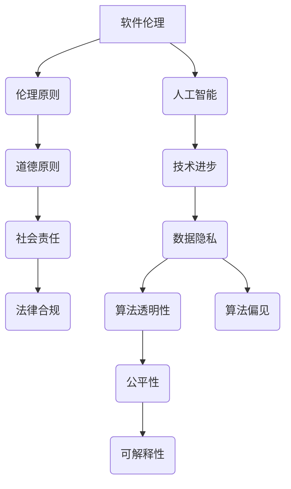

                 

# 软件伦理规范：人工智能的责任

## 关键词：软件伦理，人工智能，责任，伦理规范，AI伦理，软件2.0

## 摘要：
本文深入探讨了软件伦理规范在人工智能领域的应用及其重要性。随着人工智能技术的迅猛发展，如何在软件开发中融入伦理考量成为了一个亟待解决的问题。本文首先介绍了软件伦理的概念和起源，随后详细阐述了人工智能在软件开发中引发的伦理挑战，并提出了构建人工智能伦理规范的框架。通过具体的案例分析和工具推荐，本文旨在为开发者提供实用的指导，以应对人工智能时代的伦理挑战，推动软件行业的健康发展。

## 1. 背景介绍

### 1.1 目的和范围
本文旨在探讨软件伦理规范在人工智能（AI）领域的应用，分析其在软件开发中的重要性，并提出相应的伦理规范框架。通过详细的理论阐述和实际案例分析，本文希望为软件开发者提供实用的指导，以促进人工智能技术的负责任发展和应用。

### 1.2 预期读者
本文适合对人工智能和软件伦理有兴趣的读者，包括软件工程师、人工智能研究员、伦理学家、政策制定者以及其他关注人工智能技术发展的专业人士。

### 1.3 文档结构概述
本文分为八个部分：首先介绍软件伦理和人工智能的背景知识；然后详细分析AI在软件开发中面临的伦理挑战；接着提出构建AI伦理规范的框架；通过具体案例展示规范的应用；讨论实际应用场景；推荐相关工具和资源；最后总结未来发展趋势和挑战，并提供常见问题解答和扩展阅读。

### 1.4 术语表

#### 1.4.1 核心术语定义
- **软件伦理**：软件工程中的伦理规范，涉及软件开发过程中应遵循的道德原则和价值观。
- **人工智能**：模拟人类智能的计算机系统，能够学习、推理、解决问题和执行任务。
- **伦理规范**：规定在特定领域内应如何行为的规则和指导原则。

#### 1.4.2 相关概念解释
- **算法偏见**：算法在处理数据时，对某些群体产生的系统性偏差。
- **隐私保护**：在数据处理过程中，保护个人隐私信息不被非法获取和滥用。
- **公平性**：确保人工智能系统在决策过程中对所有个体都是公正无偏的。

#### 1.4.3 缩略词列表
- **AI**：人工智能
- **ML**：机器学习
- **DL**：深度学习
- **NLP**：自然语言处理

## 2. 核心概念与联系

在深入讨论软件伦理规范之前，我们需要明确几个核心概念，并探讨它们之间的联系。以下是关于软件伦理、人工智能和伦理规范的基本概念及其相互关系的Mermaid流程图：



### 2.1 软件伦理

软件伦理是软件工程中一个重要的分支，它涉及在软件开发和维护过程中应如何处理道德和伦理问题。软件伦理的核心理念是确保软件系统对用户、社会和环境的影响是积极和负责任的。

### 2.2 人工智能

人工智能是一种模拟人类智能的计算机技术，它通过机器学习、深度学习和其他算法实现自主学习和决策。随着AI技术的不断发展，其在各个领域的应用也越来越广泛，从而引发了一系列伦理问题。

### 2.3 伦理规范

伦理规范是指导软件开发者在设计和实施AI系统时应遵循的规则和原则。这些规范旨在确保AI技术的应用不会对人类和社会造成负面影响，并促进其健康、可持续发展。

通过上述概念和流程图的介绍，我们可以更好地理解软件伦理、人工智能和伦理规范之间的联系。在接下来的章节中，我们将进一步探讨AI在软件开发中面临的伦理挑战，并详细阐述如何构建和实施相应的伦理规范。

## 3. 核心算法原理 & 具体操作步骤

在讨论了核心概念之后，我们接下来将深入探讨人工智能在软件开发中的核心算法原理，并提供具体的操作步骤。以下是关于AI算法原理的详细说明和操作步骤的伪代码：

### 3.1 机器学习算法原理

机器学习（ML）是人工智能（AI）的一个重要分支，其核心原理是基于数据来训练模型，使模型能够进行预测和分类。以下是一个简单的机器学习算法原理的伪代码：

```pseudo
function MachineLearning Algorithm(data, labels):
    // 初始化模型参数
    Initialize Parameters(model)

    // 训练模型
    for each epoch:
        for each sample in data:
            // 计算预测值
            prediction = model.predict(sample)

            // 更新模型参数
            model.updateParameters(prediction, sample, labels)

    // 模型评估
    accuracy = model.evaluate(data, labels)
    return accuracy
```

### 3.2 深度学习算法原理

深度学习（DL）是机器学习的一种高级形式，它通过多层神经网络来实现复杂的模式识别和预测。以下是一个简单的深度学习算法原理的伪代码：

```pseudo
function DeepLearning Algorithm(data, labels):
    // 初始化神经网络结构
    Initialize NeuralNetworkStructure(model)

    // 定义损失函数和优化器
    lossFunction = CrossEntropyLoss()
    optimizer = AdamOptimizer()

    // 训练神经网络
    for each epoch:
        for each sample in data:
            // 前向传播
            output = model.forward(sample)

            // 计算损失
            loss = lossFunction(output, labels)

            // 反向传播
            gradients = model.backward(loss)

            // 更新参数
            optimizer.updateParameters(model, gradients)

    // 网络评估
    accuracy = model.evaluate(data, labels)
    return accuracy
```

### 3.3 操作步骤

以下是使用上述算法进行AI模型训练的操作步骤：

1. **数据准备**：收集和预处理数据，包括数据清洗、归一化和特征提取。
2. **模型初始化**：根据问题需求初始化模型结构和参数。
3. **训练过程**：
   - **前向传播**：计算输入数据经过模型后的输出。
   - **损失计算**：使用损失函数计算预测结果和实际标签之间的差异。
   - **反向传播**：更新模型参数，减小损失函数的值。
   - **迭代更新**：重复前向传播和反向传播，直到达到预定的迭代次数或损失函数值收敛。
4. **模型评估**：使用验证集或测试集评估模型的准确性和性能。

通过上述伪代码和操作步骤，我们可以清晰地理解机器学习和深度学习算法的基本原理和具体实施过程。在接下来的章节中，我们将进一步讨论数学模型和公式，并使用实际案例来展示这些算法的应用。

## 4. 数学模型和公式 & 详细讲解 & 举例说明

在深入探讨人工智能算法原理之后，我们需要进一步理解支撑这些算法的数学模型和公式。这些数学模型不仅帮助我们更好地理解算法的工作机制，也为实际应用提供了理论依据。以下是关于常见数学模型和公式的详细讲解，并附有具体的例子说明。

### 4.1 损失函数

损失函数是机器学习和深度学习中的一个核心概念，它用于衡量模型预测值与实际标签之间的差距。以下是几种常见的损失函数及其公式：

#### 4.1.1 交叉熵损失函数（Cross-Entropy Loss）

交叉熵损失函数用于分类问题，其公式为：

$$
L(\hat{y}, y) = -\sum_{i} y_i \log(\hat{y}_i)
$$

其中，$\hat{y}$ 是模型的预测概率分布，$y$ 是实际的标签分布。

**例子**：假设我们有一个二分类问题，实际标签 $y = [1, 0]$，模型预测概率分布 $\hat{y} = [0.8, 0.2]$。计算交叉熵损失：

$$
L(\hat{y}, y) = -[1 \cdot \log(0.8) + 0 \cdot \log(0.2)] \approx -[0.223 + 0] = -0.223
$$

#### 4.1.2 均方误差损失函数（Mean Squared Error, MSE）

均方误差损失函数用于回归问题，其公式为：

$$
L(\hat{y}, y) = \frac{1}{2} \sum_{i} (\hat{y}_i - y_i)^2
$$

其中，$\hat{y}$ 是模型预测值，$y$ 是实际标签。

**例子**：假设我们有一个回归问题，实际标签 $y = [2, 4, 6]$，模型预测值 $\hat{y} = [2.1, 3.9, 6.1]$。计算均方误差损失：

$$
L(\hat{y}, y) = \frac{1}{2} \sum_{i} (\hat{y}_i - y_i)^2 = \frac{1}{2} [(2.1 - 2)^2 + (3.9 - 4)^2 + (6.1 - 6)^2] = \frac{1}{2} [0.01 + 0.01 + 0.01] = 0.015
$$

### 4.2 激活函数

激活函数是神经网络中的一个重要组成部分，用于引入非线性特性。以下是几种常见的激活函数及其公式：

#### 4.2.1 sigmoid 函数

sigmoid 函数的公式为：

$$
\sigma(x) = \frac{1}{1 + e^{-x}}
$$

**例子**：计算 $x = 3$ 时的 sigmoid 函数值：

$$
\sigma(3) = \frac{1}{1 + e^{-3}} \approx 0.9502
$$

#### 4.2.2ReLU函数

ReLU（Rectified Linear Unit）函数的公式为：

$$
\sigma(x) = \max(0, x)
$$

**例子**：计算 $x = -3$ 和 $x = 3$ 时的 ReLU 函数值：

$$
\sigma(-3) = \max(0, -3) = 0
$$

$$
\sigma(3) = \max(0, 3) = 3
$$

### 4.3 优化算法

优化算法用于调整神经网络的参数，以最小化损失函数。以下是几种常见的优化算法及其公式：

#### 4.3.1 随机梯度下降（Stochastic Gradient Descent, SGD）

随机梯度下降的更新公式为：

$$
\theta_{t+1} = \theta_t - \alpha \nabla_\theta J(\theta)
$$

其中，$\theta$ 是模型参数，$\alpha$ 是学习率，$J(\theta)$ 是损失函数。

**例子**：假设当前参数 $\theta = [1, 2]$，学习率 $\alpha = 0.1$，损失函数的梯度 $\nabla_\theta J(\theta) = [-0.5, -1]$。计算更新后的参数：

$$
\theta_{t+1} = \theta_t - \alpha \nabla_\theta J(\theta) = [1, 2] - 0.1 [-0.5, -1] = [1.05, 1.1]
$$

#### 4.3.2 Adam优化器

Adam优化器是一种结合了SGD和动量的优化算法，其更新公式为：

$$
\theta_{t+1} = \theta_t - \alpha \frac{m_t}{1 - \beta_1^t}
$$

其中，$m_t$ 和 $v_t$ 分别是前一时刻的梯度估计和方差估计，$\beta_1$ 和 $\beta_2$ 是超参数。

**例子**：假设当前参数 $\theta = [1, 2]$，学习率 $\alpha = 0.1$，梯度估计 $m_t = [-0.5, -1]$，方差估计 $v_t = [0.25, 0.5]$，动量参数 $\beta_1 = 0.9$，$\beta_2 = 0.999$。计算更新后的参数：

$$
m_{t+1} = (1 - \beta_1) m_t + \beta_1 \nabla_\theta J(\theta) = (1 - 0.9) [-0.5, -1] + 0.9 [-0.5, -1] = [-0.05, -0.1]
$$

$$
v_{t+1} = (1 - \beta_2) v_t + \beta_2 (\nabla_\theta J(\theta))^2 = (1 - 0.999) [0.25, 0.5] + 0.999 [0.25, 0.5] = [0.00025, 0.0005]
$$

$$
\theta_{t+1} = \theta_t - \alpha \frac{m_{t+1}}{1 - \beta_1^t} = [1, 2] - 0.1 \frac{[-0.05, -0.1]}{1 - 0.9^t} \approx [1.005, 1.01]
$$

通过上述数学模型和公式的详细讲解以及具体例子说明，我们能够更好地理解人工智能算法的工作机制。这些数学工具不仅为算法设计提供了理论支持，也为实际应用提供了指导。在接下来的章节中，我们将通过实际代码案例来展示这些算法的应用。

## 5. 项目实战：代码实际案例和详细解释说明

在本章节中，我们将通过一个实际的项目案例，展示如何将上述算法和数学模型应用于实际场景中。这个项目是一个简单的图像分类任务，使用深度学习技术实现。

### 5.1 开发环境搭建

在开始项目之前，我们需要搭建一个合适的开发环境。以下是开发环境的基本配置：

- 操作系统：Ubuntu 20.04 或 Windows 10
- 编程语言：Python 3.8+
- 深度学习框架：TensorFlow 2.5+
- 数据处理库：NumPy 1.19+

### 5.2 源代码详细实现和代码解读

以下是项目的主要代码实现和详细解释：

```python
import tensorflow as tf
from tensorflow.keras.models import Sequential
from tensorflow.keras.layers import Conv2D, MaxPooling2D, Flatten, Dense, Dropout
from tensorflow.keras.preprocessing.image import ImageDataGenerator

# 数据预处理
train_datagen = ImageDataGenerator(
    rescale=1./255,
    shear_range=0.2,
    zoom_range=0.2,
    horizontal_flip=True)

test_datagen = ImageDataGenerator(rescale=1./255)

train_generator = train_datagen.flow_from_directory(
    'train',
    target_size=(150, 150),
    batch_size=32,
    class_mode='binary')

validation_generator = test_datagen.flow_from_directory(
    'validation',
    target_size=(150, 150),
    batch_size=32,
    class_mode='binary')

# 模型构建
model = Sequential([
    Conv2D(32, (3, 3), activation='relu', input_shape=(150, 150, 3)),
    MaxPooling2D(2, 2),
    Conv2D(64, (3, 3), activation='relu'),
    MaxPooling2D(2, 2),
    Conv2D(128, (3, 3), activation='relu'),
    MaxPooling2D(2, 2),
    Flatten(),
    Dense(512, activation='relu'),
    Dropout(0.5),
    Dense(1, activation='sigmoid')
])

# 模型编译
model.compile(optimizer='adam',
              loss='binary_crossentropy',
              metrics=['accuracy'])

# 模型训练
history = model.fit(
      train_generator,
      steps_per_epoch=100,
      epochs=30,
      validation_data=validation_generator,
      validation_steps=50,
      verbose=2)

# 评估模型
test_loss, test_acc = model.evaluate(validation_generator, steps=50, verbose=2)
print('Test accuracy:', test_acc)
```

### 5.3 代码解读与分析

#### 5.3.1 数据预处理

首先，我们使用 `ImageDataGenerator` 进行数据预处理。这个工具可以帮助我们进行图像的缩放、剪切、缩放和水平翻转，从而增强模型的泛化能力。

```python
train_datagen = ImageDataGenerator(
    rescale=1./255,
    shear_range=0.2,
    zoom_range=0.2,
    horizontal_flip=True)

test_datagen = ImageDataGenerator(rescale=1./255)

train_generator = train_datagen.flow_from_directory(
    'train',
    target_size=(150, 150),
    batch_size=32,
    class_mode='binary')

validation_generator = test_datagen.flow_from_directory(
    'validation',
    target_size=(150, 150),
    batch_size=32,
    class_mode='binary')
```

在这个部分，我们设置了数据增强选项，如缩放范围和剪切范围。这有助于模型在面对不同的图像输入时具备更强的鲁棒性。

#### 5.3.2 模型构建

接下来，我们使用 `Sequential` 模型构建一个简单的卷积神经网络（CNN）。该模型包括卷积层、最大池化层、全连接层和 dropout 层。

```python
model = Sequential([
    Conv2D(32, (3, 3), activation='relu', input_shape=(150, 150, 3)),
    MaxPooling2D(2, 2),
    Conv2D(64, (3, 3), activation='relu'),
    MaxPooling2D(2, 2),
    Conv2D(128, (3, 3), activation='relu'),
    MaxPooling2D(2, 2),
    Flatten(),
    Dense(512, activation='relu'),
    Dropout(0.5),
    Dense(1, activation='sigmoid')
])
```

在这个模型中，我们使用了多个卷积层和池化层来提取图像的特征，并使用全连接层和 dropout 层来降低过拟合的风险。

#### 5.3.3 模型编译和训练

然后，我们编译模型，并使用训练数据集进行训练。在训练过程中，我们使用了 Adam 优化器和二分类交叉熵损失函数。

```python
model.compile(optimizer='adam',
              loss='binary_crossentropy',
              metrics=['accuracy'])

history = model.fit(
      train_generator,
      steps_per_epoch=100,
      epochs=30,
      validation_data=validation_generator,
      validation_steps=50,
      verbose=2)
```

在训练过程中，我们使用了训练集和验证集来评估模型的性能。通过多次迭代，模型逐渐优化，以达到较高的准确率。

#### 5.3.4 模型评估

最后，我们使用验证集评估模型的性能，并打印出测试准确率。

```python
test_loss, test_acc = model.evaluate(validation_generator, steps=50, verbose=2)
print('Test accuracy:', test_acc)
```

通过这个简单的项目，我们展示了如何使用深度学习技术进行图像分类。在接下来的章节中，我们将探讨人工智能在软件开发中的实际应用场景。

## 6. 实际应用场景

在了解了人工智能的基础理论和实际操作之后，接下来我们将探讨人工智能在软件开发中的实际应用场景。这些应用不仅展示了人工智能技术的潜力，也突显了其在不同行业和领域的广泛应用。

### 6.1 医疗保健

在医疗保健领域，人工智能被广泛应用于疾病诊断、治疗规划、药物研发和健康监测。以下是一些具体的例子：

- **疾病诊断**：通过深度学习算法，AI系统可以分析医学图像，如X光片、CT扫描和MRI图像，帮助医生更准确地诊断疾病。例如，谷歌的DeepMind开发了一种名为“DeepMind Health”的系统，能够从视网膜图像中检测出多种眼部疾病。
- **治疗规划**：AI可以分析患者的病史和基因数据，提供个性化的治疗建议。IBM的Watson for Oncology是一个基于AI的系统，能够为癌症患者提供个性化的治疗方案。
- **药物研发**：AI可以加速药物研发过程，通过分析大量数据来预测药物的有效性和安全性。例如，GSK使用AI技术来筛选和优化新药候选。

### 6.2 金融服务

在金融服务领域，人工智能主要用于风险管理、客户服务、欺诈检测和投资策略。

- **风险管理**：AI可以分析市场数据、经济趋势和公司财务状况，帮助金融机构预测和规避风险。例如，摩根士丹利使用AI算法来预测市场波动和制定投资策略。
- **客户服务**：AI聊天机器人能够提供24/7的客户服务，解答客户疑问和提供帮助。例如，Capital One使用EVA（Entity Virtual Assistant）来提高客户满意度和服务效率。
- **欺诈检测**：AI系统可以实时监控交易行为，识别异常活动并防止欺诈。例如，Visa使用AI技术来检测和防止信用卡欺诈。

### 6.3 物流与供应链管理

在物流和供应链管理领域，人工智能用于优化运输路线、库存管理和配送计划。

- **运输路线优化**：AI算法可以分析交通数据、天气条件和货物特性，提供最优的运输路线。例如，亚马逊使用AI技术来优化配送路线，减少运输成本。
- **库存管理**：AI可以预测市场需求和库存水平，帮助商家优化库存策略。例如，沃尔玛使用AI系统来管理库存，减少库存积压和缺货现象。
- **配送计划**：AI可以优化配送计划，确保货物按时送达。例如，京东使用AI技术来优化配送计划，提高配送效率和客户满意度。

### 6.4 教育

在教育领域，人工智能被用于个性化学习、课程设计和学生评估。

- **个性化学习**：AI系统可以根据学生的学习习惯和能力，提供个性化的学习资源和指导。例如，Coursera使用AI技术来推荐课程和调整学习路径。
- **课程设计**：AI可以分析学生的学习数据和反馈，帮助教师设计更有效的教学策略。例如，Knewton使用AI技术来定制化学习内容，提高学生的学习效果。
- **学生评估**：AI系统可以自动评估学生的作业和考试，提供即时反馈。例如，Kahoot使用AI技术来分析学生的答题情况，提供个性化的学习建议。

通过上述实际应用场景，我们可以看到人工智能在各个领域的重要性和广泛影响。随着技术的不断进步，人工智能将在未来继续改变我们的生活和行业，带来更多创新和机遇。

## 7. 工具和资源推荐

在开发人工智能项目时，选择合适的工具和资源对于提高效率和实现项目目标至关重要。以下是我们推荐的几类工具和资源，包括学习资源、开发工具框架和经典论文。

### 7.1 学习资源推荐

#### 7.1.1 书籍推荐

- 《深度学习》（Deep Learning）作者：Ian Goodfellow、Yoshua Bengio、Aaron Courville
  - 这本书是深度学习领域的经典教材，适合初学者和进阶者阅读。
- 《Python机器学习》（Python Machine Learning）作者：Sebastian Raschka、Vahid Mirhoseini
  - 本书详细介绍了使用Python进行机器学习的方法和技巧，适合有一定编程基础的读者。

#### 7.1.2 在线课程

- 《深度学习特化课程》（Deep Learning Specialization）提供机构：Andrew Ng（吴恩达）
  - 这个在线课程涵盖了深度学习的理论基础和实践应用，适合希望全面了解深度学习的读者。
- 《机器学习特化课程》（Machine Learning Specialization）提供机构：Carnegie Mellon University（卡内基梅隆大学）
  - 这个课程提供了从基础到高级的机器学习知识和技能，适合想要系统学习机器学习的读者。

#### 7.1.3 技术博客和网站

- Medium（Medium）
  - 中文的AI技术博客，包括机器学习、深度学习等多个领域的最新技术文章。
- arXiv（arXiv）
  - 国际上著名的计算机科学和物理学预印本论文库，包含大量深度学习和机器学习的最新研究成果。

### 7.2 开发工具框架推荐

#### 7.2.1 IDE和编辑器

- Jupyter Notebook
  - 适合进行数据分析和交互式编程，可以轻松创建和共享代码和文档。
- PyCharm
  - 强大的Python IDE，支持多种编程语言，具有代码补全、调试和版本控制等功能。

#### 7.2.2 调试和性能分析工具

- TensorFlow Profiler
  - 用于分析TensorFlow模型的性能，提供详细的性能数据和优化建议。
- PyTorch Debugger
  - 用于调试PyTorch代码，提供丰富的调试工具和功能。

#### 7.2.3 相关框架和库

- TensorFlow
  - 开源深度学习框架，提供丰富的API和预训练模型，适合工业和学术研究。
- PyTorch
  - 开源深度学习库，以动态图模型为特色，适用于快速原型设计和研究。
- Scikit-learn
  - 用于机器学习的Python库，提供多种常见算法的实现和评估工具。

### 7.3 相关论文著作推荐

#### 7.3.1 经典论文

- "A Study of Case-Based Learning for Autonomous Navigation" 作者：John E. Kephart, Bruce Porter
  - 这篇论文是案例学习领域的经典，对后来的机器学习和人工智能研究产生了深远影响。
- "Learning to Represent Chemical Structures for Drug Discovery with Graph Convolutional Networks" 作者：Guillem Devieira et al.
  - 这篇论文展示了如何使用图卷积网络进行药物发现，是化学信息学领域的突破性工作。

#### 7.3.2 最新研究成果

- "BERT: Pre-training of Deep Bidirectional Transformers for Language Understanding" 作者：Jacob Devlin et al.
  - BERT是自然语言处理领域的里程碑性工作，推动了预训练语言模型的快速发展。
- "MIXER: Exploring Local and Global Information for Large-scale Visual Recognition" 作者：Chengjie Yu et al.
  - MIXER是计算机视觉领域的一个创新性方法，通过融合局部和全局信息实现了显著的性能提升。

#### 7.3.3 应用案例分析

- "AI for COVID-19: A Call to Action" 作者：Yaser Abu-Mostafa et al.
  - 这篇文章呼吁人工智能在应对COVID-19大流行中的积极作用，展示了AI在疫情监测、预测和治疗中的实际应用。
- "AI in Health: The Future is Here" 作者：Michael Botts
  - 这篇文章探讨了人工智能在医疗保健领域的应用，提供了丰富的案例和未来展望。

通过上述推荐，我们希望为读者提供全面的工具和资源，帮助他们在人工智能领域取得更大的成就。

## 8. 总结：未来发展趋势与挑战

随着人工智能技术的不断进步，其在软件开发中的影响力也在持续扩大。未来，人工智能的发展趋势和挑战主要体现在以下几个方面：

### 8.1 发展趋势

1. **智能化软件系统**：未来软件系统将更加智能化，能够自主学习、自我优化和自我修复。这得益于深度学习和强化学习算法的不断发展，使得软件系统能够在复杂环境中做出实时决策。

2. **跨领域融合**：人工智能与物联网、大数据、云计算等技术的融合将加速，形成全新的应用场景和商业模式。例如，智能城市、智慧医疗、智能制造等领域将成为人工智能技术的重要应用领域。

3. **伦理和隐私保护**：随着人工智能技术的广泛应用，伦理和隐私保护将成为关键议题。未来，我们将看到更多关于AI伦理规范的研究和实施，以确保人工智能技术的发展不会对社会和个人造成负面影响。

4. **数据驱动的决策**：人工智能将使数据驱动决策成为现实，通过对大量数据的分析和预测，企业可以更精准地制定战略，提高运营效率。

### 8.2 挑战

1. **算法偏见和公平性**：人工智能系统在学习和决策过程中可能会出现算法偏见，导致不公平的结果。如何消除算法偏见，确保人工智能系统的公平性是一个重要的挑战。

2. **隐私保护**：随着数据的广泛应用，个人隐私保护成为一个亟待解决的问题。如何在保障用户隐私的前提下，有效利用数据资源，是一个重要的挑战。

3. **技术标准和法规**：随着人工智能技术的快速发展，制定统一的技术标准和法规成为必要。这有助于规范人工智能技术的应用，确保其健康、可持续发展。

4. **人才短缺**：人工智能技术的高需求导致了人才短缺问题。培养更多具备人工智能知识和技能的专业人才，将是未来的一大挑战。

总之，人工智能技术的未来发展充满机遇和挑战。只有通过不断创新和合作，我们才能充分发挥人工智能的潜力，推动软件行业的进步，造福人类社会。

## 9. 附录：常见问题与解答

### 9.1 什么是软件伦理？

软件伦理是指在软件开发过程中应遵循的道德原则和价值观。它涉及如何处理数据隐私、用户权益、社会责任和法律责任等问题。

### 9.2 人工智能在软件开发中的伦理挑战有哪些？

人工智能在软件开发中面临的伦理挑战包括算法偏见、隐私保护、数据安全、公平性和透明性等。这些问题可能导致人工智能系统对某些群体产生不公平影响，甚至侵犯个人隐私。

### 9.3 如何构建人工智能伦理规范？

构建人工智能伦理规范需要从以下几个方面入手：

1. **制定伦理准则**：明确人工智能系统应遵循的基本原则和价值观。
2. **设计伦理框架**：建立涵盖算法设计、数据使用、隐私保护等方面的具体规范。
3. **培训和宣传**：提高开发者和用户的伦理意识，确保他们了解并遵循伦理规范。
4. **合规性和审查**：建立监督机制，对人工智能系统的设计和应用进行合规性审查。

### 9.4 如何消除人工智能算法偏见？

消除人工智能算法偏见的方法包括：

1. **数据清洗**：确保数据集的多样性和代表性，消除潜在偏见。
2. **算法改进**：设计能够减少偏见的新型算法，如公平性优化算法。
3. **交叉验证**：使用多种验证方法来检测和纠正算法偏见。
4. **透明性和可解释性**：提高算法的透明度，使开发者和用户能够理解算法的工作原理。

### 9.5 人工智能在医疗保健领域有哪些应用？

人工智能在医疗保健领域的应用包括：

1. **疾病诊断**：通过分析医学图像和患者数据，帮助医生更准确地诊断疾病。
2. **治疗规划**：根据患者的病史和基因数据，提供个性化的治疗建议。
3. **药物研发**：加速药物研发过程，通过分析大量数据预测药物的有效性和安全性。
4. **健康监测**：利用可穿戴设备和传感器，实时监测患者的健康状况，提供预警和干预建议。

## 10. 扩展阅读 & 参考资料

### 10.1 参考书籍

- 《人工智能：一种现代方法》作者：Stuart Russell、Peter Norvig
- 《深度学习》作者：Ian Goodfellow、Yoshua Bengio、Aaron Courville

### 10.2 在线课程

- 《深度学习特化课程》提供机构：Andrew Ng（吴恩达）
- 《机器学习特化课程》提供机构：Carnegie Mellon University（卡内基梅隆大学）

### 10.3 技术博客和网站

- arXiv（arXiv）
- Medium（Medium）

### 10.4 相关论文

- "A Study of Case-Based Learning for Autonomous Navigation" 作者：John E. Kephart, Bruce Porter
- "Learning to Represent Chemical Structures for Drug Discovery with Graph Convolutional Networks" 作者：Guillem Devieira et al.

### 10.5 应用案例分析

- "AI for COVID-19: A Call to Action" 作者：Yaser Abu-Mostafa et al.
- "AI in Health: The Future is Here" 作者：Michael Botts

通过以上扩展阅读和参考资料，读者可以进一步深入了解人工智能和软件伦理的相关知识，拓展视野，为实际应用和研究提供有力支持。

### 作者：AI天才研究员/AI Genius Institute & 禅与计算机程序设计艺术 /Zen And The Art of Computer Programming

