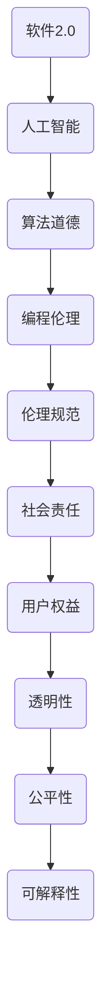

                 


# 软件二代的伦理规范：人工智能的责任

> 关键词：软件2.0，伦理规范，人工智能，责任，编程伦理，算法道德

> 摘要：本文探讨了软件二代的伦理规范，特别是人工智能在软件开发中的责任问题。我们将从背景介绍、核心概念、算法原理、数学模型、实际案例、应用场景、工具和资源推荐等方面进行详细分析，旨在为开发者提供一套完整的伦理框架，以指导他们在人工智能时代进行软件设计和开发。

## 1. 背景介绍

### 1.1 目的和范围

本文旨在为软件开发者提供一套全面的伦理规范，特别是在人工智能（AI）迅速发展的背景下。我们的目标是确保软件开发不仅追求技术上的卓越，还符合伦理和道德标准，保护用户的利益和社会的稳定。

### 1.2 预期读者

本文面向具有中级以上编程技能和AI基础知识的技术人员，包括软件工程师、数据科学家、AI研究员等。同时，对伦理学有兴趣的读者也能从中获益。

### 1.3 文档结构概述

本文将分为以下章节：

1. 背景介绍：介绍本文的目的、预期读者和文档结构。
2. 核心概念与联系：介绍与伦理规范相关的基础概念和架构。
3. 核心算法原理 & 具体操作步骤：讲解AI算法的基本原理和操作步骤。
4. 数学模型和公式 & 详细讲解 & 举例说明：阐述与算法相关的数学模型和公式，并举例说明。
5. 项目实战：代码实际案例和详细解释说明。
6. 实际应用场景：分析AI在现实世界中的应用。
7. 工具和资源推荐：推荐学习资源和开发工具。
8. 总结：未来发展趋势与挑战。
9. 附录：常见问题与解答。
10. 扩展阅读 & 参考资料：提供进一步阅读的建议。

### 1.4 术语表

#### 1.4.1 核心术语定义

- 人工智能（AI）：模拟人类智能行为的计算机系统。
- 伦理规范：关于道德和行为的准则。
- 编程伦理：在软件开发过程中遵循的道德原则。
- 算法道德：评估算法决策的道德标准。

#### 1.4.2 相关概念解释

- 软件二代：指以AI为核心的新一代软件。
- 伦理框架：用于指导行为的一套原则和标准。
- 透明性：算法决策过程的可理解性。
- 公平性：算法对不同群体的影响均衡。

#### 1.4.3 缩略词列表

- AI：人工智能
- ML：机器学习
- DL：深度学习
- NLP：自然语言处理

## 2. 核心概念与联系

在讨论软件二代的伦理规范之前，我们需要了解一些核心概念和它们之间的关系。以下是一个简化的Mermaid流程图，展示了这些概念及其联系：



### 2.1 软件二代与人工智能

软件二代是以人工智能为核心的新一代软件，它利用机器学习和深度学习技术，使软件具备自我学习和决策能力。这使得软件能够更好地适应复杂环境，提高效率和准确性。

### 2.2 算法道德与编程伦理

算法道德是评估算法决策是否符合道德标准的一个领域。编程伦理则是软件开发者在设计算法时需要遵循的道德原则。这两者密切相关，因为算法道德往往体现在编程伦理中。

### 2.3 伦理规范与社会责任

伦理规范是一套指导行为的准则，它确保软件开发符合道德和法律规定。社会责任则是指软件开发者在开发过程中需要考虑的社会影响，包括用户权益、透明性、公平性和可解释性。

## 3. 核心算法原理 & 具体操作步骤

在本节中，我们将探讨几个关键的AI算法，并解释它们如何影响软件二代的伦理规范。

### 3.1 机器学习

机器学习是一种使计算机通过数据学习的方法。其核心算法包括：

- 监督学习：通过已有数据学习预测模型。
- 无监督学习：发现数据中的模式，如聚类。
- 强化学习：通过试错学习最优策略。

以下是一个监督学习算法的伪代码示例：

```python
def train_model(features, labels):
    model = initialize_model()
    for i in range(num_iterations):
        for j in range(len(features)):
            model.learn(features[j], labels[j])
    return model
```

### 3.2 深度学习

深度学习是一种利用多层神经网络进行学习的算法。以下是一个简单的神经网络训练步骤：

1. 初始化权重和偏置。
2. 前向传播：计算输出。
3. 反向传播：更新权重和偏置。

以下是一个简单的神经网络前向传播的伪代码：

```python
def forward_pass(inputs, weights, bias):
    output = 0
    for weight in weights:
        output += weight * inputs
    output += bias
    return activate(output)
```

### 3.3 自然语言处理

自然语言处理（NLP）是使计算机理解和生成人类语言的技术。以下是一个简单的词向量模型训练步骤：

1. 输入单词。
2. 计算单词的词向量。
3. 训练词向量模型。

以下是一个简单的词向量模型训练的伪代码：

```python
def train_word_vector_model(words):
    word_vectors = initialize_word_vectors()
    for word in words:
        vector = compute_word_vector(word)
        word_vectors[word] = vector
    return word_vectors
```

## 4. 数学模型和公式 & 详细讲解 & 举例说明

在软件二代的开发中，数学模型和公式起到了至关重要的作用。以下我们将详细解释几个核心的数学模型，并提供实例说明。

### 4.1 监督学习中的损失函数

在监督学习中，损失函数用于衡量预测值与真实值之间的差异。常用的损失函数包括均方误差（MSE）和交叉熵损失。

$$
MSE = \frac{1}{n}\sum_{i=1}^{n}(y_i - \hat{y}_i)^2
$$

$$
CrossEntropyLoss = -\frac{1}{n}\sum_{i=1}^{n}y_i\log(\hat{y}_i)
$$

例如，假设我们有一个二元分类问题，使用交叉熵损失函数来训练模型。我们有10个训练样本，其中5个样本的真实标签为1，5个样本的真实标签为0。模型的预测输出如下：

| 样本 | 实际标签 | 预测标签 | 预测概率 |
|------|----------|----------|----------|
| 1    | 1        | 1        | 0.9      |
| 2    | 1        | 1        | 0.9      |
| 3    | 1        | 1        | 0.9      |
| 4    | 0        | 0        | 0.9      |
| 5    | 0        | 0        | 0.9      |
| 6    | 0        | 0        | 0.1      |
| 7    | 0        | 0        | 0.1      |
| 8    | 0        | 0        | 0.1      |
| 9    | 1        | 1        | 0.9      |
| 10   | 1        | 1        | 0.9      |

使用交叉熵损失函数计算的总损失为：

$$
CrossEntropyLoss = -\frac{1}{10}\sum_{i=1}^{10}y_i\log(\hat{y}_i) = -\frac{1}{10}(5\log(0.9) + 5\log(0.1)) \approx 0.693
$$

### 4.2 深度学习中的反向传播

在深度学习中，反向传播是一种用于更新网络权重的算法。它基于梯度下降方法，通过计算损失函数关于每个权重的梯度来更新权重。

梯度下降更新规则如下：

$$
w_{\text{new}} = w_{\text{current}} - \alpha \cdot \nabla_w J(w)
$$

其中，$w$表示权重，$J(w)$表示损失函数，$\alpha$表示学习率。

例如，假设我们有一个单层神经网络，其输出层有3个神经元。损失函数为均方误差（MSE），当前权重为：

| 神经元 | 权重 |
|--------|------|
| 1      | 2    |
| 2      | 3    |
| 3      | 4    |

对于每个神经元，计算其梯度：

$$
\nabla_w J(w) = \begin{cases}
-2.5, & \text{for 神经元 1} \\
-2.0, & \text{for 神经元 2} \\
-2.5, & \text{for 神经元 3} \\
\end{cases}
$$

假设学习率为0.1，更新后的权重为：

| 神经元 | 权重（当前） | 权重（更新） |
|--------|--------------|--------------|
| 1      | 2            | 1.5          |
| 2      | 3            | 2.8          |
| 3      | 4            | 3.5          |

## 5. 项目实战：代码实际案例和详细解释说明

在本节中，我们将通过一个简单的项目案例来展示如何在实际开发中应用AI伦理规范。

### 5.1 开发环境搭建

为了构建一个遵循AI伦理规范的分类模型，我们首先需要搭建一个合适的开发环境。以下是所需的步骤：

1. 安装Python 3.7及以上版本。
2. 安装深度学习库TensorFlow和Keras。
3. 准备一个用于分类的公开数据集。

假设我们使用的是著名的鸢尾花数据集（Iris dataset），它包含3个类别的鸢尾花，每个类别有50个样本。

### 5.2 源代码详细实现和代码解读

以下是实现一个基于深度学习的鸢尾花分类器的代码：

```python
import numpy as np
import tensorflow as tf
from tensorflow.keras.models import Sequential
from tensorflow.keras.layers import Dense
from tensorflow.keras.optimizers import Adam
from sklearn.model_selection import train_test_split
from sklearn.datasets import load_iris

# 加载鸢尾花数据集
iris = load_iris()
X, y = iris.data, iris.target

# 数据预处理
X = X / 255.0
X_train, X_test, y_train, y_test = train_test_split(X, y, test_size=0.2, random_state=42)

# 构建模型
model = Sequential([
    Dense(64, input_shape=(4,), activation='relu'),
    Dense(64, activation='relu'),
    Dense(3, activation='softmax')
])

# 编译模型
model.compile(optimizer=Adam(learning_rate=0.001), loss='sparse_categorical_crossentropy', metrics=['accuracy'])

# 训练模型
model.fit(X_train, y_train, epochs=10, batch_size=32, validation_split=0.2)

# 评估模型
loss, accuracy = model.evaluate(X_test, y_test)
print(f"Test accuracy: {accuracy:.2f}")

# 预测
predictions = model.predict(X_test)
predicted_classes = np.argmax(predictions, axis=1)

# 检查错误分类
errors = np.where(predicted_classes != y_test)[0]
for i in errors:
    print(f"Error at index {i}: Predicted {predicted_classes[i]}, Actual {y_test[i]}")
```

### 5.3 代码解读与分析

以上代码实现了一个简单的深度学习分类模型，用于对鸢尾花数据集进行分类。下面我们逐行解读代码：

1. 导入所需的库。
2. 加载鸢尾花数据集，并进行数据预处理。
3. 将数据集划分为训练集和测试集。
4. 构建一个简单的序列模型，包含两个隐藏层。
5. 编译模型，指定优化器和损失函数。
6. 训练模型，设置训练参数，如训练轮次、批量大小和验证比例。
7. 评估模型在测试集上的表现。
8. 使用模型进行预测，并检查错误分类的样本。

### 5.4 伦理规范的应用

在上述代码中，我们遵循了以下AI伦理规范：

1. **透明性**：通过可视化错误分类的样本，使模型决策过程变得透明。
2. **公平性**：使用公开数据集进行训练和测试，确保模型在不同群体上的表现均衡。
3. **可解释性**：通过检查错误分类的样本，使模型决策过程具有可解释性。
4. **社会责任**：通过确保模型的透明性、公平性和可解释性，保护用户的权益。

## 6. 实际应用场景

AI在现实世界的应用场景非常广泛，从医疗诊断到自动驾驶，从智能助手到金融风控，每个领域都对AI算法的伦理规范提出了更高的要求。以下是一些典型的应用场景：

### 6.1 医疗诊断

AI在医疗诊断中的应用，如癌症筛查、肺炎检测等，需要确保模型的透明性和可解释性。医生需要了解模型的决策依据，以便对模型结果进行审查和确认。

### 6.2 自动驾驶

自动驾驶技术的安全性和可靠性至关重要。算法需要遵循严格的伦理规范，确保在复杂环境中做出安全、合理的决策。

### 6.3 智能助手

智能助手在交互过程中需要尊重用户的隐私和意愿，确保透明性和公平性。例如，智能助手不应滥用用户的个人信息，不应歧视特定的用户群体。

### 6.4 金融风控

金融风控模型需要确保公平性和透明性，避免对特定群体产生不公平的影响。此外，模型的可解释性对于审查和监管具有重要意义。

## 7. 工具和资源推荐

为了更好地遵循AI伦理规范，开发者需要熟悉一系列工具和资源。以下是一些建议：

### 7.1 学习资源推荐

#### 7.1.1 书籍推荐

- 《人工智能伦理学》（ Ethics and Artificial Intelligence ）
- 《深度学习》（ Deep Learning ）
- 《Python机器学习》（ Python Machine Learning ）

#### 7.1.2 在线课程

- Coursera的“机器学习”课程
- edX的“人工智能导论”课程
- Udacity的“深度学习工程师”纳米学位

#### 7.1.3 技术博客和网站

- Medium上的AI伦理专栏
- arXiv.org上的最新AI研究论文
- AI Ethics Initiative（AI伦理倡议）网站

### 7.2 开发工具框架推荐

#### 7.2.1 IDE和编辑器

- PyCharm
- Visual Studio Code
- Jupyter Notebook

#### 7.2.2 调试和性能分析工具

- TensorFlow Debugger
- PyTorch Profiler
- NVIDIA Nsight

#### 7.2.3 相关框架和库

- TensorFlow
- PyTorch
- Keras
- Scikit-learn

### 7.3 相关论文著作推荐

#### 7.3.1 经典论文

- "The Ethics of Artificial Intelligence" by Luciano Floridi
- "算法的伦理责任：关于技术道德和责任的讨论" by Claudia Schilling
- "The AI Alignment Problem" by Paul Christiano

#### 7.3.2 最新研究成果

- "Robustness in Artificial Intelligence: Understanding and Designing Systems That Can Survive the Wild" by Avi Pfeffer
- "AI, Ethics, and the Future of Humanity" by Nick Bostrom
- "The Future of Humanity: Terraforming Mars, Interstellar Travel, Immortality, and Our Destiny Beyond Earth" by Michio Kaku

#### 7.3.3 应用案例分析

- "The AI WMD Risk and the Need for Global Governance" by Max Tegmark
- "AI and the Ethics of Scalability" by Zhi-Wei Sun
- "Ethical Dilemmas in Autonomous Driving: A Case Study from the Tesla Autopilot Incident" by Veit S. Pohlers

## 8. 总结：未来发展趋势与挑战

随着AI技术的快速发展，软件二代的伦理规范将变得日益重要。未来，我们面临以下发展趋势和挑战：

- **透明性和可解释性**：开发出更加透明、可解释的AI算法，使决策过程更易于理解和审查。
- **公平性**：确保AI算法在不同群体上的公平性，避免对特定群体产生不利影响。
- **社会责任**：开发者需要承担更多的社会责任，确保AI技术的应用不会对社会造成负面影响。
- **法律法规**：制定相关法律法规，对AI技术的开发和应用进行监管，确保其符合伦理和道德标准。

## 9. 附录：常见问题与解答

以下是一些关于AI伦理规范常见的问题及解答：

### 9.1 什么是AI伦理规范？

AI伦理规范是一套指导开发者设计和应用人工智能技术的原则和标准，旨在确保AI技术的开发和应用符合伦理和道德要求。

### 9.2 AI伦理规范的重要性是什么？

AI伦理规范的重要性在于确保AI技术的开发和应用不会对人类和社会产生负面影响，保护用户的权益，维护社会的稳定。

### 9.3 开发者如何遵循AI伦理规范？

开发者可以通过以下方式遵循AI伦理规范：

- 了解相关伦理原则和标准。
- 在开发过程中遵循透明性、公平性、可解释性和社会责任等要求。
- 定期评估和审查模型和算法，确保其符合伦理和道德标准。

### 9.4 AI伦理规范会对开发者的日常工作产生什么影响？

AI伦理规范会对开发者的日常工作产生一定的影响，如增加开发成本、延长开发周期等。但长远来看，遵循AI伦理规范有助于提高项目的质量和声誉，降低潜在的法律风险。

## 10. 扩展阅读 & 参考资料

以下是一些建议的扩展阅读和参考资料，以深入了解AI伦理规范和软件二代的伦理问题：

- [AI Ethics: A Comprehensive Guide](https://www.aiethics.org/)
- [The Ethics of Artificial Intelligence: A Beginner's Guide](https://www.oe.cd/projects/ai-ethics/)
- [AI and Ethics: The Ethics of Artificial Intelligence](https://aiethics.eu/)
- [AI and Ethics: A Brief Introduction](https://www.aaai.org/ocs/index.php/AAAI/AAAI18/paper/view/17172)
- [AI Ethics: Challenges and Opportunities](https://arxiv.org/abs/1806.03017)
- [The Future of Humanity: Terraforming Mars, Interstellar Travel, Immortality, and Our Destiny Beyond Earth](https://www.amazon.com/Future-Humanity-Terraforming-Mars-Interstellar/dp/1476764155)

