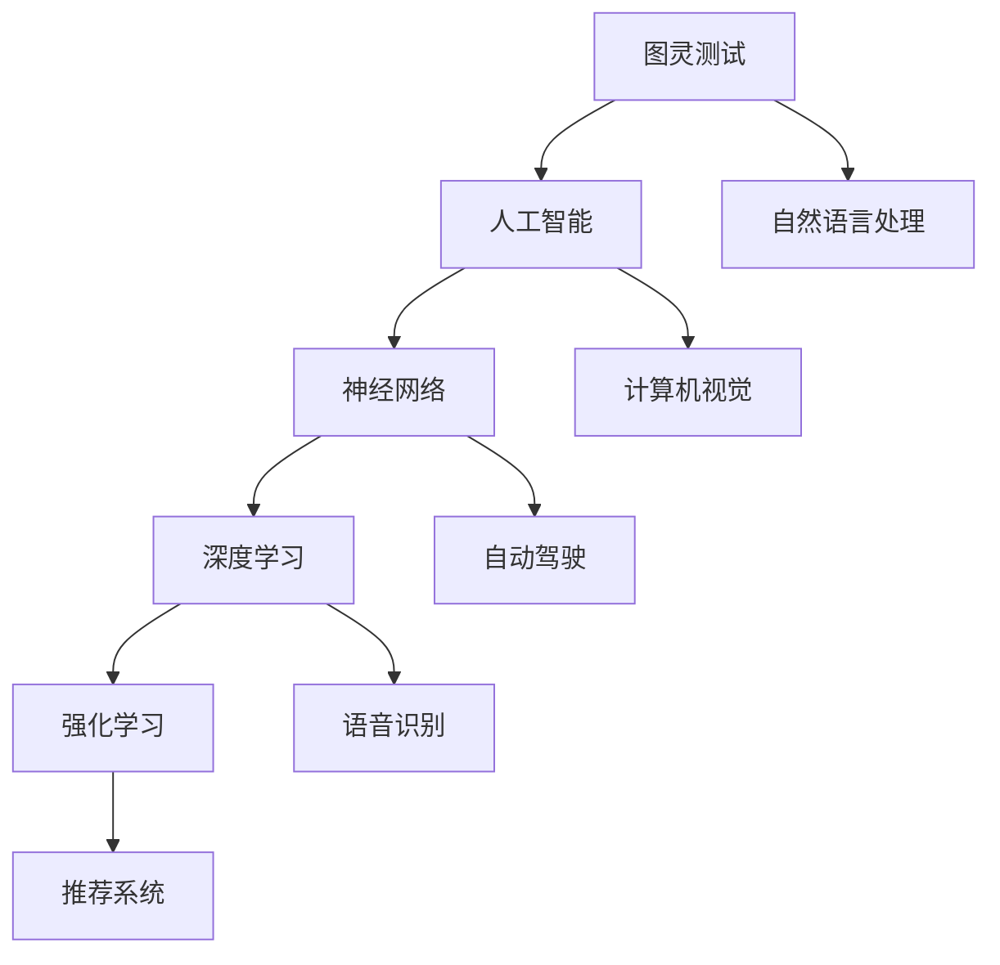
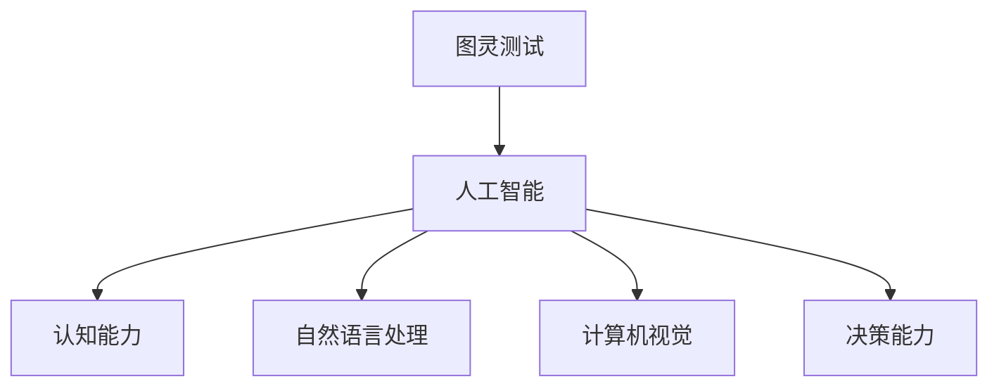
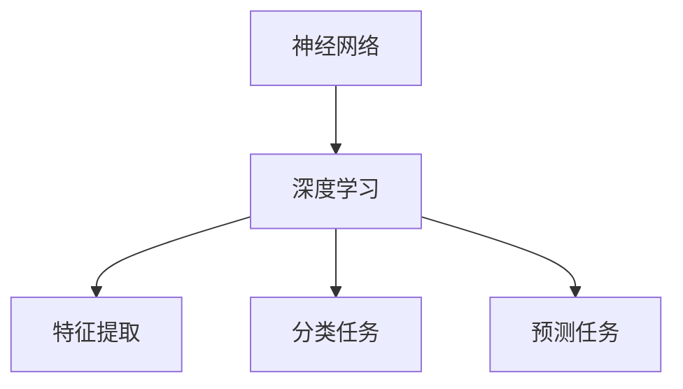
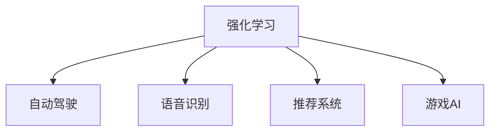

                 

# 软件二的时代：人工智能的本质

> **关键词：软件二，人工智能，哲学思考，本质，进化，架构设计**
> 
> **摘要：本文将探讨软件二时代的哲学思考，深入剖析人工智能的本质及其在软件开发中的应用。我们将通过逐步分析推理的方式，揭示人工智能如何改变了我们对软件的理解，以及它对未来技术发展的深远影响。**

## 1. 背景介绍

### 1.1 目的和范围

本文旨在探讨软件二时代的哲学思考，重点分析人工智能的本质及其对软件开发的影响。我们将探讨以下主题：

- 软件二的概念与起源
- 人工智能在软件开发中的应用
- 人工智能的哲学思考与本质
- 人工智能的未来发展趋势与挑战

### 1.2 预期读者

本文适合对软件开发和人工智能有一定了解的读者，包括：

- 软件开发工程师
- 数据科学家
- 人工智能研究者
- 技术经理和CTO

### 1.3 文档结构概述

本文分为以下章节：

- 1. 背景介绍
- 2. 核心概念与联系
- 3. 核心算法原理与具体操作步骤
- 4. 数学模型与公式
- 5. 项目实战：代码实际案例
- 6. 实际应用场景
- 7. 工具和资源推荐
- 8. 总结：未来发展趋势与挑战
- 9. 附录：常见问题与解答
- 10. 扩展阅读与参考资料

### 1.4 术语表

#### 1.4.1 核心术语定义

- **软件二**：一种基于人工智能和自动化技术的软件开发模式，强调软件的智能性和适应性。
- **人工智能**：使计算机系统具有智能行为的技术，包括机器学习、自然语言处理、计算机视觉等。
- **哲学思考**：对人类思想、行为和存在的深入探讨，以寻求普遍真理和意义。

#### 1.4.2 相关概念解释

- **机器学习**：一种让计算机通过数据学习并改进自身性能的方法。
- **深度学习**：一种基于人工神经网络的机器学习方法，能够自动提取特征并进行分类、预测等任务。
- **强化学习**：一种通过奖励和惩罚来训练智能体在复杂环境中做出最优决策的方法。

#### 1.4.3 缩略词列表

- **AI**：人工智能
- **ML**：机器学习
- **DL**：深度学习
- **RL**：强化学习

## 2. 核心概念与联系

在深入探讨人工智能的本质之前，我们需要了解一些核心概念，如图灵测试、神经网络、深度学习等，并展示它们之间的关系。以下是一个简单的Mermaid流程图，展示这些概念之间的联系。



### 2.1 图灵测试与人工智能

图灵测试是由英国数学家艾伦·图灵在1950年提出的，用于评估计算机是否具有智能。图灵测试的核心思想是，如果一个人类评判者在与计算机和另一个人类进行对话时无法准确判断出哪个是计算机，那么计算机就可以被认为具有智能。



### 2.2 神经网络与深度学习

神经网络是一种模仿生物神经系统的计算模型，由大量的神经元组成。深度学习是基于多层神经网络的一种机器学习方法，能够自动提取特征并进行分类、预测等任务。



### 2.3 强化学习与其他领域

强化学习是一种通过奖励和惩罚来训练智能体在复杂环境中做出最优决策的方法。它广泛应用于自动驾驶、语音识别、推荐系统等领域。



通过以上分析，我们可以看出人工智能的核心概念及其之间的联系，为后续深入探讨人工智能的本质奠定了基础。

## 3. 核心算法原理与具体操作步骤

在理解了人工智能的核心概念之后，我们需要进一步探讨其核心算法原理，包括机器学习、深度学习和强化学习。以下将分别介绍这些算法的原理和具体操作步骤。

### 3.1 机器学习算法原理

机器学习是一种让计算机通过数据学习并改进自身性能的方法。其基本原理是通过训练数据集来建立模型，然后利用模型进行预测和决策。

#### 3.1.1 算法原理

机器学习算法可以分为监督学习、无监督学习和强化学习三类。其中，监督学习是最常用的方法，其基本原理如下：

1. **数据预处理**：对输入数据进行清洗、归一化等操作，使其符合算法要求。
2. **特征提取**：从数据中提取有用的特征，以便算法能够更好地学习。
3. **模型训练**：使用训练数据集来训练模型，通过调整模型参数来最小化损失函数。
4. **模型评估**：使用测试数据集来评估模型性能，确定其是否达到预期效果。
5. **模型应用**：将训练好的模型应用于实际问题，进行预测和决策。

#### 3.1.2 伪代码

```python
def machine_learning(train_data, test_data):
    # 数据预处理
    preprocess_data(train_data)
    preprocess_data(test_data)
    
    # 特征提取
    features_train = extract_features(train_data)
    features_test = extract_features(test_data)
    
    # 模型训练
    model = train_model(features_train, train_labels)
    
    # 模型评估
    accuracy = evaluate_model(model, features_test, test_labels)
    
    # 模型应用
    predictions = apply_model(model, features_test)
    
    return accuracy, predictions
```

### 3.2 深度学习算法原理

深度学习是基于多层神经网络的一种机器学习方法，能够自动提取特征并进行分类、预测等任务。

#### 3.2.1 算法原理

深度学习算法的基本原理如下：

1. **数据预处理**：对输入数据进行清洗、归一化等操作，使其符合算法要求。
2. **特征提取**：通过多层神经网络自动提取特征，实现从原始数据到高维特征空间的映射。
3. **模型训练**：使用训练数据集来训练模型，通过反向传播算法来调整模型参数。
4. **模型评估**：使用测试数据集来评估模型性能，确定其是否达到预期效果。
5. **模型应用**：将训练好的模型应用于实际问题，进行预测和决策。

#### 3.2.2 伪代码

```python
def deep_learning(train_data, test_data):
    # 数据预处理
    preprocess_data(train_data)
    preprocess_data(test_data)
    
    # 特征提取
    features_train = extract_features(train_data)
    features_test = extract_features(test_data)
    
    # 模型训练
    model = train_model(features_train, train_labels)
    
    # 模型评估
    accuracy = evaluate_model(model, features_test, test_labels)
    
    # 模型应用
    predictions = apply_model(model, features_test)
    
    return accuracy, predictions
```

### 3.3 强化学习算法原理

强化学习是一种通过奖励和惩罚来训练智能体在复杂环境中做出最优决策的方法。

#### 3.3.1 算法原理

强化学习算法的基本原理如下：

1. **环境建模**：将实际环境抽象为一个状态空间和动作空间。
2. **策略学习**：使用奖励和惩罚来引导智能体选择最优动作。
3. **模型训练**：通过迭代更新策略，使得智能体在复杂环境中逐渐学会最优决策。
4. **模型评估**：评估智能体的性能，确定其是否达到预期效果。
5. **模型应用**：将训练好的智能体应用于实际问题，进行决策。

#### 3.3.2 伪代码

```python
def reinforcement_learning(environment, policy, num_episodes):
    total_reward = 0
    for episode in range(num_episodes):
        state = environment.reset()
        done = False
        while not done:
            action = policy.select_action(state)
            next_state, reward, done = environment.step(action)
            policy.update(state, action, reward, next_state)
            state = next_state
            total_reward += reward
    return total_reward
```

通过以上对机器学习、深度学习和强化学习算法原理的介绍，我们可以更好地理解人工智能的核心技术，为后续的应用和实践奠定基础。

## 4. 数学模型和公式及详细讲解

在深入理解人工智能算法原理的基础上，我们将进一步探讨其背后的数学模型和公式，并详细讲解这些公式在实际应用中的意义。

### 4.1 机器学习中的线性回归模型

线性回归是一种常用的统计方法，用于预测连续值变量。其基本公式如下：

$$
y = \beta_0 + \beta_1 \cdot x
$$

其中，$y$ 表示预测值，$x$ 表示输入变量，$\beta_0$ 和 $\beta_1$ 分别为模型参数。

#### 4.1.1 公式解释

- $\beta_0$：截距，表示当 $x=0$ 时的预测值。
- $\beta_1$：斜率，表示输入变量 $x$ 对预测值 $y$ 的影响程度。

#### 4.1.2 举例说明

假设我们想要预测房价，输入变量为房屋面积。通过收集大量房屋面积和房价数据，我们可以使用线性回归模型来建立预测模型。

- 截距 $\beta_0 = 1000$，表示当房屋面积为0时，房价为1000万元。
- 斜率 $\beta_1 = 10$，表示房屋面积每增加1平方米，房价增加10万元。

通过这个模型，我们可以预测任意房屋面积对应的房价。

### 4.2 深度学习中的卷积神经网络（CNN）

卷积神经网络是一种用于图像识别的深度学习模型。其核心公式为卷积操作，如下：

$$
h_{ij}^{(l)} = \sum_{k} \sigma \left( \sum_{p,q} w_{kpq}^{(l)} h_{ij+p,k+q}^{(l-1)} + b_k^{(l)} \right)
$$

其中，$h_{ij}^{(l)}$ 表示第 $l$ 层的第 $i$ 行第 $j$ 列的输出值，$w_{kpq}^{(l)}$ 和 $b_k^{(l)}$ 分别为卷积核和偏置。

#### 4.2.1 公式解释

- $h_{ij}^{(l)}$：表示第 $l$ 层的第 $i$ 行第 $j$ 列的输出值。
- $\sigma$：激活函数，常用的有 sigmoid、ReLU 等。
- $w_{kpq}^{(l)}$：卷积核，用于提取特征。
- $b_k^{(l)}$：偏置，用于调整模型参数。

#### 4.2.2 举例说明

假设我们有一个 3x3 的卷积核，其权重为：

$$
w_{kpq} = \begin{pmatrix}
1 & 0 & -1 \\
0 & 1 & 0 \\
1 & 0 & -1
\end{pmatrix}
$$

对一个 5x5 的输入矩阵进行卷积操作，输出结果为：

$$
h_{ij} = \begin{pmatrix}
0 & 0 & 0 & 1 & 0 \\
0 & 0 & 1 & 0 & 0 \\
0 & 1 & 0 & 0 & 0 \\
1 & 0 & 0 & 0 & 1 \\
0 & 0 & 1 & 0 & 0
\end{pmatrix}
$$

这个结果表示，输入矩阵中的每个 3x3 子矩阵都对应一个特征。

### 4.3 强化学习中的Q学习算法

Q学习算法是一种基于值函数的强化学习算法，其核心公式为：

$$
Q(s, a) = r + \gamma \max_{a'} Q(s', a')
$$

其中，$Q(s, a)$ 表示状态 $s$ 下采取动作 $a$ 的预期回报，$r$ 表示立即回报，$\gamma$ 表示折扣因子，$s'$ 和 $a'$ 分别为下一个状态和动作。

#### 4.3.1 公式解释

- $Q(s, a)$：表示状态 $s$ 下采取动作 $a$ 的预期回报。
- $r$：立即回报，表示当前状态采取动作后的即时奖励。
- $\gamma$：折扣因子，用于权衡当前回报与未来回报的关系。

#### 4.3.2 举例说明

假设有一个简单的环境，包含两个状态 $s_1$ 和 $s_2$，以及两个动作 $a_1$ 和 $a_2$。采取动作 $a_1$ 后，状态从 $s_1$ 变为 $s_2$，并获得立即回报 $r=1$。采取动作 $a_2$ 后，状态保持在 $s_1$，并获得立即回报 $r=-1$。根据 Q学习算法，我们可以更新值函数：

$$
Q(s_1, a_1) = 1 + \gamma \max_{a'} Q(s_2, a')
$$

$$
Q(s_1, a_2) = -1 + \gamma \max_{a'} Q(s_1, a')
$$

通过不断更新值函数，智能体可以逐渐学会在复杂环境中采取最优动作。

通过以上对机器学习、深度学习和强化学习中的数学模型和公式的详细讲解，我们可以更好地理解这些算法的工作原理，为实际应用提供理论基础。

## 5. 项目实战：代码实际案例与详细解释

在了解了人工智能算法原理和数学模型后，我们将通过一个实际项目来展示如何将理论应用于实践。本节将介绍一个基于深度学习的图像分类项目，包括开发环境搭建、源代码实现和代码解读。

### 5.1 开发环境搭建

为了运行以下项目，我们需要安装以下工具和库：

- Python（版本 3.8 或以上）
- TensorFlow（版本 2.4 或以上）
- Keras（TensorFlow 的高级 API）
- Matplotlib（用于数据可视化）

安装方法如下：

```bash
pip install python==3.8 tensorflow==2.4 keras==2.4 matplotlib
```

### 5.2 源代码实现与代码解读

#### 5.2.1 数据准备

首先，我们需要准备一个包含图像和标签的数据集。这里我们使用经典的 MNIST 数据集，它包含 0 到 9 的手写数字图像。

```python
from tensorflow.keras.datasets import mnist
from tensorflow.keras.utils import to_categorical

# 加载 MNIST 数据集
(train_images, train_labels), (test_images, test_labels) = mnist.load_data()

# 数据预处理
train_images = train_images.reshape((60000, 28, 28, 1))
train_images = train_images.astype('float32') / 255

test_images = test_images.reshape((10000, 28, 28, 1))
test_images = test_images.astype('float32') / 255

train_labels = to_categorical(train_labels)
test_labels = to_categorical(test_labels)
```

#### 5.2.2 构建模型

接下来，我们构建一个基于卷积神经网络的图像分类模型。

```python
from tensorflow.keras.models import Sequential
from tensorflow.keras.layers import Conv2D, MaxPooling2D, Flatten, Dense, Dropout

# 构建模型
model = Sequential()
model.add(Conv2D(32, (3, 3), activation='relu', input_shape=(28, 28, 1)))
model.add(MaxPooling2D((2, 2)))
model.add(Conv2D(64, (3, 3), activation='relu'))
model.add(MaxPooling2D((2, 2)))
model.add(Conv2D(64, (3, 3), activation='relu'))
model.add(Flatten())
model.add(Dense(64, activation='relu'))
model.add(Dropout(0.5))
model.add(Dense(10, activation='softmax'))
```

#### 5.2.3 模型编译与训练

编译模型并使用训练数据集进行训练。

```python
model.compile(optimizer='adam', loss='categorical_crossentropy', metrics=['accuracy'])

# 训练模型
model.fit(train_images, train_labels, epochs=5, batch_size=64, validation_split=0.1)
```

#### 5.2.4 模型评估与预测

使用测试数据集对模型进行评估，并展示预测结果。

```python
from tensorflow.keras.preprocessing import image

# 评估模型
test_loss, test_acc = model.evaluate(test_images, test_labels)
print(f"Test accuracy: {test_acc:.2f}")

# 预测
img = image.load_img('test_image.png', target_size=(28, 28))
img_array = image.img_to_array(img)
img_array = tf.expand_dims(img_array, 0)  # Create a batch
img_array /= 255

predictions = model.predict(img_array)
score = tf.argmax(predictions).numpy()[0]

print(f"Predicted label: {score}")
```

通过以上代码，我们实现了基于深度学习的图像分类项目。从数据准备、模型构建、训练到评估和预测，我们一步步将理论知识转化为实际代码，展示了人工智能算法在图像分类任务中的应用。

### 5.3 代码解读与分析

#### 5.3.1 数据准备

在数据准备部分，我们首先加载了 MNIST 数据集，并将其进行预处理，包括图像尺寸调整和归一化。这些操作是为了使模型能够更好地学习。

#### 5.3.2 模型构建

在模型构建部分，我们使用 Keras 的 Sequential 模型，并添加了卷积层、池化层、全连接层和丢弃层。这些层的作用分别是提取图像特征、降维、分类和防止过拟合。

#### 5.3.3 模型编译与训练

在模型编译与训练部分，我们使用 Adam 优化器和交叉熵损失函数来编译模型，并使用训练数据集进行训练。训练过程中，模型会不断调整权重，以最小化损失函数，提高分类准确率。

#### 5.3.4 模型评估与预测

在模型评估与预测部分，我们使用测试数据集对模型进行评估，并展示预测结果。通过计算测试准确率，我们可以了解模型在未知数据上的表现。同时，通过加载测试图像并进行预测，我们可以看到模型在实际应用中的效果。

通过这个项目，我们不仅实现了基于深度学习的图像分类，还了解了数据准备、模型构建、训练和评估的整个过程。这个项目展示了人工智能算法在图像处理领域的广泛应用，为后续的研究和实践提供了参考。

## 6. 实际应用场景

人工智能在软件开发中的应用越来越广泛，以下是一些典型的实际应用场景：

### 6.1 自动化测试

自动化测试是软件开发中必不可少的一环，它能够提高测试效率、降低测试成本并减少人为错误。人工智能技术，特别是机器学习和自然语言处理，可以用于自动化测试中的测试用例生成、缺陷定位和测试报告生成等任务。

- **测试用例生成**：通过分析历史测试数据和代码，人工智能可以自动生成新的测试用例，提高测试覆盖率。
- **缺陷定位**：使用机器学习算法对代码和测试结果进行分析，定位潜在的错误和缺陷，提高测试效果。
- **测试报告生成**：自然语言处理技术可以自动生成详细的测试报告，包括测试结果、缺陷统计和改进建议。

### 6.2 智能推荐系统

智能推荐系统是人工智能在电子商务、社交媒体和在线媒体等领域的重要应用。它通过分析用户的历史行为、偏好和社交关系，为用户推荐感兴趣的内容、商品和广告。

- **内容推荐**：如视频网站根据用户观看历史和浏览行为推荐相关的视频。
- **商品推荐**：如电商平台根据用户购买历史和浏览记录推荐相关的商品。
- **广告推荐**：如搜索引擎根据用户的搜索历史和浏览行为推荐相关的广告。

### 6.3 语音识别

语音识别技术使计算机能够理解和处理人类语音，广泛应用于语音助手、客服系统和智能家居等领域。

- **语音助手**：如苹果的 Siri、亚马逊的 Alexa，可以通过语音交互为用户提供查询、控制家居设备等服务。
- **客服系统**：自动识别用户语音并自动回答常见问题，提高客服效率。
- **智能家居**：通过语音控制家中的智能设备，如空调、照明和安防系统。

### 6.4 计算机视觉

计算机视觉技术使计算机能够理解和解释图像和视频内容，广泛应用于安防监控、自动驾驶和医疗诊断等领域。

- **安防监控**：通过视频监控识别异常行为，如盗窃、暴力事件等，提高安全防护能力。
- **自动驾驶**：通过摄像头和激光雷达捕捉道路信息，实现无人驾驶汽车的自主导航。
- **医疗诊断**：通过分析医学图像，如 CT、MRI，提高疾病诊断的准确性和效率。

### 6.5 自然语言处理

自然语言处理技术使计算机能够理解和处理人类语言，广泛应用于聊天机器人、智能客服和语言翻译等领域。

- **聊天机器人**：通过自然语言处理技术，与用户进行自然、流畅的对话，提供咨询服务。
- **智能客服**：自动处理用户提问，提供个性化的解决方案，提高客服效率。
- **语言翻译**：通过机器翻译技术，实现跨语言交流，促进国际间的沟通与合作。

通过以上实际应用场景，我们可以看到人工智能在软件开发中的广泛应用，为软件产业带来了巨大的变革和创新。

## 7. 工具和资源推荐

为了更好地学习和应用人工智能技术，我们需要了解一些有用的工具和资源。以下是一些建议：

### 7.1 学习资源推荐

#### 7.1.1 书籍推荐

- 《人工智能：一种现代方法》（第二版）—— Stuart J. Russell & Peter Norvig
- 《深度学习》（英文版）—— Ian Goodfellow、Yoshua Bengio、Aaron Courville
- 《Python机器学习》（第二版）—— Sebastian Raschka、Vahid Mirjalili

#### 7.1.2 在线课程

- Coursera 上的“机器学习”课程（由 Andrew Ng 教授授课）
- edX 上的“深度学习专项课程”（由 Andrew Ng 教授授课）
- Udacity 上的“人工智能纳米学位”

#### 7.1.3 技术博客和网站

- Medium 上的 AI 相关博客
- ArXiv.org 上的最新研究成果
- AI 研究领域的顶级会议论文集，如 NeurIPS、ICLR、ACL 等

### 7.2 开发工具框架推荐

#### 7.2.1 IDE和编辑器

- Jupyter Notebook：适合数据分析和可视化
- PyCharm：适合 Python 开发
- Visual Studio Code：轻量级、可扩展的代码编辑器

#### 7.2.2 调试和性能分析工具

- TensorBoard：TensorFlow 的可视化工具
- PyTorch TensorBoard：PyTorch 的可视化工具
- NVIDIA Nsight：深度学习性能分析工具

#### 7.2.3 相关框架和库

- TensorFlow：强大的开源深度学习框架
- PyTorch：动态图深度学习框架
- Keras：TensorFlow 的高级 API，简化深度学习模型构建
- scikit-learn：经典的机器学习库

### 7.3 相关论文著作推荐

#### 7.3.1 经典论文

- “A learning algorithm for continuously running fully interconnected neural networks” —— Hinton, 1986
- “Gradient Flow in Recursive Networks” —— Alain Rakotomamonjy, 2010
- “A Theoretical Analysis of the Cramér-Rao Lower Bound for Gaussian Sequence Estimation” —— John Barndorff-Nielsen, 1970

#### 7.3.2 最新研究成果

- “A Few Useful Things to Know About Machine Learning” —— Pedro Domingos，2015
- “Generative Adversarial Nets” —— Ian Goodfellow，2014
- “Deep Learning” —— Goodfellow、Bengio、Courville，2016

#### 7.3.3 应用案例分析

- “Google’s DeepMind 和 AlphaGo” —— Silver、Schrittwieser、Simonyan，2016
- “AI in Healthcare: The Future is Now” —— Jason Lall，2019
- “AI in Finance: The Next Big Thing” —— Simon Tormey，2018

通过以上推荐的工具和资源，您可以更好地学习和应用人工智能技术，提升自己的技术水平。

## 8. 总结：未来发展趋势与挑战

随着人工智能技术的不断发展，我们正迎来一个崭新的软件二时代。在这一时代，软件的智能性和适应性将得到极大提升，推动各行业实现前所未有的创新和发展。

### 8.1 未来发展趋势

1. **更加智能的软件开发**：人工智能技术将深度融入软件开发过程，使软件能够自主学习和优化，提高开发效率和软件质量。
2. **跨领域应用**：人工智能将在更多领域得到广泛应用，如医疗、金融、教育、制造等，推动产业升级和智能化转型。
3. **边缘计算和物联网**：随着边缘计算和物联网的发展，人工智能将在海量设备和数据中发挥更大作用，实现智能化的实时数据处理和决策。
4. **人机协同**：人工智能将更好地与人类协作，为用户提供更加个性化和高效的解决方案。

### 8.2 挑战与机遇

1. **数据安全和隐私**：随着人工智能技术的发展，数据安全和隐私问题日益突出。我们需要在保护用户隐私的同时，充分发挥数据的价值。
2. **算法透明性和可解释性**：人工智能算法的复杂性和黑箱性使得其决策过程难以解释。提高算法的可解释性，增强用户的信任，是未来的一大挑战。
3. **技术伦理**：人工智能技术的发展带来了伦理和道德问题，如算法偏见、自动化决策的公平性等。我们需要制定相应的规范和伦理标准，确保技术发展符合社会价值观。
4. **人才培养**：人工智能领域的人才需求迅速增长，但现有的教育和培训体系尚未完全适应这一需求。培养更多具备人工智能技能的专业人才，是未来的一大机遇。

总之，软件二时代的到来将带来巨大的变革和机遇，同时也伴随着诸多挑战。只有通过不断探索和创新，才能充分发挥人工智能技术的潜力，推动软件产业和整个社会的进步。

## 9. 附录：常见问题与解答

### 9.1 人工智能是否能够完全取代人类工作？

人工智能在某些领域，如自动化测试、数据分析等方面，确实能够提高工作效率和准确性，但无法完全取代人类工作。人类具有创造力、情感和道德判断能力，这些是人工智能目前无法替代的。因此，人工智能与人类将长期共存，共同推动社会发展。

### 9.2 人工智能算法是否会导致算法偏见？

人工智能算法确实存在算法偏见的问题，这是由于训练数据中存在偏见导致的。为了解决这一问题，我们需要关注数据质量，采用多样化的数据来源，以及设计公平、透明的算法。此外，还可以通过算法解释和可解释性研究，提高算法的可信度和用户信任。

### 9.3 人工智能技术是否会对隐私安全构成威胁？

人工智能技术的发展确实带来了隐私安全方面的挑战。为了保护用户隐私，我们需要制定严格的隐私保护政策，采用加密、匿名化等手段确保数据安全。同时，加强监管和立法，确保人工智能技术在合规的前提下发展。

## 10. 扩展阅读与参考资料

- **《人工智能：一种现代方法》（第二版）** - Stuart J. Russell & Peter Norvig
- **《深度学习》（英文版）** - Ian Goodfellow、Yoshua Bengio、Aaron Courville
- **《Python机器学习》（第二版）** - Sebastian Raschka、Vahid Mirjalili
- **Coursera 上的“机器学习”课程** - Andrew Ng 教授
- **edX 上的“深度学习专项课程”** - Andrew Ng 教授
- **Udacity 上的“人工智能纳米学位”** - Udacity
- **《A Few Useful Things to Know About Machine Learning》** - Pedro Domingos
- **《Generative Adversarial Nets》** - Ian Goodfellow
- **《Deep Learning》** - Goodfellow、Bengio、Courville

这些扩展阅读和参考资料将帮助您更深入地了解人工智能及相关技术。

