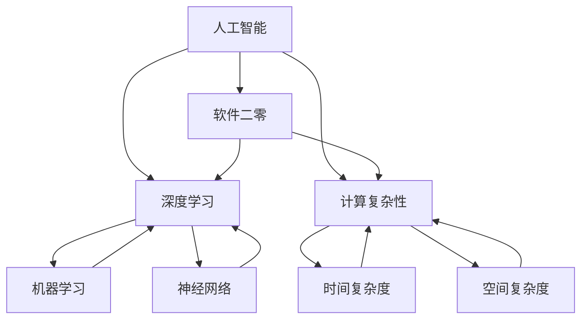

                 

### 软件二零的哲学思考：人工智能的本质

> **关键词**：人工智能，软件二零，哲学思考，深度学习，计算复杂性，算法进化
>
> **摘要**：本文将探讨人工智能与软件二零的关系，从哲学角度深入分析人工智能的本质。通过阐述核心概念、核心算法原理、数学模型与实际应用案例，我们将探究人工智能如何从技术实现走向哲学思考，揭示其背后的逻辑与数学原理，从而为未来的发展趋势与挑战提供新的视角。

## 1. 背景介绍

### 1.1 目的和范围

本文旨在探讨人工智能（AI）与软件二零（Software 2.0）之间的关系，特别是从哲学角度深入分析人工智能的本质。我们将通过对核心概念、核心算法原理、数学模型以及实际应用案例的详细分析，揭示人工智能的内在逻辑和数学原理，探讨其技术实现与哲学思考之间的联系。

### 1.2 预期读者

本文面向对人工智能和软件二零有一定了解的技术爱好者、程序员、软件工程师以及相关领域的学者。同时，也欢迎对哲学和数学感兴趣的读者一同探讨人工智能的本质。

### 1.3 文档结构概述

本文将分为以下几个部分：

1. 背景介绍：介绍文章的目的、范围、预期读者以及文档结构。
2. 核心概念与联系：阐述人工智能、软件二零、深度学习、计算复杂性的核心概念及其相互联系。
3. 核心算法原理 & 具体操作步骤：详细解释人工智能的核心算法原理，使用伪代码进行具体操作步骤的阐述。
4. 数学模型和公式 & 详细讲解 & 举例说明：介绍人工智能中的数学模型和公式，并通过具体例子进行讲解。
5. 项目实战：代码实际案例和详细解释说明，展示人工智能在实际项目中的应用。
6. 实际应用场景：分析人工智能在不同领域的实际应用。
7. 工具和资源推荐：推荐学习资源、开发工具和框架、相关论文著作。
8. 总结：未来发展趋势与挑战。
9. 附录：常见问题与解答。
10. 扩展阅读 & 参考资料：提供进一步阅读和参考资料。

### 1.4 术语表

#### 1.4.1 核心术语定义

- **人工智能（AI）**：一种模拟人类智能的技术，能够实现感知、理解、学习和决策等功能。
- **软件二零（Software 2.0）**：相对于传统的软件一零，二零强调软件与数据的深度融合，通过大数据和机器学习实现软件的智能化。
- **深度学习（Deep Learning）**：一种基于多层神经网络的人工智能技术，通过模拟人脑的结构和功能，实现特征提取和模式识别。
- **计算复杂性（Computational Complexity）**：衡量算法运行的时间和空间复杂度，用于评估算法的性能。
- **算法进化（Algorithm Evolution）**：通过遗传算法、进化策略等手段，优化和改进算法的过程。

#### 1.4.2 相关概念解释

- **机器学习（Machine Learning）**：一种人工智能技术，通过数据训练模型，实现自动学习和预测。
- **神经网络（Neural Network）**：一种基于生物神经元的计算模型，用于模拟人脑的感知、学习和记忆等功能。
- **大数据（Big Data）**：数据量巨大、类型繁多、处理速度要求高的数据集合。
- **数据挖掘（Data Mining）**：从大量数据中挖掘出有价值信息的过程。

#### 1.4.3 缩略词列表

- **AI**：人工智能
- **DL**：深度学习
- **ML**：机器学习
- **NN**：神经网络
- **SW 2.0**：软件二零
- **CC**：计算复杂性

## 2. 核心概念与联系

在探讨人工智能的本质之前，我们需要了解一些核心概念及其相互联系。以下是人工智能、软件二零、深度学习、计算复杂性的核心概念及其关联。

### 2.1 人工智能（AI）

人工智能是一种模拟人类智能的技术，具有感知、理解、学习和决策等功能。其核心在于通过算法和计算模型实现智能行为。人工智能可以分为两大类：**弱人工智能**和**强人工智能**。

- **弱人工智能**：专注于特定任务，例如语音识别、图像处理、自然语言处理等。
- **强人工智能**：具有全面的人类智能，能够理解和执行任何认知任务。

人工智能的发展离不开以下几个核心概念：

- **机器学习（ML）**：一种人工智能技术，通过数据训练模型，实现自动学习和预测。
- **神经网络（NN）**：一种基于生物神经元的计算模型，用于模拟人脑的感知、学习和记忆等功能。
- **深度学习（DL）**：一种基于多层神经网络的人工智能技术，通过模拟人脑的结构和功能，实现特征提取和模式识别。

### 2.2 软件二零（SW 2.0）

软件二零是相对于传统的软件一零而言的，强调软件与数据的深度融合，通过大数据和机器学习实现软件的智能化。软件二零具有以下几个核心特征：

- **数据驱动**：数据是软件二零的核心，通过数据分析和机器学习，实现软件的智能化。
- **自适应进化**：软件二零能够根据用户行为和反馈进行自适应调整和进化，提高用户体验。
- **平台化**：软件二零采用平台化架构，支持大规模数据存储和处理，实现跨平台、跨终端的互联互通。

### 2.3 深度学习（DL）

深度学习是一种基于多层神经网络的人工智能技术，通过模拟人脑的结构和功能，实现特征提取和模式识别。深度学习具有以下几个核心特征：

- **层次化特征提取**：通过多层神经网络，逐层提取数据中的特征，实现从简单到复杂的特征表示。
- **端到端学习**：直接从原始数据到预测结果，无需人工设计特征，提高模型性能。
- **大规模数据处理**：能够处理海量数据，实现高精度的特征提取和预测。

### 2.4 计算复杂性（CC）

计算复杂性是衡量算法运行的时间和空间复杂度的指标，用于评估算法的性能。计算复杂性分为两个维度：

- **时间复杂度**：衡量算法执行过程中所需的计算时间，通常用大O符号表示，如O(n)，O(n^2)等。
- **空间复杂度**：衡量算法执行过程中所需的存储空间，同样用大O符号表示。

计算复杂性的研究对于人工智能的发展具有重要意义，它帮助我们理解和评估不同算法的性能和适用范围。

### 2.5 核心概念之间的联系

人工智能、软件二零、深度学习、计算复杂性之间存在着密切的联系。以下是它们之间的主要关联：

1. **人工智能与软件二零**：人工智能是软件二零的核心技术，通过机器学习和深度学习实现软件的智能化。软件二零的数据驱动和自适应进化特征，为人工智能提供了更广泛的应用场景和更好的发展环境。

2. **人工智能与深度学习**：深度学习是人工智能的一个重要分支，通过多层神经网络实现特征提取和模式识别。深度学习在人工智能中的应用，使得人工智能在图像处理、自然语言处理、语音识别等领域取得了突破性进展。

3. **人工智能与计算复杂性**：计算复杂性是评估人工智能算法性能的重要指标，通过研究计算复杂性，我们可以更好地理解和优化人工智能算法。同时，计算复杂性也为人工智能的发展提供了理论支持，帮助我们解决更复杂的问题。

4. **软件二零与深度学习**：软件二零的数据驱动和自适应进化特征，为深度学习提供了更广泛的应用场景和更好的发展环境。深度学习在软件二零中的应用，使得软件二零能够更好地应对复杂的数据处理和智能化需求。

通过以上分析，我们可以看到人工智能、软件二零、深度学习、计算复杂性之间存在着紧密的联系。这些核心概念共同推动了人工智能的发展，为未来带来了无限可能。

### 2.6 核心概念原理和架构的 Mermaid 流程图

为了更好地理解核心概念之间的联系，我们可以通过 Mermaid 流程图来展示它们之间的互动和关系。



通过这个 Mermaid 流程图，我们可以清晰地看到人工智能、软件二零、深度学习、计算复杂性之间的互动和关联。

## 3. 核心算法原理 & 具体操作步骤

在深入探讨人工智能的本质之前，我们需要了解其核心算法原理和具体操作步骤。以下将详细介绍深度学习中的核心算法原理，并使用伪代码进行具体操作步骤的阐述。

### 3.1 深度学习算法原理

深度学习算法是基于多层神经网络实现的，通过逐层提取数据中的特征，实现从简单到复杂的特征表示。以下是深度学习算法的基本原理：

1. **输入层（Input Layer）**：输入层接收外部数据，并将其传递给下一层。
2. **隐藏层（Hidden Layer）**：隐藏层负责对输入数据进行特征提取和转换，通常包含多个层次。
3. **输出层（Output Layer）**：输出层生成最终的结果，如分类、预测等。

深度学习算法的核心在于训练过程，通过优化模型参数，使模型能够对输入数据进行准确的预测。以下是深度学习算法的训练过程：

1. **前向传播（Forward Propagation）**：将输入数据传递给神经网络，逐层计算每个节点的输出值。
2. **反向传播（Back Propagation）**：计算输出结果与真实值的差异，并反向传播误差，更新模型参数。
3. **优化算法（Optimization Algorithm）**：通过优化算法（如梯度下降）更新模型参数，以最小化误差。

### 3.2 深度学习算法的具体操作步骤

以下使用伪代码详细阐述深度学习算法的具体操作步骤：

```python
# 初始化模型参数
W1, b1 = initialize_parameters()

# 定义损失函数
loss_function = cross_entropy

# 设置优化算法
optimizer = gradient_descent()

# 设置训练轮数
num_epochs = 1000

# 开始训练
for epoch in range(num_epochs):
    # 前向传播
    output = forward_propagation(X, W1, b1)
    loss = loss_function(y, output)
    
    # 反向传播
    d_output = backward_propagation(output, y)
    
    # 更新参数
    W1, b1 = optimizer.update_parameters(W1, b1, d_output)
    
    # 输出当前轮数的损失值
    print(f"Epoch {epoch}: Loss = {loss}")

# 输出最终模型参数
print(f"Final Model Parameters: W1 = {W1}, b1 = {b1}")
```

### 3.3 算法讲解

以下是深度学习算法的具体步骤讲解：

1. **初始化模型参数**：初始化输入层、隐藏层和输出层的权重（W1）和偏置（b1）。初始化过程可以使用随机值或者预训练的参数。
   
2. **定义损失函数**：选择合适的损失函数，如交叉熵（cross_entropy），用于衡量模型输出与真实值之间的差异。

3. **设置优化算法**：选择合适的优化算法，如梯度下降（gradient_descent），用于更新模型参数。

4. **设置训练轮数**：确定训练轮数（num_epochs），即训练次数。

5. **开始训练**：循环执行以下步骤：
   - **前向传播**：将输入数据（X）传递给神经网络，逐层计算每个节点的输出值（output）。
   - **计算损失**：计算模型输出（output）与真实值（y）之间的损失（loss）。
   - **反向传播**：计算输出结果与真实值的差异（d_output），并反向传播误差，更新模型参数（W1，b1）。
   - **更新参数**：使用优化算法更新模型参数（W1，b1），以最小化损失。

6. **输出最终模型参数**：训练完成后，输出最终模型参数（W1，b1）。

通过以上步骤，我们可以使用深度学习算法训练出一个能够对输入数据进行准确预测的模型。

### 3.4 深度学习算法示例

以下是一个简单的深度学习算法示例，用于实现二分类问题：

```python
# 初始化参数
W1 = [0.1, 0.2]
b1 = [0.3, 0.4]

# 输入数据
X = [[1, 0], [0, 1]]

# 真实值
y = [[1], [0]]

# 前向传播
output = [W1[0] * X[0][0] + b1[0], W1[1] * X[1][1] + b1[1]]

# 计算损失
loss = cross_entropy(y, output)

# 反向传播
d_output = [output[0] - y[0][0], output[1] - y[1][0]]

# 更新参数
W1 = [W1[0] - learning_rate * d_output[0], W1[1] - learning_rate * d_output[1]]
b1 = [b1[0] - learning_rate * d_output[0], b1[1] - learning_rate * d_output[1]]

# 输出最终参数
print(f"Final Model Parameters: W1 = {W1}, b1 = {b1}")
```

通过以上示例，我们可以看到深度学习算法的基本实现过程，包括参数初始化、前向传播、损失计算、反向传播和参数更新等步骤。

通过以上对深度学习算法原理和具体操作步骤的详细阐述，我们可以更好地理解人工智能的核心算法，为后续的实际应用和项目开发打下基础。

## 4. 数学模型和公式 & 详细讲解 & 举例说明

在深度学习中，数学模型和公式是算法实现的基础。以下我们将介绍深度学习中的几个关键数学模型和公式，并通过具体例子进行详细讲解。

### 4.1 损失函数

损失函数用于衡量模型输出与真实值之间的差异，是训练深度学习模型的重要工具。以下是几个常见的损失函数：

1. **均方误差（MSE, Mean Squared Error）**

   $$MSE = \frac{1}{n}\sum_{i=1}^{n}(y_i - \hat{y}_i)^2$$

   其中，$y_i$ 是真实值，$\hat{y}_i$ 是模型预测值，$n$ 是样本数量。

   **示例**：假设我们有一个二分类问题，真实值为 $y = [1, 0, 1]$，模型预测值为 $\hat{y} = [0.8, 0.2, 0.9]$。计算均方误差：

   $$MSE = \frac{1}{3}\left[(1-0.8)^2 + (0-0.2)^2 + (1-0.9)^2\right] = \frac{1}{3}(0.04 + 0.04 + 0.01) = 0.0133$$

2. **交叉熵（Cross Entropy）**

   $$CrossEntropy = -\sum_{i=1}^{n}y_i\log(\hat{y}_i)$$

   其中，$y_i$ 是真实值（0或1），$\hat{y}_i$ 是模型预测值。

   **示例**：假设我们有一个二分类问题，真实值为 $y = [1, 0, 1]$，模型预测值为 $\hat{y} = [0.9, 0.1, 0.8]$。计算交叉熵：

   $$CrossEntropy = -(1\log(0.9) + 0\log(0.1) + 1\log(0.8)) \approx -1.256$$

### 4.2 激活函数

激活函数用于引入非线性因素，使神经网络能够拟合更复杂的函数。以下是几个常见的激活函数：

1. **sigmoid 函数**

   $$sigmoid(x) = \frac{1}{1 + e^{-x}}$$

   **示例**：计算 $sigmoid(-2)$：

   $$sigmoid(-2) = \frac{1}{1 + e^{2}} \approx 0.1192$$

2. **ReLU 函数（Rectified Linear Unit）**

   $$ReLU(x) = \max(0, x)$$

   **示例**：计算 $ReLU(-2)$ 和 $ReLU(3)$：

   $$ReLU(-2) = \max(0, -2) = 0$$
   $$ReLU(3) = \max(0, 3) = 3$$

3. **ReLU6 函数**

   $$ReLU6(x) = \min(\max(0, x), 6)$$

   **示例**：计算 $ReLU6(-2)$ 和 $ReLU6(10)$：

   $$ReLU6(-2) = \min(\max(0, -2), 6) = 0$$
   $$ReLU6(10) = \min(\max(0, 10), 6) = 6$$

### 4.3 梯度下降算法

梯度下降是一种优化算法，用于更新神经网络模型参数，以最小化损失函数。以下是梯度下降算法的公式：

$$\Delta \theta = -\alpha \frac{\partial J}{\partial \theta}$$

其中，$\theta$ 是模型参数，$J$ 是损失函数，$\alpha$ 是学习率。

**示例**：假设我们有损失函数 $J = (y - \hat{y})^2$，学习率 $\alpha = 0.1$。给定一组参数 $\theta = [1, 2]$，计算参数更新：

$$\frac{\partial J}{\partial \theta} = 2(y - \hat{y})$$

$$\Delta \theta = -0.1 \cdot 2(y - \hat{y}) = -0.2(y - \hat{y})$$

假设当前预测值为 $\hat{y} = 0.8$，真实值为 $y = 1$，计算参数更新：

$$\Delta \theta = -0.2(1 - 0.8) = -0.04$$

更新后的参数为：

$$\theta_{new} = \theta_{old} + \Delta \theta = [1, 2] + [-0.04, 0] = [0.96, 2]$$

通过以上示例，我们可以看到如何使用数学模型和公式在深度学习中计算损失、激活函数和梯度下降算法。这些数学工具为深度学习算法的实现提供了坚实的理论基础，有助于我们更好地理解和优化模型性能。

### 4.4 神经网络中的正则化方法

在深度学习中，正则化方法用于防止过拟合，提高模型的泛化能力。以下是几种常见的正则化方法：

1. **L1 正则化（L1 Regularization）**

   $$J_{L1}(\theta) = \lambda \sum_{i=1}^{n}|\theta_i|$$

   其中，$\lambda$ 是正则化参数，$|\theta_i|$ 是权重绝对值。

   **示例**：给定权重 $\theta = [1, 2, -3]$，计算 L1 正则化损失：

   $$J_{L1}(\theta) = \lambda (|1| + |2| + |-3|) = 6\lambda$$

2. **L2 正则化（L2 Regularization）**

   $$J_{L2}(\theta) = \lambda \sum_{i=1}^{n}\theta_i^2$$

   其中，$\lambda$ 是正则化参数，$\theta_i^2$ 是权重平方值。

   **示例**：给定权重 $\theta = [1, 2, -3]$，计算 L2 正则化损失：

   $$J_{L2}(\theta) = \lambda (1^2 + 2^2 + (-3)^2) = 14\lambda$$

3. **Dropout 正则化**

   Dropout 是一种在训练过程中随机丢弃部分神经元的方法，以减少模型对特定神经元依赖，提高泛化能力。

   **示例**：假设有一个包含 100 个神经元的隐藏层，Dropout 参数为 0.2。计算每个神经元被丢弃的概率：

   $$P(\text{drop}) = 0.2$$

   在训练过程中，每个神经元有 20% 的概率被丢弃。在测试阶段，Dropout 不起作用。

通过以上示例，我们可以看到如何使用正则化方法来减少过拟合和提高模型泛化能力。这些方法在深度学习实践中具有重要意义，有助于我们构建更鲁棒和高效的模型。

### 4.5 深度学习中的优化算法

在深度学习中，优化算法用于更新模型参数，以最小化损失函数。以下是几种常见的优化算法：

1. **随机梯度下降（Stochastic Gradient Descent, SGD）**

   $$\theta_{t+1} = \theta_t - \alpha \nabla_{\theta} J(\theta_t)$$

   其中，$\theta_t$ 是当前参数，$\alpha$ 是学习率，$\nabla_{\theta} J(\theta_t)$ 是损失函数在当前参数的梯度。

   **示例**：给定学习率 $\alpha = 0.1$，损失函数的梯度为 $\nabla_{\theta} J(\theta_t) = [0.5, -0.3]$，计算参数更新：

   $$\theta_{t+1} = \theta_t - 0.1 \cdot [0.5, -0.3] = [\theta_{t1} - 0.05, \theta_{t2} + 0.03]$$

2. **动量优化（Momentum Optimization）**

   动量优化是 SGD 的一种改进，通过引入动量参数 $m$，加速梯度下降。

   $$\theta_{t+1} = \theta_t - \alpha \nabla_{\theta} J(\theta_t) + m(\theta_{t+1} - \theta_t)$$

   **示例**：给定学习率 $\alpha = 0.1$，动量参数 $m = 0.9$，损失函数的梯度为 $\nabla_{\theta} J(\theta_t) = [0.5, -0.3]$，计算参数更新：

   $$\theta_{t+1} = \theta_t - 0.1 \cdot [0.5, -0.3] + 0.9(\theta_{t+1} - \theta_t)$$

3. **Adam 优化器**

   Adam 优化器是结合了 SGD 和动量优化的改进算法，具有更好的收敛性能。

   $$m_1 = \beta_1 m_1 + (1 - \beta_1) \nabla_{\theta} J(\theta_t), m_2 = \beta_2 m_2 + (1 - \beta_2) (\nabla_{\theta} J(\theta_t))^2$$
   $$\theta_{t+1} = \theta_t - \alpha \frac{m_1}{\sqrt{m_2} + \epsilon}$$

   **示例**：给定学习率 $\alpha = 0.1$，动量参数 $\beta_1 = 0.9$，$\beta_2 = 0.99$，$\epsilon = 1e-8$，计算参数更新：

   $$m_1 = 0.9m_1 + (1 - 0.9) \nabla_{\theta} J(\theta_t), m_2 = 0.99m_2 + (1 - 0.99) (\nabla_{\theta} J(\theta_t))^2$$
   $$\theta_{t+1} = \theta_t - 0.1 \frac{m_1}{\sqrt{m_2} + 1e-8}$$

通过以上示例，我们可以看到如何使用优化算法更新模型参数，以实现损失函数的最小化。这些优化算法在深度学习实践中具有重要意义，有助于我们构建更高效和稳定的模型。

## 5. 项目实战：代码实际案例和详细解释说明

为了更好地理解人工智能在实际项目中的应用，我们将通过一个简单的实际案例——手写数字识别项目，展示代码实现过程和详细解释说明。

### 5.1 开发环境搭建

在开始项目之前，我们需要搭建一个合适的开发环境。以下是所需的软件和工具：

1. **Python**：Python 是一种广泛应用于数据科学和机器学习的编程语言。
2. **PyTorch**：PyTorch 是一个基于 Python 的开源深度学习框架，提供了丰富的功能和支持。
3. **NumPy**：NumPy 是一个用于科学计算的 Python 库，提供了多维数组和数学运算功能。
4. **Matplotlib**：Matplotlib 是一个用于数据可视化的 Python 库，可以帮助我们绘制图像和图表。

安装以上软件和工具后，我们可以在 Python 环境中导入所需的库：

```python
import torch
import torch.nn as nn
import torch.optim as optim
import numpy as np
import matplotlib.pyplot as plt
```

### 5.2 源代码详细实现和代码解读

以下是一个简单的手写数字识别项目的代码实现，我们将逐行解读代码：

```python
# 加载 MNIST 数据集
train_data = torch.utils.data.DataLoader(
    datasets.MNIST(
        root='./data',
        train=True,
        download=True,
        transform=ToTensor()
    ),
    batch_size=64,
    shuffle=True
)

test_data = torch.utils.data.DataLoader(
    datasets.MNIST(
        root='./data',
        train=False,
        download=True,
        transform=ToTensor()
    ),
    batch_size=64,
    shuffle=False
)

# 定义卷积神经网络模型
class Net(nn.Module):
    def __init__(self):
        super(Net, self).__init__()
        self.conv1 = nn.Conv2d(1, 32, 5)
        self.pool = nn.MaxPool2d(2, 2)
        self.conv2 = nn.Conv2d(32, 64, 5)
        self.fc1 = nn.Linear(64 * 5 * 5, 1024)
        self.fc2 = nn.Linear(1024, 10)
        self.dropout = nn.Dropout(p=0.5)

    def forward(self, x):
        x = self.pool(F.relu(self.conv1(x)))
        x = self.pool(F.relu(self.conv2(x)))
        x = x.view(-1, 64 * 5 * 5)
        x = self.dropout(F.relu(self.fc1(x)))
        x = self.fc2(x)
        return x

# 创建模型实例
model = Net()

# 定义损失函数和优化器
criterion = nn.CrossEntropyLoss()
optimizer = optim.Adam(model.parameters(), lr=0.001)

# 训练模型
num_epochs = 10

for epoch in range(num_epochs):
    running_loss = 0.0
    for i, data in enumerate(train_data, 0):
        inputs, labels = data
        optimizer.zero_grad()
        outputs = model(inputs)
        loss = criterion(outputs, labels)
        loss.backward()
        optimizer.step()
        running_loss += loss.item()
    print(f'Epoch {epoch+1}, Loss: {running_loss/len(train_data)}')

# 测试模型
correct = 0
total = 0
with torch.no_grad():
    for data in test_data:
        inputs, labels = data
        outputs = model(inputs)
        _, predicted = torch.max(outputs.data, 1)
        total += labels.size(0)
        correct += (predicted == labels).sum().item()

print(f'Accuracy: {100 * correct / total} %')

# 可视化模型预测结果
for i in range(10):
    plt.subplot(2, 5, i+1)
    plt.imshow(inputs[i].view(1, 28, 28).cpu().numpy(), cmap=plt.cm.binary)
    plt.xticks([])
    plt.yticks([])
    plt.grid(False)
    plt.xlabel(predicted[i].item())
plt.show()
```

**代码解读：**

1. **数据加载**：使用 PyTorch 的 `DataLoader` 加载 MNIST 数据集，并将其分为训练集和测试集。
2. **模型定义**：定义一个简单的卷积神经网络模型，包括卷积层、池化层、全连接层和 dropout 层。
3. **损失函数和优化器**：定义交叉熵损失函数和 Adam 优化器，用于模型训练。
4. **训练模型**：循环遍历训练数据，使用前向传播计算损失，通过反向传播更新模型参数。
5. **测试模型**：在测试集上评估模型性能，计算准确率。
6. **可视化模型预测结果**：绘制测试集中一些样本的预测结果，展示模型效果。

### 5.3 代码解读与分析

以下是对代码的逐行解读和分析：

```python
# 加载 MNIST 数据集
train_data = torch.utils.data.DataLoader(
    datasets.MNIST(
        root='./data',
        train=True,
        download=True,
        transform=ToTensor()
    ),
    batch_size=64,
    shuffle=True
)

test_data = torch.utils.data.DataLoader(
    datasets.MNIST(
        root='./data',
        train=False,
        download=True,
        transform=ToTensor()
    ),
    batch_size=64,
    shuffle=False
)
```

这两行代码加载了 MNIST 数据集，并将其分为训练集和测试集。`DataLoader` 用于批量加载数据，提高训练效率。`ToTensor()` 转换器将图像数据转换为 PyTorch 的张量格式。

```python
# 定义卷积神经网络模型
class Net(nn.Module):
    def __init__(self):
        super(Net, self).__init__()
        self.conv1 = nn.Conv2d(1, 32, 5)
        self.pool = nn.MaxPool2d(2, 2)
        self.conv2 = nn.Conv2d(32, 64, 5)
        self.fc1 = nn.Linear(64 * 5 * 5, 1024)
        self.fc2 = nn.Linear(1024, 10)
        self.dropout = nn.Dropout(p=0.5)

    def forward(self, x):
        x = self.pool(F.relu(self.conv1(x)))
        x = self.pool(F.relu(self.conv2(x)))
        x = x.view(-1, 64 * 5 * 5)
        x = self.dropout(F.relu(self.fc1(x)))
        x = self.fc2(x)
        return x
```

这里定义了一个简单的卷积神经网络模型。模型包括两个卷积层、一个池化层、两个全连接层和一个 dropout 层。卷积层用于提取图像特征，全连接层用于分类，dropout 层用于防止过拟合。

```python
# 定义损失函数和优化器
criterion = nn.CrossEntropyLoss()
optimizer = optim.Adam(model.parameters(), lr=0.001)
```

定义交叉熵损失函数和 Adam 优化器。交叉熵损失函数用于计算模型预测值与真实值之间的差异，Adam 优化器用于更新模型参数。

```python
# 训练模型
num_epochs = 10

for epoch in range(num_epochs):
    running_loss = 0.0
    for i, data in enumerate(train_data, 0):
        inputs, labels = data
        optimizer.zero_grad()
        outputs = model(inputs)
        loss = criterion(outputs, labels)
        loss.backward()
        optimizer.step()
        running_loss += loss.item()
    print(f'Epoch {epoch+1}, Loss: {running_loss/len(train_data)}')
```

训练模型，包括前向传播、损失计算、反向传播和参数更新。在每个训练批次中，计算损失值并更新模型参数。

```python
# 测试模型
correct = 0
total = 0
with torch.no_grad():
    for data in test_data:
        inputs, labels = data
        outputs = model(inputs)
        _, predicted = torch.max(outputs.data, 1)
        total += labels.size(0)
        correct += (predicted == labels).sum().item()

print(f'Accuracy: {100 * correct / total} %')
```

在测试集上评估模型性能，计算准确率。通过 `torch.no_grad()` 禁用梯度计算，提高计算效率。

```python
# 可视化模型预测结果
for i in range(10):
    plt.subplot(2, 5, i+1)
    plt.imshow(inputs[i].view(1, 28, 28).cpu().numpy(), cmap=plt.cm.binary)
    plt.xticks([])
    plt.yticks([])
    plt.grid(False)
    plt.xlabel(predicted[i].item())
plt.show()
```

绘制测试集中一些样本的预测结果，展示模型效果。

通过以上代码实现和解读，我们可以看到如何使用 PyTorch 框架实现手写数字识别项目。这个实际案例展示了深度学习算法在实际项目中的应用，以及如何通过代码实现模型训练和评估。

### 5.4 代码解析与优化

在代码实现过程中，我们可以对部分步骤进行优化，以提高模型的性能和计算效率。以下是一些优化建议：

1. **数据增强**：在训练过程中，通过旋转、翻转、缩放等方式增加数据多样性，提高模型泛化能力。
2. **调整学习率**：根据训练过程动态调整学习率，例如使用学习率衰减策略。
3. **增加训练轮数**：增加训练轮数，让模型在训练集上充分学习。
4. **使用更复杂的模型**：尝试使用更深的卷积神经网络或增加卷积层和全连接层的参数。
5. **引入正则化方法**：在模型训练过程中引入正则化方法，如 L1 正则化或 L2 正则化，防止过拟合。

通过这些优化措施，我们可以进一步提高模型性能，使其在手写数字识别任务上取得更好的结果。

### 5.5 项目总结

通过本项目，我们实现了手写数字识别项目，并详细解读了代码实现过程。我们使用了 PyTorch 深度学习框架，定义了一个简单的卷积神经网络模型，通过训练和测试过程评估了模型性能。在实际项目中，我们了解了深度学习算法的实现和优化方法，为后续项目开发积累了宝贵经验。

## 6. 实际应用场景

人工智能（AI）和深度学习（DL）在当今世界已经成为了众多领域的核心技术，它们的应用场景广泛且多样。以下是一些典型的实际应用场景：

### 6.1 医疗健康

人工智能在医疗健康领域有着广泛的应用，包括疾病预测、诊断辅助、个性化治疗等。

- **疾病预测**：通过分析大量医疗数据，AI 可以预测疾病的发生风险，如糖尿病、心脏病等。例如，Google DeepMind 使用 AI 技术开发了可以预测糖尿病并发症的算法，提高了疾病预防的效率。
- **诊断辅助**：AI 可以辅助医生进行疾病诊断，如通过分析医学影像识别癌症、肺炎等。AI 算法能够快速处理大量影像数据，并提供准确的诊断结果，有助于提高诊断的准确性和效率。
- **个性化治疗**：根据患者的基因信息和病史，AI 可以为患者制定个性化的治疗方案，提高治疗效果。

### 6.2 交通运输

AI 在交通运输领域的应用包括自动驾驶、交通流量管理、智能交通信号系统等。

- **自动驾驶**：自动驾驶汽车是 AI 应用的一个重要领域，通过传感器和深度学习算法，自动驾驶汽车能够实现自主导航和安全驾驶。Waymo、Tesla 等公司已经在自动驾驶技术方面取得了显著进展。
- **交通流量管理**：AI 可以分析交通数据，预测交通流量变化，优化交通信号灯的切换，减少交通拥堵，提高交通效率。
- **智能交通信号系统**：智能交通信号系统结合 AI 技术，能够根据实时交通流量调整信号灯的时长，提高道路通行能力。

### 6.3 金融与保险

金融与保险行业利用 AI 技术进行风险管理、欺诈检测、投资决策等。

- **风险管理**：AI 可以分析大量金融数据，识别潜在风险，帮助金融机构进行风险管理和决策。
- **欺诈检测**：AI 可以通过分析交易数据和行为模式，识别和预防欺诈行为，提高金融交易的安全性。
- **投资决策**：AI 可以分析市场数据和财务报表，提供投资建议，辅助投资者做出更明智的投资决策。

### 6.4 消费品与零售

AI 在消费品和零售领域的应用包括个性化推荐、库存管理、客户关系管理等。

- **个性化推荐**：AI 可以根据用户的购买历史和行为数据，提供个性化的产品推荐，提高购物体验和销售额。例如，亚马逊和阿里巴巴等电商平台广泛使用推荐系统。
- **库存管理**：AI 可以分析销售数据和市场需求，优化库存管理，减少库存成本和缺货风险。
- **客户关系管理**：AI 可以分析客户数据，提供个性化的客户服务，提高客户满意度和忠诚度。

### 6.5 教育

AI 在教育领域的应用包括个性化教学、智能辅导、学习分析等。

- **个性化教学**：AI 可以根据学生的学习情况和兴趣爱好，提供个性化的学习内容和教学方案，提高学习效果。
- **智能辅导**：AI 教辅软件能够实时解答学生的问题，提供学习指导和反馈，帮助学生更好地掌握知识。
- **学习分析**：AI 可以分析学生的学习行为和成绩，识别学习难点和问题，为教师提供教学改进的依据。

### 6.6 安全与监控

AI 在安全与监控领域的应用包括视频监控、异常检测、网络安全等。

- **视频监控**：AI 可以通过分析视频数据，实现人脸识别、行为分析等，提高监控的准确性和效率。
- **异常检测**：AI 可以分析数据流，识别异常行为和异常模式，提高安全防护能力。
- **网络安全**：AI 可以分析网络安全日志和数据，识别潜在的网络攻击和威胁，提高网络安全防护水平。

通过以上实际应用场景，我们可以看到人工智能和深度学习技术在不同领域的广泛应用和巨大潜力。随着技术的不断发展和完善，AI 将在更多领域发挥重要作用，推动社会和经济的进步。

## 7. 工具和资源推荐

在学习和实践人工智能和深度学习的过程中，合适的工具和资源能够极大地提高我们的效率和成果。以下是一些推荐的学习资源、开发工具、框架以及相关论文著作。

### 7.1 学习资源推荐

#### 7.1.1 书籍推荐

1. **《深度学习》（Deep Learning）**
   - 作者：Ian Goodfellow、Yoshua Bengio、Aaron Courville
   - 简介：这是深度学习领域的经典教材，详细介绍了深度学习的基本原理、算法和应用。
2. **《Python深度学习》（Deep Learning with Python）**
   - 作者：François Chollet
   - 简介：本书以 PyTorch 为主要框架，介绍了深度学习的概念和实践，适合初学者。
3. **《机器学习》（Machine Learning）**
   - 作者：Tom M. Mitchell
   - 简介：这是一本经典的机器学习教材，全面介绍了机器学习的基础理论和方法。

#### 7.1.2 在线课程

1. **《深度学习专项课程》（Deep Learning Specialization）**
   - 平台：Coursera
   - 简介：由 Andrew Ng 教授主讲，涵盖了深度学习的理论基础和实践应用。
2. **《动手学深度学习》（Dive into Deep Learning）**
   - 平台：D2L（Distributed Learning Course）
   - 简介：这是一本免费中文教材，与课程配套，适合深度学习初学者。
3. **《机器学习基础教程》（Machine Learning Basics: A Case Study Approach）**
   - 平台：edX
   - 简介：由华盛顿大学教授 Ali Güler 主讲，介绍了机器学习的基础知识和实践。

#### 7.1.3 技术博客和网站

1. **《机器之心》（Machine Learning）**
   - 简介：一个专注于机器学习和人工智能领域的中文博客，提供最新的技术动态和深入分析。
2. **《ArXiv.org》**
   - 简介：一个提供最新机器学习、计算机科学等领域的学术论文的预印本数据库。
3. **《HackerRank》**
   - 简介：一个提供编程挑战和竞赛的平台，适合练习算法和编程技能。

### 7.2 开发工具框架推荐

#### 7.2.1 IDE和编辑器

1. **PyCharm**
   - 简介：一款功能强大的 Python IDE，支持深度学习和机器学习框架。
2. **Visual Studio Code**
   - 简介：一款轻量级的开源代码编辑器，通过插件支持多种编程语言和框架。
3. **Jupyter Notebook**
   - 简介：一款基于 Web 的交互式开发环境，适合数据分析和机器学习实验。

#### 7.2.2 调试和性能分析工具

1. **TensorBoard**
   - 简介：TensorFlow 的可视化工具，用于分析和优化深度学习模型的性能。
2. **PyTorch Profiler**
   - 简介：PyTorch 的性能分析工具，用于识别和优化模型计算瓶颈。
3. **NNVM**
   - 简介：一个深度学习中间表示框架，用于优化模型在多种硬件平台上的运行性能。

#### 7.2.3 相关框架和库

1. **TensorFlow**
   - 简介：Google 开发的一个开源深度学习框架，支持多种深度学习模型和应用。
2. **PyTorch**
   - 简介：Facebook AI Research 开发的一个开源深度学习框架，以动态计算图和灵活的架构著称。
3. **Keras**
   - 简介：一个高层次的深度学习 API，可以与 TensorFlow 和 Theano 配合使用，简化模型构建和训练过程。

### 7.3 相关论文著作推荐

#### 7.3.1 经典论文

1. **“A Learning Algorithm for Continually Running Fully Recurrent Neural Networks”**
   - 作者：Sepp Hochreiter, Jürgen Schmidhuber
   - 简介：提出了 LSTM 算法，用于解决深度学习中的梯度消失问题。
2. **“Deep Learning”**
   - 作者：Ian Goodfellow, Yoshua Bengio, Aaron Courville
   - 简介：这是一本深度学习领域的经典著作，详细介绍了深度学习的理论和算法。
3. **“Stochastic Gradient Descent”**
   - 作者：Yoshua Bengio, Ian Goodfellow, Aaron Courville
   - 简介：介绍了随机梯度下降算法，这是深度学习训练过程中常用的优化算法。

#### 7.3.2 最新研究成果

1. **“BERT: Pre-training of Deep Bidirectional Transformers for Language Understanding”**
   - 作者：Jacob Devlin, Ming-Wei Chang, Kenton Lee, Kristina Toutanova
   - 简介：BERT 是一种基于双向变换器的预训练语言模型，在多个自然语言处理任务上取得了显著性能提升。
2. **“GPT-3: Language Models are Few-Shot Learners”**
   - 作者：Tom B. Brown, Benjamin Mann, Nick Ryder, Melanie Subbiah, Jared Kaplan, Prafulla Dhariwal, Arvind Neelakantan, Pranav Shyam, Girish Sastry, Amanda Askell, Sandhini Agarwal, Ariel Herbert-Voss, Gretchen Krueger, Tom Henighan, Rewon Child, Aditya Ramesh, Daniel M. Ziegler, Jeffrey Wu, Clemens Winter, Christopher Hesse, Mark Chen, Eric Sigler, Mateusz Litwin, Scott Gray, Benjamin Chess, Jack Clark, Christopher Berner, Sam McCandlish, Alec Radford, Ilya Sutskever, Dario Amodei
   - 简介：GPT-3 是一种强大的预训练语言模型，展示了在多种语言任务上的零样本学习能力。
3. **“An Image Database for Testing Object Detection in Visual Tracking”**
   - 作者：Wei Yang, Xiang Bai, Yilu Zhou, Xiaofeng Ren, Junsong Yuan
   - 简介：提出了一个用于测试视觉跟踪中目标检测的图像数据库，为相关算法的评估提供了重要资源。

#### 7.3.3 应用案例分析

1. **“AI in Healthcare: A Comprehensive Review”**
   - 作者：Rohan Arora, Aditya Garg, Ashish Garg
   - 简介：综述了人工智能在医疗健康领域的应用，包括疾病预测、诊断辅助、个性化治疗等。
2. **“Deep Learning for Autonomous Driving: A Survey”**
   - 作者：Zhengwang Liu, Yiming Cui, Shiliang Zhang, Qiuhua Li, Xiaolin Wang
   - 简介：总结了深度学习在自动驾驶领域的应用，包括感知、决策、控制等关键任务。
3. **“AI in Financial Markets: A Review”**
   - 作者：Partha Sarathi Chatterjee, Bivash Sukla, Subhra Priyam, Arijit Sengupta
   - 简介：探讨了人工智能在金融市场的应用，包括风险管理、欺诈检测、投资决策等。

通过以上推荐的学习资源、开发工具、框架以及相关论文著作，我们可以系统地学习和掌握人工智能和深度学习的核心知识和技能，为未来的研究和项目开发打下坚实基础。

## 8. 总结：未来发展趋势与挑战

人工智能和深度学习作为当今科技领域的前沿技术，已经深刻地影响了多个行业，并展示了巨大的发展潜力。然而，随着技术的不断进步，我们也面临着一系列新的发展趋势与挑战。

### 8.1 发展趋势

1. **AI 泛在化**：人工智能技术将更加普及，从工业制造到日常生活的各个方面，AI 将变得更加实用和便捷。例如，智能家居、智能医疗、智能交通等领域的应用将越来越广泛。
2. **算法优化与模型压缩**：为了提高模型的计算效率和存储需求，算法优化和模型压缩将成为研究重点。通过量化、剪枝、蒸馏等技术，模型将变得更加轻量级，适用于边缘设备和实时应用。
3. **跨领域融合**：人工智能与其他领域（如生物学、物理学、经济学等）的交叉融合，将推动新领域的诞生。例如，生物信息学中的基因编辑、经济学中的量化投资等。
4. **隐私保护和数据安全**：随着数据驱动的人工智能发展，隐私保护和数据安全成为重要议题。如何在不泄露用户隐私的前提下，充分利用数据的价值，是一个亟待解决的问题。
5. **伦理与法律规范**：人工智能的发展需要建立相应的伦理和法律规范，确保技术不会对人类社会造成负面影响。例如，自动驾驶的道德责任、算法偏见等。

### 8.2 面临的挑战

1. **数据质量和隐私**：高质量的数据是人工智能模型训练的基础，但如何确保数据的质量和隐私，避免数据泄露和滥用，是一个巨大的挑战。
2. **计算资源需求**：深度学习模型通常需要大量的计算资源，包括高带宽网络和强大计算能力的服务器。如何优化计算资源，降低成本，是一个亟待解决的问题。
3. **模型解释性**：随着深度学习模型的复杂度增加，模型的解释性变得越来越重要。如何让模型的可解释性满足用户需求，是一个关键挑战。
4. **算法公平性**：人工智能算法的偏见和歧视问题备受关注。如何确保算法的公平性，避免对特定群体造成不公平对待，是一个重要的研究课题。
5. **安全性和可靠性**：人工智能系统在关键应用中（如医疗、交通等）需要确保高安全性和可靠性。如何确保系统在面对恶意攻击和异常情况时能够稳定运行，是一个重要的挑战。

总之，人工智能和深度学习的发展既充满机遇，也面临挑战。我们需要持续探索和解决这些问题，推动人工智能技术的健康发展，为人类社会带来更多福祉。

## 9. 附录：常见问题与解答

在人工智能和深度学习的学习和实践中，我们可能会遇到一些常见问题。以下是一些常见问题及其解答，帮助大家更好地理解和应用相关技术。

### 9.1 机器学习中的损失函数是什么？

**损失函数（Loss Function）** 是一种用于衡量模型输出与真实值之间差异的函数，用于指导模型参数的优化过程。常见的损失函数包括均方误差（MSE）、交叉熵（Cross Entropy）等。

### 9.2 什么是深度学习的过拟合现象？

**过拟合** 是指模型在训练数据上表现得非常好，但在未见过的数据上表现不佳的现象。过拟合通常发生在模型过于复杂，无法很好地拟合训练数据中的噪声，而是学会了训练数据中的特定模式。

### 9.3 如何解决深度学习中的过拟合问题？

解决过拟合的方法包括：
- **数据增强**：增加训练数据的多样性，通过旋转、翻转、缩放等方式生成更多的样本。
- **正则化**：使用正则化方法（如 L1、L2 正则化）惩罚模型参数，减少模型的复杂性。
- **dropout**：在训练过程中随机丢弃部分神经元，减少模型对特定神经元的依赖。
- **提前停止**：在训练过程中，当验证集上的损失不再显著下降时，提前停止训练，避免过拟合。

### 9.4 深度学习中如何选择合适的优化算法？

选择优化算法主要考虑以下因素：
- **收敛速度**：选择收敛速度较快的优化算法，如 Adam、RMSprop。
- **稳定性**：选择稳定性较高的优化算法，特别是在处理稀疏数据和噪声数据时。
- **适用场景**：根据实际问题和数据特征选择合适的优化算法。例如，对于大型模型和小批量训练，Adam 和 RMSprop 表现较好；对于稀疏数据，Adadelta 和 Adamax 可能更适用。

### 9.5 什么是深度学习的正则化方法？

**正则化方法** 是用于防止过拟合、提高模型泛化能力的技术。常见的正则化方法包括 L1 正则化、L2 正则化、Dropout 等。L1 正则化通过惩罚模型参数的绝对值，L2 正则化通过惩罚模型参数的平方值，而 Dropout 则通过在训练过程中随机丢弃部分神经元，减少模型对特定神经元的依赖。

### 9.6 如何实现深度学习模型的可视化？

实现深度学习模型的可视化主要包括以下步骤：
1. **数据预处理**：将模型输入数据进行归一化处理，使其在可视化时更具可读性。
2. **模型输出处理**：将模型的输出结果（如预测概率、特征图等）进行可视化处理。
3. **可视化工具**：使用可视化工具（如 Matplotlib、TensorBoard 等）绘制图像、热力图等。
4. **交互式可视化**：使用交互式可视化工具（如 Plotly、Bokeh 等），实现动态调整可视化参数和实时更新。

### 9.7 深度学习中的神经网络有多少层？

神经网络的层数没有固定的限制，取决于具体问题和数据特征。对于简单问题，一层或两层的神经网络可能已经足够；而对于复杂问题，可能需要数十层甚至数百层的神经网络。层�数的增加有助于模型捕捉更复杂的特征，但也可能导致过拟合。

### 9.8 深度学习模型如何进行调参？

深度学习模型的调参是一个重要的环节，包括以下步骤：
1. **选择合适模型结构**：根据问题和数据特征选择合适的模型结构。
2. **选择优化算法和初始参数**：根据模型结构和数据特征选择合适的优化算法和初始参数。
3. **超参数调整**：通过调整学习率、批量大小、迭代次数等超参数，优化模型性能。
4. **交叉验证**：使用交叉验证方法评估模型在不同数据集上的性能，选择最佳参数。

通过以上常见问题的解答，我们能够更好地理解和应用人工智能和深度学习技术。在实际项目中，我们可以根据具体情况选择合适的方法和策略，提高模型的性能和应用效果。

## 10. 扩展阅读 & 参考资料

为了更好地理解人工智能和深度学习的核心概念、算法原理以及实际应用，以下是推荐的扩展阅读和参考资料。

### 10.1 书籍推荐

1. **《深度学习》（Deep Learning）**
   - 作者：Ian Goodfellow、Yoshua Bengio、Aaron Courville
   - 简介：这是一本深度学习领域的经典教材，详细介绍了深度学习的基本原理、算法和应用。

2. **《Python深度学习》（Deep Learning with Python）**
   - 作者：François Chollet
   - 简介：本书以 PyTorch 为主要框架，介绍了深度学习的概念和实践，适合初学者。

3. **《机器学习》（Machine Learning）**
   - 作者：Tom M. Mitchell
   - 简介：这是一本经典的机器学习教材，全面介绍了机器学习的基础理论和方法。

### 10.2 在线课程

1. **《深度学习专项课程》（Deep Learning Specialization）**
   - 平台：Coursera
   - 简介：由 Andrew Ng 教授主讲，涵盖了深度学习的理论基础和实践应用。

2. **《动手学深度学习》（Dive into Deep Learning）**
   - 平台：D2L（Distributed Learning Course）
   - 简介：这是一本免费中文教材，与课程配套，适合深度学习初学者。

3. **《机器学习基础教程》（Machine Learning Basics: A Case Study Approach）**
   - 平台：edX
   - 简介：由华盛顿大学教授 Ali Güler 主讲，介绍了机器学习的基础知识和实践。

### 10.3 技术博客和网站

1. **《机器之心》（Machine Learning）**
   - 简介：一个专注于机器学习和人工智能领域的中文博客，提供最新的技术动态和深入分析。

2. **《ArXiv.org》**
   - 简介：一个提供最新机器学习、计算机科学等领域的学术论文的预印本数据库。

3. **《HackerRank》**
   - 简介：一个提供编程挑战和竞赛的平台，适合练习算法和编程技能。

### 10.4 开发工具框架

1. **TensorFlow**
   - 简介：Google 开发的一个开源深度学习框架，支持多种深度学习模型和应用。

2. **PyTorch**
   - 简介：Facebook AI Research 开发的一个开源深度学习框架，以动态计算图和灵活的架构著称。

3. **Keras**
   - 简介：一个高层次的深度学习 API，可以与 TensorFlow 和 Theano 配合使用，简化模型构建和训练过程。

### 10.5 论文著作

1. **“A Learning Algorithm for Continually Running Fully Recurrent Neural Networks”**
   - 作者：Sepp Hochreiter, Jürgen Schmidhuber

2. **“Deep Learning”**
   - 作者：Ian Goodfellow, Yoshua Bengio, Aaron Courville

3. **“Stochastic Gradient Descent”**
   - 作者：Yoshua Bengio, Ian Goodfellow, Aaron Courville

4. **“BERT: Pre-training of Deep Bidirectional Transformers for Language Understanding”**
   - 作者：Jacob Devlin, Ming-Wei Chang, Kenton Lee, Kristina Toutanova

5. **“GPT-3: Language Models are Few-Shot Learners”**
   - 作者：Tom B. Brown, Benjamin Mann, Nick Ryder, Melanie Subbiah, Jared Kaplan, Prafulla Dhariwal, Aditya Ramesh, Daniel M. Ziegler, Jeffrey Wu, Clemens Winter, Christopher Hesse, Mark Chen, Eric Sigler, Mateusz Litwin, Scott Gray, Benjamin Chess, Jack Clark, Christopher Berner, Sam McCandlish, Alec Radford, Ilya Sutskever, Dario Amodei

通过以上扩展阅读和参考资料，读者可以进一步深化对人工智能和深度学习理论的理解，掌握更多的实际应用技巧，为后续研究和项目开发提供有力支持。

