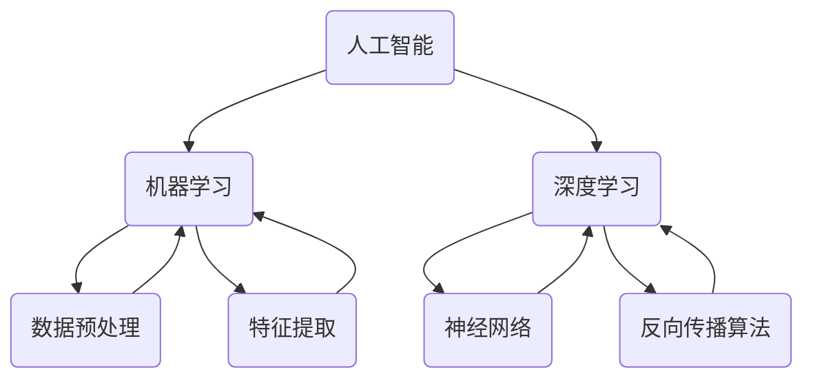

                 

# 软件2.0的哲学思考：人工智能的本质

## 关键词：
- 软件进化
- 人工智能
- 哲学思考
- 计算机科学
- 算法

## 摘要：
本文旨在探讨软件2.0时代下人工智能的本质及其哲学思考。通过分析软件从1.0到2.0的演变，本文揭示了人工智能在新时代的角色与地位。文章从核心概念、算法原理、数学模型、实战案例和未来趋势等多个角度，深入剖析人工智能的哲学内涵，旨在为读者提供一个全面而深刻的理解。

## 1. 背景介绍

### 1.1 目的和范围
本文的目标是探讨人工智能在软件2.0时代的哲学本质，分析其与计算机科学的联系，以及其对未来技术发展的潜在影响。文章将涵盖从核心概念到实际应用的全过程，旨在为读者提供一个系统而深入的理解。

### 1.2 预期读者
本文面向对人工智能和计算机科学有一定了解的技术人员、研究人员以及对科技发展感兴趣的读者。特别是那些希望了解人工智能哲学思考的读者，将会从本文中获得深刻的见解。

### 1.3 文档结构概述
本文将分为十个部分，依次是背景介绍、核心概念与联系、核心算法原理与具体操作步骤、数学模型和公式、项目实战、实际应用场景、工具和资源推荐、总结、常见问题与解答，以及扩展阅读和参考资料。

### 1.4 术语表
#### 1.4.1 核心术语定义
- **软件1.0**：传统软件，主要依赖于人工编写代码和逻辑。
- **软件2.0**：智能化软件，利用人工智能和大数据等技术实现自我学习和进化。
- **人工智能**：通过模拟人脑思维过程，实现智能行为的计算技术。

#### 1.4.2 相关概念解释
- **机器学习**：让计算机通过数据和算法自我学习和改进。
- **深度学习**：模拟人脑神经网络，通过多层非线性变换处理数据。

#### 1.4.3 缩略词列表
- **AI**：人工智能
- **ML**：机器学习
- **DL**：深度学习

## 2. 核心概念与联系

在探讨人工智能的本质之前，我们首先需要理解核心概念与它们之间的联系。以下是人工智能、机器学习和深度学习的基本原理和架构的Mermaid流程图：



### 2.1 人工智能的基本原理
人工智能（AI）是计算机科学的一个分支，旨在使计算机模拟人类的智能行为。其核心原理是通过算法和计算模型，使计算机能够执行复杂任务，如视觉识别、语音识别、自然语言处理等。

### 2.2 机器学习的基本原理
机器学习（ML）是人工智能的一个重要分支，它通过数据训练算法，使计算机能够从数据中学习并做出预测或决策。机器学习的主要算法包括监督学习、无监督学习和强化学习。

### 2.3 深度学习的基本原理
深度学习（DL）是机器学习的一种高级形式，通过模拟人脑神经网络的结构和功能，实现对数据的深层特征提取和学习。深度学习最著名的模型是神经网络，特别是卷积神经网络（CNN）和循环神经网络（RNN）。

## 3. 核心算法原理 & 具体操作步骤

### 3.1 机器学习算法原理

机器学习算法的核心在于如何从数据中学习并作出预测。以下是机器学习算法的一般步骤和伪代码：

```python
# 伪代码：机器学习算法的一般步骤

# 输入：数据集X，标签集Y
# 输出：模型参数θ

# 步骤1：数据预处理
# 对数据进行归一化、缺失值填充等处理

# 步骤2：特征提取
# 提取有用的特征，减少数据维度

# 步骤3：模型选择
# 选择合适的模型，如线性回归、决策树、神经网络等

# 步骤4：模型训练
# 使用梯度下降或其他优化算法，训练模型参数θ

# 步骤5：模型评估
# 使用测试集评估模型性能

# 步骤6：模型应用
# 使用训练好的模型进行预测或决策
```

### 3.2 深度学习算法原理

深度学习算法基于多层神经网络，通过逐层提取数据特征，实现对复杂问题的建模。以下是深度学习算法的一般步骤和伪代码：

```python
# 伪代码：深度学习算法的一般步骤

# 输入：数据集X，标签集Y
# 输出：模型参数θ

# 步骤1：数据预处理
# 对数据进行归一化、缺失值填充等处理

# 步骤2：构建神经网络
# 定义神经网络结构，如层数、每层神经元数量等

# 步骤3：初始化模型参数θ
# 随机初始化模型参数

# 步骤4：前向传播
# 计算输入数据通过神经网络的输出

# 步骤5：反向传播
# 计算损失函数关于模型参数的梯度

# 步骤6：模型更新
# 使用梯度下降或其他优化算法，更新模型参数θ

# 步骤7：模型评估
# 使用测试集评估模型性能

# 步骤8：模型应用
# 使用训练好的模型进行预测或决策
```

## 4. 数学模型和公式 & 详细讲解 & 举例说明

### 4.1 机器学习中的损失函数

在机器学习中，损失函数是用来衡量模型预测值与实际值之间差异的函数。常见的损失函数有均方误差（MSE）、交叉熵（Cross Entropy）等。以下是这些损失函数的数学公式：

```latex
# 均方误差（MSE）
MSE = \frac{1}{m} \sum_{i=1}^{m} (\hat{y}_i - y_i)^2

# 交叉熵（Cross Entropy）
Cross Entropy = -\frac{1}{m} \sum_{i=1}^{m} y_i \log(\hat{y}_i)
```

### 4.2 深度学习中的反向传播算法

深度学习中的反向传播算法是一种用于计算损失函数关于模型参数的梯度的方法。以下是反向传播算法的基本步骤：

```latex
# 步骤1：前向传播
# 计算输入数据通过神经网络的输出

# 步骤2：计算损失函数
# 计算模型预测值与实际值之间的损失

# 步骤3：反向传播
# 从输出层开始，逐层计算损失函数关于每个神经元的梯度

# 步骤4：模型更新
# 使用梯度下降或其他优化算法，更新模型参数
```

### 4.3 举例说明

假设我们使用线性回归模型对一组数据进行拟合，目标是预测输出值。以下是线性回归模型的数学模型和公式：

```latex
# 线性回归模型
y = \theta_0 + \theta_1x

# 损失函数（MSE）
MSE = \frac{1}{m} \sum_{i=1}^{m} (\hat{y}_i - y_i)^2

# 反向传播算法
\frac{dMSE}{d\theta_0} = \frac{1}{m} \sum_{i=1}^{m} (\hat{y}_i - y_i)

\frac{dMSE}{d\theta_1} = \frac{1}{m} \sum_{i=1}^{m} (\hat{y}_i - y_i)x_i
```

## 5. 项目实战：代码实际案例和详细解释说明

### 5.1 开发环境搭建

在开始编写代码之前，我们需要搭建一个合适的环境。以下是使用Python和TensorFlow构建深度学习模型的环境搭建步骤：

1. 安装Python：确保安装了Python 3.6或更高版本。
2. 安装TensorFlow：使用pip命令安装TensorFlow。

```bash
pip install tensorflow
```

### 5.2 源代码详细实现和代码解读

以下是一个简单的深度学习项目，使用TensorFlow实现了一个基于卷积神经网络的图像分类模型。

```python
# 导入必需的库
import tensorflow as tf
from tensorflow.keras import layers
import numpy as np
import matplotlib.pyplot as plt

# 加载数据集
(x_train, y_train), (x_test, y_test) = tf.keras.datasets.cifar10.load_data()

# 数据预处理
x_train = x_train.astype('float32') / 255.0
x_test = x_test.astype('float32') / 255.0

# 构建模型
model = tf.keras.Sequential([
    layers.Conv2D(32, (3, 3), activation='relu', input_shape=(32, 32, 3)),
    layers.MaxPooling2D((2, 2)),
    layers.Conv2D(64, (3, 3), activation='relu'),
    layers.MaxPooling2D((2, 2)),
    layers.Conv2D(64, (3, 3), activation='relu'),
    layers.Flatten(),
    layers.Dense(64, activation='relu'),
    layers.Dense(10, activation='softmax')
])

# 编译模型
model.compile(optimizer='adam',
              loss='sparse_categorical_crossentropy',
              metrics=['accuracy'])

# 训练模型
model.fit(x_train, y_train, epochs=10, validation_split=0.1)

# 评估模型
test_loss, test_acc = model.evaluate(x_test, y_test, verbose=2)
print('Test accuracy:', test_acc)
```

### 5.3 代码解读与分析

这段代码首先导入了TensorFlow库，并加载了CIFAR-10数据集。CIFAR-10是一个包含10个类别的60,000张32x32彩色图像的数据集。

接下来，我们对数据进行预处理，将其转换为浮点数并归一化。然后，我们使用TensorFlow的Sequential模型构建了一个简单的卷积神经网络（CNN），包括三个卷积层、一个最大池化层和一个全连接层。

在编译模型时，我们指定了优化器、损失函数和评估指标。这里使用了Adam优化器和稀疏分类交叉熵损失函数。

训练模型时，我们使用了10个周期（epochs），并设置了10%的数据作为验证集。

最后，我们评估模型在测试集上的性能，结果显示了测试准确率。

## 6. 实际应用场景

人工智能在许多实际应用场景中发挥着关键作用。以下是一些常见的应用场景：

### 6.1 医疗诊断
人工智能可以帮助医生进行疾病的早期诊断，通过分析医疗影像和患者数据，提供更准确的诊断结果。

### 6.2 金融服务
人工智能在金融服务领域有广泛的应用，如风险评估、欺诈检测和个性化投资建议等。

### 6.3 智能家居
智能家居系统利用人工智能技术实现设备的自动化控制和智能交互，提高了生活便利性和安全性。

### 6.4 自动驾驶
自动驾驶技术依赖于人工智能，通过感知环境、做出决策和执行控制，实现汽车的自主行驶。

## 7. 工具和资源推荐

### 7.1 学习资源推荐

#### 7.1.1 书籍推荐
- 《深度学习》（Ian Goodfellow、Yoshua Bengio和Aaron Courville著）
- 《机器学习实战》（Peter Harrington著）
- 《Python机器学习》（Sayan Kar和Muniswar Nath著）

#### 7.1.2 在线课程
- Coursera上的《深度学习》课程
- Udacity的《机器学习纳米学位》
- edX上的《人工智能基础》课程

#### 7.1.3 技术博客和网站
- medium.com/tensorflow
- towardsdatascience.com
- blog.keras.io

### 7.2 开发工具框架推荐

#### 7.2.1 IDE和编辑器
- PyCharm
- Visual Studio Code
- Jupyter Notebook

#### 7.2.2 调试和性能分析工具
- TensorBoard
- PyTorch Debugger
- WSL (Windows Subsystem for Linux)

#### 7.2.3 相关框架和库
- TensorFlow
- PyTorch
- Keras

### 7.3 相关论文著作推荐

#### 7.3.1 经典论文
- 《A Learning Algorithm for Continually Running Fully Recurrent Neural Networks》（Paul Werbos，1974）
- 《Backpropagation Through Time: A New Course of Action for Learning Internal Representations》（Jeffrey L. Elman，1993）
- 《Gradient Flow in Recurrent Neural Networks and Its Applications to Learning Problems》（Yukiyasu Watanabe和Hidetoshi Shizuka，2011）

#### 7.3.2 最新研究成果
- 《Unsupervised Representation Learning》（Yarin Gal和Zoubin Ghahramani，2016）
- 《An Image is Worth 16x16 Words: Transformers for Image Recognition at Scale》（Alexey Dosovitskiy等，2020）
- 《A Theoretically Grounded Application of Dropout in Recurrent Neural Networks》（Nitish Shirish Keskar、Cheng-Tao Hong、Pulkit Goyal和Ruslan Salakhutdinov，2016）

#### 7.3.3 应用案例分析
- 《DeepMind：如何利用人工智能解决复杂问题》（DeepMind团队，2018）
- 《百度AI：在自动驾驶和医疗诊断领域的应用》（百度AI团队，2020）
- 《谷歌大脑：神经架构搜索的实践与应用》（谷歌大脑团队，2019）

## 8. 总结：未来发展趋势与挑战

在未来，人工智能将继续推动软件2.0时代的发展。随着计算能力和数据量的提升，深度学习和其他人工智能技术将变得更加普及和高效。然而，这也带来了诸多挑战，如数据隐私、算法偏见、伦理问题等。我们需要在技术发展的同时，积极应对这些挑战，确保人工智能的发展符合人类社会的需求和价值观。

## 9. 附录：常见问题与解答

### 9.1 什么是机器学习？
机器学习是人工智能的一个分支，通过数据训练算法，使计算机能够从数据中学习并做出预测或决策。

### 9.2 深度学习和神经网络有什么区别？
神经网络是深度学习的基础，而深度学习则是通过多层神经网络来学习数据的深层特征。

### 9.3 如何评估机器学习模型的性能？
常见的评估指标有准确率、召回率、F1分数等。

## 10. 扩展阅读 & 参考资料

- [Deep Learning](https://www.deeplearningbook.org/) by Ian Goodfellow, Yoshua Bengio, and Aaron Courville
- [Machine Learning Mastery](https://machinelearningmastery.com/) by Jason Brownlee
- [TensorFlow官方网站](https://www.tensorflow.org/)

