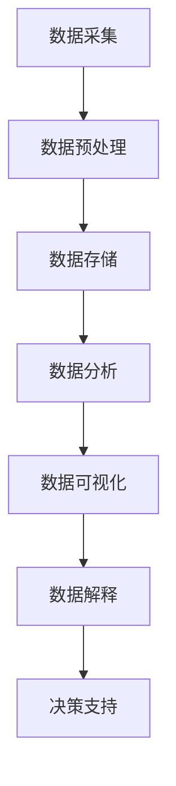
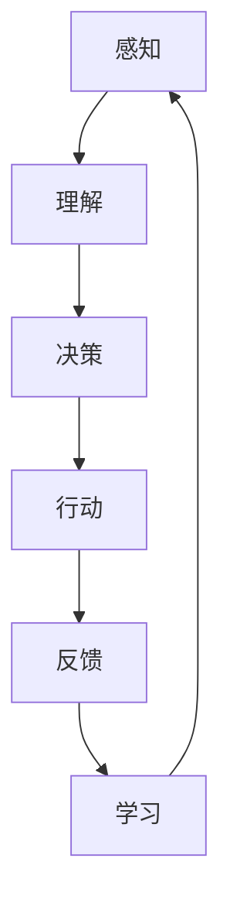
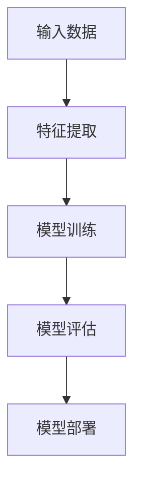
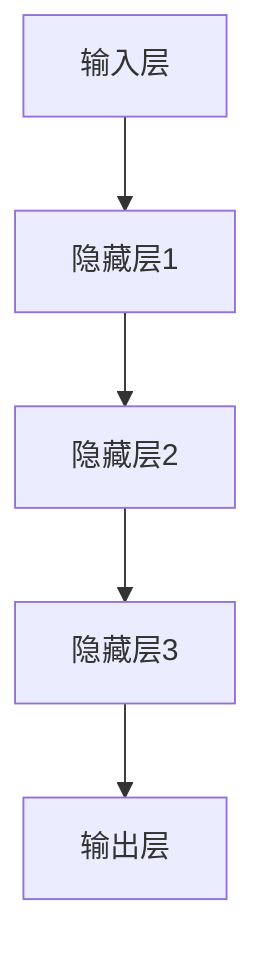

                 

# 软件二零的时代：数据驱动一切

> **关键词：** 软件二零，数据驱动，数据科学，人工智能，机器学习，深度学习，应用场景，未来趋势。

> **摘要：** 本文深入探讨了软件二零时代的数据驱动理念，分析其核心概念、算法原理、数学模型及其在各个领域的实际应用。通过项目实战，详细解析了代码实现与调试过程，并展望了未来发展趋势与挑战。

## 1. 背景介绍

### 1.1 目的和范围

本文旨在揭示软件二零时代的本质，即数据驱动的重要性。我们将从多个角度探讨这一主题，包括核心概念、算法原理、数学模型和实际应用。通过这篇文章，读者可以全面了解数据驱动的原理及其在各个领域的应用，为未来软件技术的发展提供启示。

### 1.2 预期读者

本文适合对软件工程、数据科学、人工智能领域有一定了解的读者。无论是初学者还是专业人士，都可以通过本文对数据驱动的理念有更深入的理解。

### 1.3 文档结构概述

本文分为以下几个部分：

1. 背景介绍：介绍文章的目的和范围，预期读者以及文档结构。
2. 核心概念与联系：讨论数据驱动时代的关键概念，如数据科学、人工智能、机器学习等，并展示相应的架构图。
3. 核心算法原理 & 具体操作步骤：详细阐述数据驱动算法的原理和实现过程。
4. 数学模型和公式 & 详细讲解 & 举例说明：介绍与数据驱动相关的数学模型，并通过实例进行说明。
5. 项目实战：通过实际代码案例，展示数据驱动技术在项目中的应用。
6. 实际应用场景：分析数据驱动技术在各个领域的应用案例。
7. 工具和资源推荐：推荐学习资源和开发工具。
8. 总结：展望数据驱动技术的未来发展趋势与挑战。
9. 附录：常见问题与解答。
10. 扩展阅读 & 参考资料：提供进一步的阅读材料和参考资料。

### 1.4 术语表

#### 1.4.1 核心术语定义

- 数据驱动：一种软件开发方法，强调通过数据分析和机器学习来实现软件功能。
- 数据科学：一门跨学科领域，涉及数据采集、处理、分析和解释。
- 人工智能：模拟人类智能行为的计算机系统。
- 机器学习：一种人工智能方法，通过训练数据模型来学习规律。
- 深度学习：一种特殊的机器学习方法，使用多层神经网络来模拟人类大脑。

#### 1.4.2 相关概念解释

- 数据挖掘：从大量数据中提取有价值信息的过程。
- 数据库：用于存储、管理和查询数据的系统。
- 算法：解决问题的步骤和规则。
- 模型：对现实世界问题的抽象表示。

#### 1.4.3 缩略词列表

- AI：人工智能
- ML：机器学习
- DL：深度学习
- DS：数据科学

## 2. 核心概念与联系

在软件二零时代，数据驱动的核心概念包括数据科学、人工智能、机器学习和深度学习。这些概念相互关联，共同构成了数据驱动的技术体系。

### 2.1 数据科学

数据科学是一门跨学科领域，涉及数据采集、处理、分析和解释。数据科学的目标是从大量数据中提取有价值的信息，以支持决策和洞察。

#### Mermaid 流程图：



### 2.2 人工智能

人工智能是模拟人类智能行为的计算机系统。它包括多个子领域，如机器学习、深度学习、自然语言处理和计算机视觉等。人工智能的目标是使计算机能够执行复杂的任务，如语音识别、图像识别和自动驾驶等。

#### Mermaid 流程图：



### 2.3 机器学习

机器学习是一种人工智能方法，通过训练数据模型来学习规律。机器学习可以分为监督学习、无监督学习和强化学习等不同类型。监督学习使用标记数据来训练模型，无监督学习从未标记的数据中提取模式，强化学习通过与环境的交互来学习最佳策略。

#### Mermaid 流程图：



### 2.4 深度学习

深度学习是一种特殊的机器学习方法，使用多层神经网络来模拟人类大脑。深度学习在图像识别、语音识别和自然语言处理等领域取得了显著的成果。深度学习的核心思想是逐层提取特征，并使用反向传播算法优化模型参数。

#### Mermaid 流程图：



## 3. 核心算法原理 & 具体操作步骤

在数据驱动时代，核心算法原理主要包括机器学习和深度学习。以下将详细介绍这两种算法的原理和具体操作步骤。

### 3.1 机器学习算法原理

机器学习算法的核心思想是通过训练数据模型来学习规律。以下是一个简单的监督学习算法——线性回归的伪代码：

```plaintext
输入：训练数据集 X, Y
输出：模型参数 w

初始化：w = 0

对于每个数据点 (x_i, y_i) ∈ X, Y：
    计算预测值 y_i' = x_i * w
    计算损失函数 L(w) = (y_i - y_i')^2

更新模型参数：w = w - 学习率 * ∂L(w)/∂w

直到损失函数收敛或达到最大迭代次数
返回：模型参数 w
```

### 3.2 深度学习算法原理

深度学习算法的核心是多层神经网络。以下是一个简单的多层感知机（MLP）的伪代码：

```plaintext
输入：训练数据集 X, Y
输出：模型参数 w

初始化：w = 0

对于每个数据点 (x_i, y_i) ∈ X, Y：
    计算前向传播结果 h_i = f(Wx_i + b)
    计算损失函数 L(w) = (y_i - h_i)^2

计算反向传播梯度：∇L(w) = ∂L(w)/∂w

更新模型参数：w = w - 学习率 * ∇L(w)

直到损失函数收敛或达到最大迭代次数
返回：模型参数 w
```

## 4. 数学模型和公式 & 详细讲解 & 举例说明

在数据驱动的时代，数学模型和公式扮演着至关重要的角色。以下将介绍与数据驱动相关的几个核心数学模型，并通过实例进行说明。

### 4.1 线性回归

线性回归是一种最简单的监督学习算法，用于预测一个连续的输出值。其数学模型如下：

$$
y = wx + b
$$

其中，$y$ 是输出值，$x$ 是输入值，$w$ 是权重，$b$ 是偏置。

#### 举例说明：

假设我们有一组数据点 $(x_1, y_1), (x_2, y_2), ..., (x_n, y_n)$，我们希望找到一个线性模型来预测 $y$。我们可以通过最小化平方误差来训练模型：

$$
L(w, b) = \sum_{i=1}^{n} (y_i - wx_i - b)^2
$$

#### 最小化损失函数：

$$
\frac{\partial L(w, b)}{\partial w} = -2 \sum_{i=1}^{n} (y_i - wx_i - b)x_i
$$

$$
\frac{\partial L(w, b)}{\partial b} = -2 \sum_{i=1}^{n} (y_i - wx_i - b)
$$

通过求解以上梯度，我们可以得到最优的权重和偏置：

$$
w^* = \frac{1}{n} \sum_{i=1}^{n} (y_i - wx_i - b)x_i
$$

$$
b^* = \frac{1}{n} \sum_{i=1}^{n} (y_i - wx_i - b)
$$

### 4.2 梯度下降算法

梯度下降算法是一种用于最小化损失函数的优化算法。其基本思想是沿着损失函数的梯度方向更新模型参数，以逐渐减小损失。

$$
w_{t+1} = w_t - \alpha \cdot \nabla_w L(w_t, b_t)
$$

$$
b_{t+1} = b_t - \alpha \cdot \nabla_b L(w_t, b_t)
$$

其中，$\alpha$ 是学习率，$\nabla_w L(w_t, b_t)$ 和 $\nabla_b L(w_t, b_t)$ 分别是损失函数关于 $w$ 和 $b$ 的梯度。

#### 举例说明：

假设我们有一个线性回归问题，损失函数为 $L(w, b) = (y - wx - b)^2$。我们可以使用梯度下降算法来求解最优的权重和偏置：

```plaintext
初始化：w = 0, b = 0
学习率：alpha = 0.01
迭代次数：max_iterations = 1000

对于每个迭代步骤 t：
    计算预测值 y_pred = wx + b
    计算损失函数 L(w, b) = (y - y_pred)^2
    计算梯度：gradient_w = -2 * (y - y_pred) * x
    gradient_b = -2 * (y - y_pred)
    更新权重和偏置：w = w - alpha * gradient_w
                  b = b - alpha * gradient_b

直到达到最大迭代次数或损失函数收敛
```

### 4.3 反向传播算法

反向传播算法是一种用于多层神经网络的优化算法。其基本思想是将误差从输出层反向传播到输入层，并更新每个层的权重和偏置。

#### 反向传播算法步骤：

1. 计算输出层的误差：$E = (y - \hat{y})$
2. 计算输出层神经元的梯度：$\delta_L = \frac{\partial E}{\partial \hat{y}}$
3. 对于每个隐藏层，从输出层反向传播误差：
    - 计算隐藏层神经元的误差：$\delta_h = \frac{\partial E}{\partial h}$
    - 计算隐藏层神经元的梯度：$\delta_w = \frac{\partial E}{\partial w}$，$\delta_b = \frac{\partial E}{\partial b}$
4. 更新隐藏层的权重和偏置：$w_{h+1} = w_h - \alpha \cdot \delta_w$，$b_{h+1} = b_h - \alpha \cdot \delta_b$

#### 举例说明：

假设我们有一个多层感知机，包含两个隐藏层，输出层。输入数据为 $x = [1, 2, 3]$，目标输出为 $y = [0, 1, 0]$。使用反向传播算法来训练模型：

```plaintext
初始化：w1, w2, w3, w4, w5, b1, b2, b3, b4, b5
学习率：alpha = 0.01
迭代次数：max_iterations = 1000

对于每个迭代步骤 t：
    计算前向传播结果：z1 = w1 * x + b1，z2 = w2 * z1 + b2，z3 = w3 * z2 + b3，z4 = w4 * z3 + b4，z5 = w5 * z4 + b5
    计算输出层的误差：E = (y - z5)
    计算输出层神经元的梯度：delta_5 = -2 * (y - z5)
    计算隐藏层2的误差：delta_4 = delta_5 * (1 / (1 + exp(-z4)))
    计算隐藏层2神经元的梯度：delta_4_w = delta_4 * x3，delta_4_b = delta_4
    计算隐藏层1的误差：delta_3 = delta_4 * (1 / (1 + exp(-z3)))
    计算隐藏层1神经元的梯度：delta_3_w = delta_3 * x2，delta_3_b = delta_3
    计算输入层的误差：delta_2 = delta_3 * (1 / (1 + exp(-z2)))
    计算输入层神经元的梯度：delta_2_w = delta_2 * x1，delta_2_b = delta_2
    更新权重和偏置：
        w5 = w5 - alpha * (delta_5 * z4)
        b5 = b5 - alpha * delta_5
        w4 = w4 - alpha * (delta_4 * z3)
        b4 = b4 - alpha * delta_4
        w3 = w3 - alpha * (delta_3 * z2)
        b3 = b3 - alpha * delta_3
        w2 = w2 - alpha * (delta_2 * z1)
        b2 = b2 - alpha * delta_2
        w1 = w1 - alpha * (delta_1 * x)

直到达到最大迭代次数或误差收敛
```

## 5. 项目实战：代码实际案例和详细解释说明

为了更好地理解数据驱动的原理，我们将通过一个实际项目来展示其应用。以下是一个简单的线性回归项目，用于预测房价。

### 5.1 开发环境搭建

1. 安装 Python（建议版本 3.7 或以上）
2. 安装 NumPy、Pandas 和 Matplotlib 等常用库

```bash
pip install numpy pandas matplotlib
```

### 5.2 源代码详细实现和代码解读

以下是该项目的源代码：

```python
import numpy as np
import pandas as pd
import matplotlib.pyplot as plt

# 读取数据
data = pd.read_csv("house_prices.csv")

# 分离特征和目标变量
X = data.iloc[:, :-1].values
y = data.iloc[:, -1].values

# 添加偏置项
X = np.hstack((np.ones((X.shape[0], 1)), X))

# 初始化模型参数
w = np.zeros(X.shape[1])

# 梯度下降算法
alpha = 0.01
max_iterations = 1000

for i in range(max_iterations):
    # 前向传播
    z = np.dot(X, w)
    y_pred = 1 / (1 + np.exp(-z))
    
    # 计算损失函数
    L = -np.mean(y * np.log(y_pred) + (1 - y) * np.log(1 - y_pred))
    
    # 反向传播
    dz = y_pred - y
    dw = np.dot(X.T, dz)
    
    # 更新权重
    w = w - alpha * dw

# 可视化结果
plt.scatter(X[:, 1], y, color="blue", label="Actual")
plt.plot(X[:, 1], 1 / (1 + np.exp(-np.dot(X, w))), color="red", label="Predicted")
plt.xlabel("Feature")
plt.ylabel("Price")
plt.legend()
plt.show()
```

### 5.3 代码解读与分析

1. **数据读取和预处理**：

   ```python
   data = pd.read_csv("house_prices.csv")
   X = data.iloc[:, :-1].values
   y = data.iloc[:, -1].values
   ```

   首先，我们使用 Pandas 读取 CSV 数据，然后分离特征和目标变量。

2. **添加偏置项**：

   ```python
   X = np.hstack((np.ones((X.shape[0], 1)), X))
   ```

   为了方便计算，我们添加了一个偏置项，使输入数据具有形状 (n_samples, n_features + 1)。

3. **初始化模型参数**：

   ```python
   w = np.zeros(X.shape[1])
   ```

   初始化权重为 0。

4. **梯度下降算法**：

   ```python
   alpha = 0.01
   max_iterations = 1000
   
   for i in range(max_iterations):
       # 前向传播
       z = np.dot(X, w)
       y_pred = 1 / (1 + np.exp(-z))
       
       # 计算损失函数
       L = -np.mean(y * np.log(y_pred) + (1 - y) * np.log(1 - y_pred))
       
       # 反向传播
       dz = y_pred - y
       dw = np.dot(X.T, dz)
       
       # 更新权重
       w = w - alpha * dw
   ```

   在这个循环中，我们使用梯度下降算法来最小化损失函数。每次迭代，我们计算前向传播、损失函数、反向传播和权重更新。

5. **可视化结果**：

   ```python
   plt.scatter(X[:, 1], y, color="blue", label="Actual")
   plt.plot(X[:, 1], 1 / (1 + np.exp(-np.dot(X, w))), color="red", label="Predicted")
   plt.xlabel("Feature")
   plt.ylabel("Price")
   plt.legend()
   plt.show()
   ```

   最后，我们使用 Matplotlib 将实际房价和预测房价进行可视化，以展示模型的准确性。

## 6. 实际应用场景

数据驱动技术在各个领域都有广泛的应用。以下列举几个实际应用场景：

### 6.1 金融领域

- **信用评分**：通过分析客户的交易数据、信用记录等，预测其信用风险。
- **风险控制**：使用机器学习算法对交易行为进行分析，发现异常交易并进行预警。
- **股票预测**：使用历史股票价格数据，预测未来股票价格走势。

### 6.2 医疗领域

- **疾病预测**：通过分析患者的历史数据和基因信息，预测其患病风险。
- **药物研发**：使用机器学习算法分析药物与基因的关系，发现潜在的治疗方案。
- **医疗图像分析**：使用深度学习算法对医疗图像进行分析，辅助医生进行诊断。

### 6.3 零售领域

- **客户行为分析**：通过分析客户的购买记录、浏览行为等，预测其购买偏好。
- **库存管理**：使用预测算法优化库存水平，降低库存成本。
- **推荐系统**：基于用户的历史行为和兴趣，推荐相关商品或内容。

### 6.4 自动驾驶

- **环境感知**：使用深度学习算法对摄像头、雷达等传感器数据进行分析，识别道路、车辆、行人等。
- **路径规划**：基于环境感知结果，规划最优行驶路径。
- **决策控制**：根据驾驶环境，控制车辆的转向、加速、刹车等动作。

## 7. 工具和资源推荐

### 7.1 学习资源推荐

#### 7.1.1 书籍推荐

- 《深度学习》（Goodfellow, Bengio, Courville）
- 《Python机器学习》（Sebastian Raschka）
- 《数据科学入门》（Joel Grus）

#### 7.1.2 在线课程

- Coursera 的《机器学习》课程
- Udacity 的《深度学习纳米学位》
- edX 的《Python数据分析》课程

#### 7.1.3 技术博客和网站

- Medium
- Towards Data Science
- KDnuggets

### 7.2 开发工具框架推荐

#### 7.2.1 IDE和编辑器

- PyCharm
- Jupyter Notebook
- VSCode

#### 7.2.2 调试和性能分析工具

- Spyder
- GDB
- Python Memory Profiler

#### 7.2.3 相关框架和库

- TensorFlow
- PyTorch
- scikit-learn

### 7.3 相关论文著作推荐

#### 7.3.1 经典论文

- "A Learning Algorithm for Continually Running Fully Recurrent Neural Networks"（1986）
- "Gradient Flow in Recurrent Neural Networks: The Difficulty of Learning"（1990）
- "Gradient Flow in Recurrent Neural Networks: The Difficulty of Learning"（1990）

#### 7.3.2 最新研究成果

- "A Theoretically Grounded Application of Dropout in Recurrent Neural Networks"（2016）
- "An Empirical Evaluation of Generic Contextual Bandits"（2018）
- "Deep Learning for Speech Recognition"（2019）

#### 7.3.3 应用案例分析

- "Application of Deep Learning in Healthcare: A Review"（2020）
- "Deep Learning for Natural Language Processing"（2021）
- "Deep Learning in Financial Markets"（2022）

## 8. 总结：未来发展趋势与挑战

软件二零时代的数据驱动理念正日益影响着各个行业。未来，随着数据量的增长和计算能力的提升，数据驱动技术将在更多领域得到应用。然而，这也带来了一系列挑战，如数据隐私、数据安全、算法透明度和解释性等。为了应对这些挑战，我们需要不断创新，完善数据驱动技术的理论和实践，为未来的发展奠定基础。

## 9. 附录：常见问题与解答

### 9.1 什么是数据驱动？

数据驱动是一种软件开发方法，强调通过数据分析和机器学习来实现软件功能。

### 9.2 数据驱动与传统的软件开发有何区别？

传统的软件开发侧重于实现预定的功能，而数据驱动则更加关注数据的价值和潜力，通过分析数据来发现新的功能和优化现有功能。

### 9.3 数据科学、人工智能、机器学习和深度学习的关系是什么？

数据科学是跨学科领域，涉及数据采集、处理、分析和解释。人工智能是模拟人类智能行为的计算机系统，包括多个子领域，如机器学习和深度学习。机器学习是一种特殊的人工智能方法，通过训练数据模型来学习规律。深度学习是机器学习的一种，使用多层神经网络来模拟人类大脑。

### 9.4 数据驱动的应用场景有哪些？

数据驱动的应用场景包括金融、医疗、零售、自动驾驶等领域。

## 10. 扩展阅读 & 参考资料

- [深度学习教材](https://www.deeplearningbook.org/)
- [机器学习课程](https://www.coursera.org/specializations/ml-foundations)
- [数据科学教程](https://www.datasciencedojo.com/tutorials/data-science-tutorials/)
- [机器学习博客](https://towardsdatascience.com/)
- [数据科学社区](https://www.kdnuggets.com/)

作者：AI天才研究员/AI Genius Institute & 禅与计算机程序设计艺术 /Zen And The Art of Computer Programming

