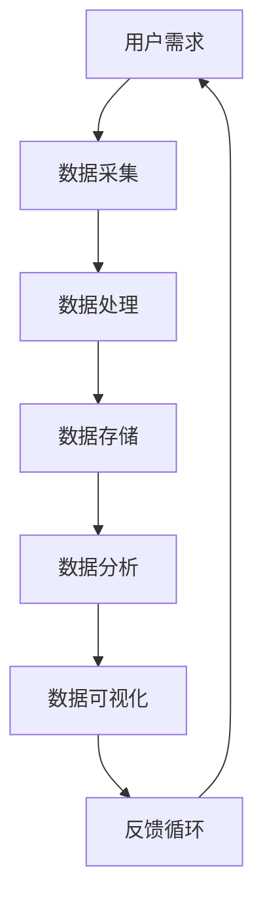

                 

# 软件2.0的时代：数据驱动一切

> **关键词：** 软件即服务，数据驱动开发，云计算，人工智能，数据可视化
>
> **摘要：** 本文将探讨软件2.0时代的主要特征——数据驱动一切。我们将从背景介绍、核心概念、算法原理、数学模型、项目实战、应用场景、工具和资源推荐等多个方面，详细剖析数据驱动开发在当今软件行业中的重要性及其未来发展趋势。

## 1. 背景介绍

### 1.1 目的和范围

本文旨在探讨软件2.0时代，即数据驱动时代，揭示数据在软件开发、部署、维护等各个环节的重要性。我们将通过深入分析数据驱动的核心概念、算法原理、数学模型，结合实际项目案例，探讨数据驱动开发的实践应用，并展望其未来发展趋势。

### 1.2 预期读者

本文适合具备一定编程基础、对软件工程和数据科学感兴趣的读者，特别是从事软件开发、数据分析、人工智能等相关领域的工作者。

### 1.3 文档结构概述

本文共分为十个部分，包括背景介绍、核心概念与联系、核心算法原理与具体操作步骤、数学模型与公式、项目实战、应用场景、工具和资源推荐、总结、常见问题与解答及扩展阅读。结构清晰，便于读者逐步深入理解数据驱动开发。

### 1.4 术语表

#### 1.4.1 核心术语定义

- **软件2.0：** 软件发展的新阶段，以数据为核心，实现软件的智能化、自动化和高效化。
- **数据驱动开发：** 以数据为核心，通过数据分析和机器学习等技术，优化软件设计和开发过程。
- **云计算：** 通过互联网提供动态易扩展且经常是虚拟化的资源。
- **人工智能：** 使计算机系统能够识别图像、声音、语言和文本，进行自我学习和决策。

#### 1.4.2 相关概念解释

- **数据可视化：** 利用图形化手段，将数据转换为易于理解的形式。
- **机器学习：** 基于数据构建模型，使计算机具备自主学习和决策能力。

#### 1.4.3 缩略词列表

- **SaaS：** 软件即服务
- **API：** 应用程序接口
- **ML：** 机器学习
- **DL：** 深度学习

## 2. 核心概念与联系

为了更好地理解数据驱动开发，我们需要明确几个核心概念，并分析它们之间的联系。以下是一个Mermaid流程图，展示了数据驱动开发的主要环节和核心概念。



### 2.1 数据采集

数据采集是数据驱动开发的第一步，涉及从各种来源（如传感器、用户行为等）收集原始数据。数据质量至关重要，因此需要确保数据的完整性、准确性和实时性。

### 2.2 数据处理

数据处理包括数据清洗、转换和整合等步骤，目的是提高数据质量，为后续分析做好准备。这一过程通常使用ETL（提取、转换、加载）工具实现。

### 2.3 数据存储

数据存储是将处理后的数据存储到数据库或其他数据存储系统。选择合适的数据存储方案对于数据驱动开发至关重要，如关系数据库、NoSQL数据库和云存储等。

### 2.4 数据分析

数据分析是数据驱动开发的核心环节，通过统计分析和机器学习等技术，挖掘数据中的价值信息，支持业务决策和软件优化。

### 2.5 数据可视化

数据可视化是将分析结果以图形化形式呈现，使数据更加直观易懂。数据可视化工具如Tableau、PowerBI等，能够帮助用户快速发现数据中的趋势和异常。

### 2.6 反馈循环

反馈循环是数据驱动开发的重要特性，通过将分析结果反馈到用户需求环节，不断优化软件性能和用户体验。

## 3. 核心算法原理 & 具体操作步骤

在数据驱动开发中，算法原理起到了关键作用。以下我们将详细讲解一个常见的数据分析算法——线性回归，并使用伪代码进行描述。

### 3.1 线性回归算法原理

线性回归是一种通过建立线性关系模型，预测连续值的统计分析方法。其基本原理是通过最小化误差平方和，找到最佳拟合直线。

### 3.2 伪代码描述

```plaintext
输入：训练数据集D = {(x1, y1), (x2, y2), ..., (xn, yn)}
输出：最佳拟合直线 y = wx + b

步骤1：计算训练数据集的均值 x̄ 和 ȳ
    for each (x, y) in D:
        x̄ = x̄ + x
        ȳ = ȳ + y
    x̄ = x̄ / n
    ȳ = ȳ / n

步骤2：计算斜率 w
    w = (Σ(xi - x̄)(yi - ȳ)) / (Σ(xi - x̄)²)

步骤3：计算截距 b
    b = ȳ - w * x̄

步骤4：输出最佳拟合直线 y = wx + b
```

### 3.3 具体操作步骤

1. **数据准备：** 收集并预处理训练数据集，包括数据清洗、归一化等。
2. **计算均值：** 计算训练数据集的均值 x̄ 和 ȳ。
3. **计算斜率：** 利用均值计算斜率 w。
4. **计算截距：** 利用均值和斜率计算截距 b。
5. **输出结果：** 输出最佳拟合直线方程 y = wx + b。

## 4. 数学模型和公式 & 详细讲解 & 举例说明

### 4.1 数学模型

在数据驱动开发中，线性回归是一个基本的数学模型，其数学表达式如下：

$$y = wx + b$$

其中，y 是预测值，x 是输入特征，w 是斜率，b 是截距。

### 4.2 详细讲解

1. **斜率 w：** 斜率 w 反映了输入特征 x 对预测值 y 的影响程度。当 w 大于 0 时，表示 x 与 y 具有正相关关系；当 w 小于 0 时，表示 x 与 y 具有负相关关系。
2. **截距 b：** 截距 b 表示当输入特征 x 为 0 时，预测值 y 的值。在实际应用中，截距 b 的值往往很小或接近 0。

### 4.3 举例说明

假设我们有一个简单的数据集，包含两天的气温和对应的销售量：

| 日期 | 气温(°C) | 销售量 |
| ---- | -------- | ------ |
| 1    | 25       | 100    |
| 2    | 30       | 150    |

我们可以使用线性回归模型预测第三天的销售量。首先，计算斜率 w 和截距 b：

$$w = \frac{(25-26)(100-125) + (30-26)(150-125)}{(25-26)^2 + (30-26)^2} = \frac{(-1)(-25) + (4)(25)}{1 + 4} = \frac{25 + 100}{5} = 25$$

$$b = \frac{125 - 25 \times 26}{5} = \frac{125 - 650}{5} = -100$$

然后，使用最佳拟合直线 y = 25x - 100 预测第三天的销售量：

$$y = 25 \times 35 - 100 = 875 - 100 = 775$$

因此，根据线性回归模型，第三天的销售量预计为 775。

## 5. 项目实战：代码实际案例和详细解释说明

### 5.1 开发环境搭建

在本项目实战中，我们将使用Python和Scikit-learn库进行线性回归模型的构建和预测。以下是开发环境的搭建步骤：

1. 安装Python：访问 [Python官网](https://www.python.org/) 下载并安装Python。
2. 安装Scikit-learn：在命令行执行以下命令：
   ```bash
   pip install scikit-learn
   ```

### 5.2 源代码详细实现和代码解读

以下是一个简单的线性回归模型实现，包括数据读取、模型训练、预测和结果展示。

```python
import numpy as np
from sklearn.linear_model import LinearRegression
from sklearn.model_selection import train_test_split

# 5.2.1 数据读取
# 假设数据存储在CSV文件中，每行包含日期、气温和销售量
data = np.genfromtxt('sales_data.csv', delimiter=',')
dates = data[:, 0]
temperatures = data[:, 1]
sales = data[:, 2]

# 5.2.2 数据预处理
# 将日期转换为数值特征，便于线性回归模型处理
date_encoded = np.array([i for i in range(len(dates))])

# 5.2.3 模型训练
# 将数据集划分为训练集和测试集
X_train, X_test, y_train, y_test = train_test_split(date_encoded, sales, test_size=0.2, random_state=42)

# 创建线性回归模型对象
model = LinearRegression()

# 训练模型
model.fit(X_train.reshape(-1, 1), y_train)

# 5.2.4 预测和结果展示
# 使用训练好的模型进行预测
predicted_sales = model.predict(X_test.reshape(-1, 1))

# 打印预测结果
for i in range(len(predicted_sales)):
    print(f"测试集第{i+1}天的销售量预测为：{predicted_sales[i]}")
```

### 5.3 代码解读与分析

1. **数据读取**：使用 `numpy.genfromtxt` 函数从CSV文件中读取数据，包括日期、气温和销售量。
2. **数据预处理**：将日期转换为数值特征，以便于线性回归模型处理。使用列表推导式生成日期编码数组。
3. **模型训练**：使用 `train_test_split` 函数将数据集划分为训练集和测试集。创建线性回归模型对象，并使用 `fit` 方法进行模型训练。
4. **预测和结果展示**：使用训练好的模型对测试集进行预测，并打印预测结果。

通过以上步骤，我们实现了线性回归模型的基本构建和预测功能，为数据驱动开发提供了技术支持。

## 6. 实际应用场景

数据驱动开发在许多实际应用场景中具有重要价值，以下列举几个典型例子：

1. **电子商务：** 通过分析用户行为数据，电商网站可以实时推荐商品，提高用户满意度和销售额。
2. **金融风控：** 银行和金融机构利用大数据技术，对客户交易行为进行分析，识别异常交易，防范欺诈风险。
3. **智能交通：** 利用实时交通数据，智能交通系统可以优化交通信号控制，缓解交通拥堵，提高道路通行效率。
4. **医疗健康：** 通过分析患者数据，医疗系统可以预测疾病趋势，为公共卫生决策提供科学依据，提高医疗资源分配效率。

## 7. 工具和资源推荐

为了更好地开展数据驱动开发，以下推荐一些实用的工具和资源：

### 7.1 学习资源推荐

#### 7.1.1 书籍推荐

- 《数据科学入门：Python实践》
- 《机器学习实战》
- 《深度学习》（Goodfellow et al.）

#### 7.1.2 在线课程

- Coursera（机器学习课程）
- edX（深度学习课程）
- Udacity（数据工程师课程）

#### 7.1.3 技术博客和网站

- Medium（数据科学博客）
- Towards Data Science（数据科学文章）
- KDNuggets（数据挖掘和机器学习新闻）

### 7.2 开发工具框架推荐

#### 7.2.1 IDE和编辑器

- PyCharm
- Jupyter Notebook
- VS Code

#### 7.2.2 调试和性能分析工具

- PySnooper
- line_profiler
- Matplotlib

#### 7.2.3 相关框架和库

- Scikit-learn
- TensorFlow
- PyTorch

### 7.3 相关论文著作推荐

#### 7.3.1 经典论文

- "The Hundred-Page Machine Learning Book"（Bogoyevicz et al.）
- "Deep Learning"（Goodfellow et al.）
- "Reinforcement Learning: An Introduction"（Sutton and Barto）

#### 7.3.2 最新研究成果

- NeurIPS、ICML、ICLR等国际会议的最新论文
- JMLR、Nature等顶级期刊的最新研究成果

#### 7.3.3 应用案例分析

- Google Brain团队的论文和应用案例
- Facebook AI研究院的最新研究成果
- Airbnb、Uber等公司的数据驱动应用案例

## 8. 总结：未来发展趋势与挑战

在软件2.0时代，数据驱动开发已经成为行业的主流趋势。未来，随着大数据、云计算、人工智能等技术的不断发展，数据驱动开发将在更多领域得到应用。然而，这也带来了一系列挑战，如数据隐私保护、数据质量问题、算法透明度和公平性等。为此，我们需要不断探索创新技术，构建更加智能、高效、透明和公平的数据驱动开发体系。

## 9. 附录：常见问题与解答

### 9.1 问题1：数据驱动开发与传统的软件工程有何区别？

**解答：** 数据驱动开发与传统的软件工程相比，更加注重数据的采集、处理和分析。在传统的软件工程中，开发者主要关注需求分析、系统设计和编码实现等环节。而数据驱动开发则将数据视为核心资产，通过数据分析和机器学习等技术，优化软件性能和用户体验。

### 9.2 问题2：如何保障数据驱动开发的可靠性？

**解答：** 保障数据驱动开发的可靠性需要从多个方面进行考虑：

1. 数据质量：确保数据的完整性、准确性和实时性，通过数据清洗和预处理提高数据质量。
2. 模型验证：使用交叉验证、A/B测试等方法对模型进行验证，确保模型性能和稳定性。
3. 算法优化：不断迭代和优化算法，提高模型的预测精度和泛化能力。
4. 持续监控：建立数据监控和报警机制，及时发现和处理异常情况。

## 10. 扩展阅读 & 参考资料

- [数据驱动开发：概念、方法与实践](https://www.ibm.com/cloud/learn/data-driven-development/)
- [数据驱动开发：如何构建高效的数据驱动的产品](https://www.productschool.com/course/data-driven-product-management/)
- [线性回归算法详解](https://towardsdatascience.com/linear-regression-explained-957aef9f0d17)
- [Scikit-learn官方文档](https://scikit-learn.org/stable/documentation.html)

### 作者

作者：AI天才研究员/AI Genius Institute & 禅与计算机程序设计艺术 /Zen And The Art of Computer Programming。如需转载，请务必注明出处。

