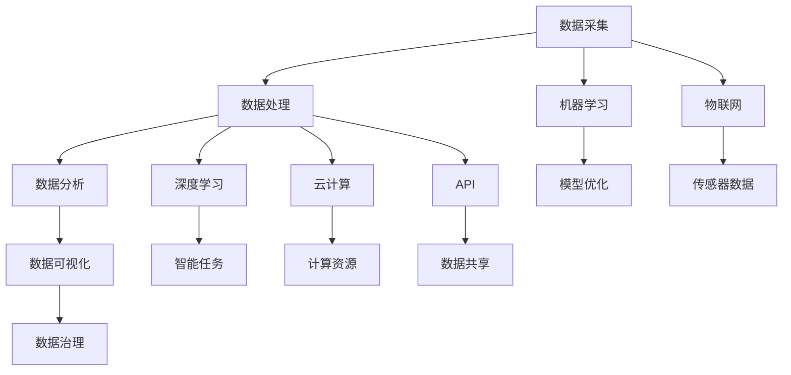

                 


# 软件2.0的时代：数据驱动一切

> 关键词：软件2.0、数据驱动、数字化转型、人工智能、数据治理、算法优化
>
> 摘要：随着大数据、云计算和人工智能技术的发展，软件产业正经历着一场深刻的变革，即从传统的软件1.0时代迈向数据驱动的软件2.0时代。本文将从背景介绍、核心概念与联系、核心算法原理、数学模型和公式、项目实战、实际应用场景、工具和资源推荐、总结与未来发展趋势等多个方面，深入探讨软件2.0时代的特征及其对软件开发、企业运营和产业生态的深远影响。

## 1. 背景介绍

### 1.1 目的和范围

本文旨在探讨软件产业从软件1.0时代向软件2.0时代的转变，解析数据驱动在其中的核心作用。我们将通过回顾软件1.0时代的特征，引入软件2.0时代的新概念，详细阐述数据驱动的原理和机制，并探讨其在软件开发、企业运营和产业生态中的应用。本文不仅针对技术专业人士，也希望能为企业管理者和对数字化转型感兴趣的人提供有价值的参考。

### 1.2 预期读者

本文适合以下读者群体：

1. 软件开发工程师和对编程有兴趣的技术爱好者。
2. 数据科学家和机器学习工程师。
3. 企业决策者和管理者，特别是那些关注数字化转型和大数据应用的。
4. 研究人员和教育工作者，特别是那些对软件工程和人工智能领域感兴趣的。

### 1.3 文档结构概述

本文结构如下：

1. 背景介绍：介绍软件2.0时代的起源、发展及其重要性。
2. 核心概念与联系：探讨数据驱动的核心概念及其关联。
3. 核心算法原理 & 具体操作步骤：介绍数据驱动中的算法原理和实现步骤。
4. 数学模型和公式 & 详细讲解 & 举例说明：解析数据驱动中的数学模型和应用。
5. 项目实战：提供实际代码案例和详细解释。
6. 实际应用场景：探讨数据驱动在各个领域的应用。
7. 工具和资源推荐：推荐学习资源和开发工具。
8. 总结：总结软件2.0时代的核心观点和未来发展趋势。
9. 附录：常见问题与解答。
10. 扩展阅读 & 参考资料：提供进一步学习和研究的参考资料。

### 1.4 术语表

#### 1.4.1 核心术语定义

- **软件1.0时代**：以功能驱动的软件开发阶段，强调代码结构和功能的实现。
- **软件2.0时代**：以数据驱动的软件开发阶段，强调数据的收集、处理和分析。
- **数据驱动**：通过收集和分析数据来指导软件的改进和优化。
- **数字化转型**：利用数字技术优化、重新构建业务流程和运营模式。
- **数据治理**：确保数据质量、安全性和合规性的一系列管理活动。

#### 1.4.2 相关概念解释

- **大数据**：指数据规模巨大，无法用传统数据库软件工具进行捕捉、管理和处理的数据集。
- **云计算**：通过互联网提供动态易扩展且经常是虚拟化的资源。
- **人工智能**：通过模拟人类智能行为来实现的计算机系统。

#### 1.4.3 缩略词列表

- **AI**：人工智能（Artificial Intelligence）
- **ML**：机器学习（Machine Learning）
- **DL**：深度学习（Deep Learning）
- **IoT**：物联网（Internet of Things）
- **API**：应用程序编程接口（Application Programming Interface）

## 2. 核心概念与联系

在软件2.0时代，数据驱动的概念成为了核心。数据驱动不仅仅是收集和存储数据，更重要的是如何利用数据来优化和改进软件和业务流程。为了更好地理解数据驱动的本质，我们需要了解以下核心概念及其相互之间的联系。

### 2.1 数据驱动核心概念

**数据采集**：数据驱动的第一步是收集数据。这些数据可以来自于用户行为、业务流程、传感器、外部API等。数据采集的来源和渠道多种多样，决定了数据的质量和丰富度。

**数据处理**：收集到的数据往往是不完整、不一致的，需要通过清洗、转换和整合等步骤来处理。数据处理的质量直接影响后续分析的结果。

**数据分析**：通过对处理后的数据进行统计分析和模式识别，可以揭示数据中的潜在价值和规律。数据分析是数据驱动的核心，它帮助软件和业务流程不断优化。

**数据可视化**：将数据分析的结果以图表、报表等形式展示出来，使得数据更加直观易懂。数据可视化是沟通数据价值的重要手段。

**数据治理**：确保数据的质量、安全性和合规性。数据治理是数据驱动过程中不可或缺的一环，它确保数据能够被可靠地使用。

### 2.2 数据驱动关联概念

**机器学习**：一种利用数据来训练模型，使计算机能够从数据中学习和发现规律的技术。机器学习是数据驱动的核心技术之一，它使得软件系统能够自动优化和改进。

**深度学习**：一种特殊的机器学习技术，通过神经网络模型对大量数据进行训练，从而实现高级的智能任务，如图像识别、语音识别等。

**物联网（IoT）**：通过传感器和设备将物理世界连接到互联网，使得海量数据可以被采集和传输。物联网是数据采集的重要来源。

**云计算**：通过提供动态易扩展的虚拟化资源，使得数据处理和分析能够高效地进行。云计算是数据驱动过程中计算资源的重要保障。

**API**：应用程序编程接口，它使得不同系统之间的数据交换和协同工作成为可能。API是数据驱动过程中数据共享和集成的关键。

### 2.3 数据驱动原理和架构

为了更好地理解数据驱动的原理和架构，我们可以使用Mermaid流程图来描述核心流程和组件。



在这个流程图中，数据采集是数据驱动的起点，随后经过数据处理、数据分析、数据可视化等环节，最后通过数据治理确保数据的安全和合规性。同时，数据处理和分析过程可以借助机器学习和深度学习技术来提升智能水平，物联网和云计算提供了数据采集和处理所需的基础设施，API则确保了系统之间的数据集成和协同工作。

### 2.4 数据驱动在实际应用中的体现

数据驱动的原理不仅在技术层面得到了应用，在商业、医疗、金融等多个领域也有广泛的应用。

- **商业领域**：通过用户数据分析，企业可以优化营销策略、提高用户体验，甚至实现个性化推荐。
- **医疗领域**：通过患者数据分析和机器学习，可以实现疾病预测、诊断和个性化治疗方案。
- **金融领域**：通过交易数据分析，可以识别风险、优化投资组合，甚至预防金融犯罪。

数据驱动的应用不仅提升了效率和准确性，还为传统行业带来了新的商业机遇和模式。

## 3. 核心算法原理 & 具体操作步骤

数据驱动的核心在于如何通过算法从数据中提取有价值的信息，从而指导软件和业务流程的优化。本节将介绍几种常见的核心算法原理，并使用伪代码详细阐述其具体操作步骤。

### 3.1 机器学习算法

**算法原理**：机器学习是一种通过数据训练模型，使计算机能够自主学习和优化任务的方法。常见的机器学习算法包括线性回归、决策树、支持向量机和神经网络等。

**具体操作步骤**：

```plaintext
函数 trainModel(data, target):
    1. 初始化模型参数
    2. 预处理数据（数据清洗、归一化等）
    3. 分割数据集为训练集和测试集
    4. 选择合适的模型（如线性回归、决策树等）
    5. 训练模型（使用梯度下降、决策树分裂等算法）
    6. 评估模型（使用测试集验证模型性能）
    7. 调整模型参数，优化模型
    8. 应用模型（对新的数据进行预测）
    return 模型
```

### 3.2 深度学习算法

**算法原理**：深度学习是一种基于多层神经网络进行训练的机器学习技术，能够处理更复杂的数据和任务，如图像识别、语音识别等。

**具体操作步骤**：

```plaintext
函数 trainDeepLearningModel(data, labels):
    1. 初始化神经网络结构（如层数、神经元个数等）
    2. 预处理数据（数据清洗、归一化等）
    3. 分割数据集为训练集和测试集
    4. 编写前向传播和反向传播算法
    5. 使用优化算法（如梯度下降、Adam等）训练模型
    6. 评估模型（使用测试集验证模型性能）
    7. 调整模型参数，优化模型
    8. 应用模型（对新的数据进行预测）
    return 模型
```

### 3.3 数据分析算法

**算法原理**：数据分析算法用于从数据集中提取统计信息、发现数据模式、进行关联分析等。

**具体操作步骤**：

```plaintext
函数 analyzeData(data):
    1. 预处理数据（数据清洗、归一化等）
    2. 计算基本统计量（如均值、中位数、标准差等）
    3. 进行关联分析（如卡方检验、相关分析等）
    4. 使用聚类算法（如K-means、层次聚类等）进行数据分组
    5. 使用分类算法（如逻辑回归、决策树等）进行数据分类
    6. 评估分析结果（使用交叉验证、ROC曲线等指标）
    return 分析结果
```

### 3.4 数据驱动中的算法优化

在实际应用中，算法的优化是数据驱动过程中的关键步骤。算法优化的目标是在保证模型性能的同时，提高训练效率和模型的可解释性。

**具体操作步骤**：

```plaintext
函数 optimizeModel(model, data, labels):
    1. 调整模型结构（如增加或减少层、神经元等）
    2. 调整训练策略（如增加训练轮数、改变学习率等）
    3. 使用正则化方法（如L1、L2正则化等）防止过拟合
    4. 使用交叉验证方法评估模型性能
    5. 调整参数，优化模型
    return 优化后的模型
```

通过以上步骤，我们可以看到数据驱动的核心算法原理及其实现过程。这些算法不仅在技术层面上提升了数据处理的效率，也为实际业务提供了强大的支持。在实际应用中，需要根据具体问题和数据特点选择合适的算法，并不断优化和调整，以实现最佳效果。

## 4. 数学模型和公式 & 详细讲解 & 举例说明

在数据驱动的软件开发过程中，数学模型和公式起到了关键作用。这些模型和公式帮助我们理解数据背后的规律，并指导我们进行有效的数据处理和预测。本节将详细讲解几种常用的数学模型和公式，并通过具体的例子来说明其应用。

### 4.1 线性回归模型

线性回归模型是最基本的统计模型之一，它通过寻找自变量和因变量之间的线性关系来预测因变量的值。线性回归的数学公式如下：

$$ Y = \beta_0 + \beta_1X + \epsilon $$

其中，$Y$ 是因变量，$X$ 是自变量，$\beta_0$ 和 $\beta_1$ 是模型参数，$\epsilon$ 是误差项。

**详细讲解**：

- **参数估计**：通过最小二乘法（Least Squares Method）来估计 $\beta_0$ 和 $\beta_1$，使得预测值 $Y$ 与实际值之间的误差平方和最小。
- **模型评估**：使用决定系数 $R^2$ 来评估模型的拟合程度，$R^2$ 越接近1，说明模型拟合效果越好。

**举例说明**：

假设我们想预测一家公司的利润 $Y$（以万元为单位），并基于该公司投入广告费用 $X$（以万元为单位）来建立线性回归模型。我们有以下数据：

| 广告费用（万元） | 利润（万元） |
|:----------------:|:------------:|
|       10         |      50      |
|       20         |      70      |
|       30         |      90      |
|       40         |     110      |
|       50         |     130      |

使用线性回归模型，我们可以得到如下结果：

$$ Y = 40 + 1.5X $$

预测当广告费用为30万元时的利润：

$$ Y = 40 + 1.5 \times 30 = 95 $$

### 4.2 决策树模型

决策树模型通过一系列的规则来对数据进行分类或回归。每个节点代表一个特征，每个分支代表该特征的取值，叶子节点表示预测结果。

**数学公式**：

$$ T = \sum_{i=1}^{n} t_i \cdot w_i $$

其中，$T$ 是目标变量，$t_i$ 是第 $i$ 个特征，$w_i$ 是特征权重。

**详细讲解**：

- **特征选择**：使用信息增益、基尼不纯度等指标来选择最优特征。
- **剪枝**：为了避免过拟合，可以对决策树进行剪枝操作，去除不必要的分支。

**举例说明**：

假设我们有以下决策树模型来预测客户是否会购买某产品：

```
是否是年轻人？
    是：购买概率高
    否：进入下一层
        是否有高收入？
            是：购买概率高
            否：购买概率低
```

我们可以将这个决策树转化为数学公式：

$$
\begin{align*}
P(\text{购买}) &= P(\text{年轻人}) \cdot P(\text{高收入}|\text{年轻人}) \\
&+ P(\text{非年轻人}) \cdot P(\text{高收入}|\text{非年轻人})
\end{align*}
$$

### 4.3 贝叶斯网络模型

贝叶斯网络是一种概率图模型，它通过节点和边来表示变量之间的概率关系。

**数学公式**：

$$ P(A|B) = \frac{P(B|A) \cdot P(A)}{P(B)} $$

其中，$P(A|B)$ 是在已知 $B$ 发生的条件下 $A$ 发生的概率，$P(B|A)$ 是在已知 $A$ 发生的条件下 $B$ 发生的概率，$P(A)$ 和 $P(B)$ 分别是 $A$ 和 $B$ 的先验概率。

**详细讲解**：

- **概率关系**：贝叶斯网络通过条件概率来表示变量之间的依赖关系。
- **推理**：通过贝叶斯推理算法，可以从部分观测数据推断出其他变量的概率分布。

**举例说明**：

假设我们有一个贝叶斯网络来预测一个产品的缺陷概率：

```
      缺陷
     /   \
   外观   结构
  /   \
温度 湿度
```

我们可以用以下概率公式来表示它们之间的依赖关系：

$$
\begin{align*}
P(\text{缺陷}|\text{外观}) &= P(\text{缺陷}|\text{外观，高温}) \cdot P(\text{高温}) \\
&+ P(\text{缺陷}|\text{外观，低温}) \cdot P(\text{低温})
\end{align*}
$$

通过贝叶斯网络，我们可以计算在不同条件下产品缺陷的概率，从而指导生产过程的改进。

### 4.4 神经网络模型

神经网络是一种基于多层感知器的计算模型，它通过模拟人脑神经元的工作方式来进行复杂的数据处理和预测。

**数学公式**：

$$
\begin{align*}
a_{\text{隐藏层}} &= \sigma(W_1 \cdot x + b_1) \\
a_{\text{输出层}} &= \sigma(W_2 \cdot a_{\text{隐藏层}} + b_2)
\end{align*}
$$

其中，$a_{\text{隐藏层}}$ 和 $a_{\text{输出层}}$ 分别是隐藏层和输出层的激活值，$\sigma$ 是激活函数（如Sigmoid函数），$W_1$、$W_2$ 是权重矩阵，$b_1$、$b_2$ 是偏置项。

**详细讲解**：

- **前向传播**：计算输入通过网络后的输出值。
- **反向传播**：通过梯度下降算法更新网络权重和偏置项。

**举例说明**：

假设我们有一个简单的神经网络模型来预测房价：

```
输入层：面积、位置、建造年份
隐藏层：房屋状况、市场趋势
输出层：房价
```

使用前向传播公式，我们可以计算房价的预测值。通过反向传播，我们可以根据预测误差调整网络参数，从而提高模型的准确性。

通过以上几个数学模型和公式的详细讲解和举例说明，我们可以看到它们在数据驱动软件开发中的应用。这些模型不仅帮助我们理解和分析数据，还为实际业务提供了可靠的预测和优化工具。在实际应用中，需要根据具体问题和数据特点选择合适的模型，并进行优化和调整，以实现最佳效果。

## 5. 项目实战：代码实际案例和详细解释说明

为了更好地理解数据驱动的实际应用，我们将通过一个简单的项目实战来展示代码实现过程，并对关键代码进行详细解释说明。本项目将基于Python语言和常见的机器学习库scikit-learn，实现一个用于房价预测的简单神经网络。

### 5.1 开发环境搭建

在开始项目之前，我们需要搭建一个合适的开发环境。以下是所需的环境配置步骤：

1. **安装Python**：确保Python版本在3.6及以上，可以从[Python官网](https://www.python.org/downloads/)下载并安装。
2. **安装Jupyter Notebook**：Python的交互式开发环境，可以通过pip安装：
    ```bash
    pip install notebook
    ```
3. **安装scikit-learn库**：用于机器学习和数据处理的常用库，可以通过pip安装：
    ```bash
    pip install scikit-learn
    ```
4. **安装Numpy和Pandas**：用于数据处理和数学计算的库，可以通过pip安装：
    ```bash
    pip install numpy pandas
    ```

安装完成后，打开Jupyter Notebook，即可开始编写和运行代码。

### 5.2 源代码详细实现和代码解读

以下是一个简单的房价预测神经网络项目，包含数据预处理、模型训练和预测等步骤。

```python
# 导入所需的库
import numpy as np
import pandas as pd
from sklearn.model_selection import train_test_split
from sklearn.neural_network import MLPRegressor
from sklearn.metrics import mean_squared_error

# 读取数据
data = pd.read_csv('house_prices.csv')

# 数据预处理
X = data[['area', 'location', 'year_built']]
y = data['price']

# 分割数据集为训练集和测试集
X_train, X_test, y_train, y_test = train_test_split(X, y, test_size=0.2, random_state=42)

# 创建神经网络模型
model = MLPRegressor(hidden_layer_sizes=(100,), max_iter=1000, alpha=1e-4,
                     solver='sgd', learning_rate='adaptive')

# 训练模型
model.fit(X_train, y_train)

# 预测测试集结果
y_pred = model.predict(X_test)

# 计算模型性能
mse = mean_squared_error(y_test, y_pred)
print(f'Mean Squared Error: {mse}')

# 预测新数据
new_data = np.array([[2000, 'downtown', 2010]])
predicted_price = model.predict(new_data)
print(f'Predicted Price: {predicted_price[0]}')
```

### 5.3 代码解读与分析

**5.3.1 数据读取与预处理**

```python
data = pd.read_csv('house_prices.csv')
X = data[['area', 'location', 'year_built']]
y = data['price']
```

这里，我们首先使用pandas库读取CSV格式的房价数据。然后，我们将数据分为特征矩阵 $X$ 和目标向量 $y$。特征矩阵 $X$ 包含了房屋的面积、位置和建造年份，而目标向量 $y$ 则是房屋的价格。

**5.3.2 数据集划分**

```python
X_train, X_test, y_train, y_test = train_test_split(X, y, test_size=0.2, random_state=42)
```

使用scikit-learn的 `train_test_split` 函数，我们将数据集划分为训练集和测试集。这里，测试集的大小为总数据集的20%，随机种子设置为42以确保结果的重复性。

**5.3.3 创建神经网络模型**

```python
model = MLPRegressor(hidden_layer_sizes=(100,), max_iter=1000, alpha=1e-4,
                     solver='sgd', learning_rate='adaptive')
```

我们使用 `MLPRegressor` 类创建一个多层感知器回归模型。参数设置如下：

- `hidden_layer_sizes=(100,)`：定义隐藏层的大小，这里设置为100个神经元。
- `max_iter=1000`：设置最大迭代次数，模型将在达到指定次数后停止训练。
- `alpha=1e-4`：L2正则化参数，用于防止过拟合。
- `solver='sgd'`：选择优化算法，这里使用随机梯度下降（Stochastic Gradient Descent）。
- `learning_rate='adaptive'`：设置学习率调整策略，自适应调整学习率。

**5.3.4 模型训练**

```python
model.fit(X_train, y_train)
```

`fit` 方法用于训练模型。它使用训练集数据计算模型参数，通过前向传播和反向传播算法不断优化模型。

**5.3.5 模型预测与性能评估**

```python
y_pred = model.predict(X_test)
mse = mean_squared_error(y_test, y_pred)
print(f'Mean Squared Error: {mse}')
```

我们使用模型对测试集进行预测，并计算预测结果的均方误差（MSE）。MSE是衡量模型性能的一个常用指标，值越小，表示模型预测的准确性越高。

**5.3.6 新数据预测**

```python
new_data = np.array([[2000, 'downtown', 2010]])
predicted_price = model.predict(new_data)
print(f'Predicted Price: {predicted_price[0]}')
```

最后，我们使用训练好的模型对新数据进行预测，并输出预测结果。

通过以上步骤，我们完成了房价预测的简单神经网络项目。这个项目展示了如何使用Python和scikit-learn库实现数据驱动的房价预测，并为后续更复杂的模型训练和应用提供了基础。

### 5.4 实际应用与优化方向

在实际应用中，房价预测神经网络可以用于多种场景，如房地产投资分析、市场趋势预测等。以下是一些可能的优化方向：

1. **特征工程**：通过添加或删除特征、特征变换等方式，提高模型的预测准确性。
2. **模型调优**：通过调整模型参数（如隐藏层大小、学习率等），优化模型性能。
3. **集成学习**：结合多个模型进行集成学习，提高预测的稳定性和准确性。
4. **异常值处理**：识别和处理数据中的异常值，避免对模型训练产生不利影响。
5. **实时预测**：集成实时数据处理和预测模块，实现快速、准确的实时预测。

通过不断优化和调整，我们可以使房价预测模型在实际应用中发挥更大的价值。

### 5.5 常见问题和解决方案

在实际项目开发中，可能会遇到以下常见问题：

**问题1**：模型预测不准确。

- **解决方案**：检查数据预处理步骤，确保特征选择的准确性和数据的完整性。尝试增加模型迭代次数或调整模型参数，以改善模型性能。

**问题2**：训练时间过长。

- **解决方案**：优化数据预处理步骤，减少计算量。尝试使用更高效的优化算法或减小模型复杂度。

**问题3**：过拟合或欠拟合。

- **解决方案**：通过增加正则化项、进行数据增强或增加训练轮数等方式，避免过拟合。如果欠拟合，可以考虑增加模型复杂度或调整特征工程步骤。

通过以上解决方案，我们可以有效地解决项目开发中遇到的问题，提高模型的应用效果。

### 5.6 总结

本节通过一个简单的房价预测项目，详细展示了数据驱动的实际应用过程。从数据预处理到模型训练和预测，再到模型调优和问题解决，我们全面了解了数据驱动的软件开发流程。通过这个项目，读者可以更好地理解数据驱动中的核心概念和实现步骤，为后续的实践应用打下坚实基础。

## 6. 实际应用场景

数据驱动的理念在多个行业中已经得到了广泛应用，其强大的数据处理和分析能力为企业和组织带来了巨大的商业价值。以下是数据驱动在实际应用中的几个主要场景：

### 6.1 商业领域

在商业领域，数据驱动已成为企业竞争的核心。通过分析用户行为数据，企业可以深入了解客户需求，优化产品设计和营销策略。例如，电子商务平台利用数据驱动技术进行用户画像和个性化推荐，提高用户满意度和转化率。同时，通过销售数据分析，企业可以优化库存管理，降低库存成本，提高运营效率。

### 6.2 医疗领域

在医疗领域，数据驱动技术正被用于疾病预测、诊断和治疗方案的个性化制定。通过分析患者的历史数据、基因数据和临床数据，医生可以更准确地预测疾病的发病风险，制定个性化的治疗方案。此外，医疗大数据分析还可以帮助医疗机构优化资源分配，提高医疗服务的质量和效率。

### 6.3 金融领域

金融行业是一个高度数据密集型领域，数据驱动技术在其中发挥着重要作用。金融机构通过数据分析来识别潜在风险、优化投资策略和预防金融犯罪。例如，利用机器学习技术进行信贷风险评估，可以更准确地评估借款人的信用状况，降低坏账率。同时，高频交易系统通过实时数据分析，捕捉市场机会，实现高额利润。

### 6.4 制造业

在制造业中，数据驱动技术被广泛应用于生产过程优化、设备维护和供应链管理。通过传感器收集的生产数据，企业可以实现实时监控和预测性维护，降低设备故障率和停机时间。同时，通过数据分析优化供应链流程，企业可以更灵活地应对市场需求变化，提高供应链的整体效率。

### 6.5 交通运输

交通运输行业也是一个典型的数据驱动应用领域。通过实时数据分析，智能交通系统可以优化交通信号控制，减少拥堵，提高交通流量。此外，数据分析还可以用于航班调度、物流运输优化等场景，提高运输效率和服务质量。

### 6.6 农业

在农业领域，数据驱动技术被用于作物种植、病虫害监测和产量预测。通过卫星遥感和物联网设备收集的数据，农民可以实时监控农田状况，优化灌溉和施肥策略，提高作物产量和质量。同时，数据分析还可以预测市场趋势，帮助农民合理安排生产和销售计划。

### 6.7 媒体和娱乐

在媒体和娱乐行业，数据驱动技术被用于内容推荐、用户行为分析和广告投放优化。通过分析用户的浏览记录、点击行为和偏好，媒体平台可以提供个性化推荐，提高用户粘性。同时，广告投放优化通过数据分析，可以更精准地定位潜在客户，提高广告效果和转化率。

通过以上实际应用场景，我们可以看到数据驱动的广泛影响。无论是在商业、医疗、金融，还是制造业、交通运输、农业和媒体等领域，数据驱动技术都为行业带来了深刻的变革和巨大的商业价值。随着技术的不断进步，数据驱动的应用场景将更加丰富，进一步推动各行业的数字化转型和创新发展。

### 7. 工具和资源推荐

在数据驱动的软件开发过程中，选择合适的工具和资源对于项目的成功至关重要。以下是一些建议，包括学习资源、开发工具和框架、以及相关论文和研究成果。

#### 7.1 学习资源推荐

**7.1.1 书籍推荐**

1. **《数据科学入门：Python实战指南》**（"Python Data Science Handbook"） by Jake VanderPlas
   - 这本书是Python数据科学领域的经典之作，涵盖了数据预处理、数据分析、数据可视化和机器学习等多个方面。

2. **《深入理解Python数据分析》**（"Python for Data Analysis: Data Wrangling with Pandas, NumPy, and IPython"） by Wes McKinney
   - 专注于Pandas库的应用，详细讲解了数据处理和分析的技巧。

3. **《深度学习》**（"Deep Learning"） by Ian Goodfellow, Yoshua Bengio, Aaron Courville
   - 深度学习领域的权威教材，涵盖了深度学习的基础理论和实践应用。

**7.1.2 在线课程**

1. **Coursera《机器学习》**（"Machine Learning"） by Andrew Ng
   - 斯坦福大学著名教授Andrew Ng开设的机器学习课程，深受欢迎。

2. **edX《数据科学基础》**（"Introduction to Data Science"） by Harvard University
   - 介绍数据科学的基础知识和工具，包括Python编程、数据清洗和分析等。

3. **Udacity《深度学习纳米学位》**（"Deep Learning Nanodegree"）
   - 一系列的深度学习课程，涵盖深度学习的基础理论和实战项目。

**7.1.3 技术博客和网站**

1. ** Towards Data Science（[https://towardsdatascience.com/）**：**
   - 涵盖了数据科学、机器学习、深度学习等多个领域的文章，是学习数据科学知识的好地方。

2. **Medium《数据科学实战》**（"[Data Science at Microsoft](https://towardsdatascience.com/topics/data-science-microsoft)）
   - Microsoft的数据科学家们分享的实战经验和案例分析。

3. **Kaggle（[https://www.kaggle.com/）**：**
   - 提供了大量的数据集和竞赛项目，是实践和提升数据科学技能的平台。

#### 7.2 开发工具框架推荐

**7.2.1 IDE和编辑器**

1. **Jupyter Notebook**
   - 交互式开发环境，适用于数据科学和机器学习项目。

2. **Visual Studio Code**
   - 功能强大的开源编辑器，支持多种编程语言和扩展，适合数据科学开发。

3. **PyCharm**
   - 专业Python IDE，提供了丰富的数据科学工具和调试功能。

**7.2.2 调试和性能分析工具**

1. **PyTorch Profiler**
   - 用于分析PyTorch深度学习模型的性能瓶颈。

2. **line_profiler**
   - 用于Python代码的性能分析，识别耗时函数。

3. **NVIDIA Nsight**
   - 用于GPU性能监控和调试的工具，特别适用于深度学习项目。

**7.2.3 相关框架和库**

1. **scikit-learn**
   - 用于机器学习和数据分析的常用库，提供了多种算法和工具。

2. **TensorFlow**
   - Google开发的深度学习框架，支持多种神经网络架构。

3. **PyTorch**
   - 强大的深度学习框架，提供了灵活的动态计算图和丰富的API。

#### 7.3 相关论文著作推荐

**7.3.1 经典论文**

1. **"Learning to Represent Languages at Scale"（大规模语言表示学习）** by Geoffrey H. Lin et al.
   - 论述了Transformer模型在自然语言处理中的应用，是BERT等模型的基础。

2. **"Deep Learning for Text Classification"（文本分类的深度学习）** by R. Socher, A. Perelygin, et al.
   - 探讨了深度学习在文本分类任务中的应用，提出了DNN和CNN等模型。

3. **"Convolutional Networks and Applications in Visual Recognition"（卷积神经网络在视觉识别中的应用）** by Y. LeCun, L. Bottou, Y. Bengio, P. Haffner
   - 论述了卷积神经网络在图像识别任务中的成功应用。

**7.3.2 最新研究成果**

1. **"EfficientNet: Rethinking Model Scaling for Convolutional Neural Networks"（高效网络：重新思考卷积神经网络的模型缩放）** by M. Tan, B. Chen, R. Hovland, V. Le, Q. V. Le
   - 提出了一种新的模型缩放方法，有效提升了深度学习模型的性能。

2. **" Generative Adversarial Nets"（生成对抗网络）** by I. Goodfellow, J. Pouget-Abadie, M. Mirza, B. Xu, D. Warde-Farley, S. Ozair, A. Courville, Y. Bengio
   - 论述了生成对抗网络（GAN）的基本原理和应用。

3. **"Distributed Machine Learning: Algorithms, Systems and Challenges"（分布式机器学习：算法、系统和挑战）** by Z. Liu, S. Liao, H. Wang, J. Liu
   - 探讨了分布式机器学习算法的设计和系统实现，为大规模数据处理提供了理论支持。

通过以上推荐的学习资源、开发工具框架和相关论文著作，读者可以更全面地了解数据驱动的理论和实践，为实际项目开发打下坚实基础。

## 8. 总结：未来发展趋势与挑战

随着大数据、云计算和人工智能技术的不断进步，软件2.0时代正逐步成为现实。在这一时代，数据驱动的理念正在深刻改变软件开发、企业运营和产业生态的方方面面。然而，这一变革也带来了许多新的发展趋势和挑战。

### 8.1 未来发展趋势

1. **数据治理与安全**：随着数据量的爆炸式增长，数据治理和安全成为关键议题。未来，数据治理工具和安全机制将更加完善，确保数据的质量、安全性和合规性。

2. **边缘计算与云计算**：随着物联网（IoT）和5G技术的发展，边缘计算与云计算将更加紧密地结合。这将使得数据处理和分析更加高效，支持实时应用场景。

3. **人工智能与自动化**：人工智能（AI）和自动化技术将继续深化应用，从简单的数据处理和分析扩展到复杂的业务流程优化和自主决策。

4. **区块链技术的融合**：区块链技术将在数据驱动应用中发挥重要作用，提供更安全、可靠的数据存储和交易方式，进一步推动数据驱动的创新发展。

5. **个性化与智能化**：随着对用户数据理解的加深，个性化服务和智能化应用将更加普及。例如，智能医疗、智能家居和个性化推荐系统等。

### 8.2 面临的挑战

1. **数据隐私与伦理**：数据驱动应用带来了巨大的商业价值，但也引发了数据隐私和伦理问题。如何平衡数据利用与保护用户隐私是一个亟待解决的问题。

2. **技术复杂性与可维护性**：随着数据驱动应用变得越来越复杂，如何确保系统的可维护性和可扩展性成为挑战。需要开发更高效、易用的工具和框架。

3. **数据质量与一致性**：数据质量是数据驱动的核心，但在实际应用中，数据质量问题和数据不一致性仍然存在。如何确保数据的质量和一致性是重要挑战。

4. **人才短缺**：随着数据驱动技术的快速发展，对具备相关技能的人才需求急剧增加。然而，目前市场上相关人才短缺，如何培养和吸引更多数据科学家和工程师是一个挑战。

5. **法规与政策**：数据驱动应用涉及多个领域，需要遵守不同的法律法规。如何制定和执行相关政策和法规，以推动数据驱动技术的健康发展是一个重要议题。

### 8.3 发展建议

1. **加强数据治理**：建立健全的数据治理体系，确保数据的安全性和合规性。同时，推动数据共享和开放，提高数据的利用效率。

2. **投资人才培养**：加大对数据科学和人工智能人才的培养力度，通过教育机构和企业的合作，提高人才供给。

3. **推动技术创新**：持续投资于基础研究和应用研究，推动数据驱动技术的发展和创新。

4. **加强法规建设**：制定和执行相关法规，规范数据收集、存储、处理和使用的流程，保障数据隐私和用户权益。

5. **促进跨界合作**：鼓励不同领域的企业和机构进行跨界合作，共同应对数据驱动应用中的挑战，推动行业的整体发展。

总之，软件2.0时代的数据驱动应用带来了巨大的机遇，同时也伴随着一系列挑战。通过加强数据治理、人才培养、技术创新和法规建设，我们可以更好地应对这些挑战，推动数据驱动技术的健康、可持续发展。

## 9. 附录：常见问题与解答

**Q1**：数据驱动的软件开发与传统软件开发有什么区别？

**A1**：传统软件开发主要关注功能和性能，而数据驱动的软件开发则更加强调数据的收集、处理和分析。数据驱动的开发过程包括数据采集、数据预处理、数据分析、数据可视化、数据治理等环节，旨在通过数据来优化和改进软件系统。

**Q2**：机器学习在数据驱动中有什么作用？

**A2**：机器学习是数据驱动中的核心技术之一，它通过训练模型来从数据中提取有价值的信息。这些模型可以帮助我们进行预测、分类、聚类等任务，从而指导软件和业务流程的优化。

**Q3**：如何确保数据质量？

**A3**：确保数据质量的关键步骤包括数据清洗、数据验证、数据标准化和数据监控。数据清洗可以去除重复数据、处理缺失值、纠正错误等；数据验证确保数据符合预期格式和范围；数据标准化确保数据的一致性；数据监控可以及时发现和处理数据质量问题。

**Q4**：边缘计算和云计算在数据驱动中的应用是什么？

**A4**：边缘计算和云计算都是数据驱动的关键技术。边缘计算通过在数据生成的地方（如物联网设备）进行数据处理和分析，减少数据传输延迟，提高实时性。云计算则提供强大的计算资源和存储能力，支持大规模数据处理和复杂模型训练。

**Q5**：数据治理和数据隐私有什么区别？

**A5**：数据治理是一个广泛的概念，包括确保数据的完整性、一致性、可用性、合规性和安全性的一系列管理活动。而数据隐私主要关注个人数据的保护，确保用户数据不被未经授权的访问和使用。

## 10. 扩展阅读 & 参考资料

**书籍推荐**

1. **《数据科学入门：Python实战指南》**（"Python Data Science Handbook"） by Jake VanderPlas
2. **《深度学习》**（"Deep Learning"） by Ian Goodfellow, Yoshua Bengio, Aaron Courville
3. **《机器学习实战》**（"Machine Learning in Action"） by Peter Harrington

**在线课程**

1. **Coursera《机器学习》**（"Machine Learning"） by Andrew Ng
2. **edX《数据科学基础》**（"Introduction to Data Science"） by Harvard University
3. **Udacity《深度学习纳米学位》**（"Deep Learning Nanodegree"）

**技术博客和网站**

1. **Towards Data Science（[https://towardsdatascience.com/）**
2. **Medium《数据科学实战》**（"[Data Science at Microsoft](https://towardsdatascience.com/topics/data-science-microsoft)）
3. **Kaggle（[https://www.kaggle.com/）**

**相关论文著作**

1. **"Learning to Represent Languages at Scale"（大规模语言表示学习）** by Geoffrey H. Lin et al.
2. **"Deep Learning for Text Classification"（文本分类的深度学习）** by R. Socher, A. Perelygin, et al.
3. **"Convolutional Networks and Applications in Visual Recognition"（卷积神经网络在视觉识别中的应用）** by Y. LeCun, L. Bottou, Y. Bengio, P. Haffner

通过以上扩展阅读和参考资料，读者可以进一步深入了解数据驱动的理论和实践，为实际项目开发提供有力支持。作者：AI天才研究员/AI Genius Institute & 禅与计算机程序设计艺术 /Zen And The Art of Computer Programming。本文详细阐述了软件2.0时代的特征、数据驱动的原理和应用，为读者提供了丰富的技术知识和实战经验。希望本文能对您在数据驱动领域的学习和实践有所帮助。祝您在数据驱动的道路上取得卓越成就！

