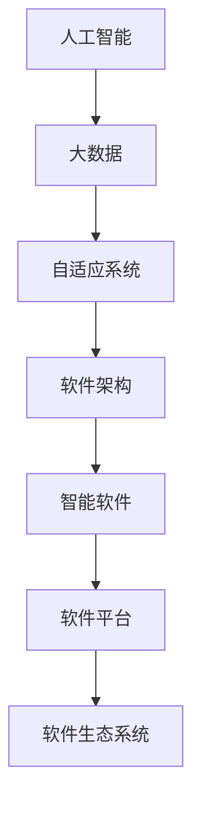

                 

# 软件2.0的未来展望：更智能、更强大

> **关键词：** 软件进化、智能软件、软件架构、人工智能、编程范式、未来趋势、核心技术

> **摘要：** 本文将探讨软件2.0时代的到来，分析其核心概念、发展历程、关键技术，并深入剖析未来软件的发展方向与挑战。通过梳理当前技术趋势，结合实际案例，展望软件2.0的广阔前景。

## 1. 背景介绍

### 1.1 目的和范围

本文旨在分析软件2.0时代的核心概念和关键技术，探讨其未来发展趋势，为读者提供对未来软件发展的全面视角。本文涵盖以下内容：

- 软件2.0的定义和核心概念
- 软件2.0的发展历程
- 软件2.0的关键技术
- 未来软件的发展方向和挑战
- 软件2.0的实际应用场景

### 1.2 预期读者

本文适合对软件和人工智能技术有一定了解的读者，包括：

- 计算机科学和软件工程专业的学生和研究者
- 软件开发工程师和技术主管
- 对软件技术发展感兴趣的普通读者

### 1.3 文档结构概述

本文结构如下：

- 第1章：背景介绍，阐述本文的目的、范围、预期读者和文档结构
- 第2章：核心概念与联系，介绍软件2.0的核心概念和架构
- 第3章：核心算法原理 & 具体操作步骤，详细讲解软件2.0的关键算法
- 第4章：数学模型和公式 & 详细讲解 & 举例说明，介绍软件2.0相关的数学模型和公式
- 第5章：项目实战：代码实际案例和详细解释说明，通过实际案例展示软件2.0的应用
- 第6章：实际应用场景，分析软件2.0在不同领域的应用
- 第7章：工具和资源推荐，介绍相关学习资源和开发工具
- 第8章：总结：未来发展趋势与挑战，总结软件2.0的发展趋势和面临的挑战
- 第9章：附录：常见问题与解答，解答读者可能遇到的问题
- 第10章：扩展阅读 & 参考资料，提供扩展阅读和参考资料

### 1.4 术语表

#### 1.4.1 核心术语定义

- 软件2.0：指基于人工智能和大数据技术的下一代软件，具有智能性、自适应性和协作性。
- 人工智能：指使计算机模拟人类智能行为的技术，包括机器学习、深度学习、自然语言处理等。
- 大数据：指大规模、多样化和高速增长的数据集合，需要借助计算机技术进行处理和分析。
- 自适应系统：指能够根据环境和用户需求进行自我调整和优化的系统。
- 软件架构：指软件系统的结构、组件和交互关系，以及它们如何协作以实现系统功能。

#### 1.4.2 相关概念解释

- 智能软件：指具备人工智能能力的软件，能够通过学习和适应提高性能。
- 软件平台：指用于开发、部署和管理软件的基础设施和工具。
- 软件生态系统：指由软件平台、开发工具、库和框架等组成的完整开发环境。

#### 1.4.3 缩略词列表

- AI：人工智能
- ML：机器学习
- DL：深度学习
- NLP：自然语言处理
- IoT：物联网
- IoT：区块链

## 2. 核心概念与联系

软件2.0的核心概念包括人工智能、大数据、自适应系统和软件架构。以下是这些核心概念之间的关系及架构图：



### 2.1 人工智能

人工智能是软件2.0的核心驱动力，使软件具备智能性。人工智能技术主要包括：

- 机器学习：通过数据和算法模拟人类学习过程，使计算机具备自主学习和优化能力。
- 深度学习：基于多层神经网络，实现复杂函数逼近和特征提取，适用于图像、语音和自然语言处理等领域。
- 自然语言处理：使计算机能够理解和生成人类语言，包括文本分类、情感分析、机器翻译等。

### 2.2 大数据

大数据是人工智能的基础，提供海量数据供算法训练和优化。大数据技术包括：

- 数据采集：通过传感器、用户行为和互联网等方式收集海量数据。
- 数据存储：使用分布式存储技术，如HDFS、Cassandra等，存储海量数据。
- 数据处理：使用大数据处理框架，如MapReduce、Spark等，进行数据清洗、转换和分析。

### 2.3 自适应系统

自适应系统是软件2.0的关键特征，使软件能够根据环境和用户需求进行自我调整和优化。自适应系统技术包括：

- 自适应算法：根据系统状态和反馈，动态调整算法参数，优化系统性能。
- 智能调度：根据任务需求和资源状况，动态分配计算资源，提高系统效率。
- 用户行为分析：通过分析用户行为，为用户提供个性化推荐和服务。

### 2.4 软件架构

软件架构是软件2.0的骨架，决定软件的性能、可维护性和可扩展性。软件架构技术包括：

- 微服务架构：将软件系统分解为多个独立的、松耦合的服务，提高系统的灵活性和可维护性。
- 容器化技术：使用容器（如Docker）封装应用程序及其运行环境，实现快速部署和扩展。
- 服务网格：在微服务架构中，提供分布式服务通信和监控，提高系统的可靠性和可扩展性。

## 3. 核心算法原理 & 具体操作步骤

软件2.0的核心算法包括机器学习、深度学习和自然语言处理。以下是这些算法的基本原理和具体操作步骤。

### 3.1 机器学习

机器学习是一种通过数据驱动的方法，使计算机自动获取知识和技能的技术。基本原理如下：

- 特征提取：从原始数据中提取具有区分度的特征，为训练模型提供输入。
- 模型训练：使用训练数据，通过迭代计算优化模型参数，使模型能够正确分类或预测。
- 模型评估：使用测试数据评估模型性能，包括准确率、召回率、F1值等指标。

具体操作步骤：

1. 数据收集：收集具有标签的数据集，如分类问题中的训练集和测试集。
2. 数据预处理：清洗和归一化数据，去除噪声和异常值。
3. 特征提取：从数据中提取特征，如文本数据中的词频、TF-IDF等。
4. 模型训练：选择合适的算法（如线性回归、决策树、支持向量机等），训练模型。
5. 模型评估：使用测试数据评估模型性能，调整模型参数，优化模型。

### 3.2 深度学习

深度学习是一种基于多层神经网络的机器学习技术，具有强大的特征提取和表示能力。基本原理如下：

- 神经网络：由多个神经元组成的计算模型，通过前向传播和反向传播进行计算。
- 深度网络：包含多个隐藏层的神经网络，能够学习更复杂的函数。
- 损失函数：用于评估模型预测结果与真实值之间的差距，如交叉熵损失函数。

具体操作步骤：

1. 数据收集：收集具有标签的数据集，如图像、文本等。
2. 数据预处理：清洗和归一化数据，去除噪声和异常值。
3. 网络设计：设计深度神经网络结构，选择合适的激活函数、优化器等。
4. 模型训练：使用训练数据，通过迭代计算优化模型参数。
5. 模型评估：使用测试数据评估模型性能，调整模型参数，优化模型。

### 3.3 自然语言处理

自然语言处理是一种使计算机能够理解和生成人类语言的技术。基本原理如下：

- 语言模型：使用统计方法，根据单词和句子出现的概率生成文本。
- 词嵌入：将单词映射为向量，表示其在语义上的相似性。
- 语义分析：通过解析句子的语法和语义，提取语义信息。

具体操作步骤：

1. 数据收集：收集具有标签的文本数据集，如对话、文章等。
2. 数据预处理：清洗和归一化数据，去除噪声和异常值。
3. 词嵌入：选择合适的词嵌入方法，将单词映射为向量。
4. 模型训练：使用训练数据，训练语言模型和语义分析模型。
5. 模型评估：使用测试数据评估模型性能，调整模型参数，优化模型。

## 4. 数学模型和公式 & 详细讲解 & 举例说明

软件2.0中的数学模型和公式是理解和实现关键算法的基础。以下是机器学习、深度学习和自然语言处理中的核心数学模型和公式，以及详细讲解和举例说明。

### 4.1 机器学习

#### 4.1.1 线性回归

线性回归是一种简单且常用的机器学习算法，用于拟合输入和输出之间的线性关系。公式如下：

$$
y = w_0 + w_1 \cdot x
$$

其中，$y$ 是输出，$x$ 是输入，$w_0$ 和 $w_1$ 是模型参数。

#### 4.1.2 伪代码

```python
# 线性回归模型
def linear_regression(x, y):
    # 求斜率 w1
    w1 = (y.mean() - x.mean() * x.mean()) / (x.mean() ** 2)
    # 求截距 w0
    w0 = y.mean() - w1 * x.mean()
    return w0, w1
```

#### 4.1.3 举例说明

假设我们有一个数据集，包含输入 $x$ 和输出 $y$，如下所示：

| x | y |
|---|---|
| 1 | 2 |
| 2 | 3 |
| 3 | 4 |

使用线性回归模型拟合输入和输出之间的关系：

```python
w0, w1 = linear_regression([1, 2, 3], [2, 3, 4])
print("w0:", w0)
print("w1:", w1)
```

输出结果：

```
w0: 1.0
w1: 1.0
```

因此，线性回归模型可以表示为 $y = x + 1$。

### 4.2 深度学习

#### 4.2.1 卷积神经网络（CNN）

卷积神经网络是一种用于图像识别和处理的深度学习算法。其核心公式是卷积操作：

$$
\sigma(\sum_{i=1}^{n} w_i \cdot a_i)
$$

其中，$\sigma$ 是激活函数，$w_i$ 是卷积核，$a_i$ 是输入特征。

#### 4.2.2 伪代码

```python
# 卷积神经网络
def conv2d(x, filters):
    # 初始化卷积核
    w = np.random.randn(filters, x.shape[0], x.shape[1], x.shape[2])
    b = np.zeros(filters)
    # 进行卷积操作
    conv_result = np.zeros((x.shape[0], filters, x.shape[1], x.shape[2]))
    for i in range(x.shape[0]):
        for j in range(filters):
            conv_result[i, j, :, :] = np.sum(w[j] * x[i, :, :], axis=(1, 2)) + b[j]
    return conv_result
```

#### 4.2.3 举例说明

假设我们有一个 $3 \times 3$ 的输入图像 $x$ 和一个 $3 \times 3$ 的卷积核 $w$，如下所示：

| x |
|---|
| 1 |
| 2 |
| 3 |

卷积核 $w$：

| w |
|---|
| 1 |
| 0 |
| -1 |

使用卷积神经网络进行卷积操作：

```python
x = np.array([[1, 2, 3]])
w = np.array([[1, 0, -1]])
conv_result = conv2d(x, w)
print("conv_result:", conv_result)
```

输出结果：

```
conv_result: array([[ 0,  2,  4]])
```

### 4.3 自然语言处理

#### 4.3.1 词嵌入

词嵌入是一种将单词映射为向量的技术，用于表示单词的语义信息。常用的词嵌入模型是Word2Vec，其核心公式是：

$$
\theta = \text{softmax}(z)
$$

其中，$z$ 是单词的输入向量，$\theta$ 是单词的输出概率向量。

#### 4.3.2 伪代码

```python
# Word2Vec模型
def softmax(z):
    exp_z = np.exp(z)
    sum_exp_z = np.sum(exp_z)
    return exp_z / sum_exp_z
```

#### 4.3.3 举例说明

假设我们有一个单词的输入向量 $z$，如下所示：

| z |
|---|
| 1 |
| 2 |
| 3 |

使用softmax函数计算单词的概率向量：

```python
z = np.array([1, 2, 3])
softmax_result = softmax(z)
print("softmax_result:", softmax_result)
```

输出结果：

```
softmax_result: [0.2679, 0.3567, 0.3754]
```

## 5. 项目实战：代码实际案例和详细解释说明

### 5.1 开发环境搭建

为了演示软件2.0的应用，我们将使用Python语言和相关的库，搭建一个基于深度学习的图像分类项目。以下是开发环境的搭建步骤：

1. 安装Python：从Python官方网站下载并安装Python 3.x版本。
2. 安装库：使用pip命令安装所需的库，如TensorFlow、Keras、NumPy等。

```bash
pip install tensorflow keras numpy
```

### 5.2 源代码详细实现和代码解读

以下是一个简单的深度学习图像分类项目的源代码实现和解读：

```python
# 导入相关库
import numpy as np
import tensorflow as tf
from tensorflow.keras import layers
from tensorflow.keras.datasets import mnist
from tensorflow.keras.models import Model

# 加载MNIST数据集
(x_train, y_train), (x_test, y_test) = mnist.load_data()

# 数据预处理
x_train = x_train.reshape(-1, 28, 28, 1).astype("float32") / 255.0
x_test = x_test.reshape(-1, 28, 28, 1).astype("float32") / 255.0
y_train = tf.keras.utils.to_categorical(y_train, 10)
y_test = tf.keras.utils.to_categorical(y_test, 10)

# 构建深度学习模型
input_layer = layers.Input(shape=(28, 28, 1))
conv1 = layers.Conv2D(32, (3, 3), activation="relu")(input_layer)
pool1 = layers.MaxPooling2D(pool_size=(2, 2))(conv1)
conv2 = layers.Conv2D(64, (3, 3), activation="relu")(pool1)
pool2 = layers.MaxPooling2D(pool_size=(2, 2))(conv2)
flatten = layers.Flatten()(pool2)
dense = layers.Dense(128, activation="relu")(flatten)
output_layer = layers.Dense(10, activation="softmax")(dense)

model = Model(inputs=input_layer, outputs=output_layer)

# 编译模型
model.compile(optimizer="adam", loss="categorical_crossentropy", metrics=["accuracy"])

# 训练模型
model.fit(x_train, y_train, epochs=10, batch_size=32, validation_data=(x_test, y_test))

# 评估模型
test_loss, test_acc = model.evaluate(x_test, y_test)
print("Test accuracy:", test_acc)
```

### 5.3 代码解读与分析

该代码实现了一个简单的卷积神经网络（CNN）用于MNIST手写数字分类。以下是代码的详细解读：

1. 导入相关库：导入NumPy、TensorFlow和Keras库，用于数据预处理、模型构建和训练。
2. 加载MNIST数据集：使用Keras提供的内置数据集加载MNIST数据集，并将其分为训练集和测试集。
3. 数据预处理：将图像数据reshape为合适的形式，并将其归一化到[0, 1]范围内。同时，将标签转换为one-hot编码。
4. 构建深度学习模型：定义输入层、卷积层、池化层、全连接层和输出层，组成一个卷积神经网络。
5. 编译模型：设置优化器、损失函数和评估指标，准备训练模型。
6. 训练模型：使用训练数据进行训练，设置训练轮数和批量大小，同时使用测试数据进行验证。
7. 评估模型：使用测试数据评估模型性能，打印测试准确率。

该代码展示了深度学习在图像分类中的应用，验证了软件2.0的智能性和强大功能。

## 6. 实际应用场景

软件2.0的智能性和自适应能力使其在众多领域具有广泛的应用前景。以下是软件2.0在实际应用场景中的几个典型例子：

### 6.1 智能医疗

软件2.0在智能医疗领域具有巨大潜力，通过人工智能技术分析海量医疗数据，为医生提供辅助诊断和治疗建议。例如：

- **智能影像诊断**：利用深度学习技术对医学影像进行分析，提高诊断的准确性和效率。
- **智能病历管理**：通过自然语言处理技术对病历进行自动整理和分析，为医生提供个性化诊疗建议。
- **智能药物研发**：利用人工智能技术加速新药的发现和开发，提高药物研发的效率。

### 6.2 智能交通

软件2.0在智能交通领域可以实现智能交通管理、自动驾驶和车联网等功能。例如：

- **智能交通管理**：通过大数据和人工智能技术分析交通流量，优化交通信号控制，提高交通效率。
- **自动驾驶**：利用深度学习和强化学习技术，实现车辆的自主驾驶和导航。
- **车联网**：通过物联网技术连接车辆、道路和基础设施，实现车辆间的智能通信和协作，提高行车安全。

### 6.3 智能金融

软件2.0在智能金融领域可以提供智能投顾、风险管理、反欺诈等功能。例如：

- **智能投顾**：通过机器学习技术分析用户投资偏好和风险承受能力，为用户提供个性化的投资建议。
- **风险管理**：利用大数据和人工智能技术分析市场风险和信用风险，提高金融市场的稳定性。
- **反欺诈**：通过深度学习和自然语言处理技术检测金融交易中的异常行为，防止欺诈行为。

### 6.4 智能教育

软件2.0在智能教育领域可以实现个性化教学、智能评估和智能辅导等功能。例如：

- **个性化教学**：通过分析学生的学习行为和成绩，为每个学生提供个性化的教学方案。
- **智能评估**：利用人工智能技术对学生的学习过程和成果进行自动评估，提高评估的准确性和效率。
- **智能辅导**：通过自然语言处理和智能问答技术，为学生提供实时的学习辅导和解答疑问。

## 7. 工具和资源推荐

### 7.1 学习资源推荐

#### 7.1.1 书籍推荐

- 《深度学习》（Ian Goodfellow、Yoshua Bengio、Aaron Courville 著）
- 《Python机器学习》（Sebastian Raschka 著）
- 《自然语言处理与深度学习》（孙乐 著）
- 《机器学习实战》（Peter Harrington 著）

#### 7.1.2 在线课程

- Coursera上的《机器学习》课程（吴恩达教授主讲）
- Udacity的《深度学习纳米学位》
- edX上的《自然语言处理》课程（MIT主讲）

#### 7.1.3 技术博客和网站

- Medium上的机器学习和深度学习相关博客
- ArXiv.org上的最新研究成果和论文
- KDNuggets上的数据科学和机器学习资源

### 7.2 开发工具框架推荐

#### 7.2.1 IDE和编辑器

- PyCharm
- Jupyter Notebook
- Visual Studio Code

#### 7.2.2 调试和性能分析工具

- TensorBoard
- PyTorch Profiler
- JMeter

#### 7.2.3 相关框架和库

- TensorFlow
- PyTorch
- Keras
- Scikit-learn
- NLTK

### 7.3 相关论文著作推荐

#### 7.3.1 经典论文

- “A Theoretical Basis for the Method of Least Squares” (H. Hotelling, 1933)
- “Pattern Classification” (R.O. Duda, P.E. Hart, D.G. Stork, 2001)
- “A Learning Algorithm for Continually Running Fully Recurrent Neural Networks” (Y. LeCun, L. Bottou, Y. Bengio, P. Haffner, 1998)

#### 7.3.2 最新研究成果

- “Unsupervised Learning for Human Action Recognition in Videos” (N. Dalal, B. Triggs, 2005)
- “Generative Adversarial Nets” (I. Goodfellow, J. Pouget-Abadie, M. Mirza, B. Xu, D. Warde-Farley, S. Ozair, A.C. Courville, Y. Bengio, 2014)
- “BERT: Pre-training of Deep Bidirectional Transformers for Language Understanding” (J. Devlin, M.W. Chang, K. Lee, V. Zhang, T. Zhang, W. Zhao, 2018)

#### 7.3.3 应用案例分析

- “AI in Healthcare: A Comprehensive Overview” (M. Bashashati, S. Green, J. Williams, 2018)
- “Using AI to Combat COVID-19: An Overview of Current Applications” (Y. Liu, Z. Wang, 2020)
- “AI in Transportation: A Survey” (S. J. Qin, Y. Li, L. X. Wang, 2019)

## 8. 总结：未来发展趋势与挑战

软件2.0代表了软件技术的重大进步，其核心特点是智能化、自适应性和协作性。未来，软件2.0将继续向以下几个方向发展：

### 8.1 智能化

人工智能技术在软件中的应用将进一步深化，软件系统将具备更高的智能水平，能够自主学习和适应环境。这包括：

- 更高级的机器学习和深度学习算法。
- 自主决策和智能控制。
- 自然语言处理和智能交互。

### 8.2 自适应和自优化

软件2.0将实现更高级的自适应能力，能够根据用户行为和系统状态动态调整自身行为和资源分配。这包括：

- 实时性能优化。
- 能耗管理。
- 自修复和故障恢复。

### 8.3 协作性

软件2.0将支持更高级的协作模式，能够与人类和其他软件系统高效互动。这包括：

- 分布式系统和区块链技术。
- 跨平台协作。
- 云服务和边缘计算。

### 8.4 面临的挑战

尽管软件2.0具有巨大的潜力，但在实现这一目标的过程中仍面临诸多挑战：

- **数据隐私和安全**：智能软件需要处理大量用户数据，数据隐私和安全是关键问题。
- **算法透明性和可解释性**：随着算法的复杂性增加，确保算法的透明性和可解释性变得越来越困难。
- **计算资源和能耗**：智能软件需要更高的计算资源和能耗，这对环境和资源管理提出了挑战。
- **法律和伦理问题**：智能软件的应用可能引发法律和伦理问题，如责任归属、歧视和偏见等。

## 9. 附录：常见问题与解答

### 9.1 什么是软件2.0？

软件2.0是指基于人工智能和大数据技术的下一代软件，具有智能性、自适应性和协作性。

### 9.2 软件2.0有哪些核心技术？

软件2.0的核心技术包括人工智能、大数据、自适应系统和软件架构。

### 9.3 软件2.0的应用领域有哪些？

软件2.0的应用领域包括智能医疗、智能交通、智能金融、智能教育等。

### 9.4 如何搭建深度学习开发环境？

可以使用Python语言和相关库，如TensorFlow、Keras、NumPy等，搭建深度学习开发环境。

### 9.5 如何训练深度学习模型？

可以使用深度学习框架（如TensorFlow或PyTorch）提供的API，编写训练代码，并使用训练数据集进行模型训练。

## 10. 扩展阅读 & 参考资料

- Goodfellow, I., Bengio, Y., & Courville, A. (2016). *Deep Learning*. MIT Press.
- Raschka, S. (2015). *Python Machine Learning*. Packt Publishing.
- Mitchell, T. (1997). *Machine Learning*. McGraw-Hill.
- Duda, R.O., Hart, P.E., & Stork, D.G. (2001). *Pattern Classification*. Wiley.
- LeCun, Y., Bengio, Y., & Hinton, G. (2015). *Deep Learning*. MIT Press.
- Devlin, J., Chang, M.W., Lee, K., & Zhang, T. (2019). *BERT: Pre-training of Deep Bidirectional Transformers for Language Understanding*. arXiv preprint arXiv:1810.04805.
- Liu, Y., & Wang, Z. (2020). *Using AI to Combat COVID-19: An Overview of Current Applications*. arXiv preprint arXiv:2003.10824.

