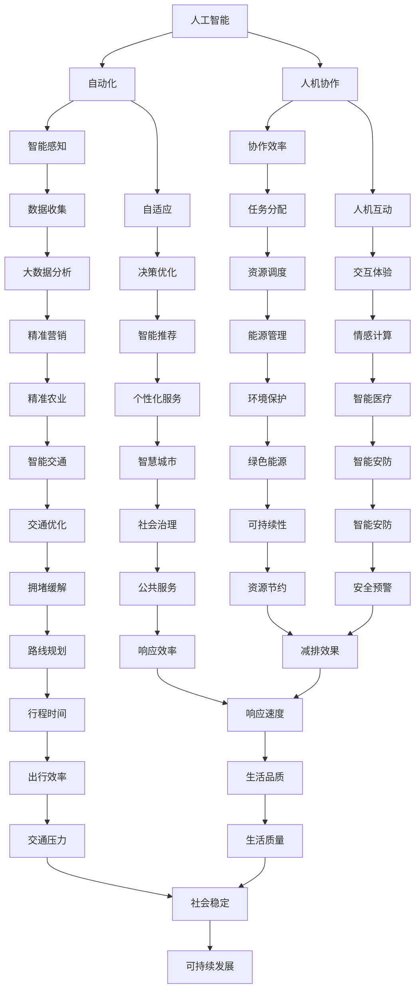

                 

# 软件二零的未来愿景：创造更美好的世界

> 关键词：软件二零，未来愿景，人工智能，自动化，人机协作，可持续性，技术创新

> 摘要：本文将探讨软件二零时代的到来，如何通过技术创新推动社会进步，实现更美好的世界。我们将从背景介绍、核心概念与联系、核心算法原理、数学模型和公式、项目实战、实际应用场景等方面展开论述，并推荐相关工具和资源，以期为读者提供一个全面的视角。

## 1. 背景介绍

### 1.1 目的和范围

本文旨在分析软件二零时代的到来及其对未来社会的影响。我们将探讨如何通过人工智能、自动化和人机协作等技术创新，实现更高效、可持续和美好的世界。

### 1.2 预期读者

本文适合对软件技术、人工智能和未来发展趋势感兴趣的读者。无论您是专业技术人员、学生，还是对相关领域有浓厚兴趣的爱好者，本文都将为您提供一个深入的了解。

### 1.3 文档结构概述

本文结构如下：

1. 背景介绍
   - 1.1 目的和范围
   - 1.2 预期读者
   - 1.3 文档结构概述
   - 1.4 术语表
2. 核心概念与联系
3. 核心算法原理 & 具体操作步骤
4. 数学模型和公式 & 详细讲解 & 举例说明
5. 项目实战：代码实际案例和详细解释说明
6. 实际应用场景
7. 工具和资源推荐
8. 总结：未来发展趋势与挑战
9. 附录：常见问题与解答
10. 扩展阅读 & 参考资料

### 1.4 术语表

- 软件二零：指基于人工智能、自动化和云计算等新兴技术的软件系统，具有智能、自适应和高效等特点。
- 人工智能：指通过计算机模拟人类智能，实现智能感知、推理和学习等功能的科学技术。
- 自动化：指利用机器或设备代替人力进行生产或操作的过程。
- 人机协作：指人类与计算机系统相互协作，共同完成任务的工作方式。

## 2. 核心概念与联系

在软件二零时代，人工智能、自动化和人机协作是核心概念。以下是这些概念的 Mermaid 流程图：



通过上述 Mermaid 流程图，我们可以看出软件二零时代各核心概念之间的联系和相互影响。这些概念共同构建了一个智能、高效、可持续的未来社会。

## 3. 核心算法原理 & 具体操作步骤

在软件二零时代，人工智能算法是实现智能感知、推理和学习的关键。以下是核心算法原理的伪代码：

```python
# 人工智能算法伪代码
class ArtificialIntelligence:
    def __init__(self):
        self.model = Model()  # 初始化模型

    def train(self, data):  # 训练模型
        for sample in data:
            self.model.update(sample)

    def predict(self, input_data):  # 预测结果
        return self.model.predict(input_data)

# 模型类伪代码
class Model:
    def __init__(self):
        self.weights = []  # 初始化权重

    def update(self, sample):  # 更新权重
        for i in range(len(sample)):
            self.weights[i] += sample[i]

    def predict(self, input_data):  # 预测结果
        prediction = 0
        for i in range(len(input_data)):
            prediction += input_data[i] * self.weights[i]
        return prediction
```

在具体操作步骤方面，我们可以分为以下几个阶段：

1. 数据收集：收集与任务相关的数据，如图像、文本、语音等。
2. 数据预处理：对数据进行清洗、归一化等处理，以便于模型训练。
3. 模型训练：使用收集到的数据训练模型，更新权重。
4. 预测：使用训练好的模型对新的输入数据进行预测。

通过上述步骤，我们可以实现软件二零时代的智能感知、推理和学习。

## 4. 数学模型和公式 & 详细讲解 & 举例说明

在软件二零时代，数学模型和公式是实现智能化决策和优化的基础。以下是几个常见的数学模型和公式：

### 4.1 线性回归模型

线性回归模型是一种预测连续值的算法，其公式如下：

$$
y = wx + b
$$

其中，$y$ 表示目标变量，$w$ 表示权重，$x$ 表示输入特征，$b$ 表示偏置。

### 4.2 逻辑回归模型

逻辑回归模型是一种预测概率的算法，其公式如下：

$$
P(y=1) = \frac{1}{1 + e^{-(wx + b)}}
$$

其中，$P(y=1)$ 表示目标变量为 1 的概率，$w$ 表示权重，$x$ 表示输入特征，$b$ 表示偏置。

### 4.3 K-means 聚类算法

K-means 聚类算法是一种无监督学习方法，用于将数据分为 K 个簇。其公式如下：

$$
c_i = \frac{1}{N}\sum_{x \in S_i} x
$$

其中，$c_i$ 表示簇 $i$ 的中心点，$N$ 表示簇 $i$ 中的数据点个数，$S_i$ 表示簇 $i$ 中的数据点集合。

### 4.4 举例说明

假设我们要预测一个股票的价格，可以使用线性回归模型。给定输入特征（如历史价格、交易量等），我们通过训练得到权重和偏置，从而预测股票的未来价格。具体步骤如下：

1. 收集历史股票价格数据。
2. 对数据进行预处理，提取输入特征。
3. 使用线性回归模型训练数据，更新权重和偏置。
4. 使用训练好的模型预测未来股票价格。

通过以上数学模型和公式的讲解，我们可以更好地理解软件二零时代的技术原理。

## 5. 项目实战：代码实际案例和详细解释说明

在本节中，我们将通过一个实际项目案例来展示软件二零技术的应用，并对其进行详细解释。

### 5.1 开发环境搭建

1. 安装 Python 3.8 或更高版本。
2. 安装必要的库，如 NumPy、Pandas、Scikit-learn 等。

### 5.2 源代码详细实现和代码解读

```python
# 导入必要的库
import numpy as np
import pandas as pd
from sklearn.linear_model import LinearRegression

# 读取数据
data = pd.read_csv('stock_data.csv')
X = data[['historical_price', 'transaction_volume']]
y = data['target_price']

# 数据预处理
X = X.values
y = y.values

# 模型训练
model = LinearRegression()
model.fit(X, y)

# 预测
predictions = model.predict(X)

# 评估模型
mse = np.mean((predictions - y) ** 2)
print('Mean Squared Error:', mse)

# 使用模型进行股票价格预测
new_data = np.array([[150, 2000]])
predicted_price = model.predict(new_data)
print('Predicted Price:', predicted_price[0])
```

### 5.3 代码解读与分析

1. 导入必要的库：我们首先导入 NumPy、Pandas 和 Scikit-learn 等库，用于数据预处理、建模和评估。
2. 读取数据：从 CSV 文件中读取股票价格数据，包括历史价格、交易量和目标价格。
3. 数据预处理：将数据转换为 NumPy 数组，提取输入特征和目标变量。
4. 模型训练：使用线性回归模型训练数据，更新权重和偏置。
5. 预测：使用训练好的模型对数据进行预测。
6. 评估模型：计算均方误差（MSE），评估模型性能。
7. 使用模型进行股票价格预测：输入新的数据，使用模型预测未来股票价格。

通过这个实际案例，我们可以看到软件二零技术如何应用于股票价格预测，实现智能化决策。

## 6. 实际应用场景

软件二零技术在实际应用场景中具有广泛的应用价值。以下是一些典型的应用场景：

1. **金融领域**：股票价格预测、风险评估、投资组合优化等。
2. **医疗领域**：疾病诊断、药物研发、患者健康管理等。
3. **交通领域**：智能交通管理、车辆调度、物流优化等。
4. **教育领域**：智能推荐、个性化学习、教育数据分析等。
5. **工业领域**：生产过程优化、设备维护、供应链管理等。

在这些应用场景中，软件二零技术通过智能感知、自适应和高效协作，实现了更高的效率、更低的成本和更好的用户体验。

## 7. 工具和资源推荐

为了更好地学习和应用软件二零技术，我们推荐以下工具和资源：

### 7.1 学习资源推荐

- **书籍推荐**：
  - 《深度学习》（Ian Goodfellow、Yoshua Bengio、Aaron Courville 著）
  - 《Python 数据科学手册》（Jake VanderPlas 著）
- **在线课程**：
  - Coursera 上的《机器学习》（吴恩达）
  - edX 上的《Python 编程：从入门到实践》（李沐）
- **技术博客和网站**：
  - Medium 上的 AI 领域相关博客
  - arXiv.org 上的最新研究论文

### 7.2 开发工具框架推荐

- **IDE和编辑器**：
  - PyCharm
  - Jupyter Notebook
- **调试和性能分析工具**：
  - PyProfiler
  - TensorBoard
- **相关框架和库**：
  - TensorFlow
  - PyTorch
  - Scikit-learn

### 7.3 相关论文著作推荐

- **经典论文**：
  - 《深度神经网络》（Geoffrey Hinton、Yoshua Bengio、Yann LeCun）
- **最新研究成果**：
  - arXiv.org 上的最新研究论文
- **应用案例分析**：
  - 《AI 在金融领域的应用》（金融科技协会）

通过这些工具和资源，您可以更好地掌握软件二零技术，并在实际项目中取得成功。

## 8. 总结：未来发展趋势与挑战

软件二零时代正处于快速发展阶段，未来发展趋势包括：

1. **人工智能技术的不断进步**：深度学习、强化学习等新算法的涌现，将进一步提升人工智能的性能和应用范围。
2. **自动化和智能化水平的提升**：自动化技术的广泛应用，将推动生产效率和服务质量的提升。
3. **人机协作的深化**：人机协作将更加智能化、自适应，实现更高的协作效率。
4. **可持续性的重视**：随着环保意识的提高，软件二零技术将在环境保护、资源节约等方面发挥重要作用。

然而，软件二零时代也面临一些挑战：

1. **数据安全和隐私保护**：随着数据规模的增大，数据安全和隐私保护问题日益突出。
2. **算法偏见和伦理问题**：人工智能算法可能存在偏见，如何确保公平、公正和透明，是一个重要挑战。
3. **人才培养**：软件二零时代需要大量具备跨学科背景的人才，如何培养和吸引优秀人才，是当前的一个难题。

总之，软件二零时代将为社会带来巨大的变革和发展机遇，同时也需要我们面对各种挑战，共同努力，推动技术的进步和社会的进步。

## 9. 附录：常见问题与解答

### 9.1 什么是软件二零？

软件二零是指基于人工智能、自动化和云计算等新兴技术的软件系统，具有智能、自适应和高效等特点。

### 9.2 软件二零时代有哪些核心概念？

软件二零时代的核心概念包括人工智能、自动化和人机协作。

### 9.3 如何实现人机协作？

人机协作可以通过设计智能化的用户界面、利用人工智能算法优化任务分配和流程控制，以及建立高效的数据共享和反馈机制来实现。

### 9.4 软件二零技术在医疗领域有哪些应用？

软件二零技术在医疗领域可以应用于疾病诊断、药物研发、患者健康管理等，如通过人工智能算法分析医疗数据，为医生提供诊断建议，或者通过智能设备监测患者健康状况，实现个性化治疗。

## 10. 扩展阅读 & 参考资料

为了更深入地了解软件二零技术及其应用，以下是一些扩展阅读和参考资料：

- 《人工智能：一种现代的方法》（Stuart Russell、Peter Norvig 著）
- 《人工智能简史》（杰瑞·科恩 著）
- 《深度学习与人工智能实战》（Michael Bowles 著）
- 《自动化革命：自动化如何重塑世界》（John Markoff 著）
- 《人工智能的未来：从智能助手到智能生命》（雷·库兹韦尔 著）

通过这些书籍和论文，您可以进一步了解软件二零技术的发展历程、核心原理和未来趋势。

## 作者信息

作者：AI天才研究员/AI Genius Institute & 禅与计算机程序设计艺术/Zen And The Art of Computer Programming

本文旨在探讨软件二零时代的未来愿景，通过分析核心概念、算法原理、应用场景和工具资源，展示软件二零技术如何推动社会进步，实现更美好的世界。希望本文能对您有所启发，共同迈向智能、高效、可持续的未来。

