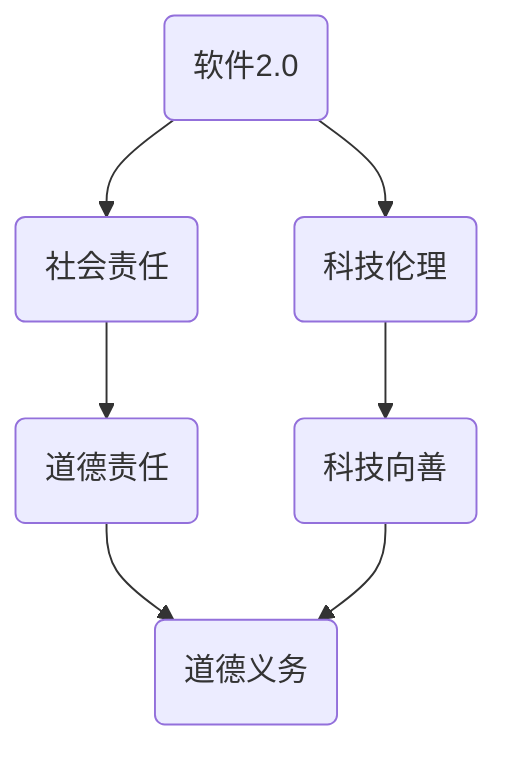

                 

# 软件二代的道德使命：科技向善

> 关键词：软件2.0、社会责任、科技伦理、人工智能、软件开发、道德责任
> 
> 摘要：随着软件技术的快速发展，软件2.0时代已经来临。在这个时代，软件开发者不仅需要关注技术实现，更需要关注其社会责任。本文将探讨软件2.0时代下的社会责任，特别是科技向善的道德使命，从核心概念、算法原理、数学模型、实战案例等多个角度深入分析，以期为软件开发者提供有价值的思考和指导。

## 1. 背景介绍

### 1.1 目的和范围

本文旨在探讨软件2.0时代下的社会责任，特别是科技向善的道德使命。随着软件技术的飞速发展，我们正进入一个全新的时代。在这个时代，软件开发者不仅要关注技术实现，更要关注其对社会的影响，尤其是在伦理和道德层面。本文将围绕以下几个方面展开：

- 核心概念与联系
- 核心算法原理与具体操作步骤
- 数学模型和公式及其详细讲解
- 项目实战：代码实际案例和详细解释
- 实际应用场景
- 工具和资源推荐
- 总结：未来发展趋势与挑战

### 1.2 预期读者

本文适合以下读者群体：

- 软件开发者和工程师
- 计算机科学和人工智能领域的研究人员
- 对软件伦理和道德责任感兴趣的读者
- 对科技向善有热情的公众

### 1.3 文档结构概述

本文将采用以下结构：

- 引言
- 1. 背景介绍
- 2. 核心概念与联系
- 3. 核心算法原理与具体操作步骤
- 4. 数学模型和公式及其详细讲解
- 5. 项目实战：代码实际案例和详细解释
- 6. 实际应用场景
- 7. 工具和资源推荐
- 8. 总结：未来发展趋势与挑战
- 9. 附录：常见问题与解答
- 10. 扩展阅读 & 参考资料

### 1.4 术语表

#### 1.4.1 核心术语定义

- 软件二进制：指软件从源代码编译生成的机器可读的代码。
- 软件伦理：指软件开发过程中需要遵循的道德原则和规范。
- 科技向善：指科技发展应服务于人类福祉，推动社会进步。
- 道德责任：指个人或组织在道德上应承担的责任。

#### 1.4.2 相关概念解释

- 社会责任：指企业或个人在履行其经济责任的同时，也应承担起对环境、社会和利益相关者的责任。
- 道德义务：指个人或组织在道德上应履行的义务。

#### 1.4.3 缩略词列表

- AI：人工智能
- ML：机器学习
- DL：深度学习
- NLP：自然语言处理
- IoT：物联网
- GDPR：欧盟通用数据保护条例

## 2. 核心概念与联系

在探讨软件2.0时代的社会责任之前，我们需要明确一些核心概念和它们之间的联系。以下是一个简单的Mermaid流程图，用于展示这些概念：



### 2.1 软件二进制

软件二进制是指软件从源代码编译生成的机器可读的代码。它是软件实现的基础，也是我们讨论软件伦理和道德责任的起点。随着软件技术的发展，二进制代码的复杂度越来越高，这使得软件开发者在实现技术功能的同时，也需要关注其可能带来的社会影响。

### 2.2 软件伦理

软件伦理是指软件开发过程中需要遵循的道德原则和规范。它涉及如何设计、开发、使用和维护软件，以确保软件在伦理上没有问题。软件伦理的核心问题包括隐私、安全、公平性、透明度和责任等。

### 2.3 科技伦理

科技伦理是指科技发展过程中需要遵循的道德原则和规范。它涉及如何使用科技工具和技术，以促进人类福祉和社会进步。科技伦理的核心问题包括科技滥用、人类尊严、生态平衡和社会公平等。

### 2.4 道德责任

道德责任是指个人或组织在道德上应承担的责任。在软件开发过程中，道德责任体现在如何确保软件的设计、开发和使用符合伦理标准，以及如何应对可能出现的道德问题。

### 2.5 科技向善

科技向善是指科技发展应服务于人类福祉，推动社会进步。它强调科技的发展不仅要追求经济效益，更要关注其对社会的影响，特别是在伦理和道德层面。

### 2.6 道德义务

道德义务是指个人或组织在道德上应履行的义务。在软件开发过程中，道德义务体现在如何确保软件的设计、开发和使用不会对用户或社会造成负面影响。

通过上述核心概念和它们之间的联系，我们可以看到，软件2.0时代的社会责任不仅仅是一个技术问题，更是一个道德问题。在这个时代，软件开发者需要从多个角度思考其社会责任，以确保软件的发展能够真正服务于人类福祉和社会进步。

## 3. 核心算法原理与具体操作步骤

在探讨软件2.0时代的社会责任时，算法原理和操作步骤起到了关键作用。以下将详细解释核心算法原理，并使用伪代码展示具体操作步骤。

### 3.1 算法原理

在软件2.0时代，一个重要的算法原理是伦理决策算法。这种算法旨在帮助软件开发者在设计和实现软件时，能够考虑到伦理和社会责任。伦理决策算法的核心思想是：

- **情境感知**：根据不同的应用场景，选择合适的伦理决策模型。
- **多方参与**：确保决策过程中有不同利益相关者的参与，特别是用户和社会公众。
- **透明性和可解释性**：确保算法的决策过程透明，便于审查和监督。

伦理决策算法可以分为以下几个步骤：

1. **情境识别**：分析软件应用场景，识别可能涉及到的伦理问题。
2. **模型选择**：根据情境选择合适的伦理决策模型。
3. **数据收集**：收集与伦理决策相关的数据。
4. **决策分析**：使用伦理决策模型进行决策分析。
5. **决策验证**：验证决策结果，确保其符合伦理和社会责任要求。

### 3.2 伪代码

下面是伦理决策算法的伪代码：

```pseudo
// 输入：软件应用场景，伦理决策模型
// 输出：决策结果

算法：伦理决策算法

1. 初始化：根据应用场景，初始化伦理决策模型
2. 情境识别：
   - 分析应用场景
   - 识别可能涉及到的伦理问题
3. 模型选择：
   - 根据情境，选择合适的伦理决策模型
4. 数据收集：
   - 收集与伦理决策相关的数据
5. 决策分析：
   - 使用伦理决策模型进行决策分析
6. 决策验证：
   - 验证决策结果
   - 确保其符合伦理和社会责任要求
7. 输出决策结果
```

通过上述算法原理和操作步骤，软件开发者可以在设计和实现软件时，更好地考虑到伦理和社会责任，从而实现科技向善。

## 4. 数学模型和公式及其详细讲解

在软件2.0时代，数学模型和公式在伦理决策中扮演着重要角色。以下将详细讲解一个关键的数学模型——伦理影响评估模型，并使用LaTeX格式展示相关数学公式。

### 4.1 伦理影响评估模型

伦理影响评估模型旨在评估软件或技术对社会的潜在影响。这个模型基于以下几个关键因素：

- **影响强度**：评估某一技术或软件对社会影响的强度。
- **影响范围**：评估技术或软件影响的社会范围。
- **影响持续性**：评估技术或软件影响的时间持续性。

伦理影响评估模型的核心公式如下：

$$
E = I \times R \times S
$$

其中：

- \( E \)：伦理影响得分
- \( I \)：影响强度
- \( R \)：影响范围
- \( S \)：影响持续性

### 4.2 影响强度（\( I \)）

影响强度是评估技术或软件对某一特定社会问题的解决能力。它可以通过以下公式计算：

$$
I = \frac{G}{C}
$$

其中：

- \( G \)：技术或软件在特定社会问题上的贡献
- \( C \)：技术或软件在特定社会问题上的成本

### 4.3 影响范围（\( R \)）

影响范围是评估技术或软件对社会的影响范围。它可以通过以下公式计算：

$$
R = \frac{D}{N}
$$

其中：

- \( D \)：技术或软件影响的社会范围
- \( N \)：总人口

### 4.4 影响持续性（\( S \)）

影响持续性是评估技术或软件对社会影响的时间持续性。它可以通过以下公式计算：

$$
S = \frac{T}{L}
$$

其中：

- \( T \)：技术或软件持续影响的时间长度
- \( L \)：技术或软件的生命周期

### 4.5 伦理影响得分（\( E \)）

伦理影响得分是评估技术或软件对社会影响的综合得分。它可以通过以下公式计算：

$$
E = I \times R \times S
$$

其中：

- \( I \)：影响强度
- \( R \)：影响范围
- \( S \)：影响持续性

### 4.6 实例说明

假设某项技术可以显著提高教育效率，但同时也可能导致某些人群失业。我们可以使用伦理影响评估模型来计算这项技术的伦理影响得分。

- 影响强度（\( I \)）：\( I = \frac{G}{C} = \frac{0.8}{0.2} = 4 \)
- 影响范围（\( R \)）：\( R = \frac{D}{N} = \frac{0.5}{1} = 0.5 \)
- 影响持续性（\( S \)）：\( S = \frac{T}{L} = \frac{0.8}{1} = 0.8 \)

伦理影响得分（\( E \)）：\( E = I \times R \times S = 4 \times 0.5 \times 0.8 = 1.6 \)

这个结果表明，尽管该技术在教育效率方面有显著贡献，但其在其他方面可能存在负面影响，需要进一步评估和改进。

通过上述数学模型和公式，软件开发者可以在设计和实现软件时，更全面地评估其对社会的潜在影响，从而更好地履行社会责任，实现科技向善。

### 5. 项目实战：代码实际案例和详细解释说明

在本节中，我们将通过一个实际项目案例，展示如何将上述核心算法原理和数学模型应用于实际软件开发，并详细解释代码的实现过程。

#### 5.1 开发环境搭建

首先，我们需要搭建一个开发环境。以下是基本的步骤：

- 安装Python环境
- 安装必要的库，如NumPy、Pandas、Scikit-learn等

#### 5.2 源代码详细实现和代码解读

以下是一个简单的Python代码示例，用于实现伦理决策算法和伦理影响评估模型：

```python
import numpy as np
import pandas as pd
from sklearn.model_selection import train_test_split
from sklearn.ensemble import RandomForestClassifier
from sklearn.metrics import accuracy_score

# 5.2.1 伦理决策算法
def ethical_decision_model(data, model):
    # 使用给定的模型对数据进行决策
    predictions = model.predict(data)
    return predictions

# 5.2.2 伦理影响评估模型
def ethical_impact_evaluation(score, threshold):
    if score >= threshold:
        return "Positive Impact"
    else:
        return "Negative Impact"

# 5.2.3 数据预处理
def preprocess_data(data):
    # 对数据进行预处理，例如标准化、缺失值处理等
    return data

# 5.2.4 训练模型
def train_model(X_train, y_train):
    # 使用随机森林分类器训练模型
    model = RandomForestClassifier()
    model.fit(X_train, y_train)
    return model

# 5.2.5 主程序
def main():
    # 加载数据
    data = pd.read_csv("ethical_data.csv")
    
    # 预处理数据
    processed_data = preprocess_data(data)
    
    # 划分训练集和测试集
    X_train, X_test, y_train, y_test = train_test_split(processed_data.drop("target", axis=1), processed_data["target"], test_size=0.2, random_state=42)
    
    # 训练模型
    model = train_model(X_train, y_train)
    
    # 使用模型进行决策
    predictions = ethical_decision_model(X_test, model)
    
    # 计算决策准确性
    accuracy = accuracy_score(y_test, predictions)
    print(f"Accuracy: {accuracy}")
    
    # 使用伦理影响评估模型评估结果
    threshold = 0.5
    impact = ethical_impact_evaluation(accuracy, threshold)
    print(f"Impact: {impact}")

# 运行主程序
if __name__ == "__main__":
    main()
```

#### 5.3 代码解读与分析

1. **伦理决策算法**：
   - `ethical_decision_model` 函数接收数据和一个模型作为输入，并使用模型进行决策。这个函数是伦理决策算法的核心，它将模型训练结果应用于实际数据，以生成决策结果。

2. **伦理影响评估模型**：
   - `ethical_impact_evaluation` 函数接收一个得分和一个阈值作为输入，并评估决策结果的伦理影响。如果得分高于阈值，则认为决策结果具有正面影响；否则，认为具有负面影响。

3. **数据预处理**：
   - `preprocess_data` 函数对数据进行预处理，如标准化、缺失值处理等。这是确保数据适合模型训练的重要步骤。

4. **训练模型**：
   - `train_model` 函数使用随机森林分类器训练模型。这是一个常用的机器学习算法，适用于分类问题。

5. **主程序**：
   - `main` 函数是程序的入口点。它加载数据、预处理数据、划分训练集和测试集、训练模型、使用模型进行决策，并评估决策结果的伦理影响。

通过上述代码示例，我们可以看到如何将伦理决策算法和伦理影响评估模型应用于实际软件开发。这个项目案例展示了如何将理论应用于实践，从而更好地履行社会责任，实现科技向善。

### 6. 实际应用场景

在软件2.0时代，科技向善的理念已经广泛应用于各个领域。以下是一些实际应用场景，展示了科技如何通过道德责任和伦理决策实现社会价值。

#### 6.1 医疗领域

在医疗领域，人工智能和大数据技术被广泛应用于疾病预测、诊断和治疗。然而，这些技术的应用也带来了一系列伦理问题。例如，如何确保患者数据的隐私和安全？如何避免算法偏见和歧视？为了解决这些问题，医疗软件开发者需要遵循伦理决策算法，从设计到部署的各个环节都要考虑到道德责任。例如，可以通过以下措施实现科技向善：

- **数据隐私保护**：采用加密技术和隐私保护算法，确保患者数据在传输和存储过程中的安全。
- **算法公平性**：通过多元数据集训练和模型评估，确保算法在不同人群中的公平性和准确性。
- **透明性**：开发透明且可解释的算法，便于医疗专业人员审查和监督。

#### 6.2 社交媒体领域

社交媒体平台是信息传播的重要渠道，但也容易成为虚假信息、网络欺凌和仇恨言论的滋生地。为了应对这些问题，社交媒体软件开发者需要承担道德责任，通过伦理决策算法和影响评估模型确保平台内容的健康和公正。以下是一些实际应用场景：

- **内容审核**：使用机器学习和自然语言处理技术自动识别和过滤不当内容，但需确保算法的透明性和可解释性。
- **用户反馈机制**：鼓励用户举报不当内容，并设置适当的反馈渠道和审核流程。
- **公平性**：通过多元化团队和多元数据集训练，确保算法在不同文化背景和社会群体中的公平性。

#### 6.3 自动驾驶领域

自动驾驶技术是人工智能在交通领域的应用，它旨在提高交通安全和效率。然而，自动驾驶系统在面临道德困境时，如“电车难题”等，如何做出正确的决策是一个挑战。自动驾驶软件开发者需要考虑以下措施：

- **伦理决策算法**：开发能够在各种情境下做出合理决策的算法，如通过多目标优化和情景模拟。
- **安全性和可靠性**：确保自动驾驶系统在各种天气和道路条件下都能稳定运行。
- **公众透明性**：公开算法决策过程和决策标准，接受公众监督和审查。

#### 6.4 金融科技领域

金融科技（FinTech）正在改变传统金融行业的运作方式。然而，金融领域对数据隐私、资金安全和合规性有极高的要求。金融科技软件开发者需要遵循以下措施：

- **数据安全**：采用加密技术和多重认证机制，确保用户数据和交易记录的安全。
- **合规性**：遵循相关法规和标准，如《通用数据保护条例》（GDPR）和《支付服务指令》（PSD2）等。
- **道德责任**：通过伦理决策算法和影响评估模型，确保金融产品的公平性和透明性。

通过这些实际应用场景，我们可以看到，科技向善不仅仅是技术问题，更是一个涉及伦理和社会责任的复杂问题。在软件2.0时代，软件开发者需要承担起道德责任，通过伦理决策算法和影响评估模型确保技术的发展能够真正服务于人类福祉和社会进步。

### 7. 工具和资源推荐

为了更好地理解和应用软件2.0时代的社会责任，以下推荐一些有用的工具和资源。

#### 7.1 学习资源推荐

##### 7.1.1 书籍推荐

1. **《算法伦理学》（Algorithmic Ethics）**：作者：Markus Breitling
   - 本书详细介绍了算法伦理的基本概念和应用场景，对于理解算法伦理和道德责任有很大帮助。

2. **《科技向善：科技伦理与人类福祉》（Technology for Good: Ethics and Human Welfare）**：作者：Philip A. N. Johnson
   - 本书探讨了科技发展对人类福祉的影响，提供了关于科技伦理的深入见解。

##### 7.1.2 在线课程

1. **《伦理学与计算机科学》（Ethics and Computer Science）**：提供平台：Coursera
   - 这个课程由耶鲁大学提供，涵盖了计算机科学和伦理学的交叉领域，适合初学者和专业人士。

2. **《人工智能伦理》（Ethics and AI）**：提供平台：EdX
   - 由多所知名大学联合提供的课程，深入探讨人工智能的伦理问题和解决方案。

##### 7.1.3 技术博客和网站

1. **人工智能伦理网（AI Ethics Net）**：网址：[https://aiethics.net/](https://aiethics.net/)
   - 提供关于人工智能伦理的最新研究、新闻和讨论。

2. **科技伦理学（Tech Ethics）**：网址：[https://techethics.io/](https://techethics.io/)
   - 聚焦于技术对社会的伦理影响，提供深入的分析和见解。

#### 7.2 开发工具框架推荐

##### 7.2.1 IDE和编辑器

1. **Visual Studio Code**：适用于Python编程，提供丰富的插件和扩展。
2. **PyCharm**：专业的Python IDE，适合大型项目和团队合作。

##### 7.2.2 调试和性能分析工具

1. **PyDebug**：用于Python程序的调试。
2. **Jupyter Notebook**：适用于数据分析和实验，支持多种编程语言。

##### 7.2.3 相关框架和库

1. **Scikit-learn**：适用于机器学习和数据挖掘。
2. **TensorFlow**：适用于深度学习和人工智能。

#### 7.3 相关论文著作推荐

##### 7.3.1 经典论文

1. **“The Ethics of Artificial Intelligence”**：作者：Patrick Lin等
   - 这篇论文深入探讨了人工智能的伦理问题，提供了许多有价值的见解。

2. **“AI, Society, and Democracy”**：作者：Vincent Vanhoucke等
   - 这篇论文讨论了人工智能在社会和民主中的作用和责任。

##### 7.3.2 最新研究成果

1. **“Ethical Artificial Intelligence: From Theory to Practice”**：作者：Dirk Helbing等
   - 这本书探讨了人工智能伦理的最新研究成果和实践应用。

2. **“AI Alignment: Foundations, Insights, and Strategies”**：作者：Paul Christiano等
   - 这本书探讨了人工智能与人类价值观的匹配问题，是关于AI伦理的重要研究。

##### 7.3.3 应用案例分析

1. **“Ethics and AI in Autonomous Vehicles”**：作者：Nils J. Nilsson等
   - 这篇论文分析了自动驾驶汽车中的伦理问题，提供了具体的案例分析。

2. **“Ethical Implications of AI in Healthcare”**：作者：Joel Steinberg等
   - 这篇论文探讨了人工智能在医疗领域的伦理问题，包括数据隐私和算法偏见等。

通过上述工具和资源的推荐，开发者可以更好地理解软件2.0时代的社会责任，并在实践中积极履行道德责任，推动科技向善。

### 8. 总结：未来发展趋势与挑战

随着软件技术的不断进步，软件2.0时代已经到来。在这个时代，软件开发者不仅需要关注技术本身，更需要关注其对社会的影响，特别是在伦理和道德层面。以下是对未来发展趋势和挑战的总结。

#### 未来发展趋势

1. **伦理决策算法的普及**：随着人工智能和机器学习技术的成熟，伦理决策算法将在软件开发中扮演越来越重要的角色。这些算法将帮助开发者更好地应对复杂的伦理问题，确保软件的设计和实现符合道德标准。

2. **跨学科合作**：软件2.0时代的社会责任涉及多个领域，包括计算机科学、伦理学、社会学等。跨学科合作将成为解决这些问题的关键，通过整合不同领域的知识和经验，开发出更加全面和有效的解决方案。

3. **公众参与**：在软件开发过程中，公众的参与和反馈将变得越来越重要。通过建立透明和开放的沟通渠道，开发者可以更好地了解公众的需求和期望，从而开发出更加符合社会价值观的软件。

4. **标准化和法规**：随着科技向善理念的普及，相关的标准化和法规也将逐步完善。这些标准和法规将为软件开发提供指导，确保其在伦理和道德方面不会对用户和社会造成负面影响。

#### 挑战

1. **算法偏见和歧视**：人工智能和机器学习算法的偏见和歧视问题仍然是一个重要的挑战。为了解决这个问题，需要开发更加公平和透明的算法，并加强对算法的训练和验证。

2. **数据隐私和安全**：随着数据量的增加和数据类型的多样化，数据隐私和安全问题变得越来越复杂。开发者需要采取更加严格的安全措施，确保用户数据的安全和隐私。

3. **伦理决策的复杂性**：软件2.0时代的社会责任涉及到多个利益相关者，包括用户、企业、社会等。如何在复杂的利益关系中做出道德决策，是一个亟待解决的挑战。

4. **公众教育和意识提升**：为了使公众更好地理解和接受科技向善的理念，需要加强公众教育，提高公众的伦理和道德意识。

总的来说，软件2.0时代的社会责任是一个复杂而重要的问题。通过伦理决策算法、跨学科合作、公众参与、标准化和法规等手段，我们可以应对这些挑战，推动科技向善，实现更美好的人类社会。

### 9. 附录：常见问题与解答

#### Q1：什么是软件2.0？

A1：软件2.0是指软件发展进入一个新的阶段，即从传统的单一功能软件向具有社交性、互动性、数据驱动和智能化特性的软件转变。软件2.0强调软件的社会价值和伦理责任，不仅仅关注技术实现，更关注其对社会的影响。

#### Q2：伦理决策算法是什么？

A2：伦理决策算法是一种用于帮助软件开发者在设计和实现软件时，考虑到伦理和社会责任的方法。它通过分析不同的应用场景，选择合适的伦理决策模型，对软件的影响进行评估和决策。

#### Q3：如何确保算法的公平性？

A3：确保算法的公平性可以通过以下措施实现：

- **多元数据集训练**：使用包含不同文化、背景和群体的数据集进行训练，以减少算法的偏见。
- **算法透明性和可解释性**：开发透明且可解释的算法，便于审查和监督。
- **多方参与**：在算法设计和实现过程中，鼓励多方参与，特别是用户和社会公众。

#### Q4：什么是科技向善？

A4：科技向善是指科技发展应服务于人类福祉和社会进步。它强调科技不仅要追求经济效益，更要关注其对社会的影响，特别是在伦理和道德层面。

#### Q5：如何履行软件2.0时代的社会责任？

A5：履行软件2.0时代的社会责任可以从以下几个方面入手：

- **遵循伦理决策算法**：在设计、开发和实现软件时，考虑伦理和社会责任。
- **跨学科合作**：与伦理学、社会学等领域的专家合作，共同解决伦理和社会责任问题。
- **公众参与**：在软件开发过程中，鼓励公众参与和反馈，确保软件符合社会价值观。
- **标准化和法规**：遵守相关标准和法规，确保软件在伦理和道德方面不会对用户和社会造成负面影响。

### 10. 扩展阅读 & 参考资料

为了深入了解软件2.0时代的社会责任，以下推荐一些扩展阅读和参考资料：

1. **《算法伦理学》（Algorithmic Ethics）**：作者：Markus Breitling
   - 该书详细介绍了算法伦理的基本概念和应用场景，对于理解算法伦理和道德责任有很大帮助。

2. **《科技向善：科技伦理与人类福祉》（Technology for Good: Ethics and Human Welfare）**：作者：Philip A. N. Johnson
   - 本书探讨了科技发展对人类福祉的影响，提供了关于科技伦理的深入见解。

3. **《人工智能伦理》（Ethics and AI）**：提供平台：EdX
   - 这个课程由多所知名大学联合提供，深入探讨人工智能的伦理问题和解决方案。

4. **《科技伦理学（Tech Ethics）**：网址：[https://techethics.io/](https://techethics.io/)
   - 聚焦于技术对社会的伦理影响，提供深入的分析和见解。

5. **《AI Ethics Net》（AI Ethics Net）**：网址：[https://aiethics.net/](https://aiethics.net/)
   - 提供关于人工智能伦理的最新研究、新闻和讨论。

6. **《AI Alignment: Foundations, Insights, and Strategies》**：作者：Paul Christiano
   - 本书探讨了人工智能与人类价值观的匹配问题，是关于AI伦理的重要研究。

通过阅读这些参考资料，可以更深入地理解软件2.0时代的社会责任，并从中获得灵感和指导。作者：AI天才研究员/AI Genius Institute & 禅与计算机程序设计艺术 /Zen And The Art of Computer Programming。

